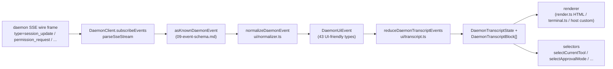

# 공유 UI 트랜스크립트 레이어

> **현재 상태**: `packages/cli/src/ui/daemon/daemon-tui-adapter.ts`는 레거시 실험적 CLI 측 어댑터로서 `main`에 여전히 존재합니다. 이 문서는 더 새로운 SDK 측 공유 UI 트랜스크립트 레이어를 설명합니다. Web, TUI, IDE, IM 채널을 포함한 모든 UI 호스트가 소비할 수 있는 재사용 가능한 데몬 이벤트 정규화 및 트랜스크립트 기본 요소입니다. CLI TUI, 채널, VS Code IDE 마이그레이션은 후속 작업입니다.

## 개요

`packages/sdk-typescript/src/daemon/ui/`는 SDK에 `ui/*` 서브패키지를 추가합니다. 데몬 SSE 이벤트 스트림을 재사용 가능한 기본 요소를 통해 UI 렌더링 가능한 트랜스크립트 블록으로 변환합니다:

- **정규화**(`normalizer.ts`): 데몬 와이어 스키마의 53개 알려진 이벤트 타입([`09-event-schema.md`](./09-event-schema.md) 참조)을 `assistant.text.delta`, `tool.update`, `session.metadata.changed`와 같은 43개의 UI 친화적 `DaemonUiEventType` 시맨틱 이벤트로 매핑합니다.
- **상태 머신**(`transcript.ts`, `store.ts`): 순수 리듀서와 구독 가능한 스토어가 UI 이벤트를 정렬된 `DaemonTranscriptBlock[]`으로 투영합니다.
- **렌더러**(`render.ts`, `terminal.ts`, `toolPreview.ts`): 트랜스크립트 블록을 HTML, 터미널 텍스트, 도구 미리보기 문자열로 변환합니다. 호스트는 이를 사용하거나 교체할 수 있습니다.
- **적합성**(`conformance.ts`): 채널, TUI, IDE 표면이 이 기본 요소로 마이그레이션할 때 사용되는 교차 호스트 일관성 테스트.

첫 프로덕션 소비자는 **`packages/webui/src/daemon/`**([#4328](https://github.com/QwenLM/qwen-code/pull/4328))입니다. React `DaemonSessionProvider`와 트랜스크립트 어댑터를 통해 웹 UI가 호스트 `postMessage` 트래픽만 렌더링하는 대신 데몬 HTTP+SSE에 직접 연결할 수 있습니다. CLI TUI, 채널 베이스, VS Code IDE는 나중에 같은 레이어를 재사용할 수 있습니다. [`../daemon-ui/MIGRATION.md`](../daemon-ui/MIGRATION.md)에 v2 점진적 마이그레이션 가이드가 문서화되어 있습니다.

## 책임

- 53개의 데몬 와이어 이벤트를 안정된 UI 어휘(`DaemonUiEventType`)로 정규화하여 렌더러가 `rawEvent.data`를 검사하지 않아도 되게 합니다.
- 데몬 단조 SSE `eventId`를 **기본 정렬 키**로 유지하여 서로 다른 클라이언트가 동일한 순서로 트랜스크립트를 렌더링합니다.
- 순수 리듀서를 사용하여 트랜스크립트 블록을 생성하고, 대기 중인 권한, 현재 도구, 승인 모드, 도구 진행 상태, 서브에이전트 자식에 대한 셀렉터를 제공합니다.
- 기본 HTML 및 터미널 렌더러를 제공하면서 호스트별 렌더링을 허용합니다.
- 플랜 패널을 위한 `DAEMON_PLAN_TOOL_CALL_ID`와 같은 공개 상수를 노출합니다.
- 추가적 와이어 호환성을 유지합니다. 알 수 없는 이벤트 타입은 삭제되지 않고 `debug`로 정규화됩니다.

## 아키텍처

### 패키지 구조

| 파일                                             | 내보내기                                                                                                                                                           | 목적                     |
| ------------------------------------------------ | ----------------------------------------------------------------------------------------------------------------------------------------------------------------- | --------------------------- |
| `packages/sdk-typescript/src/daemon/ui/index.ts` | 서브패키지 배럴                                                                                                                                                 | 공개 진입점          |
| `ui/types.ts`                                    | `DaemonUiEventType`, 타입별 `DaemonUiEvent*` 인터페이스, `DaemonTranscriptBlock`, `DaemonTranscriptState`, `DaemonUiToolProvenance`, `DAEMON_PLAN_TOOL_CALL_ID` | 타입                       |
| `ui/normalizer.ts`                               | `normalizeDaemonEvent(evt) -> DaemonUiEvent`, `getSessionUpdatePayload(evt)`                                                                                      | 와이어-to-UI 매핑          |
| `ui/transcript.ts`                               | `createDaemonTranscriptState()`, `appendLocalUserTranscriptMessage()`, `reduceDaemonTranscriptEvents()`, `rebuildDaemonTranscriptBlockIndex()`, 셀렉터         | 상태 머신 및 셀렉터 |
| `ui/store.ts`                                    | `createDaemonTranscriptStore(initial?)`                                                                                                                           | 구독 가능한 리듀서 스토어  |
| `ui/toolPreview.ts`                              | `createDaemonToolPreview(toolEvent)`                                                                                                                              | 도구 호출 요약 텍스트      |
| `ui/render.ts`                                   | `DaemonHtmlRenderOptions`, `DaemonRenderOptions`, 렌더 함수                                                                                                | HTML 및 일반 렌더링  |
| `ui/terminal.ts`                                 | 터미널별 렌더링                                                                                                                                       | TUI 준비             |
| `ui/conformance.ts`                              | 교차 호스트 적합성 스위트                                                                                                                                      | 마이그레이션 동일성 테스트      |
| `ui/utils.ts`                                    | `DaemonUiContentPart`와 같은 헬퍼                                                                                                                             | 내부 공유 유틸리티   |

### `DaemonUiEventType` 어휘

`ui/types.ts`는 43개의 UI 이벤트 타입을 도메인별로 정의합니다.

**채팅 스트림 (Stage 1)**

- `user.text.delta`, `user.image.delta`, `user.shell.command`, `assistant.text.delta`, `assistant.done`, `thought.text.delta`
- `tool.update`, `shell.output`, `user.shell.output`
- `permission.request`, `permission.resolved`
- `model.changed`, `status`, `error`, `debug`

**세션 메타데이터**

- `session.metadata.changed`, `session.approval_mode.changed`
- `session.available_commands`, `session.state_resync_required`, `session.replay_complete`

**프롬프트 라이프사이클 (교차 클라이언트)**

- `prompt.cancelled`, `followup.suggestion`

**워크스페이스 (Wave 3-4)**

- `workspace.memory.changed`, `workspace.agent.changed`
- `workspace.tool.toggled`, `workspace.settings.changed`, `workspace.initialized`
- `workspace.mcp.budget_warning`, `workspace.mcp.child_refused`
- `workspace.mcp.server_restarted`, `workspace.mcp.server_restart_refused`

**인증 플로우 (Wave 4 OAuth)**

- `auth.device_flow.started`, `auth.device_flow.throttled`, `auth.device_flow.authorized`
- `auth.device_flow.failed`, `auth.device_flow.cancelled`

`normalizeDaemonEvent`는 53개의 데몬 알려진 와이어 이벤트를 이 어휘로 매핑합니다. 알 수 없거나 모델링되지 않았거나 잘못된 이벤트 타입은 `debug`로 정규화되고 호스트 진단을 위해 `rawEvent`를 보존합니다.

### 리듀서 및 셀렉터

```ts
// 초기 상태 생성.
const state = createDaemonTranscriptState();

// SSE 이벤트 시퀀스 적용.
const next = reduceDaemonTranscriptEvents(state, daemonUiEvents);

// 셀렉터.
selectTranscriptBlocks(state); // 모든 블록
selectTranscriptBlocksOrderedByEventId(state); // eventId 기준 정렬. 선호되는 키
selectPendingPermissionBlocks(state);
selectCurrentTool(state);
selectApprovalMode(state);
selectToolProgress(state, toolCallId);
selectSubagentChildBlocks(state, parentBlockId);
isSubagentChildBlock(block);
formatBlockTimestamp(block);
formatMissedRange(state); // state_resync_required 후 "you missed X" 텍스트
```

### 스토어

`createDaemonTranscriptStore()`는 구독과 디스패치를 제공합니다:

```ts
const store = createDaemonTranscriptStore();
store.subscribe(() => render(store.getState()));
store.dispatch(uiEvents); // 내부적으로 리듀서 실행
```

웹 UI의 `DaemonSessionProvider`는 이 스토어 위에 React 컨텍스트를 구축합니다.

## 플로우

### 단일 SSE 이벤트 엔드투엔드



호스트는 `(E)`에서 멈추고 자체 리듀서를 구현하거나, `(G)`와 제공된 셀렉터를 소비할 수 있습니다. 웹 UI는 전체 `(B) -> (H)` 경로를 사용합니다. 마이그레이션된 TUI는 `(G)`를 소비하고 Ink별 컴포넌트로 렌더링할 수 있습니다.

### `state_resync_required`

`session.state_resync_required`는 트랜스크립트 "놓친 범위" 마커로 매핑됩니다. UI 코드는 `formatMissedRange(state)`를 호출하여 "missed events X-Y"와 같은 텍스트를 렌더링할 수 있습니다. 리듀서는 `awaitingResync`를 설정하고 소비 코드가 세션의 제한된 리플레이 스냅샷 창을 다시 로드하고 래치를 해제할 때까지 일반 델타 이벤트를 건너뜁니다. 로드된 스냅샷은 `history_truncated`로 시작할 수 있습니다. 해당 마커는 상태로만 렌더링되며 추가 재동기화 루프를 시작하면 안 됩니다. 링 제거 및 `state_resync_required` 시맨틱은 [`10-event-bus.md`](./10-event-bus.md)를 참조하세요.

## 소비자

### `packages/webui/src/daemon/`

[#4328](https://github.com/QwenLM/qwen-code/pull/4328)에서 적용되었습니다.

| 파일                        | 내보내기                                                                                                                                                                                                                                                                                                                        |
| --------------------------- | ------------------------------------------------------------------------------------------------------------------------------------------------------------------------------------------------------------------------------------------------------------------------------------------------------------------------------ |
| `DaemonSessionProvider.tsx` | React `<DaemonSessionProvider />`. `useDaemonSession()`, `useDaemonTranscriptStore()`, `useDaemonTranscriptState()`, `useDaemonTranscriptBlocks()`, `useDaemonPendingPermissions()`, `useDaemonActions()`, `useDaemonConnection()` 훅. `DaemonConnectionStatus`, `DaemonConnectionState`, `DaemonSessionContextValue` 타입 |
| `transcriptAdapter.ts`      | SDK `DaemonTranscriptBlock`을 웹 UI의 `UnifiedMessage`로 적응. 마크다운 스트리밍 청크 병합 및 도구 호출 요약 포함                                                                                                                                                                                        |
| `index.ts`                  | 서브패키지 배럴                                                                                                                                                                                                                                                                                                              |

이제 웹 UI는 데몬 HTTP+SSE에 직접 연결하여 트랜스크립트를 렌더링할 수 있습니다. 기존 `ACPAdapter` 호스트 `postMessage` 경로도 계속 사용 가능합니다.

### 후속 마이그레이션

[`../daemon-ui/MIGRATION.md`](../daemon-ui/MIGRATION.md)는 웹 채팅 및 웹 터미널 어댑터를 위한 v2 점진적 가이드를 제공합니다. **CLI TUI, 채널 베이스, VS Code IDE는 해당 PR에서 마이그레이션되지 않음**을 명시합니다. 각각 후속 PR에서 이동하며 적합성 스위트를 사용하여 렌더링 동일성을 유지합니다.

## 레거시 `daemon-tui-adapter.ts`와의 관계

| 차원         | 레거시 CLI `DaemonTuiAdapter`                                   | 새로운 공유 트랜스크립트 레이어                                    |
| ----------------- | --------------------------------------------------------------- | -------------------------------------------------------------- |
| 패키지           | `packages/cli/src/ui/daemon/`                                   | `packages/sdk-typescript/src/daemon/ui/`                       |
| 공개 표면    | `DaemonTuiAdapter`, `DaemonTuiUpdate`, `DaemonTuiSessionClient` | `DaemonUiEventType`, `reduceDaemonTranscriptEvents`, 셀렉터 |
| 범위             | CLI Ink TUI만                                                | Web, TUI, IDE, IM UI                                        |
| 상태 형태       | TUI 로컬 업데이트 유니언                                          | 순수 트랜스크립트 블록 목록 + 상태 필드                   |
| 정렬          | `createdAt`                                                     | `eventId`(데몬 단조, 클라이언트 간 일관)        |
| 알 수 없는 와이어 타입 | `reduceDaemonEventToTuiUpdates`에서 삭제                      | `debug`로 정규화되어 보존                            |
| 테스트             | 단일 패키지 유닛 테스트                                       | 교차 호스트 동일성을 위한 전역 적합성 스위트                 |

## 의존성

- 업스트림 와이어 타입: `packages/sdk-typescript/src/daemon/events.ts`([`09-event-schema.md`](./09-event-schema.md) 참조).
- 실제 다운스트림 소비자: `packages/webui/src/daemon/`.
- 후속 마이그레이션 대상: `packages/cli/src/ui/`, `packages/channels/base/`, `packages/vscode-ide-companion/src/services/daemonIdeConnection.ts`.
- 병렬 참고 자료: [`../daemon-ui/README.md`](../daemon-ui/README.md), [`../daemon-ui/MIGRATION.md`](../daemon-ui/MIGRATION.md), [`../daemon-client-adapters/web-ui.md`](../daemon-client-adapters/web-ui.md).

## 설정

- 런타임 설정 없음. 리듀서와 셀렉터는 순수 함수입니다.
- 호스트가 렌더러를 선택합니다: HTML(`render.ts`), 터미널(`terminal.ts`), 또는 커스텀 렌더링.
- 디버깅을 위해 `render.ts`는 `includeRawEvent: true`를 지원하여 렌더링 출력에 원시 와이어 프레임을 포함합니다.

## 주의사항 및 알려진 제한

- **`daemon-tui-adapter.ts`가 여전히 존재합니다.** CLI 패키지의 레거시 실험적 어댑터입니다. 새 코드는 SDK `ui/*`를 선호해야 합니다: `normalizeDaemonEvent`, `reduceDaemonTranscriptEvents`, `DaemonTranscriptBlock`.
- **CLI TUI, 채널 베이스, VS Code IDE는 아직 마이그레이션되지 않았습니다.** 여전히 자체 렌더링 로직을 유지합니다. `docs/developers/daemon-client-adapters/` 디렉토리에는 여전히 `ide.md`, `channel-web.md` 및 역사적 `tui.md` 초안이 있습니다. 더 새로운 `web-ui.md`는 웹 UI 어댑터 설계를 다룹니다.
- **`eventId`가 기본 정렬 키입니다.** `createdAt`은 더 이상 사용되지 않는 별칭(`clientReceivedAt`)으로 남아 있습니다. 새 코드는 `selectTranscriptBlocksOrderedByEventId(state)`를 사용해야 합니다. `MIGRATION.md`는 `createdAt` 정렬에서 `eventId` 정렬로 전환하는 코드 변경을 보여줍니다.
- **알 수 없는 와이어 타입은 `debug`로 정규화됩니다.** 이전 어댑터와 달리 더 이상 삭제되지 않습니다. 렌더러는 기본적으로 `debug`를 표시하지 않습니다. 호스트가 표시하려면 선택적으로 활성화해야 합니다.
- **번들 크기**: `ui/*` 서브패키지는 `@qwen-code/sdk/daemon`을 통해 ESM 서브 경로로 내보내지며 React 또는 DOM 의존성을 끌어오지 않습니다. React 통합은 웹 UI 소비자가 `DaemonSessionProvider`를 사용할 때만 로드됩니다.

## 참고 자료

- `packages/sdk-typescript/src/daemon/ui/types.ts`(`DaemonUiEventType` 어휘)
- `packages/sdk-typescript/src/daemon/ui/transcript.ts`(리듀서 및 셀렉터)
- `packages/sdk-typescript/src/daemon/ui/normalizer.ts`(와이어-to-UI 매핑)
- `packages/sdk-typescript/src/daemon/ui/store.ts`, `render.ts`, `terminal.ts`, `toolPreview.ts`, `conformance.ts`
- `packages/sdk-typescript/src/daemon/index.ts`(`ui/*` 재내보내기 블록)
- `packages/webui/src/daemon/DaemonSessionProvider.tsx`, `transcriptAdapter.ts`
- 업스트림 문서: [`../daemon-ui/README.md`](../daemon-ui/README.md), [`../daemon-ui/MIGRATION.md`](../daemon-ui/MIGRATION.md), [`../daemon-client-adapters/web-ui.md`](../daemon-client-adapters/web-ui.md)
- 관련 PR: [#4328](https://github.com/QwenLM/qwen-code/pull/4328)(v1 트랜스크립트 레이어 및 웹 UI 제공자), [#4353](https://github.com/QwenLM/qwen-code/pull/4353)(v2 통합 완전성 후속)
