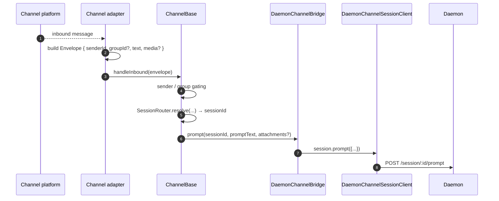
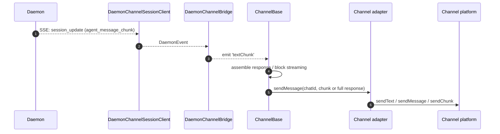
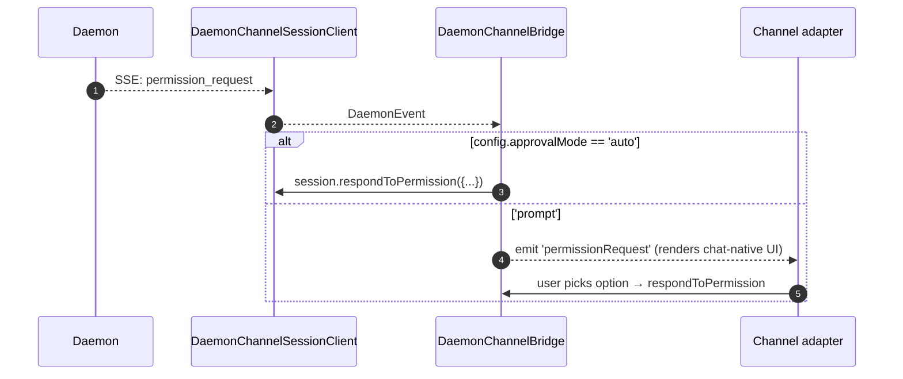

# Channel 어댑터

## 개요

`packages/channels/`는 채팅 플랫폼의 수신 메시지를 에이전트 프롬프트로 변환하고, 에이전트 응답을 다시 채팅 플랫폼으로 전송하는 **IM channel adapter**를 포함합니다. 현재 네 가지 구체적인 channel이 제공됩니다: DingTalk, WeChat(Weixin), Telegram, Feishu. 이들은 기본 레이어(`packages/channels/base/`)와 adapter 대상 `ChannelAgentBridge` 계약을 공유합니다.

현재 두 가지 호스트 모드가 있습니다:

- `qwen channel start [name]`은 독립 실행형 ACP 기반 channel 서비스입니다. adapter에 `ChannelAgentBridge`의 `AcpBridge` 구현체를 전달합니다.
- `qwen serve --channel <name>` 및 `qwen serve --channel all`은 실험적인 daemon 관리 모드입니다. 이름으로 선택한 channel은 소유 워크스페이스별로 그룹화되며, `qwen serve`는 소유 런타임당 하나의 프로세스 외부 워커를 시작합니다. 각 워커는 SDK를 통해 daemon에 연결하고, adapter는 `DaemonChannelBridge` 기반의 `ChannelAgentBridge` 페이사드를 받습니다. `--channel all`은 primary 전용 선택으로 유지됩니다.

daemon 관리 모드에서 각 channel는 설정 가능한 `SessionScope`(`user`, `chat_thread`, 또는 `single`)에 따라 수신 채팅 트래픽을 daemon 세션에 매핑합니다. 기존 설정을 위해 레거시 Channel 값 `thread`는 계속 읽고 쓸 수 있지만, 새 Web Shell 구성에서는 제공되지 않습니다. 이는 daemon 브릿지의 자체 `single`/`thread` 세션 생성 노브와는 별개입니다. `sessionScope: "user"`와 `multiSession: true`에서 `ChannelBase`는 channel, 채팅, 발신자 기준으로 키가 지정된 영속적 이름 세션 카탈로그를 추가하고, `SessionRouter`는 선택된 세션을 호환성 경로로 유지합니다. 정확한 이름 세션 로드는 레거시 로드-또는-교체 경로를 사용하지 않습니다. 이름 지정 턴은 비동기 준비 전에 정확한 세션을 예약하며, 이후 선택 변경 시에도 호환성 경로를 재바인딩하지 않고 바인딩된 상태를 유지합니다. 이름 지정 작업은 동시에 실행될 수 있으며, `/session cancel [<name>]`은 확인된 활성 프롬프트만 대상으로 하고, 일반 텍스트 권한 명령은 선택된 작업만 고려합니다. 이름 지정 턴은 전송 전용 작업 소스 레이블도 캡처합니다. 직접 메시지는 `[task]`를 사용하고, 그룹은 `[sender · task]`를 사용하며, 정확한 텍스트 권한 프롬프트는 요청 ID를 포함합니다. 이 레이블은 모델 응답이나 트랜스크립트에 추가되지 않습니다. adapter는 `DaemonChannelBridge`에 위임하고, 이는 SDK의 `DaemonSessionClient`에 위임합니다([`13-sdk-daemon-client.md`](./13-sdk-daemon-client.md) 참조). 이름이 지정된 모든 channel는 등록된 신뢰할 수 있는 워크스페이스 하나를 해석해야 합니다. 워커는 해당 런타임의 표준 cwd, `QWEN_DAEMON_WORKSPACE`, 환경 오버레이를 사용하며, 소유권 해석은 primary로 폴백하지 않습니다.

### Webhook 트리거 channel 작업

Webhook 트리거 작업은 `qwen serve`에서 호스팅되며 daemon 관리 channel 워커 내에서 실행됩니다. HTTP 라우트는 소스를 검증하고 IPC를 통해 워커에 `ChannelWebhookTask`를 전달합니다. 워커는 `ChannelBase.runWebhookTask()`를 호출하므로 adapter는 webhook 파싱을 구현하지 않습니다.

adapter는 여전히 능동적 전송 지원을 통해 참여합니다. `supportsProactiveSend()`는 channel이 수신 메시지 없이도 전송할 수 있는지 호스트에 알리고, `supportsProactiveTarget()`은 특정 대상 형태에 대한 전송 제한을 처리하며, `pushProactive()`는 발신 콘텐츠를 전달합니다.

## 책임

- channel의 기본 전송에서 수신 메시지를 받습니다(DingTalk WebSocket 스트림, WeChat HTTP 롱폴, Telegram Bot 롱폴, Feishu WebSocket 또는 HTTP webhook).
- `DaemonChannelSessionFactory`를 통해 `(senderId, groupId?)`를 daemon 세션으로 해석합니다.
- 사용자 메시지를 daemon 프롬프트로 전달하고, 응답을 발신 채팅 메시지로 스트리밍합니다(청크 분할 가능).
- 인터랙티브 모드에서는 권한 요청을 채팅 기본 프롬프트로 렌더링하고, 그렇지 않으면 `ChannelConfig.approvalMode`에 따라 자동 승인합니다.
- 발신 게이트(허용 목록 / 차단 목록), 그룹 게이트, 콘텐츠 정규화(channel별 마크다운 / HTML)를 적용합니다.

## 아키텍처

### `DaemonChannelBridge` (공유 기본, `packages/channels/base/src/DaemonChannelBridge.ts`)

```ts
class DaemonChannelBridge extends EventEmitter {
  constructor(opts: {
    cwd: string;
    sessionFactory: DaemonChannelSessionFactory;
    modelServiceId?: string;
    sessionScope?: SessionScope;
  });
  newSession(cwd: string): Promise<string>;
  loadSession(sessionId: string, cwd: string): Promise<string>;
  prompt(sessionId: string, text: string, options?): Promise<string>;
  cancelSession(sessionId: string): Promise<void>;
  stop(): void;
}
```

daemon `sessionId`로 키링된 daemon 세션 클라이언트를 보유합니다. `ChannelBase`와 `SessionRouter`가 어떤 수신 채팅 대상이 해당 세션에 매핑되는지를 결정합니다. 각 연결된 세션은 다음을 가집니다:

- `DaemonChannelSessionClient` (channel과 무관한 메서드를 제외한 `DaemonSessionClient`의 형태).
- 실시간 SSE 컨수머 펌프.
- 디바운스된 프롬프트 어셈블러(사용자 입력을 여러 수신 메시지로 분할하는 adapter용).
- 요청별 자동 승인 정책.

발생하는 이벤트: `textChunk`, `toolCall`, `sessionUpdate`, `permissionRequest`, `permissionResolved`, `modelSwitched`, `modelSwitchFailed`, `sessionDied`, `promptComplete`, `error`. Channel adapter는 이를 플랫폼 기본 API에 연결합니다.

### `ChannelBase` (`packages/channels/base/src/ChannelBase.ts`)

모든 adapter가 상속하는 추상 기본 클래스:

```ts
abstract class ChannelBase {
  abstract connect(): Promise<void>;
  abstract sendMessage(chatId: string, text: string): Promise<void>;
  abstract disconnect(): void;
  handleInbound(envelope: Envelope): Promise<void>; // → SessionRouter.resolve + bridge.prompt
}
```

모든 내부 메시지 전달은 `sendThreadMessage(chatId, threadId, text, sourceLabel)`을 통해 라우팅됩니다. 기본 구현은 `threadId`를 무시하고 `sendMessage(chatId, attributedText)`로 폴스루합니다. 폴링, 리치 카드, 미디어, 스트리밍, 플랫폼 분할 adapter는 경계를 오버라이드하여 선택적 일반 텍스트 소스 레이블이 플랫폼에 맞게 이스케이프되고, 원시 응답 상태를 변경하지 않고 독립적으로 보이는 모든 객체에서 반복되도록 합니다.

일반적인 교차 관심사를 처리합니다: 발신 게이트(허용 목록 / 차단 목록), 그룹 게이트, 메시지 블록 스트리밍(청크 크기, 스로틀링), 수신 디바운스.

### Channel별 adapter

| Adapter         | 파일                                                | 전송                                               | 참고                                                                                                                                         |
| --------------- | --------------------------------------------------- | ------------------------------------------------------ | --------------------------------------------------------------------------------------------------------------------------------------------- |
| DingTalk        | `packages/channels/dingtalk/src/DingtalkAdapter.ts` | DingTalk Stream SDK WebSocket                          | `sessionWebhook` POST로 전송; 미디어 이미지는 DT API를 통해 다운로드, envelope에 base64로 포함.                                                      |
| WeChat (Weixin) | `packages/channels/weixin/src/WeixinAdapter.ts`     | iLink Bot HTTP 롱폴                               | 독자적인 `sendText` / `sendImage` API로 전송; 타이핑 인디케이터 지원.                                                                        |
| Telegram        | `packages/channels/telegram/src/TelegramAdapter.ts` | Telegram Bot API 롱폴 (grammy)                    | `sendMessage`로 HTML 청크 전송.                                                                                                          |
| Feishu          | `packages/channels/feishu/src/FeishuAdapter.ts`     | Feishu/Lark Stream WebSocket(기본) 또는 HTTP webhook | Lark SDK를 통해 인터랙티브 카드로 전송; webhook 모드는 HMAC 서명 검증을 위해 `encryptKey` 필요.                                  |
| GitHub          | `packages/channels/github/src/GithubAdapter.ts`     | GitHub Notifications API 폴링 (`@octokit/rest`)     | `PollingChannelBase` 상속; 커서 기반 댓글 창 중복 제거; Issues API를 통해 댓글 게시.                                               |
| GitLab          | `packages/channels/gitlab/src/GitlabAdapter.ts`     | GitLab Todos API 폴링 (`@gitbeaker/rest`)           | `PollingChannelBase` 상속; `todo.body`를 직접 전달; `action_prompt_template` 설정이 이벤트 필터링과 메타데이터 렌더링을 제어. |

각 adapter는 다음을 구현합니다:

1. 수신 전송(메시지 구독 / 폴링).
2. Envelope 구성 (`{ senderId, groupId?, text, media?, raw }`).
3. 발신 / 그룹 게이트(`ChannelBase`에 위임).
4. 발신 직렬화(마크다운 → HTML / WeChat 기본 / DingTalk 기본).
5. 라이프사이클(시작 / 종료).

### Adapter 매트릭스

| Adapter      | 전송                       | 정체성                                                 | 권한 UX                       | 자동 승인 설정                               |
| ------------ | ------------------------------- | -------------------------------------------------------- | ----------------------------------- | ------------------------------------------------- |
| **DingTalk** | WebSocket 스트림                | `senderStaffId` (+ 그룹의 경우 선택적 `conversationId`) | DT 마크다운 인라인 버튼      | `ChannelConfig.approvalMode = 'auto' \| 'prompt'` |
| **WeChat**   | HTTP 롱폴                  | `senderWxid` (+ 선택적 `groupWxid`)                    | 응답 토큰이 포함된 텍스트 전용 프롬프트 | 동일                                              |
| **Telegram** | Bot API 롱폴               | `from.id` (+ 그룹의 경우 선택적 `chat.id`)              | 인라인 키보드 버튼             | 동일                                              |
| **Feishu**   | WebSocket 스트림 / HTTP webhook | `sender.open_id` (+ 그룹의 경우 선택적 `chat_id`)       | 인터랙티브 카드 버튼            | 동일                                              |
| **GitHub**   | Notifications API 폴링       | 숫자 `user.id` (불변; 연결 시 login 해석) | 에러 댓글 + 재멘션          | `senderPolicy: 'allowlist' \| 'open'`             |
| **GitLab**   | Todos API 폴링               | `author.username` (소문자화)                           | 로그 + 재멘션                    | `senderPolicy: 'allowlist' \| 'open'`             |

> **참고:** "권한 UX" 열은 각 플랫폼의 기본 기능을 설명하지만, 아직 어느 것도 연결되지 않았습니다. `AcpBridge.requestPermission`은 현재 모든 요청을 자동 승인하며(`packages/channels/base/src/AcpBridge.ts`), `ChannelConfig.approvalMode`는 선언되었지만 아직 읽히지 않습니다. 인터랙티브 승인은 계획 중입니다(Phase 5).

## 워크플로

### 수신 프롬프트



### SSE 기반 발신



### 권한 자동 승인



## 상태 및 라이프사이클

- `DaemonChannelBridge`는 channel adapter의 생존 기간 동안 유지되며, 내부 세션은 설정된 `SessionScope`에 따라 생존합니다.
- 각 활성 세션은 SSE가 끊어지면 자동으로 재연결합니다. `DaemonSessionClient.events()`는 `lastSeenEventId`를 추적하여 리플레이가 정확하도록 합니다.
- `shutdown()`은 모든 활성 세션과 기본 전송(channel의 WebSocket / 롱폴)을 닫습니다.
- DingTalk의 WebSocket 스트림은 서버 푸시를 지원합니다. WeChat의 롱폴은 유휴 응답에 대한 백오프 전략이 필요합니다. Telegram의 롱폴에는 내장 `timeout` 파라미터가 있습니다.

### 런타임 선택 및 설정 리로드

장기 실행되는 `ChannelWorkerManager`는 커밋된 daemon 선택과 워크스페이스 그룹별 슈퍼바이저를 소유합니다. daemon은 `--channel` 없이 부팅될 수 있으며, 첫 번째 엄격 게이트된 `PUT /workspace/channel`이 channel 런타임을 동적으로 로드하고, 서비스 pidfile을 예약하고, 워크스페이스 소유권을 해석하고, 선택된 워커를 시작합니다. `GET /workspace/channel`은 매니저 스냅샷을 읽고 `DELETE /workspace/channel`은 멱등적으로 중지합니다. SDK 헬퍼는 `getChannelWorkerControl()`, `setChannelWorkerSelection()`, `stopChannelWorker()`이며, CLI 진입점은 `qwen channel set`과 원격 `status` 및 `stop` 변형입니다.

daemon은 각 워커 시작 시 `settings.json`에서 channel 설정을 읽습니다(`packages/cli/src/commands/channel/daemon-worker.ts` → `loadSettings` → `loadChannelsConfig`). `POST /workspace/channel/reload`은 해당 설정을 다시 읽고 커밋된 선택을 강제로 조정합니다. 모든 라이프사이클 변경은 하나의 FIFO 레인을 공유합니다. 변경되지 않은 워크스페이스 그룹은 일반 선택 교체에서 생존합니다. 변경된 그룹은 serve 소유 PID 임대가 유지된 상태에서 순차적으로 중지되고 시작됩니다.

교체가 실패하면, 새로 시작된 워커가 중지되고 요청이 반환되기 전에 이전 워커가 복원됩니다. SIGTERM과 SIGKILL 이후에도 종료를 관찰하지 못하는 슈퍼바이저는 자식 참조를 유지하고 중지에 실패합니다. 매니저는 PID 임대를 유지하고 두 번째 워커를 시작하지 않습니다. Webhook 설정과 라우팅은 선택 커밋이 성공한 경우에만 변경됩니다. 런타임 선택은 프로세스 로컬이며 daemon 재시작 시 사라집니다.

adapter `connect()` 실패는 워커 라이프사이클 에러와 별도로 보고됩니다. 워커는 각 경계가 있고 자격 증명이 삭제된 실패를 시작 IPC를 통해 보내고, 다음 adapter를 시도하기 전에 슈퍼바이저의 확인을 기다립니다. 부분적으로 연결된 워커는 실행 상태로 유지되며 스냅샷에 `startupFailures`를 노출합니다. 동적 시도에서 모든 adapter가 실패하면, `502 channel_worker_start_failed` 응답은 워크스페이스가 주석된 시도된 실패를 전달하며 `state`는 롤백 결과를 반영합니다. 이후 GET 응답은 시도를 유지하지 않습니다. 연결된 adapter 없이 daemon이 부팅되면 fail-fast로 동작합니다. 선택적 adapter `code`는 진단용이며, 현재 `phase`는 `connect`입니다.

## 의존성

- `packages/channels/base/` — `ChannelBase`, `PollingChannelBase`, `DaemonChannelBridge`, `types.ts` (`ChannelConfig`, `Envelope`, `SessionScope`, `ChannelPlugin`).
- `packages/sdk-typescript/src/daemon/` — `DaemonSessionClient` 및 관련 모듈.
- Channel별 SDK: `@dingtalk/stream` (DingTalk), 독자적 iLink Bot HTTP (Weixin), `grammy` (Telegram), `@octokit/rest` (GitHub 폴링), `@gitbeaker/rest` (GitLab 폴링).

## 설정

`ChannelConfig` (`packages/channels/base/src/types.ts`에서):

| 설정                                     | 효과                                                                                                                                                                         |
| ---------------------------------------- | ------------------------------------------------------------------------------------------------------------------------------------------------------------------------------ |
| `sessionScope`                           | `'user'` (발신자 + 채팅), `'chat_thread'` (channel + chatId + threadId), 또는 `'single'` (channel당 하나의 공유 세션). 레거시 `'thread'`는 이미 구성된 경우 유지되지만 새 Web Shell 구성에서는 제공되지 않습니다. |
| `multiSession`                           | `sessionScope: 'user'`를 위한 daemon 전용 이름 지정 작업. 소유자 카탈로그는 워크스페이스/channel 상태 디렉토리 아래에 영속화됩니다. 작업은 동시에 실행될 수 있으며, 취소 및 권한 명령은 정확한 작업과 연관된 상태를 유지하고, 결과 및 인터랙티브 표면은 소스 작업을 식별합니다. Webhook, 그룹 히스토리 백필, 루프, 작업별 worktree는 계속 제외됩니다. |
| `approvalMode`                           | `'auto'` (자동 응답) / `'prompt'` (UI 렌더링).                                                                                                                              |
| `allowlist?: string[]`                   | 허용된 발신자 id; 없으면 개방.                                                                                                                                            |
| `denylist?: string[]`                    | 차단된 발신자 id.                                                                                                                                                             |
| `chunkSize`, `chunkIntervalMs`           | 발신 블록 스트리밍 설정.                                                                                                                                             |
| `daemon: { baseUrl, token?, clientId? }` | `DaemonChannelSessionFactory`로 전달.                                                                                                                                    |

Channel별 키가 위에 추가됩니다(DingTalk: `streamCredentials`; WeChat: `ilinkUrl`, `botId`; Telegram: `botToken`; Feishu: `clientId` (appId), `clientSecret` (appSecret), `verificationToken`, `encryptKey` (webhook 모드)).

## 주의사항 및 알려진 제한

- **Channel은 `@qwen-code/sdk`를 직접 임포트하지 않습니다.** `ChannelBase` → `DaemonChannelBridge` → `DaemonChannelSessionClient`(브릿지가 SDK에서 구성)를 통해 이동합니다. 이 간접 참조를 통해 브릿지가 channel 변경 없이 테스트 스텁과 같은 구현체를 교체할 수 있습니다.
- **권한 UX는 channel별입니다.** DingTalk은 마크다운 버튼을 사용하고, WeChat은 텍스트 전용이며, Telegram은 인라인 키보드를 사용하고, Feishu는 인터랙티브 카드 버튼을 사용합니다. (모두 현재 `AcpBridge`를 통해 자동 승인되며, 인터랙티브 승인이 계획 중입니다.) 공통 "인터랙티브 권한 위젯" 추상화는 아직 없습니다.
- **자동 승인은 배포 측 결정**이며 daemon 측 결정이 아닙니다. daemon의 `permission_mediation` 정책은 여전히 적용됩니다. 자동 승인은 channel이 사용자에게 프롬프트 없이 응답한다는 의미입니다. `auto`를 `enforce` 등급 워크플로와 함께 사용하지 마세요.
- **Channel별 속도 제한 / 메시지 크기 제한은 adapter의 책임입니다.** `DaemonChannelBridge`는 청크 처리만 담당하며, WeChat의 메시지당 크기나 Telegram의 플러드 제한을 초과하는 것은 adapter의 책임입니다.
- **DingTalk / WeChat / Telegram / Feishu 역방향 호출 없음** — channel은 단방향입니다(채팅 → daemon → 채팅). DingTalk 카드 콜백과 같은 IM 플랫폼의 기본 푸시 경로는 아직 브릿지에 연결되지 않았습니다.

## 참고 자료

- `packages/channels/base/src/DaemonChannelBridge.ts`
- `packages/channels/base/src/ChannelBase.ts`
- `packages/channels/base/src/types.ts`
- `packages/cli/src/serve/channel-worker-manager.ts` (선택 라이프사이클 + 직렬화)
- `packages/cli/src/serve/channel-worker-group.ts` (워크스페이스 차분 조정)
- `packages/cli/src/serve/channel-worker-supervisor.ts` (자식 감독)
- `packages/cli/src/serve/routes/workspace-channel-control.ts` (GET/PUT/DELETE/reload 리소스)
- `packages/channels/dingtalk/src/DingtalkAdapter.ts`
- `packages/channels/weixin/src/WeixinAdapter.ts`
- `packages/channels/telegram/src/TelegramAdapter.ts`
- `packages/channels/plugin-example/` (참조 플러그인 스캐폴드)
- Channel 플러그인 가이드: [`../channel-plugins.md`](../channel-plugins.md).
- SDK 참조: [`13-sdk-daemon-client.md`](./13-sdk-daemon-client.md).
