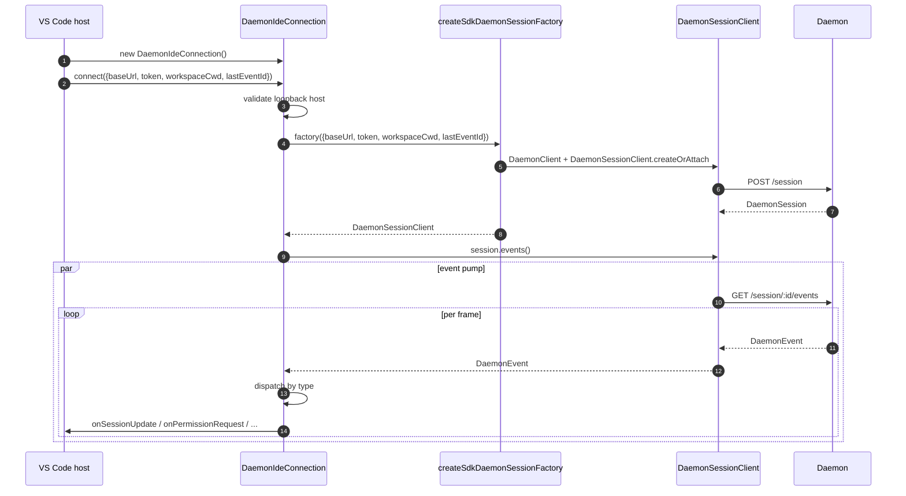
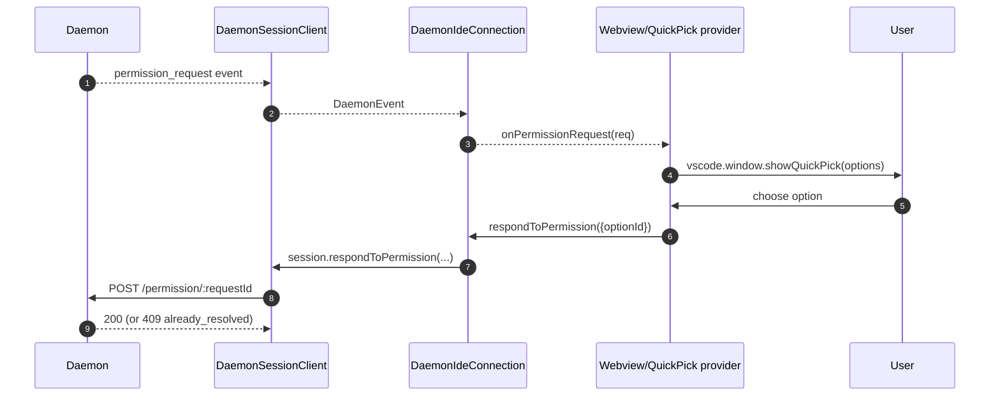
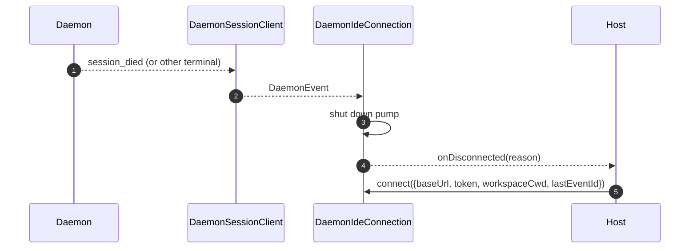

# VS Code IDE Daemon 어댑터

## 개요

`packages/vscode-ide-companion/src/services/daemonIdeConnection.ts`는 **VS Code 확장용 daemon adapter**입니다. IDE companion이 인 프로세스 `qwen --acp` stdio 자식(레거시 `AcpConnectionState` 경로)을 시작하는 대신, 실행 중인 `qwen serve` daemon에 HTTP + SSE를 통해 연결할 수 있게 합니다. VS Code 호스트를 위한 [`14-cli-tui-adapter.md`](./14-cli-tui-adapter.md)의 형제 전송에 해당합니다.

IDE의 채팅 웹뷰는 이 adapter를 통해 daemon 이벤트를 소비하며, 권한 프롬프트는 네이티브 VS Code 퀵픽 다이얼로그로 표시됩니다.

## 책임

- `connect(options)`에 전달된 루프백 검증된 `baseUrl`에서 `DaemonClient` + `DaemonSessionClient`를 구성합니다.
- 세션 클라이언트의 SSE 이벤트를 콜백별 디스패치(`onSessionUpdate`, `onPermissionRequest`, `onAskUserQuestion`, `onEndTurn`, `onDisconnected`)로 펌핑합니다.
- `connect(options)`에서 **루프백 전용** 불변식을 강제합니다(IDE는 항상 동일한 호스트의 daemon에만 연결해야 함).
- daemon 이벤트를 웹뷰 `postMessage`로 브리징하여 채팅 패널의 상태를 동기화합니다.
- VS Code의 네이티브 퀵픽 UI를 통해 권한 요청을 표시합니다.
- 호스트의 빠른 이중 `connect()` 호출이 경주하지 않도록 호출을 큐에 직렬화합니다.

## 아키텍처

### 공개 인터페이스

```ts
class DaemonIdeConnection {
  connect(options: DaemonIdeConnectionOptions): Promise<void>;
  disconnect(): Promise<void>;
  sendPrompt(prompt: string | ContentBlock[]): Promise<DaemonIdePromptResult>;
  cancelSession(): Promise<void>;
  setModel(modelId: string): Promise<DaemonIdeSetModelResult>;

  onSessionUpdate: (data: SessionNotification) => void;
  onPermissionRequest: (
    data: RequestPermissionRequest,
  ) => Promise<{ optionId?: string }>;
  onAskUserQuestion: (data: AskUserQuestionRequest) => Promise<{
    optionId: string;
    answers?: Record<string, string>;
  }>;
  onEndTurn: (reason?: string) => void;
  onDisconnected: (code: number | null, signal: string | null) => void;
}

interface DaemonIdeConnectionOptions {
  baseUrl: string; // MUST be loopback (127.0.0.1 / localhost / [::1])
  token?: string;
  workspaceCwd?: string;
  modelServiceId?: string;
  lastEventId?: number;
  sessionFactory?: DaemonIdeSessionFactory;
}
```

### 루프백 검증

`connectInternal()`에서:

```ts
const baseUrl = validateDaemonBaseUrl(options.baseUrl);
```

이는 daemon 자체의 `hostAllowlist`([`12-auth-security.md`](./12-auth-security.md) 참조)와 구별되는 **클라이언트 측 하드 제약**입니다. IDE companion은 원격 daemon에 절대 연결하지 않습니다. 운영자가 원격 daemon을 설정한 경우에도 마찬가지입니다. 근거: VS Code의 위협 모델은 워크스페이스와 daemon이 동일한 호스트를 공유한다고 가정하며, 여기에는 파일시스템 신뢰 및 관련 가정이 포함됩니다.

### `createSdkDaemonSessionFactory()`

`createSdkDaemonSessionFactory()`는 `DaemonClient`를 구성하고 `@qwen-code/sdk`의 `DaemonSessionClient.createOrAttach()`를 호출합니다. 연결 클래스가 직접 인스턴스화하지 않고 팩토리를 보유하는 것은 테스트에서 가짜를 주입할 수 있도록 하기 위함입니다.

### 이벤트 디스패치

연결은 하나의 SSE 컨수머(`session.events()`를 통한 `for await`)를 실행하고 각 이벤트를 타입별로 라우팅합니다:

| Daemon 이벤트 / 소스                                                                                   | IDE 콜백 / 동작                                                    |
| ------------------------------------------------------------------------------------------------------- | ------------------------------------------------------------------------ |
| `session_update`                                                                                        | `onSessionUpdate`                                                        |
| 일반 `permission_request`                                                                             | `onPermissionRequest`, 이후 `respondToPermission()`                      |
| `toolCall.kind === 'ask_user_question'`이고 `rawInput.questions`가 배열인 `permission_request` | `onAskUserQuestion`, 이후 `answers`를 daemon으로 전달                |
| 현재 세션과 일치하는 `sessionId` 페이로드를 가진 `session_died`                                  | `onDisconnected(null, reason)`                                           |
| SSE 자연 종료 / 스트림 실패 / 수동 `disconnect()`                                                | `onDisconnected(null, 'stream_ended' / 'daemon_error' / 'disconnected')` |
| 기타 daemon 이벤트                                                                                     | 디버그 수준 로그; 현재 IDE 콜백 없음.                                  |

`onEndTurn`은 SSE 디스패치에서 발생하지 않습니다. `sendPrompt()`는 daemon HTTP 프롬프트 응답을 기다리고 `response.stopReason`과 함께 호출합니다. abort가 아닌 예외 경로는 `onEndTurn('error')`를 호출합니다.

### 웹뷰 브리징

연결 클래스는 **전송 전용**입니다. 실제 VS Code 통합은 `packages/vscode-ide-companion/src/webview/providers/ChatWebviewViewProvider.ts`(및 관련 파일)에 있습니다. 프로바이더는 연결의 콜백을 구독하고 이를 웹뷰 `postMessage` 호출로 변환합니다. 웹뷰 자체는 공유 `packages/webui/` 컴포넌트 라이브러리를 사용하여 렌더링합니다. [`01-architecture.md`](./01-architecture.md)의 Adapter Matrix를 참조하세요.

### 연결 직렬화

`connect()`는 내부 큐를 사용하여 호스트의 빠른 이중 호출(예: 사용자가 진행 중인 핸드셰이크 중에 패널을 두 번 여는 경우)이 경주하지 않도록 합니다. 두 번째 호출은 첫 번째 호출을 기다리며, 연결은 단일 결정적 상태로 유지됩니다.

## 워크플로

### 초기 연결



### 퀵픽을 통한 권한 처리



### 연결 해제 / 복구



## 상태 및 라이프사이클

- 생성은 동기적으로 이루어지며, `connect(options)` 전까지 **네트워크 I/O가 없습니다**.
- `connect()`는 내부 큐를 통해 멱등적입니다. 두 번 호출하면 직렬화됩니다.
- `disconnect()`는 SSE 이터레이터를 중단하고(펌프의 `AbortController`) 콜백 등록을 정리합니다.
- `lastEventId`는 연결 해제 시 SDK의 `DaemonSessionClient`에서 캡처되며, 다음 `connect()`에서 재개하기 위해 다시 제공될 수 있습니다.

## 의존성

- `packages/sdk-typescript/src/daemon/` — `DaemonClient`, `DaemonSessionClient`(실제 전송).
- VS Code 확장 API(`vscode.*`) — 호스트 API, 퀵픽, 웹뷰.
- `packages/webui/src/adapters/ACPAdapter.ts` — `postMessage`를 통해 전달된 ACP 형태 메시지의 웹뷰 렌더링.

## 설정

| 설정                                                 | 위치                             | 효과                                                                                                              |
| ---------------------------------------------------- | --------------------------------- | ------------------------------------------------------------------------------------------------------------------- |
| `baseUrl`                                            | `connect(options)`                | Daemon URL. 루프백이어야 합니다.                                                                                       |
| `token`                                              | `connect(options)`                | Bearer 토큰 (SDK를 통해 스탬프).                                                                                     |
| `workspaceCwd`                                       | `connect(options)`                | `POST /session`에서 사용됨. daemon의 primary 워크스페이스나 등록된 멀티 워크스페이스 세션 런타임과 일치해야 합니다. |
| `modelServiceId`                                     | `connect(options)` / `setModel()` | 초기 모델.                                                                                                      |
| `lastEventId`                                        | `connect(options)`                | 재개 커서(일반적으로 호스트 상태에서 복원).                                                                 |
| VS Code 설정 `qwen.ide.daemonUrl`(또는 해당 설정) | 워크스페이스 설정                | 운영자가 설정한 daemon URL.                                                                                     |

## 주의사항 및 알려진 제한

- **루프백 전용 — `connect(options)`에서 하드 거부.** 원격 daemon에 IDE를 연결하려는 운영자는 SSH 포트 포워드 / 로컬 프록시를 사용해야 합니다. adapter는 루프백이 아닌 URL에 연결하지 않습니다.
- **레거시 `AcpConnectionState` 경로가 여전히 기본**입니다(stdio 자식). 이 adapter는 Mode-B 마이그레이션을 위한 형제 전송입니다. 마이그레이션 차단 사항과 계획된 `BridgeFileSystem` 기능 균형 작업은 [`../daemon-client-adapters/ide.md`](../daemon-client-adapters/ide.md)를 참조하세요.
- **HTTP를 통한 역방향 RPC나 에디터 기능은 아직 없습니다.** 에이전트가 IDE로 콜백해야 하는 기능(예: 읽기 전용 버퍼 접근, diff 프리뷰 통합)은 현재 stdio 경로에서만 동작합니다.
- **웹뷰 ↔ 연결 결합은 호스트가 소유**하며, 이 adapter에 포함되지 않습니다. 웹뷰 관련 로직을 `DaemonIdeConnection`에 추가하지 마세요.
- **`workspaceCwd` 불일치**는 daemon의 등록된 워크스페이스와 일치하지 않을 때 `400 workspace_mismatch`를 반환합니다. 재시도 대신 명확한 설정 에러로 표시하세요.

## 참고 자료

- `packages/vscode-ide-companion/src/services/daemonIdeConnection.ts`
- `packages/vscode-ide-companion/src/services/daemonIdeConnection.ts` (`createSdkDaemonSessionFactory`)
- `packages/vscode-ide-companion/src/types/connectionTypes.ts` (레거시 `AcpConnectionState`)
- `packages/vscode-ide-companion/src/webview/providers/ChatWebviewViewProvider.ts` (웹뷰 브리지)
- `packages/webui/src/adapters/ACPAdapter.ts` (웹뷰 ACP 메시지 adapter)
- 초안 설계: [`../daemon-client-adapters/ide.md`](../daemon-client-adapters/ide.md)
- SDK 참조: [`13-sdk-daemon-client.md`](./13-sdk-daemon-client.md)
