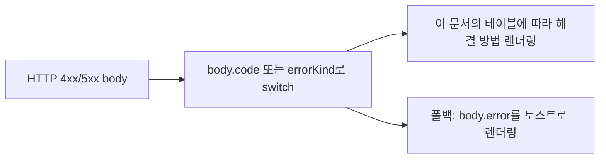
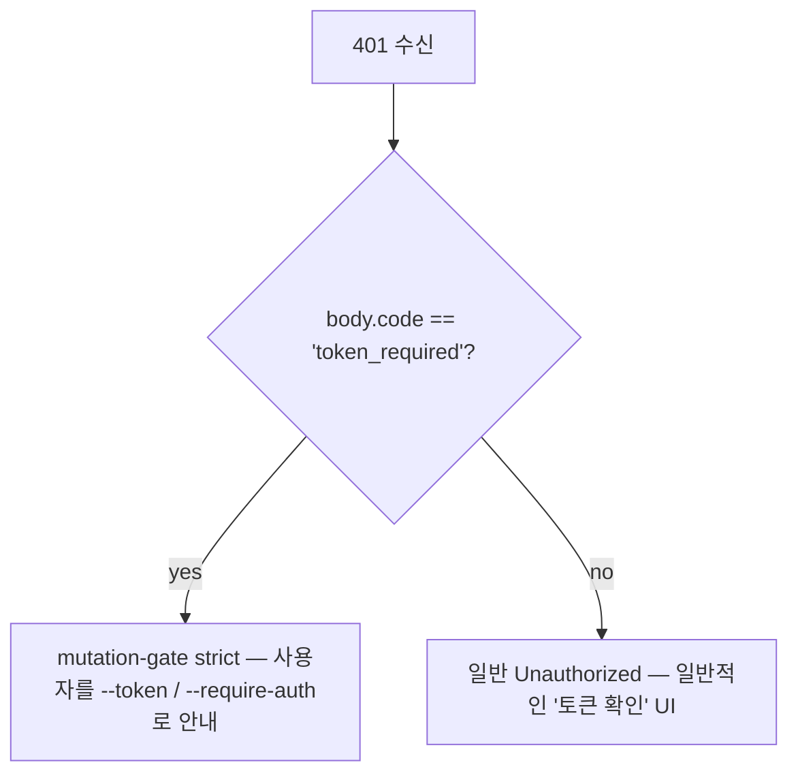

# 오류 분류 및 해결 방법

## 개요

데몬의 실패 모드는 의도적으로 닫힌 union으로 설계되어, SDK 소비자가 exhaustively switch로 처리하고 라우팅 핸들러가 일관된 HTTP 응답을 생성할 수 있습니다. 이 문서는 세 계층에 걸친 모든 타입화된 오류 클래스/kind를 정리합니다:

1. **`packages/cli/src/serve/`** — HTTP 경계의 바운더리 오류(인증, 워크스페이스 파일시스템, 데몬-호스트 사전 검사).
2. **`packages/acp-bridge/`** — 데몬-ACP 자식 경계의 브리지/중재자 오류.
3. **`packages/sdk-typescript/src/daemon/`** — SDK 측 래핑 및 구조화된 오류 필드.

통신 수준 오류 구조는 [`../qwen-serve-protocol.md`](../qwen-serve-protocol.md)에 문서화되어 있으며, 이 문서는 원인과 해결 지침을 추가합니다.

## 파일시스템 바운더리 (`packages/cli/src/serve/fs/errors.ts`)

`FsError`는 `{ kind, message, status, cause? }`를 가집니다. `FsErrorKind` union (14개 kind, 기본 HTTP 상태):

| Kind                     | HTTP      | 원인                                                                                                           | 해결 방법                                                                                                              |
| ------------------------ | --------- | -------------------------------------------------------------------------------------------------------------- | ---------------------------------------------------------------------------------------------------------------------- |
| `path_outside_workspace` | 400       | 해석된 경로가 바인딩된 워크스페이스를 벗어남.                                                                  | 데몬의 `workspaceCwd` 내부 경로를 사용; `/capabilities`를 확인.                                                        |
| `symlink_escape`         | 400       | 대상이 심볼릭 링크.                                                                                            | 해석된 경로를 직접 지정; 심볼릭 링크는 설계상 거부됨.                                                                  |
| `path_not_found`         | 404       | `ENOENT`.                                                                                                      | 파일이 존재하는지 확인; Linux에서 대소문자 구분 경로를 확인.                                                           |
| `binary_file`            | 422       | 텍스트 라우트에서 바이너리 콘텐츠가 감지됨.                                                                    | 원시 바이트는 `GET /file/bytes`를 사용; 텍스트 라우트는 바이너리를 거부.                                               |
| `file_too_large`         | 413       | 큰 텍스트에 유한한 라인 제한이 없거나, 큰 텍스트가 UTF-8이 아니거나, 쓰기가 `MAX_WRITE_BYTES`(5 MiB)를 초과.  | 큰 UTF-8 텍스트에 유한한 라인 제한을 사용하거나, 바이트 윈도우를 사용하거나, 쓰기를 분할.                               |
| `hash_mismatch`          | 409       | 낙관적 동시성 `expectedSha256`이 실패했거나, 안정적 읽기 중에 파일이 변경됨.                                   | 파일을 다시 읽고 새로운 버전/해시로 재시도.                                                                            |
| `file_already_exists`    | 409       | 기존 파일에 `mode: 'create'`로 요청.                                                                           | `mode: 'overwrite'`를 사용하거나 새 경로를 선택.                                                                       |
| `text_not_found`         | 422       | `POST /file/edit` 검색 문자열이 파일에 없음.                                                                   | 검색 문자열을 다시 확인; 공백/인코딩 불일치가 일반적인 원인.                                                           |
| `ambiguous_text_match`   | 422       | 하나만 매칭되어야 하는데 여러 개가 매칭됨.                                                                     | 검색 문자열에 더 많은 주변 컨텍스트를 추가하여 고유하게 만듦.                                                          |
| `untrusted_workspace`    | 403       | 신뢰할 수 없는 워크스페이스에서 쓰기 시도.                                                                     | 워크스페이스를 신뢰됨으로 표시(`Config.isTrustedFolder()`)하거나 `createServeApp` 직접 임베딩 대신 `runQwenServe`를 사용. |
| `permission_denied`      | 403       | OS 수준의 `EACCES` / `EPERM`.                                                                                  | 파일시스템 ACL을 조정; 이것은 보안 알림이 **아님**.                                                                    |
| `io_error`               | 503       | `ENOSPC` / `EIO` / `EBUSY` / `ETXTBSY` / `ENAMETOOLONG` / `EMFILE` / `ENFILE`.                                 | 호스트 수준 운영 수정(디스크 가득, fd 고갈); 보안이 아닌 운영팀에 페이징.                                              |
| `internal_error`         | 500       | errno가 아닌 오류가 바운더리에 도달.                                                                           | 데몬 버그로 등록.                                                                                                      |
| `parse_error`            | 400 / 422 | 요청 본문 파싱 오류(400) 또는 서비스 수준 불변식 위반(422).                                                    | 요청 본문을 검증; SDK 버전을 확인.                                                                                     |

`io_error`와 `permission_denied`의 구분은 의도적입니다. 모니터링 파이프라인이 `errorKind`로 라우팅할 수 있도록 하며, ENOSPC를 `permission_denied`에 포함하면 `df -h` 문제에 대해 보안 대응팀에 페이징하게 됩니다.

## 브리지 오류 (`packages/acp-bridge/src/bridgeErrors.ts`)

브리지/중재자가 throw하는 타입화된 클래스. 대부분은 라우트 핸들러의 switch를 통해 HTTP 상태를 가집니다.

| Class                                 | HTTP | 원인                                                                                  | 해결 방법                                                                                                                                                                         |
| ------------------------------------- | ---- | ------------------------------------------------------------------------------------- | --------------------------------------------------------------------------------------------------------------------------------------------------------------------------------- |
| `SessionNotFoundError`                | 404  | sessionId가 `byId`에 없음.                                                            | 세션을 재생성하거나 attach; 세션이 회수되었을 수 있음.                                                                                                                            |
| `WorkspaceMismatchError`              | 400  | `POST /session` `cwd` ≠ 데몬의 `boundWorkspace`.                                      | `cwd`를 생략(바인딩된 값 사용)하거나 해당 `cwd`에 바인딩된 데몬으로 라우팅.                                                                                                       |
| `SessionLimitExceededError`           | 503  | `byId.size >= maxSessions`.                                                           | 오래된 세션을 종료; `--max-sessions`를 증가.                                                                                                                                      |
| `InvalidClientIdError`                | 400  | `X-Qwen-Client-Id`가 `[A-Za-z0-9._:-]{1,128}` 범위를 벗어남.                          | 클라이언트 ID를 정리.                                                                                                                                                             |
| `InvalidSessionMetadataError`         | 400  | `displayName`이 256자를 초과하거나 제어 문자를 포함.                                   | 잘라내기 / 정리.                                                                                                                                                                  |
| `InvalidSessionScopeError`            | 400  | 알 수 없는 `sessionScope` 값.                                                          | `'single'` 또는 `'thread'`를 사용.                                                                                                                                                |
| `RestoreInProgressError`              | 409  | `loadSession` / `resumeSession`의 동시 실행.                                           | 대기 후 재시도.                                                                                                                                                                   |
| `WorkspaceInitConflictError`          | 409  | `force` 없이 기존 파일에 `POST /workspace/init` 실행.                                  | `force: true`를 전달하거나 다른 경로를 선택.                                                                                                                                      |
| `WorkspaceInitPathEscapeError`        | 400  | 초기화 경로가 워크스페이스를 벗어남.                                                   | `workspaceCwd` 내부 경로를 사용.                                                                                                                                                  |
| `WorkspaceInitSymlinkError`           | 400  | 초기화 경로가 심볼릭 링크.                                                            | 해석된 경로를 지정.                                                                                                                                                               |
| `WorkspaceInitRaceError`              | 409  | 초기화 시 TOCTOU 레이스.                                                                 | 재시도.                                                                                                                                                                           |
| `McpServerNotFoundError`              | 404  | 알 수 없는 서버에 대한 재시작.                                                         | `/workspace/mcp`에서 서버 이름을 확인.                                                                                                                                            |
| `McpServerRestartFailedError`         | 502  | ACP 자식 내부에서 재시작 실패.                                                        | ACP 자식 로그를 확인; 손상된 MCP 서버를 나타낼 수 있음.                                                                                                                           |
| `InvalidPermissionOptionError`        | 400  | 와이어 투표가 `optionId`를 통해 `CANCEL_VOTE_SENTINEL`을 주입 시도.                    | `optionId` 대신 `{outcome: 'cancelled'}`로 투표.                                                                                                                                  |
| `PermissionForbiddenError`            | 403  | 정책이 투표자를 거부(`designated_mismatch` / `remote_not_allowed`).                    | 원본 클라이언트 ID(designated)를 사용하거나, 투표자를 사전 등록(consensus)하거나, 루프백에서 투표(로컬 전용). [`04-permission-mediation.md`](./04-permission-mediation.md) 참조.   |
| `CancelSentinelCollisionError`        | 500  | 에이전트가 `'__cancelled__'`를 유효한 옵션 레이블로 발행.                               | 에이전트 버그 — 옵션 레이블을 센티널이 아닌 다른 값으로 변경.                                                                                                                     |
| `PermissionPolicyNotImplementedError` | 500  | 요청된 정책이 이 데몬에 내장되어 있지 않음.                                            | 데몬을 업데이트하거나 `policy.permissionStrategy`를 변경.                                                                                                                          |
| `BridgeChannelClosedError`            | 503  | 호출 중 ACP 자식 채널이 닫힘.                                                          | 재연결 / 재시도; `session_died`에서 원인을 확인.                                                                                                                                  |
| `BridgeTimeoutError`                  | 504  | 브리지 수준의 벽시계 초과.                                                              | 재시도; 근본적인 지연을 조사.                                                                                                                                                     |
| `MissingCliEntryError`                | 500  | `qwen` CLI 진입 파일이 없음(`bridgeErrors.ts`가 아닌 `status.ts`에 정의).              | CLI 설치가 완료되었는지 확인; `packages/cli/index.ts`가 존재하는지 확인.                                                                                                          |

## 부트 시 설정 오류 (`packages/cli/src/serve/run-qwen-serve.ts`)

| Class                      | 발생 시점                                                                                                                                                                                                                                 | 해결 방법                                                                                                                                                                                       |
| -------------------------- | ----------------------------------------------------------------------------------------------------------------------------------------------------------------------------------------------------------------------------------------- | ----------------------------------------------------------------------------------------------------------------------------------------------------------------------------------------------- |
| `InvalidPolicyConfigError` | `validatePolicyConfig()`가 병합된 설정을 거부: 알 수 없는 `policy.permissionStrategy`(`SERVE_CAPABILITY_REGISTRY.permission_mediation.modes`에 대해 검증) 또는 양의 정수가 아닌 `policy.consensusQuorum`. 부트가 명시적으로 실패.            | `settings.json`의 해당 필드를 수정. 이 클래스는 `instanceof`를 지원; `runQwenServe`는 이를 사용하여 정책 불일치를 설정 읽기 I/O 실패와 구분하며, 후자는 기본값으로 폴백.                         |

## Device Flow 인증 (`packages/cli/src/serve/auth/device-flow.ts`)

| Class                        | 발생 시점                                                  | 참고 사항                                                                                                                                                                                                                                                                                                                                                                                                                                          |
| ---------------------------- | ---------------------------------------------------------- | -------------------------------------------------------------------------------------------------------------------------------------------------------------------------------------------------------------------------------------------------------------------------------------------------------------------------------------------------------------------------------------------------------------------------------------------------- |
| `UpstreamDeviceFlowError`    | 폴링 중 업스트림 IdP가 구조화된 오류를 반환.               | `oauthError`는 stderr나 감사 힌트에 보간되기 전 `sanitizeForStderr`로 정리됨(CVE-2021-42574 / Trojan Source 방어; [`12-auth-security.md`](./12-auth-security.md) 참조).                                                                                                                                                                                                                                                                            |
| `DeviceFlowPollTimeoutError` | 제공자가 반환하기 전에 레지스트리 레이스 타이머가 발생.     | 제공자 코드는 이 타입을 throw하면 안 됨. 테스트용으로 export되지만, 레지스트리는 `_isRegistryTimeout: boolean` 런타임 브랜딩으로 `pollTimedOut`을 게이트하며 `instanceof`로 판단하지 않음. `new DeviceFlowPollTimeoutError(ms)`를 import하여 throw하는 제공자도 `_isRegistryTimeout`이 기본값 `false`이므로 일반 제공자 throw 감사 경로를 따름; 오직 내부 팩토리 `makeRegistryPollTimeoutError(ms)`만 해당 브랜딩을 설정.                         |

## 데몬-호스트 오류 kind (`packages/acp-bridge/src/status.ts`)

`SERVE_ERROR_KINDS`는 진단 셀과 구조화된 데몬 오류에서 사용되는 닫힌 enum입니다:

| Kind                       | 의미                                                                  |
| -------------------------- | --------------------------------------------------------------------- |
| `missing_binary`           | 필수 로컬 실행 파일 또는 CLI 진입을 해석할 수 없음.                   |
| `blocked_egress`           | 아웃바운드 네트워크 프루브 실패.                                      |
| `auth_env_error`           | 인증 관련 환경 변수, 제공자, 또는 trust-gate 설정이 유효하지 않음.   |
| `init_timeout`             | 데몬 측 초기화 단계가 벽시계를 초과.                                  |
| `protocol_error`           | ACP / HTTP 프로토콜 불일치.                                           |
| `missing_file`             | 필수 로컬 파일이 누락.                                                |
| `parse_error`              | 로컬 파일 또는 요청 파싱 오류.                                        |
| `stat_failed`              | 로컬 파일시스템 stat 실패.                                            |
| `budget_exhausted`         | MCP 예산 집행이 검색 또는 서버 항목을 거부.                           |
| `mcp_budget_would_exceed`  | MCP 재시작 또는 변경이 설정된 예산을 초과.                            |
| `mcp_server_spawn_failed`  | MCP 서버 spawn 또는 재시작 실패.                                      |
| `invalid_config`           | MCP 또는 데몬 설정이 유효하지 않음.                                   |
| `prompt_deadline_exceeded` | 프롬프트 벽시계 기한이 만료.                                          |
| `writer_idle_timeout`      | SSE writer가 유휴 타임아웃 전에 성공적인 쓰기를 하지 않음.            |

이것들은 사전 검사 셀의 `errorKind`를 통해 노출되어 클라이언트 UI가 구조화된 해결 방법을 렌더링합니다(원시 스택 트레이스가 아님).

## 인증 오류 구조

| 상태   | 본문                                         | 발생 시점                                                                                                                                    |
| ------ | -------------------------------------------- | ---------------------------------------------------------------------------------------------------------------------------------------------- |
| `401`  | `{ error: 'Unauthorized' }`                  | 누락 / 잘못된 / 스킴 없는 bearer 토큰. `missing header` / `wrong scheme` / `wrong token`에 대해 동일하게 응답하여 프로빙으로 구별할 수 없음.   |
| `401`  | `{ error: '...', code: 'token_required' }`   | 토큰 없는 루프백 데몬의 mutation-gate strict 라우트. SDK가 "configure --token / --require-auth" 힌트를 렌더링.                                |
| `403`  | `{ error: 'Request denied by CORS policy' }` | `denyBrowserOriginCors`가 `Origin` 헤더가 포함된 요청을 거부.                                                                                 |
| `403`  | `{ error: 'Invalid Host header' }`           | `hostAllowlist`가 `Host` 헤더를 거부(DNS rebinding 방어).                                                                                     |

전체 인증 모델은 [`12-auth-security.md`](./12-auth-security.md)를 참조.

## 권한 결과(와이어 vs 감사 과부하)

`PermissionResolution`은 두 개의 종료 kind를 가집니다:

- `{kind: 'option', optionId}` — 투표가 승리.
- `{kind: 'cancelled', reason: 'timeout' \| 'session_closed' \| 'agent_cancelled'}` — 요청이 취소됨. 와이어 구조는 단일(`{outcome: 'cancelled'}`); 감사 로그는 `decisionReason.type`에서 timeout / session_closed / voter-cancelled / agent-cancelled를 구별. 이 과부하는 동결된 `permission.ts` 계약을 깨지 않기 위해 의도적으로 유지됨.

## SDK 측 오류 래핑

`DaemonClient`는 HTTP 오류를 거부된 Promise로 반환하며, 파싱된 본문을 거부 값으로 사용합니다. 알 수 없는 세션에 대해 `404`를 반환하는 메서드는 `{error, sessionId}`로 거부; SDK는 현재 타입화된 클래스로 래핑하지 않음. 호출자는 `instanceof Error`와 `.message.includes(...)` 매칭에 의존하면 안 되며, 대신 본문의 `err.code` 또는 `err.kind`로 switch해야 함.

`parseSseStream`은 16 MiB 버퍼 오버플로우 시 반복자를 중단(방어적 한도).

## 워크플로

### 사용자에게 오류 표시

### 인증 실패 모드 구별

## 의존성

- 모든 오류 클래스는 해당 패키지에서 export되며, SDK 소비자는 동일한 Node 프로세스에서 실행 시 `bridgeErrors.ts` 타입에 대해 `instanceof`를 사용할 수 있음. 와이어를 통해서는 `body.code` / `body.kind` / `body.errorKind`로 라우팅.

## 주의사항 및 알려진 제한

- **`io_error`와 `permission_denied`**는 의도적으로 구분됨. 혼동하지 말 것.
- **`PermissionForbiddenError`의 이유(`designated_mismatch` / `remote_not_allowed`)는** `designated`와 `consensus` 정책에 걸쳐 과부하됨; 감사 로그는 정확하게 구별하지만 와이어 형태는 구별하지 않음.
- **`CancelSentinelCollisionError`는 에이전트 측 버그를 나타냄**, 보안 이벤트가 아님 — 브리지 센티널이 실제 옵션과 일치하는 것을 조용히 허용하지 않고 요청을 거부.
- **SDK 측 타입화된 오류는 아직 발전 중.** 호출자는 와이어를 통해 JS 클래스 ID에 의존하기보다 본문 필드로 라우팅해야 함.
- **`internal_error`는 항상 조사해야 함.** `FsError` 생성자가 non-errno 경로용으로 예약된 kind로 호출되었음을 의미(프로그래머 오류); 응답 본문의 `cause` 필드에 원시 throw가 포함될 수 있음.

## 참고 문헌

- `packages/cli/src/serve/fs/errors.ts` (`FsErrorKind`, `FsErrorStatus`)
- `packages/acp-bridge/src/bridgeErrors.ts` (모든 타입화된 클래스)
- `packages/acp-bridge/src/status.ts` (`SERVE_ERROR_KINDS`, `ServeErrorKind`)
- `packages/cli/src/serve/auth.ts` (인증 본문)
- 와이어 참조: [`../qwen-serve-protocol.md`](../qwen-serve-protocol.md).
