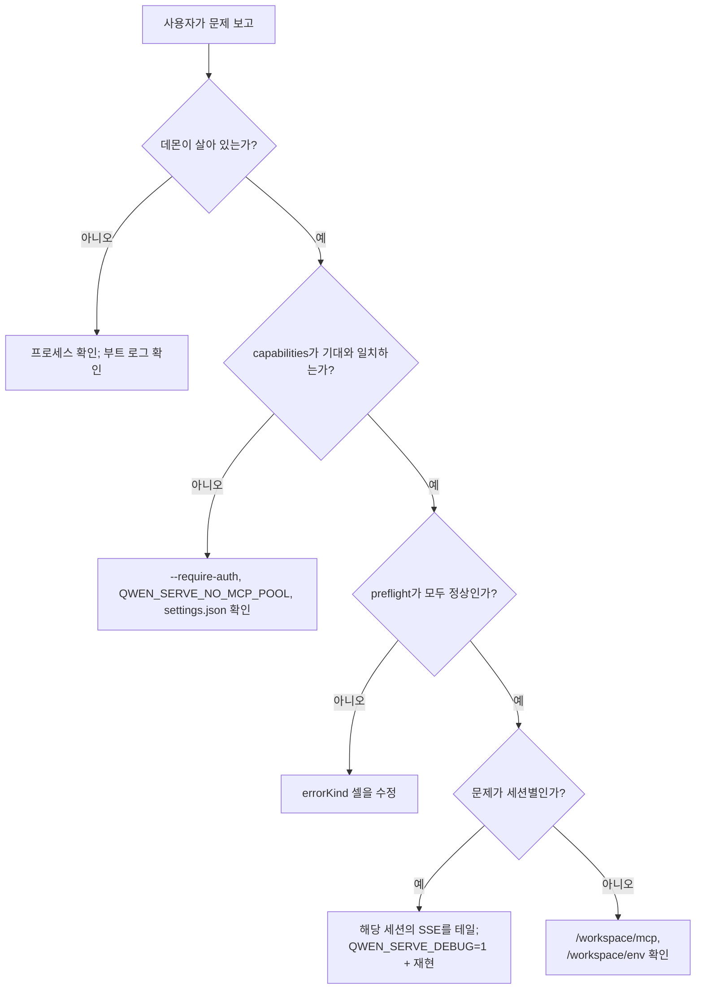

# 관찰성 및 디버깅

## 개요

`qwen serve`는 현재 **OpenTelemetry span 계측**, **구조화된 파일 로그**(`DaemonLogger`), **요청별 접근 로그**, 디버그 stderr 로그, 구조화된 사전 검사 셀, 그리고 메모리 내 권한 감사 링을 제공합니다. 이 페이지는 현재 관찰성 표면과 트리아지 시 기억해야 할 격차에 대한 실용 가이드입니다.

## 현재 존재하는 것

| 표면                                        | 위치                                           | 목적                                                                                                                                                                                                                                                                                                                                                       |
| ------------------------------------------- | ---------------------------------------------- | ---------------------------------------------------------------------------------------------------------------------------------------------------------------------------------------------------------------------------------------------------------------------------------------------------------------------------------------------------------- |
| `QWEN_SERVE_DEBUG` stderr 로그              | `bridge.ts` 및 호출 사이트                     | 환경 변수 값 `1` / `true` / `on` / `yes`(대소문자 무관)가 설정되면 `qwen serve debug: ...` 라인을 stderr에 출력.                                                                                                                                                                                                                                            |
| OpenTelemetry span 계측                     | `server.ts` `daemonTelemetryMiddleware`        | 텔레메트리 미들웨어에 도달한 분류된 데몬 API 요청은 `withDaemonRequestSpan`으로 래핑; 속성으로 표준 경로, 해석된 경우 워크스페이스 해시, sessionId, clientId, 상태 코드를 포함. 권한 라우트는 전용 span을 가짐. 프롬프트 수명 주기가 종단간 추적됨. 설정은 `settings.json` `telemetry`에 위치.                                                                 |
| OpenTelemetry 데몬 성능 메트릭              | `telemetry/*event-loop-lag*`, `daemon-metrics` | 데몬 및 ACP 자식 프로세스의 이벤트 루프 지연 게이지와 데몬-자식 파이프 메시지 바이트 히스토그램.                                                                                                                                                                                                                                                            |
| `DaemonLogger` 구조화된 파일 로그           | `serve/daemon-logger.ts`                       | 안정적이며 크기 기반 순환되는 `daemon.log`에 추가. 활성 recording sampled OTel span이 있는 상태에서 발행된 호출자 `info` / `warn` / `error` 레코드에 `trace_id`와 `span_id`가 포함됨; 파일 레코드에 `runId`와 PID도 포함됨. 부트 시 선택된 안정적/폴백 경로를 출력; 전체 상태는 헬스, 문제, 파일 복사 손실 카운터를 노출.                                                                                  |
| 요청별 접근 로그 미들웨어                   | `server/access-log.ts`                         | 각 요청 후에 메서드/경로, 상태, 지속 시간, 세션, 첫 원시 클라이언트 ID를 기록. 60-토큰 버스트 / 2-초당 버킷이 초과 트래픽을 5개의 고정 상태 카운터로 집계. 헬스, 하트비트, 성공적 SSE 제외는 유지.                                                                                                                                                           |
| `/health`                                   | `server.ts` 라우트                             | 활성 프로브; `?deep=1`은 확장 세부 정보를 반환.                                                                                                                                                                                                                                                                                                             |
| `/capabilities`                             | `server.ts` 라우트                             | 사전 검사 기능 검색. [`11-capabilities-versioning.md`](./11-capabilities-versioning.md) 참조.                                                                                                                                                                                                                                                               |
| `/workspace/preflight`                      | Route -> `DaemonStatusProvider`                | 구조화된 준비 상태 셀: Node 버전, CLI 진입, ripgrep, git, npm, 그리고 자식이 활성화된 후 ACP 수준 셀.                                                                                                                                                                                                                                                       |
| `/workspace/env`                            | Route -> `DaemonStatusProvider`                | 데몬 프로세스 환경 스냅샷. 비밀 환경 변수는 존재 여부만 보고; 프록시 URL 자격 증명은 제거됨.                                                                                                                                                                                                                                                                |
| `/workspace/mcp`                            | Route -> bridge extMethod                      | 풀, 예산, 거부 스냅샷.                                                                                                                                                                                                                                                                                                                                     |
| `/workspace/skills`, `/workspace/providers` | 라우트                                         | ACP 측 라이브 스냅샷; 세션이 없으면 빈 유휴 데이터를 반환.                                                                                                                                                                                                                                                                                                 |
| 세션별 SSE                                  | `GET /session/:id/events`                      | 실시간 이벤트 스트림.                                                                                                                                                                                                                                                                                                                                      |
| Web Shell UI                                | `GET /` (`packages/cli/src/serve/web-shell-static.ts`) | 번들된 Web Shell 자산에서 제공되는 브라우저 UI: 채팅, 세션 목록, 워크스페이스 검사기, 권한 UX. 루프백에서 `http://127.0.0.1:4170/`는 SDK 코드 작성 없이 가장 빠른 종단간 검증 경로. 등록 규칙은 [`02-serve-runtime.md`](./02-serve-runtime.md)에 있음.                                                                                                      |
| `PermissionAuditRing`                       | `permission-audit.ts`                          | 512개의 권한 결정을 저장하는 메모리 내 FIFO.                                                                                                                                                                                                                                                                                                               |
| 중재자 `decisionReason` 감사                | `permissionMediator.ts`                        | 권한 요청이 특정 방식으로 해결된 이유를 설명하는 내부 구조화 레코드.                                                                                                                                                                                                                                                                                         |

## 현재 존재하지 않는 것

- **Prometheus / 메트릭 엔드포인트 없음.** OTel 메트릭은 export할 수 있지만, 데몬은 Prometheus 스크랩 엔드포인트를 노출하지 않음.
- **`PermissionAuditRing`의 외부 감사 싱크 없음.** 링은 존재하지만 SIEM 또는 외부 저장소로의 팬아웃 hook이 연결되어 있지 않음.

## 디버깅 레시피

### 1. 데몬이 살아 있는가?

```bash
curl -s http://127.0.0.1:4170/health
# {"status":"ok"}

curl -s 'http://127.0.0.1:4170/health?deep=1' | jq
# {"status":"ok","workspaceCount":N,"sessions":N,...}
```

Deep 헬스는 드레이닝 중인 런타임을 포함하여 관리되는 모든 워크스페이스 런타임을 합산. 정보용 카운터 스냅샷이며 워크스페이스별 준비 상태가 아님; 개별 워크스페이스 또는 전송 진단이 필요할 때는 `/daemon/status`를 사용.

루프백에서 401이 반환되면 `--require-auth`가 활성화되었을 가능성이 높음. 부트 로그를 확인하려면 시작 시 `QWEN_SERVE_DEBUG=1`을 사용.

### 2. 어떤 기능이 광고되는가?

```bash
curl -s http://127.0.0.1:4170/capabilities | jq
```

`mcp_workspace_pool`(F2 풀 활성화?), `require_auth`(강화?), `permission_mediation.modes`(지원되는 정책), `policy.permission`(활성 정책)을 확인.

### 3. 데몬-호스트 준비 상태가 정상인가?

```bash
curl -s http://127.0.0.1:4170/workspace/preflight | jq
```

`status: 'not_started'` 셀은 ACP 수준이며 첫 세션이 attach된 후에만 채워짐. `status: 'fail'` 셀은 닫힌 `errorKind`를 포함; [`18-error-taxonomy.md`](./18-error-taxonomy.md)에서 구조화된 해결 방법을 렌더링.

### 4. 세션 SSE 스트림을 테일

```bash
curl -N -H 'Accept: text/event-stream' \
     -H 'Authorization: Bearer XYZ' \
     -H 'X-Qwen-Client-Id: debug-tail' \
     -H 'Last-Event-ID: 0' \
     'http://127.0.0.1:4170/session/<sid>/events'
```

`-N`은 curl 출력 버퍼링을 비활성화. `Last-Event-ID: 0`은 `id > 0`인 링 이벤트의 리플레이를 요청.

### 5. 권한 요청이 이 방식으로 해결된 이유는?

`PermissionAuditRing`은 메모리 내에 존재하며 현재 HTTP 표면이 없음. `QWEN_SERVE_DEBUG=1`을 활성화하고 재현; 중재자가 각 투표와 결정에 대한 구조화된 라인을 출력하며 `decisionReason.type`을 포함. 이후 PR에서 링을 HTTP로 노출 가능.

### 6. 어떤 소비자가 느린가?

`slow_client_warning`는 큐가 75%에 도달하면 오버플로우 에피소드당 한 번 발생. 세션 SSE 스트림에 구독하여 합성 프레임을 확인; 페이로드에 `queueSize`, `maxQueued`, `lastEventId`가 포함. 반복되는 경고는 멈춘 소비자를 가리키며, 보통 차단된 SDK `for await` 루프가 원인.

### 7. MCP 서버가 거부된 이유는?

`/workspace/mcp`의 셀별 `disabledReason: 'budget'`, `refusedServerNames` 목록, `mcp_child_refused_batch` SSE 이벤트를 조합. `/capabilities`의 `mcp_guardrails.modes`(`enforce` 활성화?)와 `getReservedSlots()`를 통해 보이는 실시간 `--mcp-client-budget` 상태와 비교.

### 8. 데몬이 종료되지 않음

첫 신호가 graceful shutdown을 트리거([`02-serve-runtime.md`](./02-serve-runtime.md) 참조). 10초를 초과하면 다음을 확인:

- ACP 자식 프로세스가 graceful close에 응답하지 않음.
- 긴 SSE 연결이 `SHUTDOWN_FORCE_CLOSE_MS`(5초)를 지나 HTTP `server.close()`를 유지.

**두 번째** SIGTERM/SIGINT는 의도적으로 `bridge.killAllSync()` + `process.exit(1)`을 트리거.

### 9. 데몬 이벤트 루프, 프롬프트 큐, ACP 파이프가 과부하인가?

`GET /daemon/status`는 프로덕션 데몬 런타임이 perf 스냅샷 제공자를 주입할 때 `runtime.perf`를 포함할 수 있음:

```json
{
  "runtime": {
    "perf": {
      "eventLoop": { "meanMs": 1.2, "p50Ms": 1.0, "p99Ms": 9.5, "maxMs": 25 },
      "promptQueueWait": {
        "count": 3,
        "meanMs": 12.5,
        "maxMs": 35,
        "lastMs": 4
      },
      "pipe": {
        "inbound": { "count": 42, "totalBytes": 100000, "maxBytes": 12000 },
        "outbound": { "count": 41, "totalBytes": 90000, "maxBytes": 11000 }
      }
    }
  }
}
```

상태 페이로드는 데몬 전용. `promptQueueWait`는 데몬 프로세스에서 관찰된 프롬프트 FIFO 큐 대기 샘플을 요약. ACP 자식 이벤트 루프 지연은 의도적으로 `/daemon/status`에 집계되지 않음; OTel 게이지 `qwen-code.acp.event_loop.lag`와 데몬 로그로 전달되는 stderr stall 라인을 통해 확인 가능.

### 10. 파일 로깅이 저하되거나 레코드를 손실했는가?

전체 데몬 상태를 사용:

```bash
curl -s 'http://127.0.0.1:4170/daemon/status?detail=full' | \
  jq '{status, issues, daemon: {runId: .daemon.runId, logMode: .daemon.logMode, logHealth: .daemon.logHealth, logPath: .daemon.logPath, logIssues: .daemon.logIssues, droppedRecords: .daemon.logDroppedRecords, droppedBytes: .daemon.logDroppedBytes}}'
```

`stable`이 정상 소유자, `fallback`은 다른 데몬이 안정적 패밀리를 소유하고 있음을 의미, `stderr-only`는 파일 로깅이 비활성화되었거나 사용 불가능함을 의미. `fallback/ok`는 의도된 동시성 환경에서 예상됨. `daemon_log_degraded` 경고는 경로를 포함하지 않음; 실제 경로와 로거 이슈 코드를 확인하려면 전체 detail을 요청. `runId`를 사용하여 안정적 파일 내의 재시작을 구분.

새로운 OTel 메트릭 이름:

- `qwen-code.daemon.event_loop.lag`, 밀리초 단위 게이지, `stat=mean|p50|p99|max`.
- `qwen-code.acp.event_loop.lag`, 밀리초 단위 게이지, `stat=mean|p50|p99|max`.
- `qwen-code.daemon.prompt.queue_wait`, 밀리초 단위 히스토그램.
- `qwen-code.daemon.pipe.message_bytes`, 바이트 단위 히스토그램, `direction=inbound|outbound`.

### 11. 데몬이 메모리 압박을 받고 있는가?

```bash
curl -s 'http://127.0.0.1:4170/daemon/status' | \
  jq '.runtime.memory.pressure'
```

`level`은 `normal` / `soft` / `hard` / `critical`이며, `ratio`에서 분류됨 —
`rssRatio`(OOM killer가 관찰하는 cgroup/호스트 메모리 대비 RSS)와 `heapRatio`(이 프로세스의
`heap_size_limit` 대비 사용된 V8 힙 — `--max-old-space-size`가 지칭하는 old space뿐만 아니라 전체 힙) 중 더 나쁜 값.
`source`는 어느 쪽이 생성했는지 나타냄. 조치 전 `source`를 확인:
`unknown`은 데몬이 양쪽 모두 측정할 수 없음을 의미하므로, 여기서는 `normal`이 읽기 부재이지
건강의 증거가 아님. 각 측은 분자와 분모 모두 사용 가능할 때만 보고되므로, `source`는
0인 `rssBytes` / `heapUsedBytes`와 실제 값을 구분하는 기준이기도 함.

**`rssRatio`는 분모만큼 정확하며,
`limits.memory.availableMemorySource`가 이를 평가.** cgroup (`constrained`)에서는
OOM killer가 강제하는 정확한 제한이므로 비율은 말 그대로 의미 있음. 베어메탈 (`host`)에서는
전체 머신 크기이지만, 데몬은 _머신_이 다 달았을 때 죽음 — 이는 박스의
다른 모든 프로세스에 따라 다름. 64 GB 호스트의 20%를 차지하는 데몬이 55 GB 이웃 옆에서
`level: normal, source: rss`를 보고하다 죽을 수 있음. `source: 'host'` 아래에서는 `rssRatio`를
실제 압박의 **하한**으로 읽을 것. 이는 임계값 보정과 별개 문제: 잘못된 분모를 측정하고 있을 때
임계값 선택으로 해결되지 않음.

두 가지 더 다루지 **않는** 사항. 데몬 **루트** 프로세스만 해당하므로,
`qwen --acp` 자식이 성장 중인 경우 데몬은 내내 `normal`을 보고할 수 있음 —
곁에서 `runtime.memory.children`을 확인. 이는 라이브 자식의 RSS를 합산하며
(`sampled`를 통해 실제로 보고한 수를 알림).
그리고 아무것도 remediation하지 않음: `normal`을 벗어나면 `daemon_memory_pressure`
경고를 발생시키지만 동작은 변경하지 않음.

`--memory-pressure-mode off`에서는 위의 모든 수치가 계속 보고되며
이슈가 발생하지 않으므로, 최상위 `status`는 기존과 동일하게 유지됨.
실제 워크로드에 대해 임계값을 보정 중이거나, `status`에 알림을 걸면서
보정되지 않은 신호가 상태를 변경하지 않게 하려면 `off`를 사용.

## 흐름

### 일반적인 트리아지 흐름



## 상태 및 수명 주기

- `QWEN_SERVE_DEBUG`는 `debug-mode.ts`의 `isServeDebugMode()`를 통해 매번 확인 시 읽힘; 토글에 재시작이 필요 없음. 부트 로그는 부트 시 환경 변수가 설정되어 있어야 사용 가능.
- `PermissionAuditRing`은 512개의 FIFO 항목으로 제한됨; 오래된 레코드는 자동으로 삭제됨.
- `DaemonStatusProvider`는 요청마다 셀을 재구성하며 캐시하지 않음; 불필요한 고빈도 폴링을 피할 것.

## 의존성

- 디버그 stderr는 `process.stderr.write`를 사용.
- 구조화된 파일 로그는 `DaemonLogger`를 사용.
- OpenTelemetry SDK는 `initializeTelemetry`와 `createDaemonBridgeTelemetry`를 통해 사용.
- 데몬 및 ACP 이벤트 루프 지연 게이지는 `node:perf_hooks.monitorEventLoopDelay`를 사용.
- 환경 및 시그널 검사는 `node:process`를 사용.

## 설정

| Knob                            | 효과                                                                                          |
| ------------------------------- | --------------------------------------------------------------------------------------------- |
| `QWEN_SERVE_DEBUG`              | 상세 stderr 로그를 활성화. [`17-configuration.md`](./17-configuration.md) 참조.               |
| `settings.json` `telemetry`     | OTel 동작 제어: `enabled`, `otlpEndpoint`, `otlpProtocol`, 시그널별 엔드포인트.              |
| `DaemonLogger` 로그 경로        | 안정적 `debug/daemon/daemon.log`, 또는 부트 시 선택된 런타임별 폴백.                          |
| `PermissionAuditRing` 크기      | 현재 512로 하드코딩.                                                                          |
| `slow_client_warning` 임계값    | `0.75` / `0.375`, `eventBus.ts`에 하드코딩.                                                   |

## 주의사항 및 알려진 제한

- **DaemonLogger 파일 로그는 구조화된 텍스트**이며 `trace_id`, `span_id`, `route`, `sessionId`, `clientId` 필드를 정규식으로 검색하거나 추출할 수 있음. 호출자 `info` / `warn` / `error` 레코드는 로그 호출이 활성 recording sampled OTel span에서 실행될 때만 trace 필드를 포함. `raw` 및 부트 레코드, 파일 드롭 요약, 접근 로그 억제 요약은 의도적으로 이를 생략. 상관관계는 최선 노력: exporter 실패로 샘플링된 trace가 백엔드에서 사용 불가능할 수 있음. 이러한 고카디널리티 식별자는 진단 조회용이며 메트릭 레이블이나 집계용이 아님. `QWEN_SERVE_DEBUG` stderr 로그는 구조화되지 않은 텍스트.
- **수락된 프롬프트, 계속 및 취소 변이는 수명 주기 로그를 가짐.** `prompt enqueued`, `continuation enqueued`, `cancel sent`는 해당 `sessionId`, `promptId`(해당 시), `clientId`(제공 시)를 포함하며 프롬프트 내용은 기록되지 않음. 각 독립 컨트롤러에 대해 고유한 안정 클라이언트 ID를 사용할 것. 의도적으로 ID를 공유하는 컨트롤러는 이 레코드에서 구별 불가.
- **DaemonLogger 보존은 크기 기반, 기간 기반이 아님.** 활성 파일과 4개의 아카이브가 패밀리당 제한; 라이브 폴백 소유자는 삭제되지 않음.
- **접근 요약은 의도적인 손실 회계.** WARN `access logs suppressed`는 stderr와 파일 모두에서 생략된 개별 접근 레코드를 나타내며, 삭제된 HTTP 요청을 의미하지 않음.
- **외부 logrotate는 활성 패밀리를 변경하면 안 됨.** 읽기/복사 후 안정적 경로명을 다시 여는 shipper를 사용.
- **OpenTelemetry span에는 요청별 상관관계가 포함됨.** bearer 인증, 속도 제한, 본문 파싱을 통과한 분류된 데몬 API 요청은 표준 경로, sessionId, clientId, (고유하게 해석된 경우) `qwen-code.workspace.hash` 속성을 가짐. 이전 미들웨어 게이트에서 거부된 요청은 이러한 요청 span을 가지지 않음.
- **HTTP 메트릭은 데몬 전역.** OpenTelemetry HTTP 요청 메트릭과 Web Shell 상태 메트릭 링은 워크스페이스 차원을 포함하지 않음. 성공적인 세션 SSE 연결은 요청 span을 가지지만, 수명 주기가 요청 지연 시간이 아니므로 일반 요청 수/지속 시간 메트릭에서 제외됨; 실패한 SSE 핸드셰이크는 정상적으로 카운트됨.
- **`runtime.perf`는 데몬 전용.** 자식 이벤트 루프 지연은 설계상 여기에 보고되지 않음; ACP 자식 지연에는 OTel 또는 전달된 stderr stall 경고를 사용.
- **ACP 수준 `/workspace/preflight` 셀은 라이브 세션이 필요.** 유휴 데몬에서는 auth / MCP / skills / providers가 `status: 'not_started'`를 표시할 수 있음; 이는 예상된 동작.
- **`/workspace/env`는 비밀 값의 존재 여부만 보고, 값은 보고하지 않음.** 비밀의 존재 자체가 민감한 경우 응답을 노출하지 말 것.
- **감사 링은 프로세스 로컬**이며 데몬 재시작 시 히스토리가 손실됨.
- **부하 테스트 레시피는 여기에 문서화되어 있지 않음.** 성능 기준선은 `test/perf-daemon-baseline` 브랜치에 위치.

## 참고 문헌

- `packages/cli/src/serve/daemon-status-provider.ts`
- `packages/cli/src/serve/daemon-logger.ts` (`DaemonLogger`, `buildDaemonLogLine`)
- `packages/cli/src/serve/debug-mode.ts` (`isServeDebugMode`)
- `packages/acp-bridge/src/permissionMediator.ts` (`PermissionDecisionReason`)
- `packages/cli/src/serve/server.ts` (`daemonTelemetryMiddleware`, 접근 로그 미들웨어)
- 설정: [`17-configuration.md`](./17-configuration.md)
- 오류 분류: [`18-error-taxonomy.md`](./18-error-taxonomy.md)
- 사용자 운영 가이드: [`../../users/qwen-serve.md`](../../users/qwen-serve.md)
