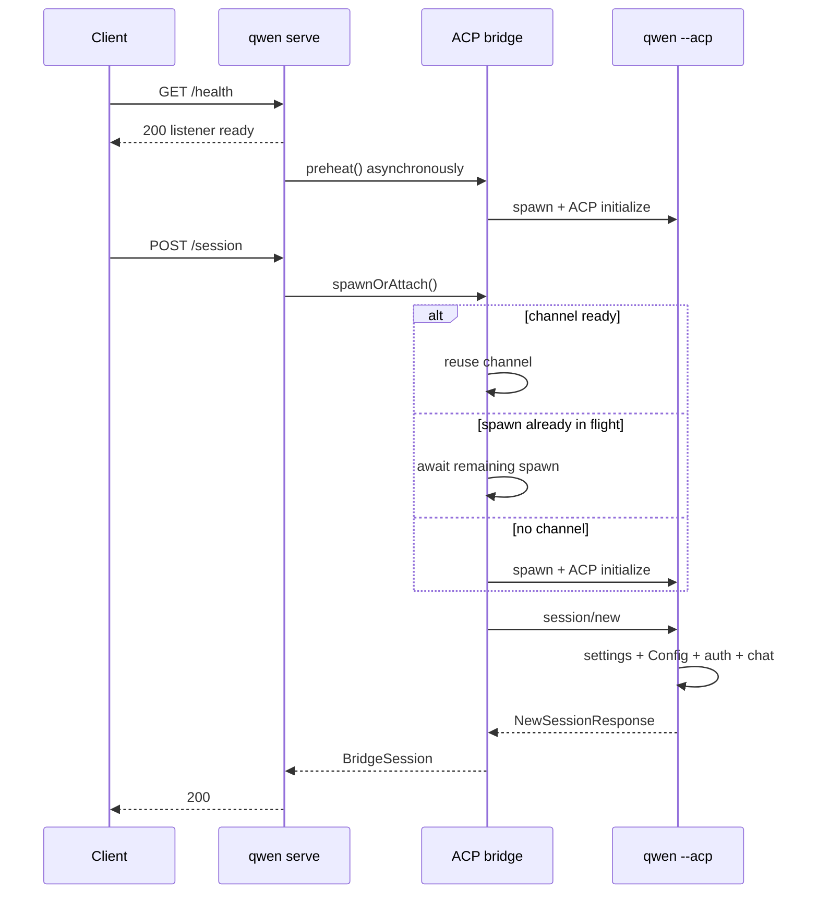

# Design de profiling da primeira sessão fria

## Decisão

A próxima fatia de implementação para a #4748 é observabilidade, não outro cache de inicialização nem um novo protocolo de sessão. Ela deve explicar uma requisição fria ao longo do daemon, do canal ACP compartilhado e do filho ACP, preservando o comportamento rápido atual de `/health`.

A implementação reutiliza os spans de requisição/bridge OpenTelemetry existentes do daemon e o ponto de extensão `_meta` do ACP. Ela adiciona:

- medição de tempo de requisição de bootstrap, para que uma espera de runtime adiado seja incluída no span HTTP posterior em vez de ser confundida com tempo de proxy/rede;
- um span de espera de canal por requisição que indica se a Session reutilizou um canal pronto, juntou-se a um spawn em andamento ou fez spawn sob demanda;
- um ID opaco em cada canal ACP, para que um trace de pré-aquecimento automático possa ser correlacionado com o trace posterior da Session sem inventar uma relação falsa de pai/filho;
- injeção de trace-context em `session/new` do ACP;
- um span `session/new` no filho ACP com durações de estágio limitadas para settings, inicialização do Config, autenticação, configuração de sistema de arquivos, registro de Session e construção de resposta;
- o Session ID do ACP no registro JSONL existente opt-in `QWEN_CODE_PROFILE_SESSION_START`, para que seus estágios detalhados de `startChat` possam ser juntados ao trace.

Esta fatia não adiciona headers de resposta, campos JSON públicos, flags de capability nem um segundo formato de profiler. A prontidão do ACP permanece uma mudança separada P1 de cliente/API depois que a análise P0 estiver disponível.

## Evidência

A amostra downstream `0.19.3-preview.2` mostrou um P50 de 2.534ms do sucesso do health ao sucesso da Session e um P50 de 1.713ms para `POST /session`. A correlação negativa entre o atraso do health até a requisição e a duração do POST é consistente com uma primeira requisição esperando o restante do pré-aquecimento automático, mas a medição de tempo do navegador não consegue separar o trabalho de proxy, daemon, canal e filho.

Um dry-run local com o `qwen 0.19.10` instalado globalmente confirmou o mesmo formato:

| Cenário                                             |                     Observação |
| --------------------------------------------------- | -----------------------------: |
| Início do processo → listener                       |                          203ms |
| Health seguido imediatamente por `POST /session` frio | 1.033ms navegador / 962ms daemon |
| `POST /session` já pré-aquecido em execução separada |   222ms navegador / 221ms daemon |

Essas são execuções únicas ilustrativas, não um benchmark de aceitação. Elas mostram que a duração bruta atual da rota esconde aproximadamente 700–800ms que podem ser espera de canal, bootstrap do filho ACP ou ambos.

## Arquitetura atual

A observabilidade existente já fornece:

- um span de requisição HTTP para `POST /session` depois que o app de runtime recebe a requisição;
- spans de bridge para `channel.spawn`, `channel.initialize` e `session.new`;
- injeção e extração de trace-context W3C através de chaves reservadas de `_meta` do ACP, atualmente usadas para despacho de prompt;
- um profiler JSONL opt-in para estágios detalhados de `GeminiClient.startChat()`.

As peças ausentes são qualquer espera de runtime adiado na camada de bootstrap antes desse span de requisição, a espera de canal da requisição atual, a correlação com um trace de pré-aquecimento iniciado independentemente, a propagação em `session/new` e a medição de tempo antes de `startChat` dentro do filho.

## Design

### Daemon pai e bridge

Quando uma requisição não-bootstrap chega antes de o runtime adiado estar montado, o app de bootstrap delegante registra seu horário de chegada em tempo de parede, a espera restante de runtime e se essa requisição iniciou o carregamento do runtime ou juntou-se a um trabalho já iniciado pelo agendamento de health/fallback. O middleware de telemetria do runtime recebe o mesmo objeto de requisição após a montagem e retrodata o span HTTP para esse horário de chegada. As métricas de duração de rota usam a mesma fronteira. Isso torna a duração do navegador menos a duração da requisição do daemon um resíduo de proxy/rede significativo mesmo no caminho frio de runtime adiado.

Antes de `doSpawn()` aguardar `ensureChannel()`, ele classifica o estado síncrono do canal:

- `reused`: um canal que não está morrendo já está disponível;
- `joined`: `inFlightChannelSpawn` já existe;
- `spawned_on_request`: nem um canal vivo nem um spawn em andamento existem.

Em seguida, ele envolve o await em um span de bridge `channel.wait`. As implementações de telemetria de produção invocam seu callback sincronicamente, então a classificação é lida e `ensureChannel()` é invocado sem ceder o event loop do JavaScript.

Cada novo `ChannelInfo` recebe um UUID aleatório antes que `channelFactory()` seja chamado. O mesmo ID é anexado apenas a spans de:

- `channel.spawn`;
- `channel.initialize`;
- `session.new` uma vez que o canal seja conhecido.

O ID é dado de trace diagnóstico, não um rótulo de métrica ou identificador público. O pré-aquecimento automático e a primeira Session podem pertencer a traces separados; o ID do canal os vincula sem afirmar que a requisição HTTP posterior causou o trabalho anterior.

`preheat()` recebe seu próprio span de bridge `channel.preheat`. Uma Session que se junta a ele tem um span `channel.wait` medindo apenas a espera restante. `channel.initialize` e `channel.wait` se sobrepõem nesse caso e não devem ser somados.

Dentro do span `session.new` existente, a bridge injeta o trace context ativo em `NewSessionRequest._meta`. O helper de injeção existente já remove chaves reservadas fornecidas pelo cliente antes de adicionar valores de propriedade do daemon. Depois que o filho responde, um evento de span registra o Session ID do ACP para correlação com o profiler JSONL.

### Filho ACP

`QwenAgent.newSession()` extrai o contexto do daemon da requisição e inicia um span filho `qwen-code.daemon.session_start` sob o span pai `session.new` da bridge. Se o contexto estiver ausente ou for inválido, o comportamento normal de span raiz do OTel se aplica.

O filho registra durações fixas e sem sobreposição usando `performance.now()`:

| Estágio             | Fronteira                                                                                                                                                                          |
| ------------------- | ---------------------------------------------------------------------------------------------------------------------------------------------------------------------------------- |
| `settings_load`     | `loadSettingsCached(cwd)`                                                                                                                                                          |
| `config_setup`      | `newSessionConfig()`, incluindo `loadCliConfig()`, `config.initialize()` e o `startChat()` normal da primeira vez                                                                 |
| `auth`              | `ensureAuthenticated()`                                                                                                                                                            |
| `file_system_setup` | `setupFileSystem()`                                                                                                                                                                |
| `session_register`  | `createAndStoreSession()`, normalmente construindo e registrando a `Session` do ACP; sua inicialização defensiva do Gemini é medida aqui apenas se o Config ainda não a inicializou |
| `response_build`    | modelos, modos, opções de configuração e construção do objeto de resposta                                                                                                          |

A implementação E2E mostrou `config_setup` em cerca de 200ms, com cerca de 140ms registrados pelo profiler aninhado existente de `startChat`. Isso confirma que o `startChat()` normal acontece durante `config.initialize()`, não durante o registro posterior da Session. O Session ID do JSONL torna esse custo aninhado juntável sem adivinhações por timestamp de arquivo. Uma otimização posterior pode separar a construção do Config de `config.initialize()` se traces downstream representativos mostrarem que o custo restante não atribuído do Config é material; fazer isso nesta fatia exigiria passar um profiler através de um método compartilhado pelos caminhos new/load/resume/transcript.

### Contrato de atributos

Apenas nomes de atributos fixos e valores limitados são emitidos:

- `qwen-code.daemon.channel.path` = `reused | joined | spawned_on_request`;
- `qwen-code.daemon.runtime.path` = `started_on_request | joined` quando a requisição cruzou o gate de runtime adiado;
- `qwen-code.daemon.runtime.wait_ms` = espera restante de runtime finita e não negativa;
- histograma de duração de requisição HTTP `runtime_path` = `started_on_request | joined` para requisições que cruzaram o gate de runtime adiado, caso contrário `none`;
- `qwen-code.daemon.acp_channel.id` = UUID gerado pelo daemon;
- `qwen-code.daemon.session_start.<stage>_ms` = duração finita e não negativa;
- `qwen-code.daemon.session_start.failed_stage` = um nome de estágio fixo;
- `session.id` = Session ID gerado pelo ACP.

Nenhum caminho de workspace, prompt, valor de configuração, credencial, resposta de modelo ou conteúdo de arquivo é adicionado.

## Falhas, concorrência e compatibilidade

- OTel desabilitado: o comportamento existente é inalterado; a bridge ainda passa por sua junção de telemetria no-op e o profiler do filho evita saída de arquivo, a menos que a flag de ambiente existente esteja habilitada.
- Falha de runtime adiado: o app de bootstrap ainda retorna o erro de inicialização existente; o metadata de tempo é local ao processo e nunca é exposto na resposta.
- Metadata de trace inválido ou ausente: o filho cria um span sem pai ou nenhum span, e a criação da Session continua.
- Falha de atributo de telemetria: os atributos de estágio são registrados em modo best-effort e não podem alterar o resultado da Session.
- Falha de pré-aquecimento: `channel.wait` reflete o caminho de retry da requisição; a limpeza de filho existente e a semântica de retry preguiçoso permanecem inalteradas.
- Primeiras Sessions concorrentes: cada requisição obtém seu próprio `channel.wait` e span de Session filho, enquanto todas podem referenciar o mesmo ID de canal.
- Clientes ACP antigos ou não-daemon: `_meta` é opcional, então o filho continua aceitando mensagens `NewSessionRequest` comuns.
- Consumidores JSONL existentes: `sessionId` é aditivo e opcional; os campos existentes e o layout de arquivo não mudam.
- Desmonte de canal: o UUID diagnóstico vive apenas em `ChannelInfo` e desaparece com o canal; ele não altera a lógica de reutilização, timeout ocioso ou kill.

## Alternativas rejeitadas para esta fatia

### Um ID de perfil customizado e envelope de resposta ACP

Retornar um segundo schema de tempo em `NewSessionResponse._meta` duplicaria o OTel, exigiria validação/versionamento e criaria duas fontes de verdade. O contexto W3C já carrega a causalidade e o UUID do canal trata o único trace de pré-aquecimento intencionalmente separado.

### `Server-Timing` e `X-Qwen-Profile-Id`

Isso ajudaria o diagnóstico apenas do navegador, mas exige decisões de passagem de headers por proxy e exposição de CORS fora deste repositório. O span de requisição do daemon e a duração de rota existente já fornecem o tempo do servidor. O trabalho com headers pode vir depois, se o tracing downstream permanecer indisponível.

### Fazer `/health` esperar pelo ACP

Isso move a latência para a prontidão e arrisca regressões nas sondas de health. `/health` permanece como prontidão de listener/liveness; a prontidão do ACP é um contrato futuro separado, com gate de capability.

### Compartilhar Config ou pré-criar uma Session

Ambos mudam a semântica de isolamento e ciclo de vida antes que o profiling identifique um estágio dominante. Eles estão explicitamente fora de escopo.

## Verificação

Testes unitários focados devem provar:

- `session/new` recebe metadata de trace de propriedade do daemon;
- uma requisição de Session que cruza o gate de runtime adiado inicia seu span HTTP na chegada do bootstrap e registra se iniciou ou juntou-se ao carregamento do runtime;
- `channel.wait` reporta os caminhos spawned, joined e reused;
- um UUID de canal vincula os spans de spawn, initialize e Session;
- o filho extrai o contexto pai e registra todos os estágios fixos;
- um estágio com falha é registrado e o erro original é preservado;
- o JSONL de session-start inclui o Session ID quando fornecido e permanece retrocompatível quando ausente;
- telemetria desabilitada ou metadata malformado não alteram o comportamento da Session.

O dry-run E2E compara dois casos com o mesmo workspace e autenticação:

1. health seguido imediatamente por `POST /session`;
2. health seguido por pré-aquecimento explícito, então `POST /session`.

Para ambos, verificar o sucesso da Session e inspecionar a árvore de trace. O caso frio deve conter o caminho `channel.wait` da requisição e os atributos de estágio do filho; o caso pré-aquecido deve reportar `reused`. Conclusões de desempenho exigem pelo menos 30 inicializações frias serializadas no ambiente downstream representativo e não são inferidas de tempos locais de execução única.

## Fronteira de implementação e gate de review

As mudanças de produção são limitadas ao handoff de requisição de runtime adiado e ao middleware de telemetria em `run-qwen-serve`, à junção de telemetria existente em `packages/acp-bridge`, ao `newSession` do ACP e ao profiler existente de session-start do core. Nenhuma mudança de comportamento de Session/config/auth.

Os consumidores downstream entre pacotes revisados para este design são:

- construção da bridge do daemon em `run-qwen-serve.ts` e implementações de telemetria de bridge de teste/embed;
- admissão de rota de runtime adiado e consumidores de telemetria/métricas de requisição;
- todos os chamadores de `AcpSessionBridge.spawnOrAttach()`, que recebem o mesmo formato de `BridgeSession`;
- clientes ACP além do daemon, que podem omitir `_meta`;
- testes do profiler de session-start e leitores de JSONL, para os quais `sessionId` é opcional.

Como isso cruza as fronteiras core/bridge/CLI, exige review de mantenedor, mesmo que a mudança de lógica de produção seja intencionalmente pequena.
