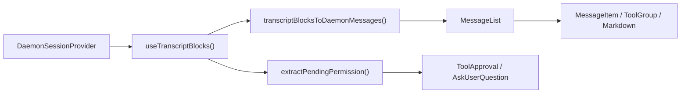
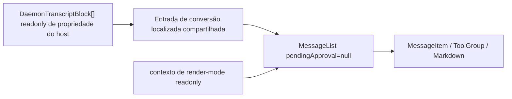

# Design para Renderização Somente Leitura de Transcript do Daemon no WebShell

## Status do Documento

- Status: Implementado
- Data: 2026-07-14
- Escopo: `packages/web-shell`
- Entrada: `readonly DaemonTranscriptBlock[]`
- Saída: uma visão de transcript somente leitura que herda as capacidades de apresentação do `MessageList` do WebShell

## 1. Contexto

O WebShell já tem um caminho completo de renderização de transcript do daemon, mas ele só pode ser usado indiretamente através de `App` ou `ChatPane` na visão dividida. O componente primeiro lê os blocos de transcript de `DaemonSessionProvider`, converte esses blocos em mensagens internas do WebShell e, por fim, os passa para `MessageList` para renderização.

O novo caso de uso já possui um `DaemonTranscriptBlock[]` diretamente e precisa apenas das capacidades de estilização e renderização de mensagens do WebShell para exibir conteúdo histórico. Ele não precisa estabelecer uma conexão de sessão do daemon e não deve realizar mutações de sessão. Interações explicitamente fora do alvo incluem aprovação de ferramentas, `AskUserQuestion`, retry, branch, submissão de prompt e abertura de painéis que modificam o estado da sessão.

Se o host consumir diretamente o resultado de `transcriptBlocksToDaemonMessages` e montar componentes internos, ele expõe o modelo privado `DaemonMessage` do WebShell, contextos e restrições de CSS. Ele também divergiria da renderização suportada quando `MessageList` ganhar features. `@qwen-code/web-shell` portanto precisa fornecer um ponto de entrada público estável.

## 2. Objetivos

1. Adicionar um componente React público que aceita diretamente e renderiza `readonly DaemonTranscriptBlock[]`.
2. Reutilizar o `transcriptBlocksToDaemonMessages()` existente e o mesmo `MessageList`, para que capacidades de usuário, assistente, thinking, ferramenta, subagente, plan, status, Markdown, timeline e rolagem virtual de sessões longas evoluam automaticamente com `MessageList`.
3. Permitir que o componente renderize independentemente sem `DaemonWorkspaceProvider`, `DaemonSessionProvider` ou uma conexão de rede.
4. Não invocar nenhuma mutação de daemon/sessão dentro da fronteira somente leitura, nem exibir UI de resposta para permissões pendentes ou `AskUserQuestion`.
5. Adicionar principalmente exports sem alterar os caminhos de runtime, padrões ou comportamento DOM do `WebShell`, `WebShellWithProviders`, `App` ou `ChatPane` existentes.
6. Adicionar testes unitários completos do componente e passar a suíte de testes existente do WebShell, build, lint e typecheck.

## 3. Não objetivos

- Adicionar recuperação de transcript, paginação, cache ou assinaturas SSE; o host fornece os blocos.
- Inserir um modo somente leitura no `WebShellProps` existente ou adicionar fontes de dados duplas condicionais `readOnly`/`blocks` ao `App`.
- Exportar tipos internos `MessageList`, `Message` ou `DaemonMessage`.
- Exibir ou tratar aprovações de ferramenta não resolvidas ou `AskUserQuestion`.
- Fornecer o composer do shell do App, prompts enfileirados, status de streaming, sidebar, visão dividida, diálogos, painel direito de artefatos ou capacidades similares. A timeline de sessão embutida no `MessageList` permanece.
- Inferir ou carregar artefatos de sessão separados a partir de blocos. Cards de saída de turno de nível de App para mudanças de arquivo, artefatos e tarefas agendadas estão fora de escopo.
- Impedir interações que modificam apenas o estado de apresentação local, como copiar, recolher/expandir ferramenta, expandir turno concluído, filtragem de tabela ou navegação da timeline.

## 4. Terminologia e a Fronteira Somente Leitura

Neste design, "somente leitura" significa **não ler nem modificar o estado de runtime do daemon/sessão**. Não significa definir `pointer-events: none` no DOM inteiro.

| Categoria                    | Comportamento                                                            | Retido                              |
| ---------------------------- | ------------------------------------------------------------------------ | ----------------------------------- |
| Apresentação passiva         | Texto, Markdown, imagens, diff, saída de shell, status de ferramenta/subagente | Sim                          |
| Visualização local           | Copiar, recolher, expandir, rolagem virtual, timeline, ordenação/filtragem de tabela | Sim                     |
| Apresentação customizada pelo host | Renderer de Markdown/bloco de código, renderer de conteúdo de mensagem | Sim; o host é dono de quaisquer efeitos colaterais |
| Links externos comuns        | Navegação em nova janela após transformação segura de URL pelo browser   | Sim                                 |
| Navegação semântica do WebShell | Despachos `qwen-session://` do evento global `qwen:open-session`      | Não; renderizar como texto não interativo |
| Mutação de sessão            | Enviar prompt, cancelar, retry, branch, rewind, trocar modelo/modo       | Não                                 |
| Mutação de permissão         | Aprovar/rejeitar ferramenta, submeter/ignorar `AskUserQuestion`          | Não                                 |
| Carregamento de dados externos | Anexação de sessão iniciada por componente ou busca de transcript/artefato/tarefa/MCP | Não                |

Esta fronteira preserva a experiência de leitura do `MessageList` enquanto garante que o componente em si não tenha capacidade de gravar no daemon.

## 5. Estado Atual e Mapa de Chamadores

| Módulo                                                       | Responsabilidade atual                                                                     | Relação com este design                                             |
| ------------------------------------------------------------ | ------------------------------------------------------------------------------------------ | ------------------------------------------------------------------- |
| `packages/sdk-typescript/src/daemon/ui/types.ts`             | Define a união `DaemonTranscriptBlock`                                                     | Modelo de entrada público para o novo componente                    |
| `packages/web-shell/client/adapters/transcriptToMessages.ts` | Combina blocos em `DaemonMessage[]` do WebShell                                            | Reutilizar diretamente; não criar um novo conversor                 |
| `packages/web-shell/client/hooks/useMessages.ts`             | Lê blocos de um hook de sessão e fornece opções de conversão localizadas                   | Extrair uma entrada de conversão pura compartilhada que aceite blocos externos |
| `packages/web-shell/client/components/MessageList.tsx`       | Recolhimento de turno, grupos de ferramenta/subagente, timeline, rolagem virtual e renderização por mensagem | A única implementação de lista compartilhada pelos caminhos novo e existente |
| `packages/web-shell/client/components/MessageItem.tsx`       | Despacha renderers concretos por papel de mensagem                                         | Nenhuma mudança necessária                                          |
| `packages/web-shell/client/App.tsx`                          | WebShell completo de sessão única, aprovações, composer, painéis laterais                  | Caminho existente permanece inalterado                              |
| `packages/web-shell/client/components/ChatPane.tsx`          | Sessão interativa completa na visão dividida                                               | Caminho existente permanece inalterado                              |
| `packages/web-shell/client/index.tsx` / `index.ts`           | Exports de runtime/fonte do pacote                                                         | Exportar o novo componente e tipo                                   |

O caminho primário atual é:



O novo caminho somente leitura contorna o provider de sessão e o ramo de permissão:



No editor principal do WebShell, `/tasks` e `/mcp` são interceptados dentro do `App`. Eles atualizam apenas o estado React do diálogo, não chamam `sendPrompt()` e não gravam no JSONL da sessão. Transcripts persistidos, portanto, não contêm sentinela para esses dois painéis locais, e a nova entrada não adiciona nenhum ramo correspondente de reconhecimento ou filtragem.

## 6. API Pública

Adicionar um componente chamado `WebShellTranscript`, exportado da raiz do pacote `@qwen-code/web-shell`.

```ts
export interface WebShellTranscriptProps {
  /** Blocos de transcript ordenados de uma sessão lógica. */
  blocks: readonly DaemonTranscriptBlock[];

  theme?: WebShellTheme;
  language?: 'en' | 'zh-CN' | 'zh' | 'zh-cn';
  className?: string;
  style?: React.CSSProperties;
  chatMaxWidth?: number;
  workspaceCwd?: string;

  compactThinking?: boolean;
  collapseCompletedTurns?: boolean;
  markdownTableMode?: MarkdownTableMode;
  virtualScrollThreshold?: number;
  markdown?: WebShellMarkdownCustomization;

  composerTagIcons?: WebShellComposerTagIconMap;
  renderToolHeaderExtra?: ToolHeaderExtraRenderer;
  parseUserMessageContent?: UserMessageContentParser;
  renderUserMessageContent?: UserMessageContentRenderer;
  renderComposerTag?: ComposerTagRenderer;
  renderComposerTagTooltip?: ComposerTagRenderer;
  renderAssistantTurnFooter?: AssistantTurnFooterRenderer;
}

export function WebShellTranscript(
  props: WebShellTranscriptProps,
): React.ReactElement;
```

Notas:

- `blocks` é obrigatório e não é copiado nem modificado. Chamadores devem manter as sessões e a ordenação dos blocos consistentes dentro do array.
- As props visuais reutilizam os nomes e tipos de `WebShellProps`, evitando um segundo conjunto de semânticas de configuração para as mesmas capacidades.
- Não expor `onComposerTagClick`, `onRetryClick`, `onBranchSession`, `onTurnOutputOpen`, callbacks de permissão ou callbacks de composer.
- `theme` tem padrão `dark`. Quando `language` é omitido, usar as regras de resolução de URL/idioma do browser do WebShell. `chatMaxWidth` tem padrão 1000px.
- `compactThinking` tem padrão `false` e `collapseCompletedTurns` tem padrão `true`, correspondendo ao `WebShell` existente.
- O componente trata o transcript como estático/já reproduzido e passa `isResponding={false}` para `MessageList`. Streaming ao vivo está fora do escopo atual da API.

Exemplo:

```tsx
import { WebShellTranscript } from '@qwen-code/web-shell';
import type { DaemonTranscriptBlock } from '@qwen-code/sdk/daemon';

export function HistoryView({
  blocks,
}: {
  blocks: readonly DaemonTranscriptBlock[];
}) {
  return (
    <WebShellTranscript
      blocks={blocks}
      theme="dark"
      language="zh-CN"
      workspaceCwd="/workspace/project"
      style={{ height: 640 }}
    />
  );
}
```

O host deve fornecer ao componente uma altura utilizável. O próprio componente preserva o `height: 100%`, a rolagem interna e o comportamento de largura de conteúdo do WebShell.

## 7. Design Detalhado

### 7.1 Conversão Localizada Compartilhada

Manter `transcriptBlocksToDaemonMessages()` como o único adapter de blocos para mensagens. Extrair uma função pura interna em `useMessages.ts`, por exemplo:

```ts
export function transcriptBlocksToLocalizedMessages(
  blocks: readonly DaemonTranscriptBlock[],
  t: Translator,
): Message[];
```

Exportar esta função apenas do seu módulo de pacote interno para reutilização pelo novo componente; não expô-la da raiz do pacote.

A função apenas monta os rótulos localizados atualmente usados por `useMessages()` e então chama o adapter existente. Tanto o `useMessages()` existente quanto o novo componente a chamam, evitando divergência de texto para cancelamento de prompt, branch, inserção de meio de turno e streams interrompidos.

Esta é a única reestruturação interna necessária no caminho de renderização existente. A entrada, a saída e os resultados de conversão existentes da função permanecem inalterados, e as regras de combinação de blocos do adapter não são modificadas.

### 7.2 Estrutura do Componente `WebShellTranscript`

Adicionar `packages/web-shell/client/components/WebShellTranscript.tsx` com esta sequência interna:

1. Resolver tema e idioma e criar um tradutor.
2. Converter `blocks` para `Message[]` com `useMemo`.
3. Criar o mesmo valor de customização de camada de mensagem que o App existente.
4. Montar os contextos de tema, i18n, customização, modo compacto, render-mode somente leitura e portal do WebShell.
5. Criar uma raiz independente com `data-web-shell-root` e `data-web-shell-shadcn`, reutilizando as classes de tema, variáveis base, fontes, fundo e regras de isolamento de CSS do App.
6. Renderizar o mesmo `MessageList`.

As entradas fixas importantes de `MessageList` são:

```tsx
<MessageList
  messages={messages}
  pendingApproval={null}
  isResponding={false}
  workspaceCwd={workspaceCwd ?? ''}
  virtualScrollThreshold={virtualScrollThreshold}
/>
```

Nunca passar estas props de ação:

- `onShowContextDetail`
- `onRetryClick`
- `onBranchSession`
- `onReviewChanges`
- `onOpenArtifact`
- `onOpenScheduledTask`
- `onTurnOutputOpen`

Não passar dados de carregamento, catch-up, cauda ou saída de turno, evitando qualquer dependência do estado de conexão do App e de modelos de recursos externos.

### 7.3 Isolamento de Renderers Interativos

Passar apenas `pendingApproval=null` para `MessageList` não garante totalmente o comportamento somente leitura. Links de sessão no status de goal, Markdown e resultados de ferramenta não usam callbacks de `MessageList`; eles despacham eventos semânticos globais para `window`, potencialmente mudando o rodapé ou a sessão ativa de outro WebShell na mesma página.

Adicionar um contexto de render-mode de transcript interno do pacote em `client/transcriptRenderMode.ts` com valor padrão `interactive`. O `App` e o `ChatPane` existentes não precisam de novo provider, então seu comportamento permanece inalterado. `WebShellTranscript` define o valor como `readonly`. O modo somente leitura aplica apenas estas restrições:

- Preservar o texto e o estilo de links `qwen-session://`, mas não despachar `qwen:open-session`.
- `GoalStatusMessage` não despacha `GOAL_STATUS_ACTIVE_EVENT`.
- Não interceptar links HTTPS comuns ou interações de visualização local como copiar, recolher e ordenar.

Este contexto muda apenas as saídas de eventos semânticos em `Markdown`, `ToolGroup` e `GoalStatusMessage`, e seu padrão é travado em `interactive`. Isso evita adicionar uma prop `readOnly` que precisaria atravessar cada renderer a partir de `MessageList`. Novos testes unitários devem provar tanto que o comportamento interativo padrão é inalterado quanto que o comportamento somente leitura é suprimido.

### 7.4 Tema, CSS e Portais

O build da biblioteca WebShell injeta e escopa o CSS de componentes sob `[data-web-shell-root]` ou `[data-web-shell-portal-root]`. O novo componente deve criar sua própria raiz WebShell; caso contrário, `MessageList` pode produzir DOM que as regras de módulo CSS não correspondem.

Tooltips de timeline e tabelas avançadas de Markdown usam portais. Para herdar totalmente essas capacidades, o novo componente usa um ciclo de vida de host de portal equivalente ao do App:

- Na montagem, anexar um nó com `data-web-shell-portal-root` e `data-web-shell-shadcn` ao `document.body`.
- Sincronizar a classe de tema e as variáveis CSS da raiz.
- Fornecer o nó através de `WebShellPortalRootContext`.
- Na desmontagem, remover o nó e seu observer/listener.

Manter este ciclo de vida dentro do novo componente em vez de refatorar o código de portal existente do App, limitando a superfície de regressão do comportamento existente à nova entrada. Não acessar `document` durante SSR; habilitar o portal apenas após a montagem no cliente.

### 7.5 Isolamento de Erros

A nova entrada tem uma fronteira pública externa e um componente de conteúdo interno. Conversão de blocos, inicialização de provider/portal e `MessageList` todos ocorrem em um filho da fronteira, garantindo que falhas durante qualquer um desses estágios cheguem ao mesmo `RootErrorFallback` que a entrada pública do WebShell. Cada mensagem permanece isolada pela própria fronteira de `MessageItem`, para que uma falha em um renderer de Markdown, KaTeX, Mermaid ou ferramenta não apague o transcript inteiro.

### 7.6 Estratégia de Renderização de Blocos

Todas as estratégias continuam usando o adapter existente; não adicionar um segundo switch no novo componente.

| `DaemonTranscriptBlock.kind` | Resultado somente leitura                                                        |
| ---------------------------- | -------------------------------------------------------------------------------- |
| `user`                       | Mensagens de usuário, imagens e anotações de entrada                             |
| `assistant`                  | Markdown do assistente; blocos consecutivos mesclados; conteúdo de subagente atribuído pelo pai |
| `thought`                    | Mensagens de thinking; blocos consecutivos mesclados                             |
| `tool`                       | Cards existentes para grupos de ferramentas, diff/read/shell/fetch/todo/subagente |
| `shell`                      | Associar com a ferramenta de execução mais próxima; fallback de raw-shell existente quando indisponível |
| `user_shell`                 | Comando/saída de shell do usuário                                                |
| `status` / `debug`           | Mensagem de plan ou sistema/status                                               |
| `error`                      | Mensagem de sistema de erro sem ação de retry                                    |
| `prompt_cancelled`           | Status de cancelamento localizado                                                |
| `permission` não resolvida   | Não converter, exibir ou fornecer uma entrada de ação                            |
| `permission` resolvida       | Regras existentes de placeholder/resultado de ferramenta histórica do adapter    |
| permissão `AskUserQuestion`  | Não exibir o formulário; exibir resultados históricos apenas quando um bloco de ferramenta real posterior existe |

### 7.7 Atualizações e Desempenho

- Executar a conversão O(n) novamente apenas quando a identidade de `blocks` ou o idioma mudar.
- `MessageList` retém sua memoização existente, agrupamento de turnos e limite de rolagem virtual.
- Não fazer cópia profunda de blocos nem criar um novo provider React para cada bloco.
- Um chamador que frequentemente fornece arrays de identidade nova com conteúdo idêntico dispara a conversão novamente. Isso é aceitável e corresponde ao modelo de atualização atual de `useTranscriptBlocks()`.
- Não adicionar um adapter incremental nesta versão. Projetar conversão incremental separadamente apenas se medições mostrarem que atualizações de transcripts externos grandes são um gargalo.

## 8. Compatibilidade e Controle de Regressão

### 8.1 Caminhos Existentes Permanecem Inalterados

- `WebShellProps` não ganha campos obrigatórios e não muda padrões.
- `WebShell` e `WebShellWithProviders` continuam a renderizar `App`.
- `App` e `ChatPane` continuam a ler o estado da sessão dos seus respectivos providers/hooks.
- O overlay de aprovação, composer, sidebar, visão dividida e painel de artefatos não passam pelo novo componente.
- `MessageList` não ganha um ramo de prop `readOnly`. O novo chamador estabelece o comportamento somente leitura passando `pendingApproval=null`, omitindo callbacks de ação e usando um contexto de render-mode interno cujo padrão permanece interativo para isolar os poucos eventos semânticos globais.

### 8.2 Exports do Pacote

Atualizar tanto `client/index.tsx` quanto `client/index.ts` para exportar:

```ts
export { WebShellTranscript } from './components/WebShellTranscript';
export type { WebShellTranscriptProps } from './components/WebShellTranscript';
```

Ambos os barrels devem mudar para evitar que os caminhos atuais de entrada dupla de runtime e declaração/fonte produzam "exportado em runtime, mas ausente das declarações de tipo". Não adicionar um export de subcaminho de pacote.

### 8.3 Segurança

- A nova entrada não importa `useActions()`, `useTranscriptStore()`, `useConnection()` ou `fetch`.
- Conteúdo de permissão pendente não entra em um renderer interativo.
- Não inspecionar ou reescrever conteúdo de mensagem de status. O estado de diálogo de `/tasks` e `/mcp` está inerentemente ausente de transcripts persistidos.
- O render-mode somente leitura não despacha eventos globais de sessão/goal que possam afetar outro WebShell na mesma página.
- O tratamento de URL Markdown e HTML continua usando o sanitizador/transformador existente do WebShell; não adicionar `dangerouslySetInnerHTML` ou outro bypass.
- Renderers customizados são código do host. Efeitos colaterais executados por um renderer do host estão fora da fronteira garantida de somente leitura do componente, e o README deve declarar isso explicitamente.

## 9. Design de Testes

### 9.1 Novos Testes Unitários de Contrato do Componente

Adicionar `WebShellTranscript.test.tsx`, mockando `MessageList` para verificar a fronteira e o wiring:

1. O adapter localizado compartilhado converte blocos em mensagens com a ordem e o conteúdo corretos.
2. `pendingApproval` é sempre `null`.
3. Callbacks de mutação de sessão, permissão, retry, branch e saída de turno são todos omitidos.
4. `isResponding` tem padrão `false`, e a configuração de workspace e rolagem virtual é encaminhada corretamente.
5. Tema, idioma, comportamento compacto/recolhido e customização de mensagens entram nos contextos corretos.
6. Mudanças em blocos ou idioma regeneram mensagens sem duplicar conteúdo antigo.
7. Blocos vazios renderizam uma lista vazia sem lançar exceção.

### 9.2 Novos Testes Unitários de Integração DOM

Adicionar `WebShellTranscript.dom.test.tsx` usando o `MessageList` real:

1. Renderizar com sucesso em uma árvore React sem providers do daemon.
2. Blocos representativos de usuário, Markdown de assistente, thought, ferramenta, subagente, plan, status, erro e prompt cancelado entram no DOM correspondente do WebShell.
3. Recolher/expandir local, copiar ou navegação da timeline ainda funcionam, provando que as capacidades de `MessageList` são reutilizadas.
4. Uma permissão comum não resolvida não produz um painel de aprovação.
5. Um `AskUserQuestion` não resolvido não produz UI de opção, entrada, submissão ou ignorar.
6. Resultados históricos de ferramenta/AskUser resolvidos seguem as regras de apresentação existentes do adapter.
7. Links de sessão e status de goal somente leitura não despacham eventos semânticos globais; testes de componentes existentes correspondentes continuam a provar que o comportamento interativo padrão é inalterado.
8. Classes dark/light, idioma, texto localizado, largura máxima do chat e marcadores de raiz CSS estão corretos.
9. A raiz de portal monta e desmonta corretamente, e o conteúdo do portal está sob a raiz com escopo.
10. Quando um renderer customizado individual lança exceção, o fallback do renderer embutido é usado e o restante da mensagem permanece.

### 9.3 Testes de Conversão Compartilhada e Exports

- Estender os testes de `useMessages`/adapter para provar que o hook existente e os blocos externos usam exatamente as mesmas opções localizadas.
- Estender `index.test.tsx` ou testes de artefato de build para verificar que o export nomeado de runtime existe.
- Após o build, verificar que `dist/types/index.d.ts` contém exports para `WebShellTranscript` e suas props, evitando divergência entre as duas declarações de entrada.

### 9.4 Suíte de Regressão Existente

A sequência mínima de verificação obrigatória após a implementação é:

```bash
cd packages/web-shell
npm run build
npx vitest run --config vitest.config.ts \
  client/components/WebShellTranscript.test.tsx \
  client/components/WebShellTranscript.dom.test.tsx \
  client/hooks/useMessages.test.ts \
  client/adapters/transcriptToMessages.test.ts \
  client/components/MessageList.test.ts \
  client/components/MessageList.dom.test.tsx \
  client/components/messages/Markdown.test.ts \
  client/components/messages/ToolGroup.test.tsx \
  client/components/messages/SystemMessage.test.tsx \
  client/index.test.tsx
npm test
npm run format:check
npm run lint
npm run typecheck

cd ../..
npm run build
npm run typecheck
```

`npm test` é a suíte completa existente do WebShell e deve passar para esta mudança. A mudança não adiciona nenhuma página independente e não altera o protocolo App/daemon do smoke test Playwright existente, então nenhum teste E2E de browser é adicionado. `WebShellTranscript.dom.test.tsx` cobre o comportamento real de DOM.

## 10. Etapas de Implementação

1. Extrair a conversão localizada compartilhada de blocos em `useMessages.ts`, preservando a saída atual do hook.
2. Adicionar um contexto interno de render-mode de transcript e consumi-lo nas saídas de link de sessão/evento de goal; preservar `interactive` como padrão.
3. Adicionar `WebShellTranscript` e suas props, implementando o wiring de raiz/provider/portal/`MessageList`.
4. Adicionar exports de runtime e tipo a ambos os barrels públicos.
5. Atualizar `packages/web-shell/README.md` com um exemplo de integração somente leitura, o requisito de altura do host e a fronteira somente leitura.
6. Adicionar testes de contrato, DOM, isolamento de interação e export/declaração de tipo.
7. Executar os testes direcionados, a suíte completa de testes do WebShell, build, lint e typecheck.
8. Revisar o diff completo de acordo com a orientação do repositório; reexecutar a etapa 7 após qualquer correção.

## 11. Alternativas

### 11.1 Adicionar `blocks` e `readOnly` ao `WebShell` Existente

Rejeitado. `App` atualmente consome vários hooks do daemon incondicionalmente e gerencia aprovações, composer, sessão, sidebar e painéis. Fontes de dados duplas adicionariam ramos condicionais por todo `App`, exigindo providers enquanto também protege contra mutação. Sua superfície de regressão é muito maior do que este requisito.

### 11.2 Exportar Publicamente `MessageList`

Rejeitado. Chamadores ainda dependeriam de `Message[]` privado, múltiplos contextos, convenções de raiz CSS e convenções de portal, e o modelo interno se tornaria uma API pública de longo prazo.

### 11.3 Duplicar o Renderer para Uso Somente Leitura

Rejeitado. A duplicação bifurcaria imediatamente o comportamento de Markdown, ferramenta/subagente, recolhimento de turno, timeline e rolagem virtual, falhando no requisito de herdar as capacidades de renderização de `MessageList`.

### 11.4 Exibir Permission/AskUserQuestion Desabilitados no Novo Componente

Rejeitado. Formulários desabilitados ainda criam semânticas interativas e ramos de estado adicionais, e levam os usuários a pensar que podem responder em uma visão histórica. Permissões pendentes ficam ocultas nesta versão; blocos de ferramenta subsequentes carregam os resultados históricos.

## 12. Riscos e Mitigações

| Risco                                                        | Mitigação                                                                                                 |
| ------------------------------------------------------------ | --------------------------------------------------------------------------------------------------------- |
| A conversão localizada diverge entre a nova entrada e o App  | Ambos chamam o mesmo helper de conversão localizada                                                        |
| O portal perde o escopo de CSS                               | Criar um `data-web-shell-portal-root` separado, sincronizar variáveis e cobrir com testes de DOM           |
| Mutação acidental do daemon                                  | O novo componente não importa hooks de ação e não expõe callback de mutação; testes de contrato travam isso |
| Estado de diálogo local do App é confundido com dados de transcript | Documentar explicitamente que `/tasks` e `/mcp` não gravam JSONL; a nova entrada não copia o estado de diálogo do App |
| Eventos semânticos globais afetam outro WebShell na página   | O render-mode somente leitura suprime eventos de sessão/goal; testes de regressão cobrem o comportamento padrão |
| Um novo tipo de bloco não tem apresentação                   | Continuar suportando-o através do adapter compartilhado; não duplicar um switch no componente             |
| Exports de runtime e tipo do pacote divergem                 | Atualizar ambos os barrels e inspecionar as declarações construídas                                        |
| Custo de recômputo de transcripts grandes                    | `useMemo` mais rolagem virtual existente; adiar conversão incremental até ser suportada por medições       |
| Renderer customizado introduz efeitos colaterais             | Documentar a responsabilidade do host; renderers padrão permanecem somente leitura                         |

## 13. Critérios de Aceitação

- Um host pode renderizar um transcript do WebShell em um ambiente sem providers do daemon fornecendo apenas blocos.
- Blocos representativos renderizam de forma idêntica aos mesmos dados no `MessageList` existente do WebShell.
- Permissões de ferramenta pendentes e `AskUserQuestion` não produzem UI interativa ou caminho de submissão.
- A visão somente leitura não despacha eventos semânticos globais de sessão/goal.
- O novo componente retém as interações locais de leitura e as capacidades de listas longas do `MessageList`.
- APIs, padrões, testes e comportamento de runtime existentes de `WebShell`/`WebShellWithProviders` permanecem inalterados.
- Tanto o runtime quanto o `.d.ts` de `@qwen-code/web-shell` exportam o novo componente e props.
- Os novos testes unitários, a suíte completa existente do WebShell e o build/typecheck da raiz passam.
