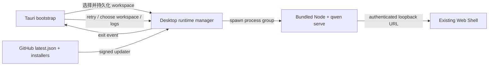

# Design de Lançamento do Desktop Web Shell

## Problema

O PoC atual de desktop já provou que o Tauri pode reutilizar o Web Shell
fornecido pelo daemon, sem precisar manter uma segunda UI. Mas o PoC ainda
não tem os fluxos de usuário, recuperação de falhas, atualização assinada,
limites de segurança e artefatos de instalação para três plataformas
exigidos por um lançamento público.

Este design completa `packages/desktop-shell` como uma casca de desktop fina:
a casca de desktop é responsável apenas pelo ciclo de vida e integração com a
plataforma; as funcionalidades do produto continuam sendo fornecidas por
`qwen serve` e `@qwen-code/web-shell`.

## Objetivos

- macOS, Windows e Linux usam o mesmo conjunto de UI do Web Shell.
- Na primeira inicialização o usuário pode escolher o workspace; em
  inicializações subsequentes o workspace mais recente é restaurado.
- Quando o daemon falha ao iniciar ou sai durante a execução, uma tela de
  recuperação acionável é fornecida, em vez de uma saída silenciosa.
- A casca de desktop carrega apenas a página de bootstrap local e o daemon em
  porta aleatória local; URLs externas são sempre entregues ao navegador do
  sistema.
- Artefatos de lançamento trazem versão, origem, licença, checksums e
  metadados de atualização assinada.
- O release público completa assinatura e notarização no macOS, assinatura
  Authenticode no Windows; no Linux gera AppImage e deb.

## Não objetivos

- Nenhuma UI de chat, modelo de sessão ou API de daemon exclusivos de
  desktop.
- Não copiar o Web Shell para dentro do pacote de desktop para manutenção.
- Não implementar múltiplas janelas, múltiplos workspaces simultâneos ou
  residente em background.
- Nenhuma promessa de distribuição via Store; a primeira versão pública usa
  GitHub Releases.
- Não embutir Git, shell ou outras ferramentas de sistema. Ferramentas
  ausentes continuam sendo reportadas pelas capacidades existentes do Web
  Shell.

## Arquitetura



### Responsabilidades dos componentes

| Componente       | Responsabilidade                                                      |
| ---------------- | --------------------------------------------------------------------- |
| página de bootstrap | estado de inicialização, seleção de workspace, recuperação de falhas, entradas de versão e logs |
| estado de desktop em Rust | persistência de configurações, estado da janela, ciclo de vida do runtime, instância única, estado de atualização |
| runtime bundled  | Node.js da plataforma atual, bundle do Qwen Code, recursos estáticos do Web Shell |
| CI de lançamento | build para três plataformas, assinatura, notarização, smoke, checksums, latest.json, GitHub Release |

## Máquina de estados de inicialização

| Estado            | O que o usuário vê                   | Ações disponíveis                 |
| ----------------- | ------------------------------------ | --------------------------------- |
| `starting`        | Página de inicialização da marca Qwen Code e workspace atual | aguardar |
| `needs_workspace` | Seleção de workspace na primeira inicialização | escolher diretório |
| `ready`           | Web Shell servido pelo daemon        | uso normal                        |
| `failed`          | Resumo de erro simplificado          | retry, escolher outro diretório, abrir logs |
| `stopped`         | Aviso de saída inesperada do daemon  | reiniciar daemon, escolher diretório, abrir logs |

O app primeiro cria a janela de bootstrap, então inicia o daemon
assincronamente. Depois que o deep health check do daemon
(`/health?deep=true`) passa, a mesma janela navega para
`http://127.0.0.1:<port>/#token=<token>`. O token existe apenas no fragment
da URL, nunca é enviado ao servidor com requisições, então nenhum handshake
de cookie é necessário e ele não entra em access log nem em Referer. Assim,
tanto a inicialização lenta quanto os caminhos de falha têm UI visível.

O deep health check deve ser usado: o fast path do serve responde ao `/health`
raso com o app de bootstrap antes que o runtime real (incluindo o Web Shell)
seja montado. Nesse momento `/health?deep=true` ainda retorna
`503 {"reason": "bootstrap"}`, então apenas quando ele se torna 200 o Web
Shell está disponível; se a prontidão fosse determinada pelo health check
raso, a navegação colidiria com a janela de runtime adiado (deferred).

## Seleção e persistência de workspace

O arquivo de configurações fica em `desktop-state.json` sob o
`app_config_dir` do Tauri:

```json
{
  "workspace": "/absolute/path",
  "window": {
    "width": 1280,
    "height": 820,
    "x": 120,
    "y": 80,
    "maximized": false
  }
}
```

Prioridade de inicialização:

1. `QWEN_DESKTOP_WORKSPACE`, para desenvolvimento e testes automatizados.
2. O workspace mais recente no arquivo de configurações.
3. Na primeira inicialização, mostrar o seletor de diretório.

Apenas um caminho absoluto canônico que já existe e é um diretório é passado
ao daemon. Ao escolher um novo workspace, o process group atual é parado
primeiro e então reiniciado com o novo diretório.

## Ciclo de vida do runtime e recuperação

- A cada inicialização um bearer token de 256 bits é gerado, entregue ao
  daemon através do ambiente do subprocesso (`QWEN_SERVER_TOKEN`) e passado
  ao front-end do Web Shell pelo fragment da URL (`/#token=<token>`); o
  front-end o lê, limpa da URL e chama a API com o header
  `Authorization: Bearer`. O fragment não é enviado ao servidor, então
  nenhum cookie é necessário.
- O daemon faz bind em `127.0.0.1` em porta aleatória e habilita
  `--require-auth`.
- stdout e stderr são escritos simultaneamente em logs rotativos, e um
  resumo limitado de inicialização é retido para exibição na UI.
- O Rust monitora a saída do processo do daemon; paradas causadas por saídas
  fora do app disparam o evento `runtime-stopped` e retornam à página de
  falha do bootstrap.
- O retry sempre cria um novo token e daemon, nunca reutiliza um processo que
  saiu.
- Na saída do app, todo o grupo de subprocessos é terminado, evitando daemon
  órfão.

## Janela e instância única

- Tamanho mínimo da janela principal 900 × 600, padrão 1280 × 820.
- Estado de fechar, mover, redimensionar e maximizar é persistido; na
  restauração, posições invisíveis fora da tela regridem para centralizado.
- O plugin de instância única deve ser registrado primeiro. Uma segunda
  inicialização apenas foca e restaura a janela principal, sem iniciar o
  daemon novamente.

## Limites de segurança

- CSP do bootstrap:
  `default-src 'self'; script-src 'self'; style-src 'self' 'unsafe-inline'; img-src 'self' data:; connect-src ipc: http://ipc.localhost; object-src 'none'; base-uri 'none'; form-action 'none'; frame-ancestors 'none'`.
- O Web Shell continua gerando sua própria CSP pelo daemon; a casca de
  desktop não afrouxa a política das páginas do daemon.
- A janela principal permite apenas o protocolo customizado do bootstrap e
  navegação same-origin do daemon selecionado.
- Links externos `http`, `https`, `mailto` vão para o navegador do sistema;
  `file`, `javascript` e protocolos customizados são rejeitados.
- Downloads de blob são permitidos apenas quando iniciados pelo Web Shell
  principal, e o callback de download nativo escolhe um caminho de destino
  seguro.
- O Tauri não expõe APIs JavaScript de filesystem, shell ou processo; o
  bootstrap usa apenas commands `invoke` explícitos.
- O manifest do Windows usa `asInvoker`, Common Controls v6 e consciência de
  caminho longo.
- Hardened runtime do macOS habilitado; entitlements contêm apenas as
  capacidades necessárias para rodar o WebView com JIT e cliente/servidor de
  rede.

## Metadados de build e conformidade

`prepare-runtime.js` gera:

- `manifest.json`: versão do desktop, versão do Qwen Code, commit do Qwen
  Code, versão do Node, target, hora do build.
- `checksums.json`: SHA-256 de todos os arquivos do runtime bundled.
- `LICENSE` raiz e `NOTICE` do desktop.
- `LICENSE` do Node.js.

O smoke pré-empacotamento valida manifest, arquivos críticos e checksum. O
GitHub Release publica simultaneamente um `SHA256SUMS.txt` para cada
artefato de instalação.

## Modelo de atualização

O updater do Tauri usa artefatos de atualização assinados e uma chave pública
fixa. Após a inicialização do app, a atualização é verificada uma vez em
background:

- Sem atualização: não incomodar o usuário.
- Falha na verificação: escrever no log, sem bloquear a inicialização.
- Com atualização: uma caixa de diálogo nativa de confirmação é exibida sobre
  o bootstrap/Web Shell; após confirmação do usuário, baixar e instalar,
  então reiniciar.

O CI de lançamento usa `TAURI_SIGNING_PRIVATE_KEY` e
`TAURI_SIGNING_PRIVATE_KEY_PASSWORD` para gerar as assinaturas do updater.
`latest.json` aponta para os pacotes de atualização por plataforma no mesmo
GitHub Release. Apenas releases não draft e não prerelease atualizam o feed
release fixo `desktop-latest`.

## Matriz de lançamento por plataforma

| Plataforma | Arquitetura | Pacotes de instalação                | Requisitos de assinatura                |
| ---------- | ----------- | ------------------------------------ | --------------------------------------- |
| macOS      | arm64, x64  | `.dmg`, updater `.app.tar.gz`        | Developer ID Application + notarização  |
| Windows    | x64         | updater/installer NSIS `.exe`        | Authenticode SHA-256 + timestamp        |
| Linux      | x64         | updater/installer `.AppImage`, `.deb` | minisign do updater; sem code-signing de SO |

O WebView2 do Windows usa o download bootstrapper; quando o sistema está
offline e o WebView2 está ausente, a falha de instalação informa claramente a
dependência. O CI de Linux instala as dependências de build do Tauri
WebKit/GTK, AppImage e deb.

## Fluxo de lançamento

1. Entrar com a versão do desktop e o ref do Qwen Code a ser vendorizado.
2. Verificar que o ref é rastreável até um commit com permissão de
   lançamento.
3. Sincronizar versões do package desktop-shell, Cargo e Tauri. As versões
   são definidas transitoriamente pelo CI apenas em cada build e não são
   commitadas de volta no repositório; o branch `main` mantém
   intencionalmente a versão de desenvolvimento placeholder (`0.0.1`), e as
   versões publicadas são determinadas pelas git tags.
4. Preparar o runtime para cada plataforma, rodar o smoke de
   checksum/runtime e os testes Rust.
5. Construir pacotes de instalação e artefatos do updater.
6. O runner da plataforma instala e inicia o app empacotado, esperando por
   evidência de pronto do daemon/Web Shell.
7. Enviar artefatos; o job de release gera `latest.json` e `SHA256SUMS.txt`.
8. Releases stable não draft atualizam o feed `desktop-latest`.

Quando chaves de assinatura estão ausentes, apenas `dry_run=true` é
permitido; lançamentos públicos devem ser fail closed.

## Critérios de validação

- Na primeira inicialização é possível escolher um diretório e entrar no Web
  Shell.
- Reiniciar restaura o workspace e a posição da janela.
- Workspace inválido, runtime ausente e saída antecipada do daemon exibem a
  página de recuperação.
- Depois que o daemon é terminado durante a execução, o usuário consegue
  reiniciar na mesma janela.
- Links externos vão para o navegador do sistema; a janela principal não sai
  da origem do daemon.
- O smoke do app empacotado nas três plataformas observa `/health`, a
  navegação raiz do Web Shell não autenticada retorna 200 (e nenhum cookie é
  emitido), e `/capabilities` sem token retorna 401.
- A assinatura do manifest do updater pode ser verificada pelo cliente;
  downgrade de versão é rejeitado.
