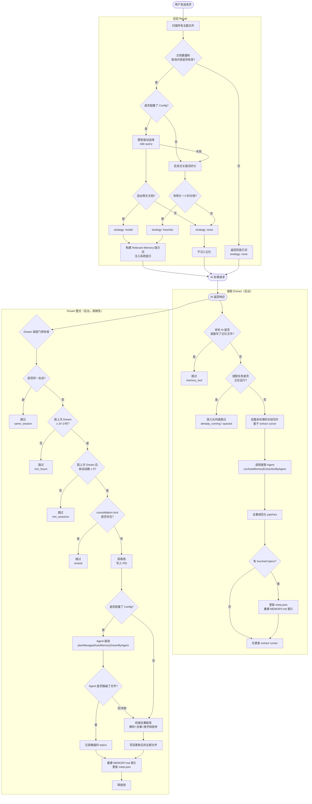
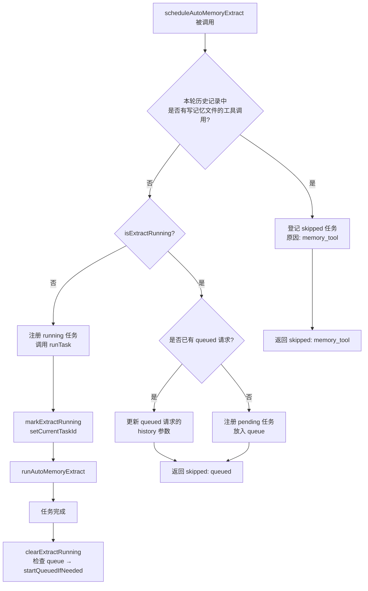
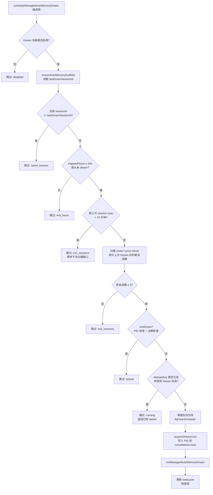
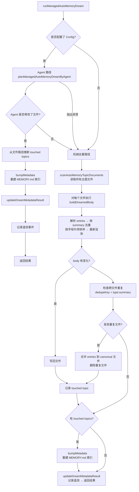
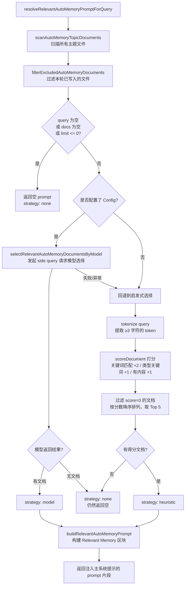
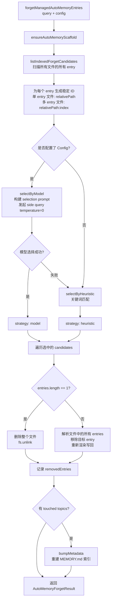

# Memory: Sistema de Gerenciamento de Memória

> Este documento descreve o mecanismo de gerenciamento de memória, os gatilhos e os detalhes de implementação do **Managed Auto-Memory** no Qwen Code.

---

## Índice

1. [Visão Geral](#visão-geral)
2. [Estrutura de Armazenamento](#estrutura-de-armazenamento)
3. [Tipos de Memória](#tipos-de-memória)
4. [Formato dos Itens de Memória](#formato-dos-itens-de-memória)
5. [Ciclo de Vida Principal](#ciclo-de-vida-principal)
6. [Extract — Extração](#extract--extração)
7. [Dream — Consolidação](#dream--consolidação)
8. [Recall — Recuperação](#recall--recuperação)
9. [Forget — Esquecimento](#forget--esquecimento)
10. [Reconstrução de Índice](#reconstrução-de-índice)
11. [Telemetria](#telemetria)

---

## Visão Geral

O Managed Auto-Memory é um sistema de memória persistente que acumula, consolida e recupera automaticamente conhecimentos relacionados ao usuário durante sessões de IA. Ele mantém o ciclo de vida da memória por meio de quatro operações principais:

| Operação | Inglês | Gatilho | Função |
| ---- | ------- | -------------------------- | -------------------------------------- |
| Extração | Extract | Automático (após cada turno de conversa) | Extrai novos conhecimentos do histórico e os grava no arquivo de memória |
| Consolidação | Dream | Automático (tarefa periódica em segundo plano) | Remove duplicatas e mescla arquivos de memória para mantê-los organizados |
| Recuperação | Recall | Automático (antes de cada turno de conversa) | Recupera memórias relevantes para a solicitação atual e as injeta no prompt do sistema |
| Esquecimento | Forget | Manual (comando do usuário `/forget`) | Remove com precisão itens de memória específicos |

---

## Estrutura de Armazenamento

### Layout de Diretórios

```
~/.qwen/                                      ← 全局基础目录（默认）
└── projects/
    └── <sanitized-git-root>/                 ← 项目标识（基于 Git 根路径）
        ├── meta.json                         ← 元数据（提取/整合时间戳、状态）
        ├── extract-cursor.json               ← 提取游标（已处理的对话偏移量）
        ├── consolidation.lock                ← Dream 进程互斥锁
        └── memory/                           ← 记忆主目录
            ├── MEMORY.md                     ← 索引文件（自动生成，汇总所有条目）
            ├── user.md                       ← 用户偏好记忆（示例）
            ├── feedback.md                   ← 反馈规范记忆（示例）
            ├── project/
            │   └── milestone.md              ← 项目记忆（支持子目录）
            └── reference/
                └── grafana.md                ← 外部资源记忆
```

> **Substituição por Variáveis de Ambiente**:
>
> - `QWEN_CODE_MEMORY_BASE_DIR`: substitui o diretório base global
> - `QWEN_CODE_MEMORY_LOCAL=1`: usa o caminho relativo ao projeto `.qwen/memory/`

### Descrição dos Arquivos Principais

| Arquivo | Descrição |
| --------------------- | ---------------------------------------------------------------------- |
| `meta.json` | Registra a hora da última operação Extract / Dream, ID da sessão, tipos de memória envolvidos e status de execução |
| `extract-cursor.json` | Registra até qual offset do histórico a sessão atual já foi processada, evitando extrações duplicadas |
| `consolidation.lock` | Lock de arquivo durante a execução do Dream; contém o PID do detentor e expira automaticamente após 1 hora |
| `MEMORY.md` | Índice de todos os arquivos de tópico; reconstruído após cada Extract/Dream no formato de lista Markdown |

---

## Tipos de Memória

O sistema suporta quatro tipos de memória integrados, cada um correspondendo a uma dimensão diferente de informação:

| Tipo | Conteúdo Armazenado | Quando é Gravado | Quando é Lido |
| ----------- | ----------------------------------------------------- | ---------------------------------------- | ---------------------------- |
| `user` | Função do usuário, background técnico, hábitos de trabalho | Ao identificar a função/preferências/background do usuário | Quando a resposta precisa ser adaptada ao contexto do usuário |
| `feedback` | Diretrizes do usuário para o comportamento da IA: o que evitar, o que manter | Quando o usuário corrige a IA ou valida uma abordagem não óbvia | Quando impacta a forma como a IA deve se comportar |
| `project` | Progresso do projeto, objetivos, decisões, prazos, rastreamento de bugs | Ao identificar quem está fazendo o quê, o motivo e os prazos | Quando ajuda a IA a entender o contexto e a motivação do trabalho |
| `reference` | Ponteiros para recursos externos (Dashboards, sistemas de tickets, canais do Slack, etc.) | Ao identificar um recurso externo e sua finalidade | Quando o usuário menciona sistemas externos ou informações relacionadas |

**Conteúdo que NÃO deve ser armazenado na memória**: padrões/convenções de código, histórico do Git, soluções de debug, estados de tarefas temporárias ou conteúdo já registrado em `QWEN.md`/`AGENTS.md`.

---

## Formato dos Itens de Memória

Cada arquivo de tópico usa o formato **YAML frontmatter + corpo Markdown**:

```markdown
---
name: 记忆名称
description: 一句话描述（用于判断召回相关性，要具体）
type: user|feedback|project|reference
---

记忆主体内容（summary 行）

Why: 背后原因（让 AI 能理解边界情况而不是盲目遵守规则）
How to apply: 适用场景和使用方式
```

Para os tipos `feedback` e `project`, é altamente recomendável preencher `Why` e `How to apply` para garantir que a memória seja aplicada corretamente mesmo em casos de borda.

---

## Ciclo de Vida Principal



---

## Extract — Extração

### Gatilho

Acionado automaticamente (em segundo plano, sem bloqueio) por `scheduleAutoMemoryExtract` sempre que a IA conclui uma resposta.

### Lógica de Agendamento (`extractScheduler.ts`)



**Explicação dos motivos de pulo**:

| Motivo | Significado |
| ----------------- | ----------------------------------------------- |
| `memory_tool` | O Agent principal já gravou arquivos de memória nesta rodada; ignora para evitar conflitos |
| `already_running` | A extração já está em execução e não pode ser enfileirada |
| `queued` | Uma extração já está rodando; esta solicitação foi colocada na fila |

### Fluxo Principal de Extração (`extract.ts`)

```mermaid
flowchart TD
    A[runAutoMemoryExtract] --> B[ensureAutoMemoryScaffold\n初始化目录和文件]
    B --> C[buildTranscriptMessages\n将 Content[] 转换为带 offset 的消息列表]
    C --> D[readExtractCursor\n读取上次处理到的位置]
    D --> E[loadUnprocessedTranscriptSlice\n截取未处理的消息段]
    E --> F{slice 为空?}
    F -- 是 --> G[返回无 patches 结果]
    F -- 否 --> H[runAutoMemoryExtractionByAgent\n调用 forked agent 提取 patches]
    H --> I[dedupeExtractPatches\n去重+规范化]
    I --> J{有 touched topics?}
    J -- 是 --> K[bumpMetadata\n更新 meta.json]
    K --> L[rebuildManagedAutoMemoryIndex\n重建 MEMORY.md]
    L --> M[writeExtractCursor\n记录最新 offset]
    J -- 否 --> M
    M --> N[返回 AutoMemoryExtractResult]
```

**Cursor de Extração**:

- Campos: `{ sessionId, processedOffset, updatedAt }`
- Após cada extração, atualiza `processedOffset` para o comprimento atual do histórico
- Na próxima extração, processa apenas mensagens com `offset >= processedOffset`
- Em mudanças de sessão (`sessionId` alterado), reinicia do offset 0

**Regras de Filtragem de Patch**:

- Resumo com menos de 12 caracteres → descartado
- Resumo termina com `?` → descartado (pergunta)
- Contém palavras-chave temporárias (today/now/currently/temporary, etc.) → descartado
- Combinação `topic:summary` duplicada → removida

---

## Dream — Consolidação

### Gatilho

Acionado automaticamente (em segundo plano, sem bloqueio) por `scheduleManagedAutoMemoryDream` após cada resposta da IA. No entanto, é protegido por várias condições de gate, sendo ignorado na maioria dos casos.

### Gate de Agendamento (`dreamScheduler.ts`)



**Parâmetros do Gate**:

| Parâmetro | Valor Padrão | Descrição |
| -------------------------- | -------- | ----------------------------- |
| `minHoursBetweenDreams` | 24 horas | Intervalo mínimo entre duas operações Dream |
| `minSessionsBetweenDreams` | 5 sessões | Número mínimo de novas sessões para acionar o Dream |
| `SESSION_SCAN_INTERVAL_MS` | 10 minutos | Intervalo de throttle para varredura de arquivos de sessão |
| `DREAM_LOCK_STALE_MS` | 1 hora | Limite de tempo para considerar o arquivo de lock como expirado |

**Mecanismo de Lock**:

- O arquivo de lock fica em `<project-state-dir>/consolidation.lock`
- Contém o PID do processo detentor
- Na verificação: se o processo do PID não existir mais (falha em `kill(pid, 0)`) ou o lock tiver mais de 1 hora → considerado expirado e removido automaticamente

### Fluxo de Execução da Consolidação (`dream.ts`)



**Lógica de Deduplicação Mecânica**:

1. Dentro de cada arquivo de tópico: remove duplicatas por `summary.toLowerCase()`, mesclando os campos `why`/`howToApply`
2. Reordena os resumos em ordem alfabética
3. Entre arquivos: entradas com o mesmo `type:summary` são mescladas no primeiro arquivo encontrado, e os arquivos duplicados são excluídos

---

## Recall — Recuperação

### Gatilho

Acionado automaticamente por `resolveRelevantAutoMemoryPromptForQuery` antes de a IA processar cada solicitação do usuário, injetando memórias relevantes no prompt do sistema.

### Fluxo de Recuperação (`recall.ts`)



**Regras de Pontuação (Heurística)**:

| Condição | Pontuação |
| -------------------------------- | ---------------- |
| Token da query aparece no conteúdo do documento | +2 (por token) |
| Token da query é uma palavra-chave característica do tipo | +1 (por token) |
| Corpo do documento não está vazio | +1 |

**Palavras-chave características por tipo**:

- `user`: user, preference, background, role, terse
- `feedback`: feedback, rule, avoid, style, summary
- `project`: project, goal, incident, deadline, release
- `reference`: reference, dashboard, ticket, docs, link

**Regras de Construção do Prompt**:

- Injeta no máximo 5 documentos (`MAX_RELEVANT_DOCS`)
- Trunca o corpo de cada documento para 1200 caracteres (`MAX_DOC_BODY_CHARS`)
- Adiciona o aviso `"NOTE: Relevant memory truncated for prompt budget."` quando há truncamento
- Inclui informações de atualidade do documento (baseado no `mtime` do arquivo)

---

## Forget — Esquecimento

### Gatilho

Acionado manualmente pelo usuário ao executar o comando `/forget <query>`.

### Fluxo de Esquecimento (`forget.ts`)



**Design do ID de Entry**:

- Arquivos de entrada única (caso comum): `relativePath` (ex: `feedback/no-summary.md`)
- Arquivos de múltiplas entradas: `relativePath:index` (ex: `feedback/style.md:2`)
- O uso de IDs estáveis permite que o modelo localize entradas com precisão sem afetar outras entradas no mesmo arquivo

---

## Reconstrução de Índice

O `MEMORY.md` é o índice de navegação de todos os arquivos de tópico. Ele é reconstruído chamando `rebuildManagedAutoMemoryIndex` após cada operação de Extract ou Dream:

```
- [用户偏好](user/preferences.md) — 用户是资深 Go 工程师，第一次接触 React
- [反馈规范](feedback/style.md) — 保持回复简洁，不要尾部总结
- [项目里程碑](project/milestone.md) — 移动端发布切分支前的合并冻结窗口
```

**Limitações do Índice**:

- Máximo de 150 caracteres por linha (excedentes são truncados com `…`)
- Máximo de 200 linhas
- Tamanho total não pode exceder 25.000 bytes

---

## Telemetria

O sistema inclui três tipos de eventos de telemetria para monitorar o desempenho e a eficácia das operações de memória:

### Telemetria do Extract

| Campo | Tipo | Descrição |
| ---------------- | --------------------------- | ----------------------- |
| `trigger` | `'auto'` | Gatilho (atualmente apenas automático) |
| `status` | `'completed'` \| `'failed'` | Resultado da execução |
| `patches_count` | number | Quantidade de patches válidos extraídos |
| `touched_topics` | string[] | Lista de tipos de memória gravados |
| `duration_ms` | number | Tempo total de execução (ms) |

### Telemetria do Dream

| Campo | Tipo | Descrição |
| ----------------- | ------------------------------------- | ---------------------- |
| `trigger` | `'auto'` | Gatilho |
| `status` | `'updated'` \| `'noop'` \| `'failed'` | Resultado da execução |
| `deduped_entries` | number | Quantidade de entradas deduplicadas via caminho mecânico |
| `touched_topics` | string[] | Lista de tipos de memória modificados |
| `duration_ms` | number | Tempo total de execução (ms) |

### Telemetria do Recall

| Campo | Tipo | Descrição |
| --------------- | -------------------------------------- | ---------------- |
| `query_length` | number | Comprimento da string de consulta |
| `docs_scanned` | number | Total de documentos varridos |
| `docs_selected` | number | Número final de documentos injetados |
| `strategy` | `'none'` \| `'heuristic'` \| `'model'` | Estratégia de seleção |
| `duration_ms` | number | Tempo total de execução (ms) |

---

## Índice de Arquivos de Origem Relacionados

| Arquivo | Responsabilidade |
| ---------------------------------------------------- | ----------------------------------------------------------------------------- |
| `packages/core/src/memory/types.ts` | Definições de tipo: `AutoMemoryType`, `AutoMemoryMetadata`, `AutoMemoryExtractCursor` |
| `packages/core/src/memory/paths.ts` | Cálculo de caminhos: `getAutoMemoryRoot`, `isAutoMemPath`, helpers de caminhos de arquivos |
| `packages/core/src/memory/store.ts` | Inicialização de scaffolding: `ensureAutoMemoryScaffold`, leitura/gravação de índice e metadados |
| `packages/core/src/memory/scan.ts` | Varredura de arquivos de tópico: `scanAutoMemoryTopicDocuments`, parsing de frontmatter |
| `packages/core/src/memory/entries.ts` | Parsing e renderização de entradas: `parseAutoMemoryEntries`, `renderAutoMemoryBody` |
| `packages/core/src/memory/extract.ts` | Lógica principal de extração: `runAutoMemoryExtract`, gerenciamento de cursor, deduplicação de patches |
| `packages/core/src/memory/extractScheduler.ts` | Agendador de extração: `ManagedAutoMemoryExtractRuntime`, fila/máquina de estados de execução |
| `packages/core/src/memory/extractionAgentPlanner.ts` | Agent de extração: `runAutoMemoryExtractionByAgent` |
| `packages/core/src/memory/dream.ts` | Lógica principal de consolidação: `runManagedAutoMemoryDream`, caminho via Agent + deduplicação mecânica |
| `packages/core/src/memory/dreamScheduler.ts` | Agendador de consolidação: `ManagedAutoMemoryDreamRuntime`, verificação de gates, gerenciamento de lock |
| `packages/core/src/memory/dreamAgentPlanner.ts` | Agent de consolidação: `planManagedAutoMemoryDreamByAgent` |
| `packages/core/src/memory/recall.ts` | Lógica de recuperação: `resolveRelevantAutoMemoryPromptForQuery`, caminhos duplos (heurístico + modelo) |
| `packages/core/src/memory/forget.ts` | Lógica de esquecimento: `forgetManagedAutoMemoryEntries`, geração de candidatos + remoção precisa |
| `packages/core/src/memory/indexer.ts` | Reconstrução de índice: `rebuildManagedAutoMemoryIndex`, `buildManagedAutoMemoryIndex` |
| `packages/core/src/memory/prompt.ts` | Templates de prompt do sistema: descrição de tipos de memória, exemplos de formato, diretrizes de uso |
| `packages/core/src/memory/governance.ts` | Tipos de sugestão de governança: `AutoMemoryGovernanceSuggestionType` |
| `packages/core/src/memory/state.ts` | Estado de execução da extração: `isExtractRunning`, `markExtractRunning`, `clearExtractRunning` |
| `packages/core/src/memory/memoryAge.ts` | Descrição de atualidade: `memoryAge`, `memoryFreshnessText` |