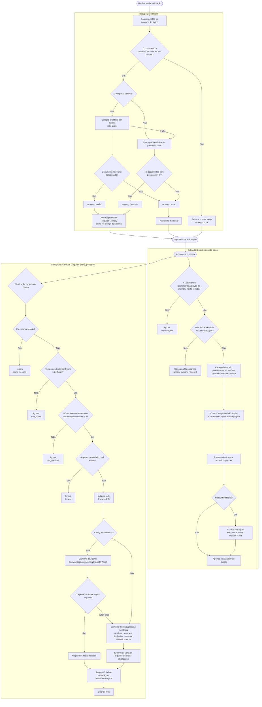
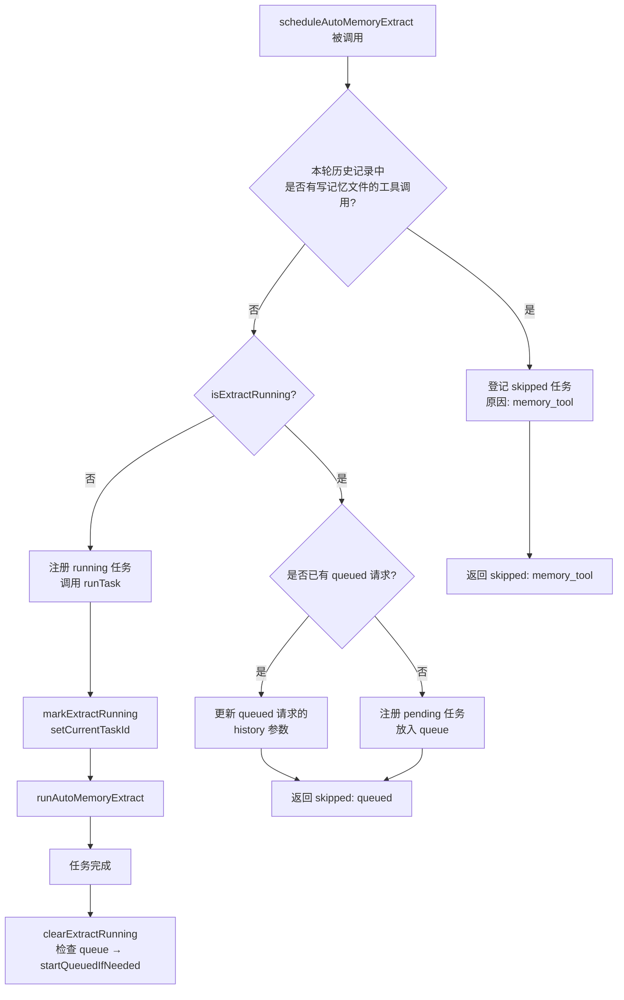
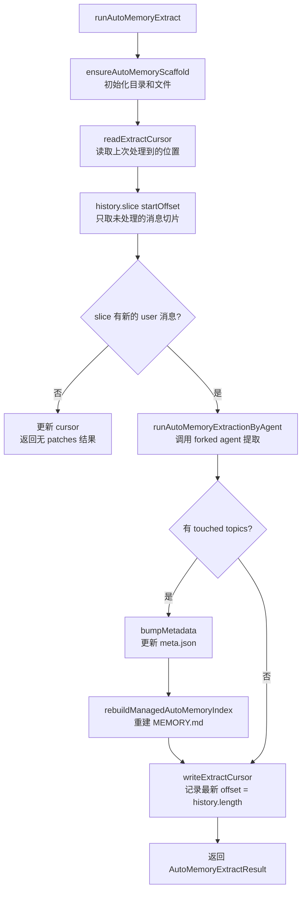
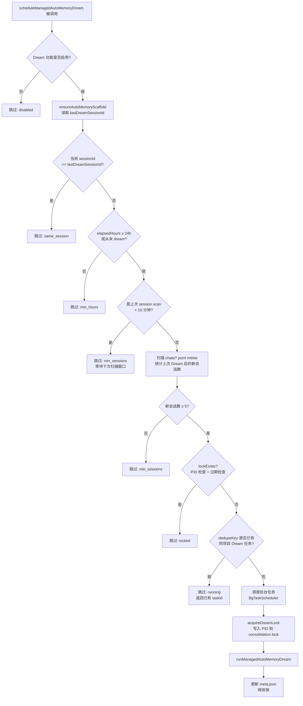
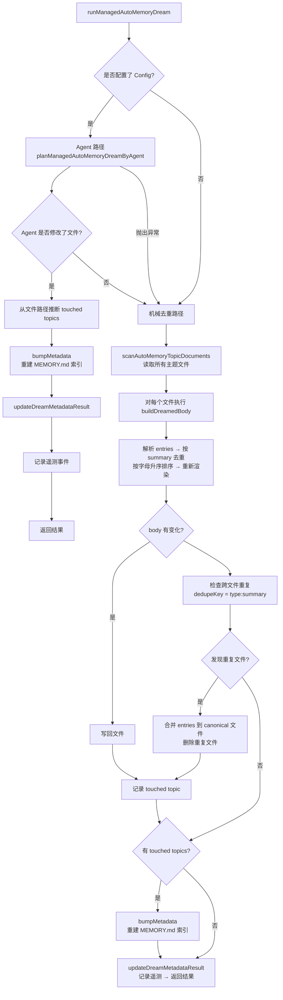
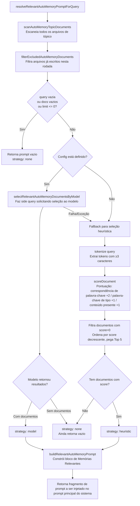
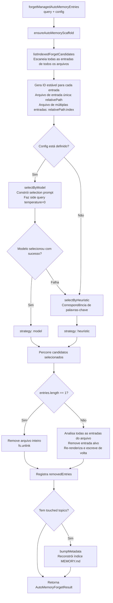

# Sistema de Gerenciamento de Memória

> Este artigo apresenta o mecanismo de gerenciamento de memória **Managed Auto-Memory** (Memória Automática Gerenciada) do Qwen Code, seus gatilhos e detalhes de implementação.

---

## Índice

1. [Visão Geral](#visão-geral)
2. [Estrutura de Armazenamento](#estrutura-de-armazenamento)
3. [Tipos de Memória](#tipos-de-memória)
4. [Formato dos Itens de Memória](#formato-dos-itens-de-memória)
5. [Ciclo de Vida Principal](#ciclo-de-vida-principal)
6. [Extract — Extração](#extract--extração)
7. [Dream — Consolidação](#dream--consolidação)
8. [Recall — Recuperação](#recall--recuperação)
9. [Forget — Esquecimento](#forget--esquecimento)
10. [Reconstrução do Índice](#reconstrução-do-índice)
11. [Pontos de Telemetria](#pontos-de-telemetria)

---

## Visão Geral

O Managed Auto-Memory é um sistema de memória persistente que **automaticamente** acumula, consolida e recupera conhecimento relevante do usuário durante sessões de IA. Ele mantém o ciclo de vida da memória por meio de quatro operações principais:

| Operação   | Inglês  | Modo de Gatilho                     | Função                                                        |
| ---------- | ------- | ----------------------------------- | ------------------------------------------------------------- |
| Extração   | Extract | Automático (após cada rodada)       | Extrai novo conhecimento do histórico da conversa para arquivos de memória |
| Consolidação | Dream   | Automático (tarefa periódica em segundo plano) | Remove duplicatas e mescla arquivos de memória para manter a organização |
| Recuperação | Recall  | Automático (antes de cada rodada)   | Recupera memórias relevantes para a solicitação atual e as injeta no prompt do sistema |
| Esquecimento | Forget  | Manual (comando do usuário `/forget`) | Exclui precisamente itens de memória especificados           |

---

## Estrutura de Armazenamento

### Layout de Diretório

```
~/.qwen/                                      ← Diretório base global (padrão)
└── projects/
    └── <sanitized-git-root>/                 ← Identificador do projeto (baseado no caminho raiz do Git)
        ├── meta.json                         ← Metadados (timestamps de extração/consolidação, status)
        ├── extract-cursor.json               ← Cursor de extração (deslocamento de histórico processado)
        ├── consolidation.lock                ← Lock de exclusão mútua do processo Dream
        └── memory/                           ← Diretório principal de memória
            ├── MEMORY.md                     ← Arquivo de índice (gerado automaticamente, resume todos os itens)
            ├── user.md                       ← Memória de preferências do usuário (exemplo)
            ├── feedback.md                   ← Memória de feedback/normas (exemplo)
            ├── project/
            │   └── milestone.md              ← Memória de projeto (suporta subdiretórios)
            └── reference/
                └── grafana.md                ← Memória de recursos externos
```

> **Substituição por variáveis de ambiente**:
>
> - `QWEN_CODE_MEMORY_BASE_DIR`: Substitui o diretório base global
> - `QWEN_CODE_MEMORY_LOCAL=1`: Usa caminho local do projeto `.qwen/memory/`

### Descrição dos Arquivos Chave

| Arquivo                | Descrição                                                              |
| ---------------------- | ---------------------------------------------------------------------- |
| `meta.json`            | Registra o timestamp da última Extração/Dream, ID da sessão, tipos de memória envolvidos e status da execução |
| `extract-cursor.json`  | Registra até que deslocamento do histórico de conversa a sessão atual foi processada, evitando extrações duplicadas |
| `consolidation.lock`   | Lock de arquivo durante a execução do Dream, contém o PID do detentor; expira automaticamente após 1 hora |
| `MEMORY.md`            | Índice de todos os arquivos de tópico, reconstruído a cada Extração/Dream, formato de lista Markdown |

---

## Tipos de Memória

O sistema suporta quatro tipos de memória internos, cada um correspondendo a uma dimensão diferente de informação:

| Tipo        | Conteúdo Armazenado                                       | Quando Escrever                                                   | Quando Ler                                              |
| ----------- | --------------------------------------------------------- | ----------------------------------------------------------------- | ------------------------------------------------------- |
| `user`      | Papel do usuário, experiência, hábitos de trabalho        | Ao saber sobre o papel/preferências/conhecimento do usuário       | Quando a resposta precisa ser personalizada ao contexto do usuário |
| `feedback`  | Orientações do usuário sobre o comportamento da IA: o que evitar, o que continuar | Quando o usuário corrige a IA ou confirma uma prática não óbvia   | Quando isso influencia o comportamento da IA           |
| `project`   | Progresso do projeto, metas, decisões, prazos, rastreamento de bugs | Ao saber quem está fazendo o quê, por quê e até quando            | Quando ajuda a IA a entender o contexto de trabalho e motivações |
| `reference` | Ponteiros para recursos externos (Dashboards, sistemas de tickets, canais Slack, etc.) | Ao saber sobre um recurso externo e sua finalidade                | Quando o usuário menciona o sistema externo ou informações relacionadas |

**O que NÃO deve ser armazenado na memória**: padrões/convenções de código, histórico do Git, soluções de depuração, status temporário de tarefas, conteúdo já registrado em QWEN.md/AGENTS.md.

---

## Formato dos Itens de Memória

Cada arquivo de tópico usa o formato **YAML frontmatter + Markdown body**:

```markdown
---
name: Nome da memória
description: Descrição em uma frase (para julgar relevância na recuperação, seja específico)
type: user|feedback|project|reference
---

Corpo principal da memória (linha de resumo)

Why: Razão por trás (permite que a IA entenda casos limite em vez de seguir regras cegamente)
How to apply: Cenários de aplicação e modo de uso
```

Para tipos `feedback` e `project`, é altamente recomendável preencher `Why` e `How to apply`, para que a memória ainda seja aplicada corretamente em casos limite.

---

## Ciclo de Vida Principal


---

## Extrair

### Momento de acionamento

Após cada conclusão de uma resposta da IA, é acionado automaticamente por `scheduleAutoMemoryExtract` (em segundo plano, não bloqueante).

### Lógica de agendamento (`extractScheduler.ts`)



**Explicações dos motivos de pulo**:

| Motivo            | Significado                                        |
| ----------------- | -------------------------------------------------- |
| `memory_tool`     | O Agent principal já escreveu diretamente um arquivo de memória nesta rodada, pulando para evitar conflitos |
| `already_running` | A extração está em andamento e não pode ser enfileirada |
| `queued`          | Já há uma extração em execução, esta solicitação foi enfileirada |

### Fluxo principal de extração (`extract.ts`)



> **Nota:** O portão `isUnderMemoryPressure` está localizado em `MemoryManager.runExtract()`, não neste fluxo. Quando o monitor relata pressão hard/critical, o `MemoryManager` pula a chamada de extração e não avança o cursor.

**Cursor de extração**:

- Campos: `{ sessionId, processedOffset, updatedAt }`
- Antes da extração, lê o progresso atual via `readExtractCursor`, depois processa apenas a parte não lida com `history.slice(processedOffset)`
- Após cada extração, atualiza `processedOffset` para o comprimento atual do histórico (`params.history.length`)
- Ao mudar de sessão (`sessionId` diferente), recomeça do offset 0
- Nota: não cria mais transcrições via `buildTranscriptMessages` / `loadUnprocessedTranscriptSlice` – `hasNewUserMessages` é verificado com `history.slice(startOffset).some(m => m.role === 'user' && partToString(m.parts).trim().length > 0)`, realiza apenas uma stringificação leve nos trechos não lidos, sem processar todo o histórico

**Regras de filtragem de patches**:

- Resumo com menos de 12 caracteres → descartado
- Resumo terminando com `?` → descartado (frase interrogativa)
- Contém palavras-chave temporárias (today/now/currently/temporary etc.) → descartado
- Combinação igual de `topic:summary` → deduplicação

---

## Integrar

### Momento de acionamento

Após cada conclusão de uma resposta da IA, é acionado automaticamente por `scheduleManagedAutoMemoryDream` (em segundo plano, não bloqueante). Porém, é protegido por várias condições de portão e na maioria dos casos é pulado.

### Portões de agendamento (`dreamScheduler.ts`)



**Parâmetros dos portões**:

| Parâmetro                   | Valor padrão | Descrição                                           |
| --------------------------- | ------------ | --------------------------------------------------- |
| `minHoursBetweenDreams`     | 24 horas     | Intervalo mínimo entre dois Dreams                  |
| `minSessionsBetweenDreams`  | 5 sessões    | Número mínimo de novas sessões para acionar o Dream |
| `SESSION_SCAN_INTERVAL_MS`  | 10 minutos   | Intervalo de throttling para varredura de arquivos de sessão |
| `DREAM_LOCK_STALE_MS`       | 1 hora       | Threshold de tempo para considerar o arquivo de lock expirado |

**Mecanismo de lock**:

- Arquivo de lock localizado em `<project-state-dir>/consolidation.lock`
- Conteúdo é o PID do processo que o detém
- Na verificação: se o processo do PID não existir mais (`kill(pid, 0` falha) ou se o lock tiver mais de 1 hora → considerado expirado e limpo automaticamente

### Fluxo de execução da integração (`dream.ts`)



**Lógica de deduplicação mecânica**:

1. Dentro de cada arquivo de tópico: deduplicar por `summary.toLowerCase()`, mesclar campos `why`/`howToApply` 
2. Reordenar alfabeticamente por summary
3. Entre arquivos: entradas com mesmo `type:summary` são mescladas no arquivo descoberto primeiro, arquivos duplicados são deletados
---

## Recall — Recuperação

### Momento de acionamento

Antes de cada rodada de processamento da solicitação do usuário pela IA, é acionado automaticamente por `resolveRelevantAutoMemoryPromptForQuery`, injetando as memórias relevantes no prompt do sistema.

### Fluxo de recuperação (`recall.ts`)



**Regras de pontuação (heurística)**:

| Condição                                         | Pontuação           |
| ------------------------------------------------ | ------------------- |
| Token da query aparece no conteúdo do documento  | +2 (por token)      |
| Token da query é palavra-chave característica do tipo | +1 (por token) |
| Corpo do documento não vazio                     | +1                  |

**Palavras-chave características de cada tipo**:

- `user`: user, preference, background, role, terse
- `feedback`: feedback, rule, avoid, style, summary
- `project`: project, goal, incident, deadline, release
- `reference`: reference, dashboard, ticket, docs, link

**Regras de construção do prompt**:

- Máximo de 5 documentos injetados (`MAX_RELEVANT_DOCS`)
- Corpo de cada documento truncado em 1200 caracteres (`MAX_DOC_BODY_CHARS`)
- Quando truncado, adiciona aviso: "NOTE: Relevant memory truncated for prompt budget."
- Inclui informação de frescor do documento (baseada no mtime do arquivo)

---

## Forget — Esquecimento

### Momento de acionamento

Acionado manualmente pelo usuário através do comando `/forget <query>`.

### Fluxo de esquecimento (`forget.ts`)



**Design do Entry ID**:

- Arquivo de entrada única (caso comum): `relativePath` (ex.: `feedback/no-summary.md`)
- Arquivo de múltiplas entradas: `relativePath:index` (ex.: `feedback/style.md:2`)
- Usar IDs estáveis permite que o modelo localize precisamente uma entrada sem afetar outras entradas no mesmo arquivo

---

## Reconstrução do índice

`MEMORY.md` é o índice de navegação de todos os arquivos de tópico. Após cada Extrair ou Dream, `rebuildManagedAutoMemoryIndex` é chamado para reconstruir:

```
- [Preferências do usuário](user/preferences.md) — Usuário é engenheiro Go sênior, primeira vez com React
- [Regra de feedback](feedback/style.md) — Manter respostas concisas, sem resumo no final
- [Marco do projeto](project/milestone.md) — Janela de congelamento antes do branch de corte para lançamento mobile
```

**Limitações do índice**:

- Máximo de 150 caracteres por linha (excedente truncado com `…`)
- Máximo de 200 linhas
- Tamanho total não superior a 25.000 bytes

---

## Telemetria (eventos de monitoramento)

O sistema possui três categorias de eventos de telemetria para monitorar desempenho e eficácia das operações de memória:

### Telemetria de Extrair

| Campo            | Tipo                       | Descrição                             |
| ---------------- | -------------------------- | ------------------------------------- |
| `trigger`        | `'auto'`                   | Modo de acionamento (atualmente apenas automático) |
| `status`         | `'completed'` \| `'failed'`| Resultado da execução                 |
| `patches_count`  | number                     | Número de patches válidos extraídos   |
| `touched_topics` | string[]                   | Lista de tipos de memória gravados    |
| `duration_ms`    | number                     | Tempo total (milissegundos)           |

### Telemetria de Dream

| Campo              | Tipo                                 | Descrição                        |
| ------------------ | ------------------------------------ | -------------------------------- |
| `trigger`          | `'auto'`                             | Modo de acionamento              |
| `status`           | `'updated'` \| `'noop'` \| `'failed'`| Resultado da execução            |
| `deduped_entries`  | number                               | Número de entradas deduplicadas por caminho mecânico |
| `touched_topics`   | string[]                             | Lista de tipos de memória modificados |
| `duration_ms`      | number                               | Tempo total (milissegundos)      |

### Telemetria de Recall

| Campo            | Tipo                                  | Descrição                         |
| ---------------- | ------------------------------------- | --------------------------------- |
| `query_length`   | number                                | Comprimento da string de consulta |
| `docs_scanned`   | number                                | Total de documentos escaneados    |
| `docs_selected`  | number                                | Número de documentos injetados    |
| `strategy`       | `'none'` \| `'heuristic'` \| `'model'`| Estratégia de seleção             |
| `duration_ms`    | number                                | Tempo total (milissegundos)       |

---

## Índice de arquivos-fonte relacionados

| Arquivo                                              | Responsabilidade                                                                 |
| ---------------------------------------------------- | -------------------------------------------------------------------------------- |
| `packages/core/src/memory/types.ts`                  | Definições de tipos: `AutoMemoryType`, `AutoMemoryMetadata`, `AutoMemoryExtractCursor` |
| `packages/core/src/memory/paths.ts`                  | Cálculo de caminhos: `getAutoMemoryRoot`, `isAutoMemPath`, helpers de caminhos de arquivos |
| `packages/core/src/memory/store.ts`                  | Inicialização do scaffold: `ensureAutoMemoryScaffold`, leitura/escrita de índice/metadados |
| `packages/core/src/memory/scan.ts`                   | Escaneamento de arquivos de tópico: `scanAutoMemoryTopicDocuments`, parsing de frontmatter |
| `packages/core/src/memory/entries.ts`                | Parsing e renderização de entradas: `parseAutoMemoryEntries`, `renderAutoMemoryBody` |
| `packages/core/src/memory/extract.ts`                | Lógica principal de extração: `runAutoMemoryExtract`, gerenciamento de cursor, deduplicação de patches |
| `packages/core/src/memory/extractScheduler.ts`       | Agendador de extração: `ManagedAutoMemoryExtractRuntime`, fila/máquina de estados |
| `packages/core/src/memory/extractionAgentPlanner.ts` | Agente de extração: `runAutoMemoryExtractionByAgent`                             |
| `packages/core/src/memory/dream.ts`                  | Lógica principal de integração: `runManagedAutoMemoryDream`, caminho do agente + deduplicação mecânica |
| `packages/core/src/memory/dreamScheduler.ts`         | Agendador de integração: `ManagedAutoMemoryDreamRuntime`, verificação de portão, gerenciamento de bloqueio |
| `packages/core/src/memory/dreamAgentPlanner.ts`      | Agente de integração: `planManagedAutoMemoryDreamByAgent`                         |
| `packages/core/src/memory/recall.ts`                 | Lógica de recuperação: `resolveRelevantAutoMemoryPromptForQuery`, caminho heurístico + modelo |
| `packages/core/src/memory/forget.ts`                 | Lógica de esquecimento: `forgetManagedAutoMemoryEntries`, geração de candidatos + exclusão precisa |
| `packages/core/src/memory/indexer.ts`                | Reconstrução de índice: `rebuildManagedAutoMemoryIndex`, `buildManagedAutoMemoryIndex` |
| `packages/core/src/memory/prompt.ts`                 | Template de prompt do sistema: descrição dos tipos de memória, exemplos de formato, regras de uso |
| `packages/core/src/memory/governance.ts`             | Tipos de sugestão de governança: `AutoMemoryGovernanceSuggestionType`             |
| `packages/core/src/memory/state.ts`                  | Estado de execução da extração: `isExtractRunning`, `markExtractRunning`, `clearExtractRunning` |
| `packages/core/src/memory/memoryAge.ts`              | Descrição de frescor: `memoryAge`, `memoryFreshnessText`                          |
