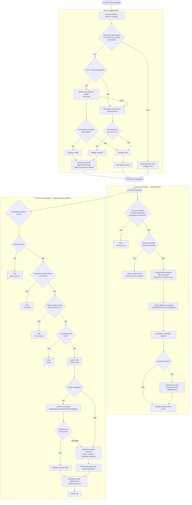
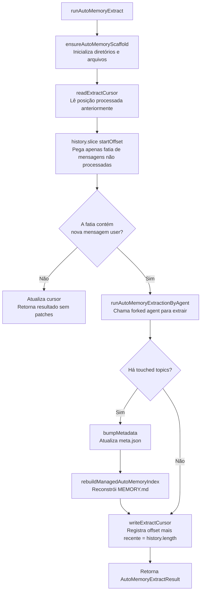
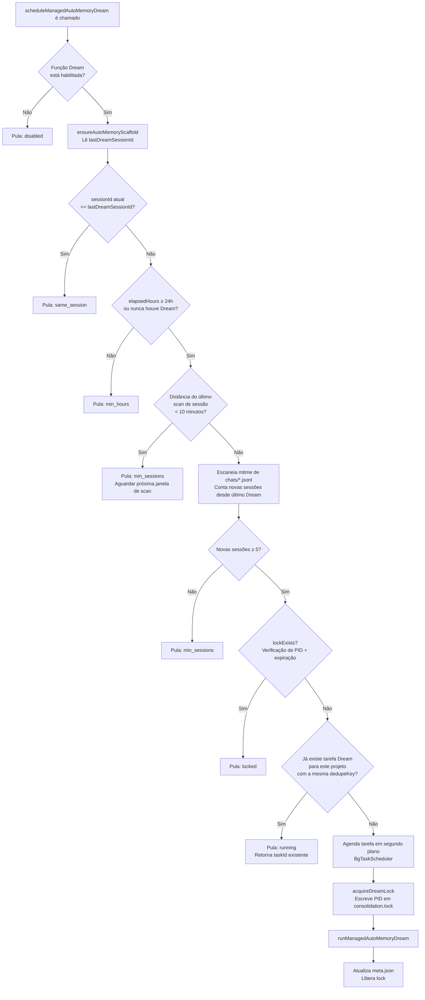
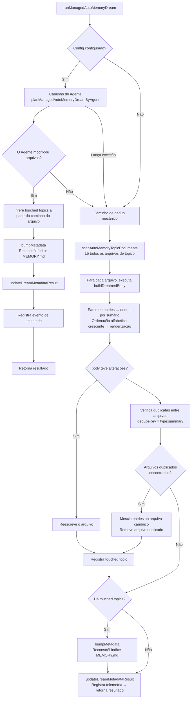
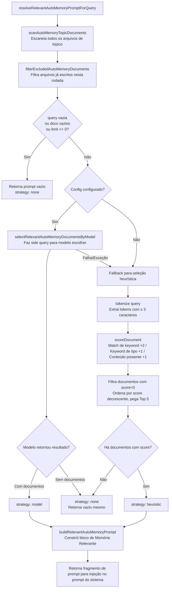
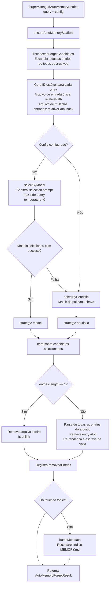

# Sistema de Gerenciamento de Memória

> Este artigo apresenta o mecanismo de gerenciamento de memória **Managed Auto-Memory** (Memória Automática Gerenciada) no Qwen Code, incluindo seus gatilhos e detalhes de implementação.

---

## Índice

1. [Visão Geral](#visão-geral)
2. [Estrutura de Armazenamento](#estrutura-de-armazenamento)
3. [Tipos de Memória](#tipos-de-memória)
4. [Formato das Entradas de Memória](#formato-das-entradas-de-memória)
5. [Ciclo de Vida Principal](#ciclo-de-vida-principal)
6. [Extract — Extração](#extract--extração)
7. [Dream — Consolidação](#dream--consolidação)
8. [Recall — Recuperação](#recall--recuperação)
9. [Forget — Esquecimento](#forget--esquecimento)
10. [Reconstrução do Índice](#reconstrução-do-índice)
11. [Telemetria e Eventos](#telemetria-e-eventos)

---

## Visão Geral

O Managed Auto-Memory é um sistema de memória persistente que **automaticamente** acumula, consolida e recupera conhecimento relevante do usuário durante sessões de IA. Ele mantém o ciclo de vida da memória através de quatro operações principais:

| Operação   | Inglês   | Gatilho                        | Função                                                      |
| ---------- | -------- | ------------------------------ | ----------------------------------------------------------- |
| Extração   | Extract  | Automático (após cada rodada)  | Extrai novo conhecimento do diálogo e grava em arquivos     |
| Consolidação | Dream    | Automático (tarefa em segundo plano periódica) | Deduplica e mescla arquivos de memória, mantendo-os organizados |
| Recuperação | Recall   | Automático (antes de cada rodada) | Recupera memórias relevantes para a requisição atual e injeta no prompt do sistema |
| Esquecimento | Forget   | Manual (comando `/forget`)     | Remove precisamente entradas de memória específicas         |

---

## Estrutura de Armazenamento

### Layout de Diretórios

```
~/.qwen/                                      ← Diretório base global (padrão)
└── projects/
    └── <sanitized-git-root>/                 ← Identificador do projeto (baseado na raiz Git)
        ├── meta.json                         ← Metadados (timestamps de extração/consolidação, status)
        ├── extract-cursor.json               ← Cursor de extração (offset do diálogo já processado)
        ├── consolidation.lock                ← Lock de exclusão mútua do processo Dream
        └── memory/                           ← Diretório principal de memória
            ├── MEMORY.md                     ← Arquivo de índice (gerado automaticamente, resume todas as entradas)
            ├── user.md                       ← Memória de preferências do usuário (exemplo)
            ├── feedback.md                   ← Memória de regras de feedback (exemplo)
            ├── project/
            │   └── milestone.md              ← Memória de projeto (suporta subdiretórios)
            └── reference/
                └── grafana.md                ← Memória de recurso externo
```

> **Sobrescrita por variável de ambiente**:
>
> - `QWEN_CODE_MEMORY_BASE_DIR`: Substitui o diretório base global
> - `QWEN_CODE_MEMORY_LOCAL=1`: Usa o caminho `.qwen/memory/` dentro do projeto

### Descrição dos Arquivos Chave

| Arquivo               | Descrição                                                                        |
| --------------------- | -------------------------------------------------------------------------------- |
| `meta.json`           | Registra o timestamp do último Extract/Dream, ID da sessão, tipos de memória envolvidos e status de execução |
| `extract-cursor.json` | Registra até qual offset do histórico da sessão atual já foi processado, evitando extração duplicada |
| `consolidation.lock`  | Lock de arquivo durante a execução do Dream; contém o PID do processo detentor; expira automaticamente após 1 hora |
| `MEMORY.md`           | Índice de todos os arquivos de tópico; reconstruído após cada Extract/Dream; formato de lista Markdown |

---

## Tipos de Memória

O sistema suporta quatro tipos de memória embutidos, cada um correspondendo a uma dimensão diferente de informação:

| Tipo        | Conteúdo Armazenado                                      | Quando Escrever                                                      | Quando Ler                                                  |
| ----------- | -------------------------------------------------------- | --------------------------------------------------------------------- | ----------------------------------------------------------- |
| `user`      | Papel do usuário, habilidades, hábitos de trabalho       | Ao descobrir o papel/preferências/contexto de conhecimento do usuário | Quando a resposta precisa ser personalizada ao perfil do usuário |
| `feedback`  | Orientações do usuário: o que evitar, o que continuar    | Quando o usuário corrige a IA ou confirma uma prática não óbvia       | Quando precisa influenciar o comportamento da IA            |
| `project`   | Progresso do projeto, objetivos, decisões, prazos, bugs  | Ao saber quem está fazendo o quê, por quê e até quando                | Quando ajuda a IA a entender o contexto e a motivação do trabalho |
| `reference` | Ponteiros para sistemas externos (Dashboard, ticket, Slack, etc.) | Ao tomar conhecimento de um recurso externo e seu propósito           | Quando o usuário menciona o sistema externo ou informação relacionada |

**Conteúdo que NÃO deve ser armazenado em memória**: Padrões/convenções de código, histórico Git, soluções de debug, status de tasks temporárias, conteúdo já presente em QWEN.md/AGENTS.md.

---

## Formato das Entradas de Memória

Cada arquivo de tópico usa o formato **YAML frontmatter + Markdown body**:

```markdown
---
name: Nome da memória
description: Descrição em uma frase (para julgar relevância na recuperação; seja específico)
type: user|feedback|project|reference
---

Conteúdo principal da memória (linha de sumário)

Why: Razão subjacente (para que a IA entenda casos de contorno em vez de seguir regras cegamente)
How to apply: Cenários de aplicação e modo de uso
```

Para os tipos `feedback` e `project`, é fortemente recomendado preencher `Why` e `How to apply` para que a memória ainda seja aplicada corretamente em casos de contorno.

---

## Ciclo de Vida Principal



---

## Extract — Extração

### Momento do Gatilho

Após cada rodada de resposta da IA, é automaticamente acionado por `scheduleAutoMemoryExtract` (segundo plano, não bloqueante).

### Lógica de Agendamento (`extractScheduler.ts`)

```mermaid
flowchart TD
    A[scheduleAutoMemoryExtract é chamado] --> B{Nesta rodada,\nhá chamada de ferramenta\nque escreve arquivo de memória?}
    B -- Sim --> C[Registra tarefa skipped\nMotivo: memory_tool]
    B -- Não --> D{isExtractRunning?}
    D -- Sim --> E{Já há requisição\nna fila (queued)?}
    E -- Sim --> F[Atualiza parâmetro history\nda requisição na fila]
    E -- Não --> G[Registra tarefa pending\nColoca na fila]
    D -- Não --> H[Registra tarefa running\nChama runTask]
    H --> I[markExtractRunning\nsetCurrentTaskId]
    I --> J[runAutoMemoryExtract]
    J --> K[Tarefa concluída]
    K --> L[clearExtractRunning\nVerifica fila → startQueuedIfNeeded]
    F --> M[Retorna skipped: queued]
    G --> M
    C --> N[Retorna skipped: memory_tool]
```

**Explicação dos motivos de skip**:

| Motivo           | Significado                                                                 |
| ---------------- | --------------------------------------------------------------------------- |
| `memory_tool`    | O Agente principal desta rodada já escreveu diretamente o arquivo de memória; pula para evitar conflito |
| `already_running` | A extração está em andamento e não pode ser enfileirada                     |
| `queued`         | Já há uma extração em execução; esta requisição foi colocada na fila        |

### Fluxo Principal de Extração (`extract.ts`)



> **Nota:** O gate `isUnderMemoryPressure` fica em `MemoryManager.runExtract()`, não neste fluxo. Quando o monitor reporta pressão hard/critical, o `MemoryManager` pula a chamada de extract e não avança o cursor.

**Cursor de Extração (Cursor)**:

- Campos: `{ sessionId, processedOffset, updatedAt }`
- Antes de extrair, lê o progresso atual com `readExtractCursor` e processa apenas a parte não lida com `history.slice(processedOffset)`
- Após cada extração, atualiza `processedOffset` para o tamanho atual do histórico (`params.history.length`)
- Quando a sessão muda (`sessionId` muda), recomeça do offset 0
- Nota: Não constrói mais transcrição via `buildTranscriptMessages` / `loadUnprocessedTranscriptSlice` — `hasNewUserMessages` é verificado com `history.slice(startOffset).some(m => m.role === 'user' && partToString(m.parts).trim().length > 0)`, fazendo uma stringificação leve apenas na fatia não lida. O histórico completo não é mais processado.

**Regras de Filtragem de Patch**:

- Resumo com menos de 12 caracteres → descartado
- Resumo terminando em `?` → descartado (frase interrogativa)
- Contém palavras-chave temporárias (today/now/currently/temporary etc.) → descartado
- Combinação `topic:summary` duplicada → deduplicado

---

## Dream — Consolidação

### Momento do Gatilho

Após cada rodada de resposta da IA, é automaticamente acionado por `scheduleManagedAutoMemoryDream` (segundo plano, não bloqueante). No entanto, é protegido por múltiplos gates e, na maioria dos casos, é ignorado.

### Gates de Agendamento (`dreamScheduler.ts`)



**Parâmetros dos Gates**:

| Parâmetro                   | Valor Padrão | Descrição                                          |
| --------------------------- | ------------ | -------------------------------------------------- |
| `minHoursBetweenDreams`     | 24 horas     | Intervalo mínimo entre duas execuções do Dream     |
| `minSessionsBetweenDreams`  | 5 sessões    | Número mínimo de novas sessões para acionar o Dream |
| `SESSION_SCAN_INTERVAL_MS`  | 10 minutos   | Intervalo de throttle para escaneamento de arquivos de sessão |
| `DREAM_LOCK_STALE_MS`       | 1 hora       | Threshold de tempo para considerar o arquivo de lock expirado |

**Mecanismo de Lock**:

- Arquivo de lock localizado em `<project-state-dir>/consolidation.lock`
- Conteúdo é o PID do processo detentor
- Durante a verificação: se o processo PID não existe mais (`kill(pid, 0)` falha) ou o lock tem mais de 1 hora → considerado expirado e removido automaticamente

### Fluxo de Execução da Consolidação (`dream.ts`)



**Lógica de Dedup Mecânico**:

1. Dentro de cada arquivo de tópico: deduplica por `summary.toLowerCase()`, mescla campos `why`/`howToApply`
2. Reordena entradas em ordem alfabética pelo sumário
3. Entre arquivos: entradas com o mesmo `type:summary` são mescladas no arquivo descoberto primeiro; arquivos duplicados são removidos

---

## Recall — Recuperação

### Momento do Gatilho

Antes de cada rodada da IA processar uma requisição do usuário, é automaticamente acionado por `resolveRelevantAutoMemoryPromptForQuery`, injetando memórias relevantes no prompt do sistema.

### Fluxo de Recuperação (`recall.ts`)



**Regras de Pontuação (Heurística)**:

| Condição                                       | Pontuação Adicionada |
| ---------------------------------------------- | -------------------- |
| Token da query aparece no conteúdo do documento | +2 (por token)       |
| Token da query é uma keyword característica do tipo | +1 (por token)       |
| Body do documento não vazio                    | +1                   |

**Keywords Características de Cada Tipo**:

- `user`: user, preference, background, role, terse
- `feedback`: feedback, rule, avoid, style, summary
- `project`: project, goal, incident, deadline, release
- `reference`: reference, dashboard, ticket, docs, link

**Regras de Construção do Prompt**:

- Máximo de 5 documentos injetados (`MAX_RELEVANT_DOCS`)
- Body de cada documento truncado em 1200 caracteres (`MAX_DOC_BODY_CHARS`)
- Quando truncado, adiciona aviso: "NOTE: Relevant memory truncated for prompt budget."
- Inclui informação de frescor do documento (baseada no mtime do arquivo)

---

## Forget — Esquecimento

### Momento do Gatilho

Acionado manualmente pelo usuário através do comando `/forget <query>`.

### Fluxo de Esquecimento (`forget.ts`)



**Design do Entry ID**:

- Arquivo de entrada única (caso comum): `relativePath` (ex: `feedback/no-summary.md`)
- Arquivo de múltiplas entradas: `relativePath:index` (ex: `feedback/style.md:2`)
- IDs estáveis permitem que o modelo localize precisamente a entrada sem afetar outras entradas no mesmo arquivo

---

## Reconstrução do Índice

`MEMORY.md` é o índice de navegação de todos os arquivos de tópico. Ele é reconstruído com `rebuildManagedAutoMemoryIndex` após cada Extract ou Dream:

```
- [Preferências do Usuário](user/preferences.md) — Usuário é engenheiro Go sênior, primeiro contato com React
- [Regras de Feedback](feedback/style.md) — Mantenha respostas concisas, sem resumo no final
- [Marcos do Projeto](project/milestone.md) — Janela de congelamento de merge antes do branch de corte para release mobile
```

**Limitações do Índice**:

- Máximo de 150 caracteres por linha (truncado com `…` se exceder)
- Máximo de 200 linhas
- Tamanho total não excede 25.000 bytes

---

## Telemetria e Eventos

O sistema possui três tipos de eventos de telemetria para monitorar o desempenho e a eficácia das operações de memória:

### Telemetria do Extract

| Campo             | Tipo                          | Descrição                          |
| ----------------- | ----------------------------- | ---------------------------------- |
| `trigger`         | `'auto'`                      | Modo de gatilho (atualmente apenas automático) |
| `status`          | `'completed'` \| `'failed'`   | Resultado da execução              |
| `patches_count`   | number                        | Número de patches válidos extraídos |
| `touched_topics`  | string[]                      | Lista de tipos de memória escritos |
| `duration_ms`     | number                        | Duração total (milissegundos)      |

### Telemetria do Dream

| Campo              | Tipo                                    | Descrição                                 |
| ------------------ | --------------------------------------- | ----------------------------------------- |
| `trigger`          | `'auto'`                                | Modo de gatilho                           |
| `status`           | `'updated'` \| `'noop'` \| `'failed'`   | Resultado da execução                     |
| `deduped_entries`  | number                                  | Número de entradas deduplicadas via caminho mecânico |
| `touched_topics`   | string[]                                | Lista de tipos de memória modificados     |
| `duration_ms`      | number                                  | Duração total (milissegundos)             |

### Telemetria do Recall

| Campo            | Tipo                                     | Descrição                         |
| ---------------- | ---------------------------------------- | --------------------------------- |
| `query_length`   | number                                   | Comprimento da string de consulta |
| `docs_scanned`   | number                                   | Total de documentos escaneados    |
| `docs_selected`  | number                                   | Número de documentos injetados    |
| `strategy`       | `'none'` \| `'heuristic'` \| `'model'`   | Estratégia de seleção             |
| `duration_ms`    | number                                   | Duração total (milissegundos)     |

---

## Índice de Arquivos Fonte Relacionados

| Arquivo                                                | Responsabilidade                                                                 |
| ------------------------------------------------------ | -------------------------------------------------------------------------------- |
| `packages/core/src/memory/types.ts`                    | Definições de tipo: `AutoMemoryType`, `AutoMemoryMetadata`, `AutoMemoryExtractCursor` |
| `packages/core/src/memory/paths.ts`                    | Cálculo de caminhos: `getAutoMemoryRoot`, `isAutoMemPath`, helpers diversos de caminho |
| `packages/core/src/memory/store.ts`                    | Inicialização do scaffold: `ensureAutoMemoryScaffold`, leitura/escrita de índice/metadados |
| `packages/core/src/memory/scan.ts`                     | Escaneamento de arquivos de tópico: `scanAutoMemoryTopicDocuments`, parse de frontmatter |
| `packages/core/src/memory/entries.ts`                  | Parse e renderização de entradas: `parseAutoMemoryEntries`, `renderAutoMemoryBody` |
| `packages/core/src/memory/extract.ts`                  | Lógica principal de extração: `runAutoMemoryExtract`, gerenciamento de cursor, dedup de patches |
| `packages/core/src/memory/extractScheduler.ts`         | Agendador de extração: `ManagedAutoMemoryExtractRuntime`, máquina de estados fila/execução |
| `packages/core/src/memory/extractionAgentPlanner.ts`   | Agente de extração: `runAutoMemoryExtractionByAgent`                              |
| `packages/core/src/memory/dream.ts`                    | Lógica principal de consolidação: `runManagedAutoMemoryDream`, caminho do Agente + dedup mecânico |
| `packages/core/src/memory/dreamScheduler.ts`           | Agendador de consolidação: `ManagedAutoMemoryDreamRuntime`, verificação de gates, gerenciamento de lock |
| `packages/core/src/memory/dreamAgentPlanner.ts`        | Agente de consolidação: `planManagedAutoMemoryDreamByAgent`                       |
| `packages/core/src/memory/recall.ts`                   | Lógica de recuperação: `resolveRelevantAutoMemoryPromptForQuery`, caminho duplo heurística+modelo |
| `packages/core/src/memory/forget.ts`                   | Lógica de esquecimento: `forgetManagedAutoMemoryEntries`, geração de candidatos + remoção precisa |
| `packages/core/src/memory/indexer.ts`                  | Reconstrução de índice: `rebuildManagedAutoMemoryIndex`, `buildManagedAutoMemoryIndex` |
| `packages/core/src/memory/prompt.ts`                   | Template de prompt do sistema: descrição dos tipos de memória, exemplo de formato, regras de uso |
| `packages/core/src/memory/governance.ts`               | Tipos de sugestão de governance: `AutoMemoryGovernanceSuggestionType`             |
| `packages/core/src/memory/state.ts`                    | Estado de execução da extração: `isExtractRunning`, `markExtractRunning`, `clearExtractRunning` |
| `packages/core/src/memory/memoryAge.ts`                | Descrição de frescor: `memoryAge`, `memoryFreshnessText`                          |