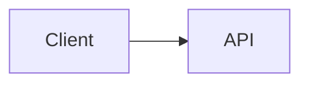

# Design de Extensão de Sintaxe Markdown

## Contexto

Este documento mantém as referências de implementação para o PR integrado de extensão de sintaxe Markdown. Ele é baseado na pesquisa de otimização TUI de `origin/docs/tui-optimization-design`, especialmente:

- `docs/design/tui-optimization/00-overview.md`
- `docs/design/tui-optimization/03-rendering-extensibility.md`
- `docs/design/tui-optimization/04-gemini-cli-research.md`
- `docs/design/tui-optimization/05-claude-code-research.md`
- `docs/design/tui-optimization/06-implementation-rollout-checklist.md`
- `docs/design/tui-optimization/08-execution-plan-and-test-matrix.md`

A pesquisa referenciada recomenda uma arquitetura Markdown de longo prazo baseada em um parser AST, cache de blocos/tokens, streaming com prefixo estável, painéis de detalhes com limite e detecção de capacidade do terminal. Esta primeira implementação mantém a pegada de runtime pequena e torna o novo comportamento visível imediatamente.

## Escopo do PR Integrado

Este PR trata a expansão da sintaxe Markdown como uma melhoria coesa do renderizador, e não como PRs de funcionalidades separadas.

Incluído na primeira implementação:

- Blocos de código Mermaid são renderizados visualmente no TUI.
- Diagramas Mermaid são renderizados como imagens PNG no terminal quando a renderização de imagens está explicitamente ativada, `mmdc` está disponível e o terminal suporta um caminho de imagem.
- Diagramas Mermaid `flowchart` / `graph` têm fallback para pré-visualizações com caixas e setas.
- Diagramas Mermaid `sequenceDiagram` têm fallback para pré-visualizações com participantes e setas.
- Blocos básicos de `classDiagram`, `stateDiagram`, `erDiagram`, `gantt`, `pie`, `journey`, `mindmap`, `gitGraph` e `requirementDiagram` têm fallback para pré-visualizações de texto com limite.
- Tipos Mermaid sem pré-visualização de texto têm fallback para o código-fonte cercado original, para que o usuário ainda possa ler e copiar a definição do diagrama.
- Itens de lista de tarefas renderizam marcadores de concluído/não concluído.
- Citações em bloco renderizam com uma barra de citação visível.
- Matemática inline `$...$` e em bloco `$$...$$` renderizam com substituições Unicode comuns.
- Tabelas Markdown existentes continuam usando `TableRenderer`.
- Blocos de código cercados que não são Mermaid continuam usando `CodeColorizer`.
- Blocos visuais renderizados mantêm o código-fonte acessível através de `/copy mermaid N`, `/copy latex N`, `/copy latex inline N` e modo raw.
- `ui.renderMode` controla se as sessões iniciam no modo renderizado ou raw/fonte, enquanto `Alt/Option+M` alterna a visualização da sessão ativa.

## Estratégia de Renderização Mermaid

### Primeira versão: renderização de imagem com verificação de capacidade mais fallback de texto

A implementação agora trata o layout nativo do Mermaid como o caminho preferido. Quando o ambiente local oferece suporte, o TUI renderiza blocos Mermaid através deste pipeline:

```text
Código-fonte Mermaid
  -> mmdc / Mermaid CLI
  -> PNG
  -> Protocolo de imagem de terminal Kitty ou iTerm2
```

Se o terminal não suportar imagens inline, mas o `chafa` estiver instalado, o mesmo PNG é renderizado como gráficos de bloco ANSI. Se nem o protocolo de imagem nem o `chafa` estiverem disponíveis, o renderizador recai para a pré-visualização de texto síncrona do terminal descrita abaixo.

A renderização de imagem não é tentada enquanto a resposta ainda está em streaming. Durante o streaming, blocos Mermaid mostram uma pré-visualização pendente com limite. Assim que a resposta é finalizada, o caminho da imagem é tentado apenas quando explicitamente ativado. Isso mantém a inicialização lenta do `mmdc`, especialmente o caminho opt-in `npx`, fora do caminho de renderização interativo padrão.

A geração de PNG é armazenada em cache independentemente do posicionamento no terminal. Renderizações repetidas da mesma fonte Mermaid, incluindo atualizações de redimensionamento do terminal, reutilizam o PNG gerado e apenas recalculam as dimensões de posicionamento Kitty/iTerm2.

O caminho da imagem é intencionalmente opt-in e com verificação de capacidade, em vez de sempre empacotar ou invocar Puppeteer/Chromium a partir do caminho hot do CLI. Um usuário pode ativar o caminho da imagem com `QWEN_CODE_MERMAID_IMAGE_RENDERING=1`, depois fornecer `@mermaid-js/mermaid-cli` instalando `mmdc` no `PATH` ou definindo `QWEN_CODE_MERMAID_MMD_CLI` para o caminho do binário. Para verificação local ad-hoc, `QWEN_CODE_MERMAID_ALLOW_NPX=1` permite que o renderizador invoque `npx -y @mermaid-js/mermaid-cli@11.12.0`; isso é intencionalmente opt-in porque a primeira execução pode instalar Puppeteer/Chromium e bloquear a renderização. Renderizadores locais em `node_modules/.bin` não são descobertos automaticamente a menos que `QWEN_CODE_MERMAID_ALLOW_LOCAL_RENDERERS=1` esteja definido. A seleção do protocolo de terminal pode ser forçada com `QWEN_CODE_MERMAID_IMAGE_PROTOCOL=kitty|iterm2|off`.

Para terminais compatíveis com Kitty, como Ghostty, o renderizador usa espaços reservados Unicode do Kitty em vez de escrever o payload da imagem como texto Ink. O PNG é transmitido através do stdout bruto em modo silencioso (`q=2`) com um posicionamento virtual (`U=1`), e a árvore React renderiza a grade normal de caracteres reservados (`U+10EEEE`) com diacríticos explícitos de linha e coluna para cada célula. Isso mantém o Ink responsável pelo layout e redimensionamento, evitando que bytes de payload APC sejam quebrados em texto base64 visível.

### Fallback: pré-visualização de wireframe redimensionável

O fallback evita trabalho assíncrono porque o caminho `<Static>` do Ink é somente anexação: uma mensagem finalizada não pode esperar de forma confiável por um trabalho de renderização em segundo plano e depois atualizar no lugar sem forçar uma atualização estática completa. O fallback deve, portanto, produzir saída de terminal durante o passo de renderização normal do React.

Para diagramas `flowchart` / `graph`, o fallback constrói um modelo de grafo leve em vez de imprimir uma aresta de cada vez:

- Os nós são normalizados pelo id Mermaid, rótulo e forma básica.
- Os rótulos dos nós suportam quebras de linha no estilo Mermaid `\n` / `<br>`.
- Diagramas de cima para baixo são classificados em camadas horizontais.
- Diagramas da esquerda para a direita são classificados em colunas verticais quando cabem.
- Várias arestas de saída do mesmo nó são desenhadas como uma única bifurcação com rótulos de aresta entre colchetes, como `[Yes]`, `[No]`, `[是]` e `[否]`.
- Arestas de retorno e ciclos são resumidas em uma seção `Cycles:` com marcadores explícitos `↩ to <node>`. Isso evita rotas longas e instáveis entre diagramas em fontes de terminal, mantendo a semântica do loop visível.
- O grafo é recalculado a partir de `contentWidth`, então o redimensionamento altera a largura do nó, espaçamento e caminhos dos conectores.
- Pré-visualizações grandes são limitadas antes do layout do grafo, para que blocos Mermaid muito grandes não aloquem uma tela de terminal ilimitada durante a renderização.

Exemplo:



renderiza como uma pré-visualização visual no terminal, em vez de código-fonte Mermaid.

Outras famílias comuns de diagramas Mermaid usam resumos de texto com limite em vez de um mecanismo de layout completo: relacionamentos/membros de classe, transições de estado, entidades/relacionamentos ER, tarefas Gantt, fatias de pizza, etapas de jornada, árvores mindmap, entradas de grafo git e árvores de requisitos. Se um tipo de diagrama for desconhecido ou não tiver pré-visualização, o renderizador mostra o código-fonte Mermaid cercado original em vez de um espaço reservado, para que o conteúdo permaneça legível e selecionável/copiável no terminal. Cabeçalhos Mermaid renderizados também mostram o comando de cópia específico do Mermaid, por exemplo `/copy mermaid 2`, para que os usuários possam recuperar o código-fonte original do diagrama sem alternar toda a visualização para o modo raw.

O fallback ainda não é um mecanismo Mermaid completo. É uma camada de pré-visualização rápida e com poucas dependências para diagramas comuns gerados por LLM quando a renderização de alta fidelidade não está disponível.

### Provedores futuros

O limite do provedor é intencionalmente aberto para provedores de imagem nativa adicionais:

- `mmdc` / `@mermaid-js/mermaid-cli` para saída SVG/PNG.
- `terminal-image` para Kitty/iTerm2 mais fallback ANSI.
- `chafa` quando presente para mosaicos Sixel/Kitty/iTerm2/Unicode.

Este caminho deve permanecer opcional, armazenado em cache e com verificação de capacidade, com chaves de cache baseadas no hash da fonte, largura do terminal, provedor do renderizador e protocolo do terminal. Não deve bloquear a inicialização ou adicionar trabalho empacotado do Mermaid/Puppeteer ao caminho hot do TUI por padrão.

## Compatibilidade com Renderizador AST

A primeira versão estende o parser existente para minimizar o raio de explosão. Os limites dos recursos ainda são compatíveis com um futuro pipeline de tokens `marked`:

- `code(lang=mermaid)` -> `MermaidDiagram`
- `code(lang=*)` -> `CodeColorizer` existente
- `table` -> `TableRenderer` existente
- `blockquote` -> renderizador de bloco de citação
- `list(task=true)` -> renderizador de lista de tarefas
- `paragraph/text` -> renderizador inline com suporte a matemática/link/estilo

A implementação não armazena nós React em cache. Um renderizador AST futuro deve armazenar tokens/blocos em cache e depois renderizar a partir das props atuais de largura, tema e configurações.

## Segurança e Desempenho

- O código-fonte Mermaid é tratado como entrada não confiável.
- O primeiro renderizador não executa JavaScript do Mermaid.
- A renderização de imagem nativa deve ser opt-in ou com verificação de capacidade.
- Renderização futura baseada em navegador deve usar timeouts e limites de tamanho.
- A renderização deve degradar para texto do terminal em vez de lançar exceções.
- Blocos grandes devem respeitar a altura e largura disponíveis.

## Validação

Verificação unitária direcionada:

```bash
cd packages/cli
npx vitest run \
  src/config/settingsSchema.test.ts \
  src/ui/AppContainer.test.tsx \
  src/ui/utils/MarkdownDisplay.test.tsx \
  src/ui/utils/mermaidImageRenderer.test.ts \
  src/ui/commands/copyCommand.test.ts \
  src/ui/components/BaseTextInput.test.tsx \
  src/ui/keyMatchers.test.ts \
  src/ui/contexts/KeypressContext.test.tsx
```

Verificação mais ampla antes do envio do PR:

```bash
npm run build --workspace=packages/cli
npm run typecheck --workspace=packages/cli
npm run lint --workspace=packages/cli
git diff --check
```

Cenário de integração com captura de terminal:

```bash
npm run build && npm run bundle
cd integration-tests/terminal-capture
npm run capture:markdown-rendering
```

Este cenário captura uma resposta de modelo com muito Markdown, alterna o modo raw/fonte com `Alt/Option+M` e verifica os fluxos de cópia do código-fonte visível com `/copy mermaid 1` e `/copy latex 1`.

Cenários manuais:

- Resposta do assistente com um bloco Mermaid `flowchart LR`.
- Resposta do assistente com um bloco Mermaid `sequenceDiagram`.
- Tabela Markdown mais Mermaid na mesma resposta.
- Bloco de código JavaScript cercado ainda mostrando formatação de código.
- Largura de terminal reduzida.
- Superfície de ferramenta/detalhe restrita.
- `ui.renderMode: "raw"` inicia uma sessão no modo orientado a código-fonte.
- `Alt/Option+M` alterna a mesma resposta entre o modo renderizado e o modo raw/fonte.
- Blocos visuais Mermaid e LaTeX exibem dicas de cópia que mapeiam para a ordem real de código-fonte `/copy mermaid N` e `/copy latex N`.