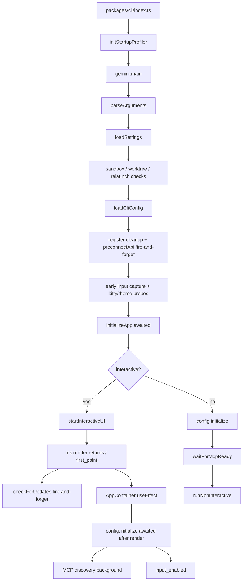
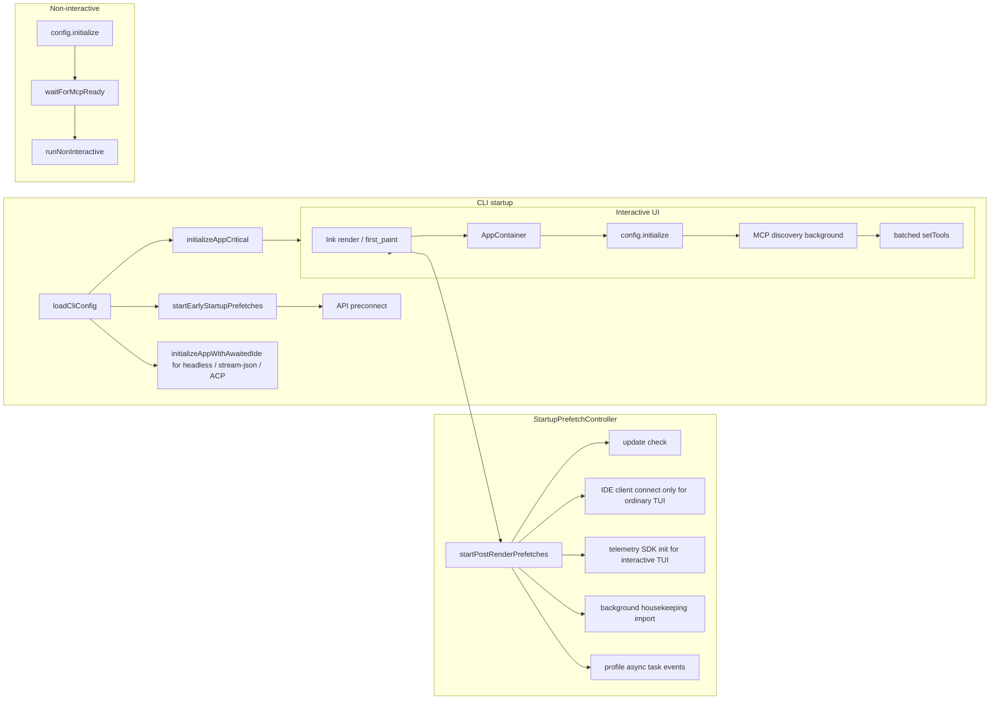
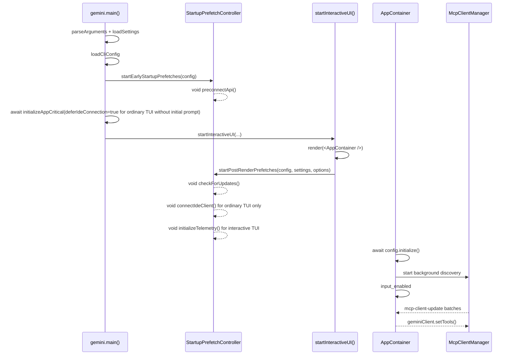

# Design de Otimização de Prefetch de Inicialização Fire-and-Forget

## Contexto e Objetivos

A issue pai #3011 divide a otimização da inicialização do qwen-code em várias subtarefas. O repositório atual já implementou várias capacidades fundamentais:

- #3219: O profiler de desempenho de inicialização foi integrado, suportando `QWEN_CODE_PROFILE_STARTUP=1` para gerar o JSON da fase de inicialização.
- #3221: O registro de ferramentas foi convertido para uma factory lazy; `Config.initialize()` não instancia mais todas as ferramentas estaticamente.
- #3223: O preconnect da API já existe, atualmente acionado de forma fire-and-forget após `loadCliConfig()`.
- A captura antecipada de input, a descoberta progressiva de MCP e `config.initialize()` após a renderização do AppContainer também estão parcialmente implementados.

O objetivo do #3222 não é refazer essas capacidades, mas consolidar as operações de inicialização não críticas ainda espalhadas pelo caminho de inicialização em uma camada unificada de prefetch fire-and-forget: antes do first paint, aguarde apenas operações que realmente afetam a correção; após o first paint, inicie tarefas em segundo plano que não afetam a correção da primeira interação, preservando a semântica compatível para modos não interativos.

## Fluxo de Inicialização Atual

O fluxo principal do caminho de inicialização interativa atual é o seguinte:



Avaliação do estado atual:

- `initializeApp()` ainda executa i18n, auth, validação de tema e conexão do cliente IDE em série antes do first paint.
- Auth e i18n devem permanecer antes do first paint; a conexão com a IDE não é uma dependência rígida para o first paint de um TUI simples sem um prompt inicial, podendo ser adiada no caminho do TUI simples. No entanto, para caminhos como `qwen -i "prompt"`, `qwen -p`, stream-json e ACP/Zed — que não possuem uma janela segura pós-renderização ou cuja primeira requisição precisa do contexto/status da IDE — a conexão com a IDE deve continuar sendo aguardada antes da primeira requisição.
- `checkForUpdates()` já é fire-and-forget após a renderização em `startInteractiveUI()`, mas a lógica está espalhada dentro da função de inicialização da UI.
- `preconnectApi()` já é fire-and-forget e deve continuar sendo acionado o mais cedo possível, mas trazido para um agendamento unificado.
- A inicialização do SDK de telemetria ocorria anteriormente de forma síncrona durante a construção do `Config`; para o TUI interativo simples, pode ser adiada para após a renderização, enquanto os caminhos não interativos mantêm a semântica de inicialização pré-primeira-requisição.
- No caminho interativo, `config.initialize()` já é executado após o mount do React; a descoberta de MCP já é executada em segundo plano no core, com o AppContainer atualizando a lista de ferramentas em lotes.
- O caminho não interativo ainda precisa aguardar `config.waitForMcpReady()`, caso contrário, o primeiro prompt pode não ver as ferramentas MCP, causando regressão no comportamento de scripts.

## Arquitetura Alvo

Introduzir uma pequena camada de agendamento de prefetch de inicialização que gerencia uniformemente as tarefas de "iniciar, mas não aguardar", divididas em duas categorias pelo momento de acionamento: early (antecipado) e post-render (pós-renderização).



A sequência de inicialização interativa sob o novo design:



## Alterações de Design

### 1. Novo Agendador Unificado de Prefetch de Inicialização

Adicionar `packages/cli/src/startup/startup-prefetch.ts`, fornecendo dois pontos de entrada:

```ts
startEarlyStartupPrefetches(config: Config): void;
startPostRenderPrefetches(
  config: Config,
  settings: LoadedSettings,
  options?: { connectIde?: boolean; initializeTelemetry?: boolean },
): void;
```

O agendador faz exatamente três coisas:

- Inicia tarefas de prefetch por nome.
- Usa `void task().catch(...)` para explicitamente não aguardar e não lançar erros.
- Registra logs de debug e eventos assíncronos do profiler para verificar se as tarefas são iniciadas antes ou depois da renderização.

O agendador deve garantir a idempotência por fase, impedindo que o React StrictMode, chamadas de teste repetidas ou reentradas anômalas iniciem a mesma tarefa várias vezes.

### 2. Early Prefetch: Maximizar a Vantagem Inicial

`startEarlyStartupPrefetches(config)` é chamado imediatamente após o sucesso de `loadCliConfig()`.

A primeira fase inclui apenas o preconnect da API:

- Lê o tipo de auth atual e a URL base resolvida de `config.getModelsConfig()`.
- Lê o proxy de `config.getProxy()`.
- Chama o `preconnectApi(authType, { resolvedBaseUrl, proxy })` existente.
- Preserva os gates de ambiente existentes: `QWEN_CODE_DISABLE_PRECONNECT`, sandbox, CA customizado, runtime não-Node, sem proxy, etc.

Isso não adiciona novas opções de configuração. Falhas de preconnect apenas escrevem logs de debug e não afetam a inicialização.

### 3. Post-Render Prefetch: Iniciar Após o First Paint

`startPostRenderPrefetches(config, settings)` é chamado em `startInteractiveUI()` após o `render()` do Ink retornar e `first_paint` ser registrado.

O primeiro lote inclui:

- Verificação de atualizações: migrar a lógica existente de `checkForUpdates().then(handleAutoUpdate)`, preservando o gate `settings.merged.general?.enableAutoUpdate !== false`.
- Conexão do cliente IDE: movida para o prefetch pós-renderização apenas no caminho do TUI interativo simples sem um prompt inicial. Os chamadores devem passar explicitamente `connectIde: true`, e o agendador internamente ainda verifica `config.getIdeMode()`. `qwen -i "prompt"`, não interativo, stream-json e ACP/Zed não adiam a conexão com a IDE através deste ponto de entrada.
- Inicialização do SDK de telemetria: movida para o prefetch pós-renderização apenas no caminho do TUI interativo. O `Config` ainda retém as configurações de telemetria, mas ignora o efeito colateral do SDK em tempo de construção via `deferTelemetryInitialization`; o prefetch pós-renderização inicia o SDK via `initializeTelemetry(config)`. Não interativo, stream-json e ACP/Zed não adiam.
- Housekeeping em segundo plano: pode ser migrado de `gemini.tsx` para o prefetch pós-renderização, dando a todas as tarefas de inicialização em segundo plano um ponto de entrada unificado; ainda limitado ao interativo, ainda usa importação dinâmica e supressão de erros.

Nenhuma dessas tarefas pode afetar o valor de retorno de `startInteractiveUI()`, nem podem escrever erros visíveis ao usuário no stderr do TUI. Falhas vão apenas para os logs de debug.

### 4. Dividir o Caminho Crítico de `initializeApp()`, Preservar a Conexão IDE Aguardada para Non-TUI

Adicionar um helper compartilhado para evitar duplicar a lógica de conexão da IDE entre o caminho adiado do TUI e o caminho aguardado do non-TUI:

```ts
export async function connectIdeForStartup(config: Config): Promise<void> {
  if (!config.getIdeMode()) return;

  const ideClient = await IdeClient.getInstance();
  await ideClient.connect();
  logIdeConnection(config, new IdeConnectionEvent(IdeConnectionType.START));
}
```

`initializeApp()` permanece como inicialização crítica pré-first-paint, mas ganha uma opção explícita:

```ts
interface InitializeAppOptions {
  deferIdeConnection?: boolean;
}
```

O padrão deve permanecer compatível com versões anteriores: `deferIdeConnection` tem como padrão `false`. Ou seja, quando nenhuma opção é passada, a conexão com a IDE ainda é aguardada dentro de `initializeApp()`.

O conteúdo aguardado de `initializeApp()` se torna:

- `initializeI18n(...)`
- `performInitialAuth(...)`
- `validateTheme(settings)`
- Quando `deferIdeConnection !== true`, `await connectIdeForStartup(config)`
- Computar `shouldOpenAuthDialog`
- Ler `config.getGeminiMdFileCount()`

O local de chamada em `gemini.tsx` é responsável por selecionar com base no modo de execução:

```ts
const deferIdeConnection =
  config.isInteractive() && !config.getExperimentalZedIntegration() && !input;

const initializationResult = await initializeApp(config, settings, {
  deferIdeConnection,
});
```

Subsequentemente, apenas quando `deferIdeConnection === true`, `startInteractiveUI()` dispara e esquece (fire-and-forget) a conexão com a IDE via `startPostRenderPrefetches(..., { connectIde: true })`; o prompt-interactive, que submete automaticamente a primeira pergunta, continua a aguardar a IDE antes da renderização e passa `connectIde: false` para evitar conexão duplicada pós-renderização.

Essa divisão aborda o risco de compatibilidade sinalizado na revisão:

- TUI interativo simples: a conexão de socket/IPC da IDE não bloqueia mais o first paint.
- `qwen -i "prompt"`: continua a aguardar a conexão com a IDE antes da primeira requisição auto-submetida, e o pós-renderização não reconecta.
- `qwen -p` / stdin via pipe: continua a aguardar a conexão com a IDE antes da primeira requisição ao modelo.
- stream-json: continua a concluir a conexão com a IDE antes do tratamento de requisições de sessão/controle.
- ACP/Zed: continua a reter a inicialização aguardada da IDE, evitando a falta de contexto/status da IDE na primeira requisição.

### 5. Semântica de MCP e Não Interativo Permanece Inalterada

Este design não altera a máquina de estados principal do MCP.

Interativo:

- Continua a chamar `config.initialize()` no efeito de mount do `AppContainer`.
- `Config.initialize()` continua a iniciar a descoberta de MCP em segundo plano.
- O AppContainer continua a escutar `mcp-client-update` e a chamar `geminiClient.setTools()` em lotes em intervalos de ~16ms.
- O first paint e a disponibilidade de input não aguardam o MCP estabilizar completamente.

Não interativo / stream-json / ACP:

- Continua a aguardar a conexão com a IDE antes da primeira requisição ao modelo.
- Continua a aguardar `config.waitForMcpReady()` antes da primeira requisição ao modelo.
- Preserva a semântica de visibilidade de ferramentas do caminho síncrono antigo.
- Preserva o comportamento existente de avisos no stderr em caso de falha do MCP.

## Ganhos de Desempenho Estimados

Os ganhos se dividem em duas categorias.

A primeira é o encurtamento do caminho crítico antes do first paint:

- A conexão do cliente IDE para o TUI interativo simples não bloqueia mais o first paint; os ganhos dependem do tempo de conexão do socket/IPC da IDE, esperado ser de dezenas a centenas de milissegundos.
- A inicialização do SDK de telemetria para o TUI interativo simples não bloqueia mais o first paint; os ganhos dependem do custo de construção do SDK/exporter OTel, tipicamente uma sobrecarga de inicialização síncrona pequena a moderada.
- Verificação de atualizações, housekeeping, preconnect e tarefas semelhantes têm um ponto de entrada unificado fire-and-forget, impedindo que manutenções futuras as coloquem acidentalmente de volta no caminho aguardado.
O segundo refere-se aos ganhos na primeira requisição da API:

- Continua preservando o design de pré-conexão da API do #3223.
- Quando o proxy/dispatcher compartilhado é reutilizável, a primeira requisição da API pode evitar os custos de handshake TCP+TLS, com uma economia esperada de 100-200ms.

Nota: A linha de base histórica do #3219 mostrou que o carregamento de módulos já representou ~94% do tempo total de inicialização; o registro lazy de ferramentas do #3221 já resolveu o maior gargalo. O benefício principal do #3222 está mais relacionado à TTI (Time to Interactive) percebida e à responsividade da primeira renderização (first-paint), em vez de eliminar todos os custos de carregamento de módulos.

## Riscos e Escopo de Impacto

### Riscos

- Os recursos da IDE no TUI simples podem mudar de "conectado antes da primeira renderização" para "conectado logo após a primeira renderização". Mitigação: adiar apenas no caminho do TUI interativo simples; modos não interativos, stream-json e ACP/Zed mantêm a conexão aguardada antes da primeira requisição.
- Eventos de telemetria pré-renderização podem ser descartados como no-op quando o SDK ainda não estiver inicializado. Mitigação: adiar apenas para o TUI interativo; a telemetria pré-primeira-requisição não interativa mantém sua semântica original, sem adicionar nova fila de buffer.
- Falhas em tarefas adiadas podem não ser proeminentes. Mitigação: wrapper unificado registra logs de depuração e eventos assíncronos do profiler.
- Migrar update/preconnect pode alterar inadvertidamente gates existentes. Mitigação: preservação literal das configurações/condições de ambiente existentes.
- Adiar excessivamente pode deixar recursos indisponíveis quando a primeira entrada do usuário depender deles. Mitigação: auth, construção de config, permissões, hooks, memória, registro de ferramentas e MCP pronto para modo não interativo continuam sendo aguardados.

### Escopo de Impacto

Espera-se que envolva apenas a camada de inicialização da CLI:

- `packages/cli/src/startup/startup-prefetch.ts`
- `packages/cli/src/core/initializer.ts`
- `packages/cli/src/gemini.tsx`
- `packages/cli/src/ui/startInteractiveUI.tsx`
- Testes unitários correspondentes

Sem alterações em:

- Argumentos da CLI e schema de configuração
- Protocolo principal do registro de ferramentas
- Máquina de estados de descoberta do MCP
- Protocolo de requisição de modelo
- Comportamento dos comandos visíveis para o usuário

## Plano de Testes Unitários

### `packages/cli/src/startup/startup-prefetch.test.ts`

Cobertura:

- `startEarlyStartupPrefetches()` chama `preconnectApi()` com o tipo de auth, URL base resolvida e proxy.
- O prefetch inicial não aguarda a conclusão da tarefa.
- Chamadas repetidas são idempotentes, não lançando a mesma tarefa inicial novamente.
- `startPostRenderPrefetches()` lança a verificação de atualização quando `enableAutoUpdate !== false`.
- Não lança a verificação de atualização quando `enableAutoUpdate === false`.
- Lança a conexão da IDE e chama `logIdeConnection()` quando `options.connectIde === true` e `config.getIdeMode() === true`.
- Não aciona a conexão da IDE quando `options.connectIde !== true`.
- Não aciona a conexão da IDE quando `config.getIdeMode() === false`, mesmo que `options.connectIde === true`.
- Lança a inicialização do SDK de telemetria quando `options.initializeTelemetry === true`.
- Não aciona a inicialização do SDK de telemetria quando `options.initializeTelemetry !== true`.
- Rejeições de tarefas adiadas não fazem a API pública lançar exceções, apenas escrevem logs de depuração.

### `packages/cli/src/core/initializer.test.ts`

Ajustes e adições:

- `initializeApp()` por padrão aguarda `connectIdeForStartup()`, preservando a compatibilidade do caminho não-TUI.
- `initializeApp(..., { deferIdeConnection: true })` não chama `IdeClient.getInstance()` nem `connect()`.
- `initializeApp(..., { deferIdeConnection: false })` chama e aguarda a conexão da IDE quando `config.getIdeMode() === true`.
- Continua aguardando `initializeI18n()`.
- Continua aguardando `performInitialAuth()`.
- Em falha de auth, retém `authError` e `shouldOpenAuthDialog === true`.
- Em falha de validação de tema, retém `themeError`.
- Quando o tipo de auth é fornecido explicitamente e o auth é bem-sucedido, `shouldOpenAuthDialog === false`.

### `packages/cli/src/ui/startInteractiveUI.test.tsx`

Cobertura:

- Após o `render()` do Ink retornar e `first_paint` ser registrado, chama `startPostRenderPrefetches(config, settings)`.
- O caminho do TUI simples passa `{ connectIde: true, initializeTelemetry: true }`.
- Quando o prompt-interactive já aguardou a IDE antes da renderização, passa `{ connectIde: false, initializeTelemetry: true }` para evitar conexão duplicada da IDE.
- Caminhos não-TUI não acionam o prefetch pós-renderização de IDE/telemetria através de `startInteractiveUI()`.
- Rejeições do prefetch pós-renderização não fazem `startInteractiveUI()` rejeitar.
- Após a verificação de atualização ser movida para fora da lógica inline de `startInteractiveUI()`, ela não é mais chamada diretamente.

### `packages/cli/src/gemini.test.tsx`

Ajustes e adições:

- O TUI interativo simples chama `initializeApp(config, settings, { deferIdeConnection: true })` e conecta a IDE no prefetch pós-renderização.
- O prompt-interactive chama `initializeApp(config, settings, { deferIdeConnection: false })` e o prefetch pós-renderização não reconecta a IDE.
- `qwen -p` / stdin via pipe / stream-json chama `initializeApp(config, settings, { deferIdeConnection: false })` ou usa os padrões, garantindo que a IDE esteja conectada antes da primeira requisição.
- O caminho ACP/Zed não habilita o prefetch adiado da IDE, continuando através da inicialização aguardada da IDE.

### `packages/core/src/config/config.test.ts`

Cobertura:

- Quando a telemetria está habilitada e `deferTelemetryInitialization` não é passado, a construção de `Config` ainda chama `initializeTelemetry(config)`.
- Quando a telemetria está habilitada e `deferTelemetryInitialization === true`, a construção de `Config` não chama `initializeTelemetry(config)`, mas `config.getTelemetryEnabled()` ainda retorna true.

### Testes de Regressão

Execução recomendada:

```bash
cd packages/cli && npx vitest run src/core/initializer.test.ts src/startup/startup-prefetch.test.ts
cd packages/cli && npx vitest run src/gemini.test.tsx
cd packages/core && npx vitest run src/config/config.test.ts -t "telemetry"
```

## Critérios de Aceitação

- A primeira renderização do REPL interativo não aguarda a conexão da IDE, inicialização da telemetria, verificação de atualização ou tarefas de housekeeping.
- Modos não interativos, stream-json e ACP/Zed ainda aguardam a conexão da IDE antes da primeira requisição.
- Modos não interativos, stream-json e ACP/Zed não adiam a inicialização do SDK de telemetria.
- A pré-conexão da API continua operando no modelo fire-and-forget o mais cedo possível após `loadCliConfig()`.
- Auth, config, permissões, hooks, memória e outras inicializações críticas para a correção continuam sendo aguardadas onde necessário.
- O primeiro prompt não interativo ainda aguarda o MCP estar pronto.
- Todas as falhas de tarefas adiadas não afetam a renderização do REPL.
- O profiler mostra as tarefas adiadas sendo lançadas conforme o esperado em torno de first_paint.
- Os testes unitários cobrem caminhos críticos, idempotência, supressão de erros e restrições de compatibilidade não interativa.

## Premissas Padrão

- O #3221 é na verdade uma issue no GitHub, não um PR; o repositório atual já contém a implementação do registro lazy de ferramentas.
- Este design não adiciona novas opções de configuração, evitando transformar a otimização de inicialização em complexidade configurável pelo usuário.
- "REPL renderiza antes da conclusão das operações adiadas" significa o retorno da primeira renderização do Ink e disponibilidade de input, não exigindo que todos os recursos em segundo plano terminem antes que o usuário veja a UI.
- O modo não interativo prioriza a compatibilidade, não buscando a otimização da primeira renderização de forma tão agressiva quanto o modo interativo.