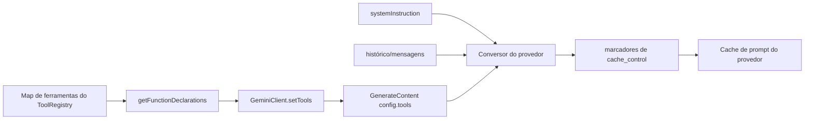
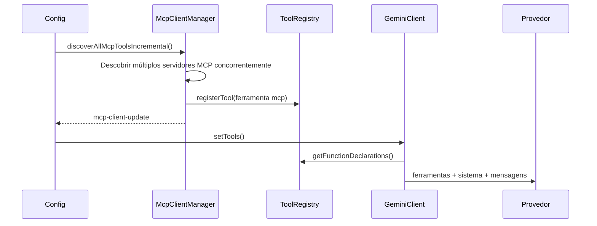

# Design de Ordenação Estável do Esquema de Ferramentas Globais

## Contexto

O Qwen Code já suporta `cache_control` nas camadas de conversão de requisição da Anthropic e da DashScope. Quando um provedor suporta cache de prompt, um prefixo de requisição estável pode ser armazenado em cache e reutilizado, reduzindo o custo de tokens de entrada repetidos e diminuindo o tempo até o primeiro token (TTFT).

O prefixo principal atualmente tem três partes:

1. Esquema de ferramentas: declarações de ferramentas geradas por
   `ToolRegistry.getFunctionDeclarations()`.
2. Instrução do sistema: o prompt do sistema da sessão principal.
3. Mensagens/histórico: prelúdio de inicialização, mensagens do usuário, resultados de ferramentas e contexto relacionado.

O esquema de ferramentas costuma ser grande e aparece próximo ao início do prefixo de cache do provedor. Se os bytes serializados do array de ferramentas mudarem, o prefixo de sistema e mensagens subsequente também pode perder a reutilização.

Atualmente, `GeminiClient.setTools()` usa diretamente o valor de retorno de
`ToolRegistry.getFunctionDeclarations()`, e `getFunctionDeclarations()` itera as ferramentas na ordem de inserção do `Map`. A ordem de registro de ferramentas integradas geralmente é estável, mas a descoberta progressiva de MCP, revelações do ToolSearch, reconexões de MCP e o registro de ferramentas externas podem fazer com que o mesmo conjunto de ferramentas seja serializado em ordens diferentes. Isso cria falhas de cache de prompt desnecessárias.

## Objetivos

Implementar ordenação estável global para esquemas de ferramentas: `functionDeclarations` enviadas para requisições de modelo devem ter uma ordem estável para o mesmo conjunto de ferramentas, independente da ordem de conclusão do registro.

Este design aborda apenas falhas de cache onde o conjunto de ferramentas é idêntico, mas a ordem difere. Adicionar ferramentas, remover ferramentas ou alterar o conteúdo do esquema ainda altera o prefixo; essas são falhas de cache legítimas.

Este design não inclui:

- Blocagem de prompts do sistema.
- Snapshot/cache de esquema de ferramentas no nível da sessão.
- Implementação completa de detecção de quebra de cache de prompt.
- Alterações na política de `cache_control` do provedor.

## Fluxo Atual



A descoberta progressiva de MCP é a fonte mais comum de instabilidade de ordem:



Se dois servidores MCP eventualmente ficarem disponíveis, mas se estabilizarem em ordens diferentes, o bloco de ferramentas atual pode diferir:

```text
Execução 1:
[
  read_file,
  shell,
  mcp__filesystem__read_tree,
  mcp__github__search_issues
]

Execução 2:
[
  read_file,
  shell,
  mcp__github__search_issues,
  mcp__filesystem__read_tree
]
```

Da perspectiva de capacidade do modelo, ambas as execuções expõem o mesmo conjunto de ferramentas. Da perspectiva de cache de prompt, elas são prefixos de ferramentas diferentes.

Após a ordenação, o mesmo conjunto se estabiliza em:

```text
[
  mcp__filesystem__read_tree,
  mcp__github__search_issues,
  read_file,
  shell
]
```

## Papel do Cache de Prompt e Diferenças entre Acertos e Falhas

O cache de prompt permite que o provedor reutilize a computação de KV/cache para um prefixo estável. Para listas longas de ferramentas, prompts de sistema longos e prefixos de histórico longos, um acerto de cache geralmente tem dois benefícios:

- Menor custo de tokens de entrada: o prefixo em cache entra no caminho de cobrança de leitura de cache.
- Menor TTFT: o provedor não precisa reprocessar o prefixo completo.

Antes de um acerto:

```text
bytes da requisição alterados
-> prefixo de ferramentas/sistema/mensagens não pode ser reutilizado
-> cache_read_input_tokens é baixo ou 0
-> o prefixo completo é contado novamente como entrada/criação de cache
-> TTFT é maior
```

Após um acerto:

```text
bytes do prefixo estável inalterados
-> prefixo de ferramentas/sistema/mensagens é reutilizado do cache do provedor
-> cache_read_input_tokens aumenta
-> apenas o novo conteúdo da cauda é contado como entrada/criação de cache
-> TTFT é menor
```

Este design melhora a probabilidade de acerto ao estabilizar a ordem do array de ferramentas, especialmente para a instabilidade na ordem de registro causada pela descoberta progressiva de MCP e revelações do ToolSearch.

## Design

A ordenação pertence a `ToolRegistry.getFunctionDeclarations()` porque é o único ponto de geração para as declarações de ferramentas da API atual. Não ordene no conversor do provedor, porque outros leitores de declarações permaneceriam instáveis. Não ordene apenas em `GeminiClient.setTools()`, porque diagnósticos, estimativa de contexto e testes ainda poderiam observar declarações não ordenadas.

Regras de ordenação:

1. Primeiro, aplique a lógica de filtragem existente:
   - Por padrão, exclua ferramentas onde
     `shouldDefer && !alwaysLoad && !revealedDeferred`.
   - `{ includeDeferred: true }` inclui ferramentas adiadas.
   - Ferramentas `alwaysLoad` estão sempre visíveis.
2. Ordene as instâncias de ferramentas filtradas.
3. Use `tool.schema.name ?? tool.name` como a chave de ordenação primária.
4. Use `tool.displayName` como critério de desempate.
5. Retorne os valores de `tool.schema` ordenados.

Pseudo-código:

```ts
getFunctionDeclarations(options?: { includeDeferred?: boolean }) {
  const includeDeferred = options?.includeDeferred === true;
  return Array.from(this.tools.values())
    .filter((tool) => {
      if (
        !includeDeferred &&
        tool.shouldDefer &&
        !tool.alwaysLoad &&
        !this.revealedDeferred.has(tool.name)
      ) {
        return false;
      }
      return true;
    })
    .sort(compareToolsByDeclarationName)
    .map((tool) => tool.schema);
}
```

Mantenha a função de comparação local e simples. Não adicione configuração:

```ts
function compareToolsByDeclarationName(
  a: AnyDeclarativeTool,
  b: AnyDeclarativeTool,
) {
  const aName = a.schema.name ?? a.name;
  const bName = b.schema.name ?? b.name;
  const byName = aName.localeCompare(bName);
  if (byName !== 0) return byName;
  return a.displayName.localeCompare(b.displayName);
}
```

Não preserve a ordem de registro como uma classificação implícita. A ordem das ferramentas não deve expressar a preferência do modelo; o modelo deve escolher as ferramentas com base no nome, descrição, esquema e contexto.

## Plano de Testes

Adicione ou atualize testes em `packages/core/src/tools/tool-registry.test.ts`.

### 1. Ordenar ferramentas regulares pelo nome canônico

Ordem de registro:

```text
zeta, alpha, middle
```

Asserção:

```text
getFunctionDeclarations().map(name) === [alpha, middle, zeta]
```

### 2. Filtrar ferramentas adiadas antes da ordenação

Registrar:

```text
visible-z
hidden-a (shouldDefer)
visible-a
```

Asserção padrão:

```text
[visible-a, visible-z]
```

### 3. includeDeferred inclui todas as ferramentas e as ordena

Use as mesmas ferramentas acima e chame:

```ts
getFunctionDeclarations({ includeDeferred: true });
```

Asserção:

```text
[hidden-a, visible-a, visible-z]
```

### 4. Ferramentas adiadas reveladas aparecem em sua posição ordenada

Registrar:

```text
visible-m
hidden-a (shouldDefer)
visible-z
```

Executar:

```ts
toolRegistry.revealDeferredTool('hidden-a');
```

Asserção:

```text
[hidden-a, visible-m, visible-z]
```

### 5. Ferramentas adiadas alwaysLoad permanecem visíveis e ordenadas

Registrar:

```text
z (shouldDefer, alwaysLoad)
a
```

Asserção padrão:

```text
[a, z]
```

### 6. A ordem de registro de ferramentas MCP difere, mas a saída corresponde

Crie duas instâncias de `ToolRegistry`:

```text
ordem de registro do registryA:
  mcp__github__search_issues
  mcp__filesystem__read_tree

ordem de registro do registryB:
  mcp__filesystem__read_tree
  mcp__github__search_issues
```

Asserção:

```text
registryA.getFunctionDeclarations().map(name)
  === registryB.getFunctionDeclarations().map(name)
```

### 7. Atualizar asserções antigas

Testes existentes que dependem da ordem de registro devem ser atualizados para depender da ordem ordenada. Por exemplo, um teste de filtragem de ferramentas adiadas que apenas asserciona `['visible']` pode permanecer como está; se ele registrar múltiplas ferramentas visíveis no futuro, deve assercionar o array ordenado.

Comandos de verificação recomendados:

```bash
cd packages/core && npx vitest run src/tools/tool-registry.test.ts
cd packages/core && npx vitest run src/tools/tool-search.test.ts
cd packages/core && npx vitest run src/core/client.test.ts
npm run build && npm run typecheck
```

## Riscos e Restrições

- Alterar a ordem das ferramentas pode afetar a preferência de seleção implícita do modelo. Este risco é aceitável porque a ordem das ferramentas não deve ser uma semântica do produto; prefixos de cache estáveis têm prioridade mais alta.
- Este design não previne falhas de cache causadas por ferramentas recém-adicionadas. Novas ferramentas de servidores MCP, alterações no conteúdo do esquema de ferramentas e revelações do ToolSearch de novas ferramentas ainda alterarão legitimamente o bloco de ferramentas.
- Se um provedor exigir a preservação da semântica de registro de ferramentas no futuro, isso deve ser tratado na camada do provedor. O código atual não tem esse requisito.

## Próximo Passo: Detecção de Quebra de Cache de Prompt

Após a ordenação global ser implementada, o próximo passo deve ser a detecção leve de quebra de cache de prompt para validar o benefício da ordenação e localizar as falhas de cache restantes.

Implemente em duas fases:

1. Registre um snapshot antes de cada requisição:
   - modelo.
   - hash da instrução do sistema.
   - nomes de functionDeclaration e hash do esquema.
   - controle de cache habilitado/escopo.
2. Leia o uso após cada resposta:
   - `cache_read_input_tokens`.
   - `cache_creation_input_tokens`.
   - metadados compatíveis de tokens em cache do OpenAI/DashScope/Gemini.

Quando a leitura do cache cair significativamente em relação ao turno anterior, emita um log de depuração ou evento de telemetria:

```text
prompt_cache_break:
  reason: tools_order_changed | tools_schema_changed | system_changed |
          cache_control_changed | model_changed | likely_provider_ttl_or_eviction
  previousCacheReadTokens
  currentCacheReadTokens
  changedToolNames
```

A primeira versão deve apenas observar e não deve alterar o comportamento da requisição. Seu objetivo é responder a duas perguntas:

1. A ordenação global de ferramentas reduz as falhas de cache por ordem de ferramentas?
2. As falhas de cache restantes vêm principalmente do texto do sistema, conteúdo do esquema de ferramentas, `cache_control` ou TTL/evicção do provedor?