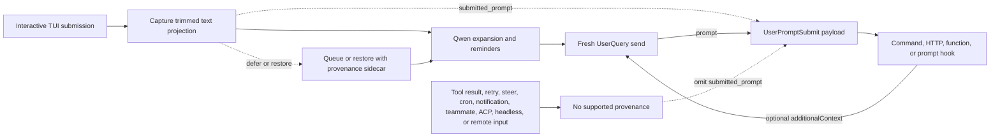

# Proveniência do prompt submetido para `UserPromptSubmit`

## Resumo

`UserPromptSubmit.prompt` é o prompt da invocação atual do modelo. Ele pode
conter lembretes gerados pelo Qwen, arquivos e recursos expandidos, saída de
comando slash, saída de extensão ou contexto adicionado por um hook anterior.
Ele portanto não pode responder com confiabilidade a uma pergunta diferente:
qual projeção de texto cruzou uma fronteira de entrada interativa suportada?

Esta alteração adiciona um campo opcional `submitted_prompt`:

```ts
interface UserPromptSubmitInput {
  prompt: string;
  submitted_prompt?: string;
}
```

O campo é preenchido apenas quando o Qwen pode carregar a proveniência de uma
submissão interativa suportada da TUI para um `UserQuery` novo. Consumidores
que requerem texto submetido pelo usuário devem tratar um campo ausente como
indisponível e não devem fazer fallback para `prompt`.

A alteração não muda quando `UserPromptSubmit` dispara, o valor existente de
`prompt`, a ordem ou bloqueio de hooks, ou o comportamento de
`additionalContext`.

## Objetivos e não-objetivos

Objetivos:

- Preservar o texto submetido pela TUI interativa suportada antes que o Qwen
  o expanda.
- Carregar esse texto por submissões adiadas e restauradas sem associá-lo à
  requisição errada do modelo.
- Adicionar o campo sem quebrar consumidores que aceitam JSON
  compatível-com-versões-futuras.
- Tornar todos os destinatários de dados e fronteiras de confiança
  explícitos.

Não-objetivos:

- Alterar a semântica de disparo de `UserPromptSubmit`.
- Inferir um prompt original a partir de conteúdo destinado ao modelo.
- Suportar ACP, headless, remoto, SDK ou outros produtores de entrada nesta
  alteração.
- Fornecer autenticação, identidade de tenant, DLP ou um rótulo de segurança
  imutável.
- Implementar recuperação de contexto externo.

## Fluxo de dados



A fila permanece orientada a texto para renderização. A proveniência é
associada por meio de um sidecar interno e é consumida apenas quando o texto
enfileirado vira um turno novo. Qualquer transformação ambígua, lote parcial
ou restauração editada falha com fail closed omitindo `submitted_prompt`.

Placeholders de colagem grande permanecem compactos em `submitted_prompt`; seu
conteúdo completo é expandido apenas no `prompt` destinado ao modelo. Isso
preserva a projeção da TUI e evita duplicar conteúdo colado de vários
megabytes em cada payload de hook.

A restauração por cancelamento mantém a propriedade do turno principal quando
uma pergunta lateral concorrente de `/btw` executa. Como essa pergunta
lateral pode escrever uma entrada de usuário mais nova no histórico em disco,
o cancelamento remove a última entrada registrada apenas quando o turno
principal ainda a possui exclusivamente. Esse acoplamento mantém o sidecar de
proveniência restaurado e o histórico persistente alinhados, em vez de
restaurar um turno enquanto exclui outro.

## Elegibilidade

| Caminho                                                                            | `prompt`                     | `submitted_prompt`                               | Regra                                           |
| ---------------------------------------------------------------------------------- | ---------------------------- | ------------------------------------------------ | ----------------------------------------------- |
| Submissão nova da TUI interativa enviada como `UserQuery`                          | Valor existente destinado ao modelo | Presente                                  | Capturar a projeção aparada antes da expansão    |
| Submissão adiada da TUI que depois vira um turno novo                              | Valor existente destinado ao modelo | Presente apenas com proveniência completa | Preservar o sidecar enquanto enfileirado        |
| Restauração exata de cancelamento ou de fila seguida de ressubmissão               | Valor existente destinado ao modelo | Presente apenas quando o texto restaurado está inalterado | Reutilizar o sidecar apenas para uma restauração exata |
| Entrada restaurada editada ou parcialmente conhecida                               | Valor existente destinado ao modelo | Ausente                                   | Não adivinhar proveniência                        |
| Navegação por histórico de prompt, comando ou shell, ou correspondência de busca selecionada | Valor existente destinado ao modelo | Ausente                       | O histórico pode conter expansões geradas       |
| Prompt restaurado do stash entre reinicializações                                  | Valor existente destinado ao modelo | Ausente                                   | O stash armazena texto sem proveniência         |
| Prompt restaurado por retrocesso da conversa                                       | Valor existente destinado ao modelo | Ausente                                   | O histórico do retrocesso armazena apenas texto destinado ao modelo |
| Entrada de direcionamento no mesmo turno                                           | Comportamento existente      | Ausente                                          | Direcionamento não é uma submissão nova suportada |
| Resultado de ferramenta ou continuação de hook                                     | Comportamento existente      | Ausente                                          | Preservar o comportamento legado de continuação  |
| Tráfego de nova tentativa, cron, notificação ou teammate                           | Comportamento existente      | Ausente                                          | Preservar o comportamento existente de disparo   |
| Prompt inicial configurado via `--prompt-interactive`                              | Valor existente destinado ao modelo | Ausente                                   | Ele não cruzou a fronteira de entrada interativa |
| Entrada não vazia presente enquanto o modo Vim está habilitado, inclusive após o Vim ser desabilitado | Valor existente destinado ao modelo | Ausente                  | Registros do Vim não carregam proveniência      |
| ACP, headless, `serve`, SDK, entrada remota ou entrada especulativa aceita         | Comportamento existente      | Ausente                                          | Nenhum produtor é adicionado nesta alteração     |

Quando uma entrada destinada ao modelo restaurada ou sem proveniência é
limpa ou submetida, a TUI descarta seu histórico de desfazer e refazer do
buffer de texto antes que uma entrada posterior possa se tornar elegível.
Isso evita que desfazer restaure texto destinado ao modelo depois que seu
marcador de proveniência ou sidecar foi consumido.

Qualquer entrada não vazia presente enquanto o Vim está habilitado permanece
inelegível depois que o Vim é desabilitado, até que o compositor seja limpo.
Essa regra conservadora também cobre rascunhos inseridos antes de habilitar o
Vim. Registros do Vim podem reter texto destinado ao modelo mesmo após
limpezas do buffer, então mudar de modo não pode restaurar a proveniência de
conteúdo existente.

A tabela define apenas proveniência. O disparo existente de eventos permanece
inalterado, incluindo caminhos que não disparam `UserPromptSubmit`.

## Invariantes

1. O Core serializa `submitted_prompt` apenas para um `UserQuery` novo
   carregando uma string não vazia de um produtor suportado.
2. O valor é preservado como recebido pelo Core; o Core não apara,
   reconstrói nem deriva o valor a partir de `prompt`.
3. Atualizações sequenciais de `additionalContext` podem estender `prompt`,
   mas não reescrevem `submitted_prompt`.
4. Envios recursivos e conduzidos por máquina limpam a proveniência.
5. Um lote enfileirado é atribuído apenas quando todo item incluído tem
   proveniência compatível. Caso contrário, o lote omite o campo.
6. Um sidecar restaurado é de uso único e se aplica apenas a uma ressubmissão
   exata.
7. Proveniência ausente é um estado normal, não um erro.

## Compatibilidade e migração

O contrato JSON do hook é extensível para versões futuras. Decodificadores
devem ignorar campos desconhecidos. Consumidores que rejeitam intencionalmente
campos desconhecidos, por exemplo um JSON Schema com
`additionalProperties: false`, devem permitir explicitamente a propriedade
opcional `submitted_prompt` antes de atualizar. Para um hook sensível à
segurança, a falha de um decodificador estrito pode mudar se uma invocação
falha como fail-open ou fail closed, então administradores devem testar o
payload atualizado com o hook implantado antes do rollout.

Consumidores existentes que leem apenas `prompt` mantêm seu comportamento
atual. Consumidores sensíveis à origem devem ler `submitted_prompt` e pular,
perguntar ao usuário ou aplicar uma política de fallback documentada quando
ele estiver ausente. Usar silenciosamente `prompt` como o texto original do
usuário não é um fallback seguro.

## Confiança e fronteiras de dados

`submitted_prompt` é proveniência fornecida pelo chamador. Não é uma
identidade autenticada, decisão de autorização, vínculo com repositório ou
resultado de DLP. Ele herda a confiança do processo local do Qwen e do
produtor suportado da TUI; ele não estabelece uma nova fronteira de
confiança. Em particular, um hook de função recebe um objeto em processo e
deve ser tratado como código confiável; este design não reivindica
imutabilidade em runtime contra tal hook.

Todos os executores de hook configurados recebem o payload do evento:

| Tipo de hook | Destinatário                                              |
| ------------ | --------------------------------------------------------- |
| Command      | Processo filho por meio da entrada padrão                  |
| HTTP         | Endpoint configurado por meio do corpo do POST             |
| Function     | Callback confiável em processo                             |
| Prompt       | Provedor de modelo configurado após substituição de `$ARGUMENTS` |

Operadores devem tratar tanto `prompt` quanto `submitted_prompt` como
potencialmente sensíveis. Hooks de prompt enviam o payload a um provedor de
modelo. O log de debug baseado em arquivo registra a requisição do hook de
prompt totalmente expandida, então sua retenção e controles de acesso devem
corresponder aos dados submetidos. Um hook também pode copiar sua entrada
para sua própria saída, erro, logs ou sistemas downstream; esses destinos
estão fora das garantias deste campo.

Quando ambos os campos estão presentes, payloads de hook de prompt contêm
texto sobreposto e podem consumir tokens adicionais de entrada do modelo.
Este contrato não fornece supressão de campo por hook.

A telemetria de chamada de hook atualmente exporta metadados do hook em vez
da entrada completa, mas esse detalhe de implementação não é uma fronteira de
privacidade e consumidores não devem depender dele.

## Por que isso difere do Claude Code

O Claude Code executa `UserPromptSubmit` em sua fronteira de submissão do
usuário, antes de o controle entrar no loop de consulta do modelo. A
recursão de resultado de ferramenta não cruza essa fronteira, então seu
`prompt` existente representa naturalmente a entrada submetida.

O Qwen Code executa o hook mais próximo de seu pipeline compartilhado de
envio ao modelo e preserva o comportamento legado em mais caminhos de envio.
Mover o evento seria uma mudança semântica mais ampla e com quebra. Um campo
aditivo de proveniência dá aos chamadores suportados da TUI o sinal de
fronteira ausente enquanto preserva integrações existentes.

## Verificação

Testes unitários cobrem o gate de serialização do Core, encadeamento de
hooks, captura da TUI, projeção de colagem grande, filas adiadas,
restauração exata e editada, limpeza de proveniência e lotes incompletos. A
cobertura E2E interativa captura um payload real de hook de comando e
confirma que a expansão pode mudar `prompt` sem mudar `submitted_prompt` e
que uma continuação de resultado de ferramenta omite o campo.
