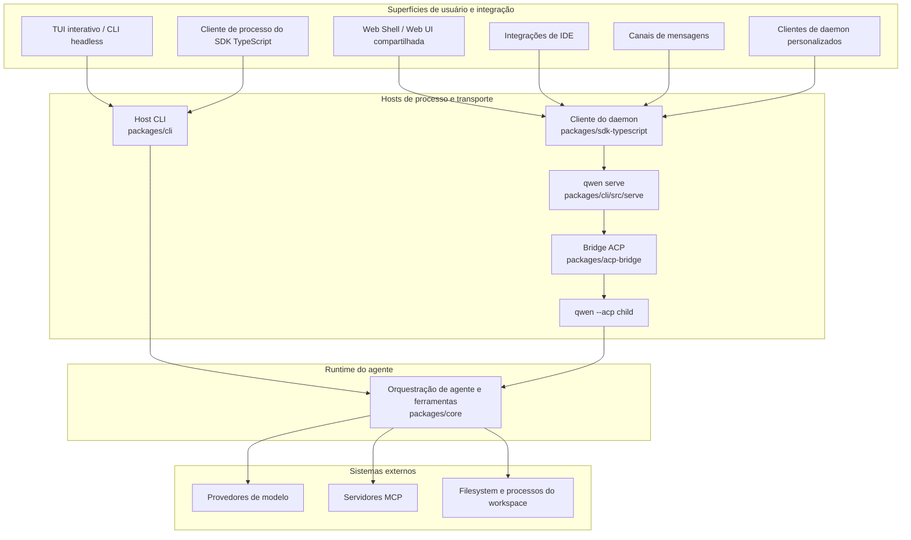

# Visão Geral da Arquitetura do Qwen Code

O Qwen Code é um monorepo que suporta um terminal interativo, execução headless
e programática, o Agent Client Protocol (ACP), um daemon HTTP de longa duração,
clientes web e de IDE, e adaptadores de canais de mensagens. Este documento mapeia
essas superfícies para os pacotes que as implementam e explica os principais
limites de runtime.

Para detalhes internos do daemon, comece pela
[documentação do daemon](./daemon/00-index.md). Para formatos de requisições e
eventos HTTP, consulte a [referência do protocolo `qwen serve`](./qwen-serve-protocol.md).

## Sistema em linhas gerais

O Qwen Code tem dois modelos de execução de agente:

- **Execução direta:** o TUI interativo e a CLI headless constroem e executam
  o runtime do agente diretamente.
- **Execução ACP:** `qwen --acp` hospeda o agente atrás de um transporte ACP. Pode
  ser controlado por um cliente ACP diretamente ou pelo `qwen serve` através da
  bridge ACP compartilhada.

O `qwen serve` adiciona um plano de controle HTTP + Server-Sent Events (SSE) em
torno da execução ACP para que múltiplos clientes possam usar runtimes de longa
duração com escopo de workspace.

O diagrama mostra os principais caminhos de produção. Alguns adaptadores também
têm modos standalone: por exemplo, `qwen channel start` usa a bridge ACP sem
exigir um daemon HTTP. Consulte o
[guia de plugin de canal](./channel-plugins.md#runtime-modes) para essas variantes.

## Layout do repositório

| Caminho                                                                                                      | Responsabilidade                                                                                                                                                                             |
| ------------------------------------------------------------------------------------------------------------ | -------------------------------------------------------------------------------------------------------------------------------------------------------------------------------------------- |
| `packages/cli`                                                                                               | O executável `qwen`, parsing de argumentos, montagem de configuração, TUI Ink, saída headless, ponto de entrada ACP, `qwen serve` e adaptadores específicos de comandos.                     |
| `packages/core`                                                                                              | Orquestração de agente independente de UI, integração com provedores de modelo, construção de prompt e contexto, registro e execução de ferramentas, permissões, sessões, memória, telemetria e serviços compartilhados. |
| `packages/acp-bridge`                                                                                        | Ciclo de vida do canal ACP, multiplexação de sessões, entrega de eventos, mediação de permissões, spawn de processos e a interface de filesystem compartilhada por daemon e hosts adaptadores. |
| `packages/sdk-typescript`                                                                                    | Execução programática de processos via `query()` mais clientes HTTP/SSE e projeção de transcrição para `qwen serve`.                                                                         |
| `packages/webui`                                                                                             | Componentes React compartilhados e o adaptador React do daemon construído sobre o SDK TypeScript.                                                                                             |
| `packages/web-shell`                                                                                         | A UI de terminal no navegador construída sobre `packages/webui` e o SDK do daemon.                                                                                                           |
| `packages/web-templates`                                                                                     | Templates web empacotados como strings de JavaScript e CSS incorporáveis.                                                                                                                     |
| `packages/audio-capture`                                                                                     | Captura nativa de microfone para entrada por voz.                                                                                                                                            |
| `packages/channels`                                                                                          | O runtime de canal compartilhado e adaptadores de plataforma para serviços de mensagens.                                                                                                     |
| `packages/desktop`, `packages/vscode-ide-companion`, `packages/chrome-extension`, `packages/zed-extension`   | Superfícies de produto e editor que adaptam o Qwen Code aos seus ambientes host.                                                                                                             |
| `packages/sdk-java`, `packages/sdk-python`                                                                   | Clientes programáticos específicos de linguagem.                                                                                                                                              |
| `packages/cua-driver`, `packages/mobile-mcp`                                                                 | Integrações de uso do computador e dispositivos móveis expostas através de boundaries compatíveis com MCP.                                                                                    |
| `integration-tests`                                                                                          | Cobertura end-to-end para CLI, interativo, SDK, sandbox, hook e comportamento de terminal.                                                                                                   |
| `docs` e `docs-site`                                                                                         | Documentação de usuário, desenvolvedor, protocolo e design, mais o site de documentação.                                                                                                     |
| `scripts`                                                                                                    | Automação de build, empacotamento, release, validação e manutenção do repositório.                                                                                                           |

A maior parte do código vive em workspaces npm sob `packages/`. Um pacote deve
depender de outro pacote através de suas exportações públicas declaradas, e não
por um caminho relativo na árvore de código-fonte desse pacote.

## Limites dos pacotes

### CLI e superfícies de apresentação

O `packages/cli` é dono do executável e escolhe o modo de runtime a partir dos
argumentos de linha de comando. Carrega configurações de usuário e workspace,
constrói a configuração do core, entra no sandbox solicitado quando necessário e
então inicia um dos fluxos interativo, headless, ACP, daemon, canal ou manutenção.

A apresentação permanece fora do runtime do core:

- o TUI Ink renderiza sessões interativas locais;
- o `packages/webui` adapta o estado do daemon a providers e hooks React;
- o `packages/web-shell` fornece a experiência de terminal no navegador;
- pacotes de IDE e canal traduzem eventos específicos do host em contratos
  compartilhados de cliente ou bridge.

### Runtime do core

O `packages/core` é dono do loop do agente. Constrói requisições de modelo,
mantém o contexto da conversa, despacha chamadas de ferramenta, aplica política
de permissões e retorna eventos e resultados estruturados ao host ativo.
Ferramentas integradas cobrem operações de arquivo, execução de shell, busca,
planejamento, acesso web, memória, skills e subagentes. O MCP estende a
superfície de ferramentas e recursos sem acoplar o runtime a uma integração
específica.

O pacote core não decide como os resultados são exibidos nem como um cliente
remoto os transporta. Essas decisões pertencem às camadas CLI, bridge, SDK e UI.

### Bridge ACP

O `packages/acp-bridge` conecta um processo host a um runtime de agente ACP.
Suas principais responsabilidades são:

- spawn ou anexação a um canal ACP;
- multiplexação de sessões e clientes;
- encaminhamento de prompts, cancelamentos e notificações ACP;
- mediação de requisições de permissão;
- publicação de streams de eventos de sessão limitados;
- fornecimento de uma interface de filesystem de workspace ao host.

A bridge pode usar um processo filho real `qwen --acp` em produção ou um canal
em memória em testes. Consulte o
[README do `@qwen-code/acp-bridge`](../../packages/acp-bridge/README.md) para
seus pontos de entrada públicos.

### Adaptadores SDK e UI

O SDK TypeScript expõe dois estilos de cliente:

- `query()` inicia e controla um processo do Qwen Code para uso local programático;
- clientes do daemon se comunicam com o `qwen serve` via HTTP e SSE.

O `packages/webui` constrói uma camada de estado React sobre o cliente do daemon,
e o `packages/web-shell` constrói a UI do navegador sobre essa camada de estado.
Outros clientes, incluindo integrações de IDE e canais gerenciados pelo daemon,
reutilizam o mesmo SDK e contratos de eventos em vez de importar código de
implementação do servidor.

## Fluxos de runtime

### Fluxo direto da CLI

1. A CLI faz parse dos argumentos e resolve as configurações de usuário,
   workspace, ambiente e linha de comando.
2. Prepara o sandbox e constrói a configuração do runtime do core.
3. O runtime do core constrói a requisição de modelo e entra no loop de
   agente/ferramentas.
4. As chamadas de ferramenta são verificadas contra a política de permissões e
   executadas no ambiente de workspace ativo.
5. A CLI renderiza eventos incrementais no TUI ou os serializa para saída
   headless.

### Fluxo do daemon

1. Um cliente usa o SDK TypeScript ou a API HTTP documentada para se conectar ao
   `qwen serve`.
2. O daemon autentica a requisição e resolve o workspace que possui a operação
   solicitada.
3. O runtime do workspace encaminha operações do agente através de sua bridge ACP
   para um filho `qwen --acp`.
4. O filho executa a mesma lógica de agente e ferramentas usada pela execução
   direta.
5. Respostas e notificações retornam através da bridge; eventos de sessão são
   entregues aos clientes via SSE.

Com sessões multi-workspace habilitadas, cada runtime de workspace ativo possui
sua própria bridge e filho ACP. Acesso ao filesystem, overlays de ambiente,
transportes MCP, sessões e tratamento de falhas permanecem escopados ao runtime
resolvido. A [arquitetura do daemon](./daemon/01-architecture.md) documenta a
topologia do processo, boundaries de confiança, replay de eventos e ciclo de
vida em detalhe.

## Pontos de extensão

O Qwen Code pode ser estendido em várias camadas:

- **Servidores MCP** adicionam ferramentas, prompts e recursos ao runtime do core.
- **Extensões e skills** empacotam comandos reutilizáveis, configuração e
  comportamento de agente.
- **Plugins de canal** adaptam plataformas de mensagens ao runtime de canal
  compartilhado.
- **Clientes SDK** constroem aplicações personalizadas locais ou com suporte de
  daemon.
- **Adaptadores de UI** projetam eventos compartilhados do daemon em estado e
  apresentação específicos do host.

Mantenha preocupações específicas de plataforma nos adaptadores. Comportamento
de agente compartilhado pertence ao runtime do core, enquanto comportamento de
transporte e wire pertence à bridge ACP, SDK ou host do daemon.

## Configuração e estado

A CLI monta a configuração efetiva a partir de argumentos de linha de comando,
variáveis de ambiente, configurações de usuário, configurações de workspace e
valores padrão antes de construir o runtime. O core recebe a configuração
resolvida em vez de ler entradas específicas de apresentação. Consulte
[Settings](../users/configuration/settings.md) para as configurações suportadas
e seus escopos.

Sessões diretas persistem seu histórico e metadados através de serviços core
compartilhados. No modo daemon, o daemon resolve o workspace proprietário e
expõe operações escopadas por workspace e sessão aos clientes; o filho ACP
permanece o dono da execução ativa do agente.

## Para onde ir a seguir

- [Documentação de desenvolvedor do daemon](./daemon/00-index.md)
- [Protocolo HTTP do `qwen serve`](./qwen-serve-protocol.md)
- [SDK TypeScript](../../packages/sdk-typescript/README.md)
- [Bridge ACP](../../packages/acp-bridge/README.md)
- [Guia do desenvolvedor de plugin de canal](./channel-plugins.md)
- [Desenvolvimento de ferramentas](./tools/introduction.md)
- [Testes de integração](./development/integration-tests.md)
