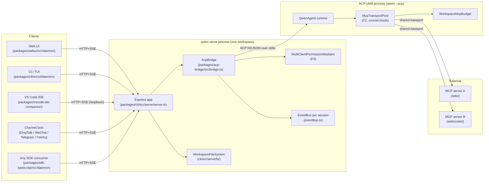
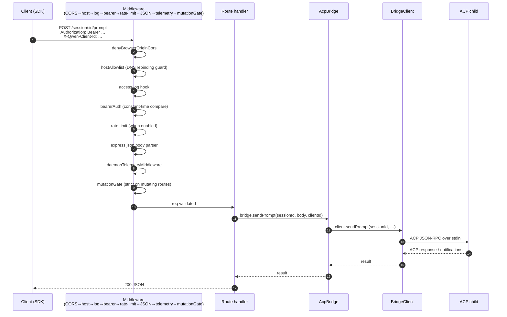
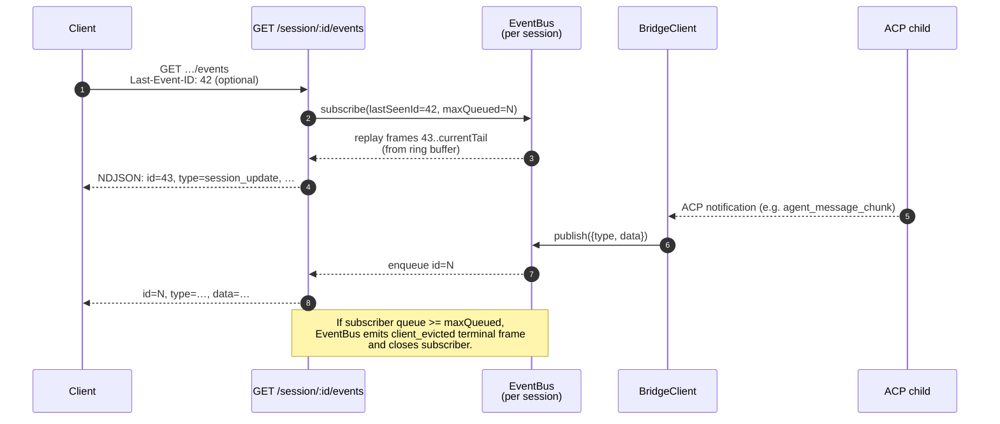
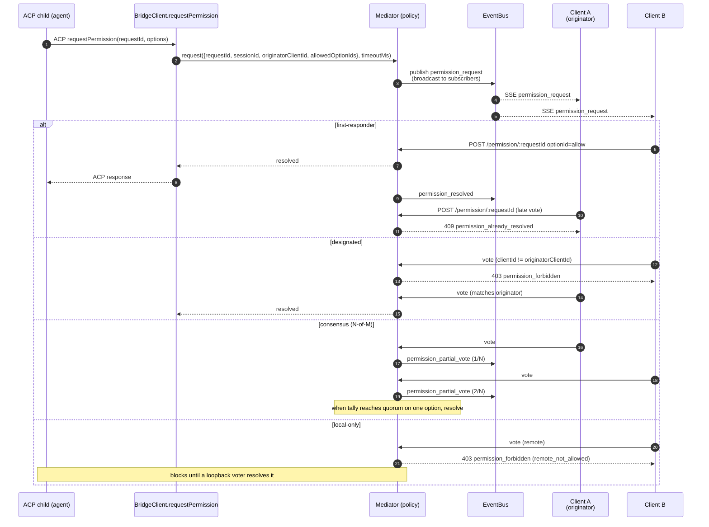
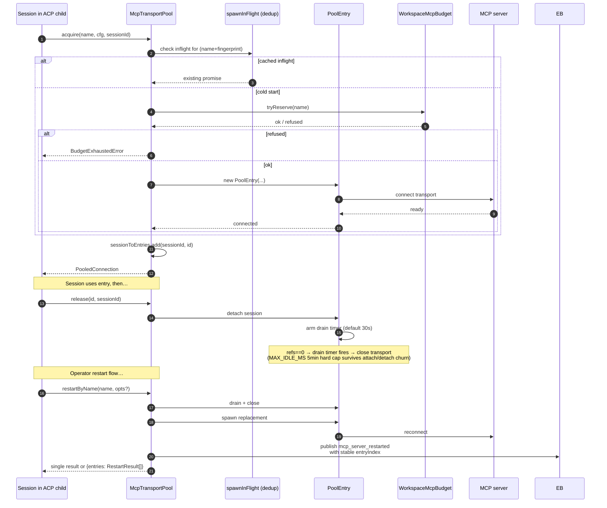
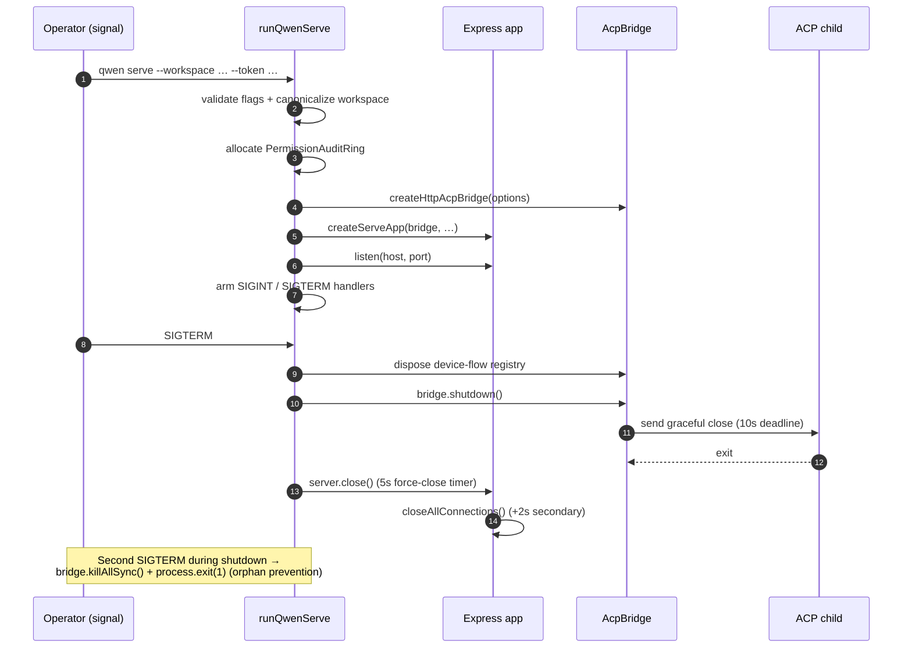

# Arquitetura do Daemon

## Visão Geral

Um processo `qwen serve` é **um daemon = um workspace**. Ele hospeda um único servidor HTTP Express, possui uma instância `@qwen-code/acp-bridge` e gera um processo filho ACP (`qwen --acp`) que executa o runtime do agente propriamente dito. Vários clientes (CLI TUI, companion de IDE, bots de canal de mensagens, BFFs web, scripts customizados) conectam-se via HTTP + SSE e compartilham uma sessão ACP (`sessionScope: 'single'`, padrão) ou dividem sessões por thread de conversa (`sessionScope: 'thread'`).

Dentro do processo filho ACP, os servidores MCP são compartilhados em todo o workspace através do `McpTransportPool` (F2): uma única tupla (nome do servidor + fingerprint de configuração) mapeia para um único transporte MCP, independentemente de quantas sessões o descobrem. O `MultiClientPermissionMediator` (F3) da bridge coordena os votos de permissão entre todos os clientes conectados sob uma das quatro políticas.

Este documento fornece a **visão sistêmica** sobre a qual o restante deste conjunto de documentação se baseia. Cada fluxo crítico é mostrado como um diagrama de sequência Mermaid; os detalhes de implementação por componente estão nos outros 18 documentos.

## Topologia de processos

O processo daemon e o processo filho ACP são conectados por um `AcpChannel` (padrão: um par real de pipes stdio de subprocesso; `inMemoryChannel` para testes). Tudo o que o daemon faz é moldado por essa divisão: o tráfego HTTP e SSE termina no daemon, as decisões do agente e invocações de ferramentas ocorrem no filho, e a bridge conecta os dois.

## Mapa de pacotes

Três fronteiras de confiança são importantes: a borda HTTP (cadeia de middlewares `serve/auth.ts`), a fronteira bridge-processo-filho ACP (NDJSON sobre stdio, sem autenticação; o filho confia implicitamente na bridge) e a fronteira agente-servidor MCP (o agente pode invocar ferramentas que tocam o host).
## Fluxo de trabalho 1: Ciclo de vida da solicitação HTTP

Rotas não-streaming (prompt, cancelar, troca de modelo, metadados, CRUD de workspace) terminam como uma única resposta JSON. A saída de streaming é entregue fora da banda no canal SSE, **não** como um corpo HTTP fragmentado nesta conexão. Veja o fluxo de trabalho 2.

## Fluxo de trabalho 2: Entrega e reprodução de eventos SSE

O buffer circular é limitado (`eventRingSize`, padrão 8000). Um cliente reconectando cujo `Last-Event-ID` é mais antigo que o início do buffer recebe um sinal sintético de atualização e deve chamar `loadSession` / `resumeSession` para reconstruir o estado mais profundo. Clientes lentos disparam `slow_client_warning` a 75% da fila e `client_evicted` no limite.

## Fluxo de trabalho 3: Mediação de permissão multi-cliente

Mecanismo de escape entre políticas: qualquer cliente pode votar `CANCEL_VOTE_SENTINEL` para interromper a solicitação como `cancelled / agent_cancelled`. A bridge protege contra chamadores de rede que tentam passar o sentinela através do campo normal `optionId` (`InvalidPermissionOptionError`).

## Fluxo de trabalho 4: Aquisição/liberação/reinicialização do pool de transporte MCP

`releaseSession(sessionId)` usa o índice reverso `sessionToEntries` para liberar cada entrada que a sessão mantém em O(refs). No desligamento do daemon, `drainAll()` define a flag `draining` (recusando novas aquisições) e aguarda que cada entrada seja fechada dentro de um tempo limite configurável.

## Fluxo de Trabalho 5: Ciclo de Vida — inicialização e desligamento gracioso

O desligamento em duas fases é importante porque requisições HTTP em andamento, assinantes SSE em andamento e chamadas de ferramenta em andamento do processo filho ACP precisam de janelas de desligamento limitadas. Se algo bloquear além desses prazos, o caminho de fechamento forçado assume o controle para que um filho travado não mantenha o processo daemon vivo.

## Arquivos críticos

| Assunto              | Arquivo                                                        |
| -------------------- | -------------------------------------------------------------- |
| Inicialização        | `packages/cli/src/serve/run-qwen-serve.ts`                     |
| Aplicação Express    | `packages/cli/src/serve/server.ts`                             |
| Registro de capacidades | `packages/cli/src/serve/capabilities.ts`                    |
| Middleware de autenticação | `packages/cli/src/serve/auth.ts`                         |
| Bridge               | `packages/acp-bridge/src/bridge.ts`                            |
| BridgeClient         | `packages/acp-bridge/src/bridgeClient.ts`                      |
| Mediador de permissões | `packages/acp-bridge/src/permissionMediator.ts`             |
| EventBus             | `packages/acp-bridge/src/eventBus.ts`                          |
| Pool de transporte MCP | `packages/core/src/tools/mcp-transport-pool.ts`              |
| Orçamento MCP do workspace | `packages/core/src/tools/mcp-workspace-budget.ts`          |
| Sistema de arquivos do workspace | `packages/cli/src/serve/fs/`                        |
| SDK DaemonClient     | `packages/sdk-typescript/src/daemon/DaemonClient.ts`           |
| SDK SessionClient    | `packages/sdk-typescript/src/daemon/DaemonSessionClient.ts`   |
| Esquema de eventos   | `packages/sdk-typescript/src/daemon/events.ts`                 |

## Referências

- Issues de design: [#3803](https://github.com/QwenLM/qwen-code/issues/3803) (design do daemon), [#4175](https://github.com/QwenLM/qwen-code/issues/4175) (marcos da série F).
- Guia do usuário: [`../../users/qwen-serve.md`](../../users/qwen-serve.md).
- Referência do protocolo de comunicação: [`../qwen-serve-protocol.md`](../qwen-serve-protocol.md).
- Documento de design do F2: [`../../design/f2-mcp-transport-pool.md`](../../design/f2-mcp-transport-pool.md).
- Notas de design do F2: issue [#4175](https://github.com/QwenLM/qwen-code/issues/4175) commits 4-6.
