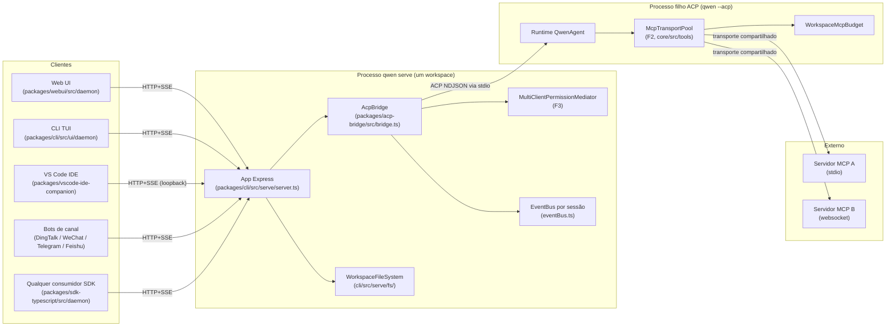
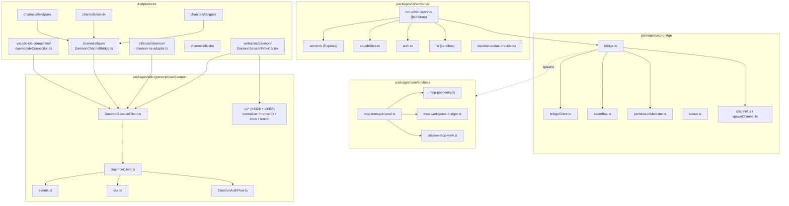
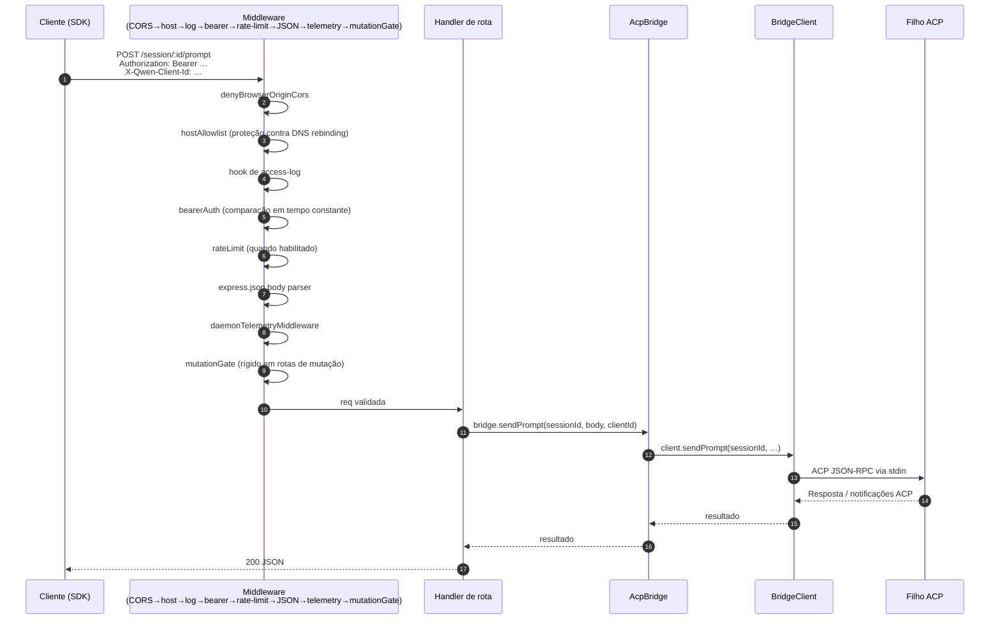
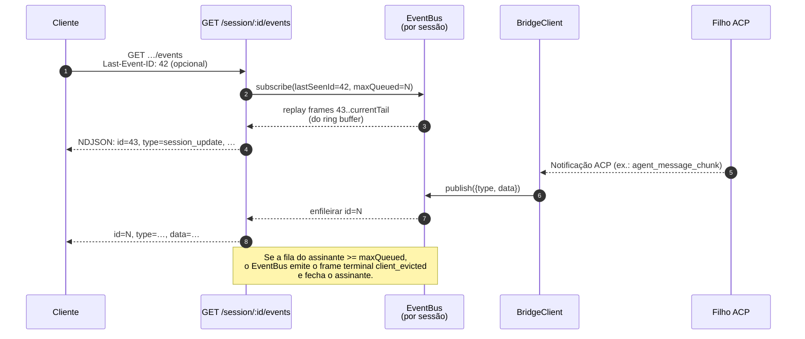
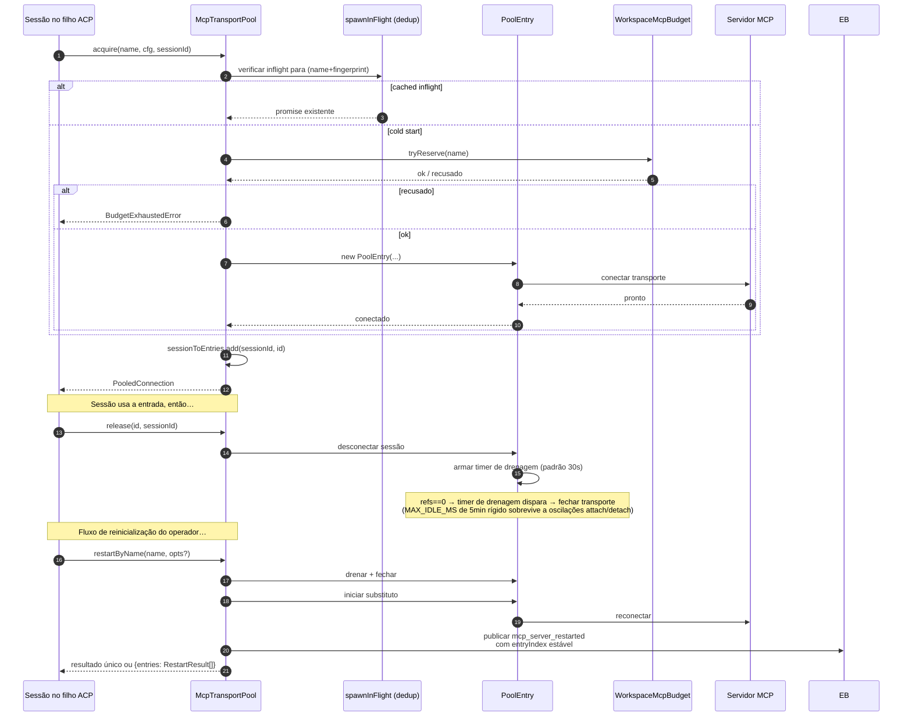
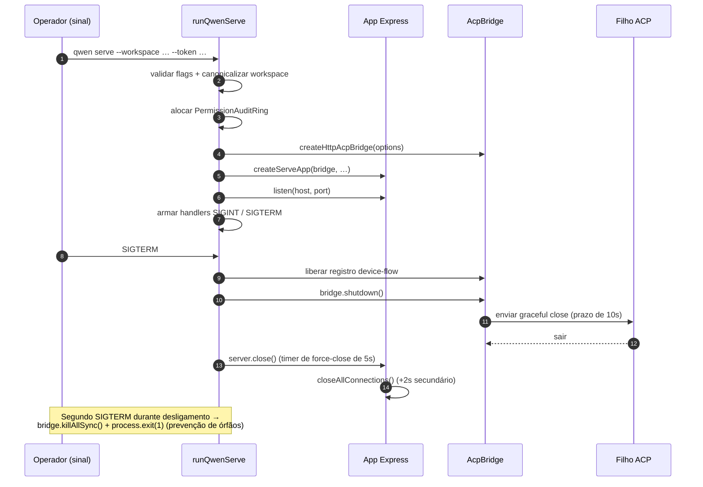

# Arquitetura do Daemon

## Visão Geral

Um processo `qwen serve` é **um daemon = um workspace**. Ele hospeda um único servidor HTTP Express, possui uma instância de `@qwen-code/acp-bridge`, e inicia um processo filho ACP (`qwen --acp`) que executa o runtime do agente propriamente dito. Múltiplos clientes (CLI TUI, companion de IDE, bots de canais de IM, web BFFs, scripts customizados) se conectam via HTTP + SSE e ou compartilham uma única sessão ACP (`sessionScope: 'single'`, padrão) ou dividem sessões por thread de conversa (`sessionScope: 'thread'`).

Dentro do processo filho ACP, os servidores MCP são compartilhados em todo o workspace através do `McpTransportPool` (F2): uma única tupla (nome-do-servidor + fingerprint-de-config) mapeia para um único transporte MCP, independentemente de quantas sessões o descubram. O `MultiClientPermissionMediator` (F3) da bridge coordena votos de permissão entre todos os clientes conectados sob uma de quatro políticas.

Este documento fornece a **visão sistêmica** sobre a qual o restante deste conjunto de documentação se baseia. Cada fluxo crítico é mostrado como um diagrama de sequência Mermaid; detalhes de implementação por componente residem nos outros 18 documentos.

## Topologia de processos

O processo daemon e o processo filho ACP são conectados por um `AcpChannel` (padrão: um par real de pipes stdio de subprocesso; `inMemoryChannel` para testes). Tudo o que o daemon faz é moldado por essa divisão: o tráfego HTTP e SSE termina no daemon, as decisões do agente e as invocações de ferramentas ocorrem no filho, e a bridge conecta os dois.

## Mapa de pacotes

Três fronteiras de confiança são importantes: a borda HTTP (cadeia de middleware `serve/auth.ts`), a fronteira bridge-para-filho-ACP (NDJSON via stdio, sem autenticação; o filho confia implicitamente na bridge), e a fronteira agente-para-servidor-MCP (o agente pode invocar ferramentas que tocam o host).

## Workflow 1: Ciclo de vida de requisição HTTP

Rotas não-streaming (prompt, cancelar, troca de modelo, metadados, CRUD de workspace) terminam como uma única resposta JSON. A saída streaming é entregue fora-de-banda no canal SSE, **não** como um corpo HTTP chunked nesta conexão. Veja o workflow 2.

## Workflow 2: Entrega e replay de eventos SSE

O ring buffer é limitado (`eventRingSize`, padrão 8000). Um cliente reconectando cujo `Last-Event-ID` é mais antigo que o início do ring buffer recebe um sinal sintético de catch-up e deve chamar `loadSession` / `resumeSession` para reconstruir o estado mais profundo. Clientes lentos disparam `slow_client_warning` a 75% de preenchimento da fila e `client_evicted` no limite máximo.

## Workflow 3: Mediação de permissão multi-cliente

Escapatória cross-política: qualquer cliente pode votar `CANCEL_VOTE_SENTINEL` para interromper a requisição como `cancelled / agent_cancelled`. A bridge protege contra chamadores externos que tentem enviar o sentinela através do campo `optionId` normal (`InvalidPermissionOptionError`).

## Workflow 4: Acquire / release / restart do pool de transporte MCP

`releaseSession(sessionId)` usa o índice reverso `sessionToEntries` para liberar cada entrada que a sessão possui em O(refs). No desligamento do daemon, `drainAll()` define a flag `draining` (recusando novos acquires) e aguarda que cada entrada feche dentro de um timeout configurável.

## Workflow 5: Ciclo de vida — inicialização e desligamento gracioso

O desligamento em duas fases é importante porque requisições HTTP em andamento, assinantes SSE em andamento e chamadas de ferramentas em andamento do filho ACP precisam de janelas de desligamento limitadas. Se algo bloquear além desses prazos, o caminho de force-close assume o controle para que um filho travado não mantenha o processo daemon vivo.

## Arquivos críticos

| Interesse              | Arquivo                                                      |
| ---------------------- | ------------------------------------------------------------ |
| Bootstrap              | `packages/cli/src/serve/run-qwen-serve.ts`                     |
| App Express            | `packages/cli/src/serve/server.ts`                           |
| Registro de capacidades| `packages/cli/src/serve/capabilities.ts`                     |
| Middleware de auth     | `packages/cli/src/serve/auth.ts`                             |
| Bridge                 | `packages/acp-bridge/src/bridge.ts`                          |
| BridgeClient           | `packages/acp-bridge/src/bridgeClient.ts`                    |
| Mediator de permissão  | `packages/acp-bridge/src/permissionMediator.ts`              |
| EventBus               | `packages/acp-bridge/src/eventBus.ts`                        |
| Pool de transporte MCP | `packages/core/src/tools/mcp-transport-pool.ts`              |
| Orçamento MCP do workspace | `packages/core/src/tools/mcp-workspace-budget.ts`          |
| FS do workspace        | `packages/cli/src/serve/fs/`                                 |
| SDK DaemonClient       | `packages/sdk-typescript/src/daemon/DaemonClient.ts`         |
| SDK SessionClient      | `packages/sdk-typescript/src/daemon/DaemonSessionClient.ts`  |
| Schema de eventos      | `packages/sdk-typescript/src/daemon/events.ts`               |

## Referências

- Issues de design: [#3803](https://github.com/QwenLM/qwen-code/issues/3803) (design do daemon), [#4175](https://github.com/QwenLM/qwen-code/issues/4175) (marcos da série F).
- Guia do usuário: [`../../users/qwen-serve.md`](../../users/qwen-serve.md).
- Referência do protocolo wire: [`../qwen-serve-protocol.md`](../qwen-serve-protocol.md).
- Documento de design F2: [`../../design/f2-mcp-transport-pool.md`](../../design/f2-mcp-transport-pool.md).
- Notas de design F2: issue [#4175](https://github.com/QwenLM/qwen-code/issues/4175) commits 4-6.