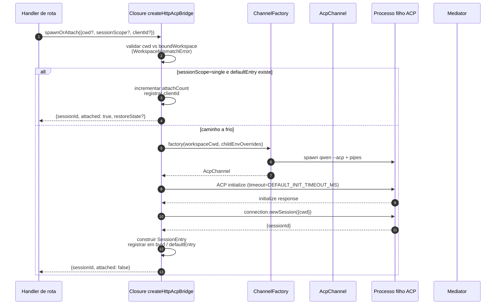
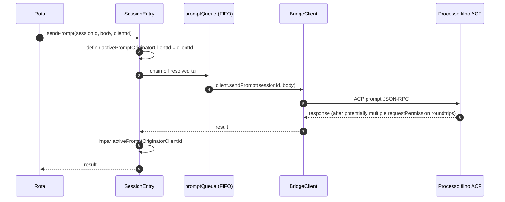
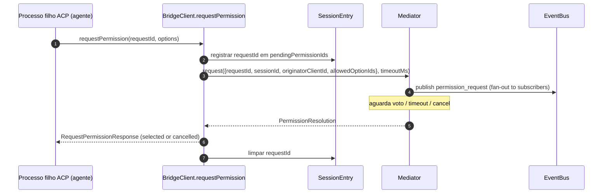
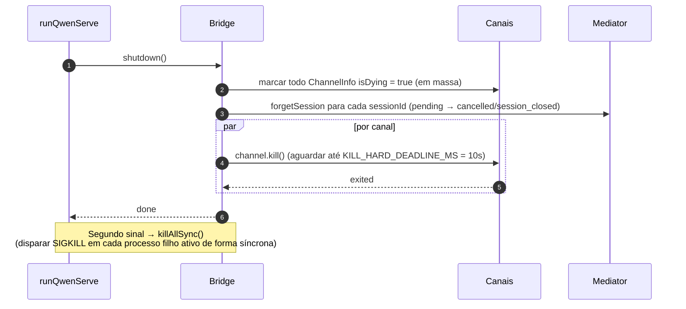

# ACP Bridge

## Visão geral

`packages/acp-bridge/` é responsável pela fronteira entre a camada HTTP do daemon e o processo filho ACP. É consumido por `packages/cli/src/serve/` (o daemon `qwen serve`) e foi extraído no passo 3 do #4175 F1 para que futuros consumidores (`channels/base/AcpBridge.ts`, o companion de IDE do VS Code) possam usar o mesmo núcleo da bridge sem acessar diretamente o pacote CLI.

A bridge fornece uma instância de `HttpAcpBridge`, um `AcpChannel` para o processo filho ACP, sessões multiplexadas nesse canal, `EventBus`es por sessão, um `MultiClientPermissionMediator`, um adaptador `BridgeFileSystem` e auxiliares orientados a ACP (`spawnOrAttach`, `loadSession`, `resumeSession`, `sendPrompt`, `cancelSession`, `respondToPermission`, além de RPCs extMethod para status do workspace e reinício do MCP).

## Responsabilidades

- Iniciar ou anexar ao processo filho ACP por meio de um `ChannelFactory` plugável. Fábrica padrão: `defaultSpawnChannelFactory` (subprocesso `qwen --acp`). Testes injetam `inMemoryChannel`.
- Manter `aliveChannels` (registro de canais) e `byId` (registro de sessões).
- Multiplexar N sessões do lado HTTP em um único processo filho ACP via `connection.newSession()`.
- Serializar prompts por sessão através de `promptQueue` (o ACP impõe um prompt ativo por sessão).
- FIFO por sessão para chamadas de `setSessionModel`, garantindo que anexações concorrentes com modelos diferentes não gerem race conditions no agente.
- `EventBus` por sessão que aciona `GET /session/:id/events` (ver [`10-event-bus.md`](./10-event-bus.md)).
- Fluxo de permissão: `BridgeClient.requestPermission` → `MultiClientPermissionMediator.request` → fan-out → coleta de votos → resposta ACP (ver [`04-permission-mediation.md`](./04-permission-mediation.md)).
- E/S de arquivos: adaptador `BridgeFileSystem` para chamadas ACP `readTextFile` / `writeTextFile` (ver [`07-workspace-filesystem.md`](./07-workspace-filesystem.md)).
- RPCs extMethod para status em nível de workspace (`/workspace/mcp`, `/workspace/skills`, `/workspace/providers`) e reinício do MCP.
- Ciclo de vida: `shutdown()` gracioso com `KILL_HARD_DEADLINE_MS` (10s) por canal; `killAllSync()` síncrono para forçar saída no segundo sinal.

## Arquitetura

**Ponto de entrada público**: `createHttpAcpBridge(opts: BridgeOptions): HttpAcpBridge` em `packages/acp-bridge/src/bridge.ts`.

**Tipos principais**:

| Type                            | File                    | Role                                                                                                                                                                                                                  |
| ------------------------------- | ----------------------- | --------------------------------------------------------------------------------------------------------------------------------------------------------------------------------------------------------------------- |
| `HttpAcpBridge`                 | `bridgeTypes.ts`        | Interface pública: `spawnOrAttach`, `loadSession`, `resumeSession`, `sendPrompt`, `cancelSession`, `subscribeEvents`, `respondToPermission`, `getWorkspaceMcpStatus`, `restartMcpServer`, `shutdown`, `killAllSync`, … |
| `BridgeSession`                 | `bridgeTypes.ts`        | `{ sessionId, workspaceCwd, attached, clientId?, createdAt? }` retornado para os handlers HTTP.                                                                                                                       |
| `BridgeOptions`                 | `bridgeOptions.ts`      | Configuração em tempo de construção (ver [Configuração](#configuração)).                                                                                                                                              |
| `AcpChannel`                    | `channel.ts`            | `{ stream, kill(), killSync(), exited }` — um canal ACP NDJSON.                                                                                                                                                       |
| `ChannelFactory`                | `channel.ts`            | `(workspaceCwd, childEnvOverrides?) => Promise<AcpChannel>`.                                                                                                                                                          |
| `BridgeClient`                  | `bridgeClient.ts`       | Encapsula uma `ClientSideConnection` do ACP; implementa o `Client` do ACP (`requestPermission`, `readTextFile`, `writeTextFile`, `sessionUpdate`, `extNotification`).                                                 |
| `EventBus`                      | `eventBus.ts`           | Pub/sub em memória por sessão. Ver [`10-event-bus.md`](./10-event-bus.md).                                                                                                                                            |
| `MultiClientPermissionMediator` | `permissionMediator.ts` | Mediador de quatro políticas. Ver [`04-permission-mediation.md`](./04-permission-mediation.md).                                                                                                                       |

**Estado interno (fechado por `createHttpAcpBridge`)**:

| State           | Shape                           | Purpose                                                                                                                                                                                                                                                                                                                                                                                                  |
| --------------- | ------------------------------- | -------------------------------------------------------------------------------------------------------------------------------------------------------------------------------------------------------------------------------------------------------------------------------------------------------------------------------------------------------------------------------------------------------- |
| `aliveChannels` | `Map<string, ChannelInfo>`      | Registro de canais com chave pelo id do canal. Cada `ChannelInfo` contém `channel`, `connection`, `client` (um `BridgeClient` por canal), `sessionIds: Set<string>`, `pendingRestoreIds`, `statusClosedReject?`, `isDying: boolean`.                                                                                                                                                                      |
| `byId`          | `Map<string, SessionEntry>`     | Registro de sessões com chave pelo sessionId. Cada `SessionEntry` contém `channel`, `connection`, `events: EventBus`, `promptQueue: Promise<void>`, `modelChangeQueue: Promise<void>`, `pendingPermissionIds: Set<string>`, `clientIds: Map<string, count>`, `activePromptOriginatorClientId?`, `attachCount`, `spawnOwnerWantedKill`, `restoreState?`, `sessionLastSeenAt?`, `clientLastSeenAt: Map<string, ms>`. |
| `defaultEntry`  | `SessionEntry \| null`          | A sessão "única" usada quando `sessionScope: 'single'`.                                                                                                                                                                                                                                                                                                                                                  |
| `defaultPolicy` | `PermissionPolicy`              | Configurado via `BridgeOptions.permissionPolicy`.                                                                                                                                                                                                                                                                                                                                                        |
| `mediator`      | `MultiClientPermissionMediator` | Um por instância da bridge.                                                                                                                                                                                                                                                                                                                                                                              |
| Constants       | —                               | `DEFAULT_INIT_TIMEOUT_MS = 10_000`, `MCP_RESTART_TIMEOUT_MS = 300_000`, `DEFAULT_MAX_SESSIONS = 20`, `MAX_EVENT_RING_SIZE = 1_000_000`, `DEFAULT_PERMISSION_TIMEOUT_MS = 5min`, `DEFAULT_MAX_PENDING_PER_SESSION = 64`.                                                                                                                                                                                  |

**Invariante `isDying`**: qualquer caminho de teardown deve definir `ChannelInfo.isDying = true` de forma síncrona **antes** de aguardar `channel.kill()`. `ensureChannel` trata um canal moribundo como ausente e cria (spawn) um novo. Sem essa flag, um `spawnOrAttach` concorrente chegando durante a janela de graça do SIGTERM (até 10s) se anexaria a um transporte prestes a fechar e o sessionId do chamador retornaria 404 em todas as requisições subsequentes. **Locais de definição** (devem ser mantidos sincronizados): `ensureChannel` (falha de inicialização + re-verificação de shutdown tardio), `doSpawn` (falha de newSession em canal vazio), `killSession` (última sessão saindo), `shutdown` (em massa).

**Invariante de retenção de `channelInfo`**: **não** limpe `channelInfo` ao definir `isDying = true`. `killAllSync` ainda deve encontrar o canal durante a janela de graça do SIGTERM para disparar SIGKILL em `process.exit(1)`. `aliveChannels` mantém a entrada moribunda até que `channel.exited` seja disparado.

**Buffering limitado do BridgeClient**: Frames ACP `extNotification` chegando em `BridgeClient` para um sessionId ainda não presente em `byId` (porque a resposta de `connection.newSession` ainda não retornou, mas a descoberta do MCP dentro de `newSession` já disparou eventos de budget) são armazenados em buffer em uma fila de eventos iniciais limitada por `MAX_EARLY_EVENT_SESSIONS = 64` × `MAX_EARLY_EVENTS_PER_SESSION = 32` × `EARLY_EVENT_TTL_MS = 60_000`. O pior caso é aproximadamente 400 KB de heap. Sem o buffering, o primeiro slot do anel de replay SSE para uma nova sessão perderia os eventos disparados durante sua criação.

## Fluxo de trabalho

### `spawnOrAttach` (ponto de entrada principal)

Pontos principais:

- `sessionScope='single'` com um `defaultEntry` existente apenas incrementa
  `attachCount`, registra `clientId` e retorna `attached: true`.
- O caminho a frio executa o ChannelFactory, realiza o `initialize`
  do ACP (`DEFAULT_INIT_TIMEOUT_MS=10s`), chama `connection.newSession({cwd})` e
  então registra o novo `SessionEntry`.
- `SessionLimitExceededError` é lançado quando `byId.size >= maxSessions`.
- `InvalidClientIdError` é lançado se `X-Qwen-Client-Id` estiver fora de
  `[A-Za-z0-9._:-]{1,128}`.
- O reaper de desconexão em `server.ts` rastreia o proprietário do spawn via
  `attachCount`/`spawnOwnerWantedKill` para evitar derrubar uma sessão cujo
  proprietário do spawn desconectou, mas outros clientes já se anexaram (revisar #3889
  BQ9tV).

### Serialização de prompts

Falhas na cauda da fila são **ignoradas** para que a rejeição de um prompt anterior não envenene os prompts subsequentes; o chamador original ainda recebe a rejeição em sua própria promise retornada. O `transportClosedReject` armazenado em cache na sessão coloca a promise do prompt em corrida (race) contra `channel.exited`, de modo que um processo filho travado seja reportado imediatamente em vez de ficar pendurado.

### Fluxo de permissão (alto nível)

`InvalidPermissionOptionError` é lançado pré-mediador quando um voto na rede tenta injetar `CANCEL_VOTE_SENTINEL` através do campo normal `optionId` — o sentinel é a única válvula de escape da bridge para interromper uma requisição como `cancelled / agent_cancelled` e não deve ser acessível acidentalmente pela rede. Ver [`04-permission-mediation.md`](./04-permission-mediation.md).

### Shutdown

## Channel factory

`AcpChannel` (`channel.ts`) é a abstração de transporte da bridge. A produção usa `defaultSpawnChannelFactory` em `spawnChannel.ts`, que executa `qwen --acp` como um subprocesso com um par de pipes stdio. Testes injetam `inMemoryChannel` para executar o agente no mesmo processo. A bridge não sabe nada sobre o mecanismo subjacente — ela só precisa de `{ stream, kill, killSync, exited }`.

`ChannelFactory` aceita `childEnvOverrides` para que cada handle do daemon possa passar suas próprias variáveis de ambiente de budget do MCP (`QWEN_SERVE_MCP_CLIENT_BUDGET`, `QWEN_SERVE_MCP_BUDGET_MODE`) sem mutar `process.env` (o que causaria race conditions quando dois daemons embarcados rodam no mesmo processo Node).

## Estado e ciclo de vida

- A construção da bridge é síncrona; o primeiro `spawnOrAttach` inicializa a frio o processo filho ACP.
- `defaultEntry` vive durante todo o ciclo de vida da bridge sob `sessionScope: 'single'`; o canal é recolhido (reaped) quando `sessionIds.size === 0` (após `killSession`) E `isDying` vira true.
- `MAX_EVENT_RING_SIZE = 1_000_000` é um limite superior flexível para `BridgeOptions.eventRingSize` para capturar erros de digitação do operador antes de OOMs de ~500 MB por sessão.
- `DEFAULT_PERMISSION_TIMEOUT_MS = 5 * 60 * 1000` impede que uma requisição de permissão travada bloqueie o `promptQueue` por sessão para sempre.
- `DEFAULT_MAX_PENDING_PER_SESSION = 64` espelha `DEFAULT_MAX_SUBSCRIBERS`; chamadas excessivas de `requestPermission` são resolvidas como canceladas com um aviso no stderr.

## Dependências

| Upstream                                                                                     | Downstream                                     |
| -------------------------------------------------------------------------------------------- | ---------------------------------------------- |
| `@agentclientprotocol/sdk` — `ClientSideConnection`, `PROTOCOL_VERSION`, tipos ACP           | `packages/cli/src/serve/` (o daemon)           |
| `@qwen-code/qwen-code-core` — `ApprovalMode`, `TrustGateError`, `getCurrentGeminiMdFilename` | `packages/channels/base/` (planejado, F4)      |
| `node:crypto`, `node:fs`, `node:path`                                                        | `packages/vscode-ide-companion/` (planejado, F4) |

## Configuração

`BridgeOptions` (`bridgeOptions.ts`):

| Key                                           | Default                                            | Purpose                                                                                                               |
| --------------------------------------------- | -------------------------------------------------- | --------------------------------------------------------------------------------------------------------------------- |
| `boundWorkspace`                              | (obrigatório)                                      | Caminho canônico do workspace que a bridge impõe.                                                                     |
| `sessionScope`                                | `'single'`                                         | `'single'` compartilha uma sessão entre todos os clientes; `'thread'` cria uma sessão separada para cada thread de conversa. |
| `channelFactory`                              | `defaultSpawnChannelFactory`                       | Fábrica plugável do processo filho ACP.                                                                               |
| `initializeTimeoutMs`                         | `DEFAULT_INIT_TIMEOUT_MS = 10_000`                 | Timeout do handshake `initialize` do ACP.                                                                             |
| `maxSessions`                                 | `DEFAULT_MAX_SESSIONS = 20`                        | Limite para `byId.size`. `0` / `Infinity` = ilimitado; NaN/negativo lança erro.                                       |
| `eventRingSize`                               | `DEFAULT_RING_SIZE` (de `eventBus.ts`)             | Anel de eventos por sessão; limite flexível em `MAX_EVENT_RING_SIZE`.                                                 |
| `permissionResponseTimeoutMs`                 | `DEFAULT_PERMISSION_TIMEOUT_MS = 5 min`            | Tempo de relógio (wallclock) por requisição para o mediador.                                                          |
| `maxPendingPermissionsPerSession`             | `DEFAULT_MAX_PENDING_PER_SESSION = 64`             | Backpressure para agentes de alto volume.                                                                             |
| `childEnvOverrides`                           | `{}`                                               | Adições / limpezas de variáveis de ambiente por handle para o processo filho ACP.                                     |
| `persistApprovalMode`, `persistDisabledTools` | —                                                  | Hooks de escrita de configurações para as rotas de mutação da Wave 4.                                                 |
| `contextFilename`                             | de `context.fileName` em `settings.json`           | Sobrescreve `getCurrentGeminiMdFilename`.                                                                             |
| `statusProvider`                              | (nenhum)                                           | Células de pré-voo do host do daemon (`DaemonStatusProvider`).                                                        |
| `fileSystem`                                  | (nenhum)                                           | Adaptador `BridgeFileSystem` para `readTextFile` / `writeTextFile` do ACP.                                            |
| `permissionPolicy`                            | de `policy.permissionStrategy` em `settings.json`  | Um entre `first-responder` / `designated` / `consensus` / `local-only`.                                               |
| `permissionConsensusQuorum`                   | de `settings.json`                                 | N para a política de consenso.                                                                                        |
| `permissionAudit`                             | `createNoOpPermissionAuditPublisher()`             | Conecta ao `PermissionAuditRing` para a trilha de auditoria.                                                          |
| `channelIdleTimeoutMs`                        | `0`                                                | Mantém o processo filho ACP vivo por esta quantidade de milissegundos após o fechamento da última sessão.             |
## Métodos adicionais da bridge

Além das chamadas principais `spawnOrAttach`, `sendPrompt`, `cancelSession`,
`respondToPermission`, `loadSession` e `resumeSession`, a interface
`HttpAcpBridge` agora inclui estes auxiliares voltados para o daemon:

| Método                                                       | Propósito                                       |
| ------------------------------------------------------------ | --------------------------------------------- |
| `generateSessionRecap(sessionId, context?)`                  | Gera um resumo de uma linha da sessão.            |
| `generateSessionBtw(sessionId, question, signal?, context?)` | Responde a uma pergunta secundária ou prompt "btw".          |
| `executeShellCommand(sessionId, command, signal?, context?)` | Executa um comando shell no host do daemon.       |
| `getSessionContextUsageStatus(sessionId, opts?)`             | Retorna o uso da janela de contexto.                  |
| `getSessionSupportedCommandsStatus(sessionId)`               | Retorna os comandos slash disponíveis.              |
| `getSessionTasksStatus(sessionId)`                           | Retorna um snapshot das tarefas em segundo plano.            |
| `getSessionStatsStatus(sessionId)`                           | Retorna as estatísticas de uso da sessão.              |
| `setSessionApprovalMode(sessionId, mode, opts, context?)`    | Atualiza o modo de aprovação para uma sessão.           |
| `detachClient(sessionId, clientId?)`                         | Desanexa explicitamente um cliente.                   |
| `addRuntimeMcpServer(name, config, originatorClientId)`      | Adiciona um servidor MCP em tempo de execução.                 |
| `removeRuntimeMcpServer(name, originatorClientId)`           | Remove um servidor MCP em tempo de execução.              |
| `manageMcpServer(serverName, action, originatorClientId)`    | Habilita / desabilita / autentica / limpa autenticação. |
| `generateWorkspaceAgent(description, originatorClientId)`    | Gera uma definição de subagente com IA.       |
| `preheat()`                                                  | Aquece o processo filho ACP antes da primeira sessão.  |
| `getSessionLastEventId(sessionId)`                           | Lê o ID de evento monótono da sessão.        |
| `getWorkspaceToolsStatus()`                                  | Retorna o snapshot do registro de ferramentas integradas.   |
| `getWorkspaceMcpToolsStatus(serverName)`                     | Retorna as ferramentas de um servidor MCP específico.       |

`BridgeSpawnRequest.sessionScope` foi renomeado de `'per-client'` para
`'thread'`. `BridgeRestoredSession` agora carrega `compactedReplay`,
`liveJournal` e `lastEventId`. `BridgeClientRequestContext` é o contexto de
requisição propagado através das chamadas da bridge; ele carrega `clientId`,
`fromLoopback: boolean` e `promptId`.

## Ressalvas e Limitações Conhecidas

- `MCP_RESTART_TIMEOUT_MS = 300_000` (5 min) — o tempo limite da bridge para `/workspace/mcp/:server/restart` é intencionalmente grande porque `McpClientManager.MAX_DISCOVERY_TIMEOUT_MS` pode ser de até 5 min para servidores stdio. Um prazo mais curto geraria tempos limite falsos enquanto o processo filho ACP continuasse reconectando em segundo plano.
- `BridgeOptions.eventRingSize > 1_000_000` lança uma exceção na construção.
- `connection.unstable_resumeSession` é exposto através da capacidade estável `session_resume` do daemon; `unstable_session_resume` continua sendo anunciado como um alias de compatibilidade obsoleto para SDKs mais antigos. Os clientes devem detectar a feature `session_resume`.
- O pacote da bridge é `@qwen-code/acp-bridge`. O código atual importa primitivas de event-bus e status diretamente dos subcaminhos do pacote; `serve/acp-session-bridge.ts` permanece como a fachada de compatibilidade local da CLI para a superfície mais ampla da bridge.

## Referências

- `packages/acp-bridge/src/bridge.ts` (especialmente `createHttpAcpBridge` na linha 350+)
- `packages/acp-bridge/src/bridgeClient.ts`
- `packages/acp-bridge/src/bridgeTypes.ts`
- `packages/acp-bridge/src/bridgeOptions.ts`
- `packages/acp-bridge/src/channel.ts`
- `packages/acp-bridge/src/spawnChannel.ts`
- `packages/acp-bridge/src/bridgeErrors.ts`
- Issues: [#3803](https://github.com/QwenLM/qwen-code/issues/3803), [#4175](https://github.com/QwenLM/qwen-code/issues/4175).