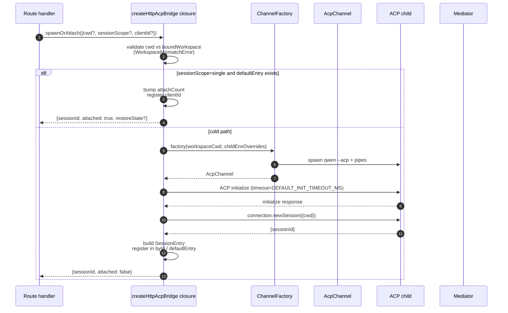
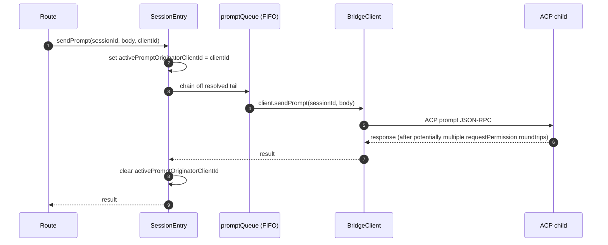
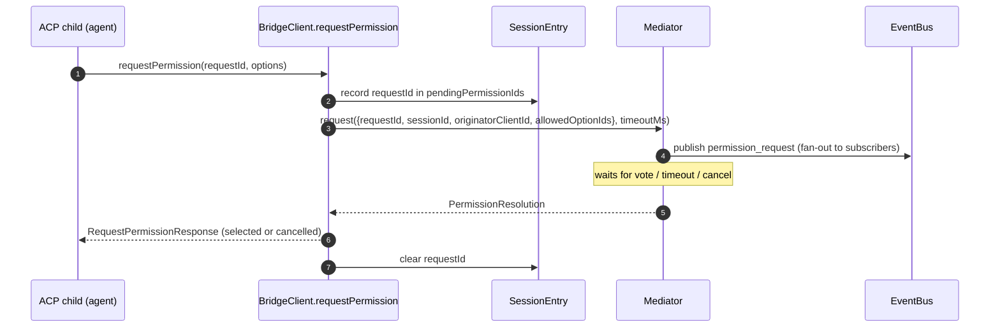
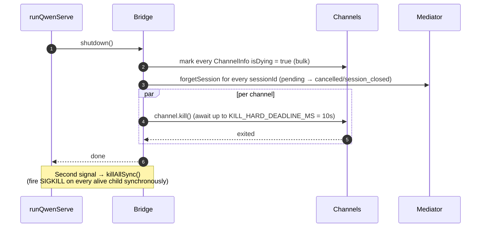

# Ponte ACP

## Visão Geral

O diretório `packages/acp-bridge/` gerencia a fronteira entre a camada HTTP do daemon e o processo filho ACP. Ele é consumido por `packages/cli/src/serve/` (o daemon `qwen serve`) e foi extraído na etapa 3 do F1 da issue #4175, para que consumidores futuros (`channels/base/AcpBridge.ts`, o complemento do VS Code IDE) possam usar o mesmo núcleo da ponte sem acessar o pacote CLI.

A ponte fornece uma instância `HttpAcpBridge`, um `AcpChannel` para o filho ACP, sessões multiplexadas sobre esse canal, `EventBus`s por sessão, um `MultiClientPermissionMediator`, um adaptador `BridgeFileSystem` e auxiliares orientados a ACP (`spawnOrAttach`, `loadSession`, `resumeSession`, `sendPrompt`, `cancelSession`, `respondToPermission`, além de RPCs extMethod para status do workspace e reinicialização do MCP).

## Responsabilidades

- Iniciar ou anexar ao filho ACP por meio de uma `ChannelFactory` plugável. Factory padrão: `defaultSpawnChannelFactory` (subprocesso `qwen --acp`). Testes injetam `inMemoryChannel`.
- Manter `aliveChannels` (registro de canais) e `byId` (registro de sessões).
- Multiplexar N sessões do lado HTTP em um único filho ACP via `connection.newSession()`.
- Serializar prompts por sessão através de `promptQueue` (ACP impõe um prompt ativo por sessão).
- FIFO por sessão para chamadas `setSessionModel`, de modo que anexações simultâneas com modelos diferentes não causem condição de corrida no agente.
- `EventBus` por sessão que alimenta `GET /session/:id/events` (veja [`10-event-bus.md`](./10-event-bus.md)).
- Fluxo de permissão: `BridgeClient.requestPermission` → `MultiClientPermissionMediator.request` → fan-out → coleta de votos → resposta ACP (veja [`04-permission-mediation.md`](./04-permission-mediation.md)).
- E/S de arquivos: adaptador `BridgeFileSystem` para chamadas ACP `readTextFile` / `writeTextFile` (veja [`07-workspace-filesystem.md`](./07-workspace-filesystem.md)).
- RPCs extMethod para status do workspace (`/workspace/mcp`, `/workspace/skills`, `/workspace/providers`) e reinicialização do MCP.
- Ciclo de vida: `shutdown()` graciosa com `KILL_HARD_DEADLINE_MS` (10s) por canal; `killAllSync()` síncrona para saída forçada no segundo sinal.

## Arquitetura

**Entrada pública**: `createHttpAcpBridge(opts: BridgeOptions): HttpAcpBridge` em `packages/acp-bridge/src/bridge.ts`.

**Tipos principais**:

| Tipo                            | Arquivo                  | Função                                                                                                                                                                                                                     |
| ------------------------------- | ------------------------ | --------------------------------------------------------------------------------------------------------------------------------------------------------------------------------------------------------------------------- |
| `HttpAcpBridge`                 | `bridgeTypes.ts`         | Interface pública: `spawnOrAttach`, `loadSession`, `resumeSession`, `sendPrompt`, `cancelSession`, `subscribeEvents`, `respondToPermission`, `getWorkspaceMcpStatus`, `restartMcpServer`, `shutdown`, `killAllSync`, … |
| `BridgeSession`                 | `bridgeTypes.ts`         | `{ sessionId, workspaceCwd, attached, clientId?, createdAt? }` retornado para os handlers HTTP.                                                                                                                          |
| `BridgeOptions`                 | `bridgeOptions.ts`       | Configuração no momento da construção (veja [Configuração](#configuration)).                                                                                                                                               |
| `AcpChannel`                    | `channel.ts`             | `{ stream, kill(), killSync(), exited }` — um canal ACP NDJSON.                                                                                                                                                            |
| `ChannelFactory`                | `channel.ts`             | `(workspaceCwd, childEnvOverrides?) => Promise<AcpChannel>`.                                                                                                                                                               |
| `BridgeClient`                  | `bridgeClient.ts`        | Encapsula uma `ClientSideConnection` do ACP; implementa o `Client` do ACP (`requestPermission`, `readTextFile`, `writeTextFile`, `sessionUpdate`, `extNotification`).                                                        |
| `EventBus`                      | `eventBus.ts`            | Pub/sub em memória por sessão. Veja [`10-event-bus.md`](./10-event-bus.md).                                                                                                                                                |
| `MultiClientPermissionMediator` | `permissionMediator.ts`  | Mediator de quatro políticas. Veja [`04-permission-mediation.md`](./04-permission-mediation.md).                                                                                                                            |

**Estado interno (fechado por `createHttpAcpBridge`)**:

| Estado           | Forma                           | Propósito                                                                                                                                                                                                                                                                                                                                                                                               |
| ---------------- | ------------------------------- | -------------------------------------------------------------------------------------------------------------------------------------------------------------------------------------------------------------------------------------------------------------------------------------------------------------------------------------------------------------------------------------------------------- |
| `aliveChannels`  | `Map<string, ChannelInfo>`      | Registro de canais indexado por id do canal. Cada `ChannelInfo` contém `channel`, `connection`, `client` (um `BridgeClient` por canal), `sessionIds: Set<string>`, `pendingRestoreIds`, `statusClosedReject?`, `isDying: boolean`.                                                                                                                                                                     |
| `byId`           | `Map<string, SessionEntry>`     | Registro de sessões indexado por sessionId. Cada `SessionEntry` contém `channel`, `connection`, `events: EventBus`, `promptQueue: Promise<void>`, `modelChangeQueue: Promise<void>`, `pendingPermissionIds: Set<string>`, `clientIds: Map<string, count>`, `activePromptOriginatorClientId?`, `attachCount`, `spawnOwnerWantedKill`, `restoreState?`, `sessionLastSeenAt?`, `clientLastSeenAt: Map<string, ms>`. |
| `defaultEntry`   | `SessionEntry \| null`          | A sessão "única" usada quando `sessionScope: 'single'`.                                                                                                                                                                                                                                                                                                                                                  |
| `defaultPolicy`  | `PermissionPolicy`              | Configurado via `BridgeOptions.permissionPolicy`.                                                                                                                                                                                                                                                                                                                                                        |
| `mediator`       | `MultiClientPermissionMediator` | Um por instância da ponte.                                                                                                                                                                                                                                                                                                                                                                               |
| Constantes       | —                               | `DEFAULT_INIT_TIMEOUT_MS = 10_000`, `MCP_RESTART_TIMEOUT_MS = 300_000`, `DEFAULT_MAX_SESSIONS = 20`, `MAX_EVENT_RING_SIZE = 1_000_000`, `DEFAULT_PERMISSION_TIMEOUT_MS = 5min`, `DEFAULT_MAX_PENDING_PER_SESSION = 64`.                                                                                                                  |

**Invariante `isDying`**: qualquer caminho de desmontagem deve definir `ChannelInfo.isDying = true` de forma síncrona **antes** de aguardar `channel.kill()`. `ensureChannel` trata um canal moribundo como ausente e cria um novo. Sem essa flag, uma `spawnOrAttach` concorrente chegando durante a janela de graça do SIGTERM (até 10s) se anexaria a um transporte prestes a fechar, e o sessionId do chamador retornaria 404 em toda requisição subsequente. **Locais de definição** (devem permanecer sincronizados): `ensureChannel` (falha na inicialização + nova verificação de desligamento tardio), `doSpawn` (falha de newSession em canal vazio), `killSession` (última sessão saindo), `shutdown` (em lote).

**Invariante de retenção de `channelInfo`**: **não** limpe `channelInfo` ao definir `isDying = true`. `killAllSync` ainda precisa encontrar o canal durante a janela de graça do SIGTERM para disparar SIGKILL em `process.exit(1)`. `aliveChannels` mantém a entrada moribunda até que `channel.exited` seja disparado.

**Buffer limitado do BridgeClient**: quadros `extNotification` do ACP que chegam no `BridgeClient` para um sessionId ainda não presente em `byId` (porque a resposta de `connection.newSession` ainda não retornou, mas a descoberta MCP dentro de `newSession` já disparou eventos de orçamento) são armazenados em buffer em uma fila de eventos iniciais limitada por `MAX_EARLY_EVENT_SESSIONS = 64` × `MAX_EARLY_EVENTS_PER_SESSION = 32` × `EARLY_EVENT_TTL_MS = 60_000`. O pior caso é aproximadamente 400 KB de heap. Sem buffer, o primeiro slot do anel de replay SSE para uma nova sessão perderia eventos que ocorreram durante sua criação.

## Fluxo de trabalho

### `spawnOrAttach` (ponto de entrada principal)

Pontos principais:

- `sessionScope='single'` com um `defaultEntry` existente apenas incrementa `attachCount`, registra `clientId` e retorna `attached: true`.
- O caminho frio executa a ChannelFactory, realiza o `initialize` do ACP (`DEFAULT_INIT_TIMEOUT_MS=10s`), chama `connection.newSession({cwd})` e então registra a nova `SessionEntry`.
- `SessionLimitExceededError` é lançado quando `byId.size >= maxSessions`.
- `InvalidClientIdError` é lançado se `X-Qwen-Client-Id` estiver fora de `[A-Za-z0-9._:-]{1,128}`.
- O coletor de desconexão em `server.ts` rastreia o proprietário da criação via `attachCount`/`spawnOwnerWantedKill` para evitar derrubar uma sessão cujo proprietário se desconectou, mas outros clientes já se anexaram (revisão #3889 BQ9tV).

### Serialização de prompts

Falhas na cauda da fila são **engolidas** para que a rejeição de um prompt anterior não contamine prompts subsequentes; o chamador original ainda recebe a rejeição em sua própria promise retornada. O `transportClosedReject` armazenado em cache na sessão faz a promise do prompt competir com `channel.exited`, de modo que um filho travado apareça imediatamente em vez de pendurar.

### Fluxo de permissão (alto nível)

`InvalidPermissionOptionError` é lançado antes do mediator quando um voto vindo da rede tenta injetar `CANCEL_VOTE_SENTINEL` pelo campo normal `optionId` — o sentinela é a única escotilha de escape da ponte para abortar uma requisição como `cancelled / agent_cancelled` e não deve ser acessível acidentalmente pela rede. Veja [`04-permission-mediation.md`](./04-permission-mediation.md).

### Desligamento

## Fábrica de canais

`AcpChannel` (`channel.ts`) é a abstração de transporte da ponte. Em produção, usa `defaultSpawnChannelFactory` em `spawnChannel.ts`, que executa `qwen --acp` como um subprocesso com um par de pipes stdio. Testes injetam `inMemoryChannel` para executar o agente em processo. A ponte não sabe nada sobre o mecanismo subjacente — ela só precisa de `{ stream, kill, killSync, exited }`.

`ChannelFactory` aceita `childEnvOverrides` para que cada handle do daemon possa passar suas próprias variáveis de ambiente de orçamento MCP (`QWEN_SERVE_MCP_CLIENT_BUDGET`, `QWEN_SERVE_MCP_BUDGET_MODE`) sem modificar `process.env` (o que causaria condição de corrida quando dois daemons incorporados rodam no mesmo processo Node).

## Estado e Ciclo de Vida

- A construção da ponte é síncrona; a primeira `spawnOrAttach` inicia o filho ACP a frio.
- `defaultEntry` vive durante toda a vida da ponte em `sessionScope: 'single'`; o canal é limpo quando `sessionIds.size === 0` (após `killSession`) E `isDying` se torna true.
- `MAX_EVENT_RING_SIZE = 1_000_000` é um limite superior suave para `BridgeOptions.eventRingSize` para capturar erros de digitação do operador antes de OOMs de ~500 MB por sessão.
- `DEFAULT_PERMISSION_TIMEOUT_MS = 5 * 60 * 1000` impede que uma requisição de permissão travada bloqueie a `promptQueue` da sessão para sempre.
- `DEFAULT_MAX_PENDING_PER_SESSION = 64` espelha `DEFAULT_MAX_SUBSCRIBERS`; chamadas `requestPermission` em excesso são resolvidas como canceladas com um aviso no stderr.

## Dependências

| Upstream                                                                                    | Downstream                                        |
| ------------------------------------------------------------------------------------------- | ------------------------------------------------- |
| `@agentclientprotocol/sdk` — `ClientSideConnection`, `PROTOCOL_VERSION`, tipos ACP           | `packages/cli/src/serve/` (o daemon)              |
| `@qwen-code/qwen-code-core` — `ApprovalMode`, `TrustGateError`, `getCurrentGeminiMdFilename` | `packages/channels/base/` (planejado, F4)         |
| `node:crypto`, `node:fs`, `node:path`                                                        | `packages/vscode-ide-companion/` (planejado, F4)  |

## Configuração

`BridgeOptions` (`bridgeOptions.ts`):

| Chave                                          | Padrão                                              | Propósito                                                                                                                |
| ---------------------------------------------- | --------------------------------------------------- | ------------------------------------------------------------------------------------------------------------------------ |
| `boundWorkspace`                               | (obrigatório)                                       | Caminho canônico do workspace que a ponte impõe.                                                                         |
| `sessionScope`                                 | `'single'`                                          | `'single'` compartilha uma sessão entre todos os clientes; `'thread'` cria uma sessão separada para cada thread de conversa. |
| `channelFactory`                               | `defaultSpawnChannelFactory`                        | Fábrica plugável do filho ACP.                                                                                           |
| `initializeTimeoutMs`                          | `DEFAULT_INIT_TIMEOUT_MS = 10_000`                  | Timeout do handshake `initialize` do ACP.                                                                                |
| `maxSessions`                                  | `DEFAULT_MAX_SESSIONS = 20`                         | Limite para `byId.size`. `0` / `Infinity` = ilimitado; NaN/negativo lança exceção.                                       |
| `eventRingSize`                                | `DEFAULT_RING_SIZE` (de `eventBus.ts`)              | Anel de eventos por sessão; limite superior suave em `MAX_EVENT_RING_SIZE`.                                              |
| `permissionResponseTimeoutMs`                  | `DEFAULT_PERMISSION_TIMEOUT_MS = 5 min`             | Tempo máximo de parede para o mediator por requisição.                                                                   |
| `maxPendingPermissionsPerSession`              | `DEFAULT_MAX_PENDING_PER_SESSION = 64`              | Contrapressão para agentes de alto volume.                                                                               |
| `childEnvOverrides`                            | `{}`                                                | Adições/remoções de env por handle para o filho ACP.                                                                    |
| `persistApprovalMode`, `persistDisabledTools`  | —                                                   | Hooks de escrita de configurações para as rotas de mutação da Wave 4.                                                    |
| `contextFilename`                              | de `settings.json`'s `context.fileName`             | Sobrescreve `getCurrentGeminiMdFilename`.                                                                                |
| `statusProvider`                               | (nenhum)                                            | Células de pré-verificação do daemon host (`DaemonStatusProvider`).                                                      |
| `fileSystem`                                   | (nenhum)                                            | Adaptador `BridgeFileSystem` para chamadas ACP `readTextFile` / `writeTextFile`.                                         |
| `permissionPolicy`                             | de `settings.json`'s `policy.permissionStrategy`    | Um de `first-responder` / `designated` / `consensus` / `local-only`.                                                    |
| `permissionConsensusQuorum`                    | de `settings.json`                                  | N para a política de consenso.                                                                                           |
| `permissionAudit`                              | `createNoOpPermissionAuditPublisher()`              | Conexão com `PermissionAuditRing` para a trilha de auditoria.                                                            |
| `channelIdleTimeoutMs`                         | `0`                                                 | Mantém o filho ACP vivo por esse número de milissegundos após o fechamento da última sessão.                             |
## Métodos adicionais do bridge

Além das chamadas principais `spawnOrAttach`, `sendPrompt`, `cancelSession`, `respondToPermission`, `loadSession` e `resumeSession`, a interface `HttpAcpBridge` agora inclui os seguintes auxiliares voltados para o daemon:

| Método                                                       | Propósito                                       |
| ------------------------------------------------------------ | ----------------------------------------------- |
| `generateSessionRecap(sessionId, context?)`                  | Gera um resumo de sessão em uma linha.          |
| `generateSessionBtw(sessionId, question, signal?, context?)` | Responde a uma pergunta paralela / prompt 'btw'. |
| `executeShellCommand(sessionId, command, signal?, context?)` | Executa um comando shell no host do daemon.     |
| `getSessionContextUsageStatus(sessionId, opts?)`             | Retorna o uso da janela de contexto.            |
| `getSessionSupportedCommandsStatus(sessionId)`               | Retorna os comandos de barra (slash) disponíveis.|
| `getSessionTasksStatus(sessionId)`                           | Retorna um instantâneo das tarefas em segundo plano. |
| `getSessionStatsStatus(sessionId)`                           | Retorna estatísticas de uso da sessão.          |
| `setSessionApprovalMode(sessionId, mode, opts, context?)`    | Atualiza o modo de aprovação de uma sessão.     |
| `detachClient(sessionId, clientId?)`                         | Desanexa explicitamente um cliente.             |
| `addRuntimeMcpServer(name, config, originatorClientId)`      | Adiciona um servidor MCP em tempo de execução.  |
| `removeRuntimeMcpServer(name, originatorClientId)`           | Remove um servidor MCP em tempo de execução.    |
| `manageMcpServer(serverName, action, originatorClientId)`    | Ativar / desativar / autenticar / limpar autenticação. |
| `generateWorkspaceAgent(description, originatorClientId)`    | Gera uma definição de subagente com IA.         |
| `preheat()`                                                  | Aquece o filho ACP antes da primeira sessão.    |
| `getSessionLastEventId(sessionId)`                           | Lê o ID de evento monotônico da sessão.         |
| `getWorkspaceToolsStatus()`                                  | Retorna o instantâneo do registro de ferramentas integradas. |
| `getWorkspaceMcpToolsStatus(serverName)`                     | Retorna as ferramentas de um servidor MCP específico. |

`BridgeSpawnRequest.sessionScope` foi renomeado de `'per-client'` para `'thread'`. `BridgeRestoredSession` agora carrega `compactedReplay`, `liveJournal` e `lastEventId`. `BridgeClientRequestContext` é o contexto de requisição que percorre as chamadas do bridge; ele carrega `clientId`, `fromLoopback: boolean` e `promptId`.

## Ressalvas e Limitações Conhecidas

- `MCP_RESTART_TIMEOUT_MS = 300_000` (5 min) — o timeout do bridge para `/workspace/mcp/:server/restart` é intencionalmente grande porque `McpClientManager.MAX_DISCOVERY_TIMEOUT_MS` pode chegar a 5 min para servidores stdio. Um prazo mais curto produziria timeouts falsos enquanto o filho ACP continuasse reconectando em segundo plano.
- `BridgeOptions.eventRingSize > 1_000_000` lança uma exceção na construção.
- `connection.unstable_resumeSession` é exposto através da capacidade estável `session_resume` do daemon; `unstable_session_resume` continua sendo anunciado como um alias de compatibilidade obsoleto para SDKs antigos. Clientes devem fazer detecção de funcionalidade de `session_resume`.
- O pacote do bridge é `@qwen-code/acp-bridge` e é consumido através de shims de re-exportação em `serve/event-bus.ts`, `serve/status.ts`, `serve/httpAcpBridge.ts` para compatibilidade reversa com caminhos de importação pré-F1. Código novo deve importar diretamente.

## Referências

- `packages/acp-bridge/src/bridge.ts` (esp. `createHttpAcpBridge` na linha 350+)
- `packages/acp-bridge/src/bridgeClient.ts`
- `packages/acp-bridge/src/bridgeTypes.ts`
- `packages/acp-bridge/src/bridgeOptions.ts`
- `packages/acp-bridge/src/channel.ts`
- `packages/acp-bridge/src/spawnChannel.ts`
- `packages/acp-bridge/src/bridgeErrors.ts`
- Issues: [#3803](https://github.com/QwenLM/qwen-code/issues/3803), [#4175](https://github.com/QwenLM/qwen-code/issues/4175).