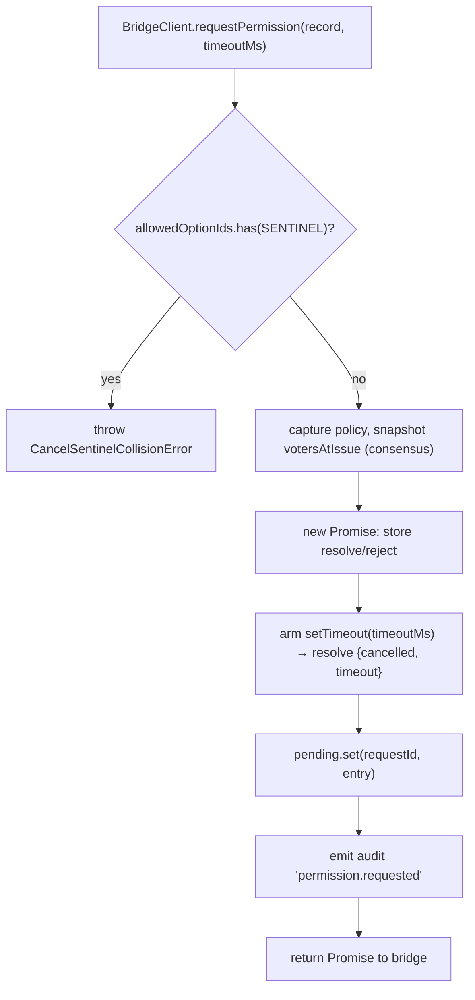
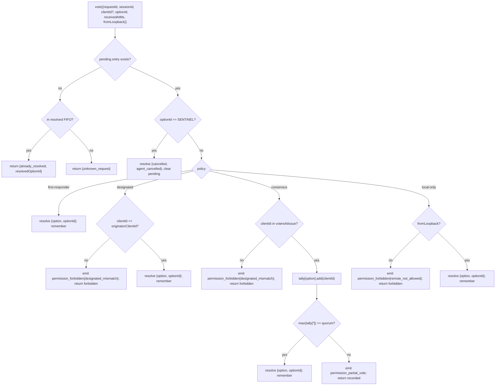

# Mediação de Permissões Multi-Cliente

## Visão Geral

Quando o agente filho do ACP chama `requestPermission`, o daemon não o encaminha simplesmente para um único cliente. Sob `sessionScope: 'single'`, todos os clientes conectados veem a requisição e qualquer um deles pode responder. Sem mediação, votos tardios não têm para onde ir, dois clientes podem competir pela mesma requisição e um único cliente malicioso pode sobrescrever o originador.

`MultiClientPermissionMediator` (`packages/acp-bridge/src/permissionMediator.ts`) implementa o contrato `PermissionMediator` (`packages/acp-bridge/src/permission.ts`) e gerencia todo o estado de permissões pendentes e resolvidas para a bridge. Ele despacha votos através de uma das quatro políticas declaradas em `PermissionPolicy`:

| Policy            | Resolution rule                                                                                                        | Use case                                                                 |
| ----------------- | ---------------------------------------------------------------------------------------------------------------------- | ------------------------------------------------------------------------ |
| `first-responder` | O primeiro voto válido vence; votantes posteriores recebem `permission_already_resolved`.                              | UX de colaboração ao vivo entre clientes (padrão).                       |
| `designated`      | Apenas o `originatorClientId` do prompt pode resolver; outros veem `permission_forbidden{designated_mismatch}`.        | SaaS por tenant onde a superfície da UI deve gerenciar suas próprias aprovações. |
| `consensus`       | Quórum N-de-M no snapshot do client-id da v1; eventos intermediários de `permission_partial_vote` permitem que as UIs renderizem o progresso. | Revisão de mudanças corporativa onde dois operadores devem concordar.    |
| `local-only`      | Recusa qualquer votante que não seja loopback; bloqueia até que um cliente loopback resolva.                           | Estações de trabalho onde o controle remoto nunca deve conceder escalação de privilégios. |

> **Limite de segurança da v1**: `X-Qwen-Client-Id` é autorrelatado. `designated` e
> `consensus` ainda não possuem prova de posse. Um cliente que observar
> `originatorClientId` pode reutilizar esse id. `{outcome:'cancelled'}` também é roteado
> através da sentinela de cancelamento antes do despacho da política, então até mesmo `local-only`
> não pode tratar o cancelamento como uma resolução protegida por política. Para um isolamento forte, vincule
> o daemon ao loopback ou coloque-o atrás de um proxy reverso autenticado. Consulte
> [Nota de segurança: a identidade do cliente na v1 é autorrelatada](#security-note-v1-client-identity-is-self-reported).

## Responsabilidades

- Rastrear cada requisição pendente (ciclo de vida `request → vote → resolved`).
- Armar e desarmar timeouts de relógio por requisição (o **invariante N1**: o timeout deve ser armado de forma síncrona dentro de `request()` para que uma sessão imediatamente cancelada não vaze um fechamento permanentemente pendente).
- Despachar votos através da política capturada no momento de `request()` (alterar a política do daemon em tempo de execução não afeta requisições em andamento).
- Manter uma FIFO limitada (`MAX_RESOLVED_PERMISSION_RECORDS = 512`) de requisições resolvidas recentemente para que votos duplicados recebam um `already_resolved` estruturado em vez de `unknown_request`.
- Emitir `permission_partial_vote` (consensus) e `permission_forbidden` (designated / consensus / local-only) no EventBus por sessão.
- Resolver requisições pendentes como `{kind: 'cancelled', reason: 'session_closed'}` via `forgetSession(sessionId)` no teardown da sessão.
- Rejeitar injeção maliciosa ou acidental de `CANCEL_VOTE_SENTINEL` através da rede (`InvalidPermissionOptionError`) e através de rótulos de opções publicados pelo agente (`CancelSentinelCollisionError`).

## Arquitetura

### Superfície pública

```ts
interface PermissionMediator {
  readonly policy: PermissionPolicy;
  request(
    record: PermissionRequestRecord,
    timeoutMs: number,
  ): Promise<PermissionResolution>;
  vote(vote: PermissionVote): PermissionVoteOutcome;
  forgetSession(sessionId: string): void;
}
```

`MultiClientPermissionMediator` adiciona: `peekSessionFor(requestId)`, `pendingCount(sessionId)`, publicador de auditoria interna, etc. `BridgeClient` depende apenas da metade `request()` (sub-tipagem estrutural — veja `bridgeClient.ts`).

### `PermissionPolicy` e `PermissionVoteOutcome`

```ts
type PermissionPolicy =
  | 'first-responder'
  | 'designated'
  | 'consensus'
  | 'local-only';

type PermissionVoteOutcome =
  | { kind: 'resolved'; resolvedOptionId: string }
  | { kind: 'recorded'; votesNeeded: number } // consensus partial
  | { kind: 'already_resolved'; resolvedOptionId: string }
  | { kind: 'forbidden'; reason: 'designated_mismatch' | 'remote_not_allowed' }
  | { kind: 'unknown_request' };

type PermissionResolution =
  | { kind: 'option'; optionId: string }
  | {
      kind: 'cancelled';
      reason: 'timeout' | 'session_closed' | 'agent_cancelled';
    };
```

### Sentinela de cancelamento

`CANCEL_VOTE_SENTINEL = '__cancelled__'`. A bridge mapeia o votante `{outcome:'cancelled'}` para esta sentinela **antes** de chamar `mediator.vote`. O mediador roteia a sentinela **antes** do despacho da política — o cancelamento do votante funciona sob qualquer política, independentemente de `clientId` / loopback / associação. Duas proteções:

1. **`bridge.ts`** rejeita votos da rede cujo `optionId === CANCEL_VOTE_SENTINEL` com `InvalidPermissionOptionError` (um cliente de rede malicioso não deve ser capaz de injetar um cancelamento mentindo sobre um `optionId`).
2. **`mediator.request`** rejeita registros cujo `allowedOptionIds` contém a sentinela com `CancelSentinelCollisionError` (um agente que publica legitimamente `'__cancelled__'` como um rótulo de opção não deve ser capaz de se passar por ela).

Esta fuga intencional entre políticas está documentada em `permissionMediator.ts` para que um mantenedor futuro não remova acidentalmente o bypass.

### Estado pendente

Cada requisição pendente é chaveada por `requestId` e carrega:

- `policy` — capturada no momento de `request()`.
- `record: PermissionRequestRecord` (requestId, sessionId, originatorClientId, allowedOptionIds, issuedAtMs).
- closures `resolve` / `reject`.
- `votesAtIssue` (apenas consensus) — snapshot dos `clientIds` registrados para a sessão no momento da emissão; votos posteriores são rejeitados se não estiverem neste conjunto.
- `tally` (apenas consensus) — `Map<optionId, Set<clientId>>` contando votos por opção.
- `timeoutHandle` — timeout do Node armado dentro de `request()` (invariante N1).
- `auditTrail[]` — registros de auditoria por voto.

### FIFO resolvida

`MAX_RESOLVED_PERMISSION_RECORDS = 512`. A evicção é FIFO via `resolvedOrder.shift()` (revisão DeepSeek #4335 / 3271627446 — espelha `PermissionAuditRing`). Armazena apenas `{requestId, sessionId, outcome}`, então 512 registros ficam abaixo de 100 KB em janelas normais de reconexão/competição da UI.

## Fluxo de trabalho

### `request()` (invariante N1)



O timer é armado **antes** que a entrada seja sequer visível em outros lugares. Sem isso, um `forgetSession` que chegar entre `pending.set` e `setTimeout` deixaria a entrada pendente sem timeout — a `promptQueue` por sessão da bridge ficaria travada para sempre.

### Despacho de `vote()`



### `forgetSession()`

Chamado no fechamento da sessão, evicção e desligamento da bridge. Para cada entrada pendente cujo `record.sessionId === sessionId`:

1. Cancela o timeout.
2. Resolve a Promise pendente com `{kind: 'cancelled', reason: 'session_closed'}`.
3. Adiciona um registro de auditoria.
4. Remove de `pending`.

O caminho de teardown de sessão da bridge sempre chama `forgetSession` **antes** da janela de encerramento do canal para que permissões pendentes não sobrevivam à sua sessão.

## Estado e Ciclo de Vida

- `policy` é capturada por requisição. Alterar a política em todo o daemon (superfície futura) não afeta requisições em andamento.
- `votesAtIssue` (consensus) é capturado no momento de `request()`; clientes que chegam após a requisição podem votar, mas se seu `clientId` não estava registrado na sessão no momento da emissão, seu voto é rejeitado como `designated_mismatch`. Isso reutiliza intencionalmente o motivo de incompatibilidade da política `designated` para manter o contrato fechado; versões futuras podem dividir a união se os consumidores do SDK precisarem distinguir.
- Entradas resolvidas vivem na FIFO por no máximo `MAX_RESOLVED_PERMISSION_RECORDS` (512). Após a evicção, um voto duplicado no mesmo `requestId` retorna `{unknown_request}`.
- `permission_partial_vote` só é disparado para `consensus`. Não dependa dele sob nenhuma outra política.
- `permission_forbidden` é disparado para `designated`, `consensus` e `local-only` — não para `first-responder`.

## Dependências

- [`03-acp-bridge.md`](./03-acp-bridge.md) — como a bridge conecta `BridgeClient.requestPermission` a `mediator.request`.
- [`10-event-bus.md`](./10-event-bus.md) — como os frames de voto parcial e proibido chegam aos clientes.
- [`09-event-schema.md`](./09-event-schema.md) — contratos de payload para eventos `permission_*`.
- [`08-session-lifecycle.md`](./08-session-lifecycle.md) — `forgetSession()` é chamado em cada encerramento de sessão.
- [`02-serve-runtime.md`](./02-serve-runtime.md) — `PermissionAuditRing` (FIFO de 512 entradas de registros de auditoria).

## Configuração

| Source              | Knob                                                                                                   | Effect                                |
| ------------------- | ------------------------------------------------------------------------------------------------------ | ------------------------------------- |
| `settings.json`     | `policy.permissionStrategy`                                                                            | Política ativa do mediador.           |
| `settings.json`     | `policy.consensusQuorum`                                                                               | N para consensus.                     |
| `BridgeOptions`     | `permissionPolicy`, `permissionConsensusQuorum`, `permissionAudit`                                     | Substituição programática.            |
| Capability tag      | `permission_mediation` (always; `modes: ['first-responder', 'designated', 'consensus', 'local-only']`) | Conjunto suportado pelo build.        |
| Capability envelope | `policy.permission`                                                                                    | Política ativa que este daemon está executando. |

Se `policy.permissionStrategy` não estiver explicitamente configurado, o daemon usa
`first-responder`. `designated`, `consensus` e `local-only` só entram em vigor
quando definidos em `settings.json`.

## Quórum de consenso: fórmula padrão e o caso limite M=2

Quando a política `consensus` está ativa e `policy.consensusQuorum` não está definido,
o mediador calcula **N = floor(M/2) + 1** via `consensusQuorumFor` em
`permissionMediator.ts`:

```ts
Math.max(1, Math.floor(m / 2) + 1);
```

| M (`votersAtIssue.size`) | Default N | Behavior                        |
| ------------------------ | --------- | ------------------------------- |
| 1                        | 1         | Um votante resolve imediatamente. |
| 2                        | 2         | Requer acordo unânime.          |
| 3                        | 2         | Maioria.                        |
| 4                        | 3         | Mais da metade.                 |
| 5                        | 3         | Maioria.                        |
| 6                        | 4         | Mais da metade.                 |

Para **M = 2**, votos divididos (A seleciona X, B seleciona Y) só podem ser resolvidos pelo
timeout por permissão: nenhuma opção atinge a unanimidade, então a requisição aguarda
até `permissionResponseTimeoutMs` (padrão 5 min) e resolve como
`{cancelled, timeout}`. O caminho de avanço de voto registra esse comportamento de "unanimidade significa que votos divididos expiram" no stderr para os operadores.

Operadores que desejam o comportamento de primeiro-voto-vence para M = 2 podem definir explicitamente
`policy.consensusQuorum: 1`. Configurações mais estritas, como exigir
unanimidade para M = 4, usam o mesmo campo.

## Validação de política na inicialização

`runQwenServe.validatePolicyConfig(policyConfig)`
(`packages/cli/src/serve/run-qwen-serve.ts`) valida o `policy.*` mesclado do `settings.json`
na inicialização e lança `InvalidPolicyConfigError` para erros do operador:

- `policy.permissionStrategy` está definido, mas não está nos quatro modos suportados. O
  conjunto válido é derivado em tempo de execução de
  `SERVE_CAPABILITY_REGISTRY.permission_mediation.modes`, a fonte única da verdade
  para anúncio de capacidades.
- `policy.consensusQuorum` está definido, mas não é um inteiro positivo.

Há também um aviso suave no stderr quando `consensusQuorum` é definido enquanto
`permissionStrategy !== 'consensus'`; caso contrário, a substituição seria ignorada silenciosamente
sob políticas não-consenso.

`InvalidPolicyConfigError` é exportado para testes `instanceof`. `runQwenServe`
o usa para distinguir a configuração incorreta do operador, que é relançada como uma
falha explícita de inicialização, de falhas de I/O de leitura de configurações, que recorrem aos
padrões.

## Nota de segurança: a identidade do cliente na v1 é autorrelatada

`X-Qwen-Client-Id` é fornecido pelo cliente HTTP. Na v1, o daemon valida
o formato (`[A-Za-z0-9._:-]{1,128}`) e rastreia os ids de clientes conectados em
`clientIds`, mas não realiza prova de posse. Qualquer cliente que possa
observar `originatorClientId` no SSE pode se registrar com o mesmo id e
se passar por esse originador em requisições posteriores.

Impacto na política:

- **`first-responder`** não é afetado porque não depende de identidade.
- **`designated`** pode ser falsificado por um cliente remoto reutilizando
  `originatorClientId`.
- **`consensus`** controla o acesso com base no snapshot de `votersAtIssue` no momento da emissão; se um id
  falsificado já estiver conectado quando a requisição for emitida, ele poderá votar.
- **`local-only`** é imune à falsificação de id porque `fromLoopback: boolean` é
  carimbado pelo daemon a partir do endereço remoto da conexão, não fornecido pelo
  cliente.

Um mecanismo futuro de par de tokens emitirá um segredo por sessão a partir de
`POST /session` e o exigirá nos votos `designated` / `consensus`. Esse
mecanismo não existe na v1.

## Roteamento de Votos Entre Conexões

### Caminhos de entrega de votos

Os votos de permissão podem chegar ao mediador da bridge através de dois caminhos de transporte independentes:

1. **Transporte ACP (resposta na mesma conexão)**: O evento de bridge `permission_request` é entregue ao fluxo SSE/WS com escopo de sessão da conexão proprietária como uma requisição JSON-RPC `session/request_permission`. O cliente responde com uma resposta JSON-RPC na mesma conexão. O `resolveClientResponse` do despachante mapeia o id JSON-RPC local da conexão de volta para o `requestId` da bridge e chama `bridge.respondToSessionPermission`.

2. **API REST (entre conexões)**: Qualquer cliente HTTP — incluindo clientes em uma conexão ACP diferente ou sem nenhuma conexão ACP — pode votar via `POST /session/:id/permission/:requestId`. A rota legada `POST /permission/:requestId` (sem sessão na URL) usa `peekSessionFor(requestId)` para resolver a sessão antes de delegar ao mesmo caminho `respondToSessionPermission`.

### IDs de requisição de permissão locais da conexão

O transporte ACP usa um esquema de ID de dois níveis para mapear entre a rede e a bridge:

| Layer               | ID format                                            | Scope            | Purpose                                                                                       |
| ------------------- | ---------------------------------------------------- | ---------------- | --------------------------------------------------------------------------------------------- |
| JSON-RPC message id | `_qwen_perm_N` (string, monolônica por conexão)      | Local da conexão | Correlaciona o par requisição→resposta JSON-RPC no fluxo da sessão.                         |
| Bridge request id   | String opaca (UUID gerado pelo agente/mediador)      | Global do daemon | Identifica a requisição de permissão em todas as rotas e nos mapas pendentes/resolvidos do mediador. |

O id de requisição da bridge é transmitido através da extensão de fornecedor `_meta` para que o cliente possa incluí-lo ao votar via caminho REST:

```json
{
  "method": "session/request_permission",
  "id": "_qwen_perm_3",
  "params": {
    "sessionId": "<session-id>",
    "toolCall": { "name": "shell" },
    "options": [{ "optionId": "allow", "name": "Allow" }],
    "_meta": { "qwen": { "requestId": "<bridge-request-id>" } }
  }
}
```

A conexão armazena o mapeamento em `conn.pending: Map<jsonRpcId, PendingClientRequest>`, onde `PendingClientRequest.bridgeRequestId` é o id no nível da bridge.

### Regras de autorização de voto

`respondToSessionPermission(sessionId, requestId, response, context)` aplica as seguintes verificações **em ordem**:

1. **Existência da sessão** — a sessão endereçada por `sessionId` deve estar ativa (`byId.has(sessionId)`). Caso contrário, `SessionNotFoundError`.

2. **Rejeição entre sessões** — `peekSessionFor(requestId)` resolve a sessão à qual a requisição realmente pertence. Se pertencer a uma sessão _diferente_, o voto é rejeitado (retorna `false` / 404) sem expor informações de associação à sessão.

3. **Proteção de requisição desconhecida** — quando `peekSessionFor` retorna `undefined` (a requisição expirou, foi evictada por LRU ou nunca existiu), o voto é rejeitado (retorna `false` / 404) **antes** de qualquer validação de `clientId`. Isso previne um ataque de oráculo: sem isso, uma sonda com um `clientId` fabricado poderia distinguir "a sessão tem este cliente" (passa na validação → 404) de "cliente desconhecido" (`InvalidClientIdError` → 400).

4. **Validação de identidade do cliente** — `resolveTrustedClientId(entry, context?.clientId)` verifica se o `X-Qwen-Client-Id` fornecido (REST) ou o `clientId` carimbado pela bridge (ACP) está registrado no mapa `clientIds` da sessão. Votos anônimos (`clientId === undefined`) passam — o despacho da política os trata. IDs não registrados lançam `InvalidClientIdError` (mapeado para 400 pelos manipuladores de rota).

5. **Aplicação da sentinela de cancelamento** — um voto na rede de `{ outcome: "selected", optionId: "__cancelled__" }` é rejeitado com `InvalidPermissionOptionError` para prevenir injeção de sentinela.

6. **Despacho do `vote()` do mediador** — o voto validado é encaminhado para `permissionMediator.vote(...)` que aplica a política ativa (veja [Fluxo de trabalho → Despacho de `vote()`](#vote-dispatch)).
### Avaliação de loopback

O bit `fromLoopback` é avaliado **por requisição**, não por conexão:

- **Transporte ACP**: `reqLoopback` é carimbado a partir do `req.socket.remoteAddress` no nível do kernel da requisição POST na camada HTTP e passado para `dispatcher.handle(conn, msg, sessionHeader, isLoopbackReq(req))`. Isso significa que um POST de voto de permissão chegando de um peer diferente da requisição `initialize` recebe sua própria avaliação de loopback.
- **API REST**: `detectFromLoopback(req)` avalia o mesmo endereço remoto no nível do socket.

Nenhum dos caminhos deriva o loopback de cabeçalhos forjáveis (`X-Forwarded-For`, `Forwarded`, etc.).

### Formato da resposta de voto do transporte ACP

Um cliente responde a `session/request_permission` com uma resposta JSON-RPC padrão:

**Aceitar (selecionar uma opção)**:

```json
{
  "jsonrpc": "2.0",
  "id": "_qwen_perm_3",
  "result": {
    "outcome": { "outcome": "selected", "optionId": "allow" }
  }
}
```

**Cancelar**:

```json
{
  "jsonrpc": "2.0",
  "id": "_qwen_perm_3",
  "result": {
    "outcome": { "outcome": "cancelled" }
  }
}
```

**Resposta de erro** (mapeada para cancelamento pelo dispatcher):

```json
{
  "jsonrpc": "2.0",
  "id": "_qwen_perm_3",
  "error": { "code": -32000, "message": "user declined" }
}
```

### Recuperação de falhas em `resolveClientResponse`

Quando `bridge.respondToSessionPermission` lança uma exceção (ex.: corpo de voto malformado), o dispatcher recorre a um cancelamento explícito (`cancelAbandonedPermission`) para que o mediador nunca fique permanentemente travado. Se tanto o voto quanto o cancelamento lançarem exceções (falha dupla), a entrada `pending` é **mantida** para que o eventual teardown da conexão (`abandonPendingForSession`) possa tentar novamente.

## Ressalvas e Limitações Conhecidas

- **Rotas de sentinela de cancelamento ANTES do despacho de política** por design — um daemon `local-only` e um daemon `consensus` podem ser cancelados por qualquer votante que postar `{outcome: 'cancelled'}`. Isso está documentado em `permissionMediator.ts` e é o caminho de abort do lado do agente.
- **`designated` e `consensus` sobrecarregam `designated_mismatch`** em `PermissionVoteOutcome`. O mediador emite registros de auditoria separados, mas o formato de transmissão é único. Versões futuras do protocolo podem dividir a união.
- **Votantes anônimos (sem `X-Qwen-Client-Id`)** são aceitos apenas sob `first-responder` e `local-only` (loopback); `designated` e `consensus` os rejeitam.
- **Mecanismo de escape entre políticas** significa que o cancelamento não pode ser controlado por política. Se uma implantação precisar de um cancelamento controlado por política, isso exigiria uma mudança de contrato futura — não tente contornar isso com verificações no nível da rota.
- **Semântica de snapshot de `votesAtIssue`** significa que uma implantação de consenso com um conjunto de clientes em constante rotatividade pode rejeitar clientes legítimos porque eles se conectaram após a emissão da requisição. Os operadores devem pré-registrar os IDs de cliente dos colaboradores antes de emitir os prompts de revisão de alterações.

## Referências

- `packages/acp-bridge/src/permission.ts` (contrato congelado)
- `packages/acp-bridge/src/permissionMediator.ts` (implementação do mediador F3)
- `packages/acp-bridge/src/bridgeClient.ts` (usa sub-tipagem estrutural em `PermissionMediator`)
- `packages/acp-bridge/src/bridge.ts` (`respondToSessionPermission` — roteamento e autorização de voto)
- `packages/acp-bridge/src/bridgeErrors.ts` (`CancelSentinelCollisionError`, `InvalidPermissionOptionError`, `PermissionForbiddenError`, `InvalidClientIdError`)
- `packages/cli/src/serve/acp-http/dispatch.ts` (`resolveClientResponse` — caminho de voto do transporte ACP)
- `packages/cli/src/serve/acp-http/connection-registry.ts` (`AcpConnection.pending` — mapeamento de requisições locais da conexão)
- `packages/cli/src/serve/routes/permission.ts` (rotas de voto REST)
- `packages/cli/src/serve/permission-audit.ts` (anel de auditoria + publisher)
- Issue: [#4175](https://github.com/QwenLM/qwen-code/issues/4175) Série F3.