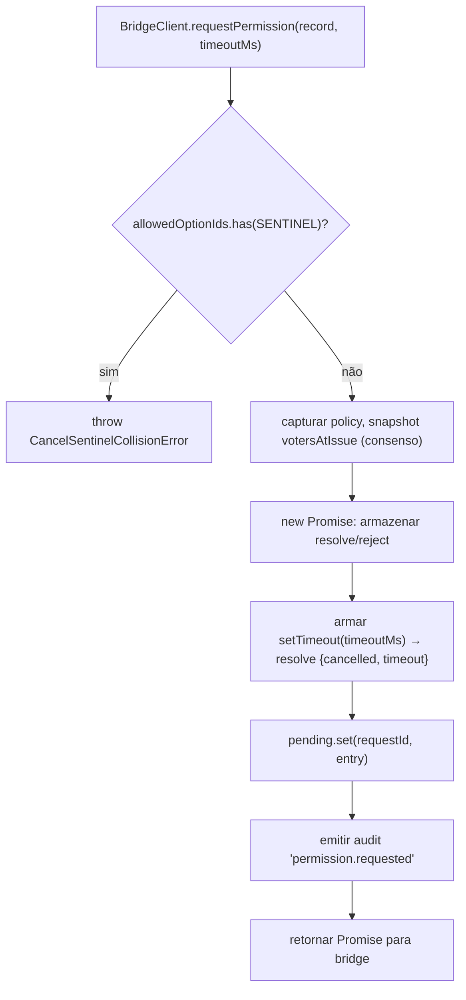
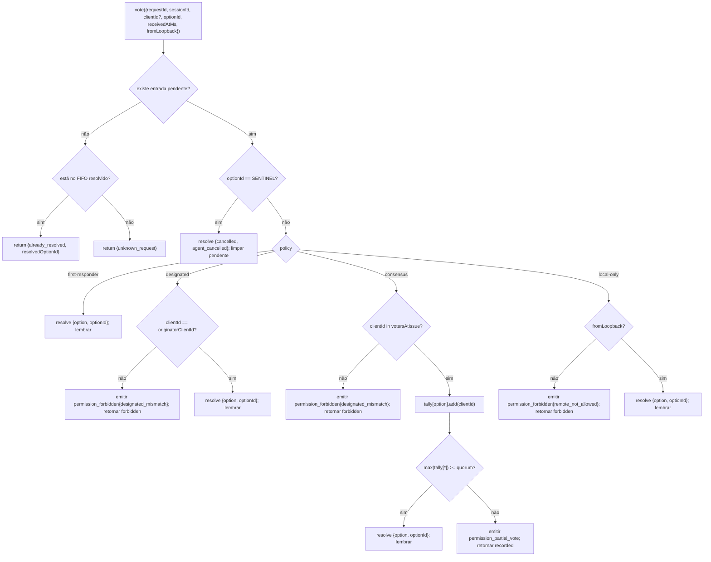

# Mediação de Permissão Multi-Client

## Visão Geral

Quando o agente filho do ACP chama `requestPermission`, o daemon não simplesmente o encaminha para um cliente. Sob `sessionScope: 'single'`, todo cliente conectado vê a requisição e qualquer um pode responder. Sem mediação, votos tardios não têm para onde ir, dois clientes podem competir pela mesma requisição e um único cliente mal-intencionado pode sobrescrever o originador.

`MultiClientPermissionMediator` (`packages/acp-bridge/src/permissionMediator.ts`) implementa o contrato `PermissionMediator` (`packages/acp-bridge/src/permission.ts`) e detém todo o estado de permissão pendente e resolvido para a bridge. Ele despacha votos através de uma das quatro políticas declaradas em `PermissionPolicy`:

| Política           | Regra de resolução                                                                                                        | Caso de uso                                                                  |
| ------------------ | ------------------------------------------------------------------------------------------------------------------------- | ---------------------------------------------------------------------------- |
| `first-responder`  | Primeiro voto válido vence; votantes posteriores recebem `permission_already_resolved`.                                   | UX de colaboração ao vivo entre clientes (padrão).                           |
| `designated`       | Apenas o `originatorClientId` do prompt pode resolver; outros veem `permission_forbidden{designated_mismatch}`.           | SaaS por locatário onde a superfície da UI deve ser dona de suas próprias aprovações. |
| `consensus`        | Quórum N-de-M no snapshot de client-id v1; eventos intermediários `permission_partial_vote` permitem que IUs renderizem progresso. | Revisão de mudanças empresariais onde dois operadores devem concordar.       |
| `local-only`       | Recusa qualquer votante não-loopback; bloqueia até que um cliente loopback resolva.                                       | Estações de trabalho onde o controle remoto nunca deve conceder escalada de privilégios. |

> **Limitação de segurança v1**: `X-Qwen-Client-Id` é auto-reportado. `designated` e
> `consensus` ainda não possuem prova de posse. Um cliente que observa
> `originatorClientId` pode reutilizar esse id. `{outcome:'cancelled'}` também é roteado
> através do sentinela de cancelamento antes do despacho da política, então mesmo
> `local-only` não pode tratar cancelamento como uma resolução protegida por política. Para isolamento forte,
> prenda o daemon a loopback ou coloque-o atrás de um proxy reverso autenticado. Veja
> [Nota de segurança: identidade do cliente v1 é auto-reportada](#security-note-v1-client-identity-is-self-reported).

## Responsabilidades

- Rastrear cada requisição pendente (ciclo de vida `request → vote → resolved`).
- Armar e desarmar timeouts de relógio de parede por requisição (o **invariante N1**: o timeout deve ser armado sincronamente dentro de `request()` para que uma sessão imediatamente cancelada não vaze um closure permanentemente pendente).
- Despachar votos através da política capturada no momento de `request()` (alterar a política do daemon durante o voo não afeta requisições em andamento).
- Manter um FIFO limitado (`MAX_RESOLVED_PERMISSION_RECORDS = 512`) de requisições resolvidas recentemente para que votos duplicados recebam um `already_resolved` estruturado em vez de `unknown_request`.
- Emitir `permission_partial_vote` (consensus) e `permission_forbidden` (designated / consensus / local-only) no EventBus por sessão.
- Resolver requisições pendentes como `{kind: 'cancelled', reason: 'session_closed'}` via `forgetSession(sessionId)` no encerramento da sessão.
- Rejeitar injeção maliciosa ou acidental de `CANCEL_VOTE_SENTINEL` através da rede (`InvalidPermissionOptionError`) e através de rótulos de opção publicados pelo agente (`CancelSentinelCollisionError`).

## Arquitetura

### Superfície pública

```ts
interface PermissionMediator {
  readonly policy: PermissionPolicy;
  request(
    record: PermissionRequestRecord,
    timeoutMs: number,
  ): Promise<PermissionResolution>;
  vote(vote: PermissionVote): PermissionVoteOutcome;
  forgetSession(sessionId: string): void;
}
```

`MultiClientPermissionMediator` adiciona: `peekSessionFor(requestId)`, `pendingCount(sessionId)`, publicador de auditoria interna, etc. `BridgeClient` depende apenas da metade `request()` (subtipagem estrutural — veja `bridgeClient.ts`).

### `PermissionPolicy` e `PermissionVoteOutcome`

```ts
type PermissionPolicy =
  | 'first-responder'
  | 'designated'
  | 'consensus'
  | 'local-only';

type PermissionVoteOutcome =
  | { kind: 'resolved'; resolvedOptionId: string }
  | { kind: 'recorded'; votesNeeded: number } // consensus partial
  | { kind: 'already_resolved'; resolvedOptionId: string }
  | { kind: 'forbidden'; reason: 'designated_mismatch' | 'remote_not_allowed' }
  | { kind: 'unknown_request' };

type PermissionResolution =
  | { kind: 'option'; optionId: string }
  | {
      kind: 'cancelled';
      reason: 'timeout' | 'session_closed' | 'agent_cancelled';
    };
```

### Sentinela de cancelamento

`CANCEL_VOTE_SENTINEL = '__cancelled__'`. A bridge mapeia o voto `{outcome:'cancelled'}` para este sentinela **antes** de chamar `mediator.vote`. O mediador roteia o sentinela **antes** do despacho da política — cancelamento por voto funciona sob qualquer política, independentemente de `clientId` / loopback / associação. Dois guardiões:
1. **`bridge.ts`** rejeita votos cujo `optionId === CANCEL_VOTE_SENTINEL` com `InvalidPermissionOptionError` (um cliente malicioso não deve ser capaz de injetar cancelamento mentindo sobre um `optionId`).
2. **`mediator.request`** rejeita registros cujo `allowedOptionIds` contém o sentinela com `CancelSentinelCollisionError` (um agente publicando legitimamente `'__cancelled__'` como um rótulo de opção não deve conseguir se passar por outro).

Essa fuga deliberada entre políticas está documentada em `permissionMediator.ts` para que um futuro mantenedor não remova acidentalmente a exceção.

### Estado pendente

Cada requisição pendente é indexada por `requestId` e carrega:

- `policy` — capturada no momento de `request()`.
- `record: PermissionRequestRecord` (requestId, sessionId, originatorClientId, allowedOptionIds, issuedAtMs).
- Closures `resolve` / `reject`.
- `votesAtIssue` (apenas consenso) — instantâneo dos `clientIds` registrados para a sessão no momento da emissão; votos posteriores são rejeitados se não estiverem neste conjunto.
- `tally` (apenas consenso) — `Map<optionId, Set<clientId>>` contando votos por opção.
- `timeoutHandle` — timeout do Node armado dentro de `request()` (invariante N1).
- `auditTrail[]` — registros de auditoria por voto.

### FIFO resolvido

`MAX_RESOLVED_PERMISSION_RECORDS = 512`. A evicção é FIFO via `resolvedOrder.shift()` (DeepSeek revisão #4335 / 3271627446 — espelha `PermissionAuditRing`). Armazena apenas `{requestId, sessionId, outcome}`, então 512 registros permanecem abaixo de 100 KB em janelas normais de reconexão/race da UI.

## Fluxo de trabalho

### `request()` (invariante N1)



O timer é armado **antes** que a entrada seja visível em outro lugar. Sem isso, um `forgetSession` chegando entre `pending.set` e `setTimeout` deixaria a entrada pendente sem timeout — a `promptQueue` por sessão da bridge ficaria pendurada para sempre.

### `vote()` dispatch



### `forgetSession()`

Chamado no fechamento da sessão, evicção e desligamento da bridge. Para toda entrada pendente cujo `record.sessionId === sessionId`:

1. Cancelar o timeout.
2. Resolver a Promise pendente com `{kind: 'cancelled', reason: 'session_closed'}`.
3. Adicionar um registro de auditoria.
4. Remover de `pending`.

O caminho de encerramento de sessão da bridge sempre chama `forgetSession` **antes** da janela de kill do canal, para que permissões pendentes não sobrevivam à sua sessão.

## Estado & Ciclo de Vida

- `policy` é capturada por requisição. Alterar a política do daemon (superfície futura) não afeta requisições em andamento.
- `votesAtIssue` (consenso) é capturado no momento de `request()`; clientes que chegam após a requisição podem votar, mas se seu `clientId` não estava registrado na sessão no momento da emissão, seu voto é rejeitado como `designated_mismatch`. Isso reutiliza intencionalmente o motivo de incompatibilidade da política `designated` para manter o contrato fechado; versões futuras podem dividir a união se consumidores de SDK precisarem distinguir.
- Entradas resolvidas vivem no FIFO por no máximo `MAX_RESOLVED_PERMISSION_RECORDS` (512). Após a evicção, um voto duplicado no mesmo `requestId` retorna `{unknown_request}`.
- `permission_partial_vote` é disparado apenas para `consensus`. Não dependa dele sob nenhuma outra política.
- `permission_forbidden` é disparado para `designated`, `consensus` e `local-only` — não para `first-responder`.

## Dependências
- [`03-acp-bridge.md`](./03-acp-bridge.md) — como a ponte conecta `BridgeClient.requestPermission` ao `mediator.request`.
- [`10-event-bus.md`](./10-event-bus.md) — como frames de voto parcial e proibidos chegam aos clientes.
- [`09-event-schema.md`](./09-event-schema.md) — contratos de payload para eventos `permission_*`.
- [`08-session-lifecycle.md`](./08-session-lifecycle.md) — `forgetSession()` é chamado em todo encerramento de sessão.
- [`02-serve-runtime.md`](./02-serve-runtime.md) — `PermissionAuditRing` (FIFO de 512 entradas de registros de auditoria).

## Configuração

| Fonte              | Opção                                                                                               | Efeito                                |
| ------------------- | --------------------------------------------------------------------------------------------------- | ------------------------------------- |
| `settings.json`     | `policy.permissionStrategy`                                                                         | Política mediadora ativa.              |
| `settings.json`     | `policy.consensusQuorum`                                                                            | N para consenso.                      |
| `BridgeOptions`     | `permissionPolicy`, `permissionConsensusQuorum`, `permissionAudit`                                  | Substituição programática.            |
| Tag de capacidade   | `permission_mediation` (sempre; `modes: ['first-responder', 'designated', 'consensus', 'local-only']`) | Conjunto suportado pela build.        |
| Envelope de capacidade | `policy.permission`                                                                                 | Política ativa que este daemon está executando. |

Se `policy.permissionStrategy` não estiver explicitamente configurado, o daemon usa `first-responder`. `designated`, `consensus` e `local-only` só entram em vigor quando definidos em `settings.json`.

## Quórum de consenso: fórmula padrão e o caso extremo M=2

Quando a política `consensus` está ativa e `policy.consensusQuorum` não está definido, o mediador calcula **N = floor(M/2) + 1** via `consensusQuorumFor` em `permissionMediator.ts`:

```ts
Math.max(1, Math.floor(m / 2) + 1);
```

| M (`votersAtIssue.size`) | N Padrão | Comportamento                    |
| ------------------------ | --------- | ------------------------------- |
| 1                        | 1         | Um eleitor resolve imediatamente. |
| 2                        | 2         | Exige concordância unânime.      |
| 3                        | 2         | Maioria.                        |
| 4                        | 3         | Mais da metade.                 |
| 5                        | 3         | Maioria.                        |
| 6                        | 4         | Mais da metade.                 |

Para **M = 2**, votos divididos (A seleciona X, B seleciona Y) só podem ser resolvidos pelo timeout por permissão: nenhuma opção atinge unanimidade, então a requisição aguarda até `permissionResponseTimeoutMs` (padrão 5 min) e resolve como `{cancelled, timeout}`. O caminho de avanço de voto registra esse comportamento de "unanimidade significa que votos divididos expiram" no stderr para operadores.

Operadores que desejam comportamento de primeiro voto vence para M = 2 podem definir explicitamente `policy.consensusQuorum: 1`. Configurações mais restritivas, como exigir unanimidade para M = 4, usam o mesmo campo.

## Validação de política na inicialização

`runQwenServe.validatePolicyConfig(policyConfig)` (`packages/cli/src/serve/run-qwen-serve.ts`) valida o `settings.json` mesclado `policy.*` na inicialização e lança `InvalidPolicyConfigError` para erros do operador:

- `policy.permissionStrategy` está definido, mas não em um dos quatro modos suportados. O conjunto válido é derivado em tempo de execução de `SERVE_CAPABILITY_REGISTRY.permission_mediation.modes`, a única fonte da verdade para anúncio de capacidade.
- `policy.consensusQuorum` está definido, mas não é um inteiro positivo.

Há também um aviso suave no stderr quando `consensusQuorum` está definido enquanto `permissionStrategy !== 'consensus'`; a substituição seria ignorada silenciosamente sob políticas que não são de consenso.

`InvalidPolicyConfigError` é exportado para testes com `instanceof`. `runQwenServe` o usa para distinguir configuração incorreta do operador, que é relançada como uma falha explícita na inicialização, de falhas de I/O na leitura de configurações, que retornam para os padrões.

## Nota de segurança: identidade do cliente v1 é auto-reportada

`X-Qwen-Client-Id` é fornecido pelo cliente HTTP. No v1, o daemon valida o formato (`[A-Za-z0-9._:-]{1,128}`) e rastreia ids de clientes anexados em `clientIds`, mas não realiza prova de posse. Qualquer cliente que possa observar `originatorClientId` no SSE pode se registrar com o mesmo id e se passar por aquele originador em requisições posteriores.

Impacto na política:

- **`first-responder`** não é afetado porque não depende de identidade.
- **`designated`** pode ser falsificado por um cliente remoto reutilizando `originatorClientId`.
- **`consensus`** depende do snapshot `votersAtIssue` no momento da emissão; se um id falsificado já estiver anexado quando a requisição for emitida, ele pode votar.
- **`local-only`** é imune a falsificação de id porque `fromLoopback: boolean` é estampado pelo daemon a partir do endereço remoto da conexão, não fornecido pelo cliente.
Um futuro mecanismo de par de tokens emitirá um segredo por sessão a partir de
`POST /session` e o exigirá nos votos `designated` / `consensus`. Esse
mecanismo não existe na v1.

## Riscos e Limitações Conhecidas

- **Cancelar rotas sentinela ANTES do despacho de política** por design — um daemon `local-only` e um daemon `consensus` podem ser cancelados por qualquer eleitor que poste `{outcome: 'cancelled'}`. Isso está documentado em `permissionMediator.ts` e é o caminho de aborto do lado do agente.
- **`designated` e `consensus` sobrecarregam `designated_mismatch`** em `PermissionVoteOutcome`. O mediador emite registros de auditoria separados, mas a forma no fio é única. Versões futuras do protocolo podem dividir a união.
- **Eleitores anônimos (sem `X-Qwen-Client-Id`)** são aceitos apenas em `first-responder` e `local-only` (loopback); `designated` e `consensus` os rejeitam.
- **Válvula de escape entre políticas** significa que cancelamento não pode ser controlado por política. Se uma implantação precisar de cancelamento controlado por política, isso seria uma mudança futura no contrato — não encubra com verificações no nível de rota.
- **Semânticas de snapshot `votesAtIssue`** significam que uma implantação de consenso com um conjunto de clientes volátil pode ter clientes legítimos rejeitados porque se conectaram após a requisição ser emitida. Operadores devem pré-registrar IDs de cliente colaboradores antes de emitir prompts de revisão de mudança.

## Referências

- `packages/acp-bridge/src/permission.ts` (contrato congelado)
- `packages/acp-bridge/src/permissionMediator.ts` (implementação do mediador F3)
- `packages/acp-bridge/src/bridgeClient.ts` (usa subtipagem estrutural em `PermissionMediator`)
- `packages/acp-bridge/src/bridgeErrors.ts` (`CancelSentinelCollisionError`, `InvalidPermissionOptionError`, `PermissionForbiddenError`)
- `packages/cli/src/serve/permission-audit.ts` (anel de auditoria + publicador)
- Issue: [#4175](https://github.com/QwenLM/qwen-code/issues/4175) série F3.
