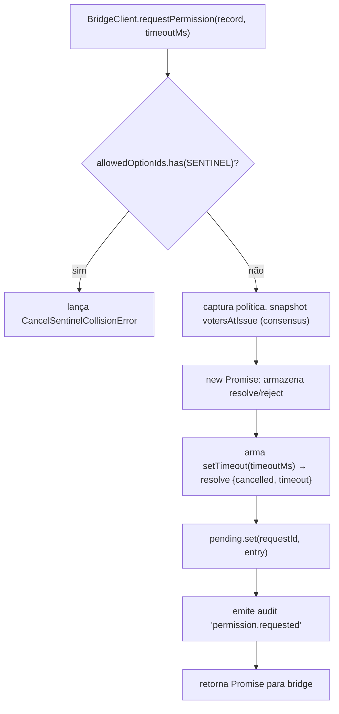
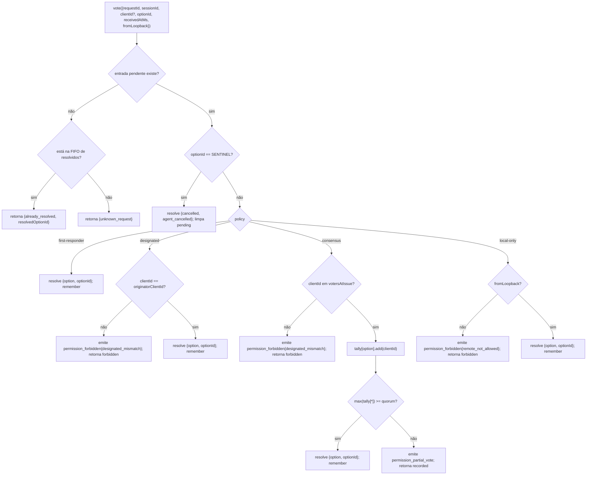

# Mediação de Permissões Multi-Client

## Visão Geral

Quando o agente filho do ACP chama `requestPermission`, o daemon não simplesmente encaminha para um cliente. Sob `sessionScope: 'single'`, cada cliente conectado vê a requisição e qualquer um deles pode responder. Sem mediação, votos tardios não têm destino, dois clientes podem competir pela mesma requisição e um único cliente malicioso pode sobrescrever o originador.

`MultiClientPermissionMediator` (`packages/acp-bridge/src/permissionMediator.ts`) implementa o contrato `PermissionMediator` (`packages/acp-bridge/src/permission.ts`) e gerencia todo o estado de permissões pendentes e resolvidas para a bridge. Ela despacha votos através de uma das quatro políticas declaradas em `PermissionPolicy`:

| Política          | Regra de resolução                                                                                                    | Caso de uso                                                               |
| ----------------- | --------------------------------------------------------------------------------------------------------------------- | ------------------------------------------------------------------------- |
| `first-responder` | O primeiro voto válido vence; votantes posteriores recebem `permission_already_resolved`.                             | UX de colaboração live entre clientes (padrão).                           |
| `designated`      | Apenas o `originatorClientId` da solicitação pode resolver; outros veem `permission_forbidden{designated_mismatch}`. | SaaS por tenant onde a superfície de UI deve ser dona de suas aprovações. |
| `consensus`       | Quorum N-de-M sobre o snapshot v1 de client-ids; eventos intermediários `permission_partial_vote` permitem que UIs renderizem progresso. | Revisão de mudanças empresariais onde dois operadores devem concordar. |
| `local-only`      | Recusa qualquer votante não loopback; bloqueia até que um cliente loopback resolva.                                   | Workstations onde controle remoto nunca deve conceder escalonamento de privilégios. |

> **Limitação de segurança v1**: `X-Qwen-Client-Id` é autoinformado. `designated` e
> `consensus` ainda não possuem prova de posse. Um cliente que observa
> `originatorClientId` pode reutilizar esse id. `{outcome:'cancelled'}` também passa
> pelo sentinela de cancelamento antes do despacho da política, portanto nem mesmo
> `local-only` pode tratar cancelamento como uma resolução protegida pela política.
> Para isolamento forte, vincule o daemon a loopback ou coloque-o atrás de um proxy
> reverso autenticado. Veja [Nota de segurança: identidade do cliente v1 é autoinformada](#nota-de-segurança-identidade-do-cliente-v1-é-autoinformada).

## Responsabilidades

- Rastrear toda requisição pendente (ciclo `requisição → voto → resolvido`).
- Armar e desarmar timeouts de tempo real por requisição (a **invariante N1**: o timeout deve ser armado sincronamente dentro de `request()` para que uma sessão cancelada imediatamente não vaze uma closure permanentemente pendente).
- Despachar votos através da política capturada no momento de `request()` (alterar a política do daemon em pleno voo não afeta requisições em andamento).
- Manter uma FIFO limitada (`MAX_RESOLVED_PERMISSION_RECORDS = 512`) de requisições resolvidas recentemente para que votos duplicados recebam um `already_resolved` estruturado em vez de `unknown_request`.
- Emitir `permission_partial_vote` (consensus) e `permission_forbidden` (designated / consensus / local-only) no EventBus por sessão.
- Resolver requisições pendentes como `{kind: 'cancelled', reason: 'session_closed'}` através de `forgetSession(sessionId)` no encerramento da sessão.
- Rejeitar injeção maliciosa ou acidental de `CANCEL_VOTE_SENTINEL` via rede (`InvalidPermissionOptionError`) e através de rótulos de opções publicados pelo agente (`CancelSentinelCollisionError`).

## Arquitetura

### Superfície pública

```ts
interface PermissionMediator {
  readonly policy: PermissionPolicy;
  request(
    record: PermissionRequestRecord,
    timeoutMs: number,
  ): Promise<PermissionResolution>;
  vote(vote: PermissionVote): PermissionVoteOutcome;
  forgetSession(sessionId: string): void;
}
```

`MultiClientPermissionMediator` adiciona: `peekSessionFor(requestId)`, `pendingCount(sessionId)`, publicador de auditoria interna, etc. `BridgeClient` depende apenas da metade `request()` (subtipagem estrutural — veja `bridgeClient.ts`).

### `PermissionPolicy` e `PermissionVoteOutcome`

```ts
type PermissionPolicy =
  | 'first-responder'
  | 'designated'
  | 'consensus'
  | 'local-only';

type PermissionVoteOutcome =
  | { kind: 'resolved'; resolvedOptionId: string }
  | { kind: 'recorded'; votesNeeded: number } // consensus partial
  | { kind: 'already_resolved'; resolvedOptionId: string }
  | { kind: 'forbidden'; reason: 'designated_mismatch' | 'remote_not_allowed' }
  | { kind: 'unknown_request' };

type PermissionResolution =
  | { kind: 'option'; optionId: string }
  | {
      kind: 'cancelled';
      reason: 'timeout' | 'session_closed' | 'agent_cancelled';
    };
```

### Sentinela de cancelamento

`CANCEL_VOTE_SENTINEL = '__cancelled__'`. A bridge mapeia o voto do votante `{outcome:'cancelled'}` para este sentinela **antes** de chamar `mediator.vote`. O mediador roteia o sentinela **antes** do despacho da política — cancelamento do votante funciona sob qualquer política independentemente de `clientId` / loopback / associação. Duas salvaguardas:

1. **`bridge.ts`** rejeita votos vindos da rede cujo `optionId === CANCEL_VOTE_SENTINEL` com `InvalidPermissionOptionError` (um cliente malicioso na rede não deve ser capaz de injetar cancelamento mentindo sobre um `optionId`).
2. **`mediator.request`** rejeita registros cujo `allowedOptionIds` contenha o sentinela com `CancelSentinelCollisionError` (um agente que publica legitimamente `'__cancelled__'` como rótulo de opção não deve ser capaz de se passar por outro).

Esta saída de escape deliberada entre políticas está documentada em `permissionMediator.ts` para que um mantenedor futuro não remova acidentalmente o desvio.

### Estado pendente

Cada requisição pendente é chaveada por `requestId` e carrega:

- `policy` — capturada no momento de `request()`.
- `record: PermissionRequestRecord` (requestId, sessionId, originatorClientId, allowedOptionIds, issuedAtMs).
- Closures `resolve` / `reject`.
- `votesAtIssue` (apenas consensus) — snapshot dos `clientIds` registrados para a sessão no momento da emissão; votos posteriores são rejeitados se não estiverem neste conjunto.
- `tally` (apenas consensus) — `Map<optionId, Set<clientId>>` contando votos por opção.
- `timeoutHandle` — timeout do Node armado dentro de `request()` (invariante N1).
- `auditTrail[]` — registros de auditoria por voto.

### FIFO de resolvidos

`MAX_RESOLVED_PERMISSION_RECORDS = 512`. A evicção é FIFO via `resolvedOrder.shift()` (revisão DeepSeek #4335 / 3271627446 — espelha `PermissionAuditRing`). Armazena apenas `{requestId, sessionId, outcome}`, então 512 registros ficam abaixo de 100 KB durante janelas normais de reconexão/competição da UI.

## Fluxo de trabalho

### `request()` (invariante N1)



O timer é armado **antes** que a entrada seja sequer visível em outro lugar. Sem isso, um `forgetSession` chegando entre `pending.set` e `setTimeout` deixaria a entrada pendente sem timeout — a `promptQueue` por sessão da bridge travaria para sempre.

### Despacho de `vote()`



### `forgetSession()`

Chamado no fechamento de sessão, evicção e desligamento da bridge. Para cada entrada pendente cujo `record.sessionId === sessionId`:

1. Cancela o timeout.
2. Resolve a Promise pendente com `{kind: 'cancelled', reason: 'session_closed'}`.
3. Anexa um registro de auditoria.
4. Remove de `pending`.

O caminho de desmontagem de sessão da bridge sempre chama `forgetSession` **antes** da janela de kill do canal para que permissões pendentes não sobrevivam à sua sessão.

## Estado e Ciclo de Vida

- `policy` é capturado por requisição. Alterar a política em todo o daemon (superfície futura) não afeta requisições em andamento.
- `votesAtIssue` (consensus) é capturado no momento de `request()`; clientes que chegam após a requisição podem votar, mas se seu `clientId` não estava já registrado com a sessão no momento da emissão, seu voto é rejeitado como `designated_mismatch`. Isso reutiliza intencionalmente o motivo de incompatibilidade da política `designated` para manter o contrato fechado; versões futuras podem dividir a união se consumidores de SDK precisarem distinguir.
- Entradas resolvidas vivem na FIFO por no máximo `MAX_RESOLVED_PERMISSION_RECORDS` (512). Após evicção, um voto duplicado no mesmo `requestId` retorna `{unknown_request}`.
- `permission_partial_vote` só é disparado para `consensus`. Não dependa disso sob nenhuma outra política.
- `permission_forbidden` é disparado para `designated`, `consensus` e `local-only` — não para `first-responder`.

## Dependências

- [`03-acp-bridge.md`](./03-acp-bridge.md) — como a bridge conecta `BridgeClient.requestPermission` a `mediator.request`.
- [`10-event-bus.md`](./10-event-bus.md) — como quadros de voto parcial e proibido chegam aos clientes.
- [`09-event-schema.md`](./09-event-schema.md) — contratos de payload para eventos `permission_*`.
- [`08-session-lifecycle.md`](./08-session-lifecycle.md) — `forgetSession()` é chamado em toda terminação de sessão.
- [`02-serve-runtime.md`](./02-serve-runtime.md) — `PermissionAuditRing` (FIFO de 512 entradas de registros de auditoria).

## Configuração

| Fonte               | Parametrização                                                                                          | Efeito                              |
| ------------------- | ------------------------------------------------------------------------------------------------------- | ----------------------------------- |
| `settings.json`     | `policy.permissionStrategy`                                                                             | Política ativa do mediador.         |
| `settings.json`     | `policy.consensusQuorum`                                                                                | N para consensus.                   |
| `BridgeOptions`     | `permissionPolicy`, `permissionConsensusQuorum`, `permissionAudit`                                      | Sobrescrita programática.           |
| Tag de capacidade   | `permission_mediation` (sempre; `modes: ['first-responder', 'designated', 'consensus', 'local-only']`) | Conjunto suportado pela build.      |
| Envelope de capacidade | `policy.permission`                                                                                    | Política ativa que este daemon está executando. |

Se `policy.permissionStrategy` não estiver explicitamente configurado, o daemon usa
`first-responder`. `designated`, `consensus` e `local-only` só entram em efeito
quando definidos em `settings.json`.

## Quorum de consenso: fórmula padrão e o caso M=2

Quando a política `consensus` está ativa e `policy.consensusQuorum` não está definido,
o mediador calcula **N = floor(M/2) + 1** via `consensusQuorumFor` em
`permissionMediator.ts`:

```ts
Math.max(1, Math.floor(m / 2) + 1);
```

| M (`votersAtIssue.size`) | N padrão | Comportamento                      |
| ------------------------ | -------- | ---------------------------------- |
| 1                        | 1        | Um votante resolve imediatamente.  |
| 2                        | 2        | Requer acordo unânime.             |
| 3                        | 2        | Maioria.                           |
| 4                        | 3        | Mais da metade.                    |
| 5                        | 3        | Maioria.                           |
| 6                        | 4        | Mais da metade.                    |

Para **M = 2**, votos divididos (A seleciona X, B seleciona Y) só podem ser resolvidos pelo
timeout por permissão: nenhuma opção atinge a unanimidade, então a requisição aguarda
até `permissionResponseTimeoutMs` (padrão 5 min) e resolve como
`{cancelled, timeout}`. O caminho de avanço de voto registra esse comportamento de
"unanimidade significa votos divididos expiram" em stderr para operadores.

Operadores que desejam comportamento de primeiro-voto-vencedor para M = 2 podem definir
explicitamente `policy.consensusQuorum: 1`. Configurações mais restritivas, como exigir
unanimidade para M = 4, usam o mesmo campo.

## Validação de política na inicialização

`runQwenServe.validatePolicyConfig(policyConfig)`
(`packages/cli/src/serve/run-qwen-serve.ts`) valida o `policy.*` mesclado do
`settings.json` na inicialização e lança `InvalidPolicyConfigError` para erros do
operador:

- `policy.permissionStrategy` está definido mas não está entre os quatro modos
  suportados. O conjunto válido é derivado em tempo de execução de
  `SERVE_CAPABILITY_REGISTRY.permission_mediation.modes`, a fonte única de verdade
  para anúncio de capacidade.
- `policy.consensusQuorum` está definido mas não é um inteiro positivo.

Há também um aviso soft em stderr quando `consensusQuorum` é definido enquanto
`permissionStrategy !== 'consensus'`; a sobrescrita seria silenciosamente ignorada
sob políticas não-consensus.

`InvalidPolicyConfigError` é exportado para testes com `instanceof`. `runQwenServe`
o usa para distinguir mau-configuração do operador, que é relançada como uma falha
explícita na inicialização, de falhas de I/O na leitura das configurações, que
recorrem a padrões.

## Nota de segurança: identidade do cliente v1 é autoinformada

`X-Qwen-Client-Id` é fornecido pelo cliente HTTP. Na v1, o daemon valida o formato
(`[A-Za-z0-9._:-]{1,128}`) e rastreia ids de clientes conectados em `clientIds`,
mas não realiza prova de posse. Qualquer cliente que possa observar
`originatorClientId` no SSE pode se registrar com o mesmo id e se passar por
aquele originador em requisições posteriores.

Impacto nas políticas:

- **`first-responder`** não é afetado porque não depende de identidade.
- **`designated`** pode ser falsificado por um cliente remoto reutilizando
  `originatorClientId`.
- **`consensus`** depende do snapshot `votersAtIssue` no momento da emissão; se um
  id falsificado já estiver anexado quando a requisição for emitida, ele pode votar.
- **`local-only`** é imune a falsificação de id porque `fromLoopback: boolean` é
  carimbado pelo daemon a partir do endereço remoto da conexão, não fornecido pelo
  cliente.

Um mecanismo futuro de token em par emitirá um segredo por sessão a partir de
`POST /session` e o exigirá em votos `designated` / `consensus`. Esse mecanismo
não existe na v1.

## Riscos & Limitações Conhecidas

- **Sentinela de cancelamento passa ANTES do despacho da política** por design —
  um daemon `local-only` e um daemon `consensus` podem ambos ser cancelados por
  qualquer votante que poste `{outcome: 'cancelled'}`. Isso está documentado em
  `permissionMediator.ts` e é o caminho de aborto do lado do agente.
- **`designated` e `consensus` sobrecarregam `designated_mismatch`** em
  `PermissionVoteOutcome`. O mediador emite registros de auditoria separados, mas a
  forma na rede é única. Versões futuras do protocolo podem dividir a união.
- **Votantes anônimos (sem `X-Qwen-Client-Id`)** são aceitos apenas em
  `first-responder` e `local-only` (loopback); `designated` e `consensus` os rejeitam.
- **Saída de escape entre políticas** significa que o cancelamento não pode ser
  limitado por política. Se uma implantação precisar de cancelamento por política,
  isso seria uma mudança futura no contrato — não remende com verificações em nível
  de rota.
- **Semântica de snapshot `votesAtIssue`** significa que uma implantação de consensus
  com um conjunto de clientes em mudança pode rejeitar clientes legítimos porque eles
  se conectaram após a requisição ter sido emitida. Operadores devem pré-registrar ids
  de clientes colaboradores antes de emitir solicitações de revisão de mudança.

## Referências

- `packages/acp-bridge/src/permission.ts` (contrato congelado)
- `packages/acp-bridge/src/permissionMediator.ts` (implementação do mediador F3)
- `packages/acp-bridge/src/bridgeClient.ts` (usa subtipagem estrutural em `PermissionMediator`)
- `packages/acp-bridge/src/bridgeErrors.ts` (`CancelSentinelCollisionError`, `InvalidPermissionOptionError`, `PermissionForbiddenError`)
- `packages/cli/src/serve/permission-audit.ts` (anel de auditoria + publicador)
- Issue: [#4175](https://github.com/QwenLM/qwen-code/issues/4175) série F3.