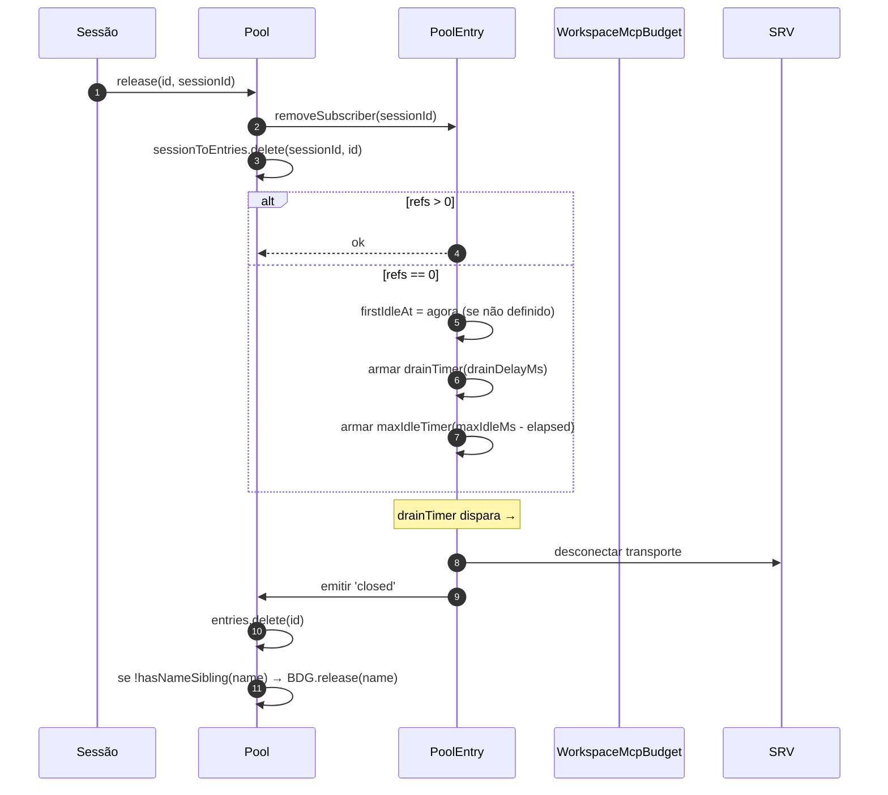
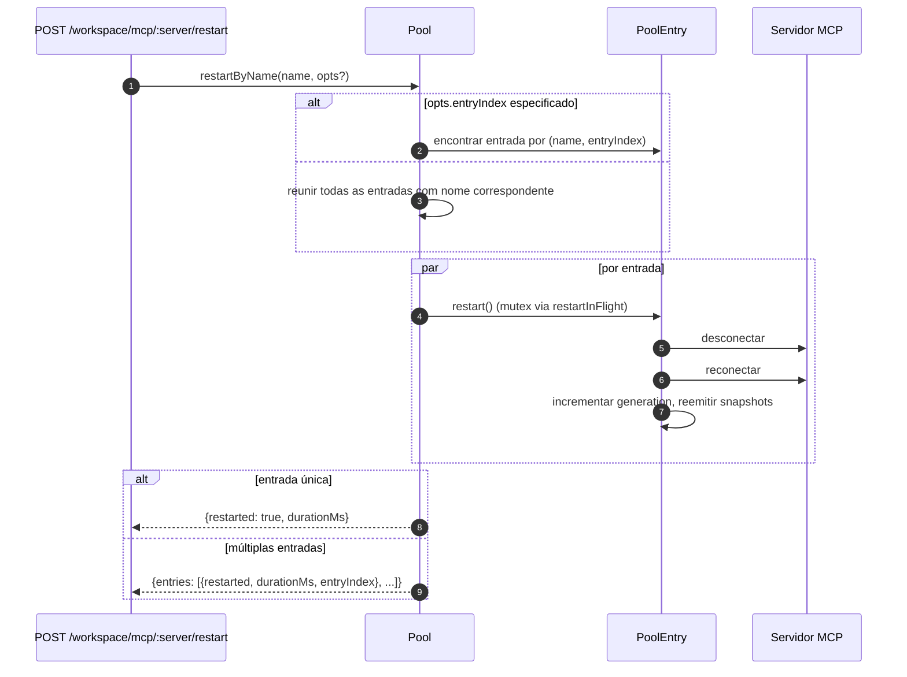
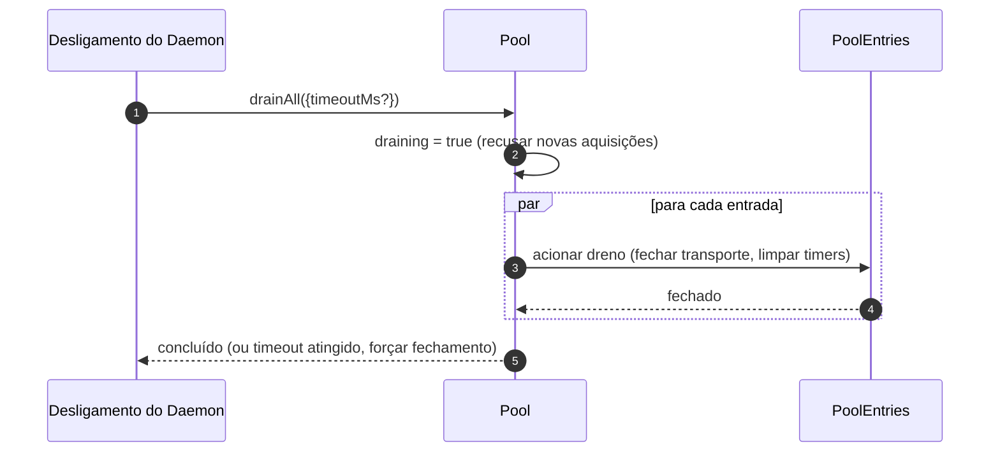

# Pool de Transporte MCP do Workspace

## Visão Geral

`McpTransportPool` (`packages/core/src/tools/mcp-transport-pool.ts`) é o pool de escopo do workspace F2 (#4175 commit 5): múltiplas sessões ACP em um mesmo daemon compartilham um único transporte por tupla única `(serverName + configFingerprint)`, em vez de cada uma instanciar seu próprio processo filho MCP. O pool reside **dentro do filho ACP** (`QwenAgent.mcpPool`), é construído uma vez na inicialização do agente com o `Config` de bootstrap do daemon e sobrevive ao ciclo de vida das sessões. As entradas contam referências de anexos de sessão e são fechadas após um período de carência configurável quando a contagem de referências chega a zero.

É o mecanismo principal que impede que um daemon com várias sessões bifurque uma cópia de cada servidor MCP por sessão.

## Responsabilidades

- Adquirir ou instanciar um transporte MCP por par `(nome + fingerprint)`, deduplicando aquisições concorrentes via `spawnInFlight`.
- Liberar referências por sessão; armar o timer de dreno da entrada quando a última referência se desanexa.
- Sobreviver a oscilações de contagem de referência com um limite rígido `MAX_IDLE_MS` para que um cliente instável não consiga manter um transporte ocioso vivo para sempre.
- Contar referências de sessões em um índice reverso (`sessionToEntries`) para que `releaseSession(sessionId)` seja O(refs) em vez de O(entries).
- Reiniciar entradas sob demanda (`restartByName`) — entrada única retorna `{restarted, durationMs}`, múltiplas entradas retornam `{entries: RestartResult[]}` (contrato multi-entrada F2).
- Drenar todo o pool no desligamento do daemon com um timeout configurável; recusar novas aquisições enquanto estiver drenando.
- Consultar `WorkspaceMcpBudget` (veja [`06-mcp-budget-guardrails.md`](./06-mcp-budget-guardrails.md)) no `acquire` para aplicar limites de reserva por nome; liberar a vaga no fechamento da entrada quando nenhuma outra entrada irmã possuir o mesmo nome.
- Produzir snapshots filtrados de ferramentas/prompts por sessão via `SessionMcpView` para que uma descoberta em uma sessão não registre ferramentas em outras sessões.

## Arquitetura

### Superfície pública

```ts
class McpTransportPool {
  constructor(cliConfig: Config, options: McpTransportPoolOptions);
  acquire(
    serverName,
    cfg,
    sessionId,
    sessionToolRegistry,
    sessionPromptRegistry,
  ): Promise<PooledConnection>;
  release(id, sessionId): void;
  releaseSession(sessionId): void;
  restartByName(
    name,
    opts?,
  ): Promise<RestartResult | { entries: RestartResult[] }>;
  drainAll(opts?): Promise<void>;
  getBudget(): WorkspaceMcpBudget | undefined;
  getSnapshot(): McpPoolSnapshot;
}
```

`McpTransportPoolOptions`:

- `workspaceContext: WorkspaceContext` (obrigatório).
- `debugMode: boolean`.
- `sendSdkMcpMessage?` — callback por sessão (o pool ignora o SDK MCP).
- `pooledTransports?: ReadonlySet<McpTransportKind>` — padrão `{stdio, websocket}`. Transportes HTTP/SSE permanecem sem pool por padrão porque seus cabeçalhos podem conter estado OAuth específico da sessão, mas operadores podem explicitamente optar por incluí-los no pool com `QWEN_SERVE_MCP_POOL_TRANSPORTS`.
- `drainDelayMs?` — padrão `30_000`.
- `entryOptions?: (transport) => PoolEntryOptions`.
- `budget?: WorkspaceMcpBudget`.

### Estado interno

| Estado              | Tipo                                    | Propósito                                                                                              |
| ------------------- | --------------------------------------- | ------------------------------------------------------------------------------------------------------ |
| `entries`           | `Map<ConnectionId, PoolEntry>`          | Entradas ativas do pool, indexadas por `connectionIdOf(name, fingerprint)`.                            |
| `unpooledIds`       | `Set<ConnectionId>`                     | Entradas para transportes fora da lista de permissão `pooledTransports` configurada.                   |
| `spawnInFlight`     | `Map<ConnectionId, Promise<PoolEntry>>` | Deduplica aquisições frias concorrentes para a mesma chave.                                            |
| `sessionToEntries`  | `Map<string, Set<ConnectionId>>`        | Índice reverso V21-2 para `releaseSession` O(refs).                                                    |
| `draining`          | `boolean`                               | Mutex de dreno — uma vez definido, todas as chamadas `acquire` são rejeitadas.                         |
| `nextIndexByName`   | `Map<string, number>`                   | `entryIndex` monotônico V21-7 por nome de servidor (os dashboards não se reorganizam quando uma nova entrada aparece). |

### `PoolEntry` (estrutura por entrada, `mcp-pool-entry.ts`)

Máquina de estados: `spawning → active ⇄ (active ↔ reconnect) → (active → draining na última desanexação, draining → active na anexação OU draining → closed no timer)`.

| Campo                                       | Propósito                                                                       |
| ------------------------------------------- | ------------------------------------------------------------------------------- |
| `localStatus: MCPServerStatus`              | Controlado pelo ciclo de vida `MCPServerStatus`.                                |
| `state: PoolEntryState`                     | `spawning`/`active`/`draining`/`closed`/`failed`.                               |
| `generation: number`                        | Incrementado a cada reinício; assinantes comparam para detectar ciclos de reconexão. |
| `refs: Set<string>`                         | IDs de sessão atualmente anexados.                                              |
| `subscribers: Map<string, SessionMcpView>`  | Visualizações filtradas por sessão.                                             |
| `subscriberHandles: Map<string, PooledConnectionImpl>` | Handles retornados por `acquire`.                                               |
| `toolsSnapshot[], promptsSnapshot[]`        | Snapshots canônicos em nível de pool; reemitidos em `toolsChanged` / `promptsChanged`. |
| `drainTimer?`                               | Armado quando `refs.size === 0`; padrão 30s. Redefinido na anexação.            |
| `maxIdleTimer?`                             | Armado na primeira ociosidade; nunca redefinido por aquisição/liberação. Padrão 5 min. |
| `firstIdleAt?`                              | Watermark para o limite rígido de ociosidade máxima.                            |
| `restartInFlight?`                          | Mutex para `restart()`.                                                         |

### `PoolEntryOptions`

```ts
interface PoolEntryOptions {
  drainDelayMs: number; // padrão 30_000
  maxIdleMs: number; // padrão 5 * 60_000
  maxReconnectAttempts: number; // padrão 3 (stdio/ws) ou 5 (http/sse)
  reconnectStrategy:
    | { kind: 'fixed'; delayMs: number }
    | { kind: 'exponential'; baseMs: number; capMs: number };
}
```

`defaultPoolEntryOptions(transport)` (`mcp-pool-entry.ts`) retorna padrões para stdio/ws `{fixed 5s, 3 tentativas}` e para http/sse `{exponential 1s → 16s, 5 tentativas}`. Transportes remotos recebem orçamentos de retry maiores porque suas falhas são mais frequentemente transitórias.

## Fluxo de Trabalho

### `acquire`

```mermaid
sequenceDiagram
    autonumber
    participant S as Sessão
    participant P as Pool
    participant SIF as spawnInFlight
    participant E as PoolEntry
    participant BDG as WorkspaceMcpBudget
    participant SRV as Servidor MCP

    S->>P: acquire(name, cfg, sessionId, sessionToolRegistry, sessionPromptRegistry)
    P->>P: recusar se estiver drenando
    P->>P: connectionId = connectionIdOf(name, fingerprint)
    P->>P: se !isPoolable(cfg) → marcar como não agrupado
    alt entrada em entries (quente)
        E-->>P: PoolEntry existente
    else spawn frio em andamento
        SIF-->>P: Promise<PoolEntry> existente
    else início frio
        P->>BDG: tryReserve(name) (se budget definido + agrupável)
        BDG-->>P: 'reserved' | 'already_held' | 'refused'
        alt refused
            P->>BDG: recordRefusal(name, transport)
            P-->>S: BudgetExhaustedError
        else ok
            P->>E: spawnEntry(name, cfg)
            E->>SRV: conectar transporte
            SRV-->>E: pronto
            P->>P: entries.set(id, E); nextIndexByName++
            E-->>P: conectado
        end
    end
    P->>E: addSubscriber(sessionId, sessionToolRegistry, sessionPromptRegistry)
    P->>P: sessionToEntries.add(sessionId, id)
    P->>P: cancelar timer de dreno (refs>0)
    P-->>S: PooledConnection { id, serverName, entryIndex, client, toolsSnapshot, promptsSnapshot, on, off, release }
```

### `release` + dreno



`hasNameSibling(name)` (`mcp-transport-pool.ts`) itera tanto `entries.values()` quanto `spawnInFlight.keys()` analisando o último com `parseConnectionId` (nomes de servidor podem conter legitimamente `::`, então `startsWith` daria falso positivo em um nome irmão começando com `${name}::`).

`releaseSession(sessionId)` lê de `sessionToEntries`, libera todas as entradas referenciadas em O(refs) e então limpa a entrada do índice. Usado pelo caminho de fechamento de sessão da bridge para não iterar o mapa completo de entradas.

### `restartByName`



A verificação de orçamento pré-voo na camada HTTP do daemon retorna `{restarted:false, skipped:true, reason:'budget_would_exceed'}` (controle de mutação Wave 4) quando o slot alvo não está reservado e uma reinicialização excederia o orçamento `enforce`.

### `drainAll`



## Estado & Ciclo de Vida

- A construção do pool é síncrona; o primeiro `acquire` inicia um transporte a frio.
- `drainDelayMs` (padrão 30s) é redefinido para cancelamento na anexação.
- `maxIdleMs` (padrão 5 min) **nunca** é redefinido por anexação/desanexação — ele começa a contar na PRIMEIRA ociosidade e só para quando a entrada realmente fecha ou anexa antes do prazo. Defesa contra clientes instáveis.
- `nextIndexByName` é monotônico. Entradas antigas mantêm seu índice atribuído mesmo após o surgimento de novas, para que dashboards lendo `entryIndex` não se reorganizem.
- Falha no spawn libera o slot de orçamento reservado (V21-4 — sem isso, um spawn frio que falhasse no meio da conexão vazaria a reserva para sempre).

## Dependências

- `packages/core/src/tools/mcp-client.ts` — `McpClient`, enum de status, `SendSdkMcpMessage`.
- `packages/core/src/tools/mcp-pool-entry.ts` — `PoolEntry`, `PoolEntryOptions`, `defaultPoolEntryOptions`.
- `packages/core/src/tools/mcp-pool-key.ts` — `connectionIdOf`, `parseConnectionId`, `isPoolable`, `mcpTransportOf`, `POOLED_TRANSPORTS_DEFAULT`.
- `packages/core/src/tools/mcp-pool-events.ts` — `ConnectionId`, `PoolEntryState`, `PoolEvent`.
- `packages/core/src/tools/session-mcp-view.ts` — visualização por sessão que filtra snapshots do pool.
- `packages/core/src/tools/mcp-workspace-budget.ts` — `WorkspaceMcpBudget` (veja [`06-mcp-budget-guardrails.md`](./06-mcp-budget-guardrails.md)).
- `packages/core/src/tools/mcp-discovery-timeout.ts` — `discoveryTimeoutFor`, `runWithTimeout`.

## Configuração

| Origem                        | Parâmetro                                                       | Efeito                                                                                                                   |
| ----------------------------- | --------------------------------------------------------------- | ------------------------------------------------------------------------------------------------------------------------ |
| Env                           | `QWEN_SERVE_NO_MCP_POOL=1`                                      | Kill switch — `QwenAgent.mcpPool` permanece indefinido; `McpClientManager` por sessão assume (caminho pré-F2).          |
| Flag                          | `--mcp-client-budget=N`, `--mcp-budget-mode={off,warn,enforce}` | Repassado ao filho ACP via `childEnvOverrides`; o filho constrói `WorkspaceMcpBudget` e passa ao pool.                  |
| Tags de capacidade (condicional) | `mcp_workspace_pool`, `mcp_pool_restart`                        | Anunciadas juntas quando o pool está ativo. O SDK faz pré-verificação de ambas para decidir entre formatos de resposta cientes de pool. |

### Entradas sem pool (HTTP / SSE / SDK-MCP)

Transportes fora da lista de permissão `pooledTransports` (HTTP, SSE e SDK-MCP por padrão) seguem um caminho separado: `createUnpooledConnection(name, cfg, sessionId, ...)` (`mcp-transport-pool.ts`) cria uma entrada por sessão com id `${name}::unpooled-${entryIndex}`. Diferenças das entradas agrupadas:

- Armazenada em `entries` E rastreada em `unpooledIds: Set<ConnectionId>` para que `release` / `releaseSession` possam seguir o caminho rápido de fechamento na desanexação (refs sempre no máximo 1).
- `McpClient.discover()` é usado diretamente em vez de replay do pool; `applyTools` / `applyPrompts` não fazem nada porque os registros da sessão já contêm o que foi registrado (W77 / `skipReplay: true` em `attach()`).
- O orçamento do workspace ainda os protege — o follow-up do orçamento F2 corrigiu a brecha anterior onde conexões sem pool ignoravam `tryReserve`; o mesmo slot de `WorkspaceMcpBudget` é reservado e liberado no fechamento da entrada (seja agrupada ou não).

A race condition W77 (`cb206da36`): `createUnpooledConnection` armazena a entrada em `this.entries` ANTES de aguardar `client.connect()` / `client.discover()`, mas só indexa `sessionToEntries[sessionId]` APÓS `attach()` ter sucesso. Um `closeStoredSession()` / `releaseSession(sessionId)` concorrente durante a janela de connect/discover via um índice vazio, deixava o spawn sem pool terminar, e `attach()` então registrava ferramentas/prompts em uma sessão já fechada. A correção:

- `mcp-pool-entry.ts`: sonda pública `isTerminated(): boolean` (`state === 'closed' || state === 'failed'`).
- `mcp-pool-entry.ts`: `markActive()` aborta se `isTerminated()` para que uma entrada destruída não possa ser ressuscitada para `'active'`.
- Chamadores (o caminho sem pool do pool) verificam `isTerminated()` entre as awaits e abortam o attach se a sessão pai tiver sido encerrada.

Esta race condition era latente na época (os hooks `releaseSession` por sessão W61/W71 chegam no F4), mas se tornaria ativa assim que o hook chegasse. A correção foi aplicada cedo na série F2.

## `GET /workspace/mcp` — Campos de snapshot cientes de pool

Quando o pool está ativo, cada célula de servidor `ServeWorkspaceMcpStatus`
(`packages/acp-bridge/src/status.ts`) inclui três campos adicionais:

| Campo            | Tipo                                        | Propósito                                                                                                                                                                                                                                                                                                                                       |
| ---------------- | ------------------------------------------- | --------------------------------------------------------------------------------------------------------------------------------------------------------------------------------------------------------------------------------------------------------------------------------------------------------------------------------------------- |
| `disabledReason` | `'config' \| 'budget'`                      | Distingue servidores desabilitados pelo operador (`disabled: true` de `disabledMcpServers`) de recusa de orçamento (`status: 'error', errorKind: 'budget_exhausted'`). Dashboards podem renderizar uma linha de servidor sem precisar cruzar `errors[]` ou `budgets[]`.                                                                                            |
| `entryCount`     | `number` (`>=1`)                            | No modo pool, um workspace pode ter múltiplas instâncias `PoolEntry` com o mesmo nome quando sessões injetam fingerprints diferentes, como cabeçalhos OAuth por sessão. Este campo está ausente quando `QWEN_SERVE_NO_MCP_POOL=1` desabilita o pool. Clientes novos renderizam um badge "N entradas" quando `entryCount > 1`.                                     |
| `entrySummary`   | `ReadonlyArray<{entryIndex, refs, status}>` | Detalhamento por entrada. `entryIndex` é o inteiro opaco estável atribuído quando a entrada foi criada; não é a fingerprint bruta, portanto diffs de snapshot não vazam OAuth ou tempo de rotação de env. `refs` é a contagem atual de sessões anexadas. `status` permite que dashboards mostrem saúde por entrada enquanto o `mcpStatus` agregado já está conectado. |

`(entryCount, entrySummary)` são sempre transmitidos como um par. A
tag de capacidade `mcp_workspace_pool` implica ambos os campos. Clientes SDK
mais antigos os ignoram sob o contrato de protocolo aditivo.

Snapshots do pool também expõem `subprocessCount`. Ele conta apenas a família
`'stdio'`. WebSocket, HTTP e SSE conectam-se a servidores remotos e não
instanciam processos filhos locais. Versões iniciais contavam transportes
WebSocket como subprocessos locais, o que inflava dashboards de recursos.

## O dreno é executado a partir de ambos os caminhos de desligamento

O dreno do pool não se limita ao manipulador SIGTERM. O caminho normal de
desligamento da IDE (`await connection.closed`) também chama `drainAll` via
`drainPoolBeforeExit` em `packages/cli/src/acp-integration/acpAgent.ts`. Quer o
daemon receba um sinal de processo ou a IDE feche sua conexão de forma limpa,
o pool entra em `draining`, recusa novas aquisições e aguarda que as entradas
se fechem.

## `/mcp refresh` compartilha o caminho de descoberta inicial

`discoverAllMcpTools` (descoberta inicial) e
`discoverAllMcpToolsIncremental` (`/mcp refresh` / hot reload) ambos consultam o
pool primeiro no modo pool (`packages/core/src/tools/mcp-client-manager.ts`). A
porta compartilhada impede que o hot reload crie acidentalmente um cliente
por sessão, duplique a contagem do orçamento ou deixe um transporte órfão.

## Chamadas de ferramenta em andamento durante reconexão (`MCPCallInterruptedError`)

Quando o transporte MCP subjacente se desconecta silenciosamente (a conexão
passa de `'active'` / `'draining'` para `localStatus === DISCONNECTED` sem um
fechamento explícito), o pool marca a entrada como `'failed'`, a remove de
`pool.entries` e emite o evento `failed` antes de desanexar as visualizações
dos assinantes. Essa ordem de emitir antes de desanexar é importante: os
assinantes recebem o evento `failed` cedo o suficiente para direcionar
promessas `callTool` pendentes para `MCPCallInterruptedError`, de modo que um
`await client.callTool(...)` travado seja rejeitado de forma limpa em vez de
ficar pendurado. `forceShutdown` usa a mesma ordem de emitir e depois
desanexar.
## Normalização da fingerprint e do `canonicalOAuth`

A chave do pool vem de `fingerprint(cfg)` em `mcp-pool-key.ts`. O hash cobre
todos os campos que definem o transporte:

> `transport, command, args, cwd, env, url, httpUrl, tcp, headers, timeout, oauth`

Campos de filtragem por sessão e metadados (`includeTools`, `excludeTools`,
`trust`, `description`, `extensionName`, `discoveryTimeoutMs`) são excluídos, para que
sessões com filtros diferentes possam compartilhar uma única entrada.

Para a célula OAuth, `canonicalOAuth(o)` faz o hash de cada campo de `MCPOAuthConfig`:
`clientId`, `clientSecret`, `scopes` ordenados, `audiences` ordenados,
`authorizationUrl`, `tokenUrl`, `redirectUri`, `tokenParamName` e
`registrationUrl`. Este é o contrato de isolamento de credenciais: duas
configurações de sessão que diferem apenas por `clientSecret`, `audiences` ou `redirectUri` obtêm
fingerprints diferentes e não podem compartilhar uma entrada. Clientes confidenciais e
implantações de token multi-audiência dependem disso.

Ordenar `scopes` e `audiences` torna a ordem no ponto de chamada irrelevante. `null`
explícito é normalizado, de modo que campos indefinidos geram o mesmo hash que null explícito. A
chave não inclui `discoveryTimeoutMs`; chamadas concorrentes `acquire` com a mesma
chave, mas timeouts diferentes, seguem "primeiro vence", correspondendo ao comportamento do
gerenciador por sessão anterior ao F2.

`PoolEntry` mantém `cfg: MCPServerConfig` privado. Código externo deve usar o
getter `entry.transportKind` quando precisar da família de transporte. Isso impede
que campos de env, header auth e OAuth vazem para consumidores acidentalmente.

## Descarregamento de extensões depende do `MAX_IDLE_MS`

Intencionalmente não existe um caminho de limpeza ativo para descarregar uma extensão MCP em
tempo de execução. Entradas órfãs cujo `MCPServerConfig` não aparece mais nas
configurações do workspace mesclado são recuperadas naturalmente pelo limite rígido `MAX_IDLE_MS` após
o último assinante se desconectar. Um caminho síncrono de limpeza no descarregamento adicionaria
complexidade para um caso extremo raro de operador; o limite rígido limita o tempo de vida do processo órfão
após o ponto de descarregamento para 5 minutos por padrão.

Operadores que precisam de limpeza mais rápida podem reiniciar o daemon ou chamar
`POST /workspace/mcp/:server/restart` para o nome agora não configurado, o que passa
pelo caminho de servidor desabilitado e derruba a entrada.

## Observabilidade de autocorreção

O pool emite dois diagnósticos estruturados no caminho de autocorreção:

**`McpClient.lastTransportError: Error | undefined`** (`packages/core/src/tools/mcp-client.ts`) — `McpClient.onerror` armazena a exceção de transporte mais recente em um campo privado e o limpa na entrada de `connect()`. O caminho de descarte silencioso de `PoolEntry` lê `client.getLastTransportError()` e o inclui em `emit({kind:'failed', lastError})`, para que assinantes e dashboards não precisem procurar em stderr pela causa raiz.

**`SweepResult`** (interface interna, não exportada; `packages/core/src/tools/mcp-pool-entry.ts`) — `sweepAndDisconnect(reason)` retorna `Promise<SweepResult>`:

```ts
interface SweepResult {
  pidSweepError?: Error; // listDescendantPids lançou exceção
  descendantsFound?: number; // quantidade de pids descendentes encontrados
  descendantsSignaled?: number; // quantidade de SIGTERM enviados com sucesso
}
```

O único consumidor é o bloco de descarte silencioso em `statusChangeListener`. Ele usa
`descendantsFound` / `descendantsSignaled` para detectar casos de sinalização parcial
(menos processos sinalizados do que encontrados, geralmente porque um processo saiu ou ocorreu EPERM
entre `listDescendantPids` e `sigtermPids`) e erros de varredura, e então
registra um aviso estruturado. `forceShutdown` e `doRestart` ignoram esse valor de retorno
porque seus caminhos de captura já carregam sinais de falha mais ricos.

## Limpeza de subprocessos: o caminho do snapshot `pid-descendants`

Quando `McpTransportPool` finaliza subprocessos stdio, ele precisa enumerar seus
processos descendentes; wrappers `npx` e wrappers de shell podem criar múltiplos níveis
de fork. `packages/core/src/tools/pid-descendants.ts` expõe
`listDescendantPids(rootPid) → Promise<number[]>` e `sigtermPids(pids)` para
`sweepAndDisconnect`.

### Caminho principal Linux / macOS

Um único snapshot `ps -A -o pid=,ppid=` lê a tabela de processos, a analisa em
`Map<ppid, pid[]>`, então `walkDescendants(tree, root)` realiza BFS para extrair
a subárvore. Qualquer profundidade requer apenas um fork de `ps`.

`walkDescendants` mantém `visited: Set<number>` e inclui `root` no
conjunto para se defender contra ciclos de reutilização de PID. Sob alta rotatividade de processos,
o snapshot pode teoricamente conter loops A→B / B→A. Sem `visited`, o walker poderia
preencher a cota `MAX_DESCENDANTS` com dados falsos e sufocar descendentes reais.

### Caminho principal Windows

Um único snapshot `Get-CimInstance Win32_Process | ConvertTo-Csv -Delimiter ","`
emite todas as linhas `(ProcessId, ParentProcessId)`, então o mesmo `Map` e
caminho `walkDescendants` é executado.

O `-Delimiter ","` explícito é necessário. PowerShell 5.1, que acompanha o
Windows, usa como padrão do `ConvertTo-Csv` o separador de lista da localidade do sistema;
localidades DE, FR, NL, IT e similares usam `;`, então o analisador anterior
`^"(\d+)","(\d+)"$` nunca correspondia e todo desligamento do daemon caía no
caminho do filtro CIM por PID, adicionando aproximadamente 0,5-1s de custo de inicialização do PowerShell por
filho.

### Caminho de fallback

BusyBox `<v1.28` não possui `ps -o`, contêineres distroless podem não incluir `ps`,
e alguns ambientes Windows truncam a saída CIM via ACLs. Quando o caminho
principal analisa zero linhas ou lança exceção, o código cai para BFS por PID: Linux /
macOS usam `pgrep -P <pid>`, e Windows usa
`Get-CimInstance -Filter "ParentProcessId=$p"` onde `$p` é uma variável
do PowerShell em vez de concatenação de strings. A verificação atual
`Number.isInteger` é suficiente para o ponto de entrada; a vinculação é
defesa em profundidade.

### Restrições compartilhadas

Ambos os caminhos são limitados por `MAX_DESCENDANTS = 256` e `MAX_DEPTH = 8` para evitar que uma
árvore de processos maliciosa ou degenerada atrase a varredura.

O caminho do snapshot usa `maxBuffer: 8MB`, suficiente para hosts patológicos com
cerca de 250k processos. O buffer padrão de 1MB do Node pode truncar a saída de processos-filho em
torno de 30k processos.

O ganho de desempenho é intencionalmente modesto (máquinas de desenvolvimento típicas com 200-500 processos
analisam em menos de 10ms, cerca de 2x mais rápido do que `pgrep` por PID). O principal
benefício é a higiene de forks e a consistência do snapshot: BFS vê toda a subárvore
de uma vez, enquanto o caminho anterior de consulta por PID podia perder um neto
criado entre duas consultas.

## Nota para embutidores: construtor `McpClientManager`

`McpClientManager` é construído como
`(config, toolRegistry, options?: McpClientManagerOptions)`. Embutidores que
importam a classe diretamente devem passar:

```ts
new McpClientManager(config, toolRegistry, {
  eventEmitter,
  sendSdkMcpMessage,
  healthConfig,
  budgetConfig,
  pool,
});
```

Testes devem preferir uma factory `mkManager(overrides?)` para que casos que se importam com um
ou dois campos permaneçam em uma linha.

## Notas de implementação

Esses auxiliares são internos, mas leitores do código-fonte podem vê-los:

- `McpTransportPool.acquire()` usa `attachPooledSession` e `rollbackReservationOnSpawnFailure` para compartilhar o comportamento de atalho de attach rápido, attach pós-spawn e captura de spawn em andamento no pool. O comportamento em tempo de execução não é alterado; os invariantes de janela de corrida ainda residem nos pontos de chamada.
- `SessionMcpView.applyTools` / `applyPrompts` compila `includeTools` / `excludeTools` uma vez via `compileNameFilter(cfg)` e verifica cada ferramenta com `compiledFilterAccepts(compiled, name)`. As funções exportadas `passesSessionFilter` / `passesSessionPromptFilter` usam o mesmo caminho compilado. `excludeTools` é correspondência exata; `includeTools` remove o primeiro sufixo `(...)` para que `toolName(args)` corresponda a `toolName`.

Documento de design: [`../../design/f2-mcp-transport-pool.md`](../../design/f2-mcp-transport-pool.md) §6 cobre a máquina de estados do pool de transporte, reconexão, dreno e caminhos de varredura de descendentes.

## Riscos e Limitações Conhecidas

- **Transportes HTTP / SSE não são agrupados por padrão** — a menos que operadores os incluam explicitamente em `QWEN_SERVE_MCP_POOL_TRANSPORTS`, cada `acquire` cria uma nova entrada que vive apenas enquanto sua sessão. Seus cabeçalhos podem carregar estado OAuth específico da sessão, então agrupá-los por padrão arriscaria vazar credenciais entre sessões.
- **`maxIdleMs` é um limite rígido que sobrevive à rotatividade de attach/detach.** Um limite rígido de 5 minutos de inatividade significa que mesmo um cliente que attach/detach agressivamente não pode manter um transporte ocioso ativo por mais de 5 minutos. Operadores que desejam transportes fixos de longa duração devem aumentar `maxIdleMs` ou executar o servidor fora do pool.
- **Slots de orçamento por nome de servidor** significam que duas entradas no pool que compartilham um nome, mas diferem na fingerprint, consomem UM slot juntas, não dois. A contabilidade de subprocessos é exposta separadamente via `pool.getSnapshot().subprocessCount`.
- **Regressão `startsWith`** foi evitada em `hasNameSibling` porque nomes de servidores MCP podem conter `::` legitimamente (`mcp-pool-key.test.ts`). Sempre use a divisão por `lastIndexOf('::')` de `parseConnectionId`, nunca correspondência de prefixo de string.
- **Drenagem do pool é unidirecional** — `drainAll` define `draining = true` permanentemente; um novo pool é necessário para trabalhos posteriores.

## Referências

- `packages/core/src/tools/mcp-transport-pool.ts` (arquivo completo)
- `packages/core/src/tools/mcp-pool-entry.ts` (ciclo de vida da entrada)
- `packages/core/src/tools/mcp-pool-key.ts` (`connectionIdOf`, `parseConnectionId`)
- `packages/core/src/tools/mcp-pool-events.ts` (tipos de evento)
- `packages/core/src/tools/session-mcp-view.ts` (visão filtrada por sessão)
- Documento de design F2 (v2.2, com o changelog de inclusão dos 32 itens): [`../../design/f2-mcp-transport-pool.md`](../../design/f2-mcp-transport-pool.md). Trate o contrato de design como autoritativo; esta página é o mergulho profundo do desenvolvedor.
- Notas de design F2: issue [#4175](https://github.com/QwenLM/qwen-code/issues/4175) (commits 4-6 da série F2).