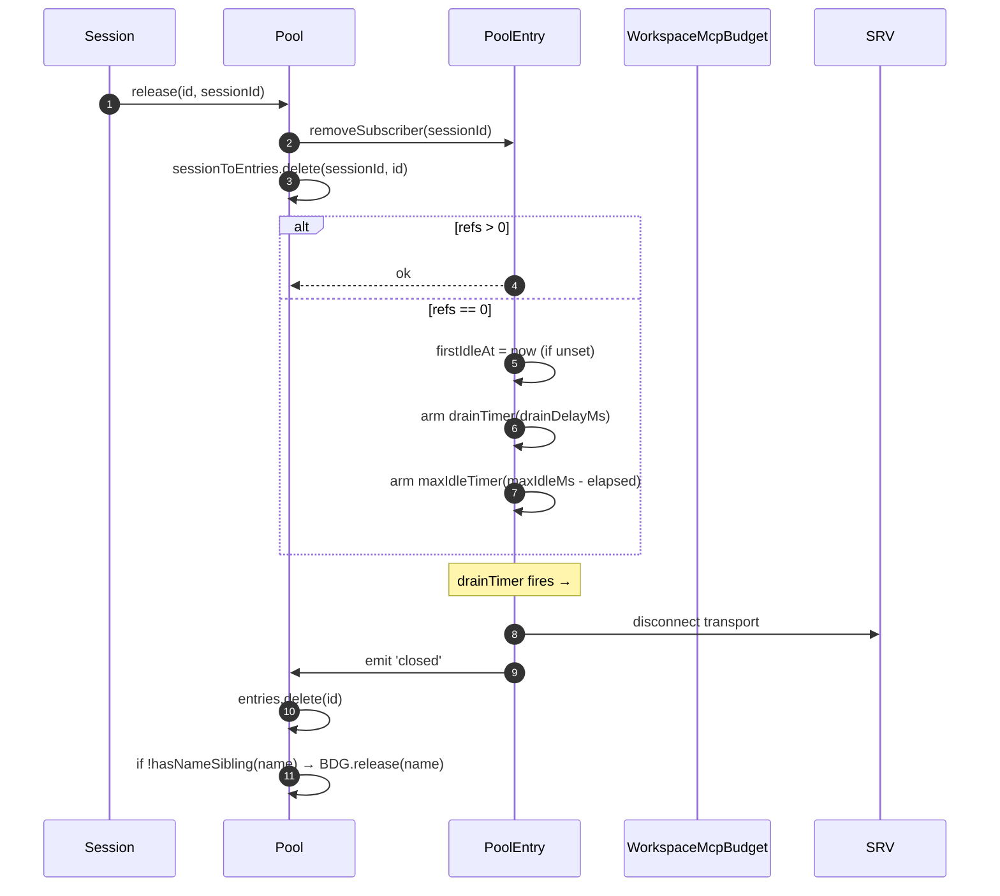
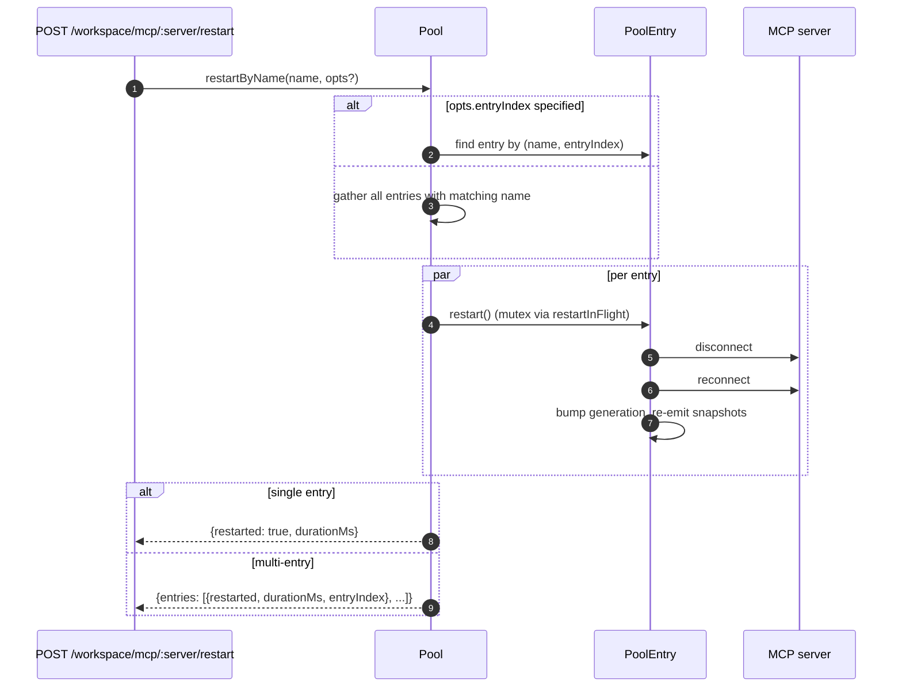
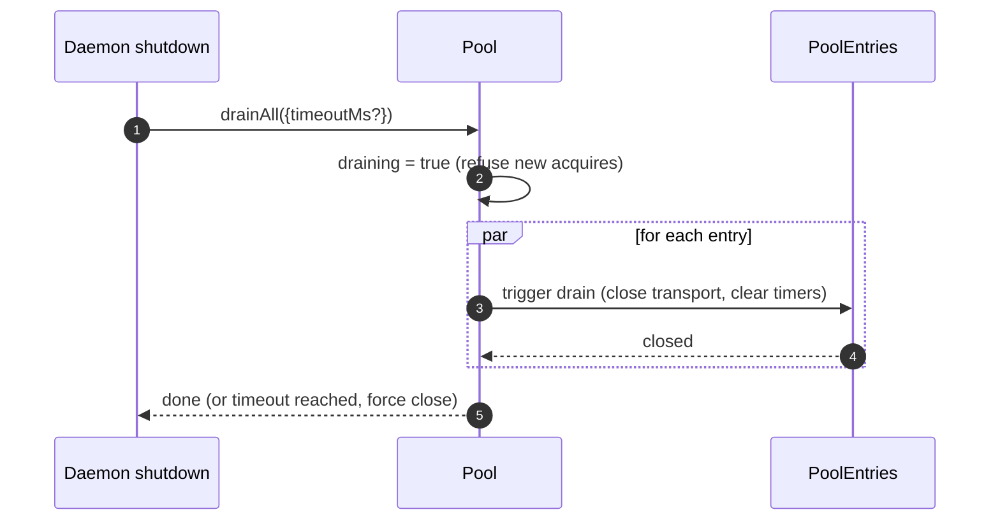

# Pool de Transporte MCP do Workspace

## Visão Geral

`McpTransportPool` (`packages/core/src/tools/mcp-transport-pool.ts`) é o pool com escopo de workspace do F2 (#4175 commit 5): múltiplas sessões ACP em um único daemon compartilham um único transporte por tupla `(serverName + configFingerprint)`, em vez de cada uma gerar seu próprio processo filho MCP. O pool reside **dentro do processo filho ACP** (`QwenAgent.mcpPool`), é construído uma vez na inicialização do agente com o `Config` de inicialização do daemon, e sobrevive aos ciclos de vida das sessões. As entradas contam referências de anexos de sessão e fecham após um período de carência configurável quando a contagem de referências chega a zero.

É o principal mecanismo que impede que um daemon com múltiplas sessões bifurque uma cópia de cada servidor MCP por sessão.

## Responsabilidades

- Adquirir ou iniciar um transporte MCP por `(nome + fingerprint)`, deduplicando aquisições concorrentes via `spawnInFlight`.
- Liberar referências por sessão; armar o timer de drenagem da entrada quando a última referência for desanexada.
- Sobreviver à oscilação de contagem de referências com um limite máximo `MAX_IDLE_MS` rígido para que um cliente com muitas operações não mantenha um transporte ocioso para sempre.
- Contar referências de sessões em um índice reverso (`sessionToEntries`) para que `releaseSession(sessionId)` seja O(refs) em vez de O(entries).
- Reiniciar entradas sob demanda (`restartByName`) — entrada única retorna `{restarted, durationMs}`, múltiplas entradas retornam `{entries: RestartResult[]}` (contrato de múltiplas entradas do F2).
- Drenar todo o pool no desligamento do daemon com um timeout configurável; recusar novas aquisições enquanto estiver drenando.
- Consultar `WorkspaceMcpBudget` (veja [`06-mcp-budget-guardrails.md`](./06-mcp-budget-guardrails.md)) em `acquire` para impor limites de reserva por nome; liberar o slot no fechamento da entrada quando nenhuma entrada irmã possuir o mesmo nome.
- Produzir snapshots filtrados de ferramentas/prompts por sessão via `SessionMcpView` para que uma descoberta em uma sessão não registre ferramentas em outras sessões.

## Arquitetura

### Superfície pública

```ts
class McpTransportPool {
  constructor(cliConfig: Config, options: McpTransportPoolOptions);
  acquire(
    serverName,
    cfg,
    sessionId,
    sessionToolRegistry,
    sessionPromptRegistry,
  ): Promise<PooledConnection>;
  release(id, sessionId): void;
  releaseSession(sessionId): void;
  restartByName(
    name,
    opts?,
  ): Promise<RestartResult | { entries: RestartResult[] }>;
  drainAll(opts?): Promise<void>;
  getBudget(): WorkspaceMcpBudget | undefined;
  getSnapshot(): McpPoolSnapshot;
}
```

`McpTransportPoolOptions`:

- `workspaceContext: WorkspaceContext` (obrigatório).
- `debugMode: boolean`.
- `sendSdkMcpMessage?` — callback por sessão (o pool ignora o SDK MCP).
- `pooledTransports?: ReadonlySet<McpTransportKind>` — padrão `{stdio, websocket}`. Transportes HTTP/SSE permanecem não agrupados por padrão porque seus cabeçalhos podem conter estado OAuth específico da sessão, mas operadores podem explicitamente optar por agrupá-los com `QWEN_SERVE_MCP_POOL_TRANSPORTS`.
- `drainDelayMs?` — padrão `30_000`.
- `entryOptions?: (transport) => PoolEntryOptions`.
- `budget?: WorkspaceMcpBudget`.

### Estado interno

| Estado              | Tipo                                    | Propósito                                                                                          |
| ------------------- | --------------------------------------- | -------------------------------------------------------------------------------------------------- |
| `entries`           | `Map<ConnectionId, PoolEntry>`          | Entradas ativas do pool indexadas por `connectionIdOf(name, fingerprint)`.                         |
| `unpooledIds`       | `Set<ConnectionId>`                     | Entradas para transportes fora da lista de permissões `pooledTransports` configurada.              |
| `spawnInFlight`     | `Map<ConnectionId, Promise<PoolEntry>>` | Deduplica aquisições a frio concorrentes para a mesma chave.                                      |
| `sessionToEntries`  | `Map<string, Set<ConnectionId>>`        | Índice reverso V21-2 para `releaseSession` em O(refs).                                             |
| `draining`          | `boolean`                               | Mutex de drenagem — uma vez definido, todas as chamadas `acquire` rejeitam.                        |
| `nextIndexByName`   | `Map<string, number>`                   | `entryIndex` monotônico V21-7 por nome de servidor (dashboards não reordenam quando uma nova entrada aparece). |

### `PoolEntry` (estrutura por entrada, `mcp-pool-entry.ts`)

Máquina de estados: `spawning → active ⇄ (active ↔ reconnect) → (active → draining no último desanexo, draining → active no anexo OU draining → closed no timer)`.

| Campo                                                 | Propósito                                                                           |
| ----------------------------------------------------- | ----------------------------------------------------------------------------------- |
| `localStatus: MCPServerStatus`                        | Orientado pelo ciclo de vida `MCPServerStatus`.                                     |
| `state: PoolEntryState`                               | `spawning`/`active`/`draining`/`closed`/`failed`.                                   |
| `generation: number`                                  | Incrementado a cada reinicialização; assinantes comparam para detectar ciclos de reconexão. |
| `refs: Set<string>`                                   | IDs de sessão atualmente anexados.                                                  |
| `subscribers: Map<string, SessionMcpView>`            | Visualizações filtradas por sessão.                                                 |
| `subscriberHandles: Map<string, PooledConnectionImpl>` | Handles retornados de `acquire`.                                                    |
| `toolsSnapshot[], promptsSnapshot[]`                  | Snapshots canônicos no nível do pool; reemitidos em `toolsChanged` / `promptsChanged`. |
| `drainTimer?`                                         | Armado quando `refs.size === 0`; padrão 30s. Redefinido no anexo.                   |
| `maxIdleTimer?`                                       | Armado na primeira ociosidade; nunca redefinido por oscilações de acquire/release. Padrão 5 min. |
| `firstIdleAt?`                                        | Marcador para o limite máximo de ociosidade.                                         |
| `restartInFlight?`                                    | Mutex para `restart()`.                                                             |
### `PoolEntryOptions`

```ts
interface PoolEntryOptions {
  drainDelayMs: number; // default 30_000
  maxIdleMs: number; // default 5 * 60_000
  maxReconnectAttempts: number; // default 3 (stdio/ws) or 5 (http/sse)
  reconnectStrategy:
    | { kind: 'fixed'; delayMs: number }
    | { kind: 'exponential'; baseMs: number; capMs: number };
}
```

`defaultPoolEntryOptions(transport)` (`mcp-pool-entry.ts`) retorna os padrões stdio/ws `{fixed 5s, 3 tentativas}` e http/sse `{exponential 1s → 16s, 5 tentativas}`. Transportes remotos recebem orçamentos de repetição maiores porque suas falhas são mais frequentemente transitórias.

## Workflow

### `acquire`

```mermaid
sequenceDiagram
    autonumber
    participant S as Session
    participant P as Pool
    participant SIF as spawnInFlight
    participant E as PoolEntry
    participant BDG as WorkspaceMcpBudget
    participant SRV as MCP server

    S->>P: acquire(name, cfg, sessionId, sessionToolRegistry, sessionPromptRegistry)
    P->>P: refuse if draining
    P->>P: connectionId = connectionIdOf(name, fingerprint)
    P->>P: if !isPoolable(cfg) → mark unpooled
    alt entry in entries (warm)
        E-->>P: existing PoolEntry
    else inflight cold spawn
        SIF-->>P: existing Promise<PoolEntry>
    else cold start
        P->>BDG: tryReserve(name) (if budget set + poolable)
        BDG-->>P: 'reserved' | 'already_held' | 'refused'
        alt refused
            P->>BDG: recordRefusal(name, transport)
            P-->>S: BudgetExhaustedError
        else ok
            P->>E: spawnEntry(name, cfg)
            E->>SRV: connect transport
            SRV-->>E: ready
            P->>P: entries.set(id, E); nextIndexByName++
            E-->>P: connected
        end
    end
    P->>E: addSubscriber(sessionId, sessionToolRegistry, sessionPromptRegistry)
    P->>P: sessionToEntries.add(sessionId, id)
    P->>P: cancel drain timer (refs>0)
    P-->>S: PooledConnection { id, serverName, entryIndex, client, toolsSnapshot, promptsSnapshot, on, off, release }
```

### `release` + drain



`hasNameSibling(name)` (`mcp-transport-pool.ts`) itera tanto `entries.values()` quanto `spawnInFlight.keys()`, interpretando este último com `parseConnectionId` (nomes de servidor podem conter legitimamente `::`, então `startsWith` resultaria em falso positivo em um nome irmão começando com `${name}::`).

`releaseSession(sessionId)` lê de `sessionToEntries`, libera todas as entradas referenciadas em O(refs), em seguida limpa a entrada do índice. Usado pelo caminho de fechamento de sessão da bridge para que não itere o mapa completo de entradas.

### `restartByName`



A verificação de orçamento de pré-voo na camada HTTP do daemon retorna `{restarted:false, skipped:true, reason:'budget_would_exceed'}` (controle de mutação Wave 4) quando o slot do destino não está já reservado e uma reinicialização elevaria a contagem ativa acima do orçamento `enforce`.

### `drainAll`



## State & Lifecycle

- A construção do Pool é síncrona; a primeira chamada `acquire` dá partida a frio em um transporte.
- `drainDelayMs` (padrão 30s) é redefinido para cancelamento ao anexar.
- `maxIdleMs` (padrão 5 min) **nunca** é redefinido por attach/detach — ele começa a contar a partir da PRIMEIRA ociosidade e só para quando a entrada efetivamente fecha ou anexa antes do prazo. Defesa contra clientes que causam thrash.
- `nextIndexByName` é monotônico. Entradas antigas mantêm seu índice atribuído mesmo após novas aparecerem, para que dashboards lendo `entryIndex` não reorganizem.
- Falha ao spawn libera o slot de orçamento reservado (V21-4 — sem isso, um spawn a frio que falhasse no meio da conexão vazaria a reserva para sempre).
## Dependências

- `packages/core/src/tools/mcp-client.ts` — `McpClient`, enum de status, `SendSdkMcpMessage`.
- `packages/core/src/tools/mcp-pool-entry.ts` — `PoolEntry`, `PoolEntryOptions`, `defaultPoolEntryOptions`.
- `packages/core/src/tools/mcp-pool-key.ts` — `connectionIdOf`, `parseConnectionId`, `isPoolable`, `mcpTransportOf`, `POOLED_TRANSPORTS_DEFAULT`.
- `packages/core/src/tools/mcp-pool-events.ts` — `ConnectionId`, `PoolEntryState`, `PoolEvent`.
- `packages/core/src/tools/session-mcp-view.ts` — visualização por sessão que filtra snapshots do pool.
- `packages/core/src/tools/mcp-workspace-budget.ts` — `WorkspaceMcpBudget` (veja [`06-mcp-budget-guardrails.md`](./06-mcp-budget-guardrails.md)).
- `packages/core/src/tools/mcp-discovery-timeout.ts` — `discoveryTimeoutFor`, `runWithTimeout`.

## Configuração

| Fonte                        | Opção                                                           | Efeito                                                                                                         |
| ----------------------------- | --------------------------------------------------------------- | -------------------------------------------------------------------------------------------------------------- |
| Env                           | `QWEN_SERVE_NO_MCP_POOL=1`                                      | Chave de desligamento — `QwenAgent.mcpPool` permanece indefinido; `McpClientManager` por sessão aplica (caminho pré-F2). |
| Flag                          | `--mcp-client-budget=N`, `--mcp-budget-mode={off,warn,enforce}` | Encaminhado para o filho do ACP via `childEnvOverrides`; o filho constrói `WorkspaceMcpBudget` e passa para o pool. |
| Tags de capacidade (condicional) | `mcp_workspace_pool`, `mcp_pool_restart`                        | Anunciadas juntas quando o pool está ativo. O SDK faz pré-verificação de ambas para ramificar nas formas de resposta cientes do pool. |

### Entradas não agrupadas (HTTP / SSE / SDK-MCP)

Transportes fora da lista de permissões `pooledTransports` configurada (HTTP, SSE e SDK-MCP por padrão) seguem um caminho separado: `createUnpooledConnection(name, cfg, sessionId, ...)` (`mcp-transport-pool.ts`) cria uma entrada por sessão com o id `${name}::unpooled-${entryIndex}`. Diferenças em relação às entradas agrupadas:

- Armazenado em `entries` E rastreado em `unpooledIds: Set<ConnectionId>` para que `release` / `releaseSession` possam usar caminho rápido para o comportamento de fechar ao desanexar (referências sempre no máximo 1).
- `McpClient.discover()` é usado diretamente em vez de repetição do pool; `applyTools` / `applyPrompts` são operações nulas porque os registros da sessão já contêm o que foi registrado (W77 / `skipReplay: true` no `attach()`).
- O orçamento do workspace ainda as controla — o acompanhamento do orçamento F2 fechou a brecha anterior onde conexões não agrupadas ignoravam `tryReserve`; o mesmo slot de `WorkspaceMcpBudget` é reservado e liberado no fechamento da entrada (seja agrupada ou não).

A condição de corrida W77 (`cb206da36`): `createUnpooledConnection` armazena a entrada em `this.entries` ANTES de aguardar `client.connect()` / `client.discover()`, mas só indexa `sessionToEntries[sessionId]` DEPOIS que `attach()` é bem-sucedido. Uma `closeStoredSession()` / `releaseSession(sessionId)` concorrente durante a janela de connect/discover viu um índice vazio, deixou a criação não agrupada terminar, e `attach()` então registrou ferramentas/prompts em uma sessão já fechada. A correção:

- `mcp-pool-entry.ts`: sonda pública `isTerminated(): boolean` (`state === 'closed' || state === 'failed'`).
- `mcp-pool-entry.ts`: `markActive()` entra em curto-circuito se `isTerminated()` para que uma entrada destruída não possa ser ressuscitada para `'active'`.
- Chamadores (o caminho não agrupado do pool) verificam `isTerminated()` entre as esperas e abortam o attach se a sessão pai tiver desaparecido.

Essa condição de corrida estava latente na época (os hooks `releaseSession` por sessão do W61/W71 chegam no F4), mas se tornaria ativa no momento em que esse hook chegasse. A correção foi aplicada no início da série F2.

## Campos de snapshot cientes do pool em `GET /workspace/mcp`

Quando o pool está ativo, cada célula de servidor `ServeWorkspaceMcpStatus`
(`packages/acp-bridge/src/status.ts`) inclui três campos adicionais:

| Campo            | Tipo                                        | Propósito                                                                                                                                                                                                                                                                                                                                          |
| ---------------- | ------------------------------------------- | -------------------------------------------------------------------------------------------------------------------------------------------------------------------------------------------------------------------------------------------------------------------------------------------------------------------------------------------------- |
| `disabledReason` | `'config' \| 'budget'`                      | Distingue servidores desabilitados pelo operador (`disabled: true` de `disabledMcpServers`) de recusa por orçamento (`status: 'error', errorKind: 'budget_exhausted'`). Os painéis podem renderizar uma linha de servidor sem ler cruzado `errors[]` ou `budgets[]`.                                                                                |
| `entryCount`     | `number` (`>=1`)                            | No modo pool, um workspace pode ter múltiplas instâncias de `PoolEntry` com o mesmo nome quando as sessões injetam impressões digitais diferentes, como cabeçalhos OAuth por sessão. Este campo está ausente quando `QWEN_SERVE_NO_MCP_POOL=1` desabilita o pool. Novos clientes renderizam um selo "N entries" quando `entryCount > 1`.              |
| `entrySummary`   | `ReadonlyArray<{entryIndex, refs, status}>` | Detalhamento por entrada. `entryIndex` é o inteiro opaco estável atribuído quando a entrada foi criada; não é a impressão digital bruta, portanto as diferenças de snapshot não vazam OAuth ou tempo de rotação de ambiente. `refs` é a contagem atual de sessões anexadas. `status` permite que os painéis mostrem a saúde de cada entrada enquanto o `mcpStatus` agregado já está conectado. |
`(entryCount, entrySummary)` são sempre transmitidos como um par. A
tag de capacidade `mcp_workspace_pool` implica em ambos os campos. Clientes
SDK mais antigos os ignoram sob o contrato de protocolo aditivo.

Snapshots do pool também expõem `subprocessCount`. Ele conta apenas a
família `'stdio'`. Transportes WebSocket, HTTP e SSE conectam-se a servidores
remotos e não geram processos filhos locais. Versões iniciais contavam
transportes WebSocket como subprocessos locais, o que inflava os painéis de
recursos.

## Dreno é executado a partir de ambos os caminhos de desligamento

O dreno do pool não está limitado ao manipulador SIGTERM. O caminho normal de
desligamento da IDE (`await connection.closed`) também chama `drainAll` via
`drainPoolBeforeExit` em `packages/cli/src/acp-integration/acpAgent.ts`. Quer o
daemon receba um sinal de processo ou a IDE feche sua conexão de forma limpa,
o pool entra em `draining`, recusa novas aquisições e aguarda o fechamento das
entradas.

## `/mcp refresh` compartilha o caminho de descoberta inicial

`discoverAllMcpTools` (descoberta inicial) e
`discoverAllMcpToolsIncremental` (`/mcp refresh` / hot reload) ambos consultam o
pool primeiro no modo pool (`packages/core/src/tools/mcp-client-manager.ts`). O
gate compartilhado evita que o hot reload crie acidentalmente um cliente por
sessão, conte o orçamento duas vezes ou deixe um transporte órfão para trás.

## Chamadas de ferramenta em andamento durante reconexão (`MCPCallInterruptedError`)

Quando o transporte MCP subjacente desconecta silenciosamente (a conexão salta
de `'active'` / `'draining'` para `localStatus === DISCONNECTED` sem um
fechamento explícito), o pool marca a entrada como `'failed'`, a remove de
`pool.entries` e emite o evento `failed` antes de desanexar as visões dos
assinantes. Essa ordem de emitir antes de desanexar é importante: os assinantes
recebem o evento `failed` cedo o suficiente para rotear as promessas `callTool`
pendentes para `MCPCallInterruptedError`, de modo que um `await
client.callTool(...)` travado rejeite de forma limpa em vez de travar.
`forceShutdown` usa a mesma ordem de emitir-depois-desanexar.

## Fingerprint e normalização de `canonicalOAuth`

A chave do pool vem de `fingerprint(cfg)` em `mcp-pool-key.ts`. O hash cobre
todos os campos que definem o transporte:

> `transport, command, args, cwd, env, url, httpUrl, tcp, headers, timeout, oauth`

Campos de filtragem por sessão e metadados (`includeTools`, `excludeTools`,
`trust`, `description`, `extensionName`, `discoveryTimeoutMs`) são excluídos,
de modo que sessões com filtros diferentes podem compartilhar uma entrada.

Para a célula OAuth, `canonicalOAuth(o)` faz hash de cada campo de
`MCPOAuthConfig`: `clientId`, `clientSecret`, `scopes` ordenados,
`audiences` ordenados, `authorizationUrl`, `tokenUrl`, `redirectUri`,
`tokenParamName` e `registrationUrl`. Este é o contrato de isolamento de
credenciais: duas configurações de sessão que diferem apenas por
`clientSecret`, `audiences` ou `redirectUri` obtêm fingerprints diferentes e
não podem compartilhar uma entrada. Clientes confidenciais e implantações de
token com múltiplas audiências dependem disso.

Ordenar `scopes` e `audiences` torna a ordem da chamada irrelevante.
`null` explícito é normalizado para que campos indefinidos tenham o mesmo hash
que null explícito. A chave não inclui `discoveryTimeoutMs`; chamadas de
aquisição concorrentes com a mesma chave, mas timeouts diferentes, seguem a
regra de "primeiro vence", correspondendo ao comportamento do gerenciador por
sessão pré-F2.

`PoolEntry` mantém `cfg: MCPServerConfig` privado. Código externo deve usar o
getter `entry.transportKind` quando precisar da família de transporte. Isso
impede que campos de env, cabeçalhos de autenticação e OAuth vazem para
consumidores acidentalmente.

## Descarregamentos de extensão dependem de `MAX_IDLE_MS`

Não há intencionalmente um caminho de limpeza ativo para descarregar uma
extensão MCP em tempo de execução. Entradas órfãs cujo `MCPServerConfig` não
aparece mais nas configurações mescladas do workspace são recuperadas
naturalmente pelo limite máximo `MAX_IDLE_MS` após o último assinante se
desanexar. Um caminho de limpeza síncrono no descarregamento adicionaria
complexidade para um caso de borda raro de operador; o limite máximo limita o
tempo de vida do processo órfão após o ponto de descarregamento para 5 minutos
por padrão.

Operadores que precisam de limpeza mais rápida podem reiniciar o daemon ou
chamar `POST /workspace/mcp/:server/restart` para o nome agora não configurado,
o que passa pelo caminho de servidor desabilitado e derruba a entrada.

## Observabilidade de autocorreção

O pool emite dois diagnósticos estruturados no caminho de autocorreção:

**`McpClient.lastTransportError: Error | undefined`** (`packages/core/src/tools/mcp-client.ts`) — `McpClient.onerror` armazena a exceção de transporte mais recente em um campo privado e a limpa na entrada de `connect()`. O caminho de descarte silencioso de `PoolEntry` lê `client.getLastTransportError()` e o inclui em `emit({kind:'failed', lastError})`, para que assinantes e painéis não precisem vasculhar stderr em busca da causa raiz.

**`SweepResult`** (interface interna, não exportada; `packages/core/src/tools/mcp-pool-entry.ts`) — `sweepAndDisconnect(reason)` retorna `Promise<SweepResult>`:

```ts
interface SweepResult {
  pidSweepError?: Error; // listDescendantPids lançou exceção
  descendantsFound?: number; // número de PIDs descendentes encontrados
  descendantsSignaled?: number; // número de SIGTERM bem-sucedidos
}
```
O único consumidor é o bloco `silent-drop` em `statusChangeListener`. Ele usa `descendantsFound` / `descendantsSignaled` para detectar casos de sinalização parcial (menos processos sinalizados do que encontrados, geralmente porque um processo foi encerrado ou ocorreu um EPERM entre `listDescendantPids` e `sigtermPids`) e erros de varredura, e então registra um aviso estruturado. `forceShutdown` e `doRestart` ignoram esse valor de retorno porque seus caminhos de `catch` já carregam sinais de falha mais completos.

## Limpeza de subprocessos: o caminho do snapshot `pid-descendants`

Quando `McpTransportPool` encerra subprocessos stdio, ele precisa enumerar seus processos descendentes; wrappers `npx` e wrappers de shell podem criar múltiplos níveis de bifurcação. `packages/core/src/tools/pid-descendants.ts` expõe `listDescendantPids(rootPid) → Promise<number[]>` e `sigtermPids(pids)` para `sweepAndDisconnect`.

### Caminho principal no Linux / macOS

Um único snapshot `ps -A -o pid=,ppid=` lê a tabela de processos, a analisa em `Map<ppid, pid[]>`, e então `walkDescendants(tree, root)` realiza uma BFS para extrair a subárvore. Qualquer profundidade requer apenas um fork de `ps`.

`walkDescendants` mantém `visited: Set<number>` e inclui `root` no conjunto para se defender contra ciclos de reutilização de PID. Sob uma rápida rotatividade de processos, o snapshot pode teoricamente conter loops A→B / B→A. Sem `visited`, o caminhador poderia preencher a cota `MAX_DESCENDANTS` com dados falsos e sufocar os descendentes reais.

### Caminho principal no Windows

Um único snapshot `Get-CimInstance Win32_Process | ConvertTo-Csv -Delimiter ","` emite todas as linhas `(ProcessId, ParentProcessId)`, e então o mesmo `Map` e `walkDescendants` são executados.

O `-Delimiter ","` explícito é necessário. O PowerShell 5.1, que acompanha o Windows, define como padrão do `ConvertTo-Csv` o separador de lista de localidade do sistema; localidades DE, FR, NL, IT e similares usam `;`, então o analisador de prefixo `^"(\d+)","(\d+)"$` nunca correspondia e todo desligamento de daemon caía no caminho de filtro CIM por PID, adicionando aproximadamente 0,5–1s de custo de inicialização do PowerShell por filho.

### Caminho alternativo

BusyBox `<v1.28` não possui `ps -o`, contêineres distroless podem não incluir `ps`, e alguns ambientes Windows truncam a saída CIM via ACLs. Quando o caminho principal analisa zero linhas ou lança uma exceção, o código recai para uma BFS por PID: Linux / macOS usam `pgrep -P <pid>`, e Windows usa `Get-CimInstance -Filter "ParentProcessId=$p"` onde `$p` é uma vinculação de variável do PowerShell em vez de concatenação de strings. A proteção atual `Number.isInteger` é suficiente para o ponto de entrada; a vinculação é uma defesa em profundidade.

### Restrições compartilhadas

Ambos os caminhos são limitados por `MAX_DESCENDANTS = 256` e `MAX_DEPTH = 8` para evitar que uma árvore de processos maliciosa ou degenerada prejudique a varredura.

O caminho de snapshot usa `maxBuffer: 8MB`, suficiente para hosts patológicos com cerca de 250 mil processos. O buffer padrão de 1MB do Node pode truncar a saída de processos filho em torno de 30 mil processos.

O ganho de desempenho é intencionalmente modesto (máquinas de desenvolvimento típicas com 200–500 processos analisam em menos de 10ms, cerca de 2x mais rápido que `pgrep` por PID). O principal benefício é a higiene de forks e a consistência do snapshot: a BFS vê toda a subárvore de uma só vez, enquanto o caminho anterior de consulta por PID poderia perder um neto bifurcado entre duas consultas.

## Nota para integradores: construtor do `McpClientManager`

`McpClientManager` é construído como `(config, toolRegistry, options?: McpClientManagerOptions)`. Integradores que importam a classe diretamente devem passar:

```ts
new McpClientManager(config, toolRegistry, {
  eventEmitter,
  sendSdkMcpMessage,
  healthConfig,
  budgetConfig,
  pool,
});
```

Testes devem preferir uma fábrica `mkManager(overrides?)` para que casos que se preocupam com um ou dois campos permaneçam em uma linha.

## Notas de implementação

Esses auxiliares são internos, mas leitores do código-fonte podem vê-los:

- `McpTransportPool.acquire()` usa `attachPooledSession` e `rollbackReservationOnSpawnFailure` para compartilhar o comportamento de anexação de caminho rápido, anexação pós-spawn e captura de spawn em andamento em pool. O comportamento em tempo de execução não muda; as invariantes de janela de corrida ainda residem nos locais de chamada.
- `SessionMcpView.applyTools` / `applyPrompts` compila `includeTools` / `excludeTools` uma vez via `compileNameFilter(cfg)` e verifica cada ferramenta com `compiledFilterAccepts(compiled, name)`. As funções exportadas `passesSessionFilter` / `passesSessionPromptFilter` usam o mesmo caminho compilado. `excludeTools` é correspondência exata; `includeTools` remove o primeiro sufixo `(...)` para que `toolName(args)` corresponda a `toolName`.

Documento de design: [`../../design/f2-mcp-transport-pool.md`](../../design/f2-mcp-transport-pool.md) §6 cobre a máquina de estados do pool de transporte, reconexão, drenagem e caminhos de varredura de descendentes.

## Riscos e Limitações Conhecidas

- **Transportes HTTP / SSE não são agrupados por padrão** — a menos que os operadores os incluam explicitamente em `QWEN_SERVE_MCP_POOL_TRANSPORTS`, cada `acquire` cria uma nova entrada que vive apenas enquanto sua sessão. Seus cabeçalhos podem carregar estado OAuth específico da sessão, então agrupá-los por padrão correria o risco de vazar credenciais entre sessões.
- **`maxIdleMs` é um limite rígido que sobrevive à rotatividade de anexação/desanexação.** Um limite rígido de 5 minutos de inatividade significa que mesmo um cliente que anexa/desanexa agressivamente não pode manter um transporte ocioso fixado por mais de 5 minutos. Operadores que desejam transportes fixos de longa duração devem aumentar `maxIdleMs` ou executar o servidor fora do pool.
- **Slots de orçamento por nome de servidor** significam que duas entradas de pool que compartilham um nome, mas diferem por impressão digital, consomem UM slot juntas, não dois. A contabilização de subprocessos é exposta separadamente via `pool.getSnapshot().subprocessCount`.
- **A regressão do `startsWith`** foi evitada em `hasNameSibling` porque nomes de servidores MCP podem conter legitimamente `::` (`mcp-pool-key.test.ts`). Sempre use a divisão por `lastIndexOf('::')` do `parseConnectionId`, nunca correspondência prefixo de string.
- **A drenagem do pool é unidirecional** — `drainAll` define `draining = true` permanentemente; um novo pool é necessário para trabalhos futuros.
## Referências

- `packages/core/src/tools/mcp-transport-pool.ts` (arquivo completo)
- `packages/core/src/tools/mcp-pool-entry.ts` (ciclo de vida da entrada)
- `packages/core/src/tools/mcp-pool-key.ts` (`connectionIdOf`, `parseConnectionId`)
- `packages/core/src/tools/mcp-pool-events.ts` (tipos de evento)
- `packages/core/src/tools/session-mcp-view.ts` (visão filtrada por sessão)
- Documento de design F2 (v2.2, com o changelog de revisão de 32 itens incorporado): [`../../design/f2-mcp-transport-pool.md`](../../design/f2-mcp-transport-pool.md). Trate o contrato de design como autoritativo; esta página é o mergulho profundo do desenvolvedor.
- Notas de design F2: issue [#4175](https://github.com/QwenLM/qwen-code/issues/4175) (commits 4-6 da série F2).
