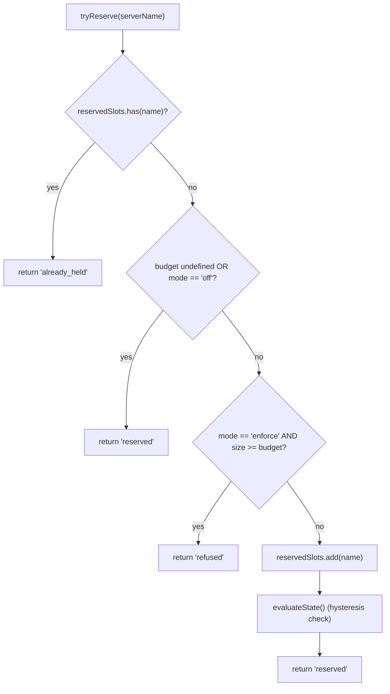
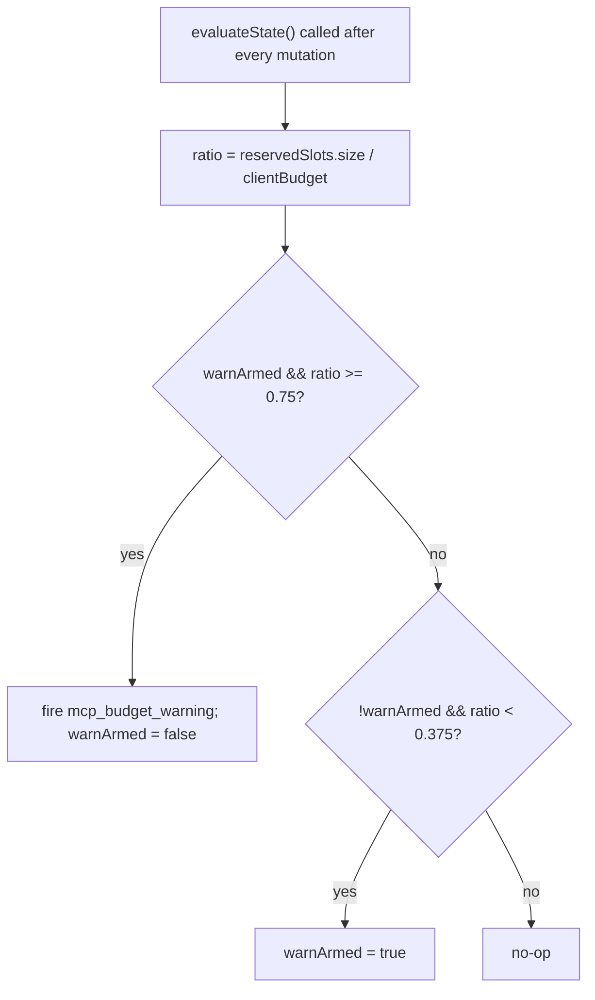

# Proteções de Orçamento do Workspace MCP

## Visão Geral

`WorkspaceMcpBudget` (`packages/core/src/tools/mcp-workspace-budget.ts`) é o controlador de orçamento do cliente MCP no escopo do workspace do F2 (#4175 commit 6). Ele possui a mesma máquina de estados que `McpClientManager` carrega inline (reserva de slot, aviso de histerese de 75%, coalescência de recusas em lote em uma passagem `discoverAllMcpTools*`), mas reside **uma vez por workspace** dentro de `McpTransportPool` em vez de uma vez por sessão dentro do gerenciador de cada filho do ACP. O pool delega chamadas `acquire` e `release` aqui para que o limite se aplique ao **workspace**, não a cada sessão.

A maquinaria de orçamento legada do `McpClientManager` permanece para servidores MCP standalone qwen e SDK (que ignoram o pool conforme correção do commit 4). Modo pool → `WorkspaceMcpBudget` aplica; standalone / SDK MCP → maquinaria inline do gerenciador aplica. Sem contagem dupla porque a descoberta no modo pool nunca chama `tryReserveSlot` do gerenciador.

## Responsabilidades

- Rastreia `reservedSlots: Set<string>` dos NOMES de servidor atualmente mantidos (chave do slot é por NOME, correspondendo ao PR 14 v1).
- `tryReserve(name) → 'reserved' | 'already_held' | 'refused'` — atômico e síncrono para que aquisições concorrentes com `Promise.all` não possam ultrapassar o limite em um ponto de `await`.
- `release(name) → boolean` — idempotente (semântica de `Set.delete`).
- Dispara `mcp_budget_warning` uma vez ao cruzar para cima 75% de `reservedSlots.size / clientBudget`; rearma apenas após um cruzamento para baixo de 37,5%.
- Agrupa recusas por servidor em uma passagem de descoberta em massa — `beginBulkPass()` / `endBulkPass()` delimitam a acumulação de recusas em um único evento `mcp_child_refused_batch`.
- Mantém `lastRefusedServerNames` para consumidores de snapshot (`GET /workspace/mcp`) — limpo no INÍCIO da próxima passagem em massa, NÃO na emissão, para que um snapshot entre passagens ainda veja o último conjunto de recusas.

## Arquitetura

### Configuração

```ts
new WorkspaceMcpBudget({
  clientBudget?: number,           // undefined = ilimitado
  mode: 'off' | 'warn' | 'enforce',
  onEvent?: (event: McpBudgetEvent) => void,
});
```

Semântica do `mode`:

- `off` — todos os métodos são no-ops; `tryReserve` retorna `'reserved'` incondicionalmente; nenhum evento é disparado.
- `warn` — os slots são rastreados e `mcp_budget_warning` é disparado em 75%, mas `tryReserve` NUNCA recusa.
- `enforce` — `tryReserve` recusa além de `clientBudget`; `recordRefusal` enfileira recusas por servidor; `endBulkPass` emite `mcp_child_refused_batch`.

### Constantes de `mcp-client-manager.ts`

- `MCP_BUDGET_WARN_FRACTION = 0.75` — limiar ascendente.
- `MCP_BUDGET_REARM_FRACTION = 0.375` — rearme de histerese descendente.
- `McpBudgetMode = 'off' | 'warn' | 'enforce'`.

### Estado interno

| Estado                                  | Propósito                                                                                                      |
| --------------------------------------- | -------------------------------------------------------------------------------------------------------------- |
| `reservedSlots: Set<string>`            | Conjunto autoritativo de reservas; a histerese avalia `size / clientBudget`.                                   |
| `pendingRefusalNames: Set<string>`      | Nomes de recusa acumulados durante a janela atual de `beginBulkPass`/`endBulkPass`; esvaziado no `endBulkPass`. |
| `pendingRefusalTransports: Map<string, transport>` | Sidecar para que o lote emitido carregue o transporte de cada servidor recusado.                                |
| `lastRefusedServerNames: readonly string[]` | Lista de recusas visível no snapshot da passagem completa mais recente. Limpa no início da próxima passagem. |
| `warnArmed: boolean`                      | Estado de histerese — true = pronto para disparar, false = já disparou desde o último esvaziamento de 37,5%.   |
| `bulkPassDepth: number`                   | Contador de reentrância para passagens em massa aninhadas (passagens aninhadas não devem emitir duas vezes).   |

## Fluxo de Trabalho

### `tryReserve`



`tryReserve` é **síncrono**. O `acquire` do pool é assíncrono, mas a reserva acontece antes de qualquer `await`, então duas aquisições concorrentes com `Promise.all` para nomes diferentes não podem ambas ultrapassar o limite.

### Histerese


Histerese evita avisos repetidos quando uma carga de trabalho oscila em torno de 75%. O primeiro cruzamento dispara; cruzamentos subsequentes sem cair para 37,5% não disparam.

### Coalescência de recusas em lote

```mermaid
sequenceDiagram
    autonumber
    participant POOL as pool.discoverAllMcpToolsViaPool
    participant BDG as WorkspaceMcpBudget
    participant EB as EventBus

    POOL->>BDG: beginBulkPass()
    BDG->>BDG: bulkPassDepth++<br/>clear lastRefusedServerNames if outermost
    loop per server in pass
        POOL->>BDG: tryReserve(name)
        alt refused
            POOL->>BDG: recordRefusal(name, transport)
            BDG->>BDG: pendingRefusalNames.add; pendingRefusalTransports.set
            Note over BDG: NO event yet (coalesce)
        end
    end
    POOL->>BDG: endBulkPass()
    BDG->>BDG: bulkPassDepth--
    alt outermost (depth == 0) AND pending non-empty
        BDG->>EB: emit mcp_child_refused_batch<br/>{refusedServers, budget, liveCount, reservedCount, mode: 'enforce', scope?: 'workspace'}
        BDG->>BDG: lastRefusedServerNames = drain pendingRefusalNames
    end
```

Recusas fora de passagem (ex.: `readResource` preguiçoso que ignora completamente a passagem em lote) emitem lotes de comprimento 1 inline para consistência de formato. Passagens aninhadas (`bulkPassDepth > 0`) não disparam; apenas a passagem mais externa ao final emite o lote coalescido.

## Estado e Ciclo de Vida

- O controlador de orçamento é construído uma vez por workspace na inicialização do pool.
- `clientBudget` é imutável após a construção; alterações em tempo de execução exigem reconstrução do pool.
- `mode` também é imutável (`onEvent` é armazenado como `undefined` quando `mode === 'off'` como defesa em profundidade).
- `warnArmed` inicia como true; é redefinido para true via o cruzamento descendente de 37,5%.
- `lastRefusedServerNames` NÃO é limpo na emissão de `endBulkPass` — apenas no INÍCIO da próxima passagem em lote. Isso permite que uma rota de snapshot chamada entre passagens ainda relate o último conjunto de recusas (caso contrário, os dashboards mostrariam recusas vazias imediatamente após a entrega de um evento de lote recusado).

## Dependências

- `packages/core/src/tools/mcp-client-manager.ts` — reutiliza `McpBudgetEvent`, `McpBudgetMode`, `McpRefusedServer`, `MCP_BUDGET_WARN_FRACTION`, `MCP_BUDGET_REARM_FRACTION`, `BudgetExhaustedError` (lançado pelo `acquire` do pool na recusa).
- `packages/core/src/tools/mcp-transport-pool.ts` — consome o orçamento; passa eventos para o EventBus do daemon via encanamento `onEvent` do pool.
- Rota de snapshot do daemon `GET /workspace/mcp` — lê `getReservedSlots()`, `getRefusedServerNames()`, `getReservedCount()`, `getBudget()`, `getMode()`.

## Configuração

| Fonte          | Controle                                                                                 | Efeito                                                                                       |
| -------------- | ---------------------------------------------------------------------------------------- | -------------------------------------------------------------------------------------------- |
| Flag           | `--mcp-client-budget=N`                                                                  | Define `clientBudget` para o controlador do workspace.                                       |
| Flag           | `--mcp-budget-mode={off,warn,enforce}`                                                   | Define `mode`. `enforce` requer um `clientBudget` positivo; caso contrário, a inicialização falha explicitamente. |
| Env            | `QWEN_SERVE_MCP_CLIENT_BUDGET`, `QWEN_SERVE_MCP_BUDGET_MODE`                             | Encaminhados para o filho ACP via `childEnvOverrides`; o filho os captura com `readBudgetFromEnv()`. |
| Tags de capacidade | `mcp_guardrails` (sempre; `modes: ['warn', 'enforce']`), `mcp_guardrail_events` (sempre) | Veja [`11-capabilities-versioning.md`](./11-capabilities-versioning.md).                      |

## Riscos e Limitações Conhecidas

- **A chave de reserva é por NOME.** Duas entradas do pool com o mesmo nome de servidor, mas fingerprints diferentes (ex.: sessões injetando cabeçalhos OAuth divergentes) consomem UM slot juntas. A contabilidade de subprocessos é exposta separadamente via `subprocessCount` do snapshot do pool. Operadores devem pensar no orçamento como "slots de servidor configurados", não "contagem de subprocessos".
- **A histerese dispara com base na contagem de reservas, não na contagem de CONECTADOS (live).** Reservas incluem conexões em andamento e sobrevivem a desconexões transitórias, portanto a histerese permanece estável durante ciclos de reconexão. A contagem de conectados é exposta nos payloads de evento como `liveCount` para consumidores SDK que desejam essa perspectiva.
- **O modo `warn` nunca recusa.** Ele ainda rastreia reservas e dispara `mcp_budget_warning`, mas `tryReserve` sempre retorna `'reserved'`. Semânticas de recusa são exclusivas do modo `enforce`.
- **Eventos de orçamento com escopo de workspace carregam `scope: 'workspace'`** para que se espalhem simultaneamente para todas as sessões anexadas. Os contadores `mcpBudgetWarningCount` / `mcpChildRefusedBatchCount` dos reducers SDK incrementam em sincronia entre sessões na mesma conexão. Eventos legados por sessão do `McpClientManager` não carregam `scope` (por padrão, são semanticamente `'session'`).
- **O kill switch `QWEN_SERVE_NO_MCP_POOL=1`** desabilita o pool completamente; o orçamento do workspace também é desabilitado, e o orçamento do `McpClientManager` por sessão assume o controle. O envelope de capacidades remove `mcp_workspace_pool` e `mcp_pool_restart` para relatar isso com precisão.
- **`ServeMcpBudgetStatusCell.scope` tem um formato de lista com compatibilidade futura.** Células de snapshot expõem `budgets[]`, não um único campo `budget?`. O PR 14 v1 emite uma célula `scope: 'session'` para cada sessão ACP porque `acpAgent.newSessionConfig()` constrói o `Config`/`McpClientManager` daquela sessão. O escopo `'pool'` é reservado para a célula com escopo de pool do PR 23 da Wave 5, que ficará ao lado das células com escopo de sessão. Consumidores devem tolerar valores `scope` adicionais desconhecidos descartando-os, em vez de falhar.
## Referências

- `packages/core/src/tools/mcp-workspace-budget.ts` (classe inteira)
- `packages/core/src/tools/mcp-client-manager.ts` (`BudgetExhaustedError`, `McpBudgetEvent`, constantes de histerese)
- `packages/core/src/tools/mcp-transport-pool.ts` (local de `acquire` do pool que chama `tryReserve`)
- Documento de design F2 (v2.2): [`../../design/f2-mcp-transport-pool.md`](../../design/f2-mcp-transport-pool.md) §11 para orçamento em nível de workspace e as entradas do changelog da v2.2 sobre orçamento e acompanhamentos de fingerprint.
- Notas de design F2: issue [#4175](https://github.com/QwenLM/qwen-code/issues/4175) commit 6.
