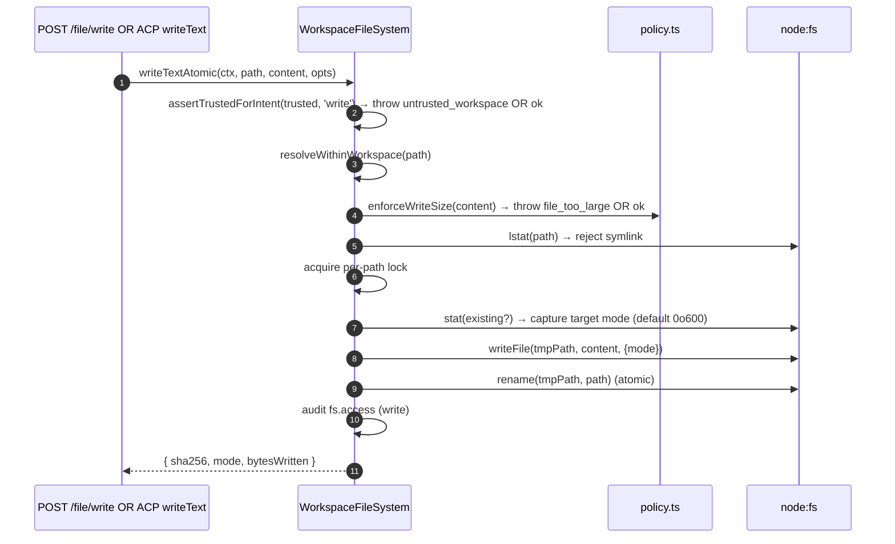
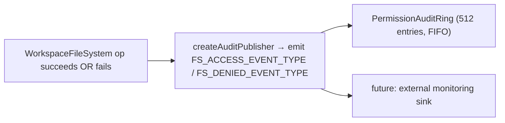

# Limite do Sistema de Arquivos do Workspace

## Visão Geral

O daemon nunca permite que rotas HTTP ou chamadas de agentes do lado do ACP toquem diretamente no sistema de arquivos do host. Cada leitura, escrita, listagem, glob e stat passa pelo limite do `WorkspaceFileSystem` (`packages/cli/src/serve/fs/`), que fornece:

- **Resolução de caminhos** — canonicaliza caminhos e rejeita qualquer coisa que escape do workspace vinculado, inclusive via symlinks.
- **Gate de confiança** — recusa escritas quando o workspace não é confiável (`untrusted_workspace`).
- **Política de tamanho e conteúdo** — limite de leitura (`MAX_READ_BYTES = 256 KiB`), limite de escrita (`MAX_WRITE_BYTES = 5 MiB`), detecção de binário.
- **Atomicidade** — escreve-e-depois-renomeia com preservação do modo do destino e padrão `0o600` para novos arquivos.
- **Auditoria** — cada acesso/negação emite um evento estruturado para `PermissionAuditRing` / monitoramento.
- **Erros tipados** — união fechada `FsErrorKind` mapeada para status HTTP.

As rotas HTTP de arquivo (`GET /file`, `GET /file/bytes`, `POST /file/write`, `POST /file/edit`, `GET /list`, `GET /glob`, `GET /stat`) e o adaptador `BridgeFileSystem` do lado do ACP (para que chamadas orientadas por agente `readTextFile` / `writeTextFile` passem pelas mesmas proteções) passam por esse limite.

## Responsabilidades

- Resolver caminhos fornecidos pelo usuário em valores `ResolvedPath` com marcação que o restante do limite pode usar com segurança.
- Recusar caminhos fora do workspace vinculado (`path_outside_workspace`) e caminhos cujo destino é um symlink (`symlink_escape`).
- Recusar leituras acima de `MAX_READ_BYTES`, escritas acima de `MAX_WRITE_BYTES` e arquivos binários (`binary_file`).
- Recusar escritas/edições quando o workspace não é confiável (`untrusted_workspace`) — protegido por `assertTrustedForIntent(trusted, intent)`.
- Honrar padrões de `.gitignore` / `.qwenignore` via `shouldIgnore`.
- Realizar escrita atômica com renomeação e preservação do modo do destino; o modo padrão para novos arquivos é `0o600`.
- Emitir eventos de auditoria `fs.access` / `fs.denied` em cada operação.
- Mapear cada falha para um `FsError` com tipo e status HTTP; manipuladores de rota serializam uniformemente.

## Arquitetura

### Layout dos módulos

| Arquivo                    | Propósito                                                                                                                                                                                                                                                |
| -------------------------- | -------------------------------------------------------------------------------------------------------------------------------------------------------------------------------------------------------------------------------------------------------- |
| `paths.ts`                 | `canonicalizeWorkspace`, `resolveWithinWorkspace`, `hasSuspiciousPathPattern`, `ResolvedPath` com marcação, união `Intent` (`read \| write \| list \| stat \| glob`).                                                                                    |
| `policy.ts`                | `MAX_READ_BYTES`, `MAX_WRITE_BYTES`, `BINARY_PROBE_BYTES`, `assertTrustedForIntent`, `detectBinary`, `enforceReadBytesSize`, `enforceReadSize`, `enforceWriteSize`, `shouldIgnore`.                                                                      |
| `audit.ts`                 | `FS_ACCESS_EVENT_TYPE`, `FS_DENIED_EVENT_TYPE`, `createAuditPublisher`, tipos de payload de auditoria.                                                                                                                                                   |
| `errors.ts`                | Classe `FsError`, `isFsError`, união `FsErrorKind` (14 tipos), união `FsErrorStatus` (`400 / 403 / 404 / 409 / 413 / 422 / 500 / 503`).                                                                                                                  |
| `workspace-file-system.ts` | `createWorkspaceFileSystemFactory`, `WorkspaceFileSystem` (o orquestrador que lê/escreve/lista), `WriteMode`, `ContentHash`, `FsEntry`, `FsStat`, `ListOptions`, `GlobOptions`, `ReadTextOptions`, `ReadBytesOptions`, `WriteTextAtomicOptions`.          |

### Taxonomia de `FsErrorKind`

| Tipo                       | HTTP Padrão | Significado                                                                                                                                                                                       |
| -------------------------- | ----------- | ------------------------------------------------------------------------------------------------------------------------------------------------------------------------------------------------- |
| `path_outside_workspace`   | 400         | Caminho resolvido está fora do workspace vinculado.                                                                                                                                               |
| `symlink_escape`           | 400         | O destino é um symlink (rejeitado conforme postura conservadora do PR 18 + PR 20).                                                                                                                |
| `path_not_found`           | 404         | `ENOENT`.                                                                                                                                                                                         |
| `binary_file`              | 422         | Conteúdo detectado como binário em uma rota de texto.                                                                                                                                             |
| `file_too_large`           | 413         | Acima de `MAX_READ_BYTES` ou `MAX_WRITE_BYTES`.                                                                                                                                                   |
| `hash_mismatch`            | 409         | `expectedSha256` de concorrência otimista falhou.                                                                                                                                                 |
| `file_already_exists`      | 409         | `mode: 'create'` contra um arquivo existente.                                                                                                                                                     |
| `text_not_found`           | 422         | A string de busca do `POST /file/edit` não foi encontrada no arquivo.                                                                                                                             |
| `ambiguous_text_match`     | 422         | Múltiplas correspondências quando exatamente uma era necessária.                                                                                                                                  |
| `untrusted_workspace`      | 403         | Escrita tentada em um workspace não confiável.                                                                                                                                                    |
| `permission_denied`        | 403         | `EACCES` / `EPERM` a nível de sistema operacional.                                                                                                                                                |
| `io_error`                 | 503         | `ENOSPC` / `EIO` / `EBUSY` / `ETXTBSY` / `ENAMETOOLONG` / `EMFILE` / `ENFILE`. **Distinto de `permission_denied`** para que pipelines de monitoramento não notifiquem equipes de segurança para "disco cheio". |
| `internal_error`           | 500         | Erro não-errno que atinge o limite (`TypeError`, bug de programador).                                                                                                                             |
| `parse_error`              | 400 / 422   | Erro de análise do corpo da requisição (400) ou violação de invariante de nível de serviço (422).                                                                                                 |
### `BridgeFileSystem` (o adaptador do lado ACP)

`packages/acp-bridge/src/bridgeFileSystem.ts` define:

```ts
interface BridgeFileSystem {
  readText(params: ReadTextFileRequest): Promise<ReadTextFileResponse>;
  writeText(params: WriteTextFileRequest): Promise<WriteTextFileResponse>;
}
```

Este é o ponto de injeção para `readTextFile` / `writeTextFile` do ACP. Testes da Bridge e chamadores incorporados do Modo A podem omiti-lo em `BridgeOptions`; `BridgeClient` recai ao seu proxy inline `fs.readFile` / `fs.writeFile` (preserva o comportamento pré-F1). Em produção, `qwen serve` conecta `BridgeFileSystem` através de `createBridgeFileSystemAdapter(fsFactory)` (`packages/cli/src/serve/bridge-file-system-adapter.ts`) para que as gravações ACP do lado do agente incorporem os mesmos portões TOCTOU, symlink, trust-gate e auditoria que as rotas HTTP usam.

Dois portões defensivos que o adaptador DEVE replicar (porque o proxy inline é completamente ignorado quando o adaptador é injetado):

1. **Rejeitar arquivos não regulares** — sockets / pipes / dispositivos de caractere / entradas procfs / sysfs podem transmitir dados ilimitados apesar de `stats.size === 0`. O caminho inline lança exceção com `describeStatKind(stats)` na mensagem.
2. **Limitar o tamanho do buffer** a `READ_FILE_SIZE_CAP = 100 MiB`. Uma requisição pequena `{ line: 1, limit: 10 }` contra um log de 500 MB custaria 500 MB de RSS apenas para retornar 10 linhas.

O adaptador vai além: usa `WorkspaceFileSystem.writeTextOverwrite` (primitivo do PR 18) para gravações atômicas com arquivo temporário e renomeação, preservação de modo, padrão `0o600` e rejeição de symlink dentro de um lock por caminho. Isso é uma **divergência do proxy inline pré-F1** que resolvia symlinks e escrevia através deles até o destino — agentes que dependiam de escrever através de dotfiles com symlink agora precisam endereçar o caminho resolvido diretamente.

### Preservação de FsError sobre o fio ACP

Quando o adaptador `BridgeFileSystem` lança um `FsError` (`kind: 'untrusted_workspace'` / `'symlink_escape'` / `'file_too_large'` / etc.), o caminho padrão de erro RPC do SDK ACP serializa apenas `error.message` como um genérico `-32603 "Internal error"` — `kind` / `status` / `hint` são removidos. O cliente RPC do agente downstream teria que usar regex na mensagem legível para despachar UI tipada (retry de autenticação vs seletor de arquivo vs dica de proxy).

`BridgeClient.writeTextFile` e `BridgeClient.readTextFile` instalam uma guarda fina (`packages/acp-bridge/src/bridgeClient.ts`) que captura lançamentos com formato de FsError e os relança como ACP `RequestError`:

```ts
function isFsErrorShape(err: unknown): err is FsErrorShape {
  return (
    err instanceof Error &&
    err.name === 'FsError' &&
    typeof (err as { kind?: unknown }).kind === 'string'
  );
}

function preserveFsErrorOverAcp(err: unknown): never {
  if (isFsErrorShape(err)) {
    throw new RequestError(-32603, err.message, {
      errorKind: err.kind,
      ...(err.hint !== undefined ? { hint: err.hint } : {}),
      ...(err.status !== undefined ? { status: err.status } : {}),
    });
  }
  throw err;
}
```

O cliente RPC do agente agora recebe `data.errorKind` (o valor fechado de `FsErrorKind`) mais os opcionais `data.hint` e `data.status`, permitindo que consumidores do SDK desviem pelo enum tipado em vez de usar regex na mensagem.

Duas notas de design:

- **Duck typing em vez de import** — `FsError` vive em `packages/cli/src/serve/fs/errors.ts` enquanto `BridgeClient` vive em `packages/acp-bridge`. Um `import { FsError }` direto inverteria a dependência. A verificação duck (`name === 'FsError'` + `kind: string`) espelha o que `mapDomainErrorToErrorKind` (`status.ts`) já faz para `TrustGateError` / `SkillError` pela mesma razão de empacotamento cross-package.
- **Código JSON-RPC permanece -32603** — a bridge não pode mapear `FsError.kind` de forma confiável para um código de erro JSON-RPC, então o campo estruturado `data` carrega a informação semântica para consumidores do SDK. O código de status no fio (`-32603` "internal error") não é alterado; clientes roteiam com base em `data.errorKind`.

### Trust gate

`assertTrustedForIntent(trusted, intent)` consome o booleano de confiança injetado pelo chamador; a camada de política não lê `Config.isTrustedFolder()` diretamente. Ler / listar / stat / glob são sempre permitidos (confiança é apenas para gravações). Intenções de gravação em workspaces não confiáveis lançam `FsError('untrusted_workspace', ..., status: 403)`. O sinal de confiança flui via `WorkspaceFileSystemFactoryDeps.trusted: boolean` — `runQwenServe` passa `true` porque o operador iniciou o daemon contra um workspace que implicitamente confia; `createServeApp` (incorporação direta sem `runQwenServe`) padrão é `false` e emite um aviso uma vez por processo (veja [`02-serve-runtime.md`](./02-serve-runtime.md)).

## Workflow

### Leitura

```mermaid
sequenceDiagram
    autonumber
    participant R as Rota HTTP OU BridgeFileSystem.readText
    participant FS as WorkspaceFileSystem
    participant POL as policy.ts
    participant FSP as node:fs

    R->>FS: readText(ctx, path, opts)
    FS->>FS: resolveWithinWorkspace(path) → ResolvedPath OU throw
    FS->>FSP: stat(path)
    FSP-->>FS: stats
    FS->>FS: rejeitar se não for arquivo regular (describeStatKind)
    FS->>POL: enforceReadSize(stats.size, opts.maxBytes?)<br/>→ throw file_too_large OU plano de slice
    FS->>FSP: readFile(path)
    FSP-->>FS: buffer
    FS->>POL: detectBinary(buffer)
    POL-->>FS: isBinary?
    FS->>FS: rejeitar se binário; hash sha256; truncar para janela de linhas
    FS->>FS: shouldIgnore? → anotar meta.matchedIgnore
    FS->>FS: auditoria fs.access
    FS-->>R: { content, sha256, truncated?, meta }
```
`readText` não ignora ou rejeita leituras devido a regras de ignorar. Ele lê o arquivo normalmente e registra a classificação de ignorar correspondente em `meta.matchedIgnore`. `list` e `glob` filtram resultados ignorados apenas quando `includeIgnored` não está habilitado.

### Gravação



A gravação atômica com escrita e renomeação garante que um SIGKILL / OOM no meio da gravação NÃO deixe o destino truncado. `mode: 'create'` aborta com `file_already_exists` no lstat; `mode: 'overwrite'` prossegue; `expectedSha256` habilita concorrência otimista (`hash_mismatch` em caso de incompatibilidade).

### `POST /file/edit` (substituição de texto única)

Adiciona dois modos de falha além da gravação:

- `text_not_found` (422) — string de busca não encontrada no arquivo.
- `ambiguous_text_match` (422) — múltiplas correspondências quando exatamente uma era necessária (contrato da rota).

### Propagação de auditoria



`FS_ACCESS_EVENT_TYPE` / `FS_DENIED_EVENT_TYPE` carregam contexto (`ctx`), caminho, intenção, resultado, errorKind?, bytesLidos/escritos, sha256?.

## Estado e Ciclo de Vida

- A fábrica é construída uma vez na inicialização do daemon (`runQwenServe` → `resolveBridgeFsFactory` → adapter).
- Cada requisição constrói um `RequestContext` e invoca o orquestrador da fábrica apenas para aquela chamada — sem estado persistente por arquivo.
- Locks por caminho duram apenas pela duração da operação de gravação (sem bloqueio entre chamadas; gravações concorrentes no mesmo caminho competem pelo lock e serializam).
- O anel de auditoria é de propriedade de `runQwenServe` e compartilhado com o publicador de auditoria de permissões.

## Dependências

- `@qwen-code/qwen-code-core` — `Ignore`, `isBinaryFile`, `Config.isTrustedFolder()`.
- `node:fs`, `node:path`, `node:crypto`.
- `@qwen-code/acp-bridge` — `BridgeFileSystem` contrato no lado ACP.
- Rotas HTTP: `packages/cli/src/serve/routes/workspace-file-read.ts`, `workspace-file-write.ts`.

## Configuração

| Fonte                                            | Parâmetro                                                            | Efeito                                                                                                                       |
| ------------------------------------------------ | -------------------------------------------------------------------- | ---------------------------------------------------------------------------------------------------------------------------- |
| `WorkspaceFileSystemFactoryDeps.trusted: boolean` | Entrada do construtor                                                | Se as gravações são permitidas; padrão é `true` do `runQwenServe`, `false` do `createServeApp` (com aviso).                  |
| Constante                                        | `MAX_READ_BYTES = 256 KiB`                                           | Limite de leitura; `file_too_large` acima disso.                                                                             |
| Constante                                        | `MAX_WRITE_BYTES = 5 MiB`                                            | Limite de gravação; dimensionado abaixo de `express.json({ limit: '10mb' })`.                                                |
| Constante                                        | `BINARY_PROBE_BYTES = 4096`                                          | Tamanho da amostra para detecção binária baseada em conteúdo.                                                                |
| Tags de capacidade                               | `workspace_file_read`, `workspace_file_bytes`, `workspace_file_write` | Veja [`11-capabilities-versioning.md`](./11-capabilities-versioning.md).                                                     |
| Arquivos do workspace                            | `.gitignore`, `.qwenignore`                                           | Caminhos ignorados aparecem como `ignored: true` do `shouldIgnore`.                                                          |

## Advertências e Limitações Conhecidas

- **Symlinks são rejeitados, não seguidos.** Isso é uma divergência do proxy inline pré-F1 `BridgeClient.writeTextFile` que resolvia symlinks. Agentes gravando através de dotfiles com symlink precisam acessar o caminho resolvido diretamente.
- **`io_error` vs `permission_denied` são distintos.** Não os confunda. Pipelines de monitoramento usam `errorKind` para alertas — agrupar ENOSPC em permission_denied acionaria respostas de segurança para problemas de `df -h`.
- **Novo modo de arquivo padrão é `0o600`, não o padrão do umask.** O argumento `mode` da chamada de sistema de gravação ignora o umask. Agentes que gravam arquivos públicos devem passar explicitamente uma substituição de modo.
- **`createServeApp` padrão `trusted: false`** rejeita silenciosamente gravações ACP com `untrusted_workspace` para incorporadores que não injetam um `fsFactory` ou `bridge` personalizado. Um aviso único em stderr é emitido na primeira vez; chamadas subsequentes não veem lembrete. Veja [`02-serve-runtime.md`](./02-serve-runtime.md).
- **O limite de leitura é aplicado antes da decodificação.** Um arquivo com `MAX_READ_BYTES + 1` é recusado mesmo que a requisição queira apenas 10 linhas — porque o `readFileWithLineAndLimit` subjacente lê o arquivo inteiro na memória antes de fatiar.
- **O adaptador `BridgeFileSystem` DEVE replicar ambas as portas do proxy inline** (recusa de arquivo não regular + limite de tamanho em buffer). O caminho inline é completamente contornado quando o adaptador é injetado.
## Referências

- `packages/cli/src/serve/fs/index.ts` (barrel)
- `packages/cli/src/serve/fs/paths.ts`
- `packages/cli/src/serve/fs/policy.ts`
- `packages/cli/src/serve/fs/errors.ts`
- `packages/cli/src/serve/fs/audit.ts`
- `packages/cli/src/serve/fs/workspace-file-system.ts`
- `packages/cli/src/serve/bridge-file-system-adapter.ts`
- `packages/acp-bridge/src/bridgeFileSystem.ts`
- Referência de rota HTTP: [`../qwen-serve-protocol.md`](../qwen-serve-protocol.md).
