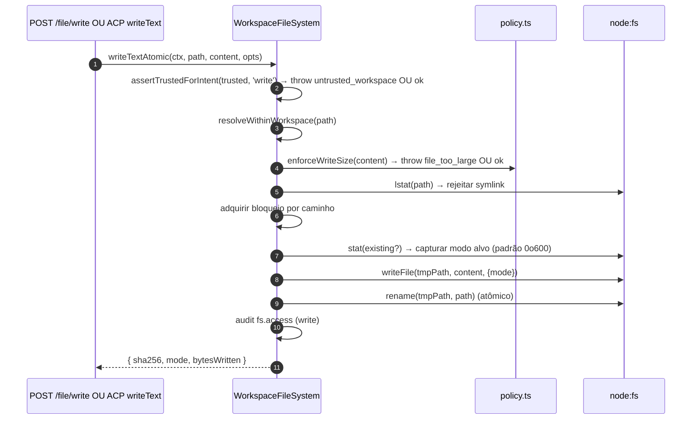
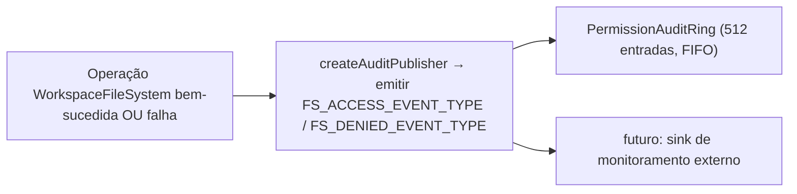

# Limite do Sistema de Arquivos do Workspace

## Visão geral

Rotas HTTP de arquivo do daemon e chamadas delegadas ACP `readTextFile` / `writeTextFile` passam pelo limite `WorkspaceFileSystem` (`packages/cli/src/serve/fs/`), que fornece:

- **Resolução de caminhos** — canonicaliza caminhos e rejeita qualquer coisa que escape do workspace delimitado, inclusive via symlinks.
- **Controle de confiança** — recusa escritas quando o workspace não é confiável (`untrusted_workspace`).
- **Política de tamanho e conteúdo** — limite de leitura/snapshot completo (`MAX_READ_BYTES = 256 KiB`), janelas de texto grande limitadas tanto em saída quanto em custo de scan (`MAX_TEXT_SCAN_BYTES = 8 MiB`), limite de escrita (`MAX_WRITE_BYTES = 5 MiB`), detecção de binários.
- **Atomicidade** — escreve e depois renomeia com preservação do modo alvo e `0o600` padrão para novos arquivos.
- **Auditoria** — cada acesso/negação emite um evento estruturado para `PermissionAuditRing` / monitoramento.
- **Erros tipados** — união fechada `FsErrorKind` mapeada para códigos HTTP.

As rotas HTTP de arquivo (`GET /file`, `GET /file/bytes`, `POST /file/write`, `POST /file/edit`, `GET /list`, `GET /glob`, `GET /stat`) usam esse limite e nunca recebem a exceção de mesmo host. No daemon em produção, chamadas ACP que permanecem delegadas alcançam o adaptador da bridge injetado; chamadores genéricos da bridge usam o WFS apenas quando injetam tal adaptador. Runtimes `qwen serve` em produção no mesmo host anunciam `readTextFile: false`, então todos os consumidores filhos de `FileSystemService.readTextFile` usam o serviço de filesystem regular da CLI. Escritas finais de conteúdo ACP `writeTextFile` permanecem delegadas: alvos de workspace usam o WFS, enquanto um marcador estrito de ferramenta embutida pode selecionar um escritor host equivalente para um caminho externo apenas em adaptadores de mesmo host criados pelo daemon. Consulte [o design de escrita externa](../../design/daemon-external-tool-text-writes.md).

Essa fatia de capacidade de leitura de texto cobre `read_file` direto mais as pré-leituras compartilhadas usadas pelas operações de write, edit, notebook, sed e artifact:

- Intencionalmente aceita o comportamento de leitura regular da CLI em vez das garantias do lado de leitura do WFS. [O documento de design](../../design/daemon-local-text-reads.md) possui a lista exata do que é renunciado.
- O mesmo documento registra o sentido limitado em que o caminho de leitura do adaptador retido "fail closed"; o design de escrita externa separado registra como a falha de escrita final aprovada é fechada.
- `read_file` externo direto mantém as regras normais de permissão da CLI e telemetria principal de operações de arquivo.
- Rotas HTTP de filesystem permanecem escopo de workspace, e o comportamento da ferramenta de descoberta do agente não muda com essa capacidade.
- Ações auxiliares como criação de diretório pai e comandos shell são caminhos existentes separados, não cobertos por este limite.
- `qwen serve` assume um principal de segurança na mesma máquina e mesmo UID e não é um sandbox de SO.

## Responsabilidades

- Resolver caminhos fornecidos pelo usuário em valores `ResolvedPath` identificados que o restante do limite pode usar com segurança.
- Recusar caminhos fora do workspace delimitado (`path_outside_workspace`) e caminhos cujo alvo seja um symlink (`symlink_escape`).
- Recusar leituras de snapshot completo acima de `MAX_READ_BYTES`, permitindo janelas explícitas com saída limitada a `MAX_READ_BYTES` e custo de scan limitado a `MAX_TEXT_SCAN_BYTES`; recusar escritas acima de `MAX_WRITE_BYTES` e arquivos binários (`binary_file`).
- Recusar escritas/edições quando o workspace não é confiável (`untrusted_workspace`) — controlado por `assertTrustedForIntent(trusted, intent)`.
- Respeitar padrões `.gitignore` / `.qwenignore` via `shouldIgnore`.
- Realizar escrita atômica com renomeação e preservação do modo alvo; novos arquivos usam `0o600` como padrão (`0o666 & ~umask` derivado do umask sob a política de modo de novos arquivos `system`).
- Emitir eventos de auditoria `fs.access` / `fs.denied` em toda operação.
- Mapear cada falha para um `FsError` com tipo e status HTTP; os manipuladores de rota os serializam uniformemente.

## Arquitetura

### Layout dos módulos

| Arquivo                     | Propósito                                                                                                                                                                                                                                               |
| --------------------------- | -------------------------------------------------------------------------------------------------------------------------------------------------------------------------------------------------------------------------------------------------------- |
| `paths.ts`                  | `canonicalizeWorkspace`, `resolveWithinWorkspace`, `hasSuspiciousPathPattern`, `ResolvedPath` identificado, união `Intent` (`read \| write \| list \| stat \| glob`).                                                                                    |
| `policy.ts`                 | `MAX_READ_BYTES`, `MAX_TEXT_SCAN_BYTES`, `MAX_WRITE_BYTES`, `MAX_UPLOAD_BYTES`, `BINARY_PROBE_BYTES`, `assertTrustedForIntent`, `detectBinary`, `enforceReadBytesSize`, `enforceReadSize`, `enforceWriteSize`, `shouldIgnore`.                        |
| `audit.ts`                  | `FS_ACCESS_EVENT_TYPE`, `FS_DENIED_EVENT_TYPE`, `createAuditPublisher`, tipos de payload de auditoria.                                                                                                                                                   |
| `errors.ts`                 | Classe `FsError`, `isFsError`, união `FsErrorKind` (14 tipos), união `FsErrorStatus` (`400 / 403 / 404 / 409 / 413 / 422 / 500 / 503`).                                                                                                                  |
| `workspace-file-system.ts`  | `createWorkspaceFileSystemFactory`, `WorkspaceFileSystem` (o orquestrador que lê/escreve/lista), `WriteMode`, `ContentHash`, `FsEntry`, `FsStat`, `ListOptions`, `GlobOptions`, `ReadTextOptions`, `ReadBytesOptions`, `WriteTextAtomicOptions`.          |

### Taxonomia `FsErrorKind`

| Tipo                       | HTTP Padrão | Significado                                                                                                                                                                                 |
| -------------------------- | ----------- | ------------------------------------------------------------------------------------------------------------------------------------------------------------------------------------------- |
| `path_outside_workspace`   | 400         | Caminho resolvido está fora do workspace delimitado.                                                                                                                                        |
| `symlink_escape`           | 400         | Alvo é um symlink (rejeitado conforme a postura conservadora do PR 18 + PR 20).                                                                                                             |
| `path_not_found`           | 404         | `ENOENT`.                                                                                                                                                                                   |
| `binary_file`              | 422         | Conteúdo detectado como binário em uma rota de texto, ou texto grande em uma codificação que a rota de texto não consegue decodificar.                                                                                                                     |
| `file_too_large`           | 413         | Texto sem janela/snapshot completo acima de `MAX_READ_BYTES`, um offset de linha além de `MAX_TEXT_SCAN_BYTES`, ou uma escrita acima de `MAX_WRITE_BYTES`.                                                                                                  |
| `hash_mismatch`            | 409         | `expectedSha256` de concorrência otimista falhou, ou o arquivo mudou durante uma leitura estável.                                                                                                                                                           |
| `file_already_exists`      | 409         | `mode: 'create'` contra um arquivo existente.                                                                                                                                               |
| `text_not_found`           | 422         | A string de busca do `POST /file/edit` não foi encontrada no arquivo.                                                                                                                       |
| `ambiguous_text_match`     | 422         | Múltiplas correspondências quando exatamente uma era necessária.                                                                                                                            |
| `untrusted_workspace`      | 403         | Escrita tentada em um workspace não confiável.                                                                                                                                              |
| `permission_denied`        | 403         | `EACCES` / `EPERM` no nível do SO.                                                                                                                                                          |
| `io_error`                 | 503         | `ENOSPC` / `EIO` / `EBUSY` / `ETXTBSY` / `ENAMETOOLONG` / `EMFILE` / `ENFILE`. **Distinto de `permission_denied`** para que pipelines de monitoramento não disparem alertas para "disco cheio". |
| `internal_error`           | 500         | Erro não-errno que atinge o limite (`TypeError`, bug de programador).                                                                                                                       |
| `parse_error`              | 400 / 422   | Erro de parse do corpo da requisição (400) ou violação de invariante de serviço (422).                                                                                                      |

### `BridgeFileSystem` (o adaptador do lado ACP)

`packages/acp-bridge/src/bridgeFileSystem.ts` define:

```ts
interface BridgeFileSystem {
  readText(params: ReadTextFileRequest): Promise<ReadTextFileResponse>;
  writeText(params: WriteTextFileRequest): Promise<WriteTextFileResponse>;
}
```

Este é o ponto de injeção para `readTextFile` / `writeTextFile` do ACP. Testes da bridge e chamadores embutidos do Mode A podem omiti-lo em `BridgeOptions`; `BridgeClient` cai de volta para seu proxy inline `fs.readFile` / `fs.writeFile` (preserva o comportamento pré-F1). O `qwen serve` em produção conecta `BridgeFileSystem` através de `createBridgeFileSystemAdapter(fsFactory)` (`packages/cli/src/serve/bridge-file-system-adapter.ts`) e define `delegateReadTextFileToClient: false`. Filhos compatíveis com a capacidade portanto leem texto localmente e delegam escritas finais de texto ACP. O adaptador retém sua implementação de leitura para que leituras delegadas inesperadas ou que violem a capacidade ainda encontrem o limite de workspace do WFS. Seu caminho externo de host-writer é desabilitado por padrão e selecionado apenas por proveniência versionada exata em adaptadores de mesmo host pertencentes ao daemon; bridges injetadas, registradores e factories de workspace, ACP genérico e HTTP retêm o limite ordinário.

Duas propriedades defensivas que o adaptador DEVE preservar (porque o proxy inline é completamente ignorado quando o adaptador é injetado):

1. **Rejeitar arquivos não regulares** — soquetes / pipes / dispositivos de caractere / entradas procfs / sysfs podem transmitir dados ilimitados apesar de `stats.size === 0`. O caminho inline lança exceção com `describeStatKind(stats)` na mensagem.
2. **Evitar buffer ilimitado de arquivo completo.** O fallback inline limita uma leitura em buffer a `READ_FILE_SIZE_CAP = 100 MiB`. O adaptador injetado aplica em vez disso o contrato mais estrito do WorkspaceFileSystem: snapshots completos param em 256 KiB, enquanto arquivos UTF-8 maiores exigem um `limit` finito e são transmitidos a partir de um handle limitado por inode com no máximo 256 KiB retornados. Não deve ler um log inteiro de 500 MB apenas para retornar `{ line: 1, limit: 10 }`.

O adaptador vai além: usa `WorkspaceFileSystem.writeTextOverwrite` (primitiva do PR 18) para escritas atômicas com arquivo temporário e renomeação, preservação de modo, `0o600` padrão e rejeição de symlinks dentro de um bloqueio por caminho. Isso é uma **divergência do proxy inline pré-F1** que resolvia symlinks e escrevia através deles até o alvo — agentes que dependiam de escrever através de dotfiles com symlink agora precisam endereçar o caminho resolvido diretamente.

### Preservação de `FsError` pelo fio ACP

Quando o adaptador `BridgeFileSystem` lança um `FsError` (`kind: 'untrusted_workspace'` / `'symlink_escape'` / `'file_too_large'` / etc.), o caminho padrão do erro RPC do SDK ACP serializa apenas `error.message` como um genérico `-32603 "Internal error"` — `kind` / `status` / `hint` são removidos. O cliente RPC do agente downstream teria que fazer match com regex na mensagem legível para despachar UI tipada (reautenticação vs seletor de arquivo vs dica de proxy).

`BridgeClient.writeTextFile` e `BridgeClient.readTextFile` instalam uma proteção fina (`packages/acp-bridge/src/bridgeClient.ts`) que captura lançamentos com formato de FsError e os relança como `RequestError` do ACP:

```ts
function isFsErrorShape(err: unknown): err is FsErrorShape {
  return (
    err instanceof Error &&
    err.name === 'FsError' &&
    typeof (err as { kind?: unknown }).kind === 'string'
  );
}

function preserveFsErrorOverAcp(err: unknown): never {
  if (isFsErrorShape(err)) {
    throw new RequestError(-32603, err.message, {
      errorKind: err.kind,
      ...(err.hint !== undefined ? { hint: err.hint } : {}),
      ...(err.status !== undefined ? { status: err.status } : {}),
    });
  }
  throw err;
}
```

O cliente RPC do agente agora recebe `data.errorKind` (o valor fechado de `FsErrorKind`) além dos opcionais `data.hint` e `data.status`, permitindo que consumidores do SDK usem o enum tipado em vez de regex na mensagem.

Duas observações de design:

- **Duck typing em vez de import** — `FsError` vive em `packages/cli/src/serve/fs/errors.ts` enquanto `BridgeClient` vive em `packages/acp-bridge`. Um `import { FsError }` direto inverteria a dependência. A verificação por duck typing (`name === 'FsError'` + `kind: string`) espelha o que `mapDomainErrorToErrorKind` (`status.ts`) já faz para `TrustGateError` / `SkillError` pelo mesmo motivo de empacotamento entre pacotes.
- **Código JSON-RPC permanece em -32603** — a bridge não consegue mapear confiavelmente `FsError.kind` para um formato de código de erro JSON-RPC, então o campo estruturado `data` carrega a informação semântica para consumidores do SDK. O código de status no fio (`-32603` "internal error") não muda; clientes roteiam com base em `data.errorKind`.

### Controle de confiança

`assertTrustedForIntent(trusted, intent)` consome o booleano de confiança injetado pelo chamador; a camada de política não lê `Config.isTrustedFolder()` diretamente. Operações de leitura / listagem / stat / glob são sempre permitidas (confiança só é necessária para escritas). Intenções de escrita em workspaces não confiáveis lançam `FsError('untrusted_workspace', ..., status: 403)`. O sinal de confiança flui via `WorkspaceFileSystemFactoryDeps.trusted: boolean` — `runQwenServe` passa `true` porque o operador iniciou o daemon contra um workspace que implicitamente confia; `createServeApp` (embutido diretamente sem `runQwenServe`) usa `false` como padrão e emite um aviso uma vez por processo (veja [`02-serve-runtime.md`](./02-serve-runtime.md)).

## Fluxo de Trabalho

### Leitura

```mermaid
sequenceDiagram
    autonumber
    participant R as Rota HTTP OU BridgeFileSystem.readText
    participant FS as WorkspaceFileSystem
    participant POL as policy.ts
    participant FSP as node:fs

    R->>FS: readText(ctx, path, opts)
    FS->>FS: resolveWithinWorkspace(path) → ResolvedPath OU throw
    FS->>FSP: stat(path)
    FSP-->>FS: stats
    FS->>FS: rejeitar se não for arquivo regular (describeStatKind)
    alt cursor fornecido
        FS->>FSP: open FileHandle estável
        FS->>FS: validar cursor {dev,ino,size}; seek para o byte offset
        FS->>FS: retornar linhas inteiras; emitir o próximo cursor
    else arquivo <= 256 KiB
        FS->>FSP: open + read de snapshot completo estável
        FSP-->>FS: buffer
        FS->>FS: hash do snapshot completo; aplicar limites de linha/saída
    else arquivo > 256 KiB E um argumento de janela explícito
        FS->>FSP: open FileHandle estável
        FS->>FS: stream das linhas solicitadas do mesmo inode
        FS->>FS: limitar saída em 256 KiB e scan em 8 MiB; omitir hash do arquivo completo
    else leitura grande sem janela
        FS-->>R: file_too_large
    end
    FS->>POL: detectBinary(sample)
    POL-->>FS: isBinary?
    FS->>FS: rejeitar se binário
    FS->>FS: shouldIgnore? → anotar meta.matchedIgnore
    FS->>FS: audit fs.access
    FS-->>R: { content, sha256 opcional, truncated?, meta }
```

`readText` não pula nem rejeita leituras por causa de regras de ignorar. Ela lê o arquivo normalmente e registra a classificação de ignorar correspondente em `meta.matchedIgnore`. `list` e `glob` filtram resultados ignorados apenas quando `includeIgnored` não está habilitado.

### Escrita


```mermaid
sequenceDiagram
    autonumber
    participant R as POST /file/write OU ACP writeText
    participant FS as WorkspaceFileSystem
    participant POL as policy.ts
    participant FSP as node:fs

    R->>FS: writeTextAtomic(ctx, path, content, opts)
    FS->>FS: assertTrustedForIntent(trusted, 'write') → throw untrusted_workspace OU ok
    FS->>FS: resolveWithinWorkspace(path)
    FS->>POL: enforceWriteSize(content) → throw file_too_large OU ok
    FS->>FSP: lstat(path) → rejeitar symlink
    FS->>FS: adquirir bloqueio por caminho
    FS->>FSP: stat(existing?) → capturar modo alvo (padrão 0o600)
    FS->>FSP: writeFile(tmpPath, content, {mode})
    FS->>FSP: rename(tmpPath, path) (atômico)
    FS->>FS: audit fs.access (write)
    FS-->>R: { sha256, mode, bytesWritten }
```

A escrita atômica com renomeação garante que um SIGKILL / OOM no meio da escrita NÃO deixe o alvo truncado. `mode: 'create'` aborta com `file_already_exists` no lstat; `mode: 'overwrite'` prossegue; `expectedSha256` ativa concorrência otimista (`hash_mismatch` em caso de incompatibilidade).

### `POST /file/edit` (substituição de texto único)

Adiciona dois modos de falha além da escrita:

- `text_not_found` (422) — string de busca não encontrada no arquivo.
- `ambiguous_text_match` (422) — múltiplas correspondências quando exatamente uma era necessária (contrato da rota).

### Fan-out de auditoria


```mermaid
flowchart LR
    A["Operação WorkspaceFileSystem bem-sucedida OU falha"] --> P["createAuditPublisher → emitir FS_ACCESS_EVENT_TYPE / FS_DENIED_EVENT_TYPE"]
    P --> AR["PermissionAuditRing (512 entradas, FIFO)"]
    P --> MON["futuro: sink de monitoramento externo"]
```

`FS_ACCESS_EVENT_TYPE` / `FS_DENIED_EVENT_TYPE` carregam contexto (`ctx`), caminho, intenção, resultado, errorKind?, bytesLidos/escritos, sha256?.

## Estado e Ciclo de Vida

- A fábrica é construída uma vez na inicialização do daemon (`runQwenServe` → `resolveBridgeFsFactory` → adapter).
- Cada requisição constrói um `RequestContext` e invoca o orquestrador da fábrica apenas para aquela chamada — nenhum estado de arquivo persistente entre chamadas.
- Bloqueios por caminho existem apenas durante a operação de escrita (sem bloqueio entre chamadas; escritas concorrentes no mesmo caminho disputam o bloqueio e serializam).
- O anel de auditoria é gerenciado por `runQwenServe` e compartilhado com o publicador de auditoria de permissões.

## Dependências

- `@qwen-code/qwen-code-core` — `Ignore`, `isBinaryFile`, `Config.isTrustedFolder()`.
- `node:fs`, `node:path`, `node:crypto`.
- `@qwen-code/acp-bridge` — contrato `BridgeFileSystem` do lado ACP.
- Rotas HTTP: `packages/cli/src/serve/routes/workspace-file-read.ts`, `workspace-file-write.ts`.

## Configuração

| Origem                                              | Parâmetro                                                             | Efeito                                                                                                             |
| --------------------------------------------------- | --------------------------------------------------------------------- | ------------------------------------------------------------------------------------------------------------------ |
| `WorkspaceFileSystemFactoryDeps.trusted: boolean`   | Entrada do construtor                                                 | Se escritas são permitidas; padrão `true` do `runQwenServe`, `false` do `createServeApp` (com aviso).              |
| Constante                                           | `MAX_READ_BYTES = 256 KiB`                                            | Limite de snapshot completo e texto retornado; texto maior exige um argumento de janela explícito.                  |
| Constante                                           | `MAX_TEXT_SCAN_BYTES = 8 MiB`                                         | Bytes que uma leitura de texto grande pode escanear para localizar um offset de linha; além disso, `file_too_large`. |
| Constante                                           | `MAX_WRITE_BYTES = 5 MiB`                                             | Limite de escrita; dimensionado abaixo de `express.json({ limit: '10mb' })`.                                       |
| Constante                                           | `MAX_UPLOAD_BYTES = 50 MiB`                                           | Limite de upload binário para `POST /file/upload`; uploads nunca sobrescrevem e numeram automaticamente nomes ocupados. |
| Constante                                           | `BINARY_PROBE_BYTES = 4096`                                           | Tamanho da amostra para detecção binária baseada em conteúdo.                                                      |
| Tags de capacidade                                  | `workspace_file_read`, `workspace_file_bytes`, `workspace_file_write`, `workspace_file_upload` | Veja [`11-capabilities-versioning.md`](./11-capabilities-versioning.md).                                           |
| Arquivos do workspace                               | `.gitignore`, `.qwenignore`                                           | Caminhos ignorados aparecem como `ignored: true` do `shouldIgnore`.                                                |

## Advertências e Limitações Conhecidas

- **Symlinks são rejeitados, não seguidos.** Isso é uma divergência do proxy inline `BridgeClient.writeTextFile` pré-F1 que resolvia symlinks. Agentes escrevendo através de dotfiles com symlink precisam endereçar o caminho resolvido diretamente.
- **`io_error` e `permission_denied` são distintos.** Não os confunda. Pipelines de monitoramento usam `errorKind` para alertas — incluir ENOSPC em permission_denied dispararia alertas para problemas de `df -h`.
- **O modo padrão de novos arquivos é `0o600`, não o padrão do umask.** O argumento `mode` da syscall de escrita ignora o umask. Agentes não podem passar uma sobreposição de modo por escrita. Operadores que desejam que arquivos criados pelo agente sigam o umask do daemon podem optar por daemon com `QWEN_SERVE_NEW_FILE_MODE=system` (arquivos existentes ainda preservam seu modo); consulte [`17-configuration.md`](./17-configuration.md).
- **`createServeApp` com `trusted: false` padrão** rejeita silenciosamente escritas ACP com `untrusted_workspace` para embedders que não injetam um `fsFactory` ou `bridge` personalizados. Um aviso único em stderr é emitido na primeira vez; chamadores subsequentes não veem lembrete. Veja [`02-serve-runtime.md`](./02-serve-runtime.md).
- **Texto grande exige um argumento de janela explícito**, qualquer um de `line` / `limit` / `maxBytes`. Uma leitura sem nenhum deles resulta em `file_too_large`, porque um chamador que acredita ter o arquivo inteiro pode escrevê-lo de volta truncado. Janelas fazem stream a partir de um handle limitado por inode e nunca retornam mais que `MAX_READ_BYTES`.
- **`MAX_READ_BYTES` limita o que uma leitura retorna; `MAX_TEXT_SCAN_BYTES` limita o que ela custa.** Offsets de linha são resolvidos escaneando a partir do byte 0, então `{ line: 900_000_000, limit: 20 }` retorna quase nada e ainda percorre o arquivo. Após 8 MiB de scan a leitura é recusada com `file_too_large` apontando para `readBytes`, que alcança qualquer offset em O(1).
- **Janelas transmitidas toleram appends, não truncamento.** O caminho de snapshot completo pode exigir estabilidade byte a byte porque retorna o arquivo inteiro; uma janela de prefixo não pode, ou toda leitura de um log ativo falharia. O caminho transmitido afirma identidade de inode mais "não encolheu", então appends passam e truncamento / substituição ainda são rejeitados. `sizeBytes` reporta o tamanho no `open`, descrevendo o snapshot do qual a janela foi cortada.
- **Leituras parciais grandes omitem o hash do arquivo completo.** `originalLineCount` é omitido quando o stream para antes do EOF.
- **Paginação é por cursor de bytes, não por linha.** Uma leitura que deixa conteúdo para trás retorna `hasMore` e, quando um byte offset é derivável, um `nextCursor` opaco. Retomar a partir dele é O(1); retomar por `line` re-escaneia a partir do byte 0 e é recusado além de `MAX_TEXT_SCAN_BYTES`. O cursor carrega `{dev, ino, size}`, então um arquivo substituído ou truncado gera `hash_mismatch` em vez de bytes do lugar errado, enquanto um append o mantém válido. Leituras de snapshot não-UTF-8 reportam `hasMore` mas sem cursor — seu texto decodificado é uma re-codificação UTF-8 cujos comprimentos não mapeiam de volta para offsets do arquivo.
- **Adaptador `BridgeFileSystem` DEVE replicar ambas as barreiras do proxy inline** (recusa de arquivos não regulares + buffer/stream limitado). O caminho inline é completamente ignorado quando o adaptador é injetado.

## Referências

- `packages/cli/src/serve/fs/index.ts` (barrel)
- `packages/cli/src/serve/fs/paths.ts`
- `packages/cli/src/serve/fs/policy.ts`
- `packages/cli/src/serve/fs/errors.ts`
- `packages/cli/src/serve/fs/audit.ts`
- `packages/cli/src/serve/fs/workspace-file-system.ts`
- `packages/cli/src/serve/bridge-file-system-adapter.ts`
- `packages/acp-bridge/src/bridgeFileSystem.ts`
- Referência de rota HTTP: [`../qwen-serve-protocol.md`](../qwen-serve-protocol.md).