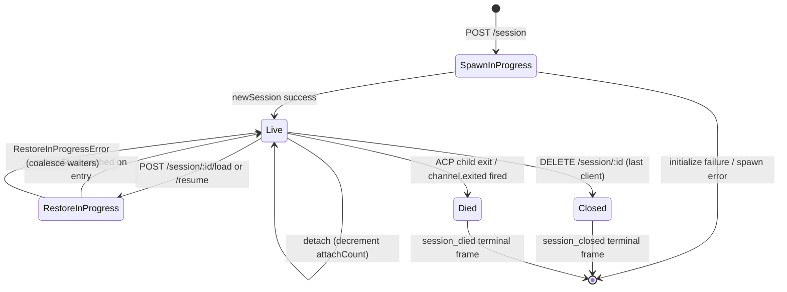

# Ciclo de Vida da Sessão e Identidade

## Visão Geral

Uma **sessão** do daemon é uma conversa lógica vinculada a um único `sessionId` do ACP. A bridge mantém um `SessionEntry` por sessão (veja [`03-acp-bridge.md`](./03-acp-bridge.md)) que acopla a conexão filha do ACP com a contabilidade do lado HTTP: FIFO de prompts, FIFO de mudança de modelo, barramento de eventos, permissões pendentes, clientes anexados, heartbeats, estado de restauração, tombstones de frames terminais.

Um **cliente** do daemon é identificado por `X-Qwen-Client-Id` — uma string opaca, validada pelo daemon, que o chamador HTTP coloca em suas requisições. A bridge rastreia quais clientes estão anexados a quais sessões e usa o id do cliente originador para conduzir a política de permissão `designated`, trilhas de auditoria e atribuição de eventos.

Este documento explica toda transição de ciclo de vida da sessão (criar / anexar / carregar / retomar / fechar / morrer / despejar) e todas as superfícies de identidade que o daemon expõe.

## Responsabilidades

- Criar, anexar, restaurar e eliminar sessões.
- Validar `X-Qwen-Client-Id` e rejeitar ids malformados.
- Rastrear múltiplos clientes anexados por sessão (`clientIds: Map<string, count>`, `attachCount`).
- Marcar `originatorClientId` em eventos de saída.
- Executar heartbeats para que dashboards saibam quais clientes ainda estão conectados.
- Expor metadados de sessão (`displayName`) que operadores definem via `PATCH /session/:id/metadata`.
- Conduzir a emissão de frames terminais (`session_died`, `session_closed`, `client_evicted`, `stream_error`).

## Arquitetura

| Aspecto                   | Origem                                                       | Observações                                                                                |
| ------------------------- | ------------------------------------------------------------ | ------------------------------------------------------------------------------------------ |
| `SessionEntry`            | `packages/acp-bridge/src/bridge.ts`                          | Struct por sessão; veja [`03-acp-bridge.md`](./03-acp-bridge.md) para lista completa de campos. |
| `BridgeSession` (público) | `packages/acp-bridge/src/bridgeTypes.ts`                     | `{ sessionId, workspaceCwd, attached, clientId?, createdAt? }` retornado para handlers HTTP. |
| `BridgeSessionState`      | `packages/acp-bridge/src/bridgeTypes.ts`                     | `LoadSessionResponse \| ResumeSessionResponse` armazenado em cache na entrada como `restoreState`. |
| `DaemonSession` (SDK)     | `packages/sdk-typescript/src/daemon/types.ts`                | `{ sessionId, workspaceCwd, attached, clientId?, createdAt? }`.                            |
| Validação de client-id    | `packages/acp-bridge/src/bridge.ts` (em torno de `spawnOrAttach`) | Padrão `[A-Za-z0-9._:-]{1,128}`; `InvalidClientIdError` se malformado.                       |
| Eliminador de desconexão  | `packages/cli/src/serve/server.ts`                           | Rastreia desconexões do dono do spawn com `attachCount` + `spawnOwnerWantedKill`.              |

### Máquina de estados



### Anexar vs spawn

Sob `sessionScope: 'single'` (padrão), o `defaultEntry` da bridge é compartilhado por todo cliente que se conecta. Um `POST /session` que chega enquanto `defaultEntry` já existe retorna `attached: true` sem criar um novo filho ACP. A bridge incrementa `attachCount` de forma síncrona e registra o `X-Qwen-Client-Id` do chamador em `clientIds`.

Sob `sessionScope: 'thread'`, cada thread pode criar uma sessão distinta. O chamador ainda respeita `maxSessions`.

### Identidade

`X-Qwen-Client-Id` é **opcional**, mas **fortemente recomendado**. O daemon não gera um em nome do chamador — os clientes escolhem o seu e reutilizam nas requisições para que o daemon possa atribuir votos, auditar eventos e detectar reconexões.

Regras de validação:

- Conjunto de caracteres: `[A-Za-z0-9._:-]`.
- Comprimento: 1–128.
- Fora desse conjunto: `InvalidClientIdError` (`400`).

O daemon marca `originatorClientId` em eventos SSE de saída quando:

1. A requisição que disparou o evento continha `X-Qwen-Client-Id`, E
2. O id está atualmente registrado no conjunto `clientIds` da sessão, E
3. A sessão tem um `activePromptOriginatorClientId` definido (os eventos inline `sessionUpdate` e `permission_request` herdam o originador do prompt ativo).

Chamadores anônimos (sem `X-Qwen-Client-Id`) funcionam bem para a política `first-responder`; `designated` rejeita seus votos com `permission_forbidden{ reason: 'designated_mismatch' }`; `consensus` rejeita com a mesma razão `forbidden` porque o eleitor não está no snapshot `votersAtIssue` do momento da emissão; `local-only` é a única política que aceita eleitores anônimos em loopback.

## Fluxo de trabalho

### Criar ou anexar

```mermaid
sequenceDiagram
    autonumber
    participant C as Client
    participant R as POST /session
    participant B as Bridge.spawnOrAttach
    participant CH as ACP child

    C->>R: POST /session<br/>X-Qwen-Client-Id: alice<br/>{cwd, sessionScope?}
    R->>R: validate clientId pattern
    R->>B: spawnOrAttach({cwd, sessionScope, clientId})
    alt single scope + defaultEntry exists
        B->>B: bump attachCount; register clientId
        B-->>R: {sessionId, attached: true, restoreState?}
    else cold
        B->>CH: spawn + ACP initialize + newSession
        CH-->>B: sessionId
        B->>B: build SessionEntry; register in byId
        B-->>R: {sessionId, attached: false}
    end
    R-->>C: 200 { sessionId, attached, ... }
```

### Carregar / Retomar

`POST /session/:id/load` — reproduz o histórico completo do ACP (os eventos `session/load` são disparados antes da resposta retornar).
`POST /session/:id/resume` — restaura sem reprodução (`connection.unstable_resumeSession`, exposto sob a capacidade estável `session_resume` do daemon; `unstable_session_resume` continua como apelido obsoleto).

Ambos:

1. Usam um conjunto `pendingRestoreIds` por sessão no canal para que chamadas de restauração concorrentes se coalesçam (`RestoreInProgressError`).
2. Armazenam em cache o `restoreState` na entrada para que um anexador tardio receba o mesmo payload que o restaurador original.

### Heartbeat

`POST /session/:id/heartbeat` atualiza `sessionLastSeenAt` independentemente de `clientId`. Se a requisição carregar um `X-Qwen-Client-Id` registrado, `clientLastSeenAt.set(clientId, Date.now())` também é atualizado. A eliminação por cliente **não** está implementada na v1; a revogação está planejada para a F-series Wave 5. Hoje, os heartbeats fornecem observabilidade para dashboards e para a futura política de revogação no PR 24.

### Metadados

`PATCH /session/:id/metadata` aceita `{displayName?}`. Validação:

- Comprimento máximo: `MAX_DISPLAY_NAME_LENGTH = 256`.
- Não deve conter caracteres de controle (`hasControlCharacter` rejeita code points ≤ 0x1f ou == 0x7f).
- `InvalidSessionMetadataError` (`400`) em caso de violação.

Uma atualização bem-sucedida envia `session_metadata_updated` para todos os assinantes.

### Terminação

| Frame terminal   | Gatilho                                                                                                                                    |
| ---------------- | ------------------------------------------------------------------------------------------------------------------------------------------ |
| `session_closed` | `DELETE /session/:id` (client_close) ou fechamento programático.                                                                           |
| `session_died`   | `channel.exited` dispara por qualquer motivo (crash, kill do filho). Carrega `exitCode?` + `signalCode?` quando o caminho de saída do SO foi usado. |
| `client_evicted` | Estouro de fila por assinante no EventBus (veja [`10-event-bus.md`](./10-event-bus.md)). NÃO é uma terminação de sessão — apenas este assinante é fechado. |
| `stream_error`   | SubscriberLimitExceededError ou outra falha de stream no nível da rota.                                                                      |

Permissões pendentes são resolvidas como `{kind:'cancelled', reason:'session_closed'}` via `mediator.forgetSession(sessionId)` em todo caminho de terminação.

### Proteção contra eliminação por desconexão

Quando a resposta HTTP do cliente dono do spawn não pode ser escrita (TCP reset no meio do handshake), a rota chama `killSession({ requireZeroAttaches: true })`. Se outro cliente já estiver anexado (`attachCount > 0`), a proteção interrompe e a sessão continua viva. Definir `spawnOwnerWantedKill = true` lembra a intenção para que um futuro `detachClient()` que traga `attachCount` de volta a 0 complete a eliminação adiada. Sem isso, um dono do spawn que se desconecta rapidamente derrubaria uma sessão saudável a cada reconexão.

## Estado e Ciclo de Vida

Campos de `SessionEntry` críticos para o ciclo de vida:

| Campo                            | Tipo                  | Significado                                                                    |
| -------------------------------- | --------------------- | ------------------------------------------------------------------------------ |
| `clientIds`                      | `Map<string, number>` | Ids de cliente registrados → contagem de referência do registro.              |
| `attachCount`                    | `number`              | Vezes que `spawnOrAttach` retornou `attached: true` para esta entrada.         |
| `activePromptOriginatorClientId` | `string?`             | Originador do prompt atualmente em execução.                                    |
| `restoreState`                   | `BridgeSessionState?` | Resposta de carregar/retomar em cache para que anexadores tardios vejam payloads consistentes. |
| `spawnOwnerWantedKill`           | `boolean`             | Tombstone de eliminação adiada (veja proteção contra desconexão acima).         |
| `sessionLastSeenAt`              | `number?`             | Heartbeat mais recente de qualquer cliente (ms epoch).                          |
| `clientLastSeenAt`               | `Map<string, number>` | Heartbeat por cliente.                                                          |
| `pendingPermissionIds`           | `Set<string>`         | requestIds do ACP atualmente pendentes — usados no cancelamento/fechamento para resolver como cancelados. |

## Dependências

- Camada ACP: `connection.newSession`, `connection.unstable_resumeSession`, `connection.loadSession`.
- [`03-acp-bridge.md`](./03-acp-bridge.md) para a arquitetura da bridge circundante.
- [`04-permission-mediation.md`](./04-permission-mediation.md) para como originador + identidade conduzem decisões de política.
- [`10-event-bus.md`](./10-event-bus.md) para entrega de frames terminais.

## Endpoints adicionais de sessão

Estes endpoints estendem a superfície base do ciclo de vida:

### Prompt não bloqueante (tag de capacidade `non_blocking_prompt`)

`POST /session/:id/prompt` agora retorna HTTP **202** com
`{ promptId, lastEventId }` em vez de bloquear até o prompt completar. O
resultado real chega no SSE como `turn_complete` / `turn_error`, e o
campo `promptId` correlaciona esses eventos com a resposta 202.
`DaemonSessionClient.prompt()` usa automaticamente o caminho não bloqueante quando
tem uma assinatura de evento ativa e combina transparantemente o resultado do
fluxo SSE.

### Recapitulação de Sessão (tag de capacidade `session_recap`)

`POST /session/:id/recap` pede ao modelo rápido um resumo de uma linha "onde eu parei".
Retorna `{ sessionId, recap: string | null }`; `null` significa que o
histórico era muito curto ou o modelo falhou temporariamente. Este endpoint é
de melhor esforço.

### BTW / Pergunta Paralela (tag de capacidade `session_btw`)

`POST /session/:id/btw` faz uma pergunta pontual contra o contexto da sessão
sem interromper o fluxo principal da conversa. Usa `runForkedAgent` no
caminho de cache para uma chamada LLM de turno único, sem ferramenta, e retorna
`{ sessionId, answer: string | null }`. A implementação impõe
`BTW_MAX_INPUT_LENGTH`, proteções contra vazamento entre sessões e tratamento de timeout.

### Execução de Comando Shell

`POST /session/:id/shell` executa um comando shell diretamente no host do daemon,
sem rotear pelo LLM. Transmite a saída no barramento SSE da sessão via
eventos `user_shell_command` / `user_shell_result` e injeta o comando mais
resultado no histórico da conversa do LLM. A resposta é
`{ exitCode, output, aborted }`.

### Desanexar Sessão

`POST /session/:id/detach` desanexa explicitamente um cliente de uma sessão,
decrementando `attachCount`; não fecha a sessão por si só. Se nenhum outro
attach ou assinante permanecer, a sessão é eliminada. O endpoint retorna 204.

### Exclusão em Lote de Sessões

`POST /sessions/delete` aceita `{ sessionIds: string[] }` (até 100 ids),
fecha sessões da bridge e exclui arquivos de transcrição. Usa
`Promise.allSettled` para resiliência e retorna `{ removed, notFound, errors }`.

### Uso de Contexto (tag de capacidade `session_context_usage`)

`GET /session/:id/context-usage` retorna uso estruturado da janela de contexto.
`?detail=true` inclui uso mais granular agrupado por ferramenta, memória e skill.

### Estatísticas de Sessão (tag de capacidade `session_stats`)

`GET /session/:id/stats` retorna estatísticas de uso: métricas de modelo
(tokens de entrada/saída, leituras/escritas de cache, custo total), contagens de chamada por ferramenta e latências, contagens de edição de arquivo e contagens de invocação por skill para a sessão ativa. O bloco `skills` reflete carregamentos de corpo de skill e comandos slash de skill apenas nesta sessão; não é um agregado de atividade entre sessões.

### Tarefas da Sessão (tag de capacidade `session_tasks`)

`GET /session/:id/tasks` retorna um snapshot de tarefas em segundo plano para tarefas de agente, tarefas shell, tarefas de monitor e seus estados de ciclo de vida.

### Status LSP da Sessão (tag de capacidade `session_lsp`)

`GET /session/:id/lsp` retorna status LSP por sessão sanitizado para clientes do daemon: habilitação, contagens agregadas de servidores, estado de indisponível/inicialização e `name`, `status`, `languages`, `transport`, `command` e `error` por servidor. LSP desabilitado ou indisponível é representado como dados de status HTTP 200, não como erro de transporte.

### Reprodução Compactada

`POST /session/:id/load` agora retorna um `BridgeRestoredSession` que pode incluir
`compactedReplay?: BridgeEvent[]`, `liveJournal?: BridgeEvent[]` e
`lastEventId?: number`. `compactedReplay` é produzido por
`TurnBoundaryCompactionEngine`: nos limites de turno, ele dobra blocos consecutivos de texto/pensamento, colapsa sequências de chamadas de ferramenta para seu estado final, descarta sinais transitórios e produz logs de reprodução O(turns) em vez de logs O(tokens) (tipicamente uma redução de 25 a 30x).

### Pré-aquecimento do Filho ACP

`bridge.preheat()` aquece o processo filho ACP antes da primeira sessão para que a primeira sessão real evite latência de inicialização a frio. Ele emparelha com `channelIdleTimeoutMs`, que mantém o filho ACP vivo após a última sessão fechar, e o comportamento de pular religamento, que reutiliza um filho já ocioso quando uma nova sessão chega.

## Configuração

- `BridgeOptions.maxSessions` (padrão 20) — limite.
- `BridgeOptions.sessionScope` (padrão `'single'`; opcional `'thread'`).
- `BridgeOptions.initializeTimeoutMs` (padrão 10s) — handshake ACP `initialize`.
- `BridgeOptions.channelIdleTimeoutMs` (padrão 0; elimina o filho ACP imediatamente).
- Tags de capacidade: `session_create`, `session_scope_override`, `session_load`, `session_resume`, `unstable_session_resume` (apelido obsoleto), `session_list`, `session_close`, `session_metadata`, `session_set_model`, `client_identity`, `client_heartbeat`, `session_recap`, `session_btw`, `session_context_usage`, `session_tasks`, `session_stats`, `session_lsp`, `session_status`, `non_blocking_prompt`.

## Limitações e Problemas Conhecidos

- `connection.unstable_resumeSession` ainda pode ser instável na camada ACP, mas o daemon anuncia o contrato de rota v1 consolidado com `session_resume`. `unstable_session_resume` é mantido apenas como um apelido de compatibilidade obsoleto.
- A v1 **não tem eliminação por cliente**; apenas terminação por sessão e por assinante. A política de revogação é F-series Wave 5 / PR 24.
- `client_evicted` é por assinante, não por sessão. Um cliente cujo assinante SSE foi removido pode reconectar.
- Clientes anônimos (sem `X-Qwen-Client-Id`) não podem votar sob as políticas `designated` ou `consensus`.

## Referências

- `packages/acp-bridge/src/bridge.ts` (definição de SessionEntry)
- `packages/acp-bridge/src/bridgeTypes.ts` (`HttpAcpBridge`, `BridgeSession`, `BridgeSessionState`)
- `packages/sdk-typescript/src/daemon/types.ts` (`DaemonSession`)
- `packages/sdk-typescript/src/daemon/DaemonSessionClient.ts`
- Referência de fio: [`../qwen-serve-protocol.md`](../qwen-serve-protocol.md) (catálogo de rotas).