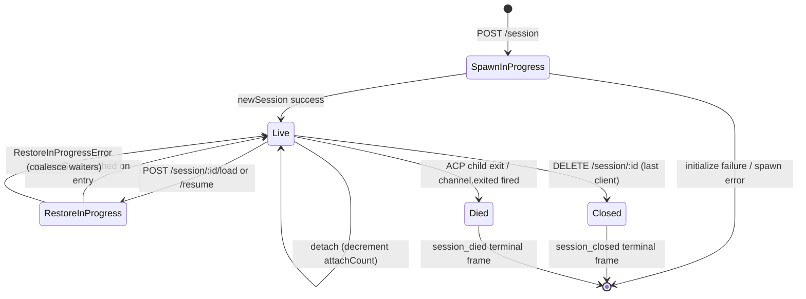

# Ciclo de Vida e Identidade da Sessão

## Visão Geral

Uma **sessão** do daemon é uma conversa lógica fixada em um `sessionId` do ACP. O bridge mantém um `SessionEntry` por sessão (consulte [`03-acp-bridge.md`](./03-acp-bridge.md)), que acopla a conexão filho do ACP com o controle no lado HTTP: FIFO de prompts, FIFO de alterações de modelo, barramento de eventos, permissões pendentes, clientes conectados, heartbeats, estado de restauração e tombstones de frames terminais.

Um **cliente** do daemon é identificado por `X-Qwen-Client-Id` — uma string opaca e validada pelo daemon que o chamador HTTP carimba em suas requisições. O bridge rastreia quais clientes estão conectados a quais sessões e usa o ID do cliente originador para orientar a política de permissão `designated`, trilhas de auditoria e atribuição de eventos.

Este documento explica cada transição do ciclo de vida da sessão (create / attach / load / resume / close / die / evict) e cada superfície de identidade que o daemon expõe.

## Responsabilidades

- Criar, conectar, restaurar e coletar (reap) sessões.
- Validar `X-Qwen-Client-Id` e rejeitar IDs malformados.
- Rastrear múltiplos clientes conectados por sessão (`clientIds: Map<string, count>`, `attachCount`).
- Carimbar `originatorClientId` em eventos de saída.
- Executar heartbeats para que os dashboards saibam quais clientes ainda estão conectados.
- Expor metadados da sessão (`displayName`) definidos pelos operadores via `PATCH /session/:id/metadata`.
- Controlar a emissão de frames terminais (`session_died`, `session_closed`, `client_evicted`, `stream_error`).

## Arquitetura

| Preocupação               | Fonte                                                        | Notas                                                                                     |
| ------------------------- | ------------------------------------------------------------ | ----------------------------------------------------------------------------------------- |
| `SessionEntry`            | `packages/acp-bridge/src/bridge.ts`                          | Estrutura por sessão; consulte [`03-acp-bridge.md`](./03-acp-bridge.md) para a lista completa de campos. |
| `BridgeSession` (público) | `packages/acp-bridge/src/bridgeTypes.ts`                     | `{ sessionId, workspaceCwd, attached, clientId?, createdAt? }` retornado para os handlers HTTP. |
| `BridgeSessionState`      | `packages/acp-bridge/src/bridgeTypes.ts`                     | `LoadSessionResponse \| ResumeSessionResponse` armazenado em cache na entrada como `restoreState`. |
| `DaemonSession` (SDK)     | `packages/sdk-typescript/src/daemon/types.ts`                | `{ sessionId, workspaceCwd, attached, clientId?, createdAt? }`.                           |
| Validação de Client-id    | `packages/acp-bridge/src/bridge.ts` (perto de `spawnOrAttach`) | Padrão `[A-Za-z0-9._:-]{1,128}`; `InvalidClientIdError` se malformado.                    |
| Session disconnect-reaper | `packages/cli/src/serve/server.ts`                           | Rastreia desconexões do proprietário do spawn com `attachCount` + `spawnOwnerWantedKill`. |

### Máquina de estados



### Attach vs spawn

Sob `sessionScope: 'single'` (padrão), o `defaultEntry` do bridge é compartilhado por todos os clientes conectados. Um `POST /session` que chega enquanto o `defaultEntry` já existe retorna `attached: true` sem criar (spawn) um novo filho ACP. O bridge incrementa sincronamente o `attachCount` e registra o `X-Qwen-Client-Id` do chamador em `clientIds`.

Sob `sessionScope: 'thread'`, cada thread pode criar uma sessão distinta. O chamador ainda respeita o `maxSessions`.

### Identidade

`X-Qwen-Client-Id` é **opcional**, mas **fortemente recomendado**. O daemon não gera um em nome do chamador — os clientes escolhem o seu próprio e o reutilizam entre requisições para que o daemon possa atribuir votos, auditar eventos e detectar reconexões.

Regras de validação:

- Charset: `[A-Za-z0-9._:-]`.
- Comprimento: 1–128.
- Fora deste conjunto: `InvalidClientIdError` (`400`).

O daemon carimba `originatorClientId` em eventos SSE de saída quando:

1. A requisição que acionou o evento carregava `X-Qwen-Client-Id`, E
2. O ID está atualmente registrado no conjunto `clientIds` da sessão, E
3. A sessão tem um `activePromptOriginatorClientId` definido (o `sessionUpdate` inline e `permission_request` herdam o originador do prompt ativo).

Chamadores anônimos (sem `X-Qwen-Client-Id`) funcionam normalmente para a política `first-responder`; `designated` rejeita seus votos com `permission_forbidden{ reason: 'designated_mismatch' }`; `consensus` rejeita com o mesmo motivo `forbidden` porque o votante não está no snapshot `votersAtIssue` do momento da emissão; `local-only` é a única política que aceita votantes anônimos de loopback.

## Fluxo de Trabalho

### Criar ou conectar

```mermaid
sequenceDiagram
    autonumber
    participant C as Client
    participant R as POST /session
    participant B as Bridge.spawnOrAttach
    participant CH as ACP child

    C->>R: POST /session<br/>X-Qwen-Client-Id: alice<br/>{cwd, sessionScope?}
    R->>R: validate clientId pattern
    R->>B: spawnOrAttach({cwd, sessionScope, clientId})
    alt single scope + defaultEntry exists
        B->>B: bump attachCount; register clientId
        B-->>R: {sessionId, attached: true, restoreState?}
    else cold
        B->>CH: spawn + ACP initialize + newSession
        CH-->>B: sessionId
        B->>B: build SessionEntry; register in byId
        B-->>R: {sessionId, attached: false}
    end
    R-->>C: 200 { sessionId, attached, ... }
```

### Load / resume

`POST /session/:id/load` — reproduz o histórico completo do ACP (as notificações de `session/load` são disparadas antes da resposta retornar).
`POST /session/:id/resume` — restaura sem reproduzir (`connection.unstable_resumeSession`, exposto sob a capacidade estável `session_resume` do daemon; `unstable_session_resume` permanece como um alias obsoleto).

Ambos:

1. Usam um conjunto `pendingRestoreIds` por sessão no canal para que chamadas de restauração concorrentes sejam consolidadas (`RestoreInProgressError`).
2. Armazenam `restoreState` em cache na entrada para que um cliente conectado tardiamente receba o mesmo payload que o restaurador original recebeu.

### Heartbeat

`POST /session/:id/heartbeat` atualiza `sessionLastSeenAt` independentemente do `clientId`. Se a requisição carregar um `X-Qwen-Client-Id` registrado, `clientLastSeenAt.set(clientId, Date.now())` também é atualizado. A evicção por cliente **não** está implementada na v1; a revogação está planejada para a F-series Wave 5. Atualmente, os heartbeats fornecem observabilidade para dashboards e para a política de revogação futura no PR 24.

### Metadados

`PATCH /session/:id/metadata` aceita `{displayName?}`. Validação:

- Comprimento máximo: `MAX_DISPLAY_NAME_LENGTH = 256`.
- Não deve conter caracteres de controle (`hasControlCharacter` rejeita code points ≤ 0x1f ou == 0x7f).
- `InvalidSessionMetadataError` (`400`) em caso de violação.

Uma atualização bem-sucedida propaga `session_metadata_updated` para todos os assinantes.

### Encerramento

| Frame terminal     | Gatilho                                                                                                                                                       |
| ------------------ | ------------------------------------------------------------------------------------------------------------------------------------------------------------- |
| `session_closed`   | `DELETE /session/:id` (client_close) ou fechamento programático.                                                                                              |
| `session_died`     | `channel.exited` é disparado por qualquer motivo (crash, child kill). Carrega `exitCode?` + `signalCode?` quando o caminho de saída do SO foi usado.          |
| `client_evicted`   | Estouro da fila por assinante no EventBus (consulte [`10-event-bus.md`](./10-event-bus.md)). NÃO é um encerramento no nível da sessão — apenas este assinante é fechado. |
| `stream_error`     | SubscriberLimitExceededError ou outra falha de stream no nível da rota.                                                                                       |

Permissões pendentes são resolvidas como `{kind:'cancelled', reason:'session_closed'}` via `mediator.forgetSession(sessionId)` em cada caminho de encerramento.

### Proteção do disconnect-reaper

Quando a resposta HTTP do cliente proprietário do spawn não pode ser escrita (TCP reset no meio do handshake), a rota chama `killSession({ requireZeroAttaches: true })`. Se outro cliente já estiver conectado (`attachCount > 0`), a proteção faz um curto-circuito e a sessão continua viva. Definir `spawnOwnerWantedKill = true` lembra a intenção para que um `detachClient()` posterior que traga o `attachCount` de volta a 0 conclua a coleta (reap) adiada. Sem isso, um proprietário de spawn que se desconecta rapidamente derrubaria uma sessão saudável a cada reconexão.

## Estado e Ciclo de Vida

Campos do `SessionEntry` críticos para o ciclo de vida:

| Campo                              | Tipo                  | Significado                                                                      |
| ---------------------------------- | --------------------- | -------------------------------------------------------------------------------- |
| `clientIds`                        | `Map<string, number>` | IDs de clientes registrados → contagem de referências de registro.               |
| `attachCount`                      | `number`              | Vezes em que `spawnOrAttach` retornou `attached: true` para esta entrada.        |
| `activePromptOriginatorClientId`   | `string?`             | Originador do prompt em execução no momento.                                     |
| `restoreState`                     | `BridgeSessionState?` | Resposta de load/resume armazenada em cache para que clientes conectados tardiamente vejam payloads consistentes. |
| `spawnOwnerWantedKill`             | `boolean`             | Tombstone de coleta adiada (consulte o disconnect-reaper acima).                 |
| `sessionLastSeenAt`                | `number?`             | Heartbeat mais recente entre qualquer cliente (epoch ms).                        |
| `clientLastSeenAt`                 | `Map<string, number>` | Heartbeat por cliente.                                                           |
| `pendingPermissionIds`             | `Set<string>`         | requestIds do ACP atualmente pendentes — usados no cancelamento/fechamento para resolver como cancelados. |

## Dependências

- Camada ACP: `connection.newSession`, `connection.unstable_resumeSession`, `connection.loadSession`.
- [`03-acp-bridge.md`](./03-acp-bridge.md) para a arquitetura do bridge ao redor.
- [`04-permission-mediation.md`](./04-permission-mediation.md) para como o originador + identidade orientam as decisões de política.
- [`10-event-bus.md`](./10-event-bus.md) para a entrega de frames terminais.

## Endpoints de sessão adicionais

Estes endpoints estendem a superfície do ciclo de vida base:

### Prompt Não Bloqueante (tag de capacidade `non_blocking_prompt`)

`POST /session/:id/prompt` agora retorna HTTP **202** com
`{ promptId, lastEventId }` em vez de bloquear até que o prompt seja concluído. O
resultado real chega no SSE como `turn_complete` / `turn_error`, e o
campo `promptId` correlaciona esses eventos com a resposta 202.
`DaemonSessionClient.prompt()` usa automaticamente o caminho não bloqueante quando tem
uma assinatura de evento ativa e corresponde transparentemente ao resultado do
stream SSE.

### Recapitulação da Sessão (tag de capacidade `session_recap`)

`POST /session/:id/recap` pede ao modelo rápido um resumo de uma linha de "onde eu parei". Retorna `{ sessionId, recap: string | null }`; `null` significa que o
histórico era muito curto ou o modelo falhou temporariamente. Este endpoint é
best-effort.

### Sessão BTW / Pergunta Paralela (tag de capacidade `session_btw`)

`POST /session/:id/btw` faz uma pergunta pontual contra o contexto da sessão
sem interromper o fluxo da conversa principal. Usa `runForkedAgent` no
caminho do cache para uma chamada LLM de turno único e sem ferramentas e retorna
`{ sessionId, answer: string | null }`. A implementação impõe
`BTW_MAX_INPUT_LENGTH`, proteções contra vazamento entre sessões e tratamento de timeout.

### Execução de Comando Shell

`POST /session/:id/shell` executa um comando shell diretamente no host do daemon,
sem roteamento pelo LLM. Transmite a saída no barramento SSE da sessão via
eventos `user_shell_command` / `user_shell_result` e injeta o comando e
o resultado no histórico de conversas do LLM. A resposta é
`{ exitCode, output, aborted }`.

### Desanexar Sessão

`POST /session/:id/detach` desanexa explicitamente um cliente de uma sessão
decrementando o `attachCount`; não fecha a sessão por si só. Se nenhum outro
anexo ou assinante permanecer, a sessão é coletada. O endpoint retorna 204.

### Exclusão de Sessões em Lote

`POST /sessions/delete` aceita `{ sessionIds: string[] }` (até 100 IDs),
fecha sessões do bridge e exclui arquivos de transcrição ativos ou arquivados. Se existirem
arquivos JSONL ativos e arquivados para o mesmo ID, a exclusão forçada (hard delete) remove ambos
para que os operadores possam limpar o conflito. Limpa sidecars de worktree ativos e arquivados,
mas deixa snapshots de histórico de arquivos, transcrições de subagentes e sidecars
de runtime intactos. Usa `Promise.allSettled` para resiliência e retorna
`{ removed, notFound, errors }`.

### Arquivamento de Sessão

`POST /sessions/archive` move arquivos JSONL de sessões inativas de `chats/` para
`chats/archive/`. Se a sessão de destino estiver ativa, o daemon primeiro entra em um
gate de arquivamento por sessão e realiza um fechamento estrito que exige que o filho do ACP
faça o flush do `ChatRecordingService`; o arquivamento deixa o JSONL no lugar se o fechamento ou
o flush falhar.

`POST /sessions/unarchive` move os arquivos JSONL arquivados de volta para `chats/`. Esta é
apenas uma transição de estado de armazenamento; os clientes devem chamar `session/load` ou
`session/resume` depois. Sessões arquivadas retornam `409 session_archived` para
load/resume, e mutações que competem com uma transição de arquivamento retornam
`409 session_archiving`.

### Uso de Contexto (tag de capacidade `session_context_usage`)

`GET /session/:id/context-usage` retorna o uso estruturado da janela de contexto.
`?detail=true` inclui um uso mais detalhado agrupado por ferramenta, memória e skill.

### Estatísticas da Sessão (tag de capacidade `session_stats`)

`GET /session/:id/stats` retorna estatísticas de uso: métricas do modelo
(tokens de entrada/saída, leituras/escritas de cache, custo total), contagens e latências
de chamadas por ferramenta, contagens de edição de arquivo e contagens de invocação por skill para a sessão
ativa. O bloco `skills` reflete carregamentos de corpo de skill e comandos slash de skill
apenas dentro desta sessão; não é um agregado de atividades entre sessões.

### Tarefas da Sessão (tag de capacidade `session_tasks`)

`GET /session/:id/tasks` retorna um snapshot de tarefas em segundo plano para tarefas de agente,
tarefas de shell, tarefas de monitor e seus estados de ciclo de vida.

### Status LSP da Sessão (tag de capacidade `session_lsp`)

`GET /session/:id/lsp` retorna o status de LSP por sessão higienizado para clientes
do daemon: habilitação, contagens agregadas de servidores, estado indisponível/inicialização
e `name`, `status`, `languages`, `transport`, `command` e `error` por servidor.
LSP desabilitado ou indisponível é representado como dados de status HTTP 200,
não como um erro de transporte.

### Replay Compactado

`POST /session/:id/load` agora retorna um `BridgeRestoredSession` que pode incluir
`compactedReplay?: BridgeEvent[]`, `liveJournal?: BridgeEvent[]` e
`lastEventId?: number`. `compactedReplay` é produzido pelo
`TurnBoundaryCompactionEngine`: nos limites de turno, ele dobra blocos consecutivos de texto /
pensamento, colapsa sequências de chamadas de ferramentas para seu estado final, descarta
sinais transitórios e produz logs de replay O(turnos) em vez de logs O(tokens)
(tipicamente uma redução de 25-30x).

### Pré-aquecimento do Filho ACP

`bridge.preheat()` aquece o processo filho do ACP antes da primeira sessão para que
a primeira sessão real evite a latência de inicialização a frio. Funciona em conjunto com
`channelIdleTimeoutMs`, que mantém o filho do ACP vivo após o fechamento da última sessão,
e o comportamento de skip-relaunch, que reutiliza um filho já ocioso quando uma
nova sessão chega.

## Configuração

- `BridgeOptions.maxSessions` (padrão 20) — limite.
- `BridgeOptions.sessionScope` (padrão `'single'`; opcional `'thread'`).
- `BridgeOptions.initializeTimeoutMs` (padrão 10s) — handshake `initialize` do ACP.
- `BridgeOptions.channelIdleTimeoutMs` (padrão 0; coletar o filho do ACP imediatamente).
- Tags de capacidade: `session_create`, `session_scope_override`, `session_load`, `session_resume`, `unstable_session_resume` (alias obsoleto), `session_list`, `session_close`, `session_metadata`, `session_set_model`, `client_identity`, `client_heartbeat`, `session_recap`, `session_btw`, `session_context_usage`, `session_tasks`, `session_stats`, `session_lsp`, `session_status`, `non_blocking_prompt`.

## Ressalvas e Limites Conhecidos

- `connection.unstable_resumeSession` ainda pode ser instável na camada ACP, mas o daemon anuncia o contrato de rota v1 comprometido com `session_resume`. `unstable_session_resume` é mantido apenas como um alias de compatibilidade obsoleto.
- A v1 **não tem evicção por cliente**; apenas encerramento por sessão e por assinante. A política de revogação é F-series Wave 5 / PR 24.
- `client_evicted` é por assinante, não por sessão. Um cliente cujo assinante SSE foi evictado pode reconectar.
- Clientes anônimos (sem `X-Qwen-Client-Id`) não podem votar sob as políticas `designated` ou `consensus`.

## Referências

- `packages/acp-bridge/src/bridge.ts` (definição do SessionEntry)
- `packages/acp-bridge/src/bridgeTypes.ts` (`HttpAcpBridge`, `BridgeSession`, `BridgeSessionState`)
- `packages/sdk-typescript/src/daemon/types.ts` (`DaemonSession`)
- `packages/sdk-typescript/src/daemon/DaemonSessionClient.ts`
- Referência de wire: [`../qwen-serve-protocol.md`](../qwen-serve-protocol.md) (catálogo de rotas).