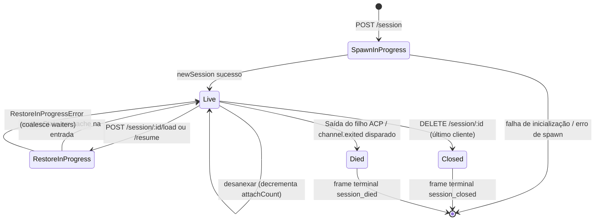

# Ciclo de Vida & Identidade da Sessão

## Visão Geral

Uma **sessão** do daemon é uma conversa lógica vinculada a um único `sessionId` do ACP. A bridge mantém um `SessionEntry` por sessão (veja [`03-acp-bridge.md`](./03-acp-bridge.md)) que acopla a conexão filha do ACP com a contabilidade do lado HTTP: FIFO de prompts, FIFO de alteração de modelo, barramento de eventos, permissões pendentes, clientes anexados, heartbeats, estado de restauração, marcadores de frame de terminal.

Um **cliente** do daemon é identificado por `X-Qwen-Client-Id` — uma string opaca validada pelo daemon que o chamador HTTP coloca em suas requisições. A bridge rastreia quais clientes estão anexados a quais sessões e usa o id do cliente originador para conduzir a política de permissão `designated`, trilhas de auditoria e atribuição de eventos.

Este documento explica cada transição do ciclo de vida da sessão (criar / anexar / carregar / retomar / fechar / morrer / expulsar) e cada superfície de identidade que o daemon expõe.

## Responsabilidades

- Criar, anexar, restaurar e eliminar sessões.
- Validar `X-Qwen-Client-Id` e rejeitar ids malformados.
- Rastrear múltiplos clientes anexados por sessão (`clientIds: Map<string, count>`, `attachCount`).
- Carimbar `originatorClientId` em eventos de saída.
- Executar heartbeats para que os dashboards saibam quais clientes ainda estão conectados.
- Expor metadados de sessão (`displayName`) que operadores definem via `PATCH /session/:id/metadata`.
- Conduzir a emissão de frames de terminal (`session_died`, `session_closed`, `client_evicted`, `stream_error`).

## Arquitetura

| Aspecto                    | Fonte                                                        | Notas                                                                                         |
| -------------------------- | ------------------------------------------------------------ | --------------------------------------------------------------------------------------------- |
| `SessionEntry`             | `packages/acp-bridge/src/bridge.ts`                          | Estrutura por sessão; veja [`03-acp-bridge.md`](./03-acp-bridge.md) para a lista completa de campos. |
| `BridgeSession` (público)  | `packages/acp-bridge/src/bridgeTypes.ts`                     | `{ sessionId, workspaceCwd, attached, clientId?, createdAt? }` retornado para handlers HTTP.   |
| `BridgeSessionState`       | `packages/acp-bridge/src/bridgeTypes.ts`                     | `LoadSessionResponse \| ResumeSessionResponse` em cache na entrada como `restoreState`.       |
| `DaemonSession` (SDK)      | `packages/sdk-typescript/src/daemon/types.ts`                | `{ sessionId, workspaceCwd, attached, clientId?, createdAt? }`.                               |
| Validação de client-id     | `packages/acp-bridge/src/bridge.ts` (em torno de `spawnOrAttach`) | Padrão `[A-Za-z0-9._:-]{1,128}`; `InvalidClientIdError` se malformado.                       |
| Eliminador de sessão desconectada | `packages/cli/src/serve/server.ts`                           | Rastreia desconexões do dono do spawn com `attachCount` + `spawnOwnerWantedKill`.             |

### Máquina de estados



### Anexar vs spawn

Sob `sessionScope: 'single'` (padrão), o `defaultEntry` da bridge é compartilhado por todos os clientes que se conectam. Um `POST /session` que chega enquanto `defaultEntry` já existe retorna `attached: true` sem criar um novo filho ACP. A bridge incrementa sincronamente `attachCount` e registra o `X-Qwen-Client-Id` do chamador em `clientIds`.

Sob `sessionScope: 'thread'`, cada thread pode criar uma sessão distinta. O chamador ainda respeita `maxSessions`.

### Identidade

`X-Qwen-Client-Id` é **opcional**, mas **fortemente recomendado**. O daemon não gera um em nome do chamador — os clientes escolhem o seu próprio e o reutilizam entre requisições para que o daemon possa atribuir votos, auditar eventos e detectar reconexões.

Regras de validação:

- Conjunto de caracteres: `[A-Za-z0-9._:-]`.
- Comprimento: 1–128.
- Fora deste conjunto: `InvalidClientIdError` (`400`).

O daemon carimba `originatorClientId` em eventos SSE de saída quando:

1. A requisição que disparou o evento carregava `X-Qwen-Client-Id`, E
2. O id está atualmente registrado no conjunto `clientIds` da sessão, E
3. A sessão tem um `activePromptOriginatorClientId` definido (atualizações inline `sessionUpdate` e `permission_request` herdam o originador do prompt ativo).

Chamadores anônimos (sem `X-Qwen-Client-Id`) funcionam para a política `first-responder`; `designated` rejeita seus votos com `permission_forbidden{ reason: 'designated_mismatch' }`; `consensus` rejeita com a mesma razão `forbidden` porque o votante não está na captura `votersAtIssue` do momento da emissão; `local-only` é a única política que aceita votantes anônimos em loopback.
## Fluxo de Trabalho

### Criar ou anexar

```mermaid
sequenceDiagram
    autonumber
    participant C as Client
    participant R as POST /session
    participant B as Bridge.spawnOrAttach
    participant CH as ACP child

    C->>R: POST /session<br/>X-Qwen-Client-Id: alice<br/>{cwd, sessionScope?}
    R->>R: validate clientId pattern
    R->>B: spawnOrAttach({cwd, sessionScope, clientId})
    alt single scope + defaultEntry exists
        B->>B: bump attachCount; register clientId
        B-->>R: {sessionId, attached: true, restoreState?}
    else cold
        B->>CH: spawn + ACP initialize + newSession
        CH-->>B: sessionId
        B->>B: build SessionEntry; register in byId
        B-->>R: {sessionId, attached: false}
    end
    R-->>C: 200 { sessionId, attached, ... }
```

### Carregar / retomar

`POST /session/:id/load` — reproduz todo o histórico ACP (notificações `session/load` disparam antes da resposta retornar).
`POST /session/:id/resume` — restaura sem reprodução (`connection.unstable_resumeSession`, exposto sob a capacidade estável `session_resume` do daemon; `unstable_session_resume` permanece um alias obsoleto).

Ambos:

1. Usam um conjunto `pendingRestoreIds` por sessão no canal para que chamadas de restauração concorrentes se agrupem (`RestoreInProgressError`).
2. Armazenam em cache `restoreState` na entrada para que um anexador tardio receba a mesma carga que o restaurador original obteve.

### Heartbeat

`POST /session/:id/heartbeat` atualiza `sessionLastSeenAt` independentemente de `clientId`. Se a requisição carregar um `X-Qwen-Client-Id` registrado, também atualiza `clientLastSeenAt.set(clientId, Date.now())`. A remoção por cliente **não** está implementada na v1; a revogação está planejada para a F-series Wave 5. Hoje, os heartbeats fornecem observabilidade para dashboards e para a futura política de revogação no PR 24.

### Metadados

`PATCH /session/:id/metadata` aceita `{displayName?}`. Validação:

- Comprimento máximo: `MAX_DISPLAY_NAME_LENGTH = 256`.
- Não deve conter caracteres de controle (`hasControlCharacter` rejeita code points ≤ 0x1f ou == 0x7f).
- `InvalidSessionMetadataError` (`400`) em caso de violação.

Uma atualização bem-sucedida propaga `session_metadata_updated` para todos os assinantes.

### Encerramento

| Quadro terminal  | Gatilho                                                                                                                                            |
| ---------------- | -------------------------------------------------------------------------------------------------------------------------------------------------- |
| `session_closed` | `DELETE /session/:id` (client_close) ou fechamento programático.                                                                                   |
| `session_died`   | `channel.exited` dispara por qualquer motivo (falha, kill do filho). Carrega `exitCode?` + `signalCode?` quando o caminho de saída do SO foi usado. |
| `client_evicted` | Estouro da fila por assinante no EventBus (veja [`10-event-bus.md`](./10-event-bus.md)). **Não** é uma terminação de sessão — apenas este assinante é fechado. |
| `stream_error`   | SubscriberLimitExceededError ou outra falha de stream no nível da rota.                                                                             |

Permissões pendentes são resolvidas como `{kind:'cancelled', reason:'session_closed'}` via `mediator.forgetSession(sessionId)` em todo caminho de encerramento.

### Disconnect-reaper guard

Quando a resposta HTTP do cliente proprietário do spawn não pode ser escrita (TCP reset no meio do handshake), a rota chama `killSession({ requireZeroAttaches: true })`. Se outro cliente já tiver anexado (`attachCount > 0`), o guarda interrompe e a sessão continua viva. Definir `spawnOwnerWantedKill = true` memoriza a intenção para que uma chamada posterior a `detachClient()` que reduza `attachCount` de volta a 0 complete a colheita deferida. Sem isso, um proprietário de spawn que se desconecta rapidamente derrubaria uma sessão saudável a cada outra reconexão.

## Estado e Ciclo de Vida

Campos de `SessionEntry` críticos para o ciclo de vida:

| Campo                              | Tipo                  | Significado                                                                              |
| ---------------------------------- | --------------------- | ---------------------------------------------------------------------------------------- |
| `clientIds`                        | `Map<string, number>` | IDs de cliente registrados → contagem de referência do registro.                        |
| `attachCount`                      | `number`              | Vezes que `spawnOrAttach` retornou `attached: true` para esta entrada.                   |
| `activePromptOriginatorClientId`   | `string?`             | Originador do prompt atualmente em execução.                                             |
| `restoreState`                     | `BridgeSessionState?` | Resposta de carregamento/retomada em cache para que anexadores tardios vejam cargas consistentes. |
| `spawnOwnerWantedKill`             | `boolean`             | Marcador de colheita deferida (veja proteção disconnect-reaper acima).                   |
| `sessionLastSeenAt`                | `number?`             | Heartbeat mais recente entre qualquer cliente (ms epoch).                                |
| `clientLastSeenAt`                 | `Map<string, number>` | Heartbeat por cliente.                                                                   |
| `pendingPermissionIds`             | `Set<string>`         | requestIds do ACP atualmente pendentes — usado em cancelamento/fechamento para resolver como cancelados. |
## Dependências

- Camada ACP: `connection.newSession`, `connection.unstable_resumeSession`, `connection.loadSession`.
- [`03-acp-bridge.md`](./03-acp-bridge.md) para a arquitetura da bridge circundante.
- [`04-permission-mediation.md`](./04-permission-mediation.md) para como originador + identidade orientam decisões de política.
- [`10-event-bus.md`](./10-event-bus.md) para entrega de terminal-frame.

## Endpoints adicionais de sessão

Estes endpoints estendem a superfície do ciclo de vida base:

### Prompt não bloqueante (`non_blocking_prompt` tag de capacidade)

`POST /session/:id/prompt` agora retorna HTTP **202** com
`{ promptId, lastEventId }` em vez de bloquear até que o prompt seja concluído. O
resultado real chega via SSE como `turn_complete` / `turn_error`, e o
campo `promptId` correlaciona esses eventos com a resposta 202.
`DaemonSessionClient.prompt()` usa automaticamente o caminho não bloqueante quando tem
uma assinatura de evento ativa e combina transparentemente o resultado do
stream SSE.

### Recap de Sessão (`session_recap` tag de capacidade)

`POST /session/:id/recap` pede ao modelo rápido um resumo de uma linha "onde parei".
Ele retorna `{ sessionId, recap: string | null }`; `null` significa que o
histórico era muito curto ou o modelo falhou temporariamente. Este endpoint é
de melhor esforço (best-effort).

### Sessão BTW / Pergunta Lateral (`session_btw` tag de capacidade)

`POST /session/:id/btw` faz uma pergunta pontual com base no contexto da sessão
sem interromper o fluxo principal da conversa. Ele usa `runForkedAgent` no
caminho de cache para uma chamada LLM de turno único, sem ferramentas, e retorna
`{ sessionId, answer: string | null }`. A implementação impõe
`BTW_MAX_INPUT_LENGTH`, proteções contra vazamento entre sessões e tratamento de timeout.

### Execução de Comando Shell

`POST /session/:id/shell` executa um comando shell diretamente no host do daemon,
sem rotear através do LLM. Ele transmite a saída no barramento SSE da sessão via
eventos `user_shell_command` / `user_shell_result` e injeta o comando mais
o resultado no histórico da conversa do LLM. A resposta é
`{ exitCode, output, aborted }`.

### Desanexação de Sessão

`POST /session/:id/detach` desanexa explicitamente um cliente de uma sessão ao
decrementar `attachCount`; não fecha a sessão por si só. Se nenhum outro
attach ou assinante restar, a sessão é eliminada. O endpoint retorna 204.

### Exclusão em Lote de Sessões

`POST /sessions/delete` aceita `{ sessionIds: string[] }` (até 100 ids),
fecha sessões da bridge e exclui arquivos de transcrição. Usa
`Promise.allSettled` para resiliência e retorna `{ removed, notFound, errors }`.

### Uso de Contexto (`session_context_usage` tag de capacidade)

`GET /session/:id/context-usage` retorna o uso estruturado da janela de contexto.
`?detail=true` inclui uso mais granular agrupado por ferramenta, memória e habilidade.

### Estatísticas de Sessão (`session_stats` tag de capacidade)

`GET /session/:id/stats` retorna estatísticas de uso: métricas do modelo
(tokens de entrada/saída, leituras/gravações de cache, custo total), contagens de chamadas por ferramenta e
latências, contagens de edições de arquivo e contagens de invocação por habilidade para a sessão
ativa. O bloco `skills` reflete cargas de corpo de habilidade e comandos de barra de habilidade
apenas dentro desta sessão; não é um agregado de atividade entre sessões.

### Tarefas de Sessão (`session_tasks` tag de capacidade)

`GET /session/:id/tasks` retorna um instantâneo das tarefas em segundo plano para tarefas de agente,
tarefas de shell, tarefas de monitoramento e seus estados de ciclo de vida.

### Status LSP da Sessão (`session_lsp` tag de capacidade)

`GET /session/:id/lsp` retorna o status LSP sanitizado por sessão para clientes
do daemon: ativação, contagens agregadas de servidores, estado de indisponível/inicialização,
e por servidor `name`, `status`, `languages`, `transport`, `command` e
`error`. LSP desabilitado ou indisponível é representado como dados de status HTTP 200,
não como um erro de transporte.

### Replay Compactado

`POST /session/:id/load` agora retorna um `BridgeRestoredSession` que pode incluir
`compactedReplay?: BridgeEvent[]`, `liveJournal?: BridgeEvent[]` e
`lastEventId?: number`. `compactedReplay` é produzido por
`TurnBoundaryCompactionEngine`: nos limites de turno ele mescla blocos consecutivos de texto /
pensamento, colapsa sequências de chamadas de ferramenta para seu estado final, descarta
sinais transitórios e produz logs de replay O(turns) em vez de logs O(tokens)
(tipicamente uma redução de 25 a 30 vezes).

### Pré-aquecimento de Filho ACP

`bridge.preheat()` aquece o processo filho ACP antes da primeira sessão para que
a primeira sessão real evite latência de inicialização a frio. Ele emparelha com
`channelIdleTimeoutMs`, que mantém o filho ACP vivo após a última sessão
ser fechada, e o comportamento de pular re-lançamento, que reutiliza um filho já ocioso quando uma
nova sessão chega.

## Configuração

- `BridgeOptions.maxSessions` (padrão 20) — limite.
- `BridgeOptions.sessionScope` (padrão `'single'`; opcional `'thread'`).
- `BridgeOptions.initializeTimeoutMs` (padrão 10s) — handshake `initialize` do ACP.
- `BridgeOptions.channelIdleTimeoutMs` (padrão 0; elimina o filho ACP imediatamente).
- Tags de capacidade: `session_create`, `session_scope_override`, `session_load`, `session_resume`, `unstable_session_resume` (deprecated alias), `session_list`, `session_close`, `session_metadata`, `session_set_model`, `client_identity`, `client_heartbeat`, `session_recap`, `session_btw`, `session_context_usage`, `session_tasks`, `session_stats`, `session_lsp`, `non_blocking_prompt`.
## Riscos e Limitações Conhecidas

- `connection.unstable_resumeSession` pode ainda ser instável na camada ACP, mas o daemon anuncia o contrato de rota v1 commitado com `session_resume`. `unstable_session_resume` é mantido apenas como um alias de compatibilidade obsoleto.
- A v1 **não tem despejo por cliente**; apenas encerramento por sessão e por assinante. A política de revogação é Série F Wave 5 / PR 24.
- `client_evicted` é por assinante, não por sessão. Um cliente cujo assinante SSE foi despejado pode reconectar.
- Clientes anônimos (sem `X-Qwen-Client-Id`) não podem votar sob políticas `designated` ou `consensus`.

## Referências

- `packages/acp-bridge/src/bridge.ts` (definição de SessionEntry)
- `packages/acp-bridge/src/bridgeTypes.ts` (`HttpAcpBridge`, `BridgeSession`, `BridgeSessionState`)
- `packages/sdk-typescript/src/daemon/types.ts` (`DaemonSession`)
- `packages/sdk-typescript/src/daemon/DaemonSessionClient.ts`
- Referência do wire: [`../qwen-serve-protocol.md`](../qwen-serve-protocol.md) (catálogo de rotas).
