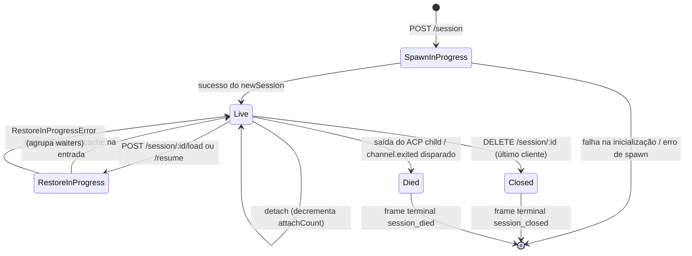

# Ciclo de Vida e Identidade da Sessão

## Visão Geral

Uma **sessão** do daemon é uma conversa lógica fixada em um `sessionId` do ACP. O bridge mantém um `SessionEntry` por sessão (consulte [`03-acp-bridge.md`](./03-acp-bridge.md)), que acopla a conexão filho do ACP com o controle no lado HTTP: FIFO de prompts, FIFO de alterações de modelo, barramento de eventos, permissões pendentes, clientes conectados, heartbeats, estado de restauração e tombstones de frames terminais.

Um **cliente** do daemon é identificado por `X-Qwen-Client-Id` — uma string opaca e validada pelo daemon que o chamador HTTP adiciona às suas requisições. O bridge rastreia quais clientes estão conectados a quais sessões e usa o ID do cliente originador para orientar a política de permissão `designated`, trilhas de auditoria e atribuição de eventos.

Este documento explica cada transição do ciclo de vida da sessão (create / attach / load / resume / close / die / evict) e cada superfície de identidade que o daemon expõe.

## Responsabilidades

- Criar, conectar, restaurar e coletar sessões.
- Validar `X-Qwen-Client-Id` e rejeitar IDs malformados.
- Rastrear múltiplos clientes conectados por sessão (`clientIds: Map<string, count>`, `attachCount`).
- Aplicar `originatorClientId` em eventos de saída.
- Executar heartbeats para que os dashboards saibam quais clientes ainda estão conectados.
- Expor metadados da sessão (`displayName`) definidos pelos operadores via `PATCH /session/:id/metadata`.
- Controlar a emissão de frames terminais (`session_died`, `session_closed`, `client_evicted`, `stream_error`).

## Arquitetura

| Concern                   | Source                                                       | Notes                                                                                     |
| ------------------------- | ------------------------------------------------------------ | ----------------------------------------------------------------------------------------- |
| `SessionEntry`            | `packages/acp-bridge/src/bridge.ts`                          | Estrutura por sessão; consulte [`03-acp-bridge.md`](./03-acp-bridge.md) para a lista completa de campos.  |
| `BridgeSession` (public)  | `packages/acp-bridge/src/bridgeTypes.ts`                     | `{ sessionId, workspaceCwd, attached, clientId?, createdAt? }` retornado para os handlers HTTP. |
| `BridgeSessionState`      | `packages/acp-bridge/src/bridgeTypes.ts`                     | `LoadSessionResponse \| ResumeSessionResponse` em cache na entrada como `restoreState`.     |
| `DaemonSession` (SDK)     | `packages/sdk-typescript/src/daemon/types.ts`                | `{ sessionId, workspaceCwd, attached, clientId?, createdAt? }`.                           |
| Client-id validation      | `packages/acp-bridge/src/bridge.ts` (around `spawnOrAttach`) | Padrão `[A-Za-z0-9._:-]{1,128}`; `InvalidClientIdError` se malformado.                    |
| Session disconnect-reaper | `packages/cli/src/serve/server.ts`                           | Rastreia desconexões do proprietário do spawn com `attachCount` + `spawnOwnerWantedKill`.               |

### Máquina de estados

```mermaid
stateDiagram-v2
    [*] --> SpawnInProgress: POST /session
    SpawnInProgress --> Live: sucesso do newSession
    SpawnInProgress --> [*]: falha na inicialização / erro de spawn
    Live --> Live: attach (sessionScope=single, incrementa attachCount)
    Live --> Live: detach (decrementa attachCount)
    Live --> RestoreInProgress: POST /session/:id/load ou /resume
    RestoreInProgress --> Live: restoreState em cache na entrada
    RestoreInProgress --> Live: RestoreInProgressError (agrupa waiters)
    Live --> Closed: DELETE /session/:id (último cliente)
    Live --> Died: saída do ACP child / channel.exited disparado
    Closed --> [*]: frame terminal session_closed
    Died --> [*]: frame terminal session_died
```

### Attach vs spawn

Sob `sessionScope: 'single'` (padrão), o `defaultEntry` do bridge é compartilhado por todos os clientes conectados. Um `POST /session` que chega enquanto o `defaultEntry` já existe retorna `attached: true` sem criar um novo ACP child. O bridge incrementa `attachCount` de forma síncrona e registra o `X-Qwen-Client-Id` do chamador em `clientIds`.

Sob `sessionScope: 'thread'`, cada thread pode criar uma sessão distinta. O chamador ainda respeita o `maxSessions`.

### Identidade

`X-Qwen-Client-Id` é **opcional**, mas **fortemente recomendado**. O daemon não gera um em nome do chamador — os clientes escolhem o seu próprio e o reutilizam entre requisições para que o daemon possa atribuir votos, auditar eventos e detectar reconexões.

Cada controlador independente deve usar um ID distinto e estável. O WebUI gera IDs com o prefixo `webui_` por padrão. Um host e um WebShell incorporado devem compartilhar um ID apenas quando intencionalmente atuam como um único controlador lógico; uma vez compartilhado, os logs do daemon não conseguem distinguir qual deles originou uma requisição.

Regras de validação:

- Charset: `[A-Za-z0-9._:-]`.
- Comprimento: 1–128.
- Fora deste conjunto: `InvalidClientIdError` (`400`).

O daemon aplica o carimbo de `originatorClientId` em eventos SSE de saída quando:

1. A requisição que disparou o evento carregava `X-Qwen-Client-Id`, E
2. O ID está atualmente registrado no conjunto `clientIds` da sessão, E
3. A sessão tem um `activePromptOriginatorClientId` definido (o `sessionUpdate` inline e `permission_request` herdam o originador do prompt ativo).

Chamadores anônimos (sem `X-Qwen-Client-Id`) funcionam normalmente para a política `first-responder`; `designated` rejeita seus votos com `permission_forbidden{ reason: 'designated_mismatch' }`; `consensus` rejeita com o mesmo motivo `forbidden` porque o votante não está no snapshot `votersAtIssue` do momento da emissão; `local-only` é a única política que aceita votantes anônimos de loopback.

## Fluxo de Trabalho

### Criar ou conectar

```mermaid
sequenceDiagram
    autonumber
    participant C as Cliente
    participant R as POST /session
    participant B as Bridge.spawnOrAttach
    participant CH as ACP child

    C->>R: POST /session<br/>X-Qwen-Client-Id: alice<br/>{cwd, sessionScope?}
    R->>R: validar padrão do clientId
    R->>B: spawnOrAttach({cwd, sessionScope, clientId})
    alt single scope + defaultEntry existe
        B->>B: incrementa attachCount; registra clientId
        B-->>R: {sessionId, attached: true, restoreState?}
    else cold
        B->>CH: spawn + ACP initialize + newSession
        CH-->>B: sessionId
        B->>B: constrói SessionEntry; registra em byId
        B-->>R: {sessionId, attached: false}
    end
    R-->>C: 200 { sessionId, attached, ... }
```

### Load / resume

`POST /session/:id/load` — restaura uma sessão persistida e retorna a janela atual de snapshot de replay limitado (as notificações de `session/load` ou o replay em modo resposta são semeados antes da resposta retornar).
`POST /session/:id/resume` — restaura sem replay (`connection.unstable_resumeSession`, exposto sob a capability estável `session_resume` do daemon; `unstable_session_resume` permanece como um alias depreciado).

Ambos:

1. Usam um conjunto `pendingRestoreIds` por sessão no canal para que chamadas de restauração concorrentes sejam agrupadas (`RestoreInProgressError`).
2. Fazem cache de `restoreState` na entrada para que um cliente que se conecte tardiamente receba o mesmo payload que o restaurador original recebeu.

### Heartbeat

`POST /session/:id/heartbeat` atualiza `sessionLastSeenAt` independentemente do `clientId`. Se a requisição carregar um `X-Qwen-Client-Id` registrado, `clientLastSeenAt.set(clientId, Date.now())` também é atualizado. A evicção por cliente **não** está implementada na v1; a revogação está planejada para o F-series Wave 5. Atualmente, os heartbeats fornecem observabilidade para os dashboards e para a futura política de revogação no PR 24.

### Metadados

`PATCH /session/:id/metadata` aceita `{displayName?}`. Validação:

- Comprimento máximo: `MAX_DISPLAY_NAME_LENGTH = 256`.
- Não deve conter caracteres de controle (`hasControlCharacter` rejeita code points ≤ 0x1f ou == 0x7f).
- `InvalidSessionMetadataError` (`400`) em caso de violação.

Uma atualização bem-sucedida distribui `session_metadata_updated` para todos os subscribers.

### Encerramento

| Terminal frame   | Trigger                                                                                                                                                       |
| ---------------- | ------------------------------------------------------------------------------------------------------------------------------------------------------------- |
| `session_closed` | `DELETE /session/:id` (client_close) ou fechamento programático.                                                                                                   |
| `session_died`   | `channel.exited` é disparado por qualquer motivo (crash, child kill). Carrega `exitCode?` + `signalCode?` quando o caminho de saída do SO foi usado.                                |
| `client_evicted` | Estouro de fila por subscriber no EventBus (consulte [`10-event-bus.md`](./10-event-bus.md)). NÃO é um encerramento no nível da sessão — apenas este subscriber é fechado. |
| `stream_error`   | SubscriberLimitExceededError ou outra falha de stream no nível da rota.                                                                                             |

Permissões pendentes são resolvidas como `{kind:'cancelled', reason:'session_closed'}` via `mediator.forgetSession(sessionId)` em todos os caminhos de encerramento.

### Guard do disconnect-reaper

Quando a resposta HTTP do cliente proprietário do spawn não pode ser escrita (TCP reset no meio do handshake), a rota chama `killSession({ requireZeroAttaches: true })`. Se outro cliente já se conectou (`attachCount > 0`), o guard interrompe o fluxo e a sessão continua viva. Definir `spawnOwnerWantedKill = true` lembra a intenção para que um `detachClient()` posterior que traga o `attachCount` de volta para 0 conclua a coleta adiada. Sem isso, um proprietário de spawn que se desconecta rapidamente derrubaria uma sessão saudável a cada outra reconexão.

## Estado e Ciclo de Vida

Campos de `SessionEntry` críticos para o ciclo de vida:

| Field                            | Type                  | Meaning                                                                          |
| -------------------------------- | --------------------- | -------------------------------------------------------------------------------- |
| `clientIds`                      | `Map<string, number>` | IDs de clientes registrados → contagem de referências de registro.                                  |
| `attachCount`                    | `number`              | Vezes que `spawnOrAttach` retornou `attached: true` para esta entrada.                  |
| `activePromptOriginatorClientId` | `string?`             | Originador do prompt em execução no momento.                                     |
| `restoreState`                   | `BridgeSessionState?` | Resposta de load/resume em cache para que clientes que se conectem tardiamente vejam payloads consistentes.           |
| `spawnOwnerWantedKill`           | `boolean`             | Tombstone de coleta adiada (consulte disconnect-reaper acima).                           |
| `sessionLastSeenAt`              | `number?`             | Heartbeat mais recente entre qualquer cliente (epoch ms).                              |
| `clientLastSeenAt`               | `Map<string, number>` | Heartbeat por cliente.                                                            |
| `pendingPermissionIds`           | `Set<string>`         | ACP requestIds atualmente pendentes — usado no cancelamento/fechamento para resolver como cancelado. |

## Dependências

- Camada ACP: `connection.newSession`, `connection.unstable_resumeSession`, `connection.loadSession`.
- [`03-acp-bridge.md`](./03-acp-bridge.md) para a arquitetura do bridge ao redor.
- [`04-permission-mediation.md`](./04-permission-mediation.md) para como originador + identidade orientam as decisões de política.
- [`10-event-bus.md`](./10-event-bus.md) para a entrega de frames terminais.

## Endpoints de sessão adicionais

Estes endpoints estendem a superfície do ciclo de vida base:

### Prompt Não Bloqueante (`non_blocking_prompt` capability tag)

`POST /session/:id/prompt` agora retorna HTTP **202** com
`{ promptId, lastEventId }` em vez de bloquear até que o prompt seja concluído. O
resultado real chega no SSE como `turn_complete` / `turn_error`, e o
campo `promptId` correlaciona esses eventos com a resposta 202.
`DaemonSessionClient.prompt()` usa automaticamente o caminho não bloqueante quando tem
uma assinatura de evento ativa e corresponde de forma transparente ao resultado do
stream SSE.

### Recap da Sessão (`session_recap` capability tag)

`POST /session/:id/recap` pede ao modelo rápido um resumo de uma linha sobre "onde eu parei".
Retorna `{ sessionId, recap: string | null }`; `null` significa que o
histórico era muito curto ou o modelo falhou temporariamente. Este endpoint é
best-effort.

### Session BTW / Side Question (tag de capability `session_btw`)

`POST /session/:id/btw` faz uma pergunta pontual no contexto da sessão sem interromper o fluxo principal da conversa. Ele usa `runForkedAgent` no caminho do cache para uma chamada LLM de turno único e sem ferramentas, retornando `{ sessionId, answer: string | null }`. A implementação impõe `BTW_MAX_INPUT_LENGTH`, proteções contra vazamento entre sessões e tratamento de timeout.

### Execução de Comandos Shell

`POST /session/:id/shell` executa um comando shell diretamente no host do daemon, sem roteamento pelo LLM. Ele transmite a saída no barramento SSE da sessão por meio dos eventos `user_shell_command` / `user_shell_result` e injeta o comando e o resultado no histórico de conversas do LLM. A resposta é `{ exitCode, output, aborted }`. Para uma sessão ativa de workspace secundário, a rota REST singular resolve o proprietário da sessão e executa na bridge daquele runtime, então o comando inicia no cwd do workspace proprietário. A rota não fornece um sandbox de caminho. Clientes ACP qualificados por workspace podem continuar a usar `_qwen/session/shell` na conexão do workspace proprietário.

### Rewind da Sessão

`GET /session/:id/rewind/snapshots` e `POST /session/:id/rewind` resolvem o runtime ativo do workspace proprietário. Sessões persistidas devem ser carregadas ou retomadas antes do rewind. O rewind trunca o histórico de conversas e opcionalmente restaura arquivos rastreados por `edit` e `write_file`; não desfaz comandos shell, Git, scripts ou alterações manuais. A restauração de arquivos é best-effort, então uma resposta pode reportar `rewound: false` e `filesFailed[]` depois que o histórico de conversas já avançou. Chamadas de rewind do SDK sempre usam REST consciente do proprietário, inclusive quando o cliente usa transporte ACP, porque a mutação deve reter autenticação REST estrita.

### Desanexar Sessão

`POST /session/:id/detach` desanexa explicitamente um cliente de uma sessão decrementando `attachCount`; ele não fecha a sessão por si só. Se não houver outro anexo ou assinante restante, a sessão é descartada. O endpoint retorna 204.

### Exclusão de Sessões em Lote

`POST /sessions/delete` aceita `{ sessionIds: string[] }` (até 100 ids), fecha sessões da bridge e exclui arquivos de transcrição ativos ou arquivados. Se existirem arquivos JSONL ativos e arquivados para o mesmo id, a exclusão forçada remove ambos para que os operadores possam limpar o conflito. Ele limpa sidecars de worktree ativos e arquivados, mas mantém snapshots de histórico de arquivos, transcrições de subagentes e sidecars de runtime intactos. Usa `Promise.allSettled` para resiliência e retorna `{ removed, notFound, errors }`.

### Arquivamento de Sessão

`POST /sessions/archive` move arquivos JSONL de sessões inativas de `chats/` para `chats/archive/`. Se a sessão de destino estiver ativa, o daemon primeiro entra em um gate de arquivamento por sessão e realiza um fechamento estrito que exige que o filho ACP faça o flush de `ChatRecordingService`; o arquivamento deixa o JSONL no lugar se o fechamento ou o flush falharem.

`POST /sessions/unarchive` move arquivos JSONL arquivados de volta para `chats/`. Esta é apenas uma transição de estado de armazenamento; os clientes devem chamar `session/load` ou `session/resume` depois. Sessões arquivadas retornam `409 session_archived` para load/resume, e mutações que competem com uma transição de arquivamento retornam `409 session_archiving`.

Arquivos de transcrição regulares vazios, danificados e órfãos permanecem elegíveis para essas operações de ciclo de vida mesmo quando não podem ser carregados como conversas. As verificações de segurança de propriedade podem intencionalmente fail closed e exigir intervenção do operador. Um arquivo alterado após um escritor ter selado sua prova de handoff certificada falha com `SessionTranscriptChangedError` até que o operador resolva o lock selado e os bytes alterados. Um primeiro registro físico em formato JSON que excede a janela limitada de leitura de propriedade falha com `SessionTranscriptIdentityUnavailableError` até que o registro seja reparado ou reduzido; registros danificados de tamanho excessivo com prefixo não-objeto permanecem elegíveis. Um registro recuperado e analisável deve conter os campos de propriedade `sessionId` e `cwd` como strings, e estados de arquivamento locais/estranhos misturados também fail closed. Quando `session_storage_conflict_repair` é anunciado, archive e unarchive aceitam `resolveConflicts: true`: archive mantém a cópia arquivada, enquanto unarchive mantém a cópia ativa. Sem essa opção, conflitos ativo/arquivado não movem, removem nem sobrescrevem nenhuma cópia persistida e são retornados no array `errors` do lote. O archive ainda fecha estritamente uma sessão ativa antes de classificar o conflito, o que pode fazer flush de registros enfileirados na transcrição ativa. As rotas de ciclo de vida qualificadas por workspace agora usam esse envelope HTTP `200` de lote em vez de sua resposta anterior HTTP `409 session_conflict`.

### Uso de Contexto (tag de capability `session_context_usage`)

`GET /session/:id/context-usage` retorna o uso estruturado da janela de contexto. `?detail=true` inclui um uso mais detalhado agrupado por ferramenta, memória e skill.

### Estatísticas da Sessão (tag de capability `session_stats`)

`GET /session/:id/stats` retorna estatísticas de uso: métricas do modelo (tokens de entrada/saída, leituras/escritas de cache, custo total), contagens e latências de chamadas por ferramenta, contagens de edições de arquivo e contagens de invocações por skill para a sessão ativa. O bloco `skills` reflete carregamentos de corpo de skill e comandos slash de skill apenas dentro desta sessão; não é um agregado de atividades entre sessões.

### Tarefas da Sessão (tag de capability `session_tasks`)

`GET /session/:id/tasks` retorna um snapshot de tarefas em segundo plano para tarefas de agente, tarefas de shell, tarefas de monitor e seus estados de ciclo de vida. Entradas de agente geradas por outro subagente carregam campos de linhagem opcionais (`parentAgentId`, `parentName`, `depth`) para que os clientes possam renderizar subagentes aninhados como uma árvore; veja o exemplo de payload em `qwen-serve-protocol.md`.

A capability `session_monitor_tool_correlation` garante adicionalmente que entradas de monitor carregam `toolUseId`, permitindo que clientes correlacionem uma chamada de ferramenta da transcrição com os detalhes da tarefa.

### Status LSP da Sessão (tag de capability `session_lsp`)

`GET /session/:id/lsp` retorna o status LSP por sessão higienizado para clientes do daemon: habilitação, contagens agregadas de servidores, estado indisponível/inicialização e `name`, `status`, `languages`, `transport`, `command` e `error` por servidor. LSP desabilitado ou indisponível é representado como dados de status HTTP 200, não como um erro de transporte.

### Replay Compactado

`POST /session/:id/load` agora retorna um `BridgeRestoredSession` que pode incluir `compactedReplay?: BridgeEvent[]`, `liveJournal?: BridgeEvent[]` e `lastEventId?: number`. Esses campos são a janela de replay em memória limitada do daemon para uma sessão ativa, não uma API de transcrição completa. O limite padrão da janela é 4 MiB por sessão ativa (`--compacted-replay-max-bytes`), e a inicialização rejeita limites inválidos; o teto rígido é 256 MiB. `compactedReplay` é produzido pelo `TurnBoundaryCompactionEngine`: nos limites de turno, ele consolida blocos consecutivos de texto/pensamento, colapsa sequências de chamadas de ferramentas para seu estado final, descarta sinais transitórios e produz logs de replay O(turnos) em vez de logs O(tokens) (tipicamente uma redução de 25-30x). Quando entradas de replay mais antigas foram descartadas dessa janela de bytes, `compactedReplay[0]` é um marcador sintético sem id `history_truncated` com `{reason: 'replay_window_exceeded', truncatedEvents, retainedEvents, maxBytes, truncatedTurns?, fullTranscriptAvailable: boolean}`. `fullTranscriptAvailable` é uma flag de capability: `true` significa que o cliente pode paginar a transcrição completa persistida com `GET /session/:id/transcript`, enquanto `false` significa que apenas o replay limitado está disponível. Clientes devem renderizá-lo como status e aplicar o replay retido normalmente; não deve disparar um loop de ressincronização.

### Pré-aquecimento do Filho ACP

`bridge.preheat()` permanece disponível para embedders explícitos, mas o `qwen serve` também tenta pré-aquecer o filho primário confiável após a inicialização para compatibilidade. Um pré-aquecimento com falha não é fatal e o próximo comando de runtime ou sessão tenta novamente; secundários confiáveis iniciam no primeiro uso. O Workspace Runtime é dono do filho enquanto houver trabalho ativo. Após todos os leases de sessão e gerenciamento drenarem, um `channelIdleTimeoutMs` omitido ou zero coleta o filho imediatamente; o próprio pré-aquecimento simples é preservado para o primeiro uso e não arma esse coletor. Um atraso configurado positivo ou keepalive ativo mantém o filho reutilizável pela janela restante mais longa. O comando público `ensure` do Workspace Runtime adiciona um lease de workspace renovável de dez minutos; cada chamada bem-sucedida reseta essa janela, inclusive quando o canal já estava ativo.

## Configuração

- `BridgeOptions.maxSessions` (padrão 32) — limite máximo.
- `BridgeOptions.sessionScope` (padrão `'single'`; opcional `'thread'`).
- `BridgeOptions.initializeTimeoutMs` (padrão 10s) — deadline de inicialização do filho ACP (factory do Channel + handshake `initialize`) e timeout padrão de requisição.
- `BridgeOptions.sessionRestoreTimeoutMs` (padrão 60s) — deadline do ACP `loadSession` / `unstable_resumeSession`. O padrão é 60s; um timeout de initialize configurado explicitamente pode elevá-lo, mas nunca reduzi-lo.
- `BridgeOptions.channelIdleTimeoutMs` (não definido ou `0` coleta após drenagem do trabalho de runtime, exceto que o pré-aquecimento simples é preservado para o primeiro uso; um valor positivo ou keepalive ativo atrasa a coleta, e o atraso maior vence).
- Tags de capability: `session_create`, `session_id_override`, `session_scope_override`, `session_load`, `session_resume`, `unstable_session_resume` (alias depreciado), `session_list`, `session_info`, `session_close`, `session_metadata`, `session_set_model`, `client_identity`, `client_heartbeat`, `session_recap`, `session_generation`, `session_btw`, `session_context_usage`, `session_tasks`, `session_monitor_tool_correlation`, `session_stats`, `session_lsp`, `session_status`, `non_blocking_prompt`.

### Geração sem estado (tag de capability `session_generation`)

`POST /session/:id/generate` aceita `{ "prompt": string }` e retorna um stream SSE escopo-da-requisição com eventos `started`, `thinking` opcional, `delta`, `done` ou `error`. A requisição não lê histórico de conversas, não grava turno e não expõe ferramentas. O filho ACP usa um modelo rápido configurado válido quando disponível e caso contrário usa o modelo principal da sessão.

## Ressalvas e Limites Conhecidos

- `connection.unstable_resumeSession` ainda pode ser instável na camada ACP, mas o daemon anuncia o contrato de rota v1 comprometido com `session_resume`. `unstable_session_resume` é mantido apenas como um alias de compatibilidade depreciado.
- A v1 **não possui eviction por cliente**; apenas terminação por sessão e por assinante. A política de revogação é F-series Wave 5 / PR 24.
- `client_evicted` é por assinante, não por sessão. Um cliente cujo assinante SSE foi removido pode reconectar.
- Clientes anônimos (sem `X-Qwen-Client-Id`) não podem votar sob políticas `designated` ou `consensus`.

## Referências

- `packages/acp-bridge/src/bridge.ts` (definição de SessionEntry)
- `packages/acp-bridge/src/bridgeTypes.ts` (`HttpAcpBridge`, `BridgeSession`, `BridgeSessionState`)
- `packages/sdk-typescript/src/daemon/types.ts` (`DaemonSession`)
- `packages/sdk-typescript/src/daemon/DaemonSessionClient.ts`
- Referência de wire: [`../qwen-serve-protocol.md`](../qwen-serve-protocol.md) (catálogo de rotas).