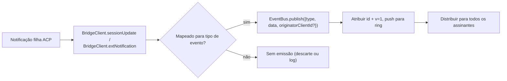
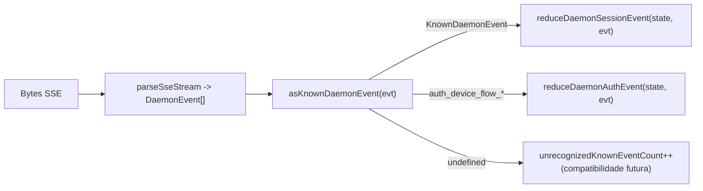

# Esquema de Eventos Tipificados do Daemon v1

## Visão Geral

Cada frame SSE emitido pelo daemon em `GET /session/:id/events` tem a forma `{ id, v, type, data, originatorClientId?, _meta? }`. `v: 1` é o `EVENT_SCHEMA_VERSION` atual. `type` vem do conjunto fechado e com versão fixa `DAEMON_KNOWN_EVENT_TYPE_VALUES` definido em `packages/sdk-typescript/src/daemon/events.ts`; o conjunto atual possui 43 tipos de eventos conhecidos. O campo `_meta` do envelope é carimbado na fronteira de escrita SSE por `formatSseFrame()` em `server.ts`; veja [Metadados no nível do envelope](#envelope-level-metadata).

O SDK expõe `asKnownDaemonEvent(evt)`. Ele retorna um `KnownDaemonEvent` discriminado para tipos de eventos conhecidos e `undefined` para outros tipos. Os consumidores do SDK podem, portanto, lidar com compatibilidade futura sem exigir uma atualização sincronizada do SDK quando um daemon mais novo adicionar um tipo de evento; o reducer da sessão registra esses como `unrecognizedKnownEventCount`.

O formato wire está em [`../qwen-serve-protocol.md`](../qwen-serve-protocol.md). Esta página é o contrato de payload para cada evento.

## Responsabilidades

- Fornecer a fonte única da verdade para o vocabulário de eventos (`DAEMON_KNOWN_EVENT_TYPE_VALUES`).
- Fornecer um envelope tipificado para cada tipo de evento (`DaemonEventEnvelope<TType, TData>`).
- Fornecer reducers puros (`reduceDaemonSessionEvent`, `reduceDaemonAuthEvent`) que projetam um stream de eventos no estado de visualização do SDK.
- Transmitir a tag de capacidade `typed_event_schema` como um sinal informativo. Se a tag estiver ausente, `asKnownDaemonEvent` ainda recai para `unknown`.

## Vocabulário de eventos (43 tipos conhecidos)

Agrupados por domínio.

### Sessão principal

| Tipo                       | Direção | Gatilho                                                                        | Campos principais do payload                                                            |
| -------------------------- | ------- | ------------------------------------------------------------------------------ | --------------------------------------------------------------------------------------- |
| `session_update`           | S->C    | Qualquer notificação ACP `sessionUpdate`: texto do agente, pensamento, chamada de ferramenta ou plano | `sessionUpdate: string, content?: ...` (forma ACP opaca)                               |
| `session_metadata_updated` | S->C    | `PATCH /session/:id/metadata`                                                  | `sessionId, displayName?`                                                               |
| `session_died`             | S->C terminal | `channel.exited`                                                          | `sessionId, reason, exitCode? \| null, signalCode? \| null`                             |
| `session_closed`           | S->C terminal | `DELETE /session/:id` ou fechamento programático                          | `sessionId, reason: 'client_close' \| string, closedBy?`                                |
| `session_snapshot`         | S->C sintético | Frame de snapshot após anexação SSE / replay                             | `sessionId, currentModelId: string \| null, currentApprovalMode: string \| null`        |

### Frames sintéticos por assinante

| Tipo                    | Gatilho                                                                                                                                                                                                                              | Notas                                                                                                                                                                                                                                                                                                                        |
| ----------------------- | ------------------------------------------------------------------------------------------------------------------------------------------------------------------------------------------------------------------------------------ | ---------------------------------------------------------------------------------------------------------------------------------------------------------------------------------------------------------------------------------------------------------------------------------------------------------------------------- |
| `client_evicted`        | Estouro da fila EventBus por assinante. **Sem `id`**                                                                                                                                                                                 | `reason: string, droppedAfter?: number`; terminal apenas para o assinante atual, enquanto a sessão permanece ativa.                                                                                                                                                                                                          |
| `slow_client_warning`   | Fila >= 75%; enviado à força e **não possui `id`**                                                                                                                                                                                   | `queueSize, maxQueued, lastEventId`; rearmado após a fila cair abaixo de 37,5%.                                                                                                                                                                                                                                             |
| `stream_error`          | `SubscriberLimitExceededError` ou outro erro de stream de rota                                                                                                                                                                       | `error: string`; terminal para a assinatura.                                                                                                                                                                                                                                                                                 |
| `state_resync_required` | `subscribe({lastEventId})` detecta que o anel do daemon não contém mais `[lastEventId+1, earliestInRing-1]`, ou o cursor do cliente é de uma época de barramento anterior. Enviado à força **antes** dos frames de replay restantes e **não possui `id`**. | `reason: 'ring_evicted' \| 'epoch_reset' \| string`, `lastDeliveredId: number`, `earliestAvailableId: number`. Este é um sinal de recuperação, não terminal: o stream SSE permanece aberto e os frames de replay + live continuam. O reducer do SDK define `awaitingResync = true` e ignora deltas até que o chamador reinicie com `loadSession`. |
| `replay_complete`       | Sentinel sem id emitido após o loop de replay `Last-Event-ID` terminar, tanto para replay limpo quanto para caminhos de anel removido, mesmo quando `data.replayedCount === 0`. **Sem `id`**                                         | `replayedCount: number`; permite que consumidores removam a UI de recuperação de forma determinística, sem um timeout.                                                                                                                                                                                                       |

### Permissões (F3 + base)

| Tipo                          | Direção | Gatilho                                            | Campos principais do payload                                                                                                                             |
| ----------------------------- | ------- | -------------------------------------------------- | -------------------------------------------------------------------------------------------------------------------------------------------------------- |
| `permission_request`          | S->C    | Agente chama `requestPermission`                   | `requestId, sessionId, toolCall, options[]`; o envelope carimba `originatorClientId` do originador do prompt.                                            |
| `permission_resolved`         | S->C    | Mediador decidiu                                   | `requestId, outcome` (ACP `PermissionOutcome`)                                                                                                           |
| `permission_already_resolved` | S->C    | Voto chega após a requisição já ter sido decidida  | `requestId, sessionId, outcome`                                                                                                                          |
| `permission_partial_vote`     | S->C    | Política `consensus` registra um voto não final    | `requestId, sessionId, votesReceived, votesNeeded (>= 1), quorum, optionTallies: Record<string, number>, originatorClientId?`                            |
| `permission_forbidden`        | S->C    | Política rejeita um voto                           | `requestId, sessionId, clientId?, reason: 'designated_mismatch' \| 'remote_not_allowed', originatorClientId?`; votantes anônimos omitem `clientId`.      |

### Modelos

| Tipo                  | Direção | Payload                                      |
| --------------------- | ------- | -------------------------------------------- |
| `model_switched`      | S->C    | `sessionId, modelId`                         |
| `model_switch_failed` | S->C    | `sessionId, requestedModelId, error: string` |

### Guardrails MCP (PR 14b + F2)

| Tipo                         | Direção | Payload                                                                                                                                                                                                                                                                                                                                                                                                                                     |
| ---------------------------- | ------- | ------------------------------------------------------------------------------------------------------------------------------------------------------------------------------------------------------------------------------------------------------------------------------------------------------------------------------------------------------------------------------------------------------------------------------------------- |
| `mcp_budget_warning`         | S->C    | `liveCount, reservedCount, budget, thresholdRatio: 0.75, mode: 'warn' \| 'enforce', scope?: 'workspace' \| 'session'`                                                                                                                                                                                                                                                                                                                       |
| `mcp_child_refused_batch`    | S->C    | `refusedServers: [{ name, transport, reason: 'budget_exhausted' }], budget, liveCount, reservedCount, mode: 'enforce', scope?: 'workspace' \| 'session'`                                                                                                                                                                                                                                                                                    |
| `mcp_server_restarted`       | S->C    | `serverName, durationMs, entryIndex?` para reinicializações de pool multi-entrada F2                                                                                                                                                                                                                                                                                                                                                        |
| `mcp_server_restart_refused` | S->C    | `serverName, reason: 'budget_would_exceed' \| 'in_flight' \| 'disabled' \| 'restart_failed', entryIndex?, details?`. O quarto valor, `restart_failed`, carrega uma falha grave subjacente para reinicialização multi-entrada em modo pool. `MCP_RESTART_REFUSED_REASONS` rejeita razões desconhecidas; um reducer SDK mais antigo descarta silenciosamente novos valores de razão aditivos porque `parseDaemonEvent` retorna `undefined`. Envie uma nova razão com um SDK que a conheça. |

### Controle de mutação (Wave 4 PR 16+17)

| Tipo                    | Direção | Payload                                                                                            |
| ----------------------- | ------- | -------------------------------------------------------------------------------------------------- |
| `memory_changed`        | S->C    | `scope: 'workspace' \| 'global', filePath, mode: 'append' \| 'replace', bytesWritten`              |
| `agent_changed`         | S->C    | `change: 'created' \| 'updated' \| 'deleted', name, level: 'project' \| 'user'`                    |
| `approval_mode_changed` | S->C    | `sessionId, previous, next, persisted: boolean`                                                    |
| `tool_toggled`          | S->C    | `toolName, enabled`; afeta o próximo filho ACP e não modifica sessões já em execução.              |
| `settings_changed`      | S->C    | Gravação de configurações do workspace concluída. Payload é aberto; consumidores devem atualizar com leitura-após-gravação. |
| `settings_reloaded`     | S->C    | Serviço de workspace do daemon releu configurações. Payload é aberto.                              |
| `workspace_initialized` | S->C    | `path, action: 'created' \| 'overwrote' \| 'noop', originatorClientId?`                            |

### Fluxo de dispositivo de autenticação (PR 21)

Esses eventos são chaveados por workspace, não por sessão. O reducer da sessão os trata como no-ops; `reduceDaemonAuthEvent` os projeta no estado do workspace.

| Tipo                          | Direção | Payload                                             |
| ----------------------------- | ------- | --------------------------------------------------- |
| `auth_device_flow_started`    | S->C    | `deviceFlowId, providerId, expiresAt`               |
| `auth_device_flow_throttled`  | S->C    | `deviceFlowId, intervalMs`                          |
| `auth_device_flow_authorized` | S->C    | `deviceFlowId, providerId, expiresAt?, accountAlias?` |
| `auth_device_flow_failed`     | S->C    | `deviceFlowId, errorKind, hint?`                    |
| `auth_device_flow_cancelled`  | S->C    | `deviceFlowId`                                      |

### Mutação de runtime MCP

| Tipo                 | Direção | Gatilho                                                     | Campos principais do payload                                                     |
| -------------------- | ------- | ----------------------------------------------------------- | -------------------------------------------------------------------------------- |
| `mcp_server_added`   | S->C    | Servidor adicionado em tempo de execução via `POST /workspace/mcp/servers` | `name, transport, replaced, shadowedSettings, toolCount, originatorClientId`     |
| `mcp_server_removed` | S->C    | Servidor removido em tempo de execução                      | `name, wasShadowingSettings, originatorClientId`                                 |

### Ciclo de vida de turn / pushes do assistente

| Tipo                  | Direção | Gatilho                                                                                                           | Campos principais do payload                                                                                                                                                         |
| --------------------- | ------- | ----------------------------------------------------------------------------------------------------------------- | ------------------------------------------------------------------------------------------------------------------------------------------------------------------------------------ |
| `prompt_cancelled`    | S->C    | Prompt foi cancelado via rota explícita `cancelSession` **ou** desconexão SSE do originador                        | O envelope carimba `originatorClientId` para o cliente que está cancelando. Isso significa "cancelamento solicitado", não "cancelamento confirmado". Assinantes pares aprendem que o prompt terminou. |
| `turn_complete`       | S->C    | Um turn foi concluído com sucesso                                                                                 | `sessionId, stopReason, promptId?`. `promptId` vincula a respostas de prompt não bloqueantes (202). O SDK relaciona eventos SSE ao prompt originador através dele.                    |
| `turn_error`          | S->C    | Um turn falhou                                                                                                    | `sessionId, message, code?, promptId?`; mesmo mecanismo de correlação `promptId`.                                                                                                    |
| `session_rewound`     | S->C    | `POST /session/:id/rewind` bem-sucedido                                                                           | `sessionId, promptId, targetTurnIndex, filesChanged[], filesFailed[], originatorClientId?`                                                                                           |
| `session_branched`    | S->C    | `POST /session/:id/branch` criou uma ramificação a partir de uma sessão existente                                | `sourceSessionId, newSessionId, displayName, originatorClientId?`                                                                                                                    |
| `followup_suggestion` | S->C    | Filho ACP gerou sugestões de texto fantasma após `end_turn`, encaminhadas via SSE por sessão                      | `sessionId, suggestion, promptId`; wire só carrega sugestões cujo `getFilterReason()===null`. Clientes as renderizam como texto fantasma no placeholder de entrada e as invalidam no próximo `sendPrompt`. |
| `user_shell_command`  | S->C    | Usuário iniciou um comando shell via `POST /session/:id/shell`; distribuído para outros assinantes na mesma sessão | `sessionId, command, shellId, originatorClientId?`. Não há interface `DaemonXxxData` tipificada ainda; `asKnownDaemonEvent` retorna `undefined` e o normalizador da UI o analisa ad hoc.            |
| `user_shell_result`   | S->C    | Resultado do comando shell acima                                                                                  | `sessionId, shellId, exitCode, output, aborted`. Mesma observação de análise ad hoc que `user_shell_command`.                                                                        |

## Arquitetura

| Aspecto                                | Fonte                                         | Notas                                                                                                             |
| -------------------------------------- | --------------------------------------------- | ----------------------------------------------------------------------------------------------------------------- |
| `EVENT_SCHEMA_VERSION = 1`             | `packages/acp-bridge/src/eventBus.ts`         | Enviado em todo frame.                                                                                            |
| `DAEMON_KNOWN_EVENT_TYPE_VALUES`       | `packages/sdk-typescript/src/daemon/events.ts`| Lista fechada com 43 tipos.                                                                                       |
| `DaemonEventEnvelope<TType, TData>`    | `events.ts`                                   | Envelope genérico.                                                                                                |
| `DaemonKnownEventType`                 | `events.ts`                                   | `typeof DAEMON_KNOWN_EVENT_TYPE_VALUES[number]`.                                                                  |
| Tipos de payload por evento            | `events.ts`                                   | A maioria dos tipos de evento possui uma interface `DaemonXxxData`; `user_shell_*` atualmente é analisado ad hoc pelo normalizador da UI. |
| `asKnownDaemonEvent(evt)`              | `events.ts`                                   | Retorna `KnownDaemonEvent \| undefined`.                                                                          |
| `reduceDaemonSessionEvent(state, evt)` | `events.ts`                                   | Projeta em `DaemonSessionViewState`.                                                                              |
| `reduceDaemonAuthEvent(state, evt)`    | `events.ts`                                   | Projeta em `DaemonAuthState`.                                                                                     |
| `isWorkspaceScopedBudgetEvent(evt)`    | `events.ts`                                   | Detecta F2 `scope: 'workspace'`.                                                                                  |
### `DaemonSessionViewState`

`reduceDaemonSessionEvent` preenche este estado de visualização. O adaptador TUI da CLI, o `DaemonChannelBridge` e o IDE VS Code o consomem. Campos principais:

- `alive: boolean` - torna-se `false` após um frame terminal (`session_died`, `session_closed`, `client_evicted`, `stream_error`).
- `currentModelId?: string` - a partir de `model_switched`.
- `displayName?: string` - a partir de `session_metadata_updated`.
- `pendingPermissions: Record<string, DaemonPermissionRequestData>` - solicitações abertas indexadas por `requestId`; limpas por `permission_resolved` / `permission_already_resolved`.
- `lastSessionUpdate?: DaemonSessionUpdateData` - último `session_update`.
- `lastModelSwitchFailure?: DaemonModelSwitchFailedData` - a partir de `model_switch_failed`.
- `terminalEvent?` - evento terminal bruto.
- `streamError?: DaemonStreamErrorData` - último payload `stream_error`.
- `unrecognizedKnownEventCount`, `lastUnrecognizedKnownEvent?` - evento reconhecido por `asKnownDaemonEvent`, mas o reducer ainda não possui estado dedicado para ele.
- `droppedPermissionRequestCount`, `lastDroppedPermissionRequestId?` - solicitação de permissão malformada não pôde entrar no mapa de pendências.
- `unmatchedPermissionResolutionCount`, `lastUnmatchedPermissionResolutionId?` - resolução de permissão sem solicitação pendente correspondente.
- `slowClientWarningCount`, `lastSlowClientWarning?` - a partir de `slow_client_warning`.
- `mcpBudgetWarningCount`, `lastMcpBudgetWarning?` - a partir de `mcp_budget_warning`.
- `mcpChildRefusedBatchCount`, `lastMcpChildRefusedBatch?` - a partir de `mcp_child_refused_batch`.
- `lastWorkspaceMutation?`, `lastWorkspaceMutationType?` - a partir de `memory_changed` / `agent_changed`.
- `approvalMode?`, `approvalModeChangedCount`, `lastApprovalModeChange?` - a partir de `approval_mode_changed`.
- `toolToggleCount`, `lastToolToggle?` - a partir de `tool_toggled`.
- `workspaceInitCount`, `lastWorkspaceInit?` - a partir de `workspace_initialized`.
- `mcpRestartCount`, `lastMcpRestart?` - a partir de `mcp_server_restarted`.
- `mcpRestartRefusedCount`, `lastMcpRestartRefused?` - a partir de `mcp_server_restart_refused`.
- `settings_changed` / `settings_reloaded` - reconhecidos por `asKnownDaemonEvent`; o reducer de sessão não mantém campos de estado de visualização dedicados, e as UIs geralmente os tratam como sinais de atualização.
- `permissionVoteProgress: Record<string, DaemonPermissionPartialVoteData>` - progresso da votação por consenso.
- `forbiddenVotes: DaemonPermissionForbiddenData[]`, `forbiddenVoteCount` - registros de votos rejeitados pela política, limitados a 32.
- `awaitingResync: boolean` - definido por `state_resync_required`; limpo quando o consumidor redefine o estado de visualização.
- `resyncRequiredCount`, `lastResyncRequired?` - observabilidade de ressincronização.
- `lastFollowupSuggestion?: DaemonFollowupSuggestionData` - última sugestão de acompanhamento enviada pelo daemon.
- `lastTurnComplete?: DaemonTurnCompleteData` - última conclusão de turno bem-sucedida.
- `lastTurnError?: DaemonTurnErrorData` - último erro de turno.
- `rewindCount`, `lastRewind?`, `lastBranch?` - últimos eventos de retrocesso/ramificação.

### `DaemonAuthState`

Uma entrada por `providerId`, orientada por `auth_device_flow_*`. Cada fluxo expõe `{ deviceFlowId, status, providerId, expiresAt?, lastThrottleIntervalMs?, lastError? }`.

## Fluxo

### Lado produtor



### Lado consumidor (SDK)



## Metadados de envelope

Além do payload `data` de cada evento, o daemon insere dois campos de envelope.

### `_meta.serverTimestamp` - clock do daemon

`formatSseFrame()` em `packages/cli/src/serve/server.ts` insere isso no limite da escrita SSE, **não** dentro de `EventBus.publish`. O tipo `BridgeEvent` em memória permanece inalterado; consumidores internos do daemon não veem `_meta`, enquanto frames SSE na rede sim.

```jsonc
{
  "id": 47,
  "v": 1,
  "type": "session_update",
  "data": { ... },
  "_meta": { "serverTimestamp": 1716287345123 }
}
```

A mesclagem preserva quaisquer chaves `_meta` existentes
(`{...existingMeta, serverTimestamp: Date.now()}`). **Nenhum produtor atual do daemon
escreve `_meta` no nível de envelope**. A mesclagem de topo é uma
válvula de escape para compatibilidade futura.

Por que isso importa: UIs com múltiplos clientes que renderizam tempo relativo ou ordenam blocos de transcrição devem usar o tempo do servidor em vez do relógio local de cada navegador/aba/telefone. A marcação do servidor mantém a ordenação consistente entre clientes.

Acesso no SDK: prefira `event._meta?.serverTimestamp`. Caminhos de compatibilidade também podem consultar `event.serverTimestamp` ou `event.data._meta.serverTimestamp`. Não misture `data._meta` do payload ACP com `_meta` do envelope do daemon.

### `originatorClientId`

Eventos disparados por uma solicitação que carregava um `X-Qwen-Client-Id` registrado podem preencher este campo. Veja [`08-session-lifecycle.md`](./08-session-lifecycle.md).

## `_meta` de chamada de ferramenta (proveniência / serverId)

Isso é separado do `_meta` de envelope: payloads ACP `session/update` podem carregar seu próprio `_meta` em `event.data._meta`. `ToolCallEmitter` (`packages/cli/src/acp-integration/session/emitters/ToolCallEmitter.ts`) insere dois campos em `emitStart`, `emitResult` e `emitError`:

| Campo        | Tipo                                      | Regra de resolução                                                                                                                                                            |
| ------------ | ----------------------------------------- | ----------------------------------------------------------------------------------------------------------------------------------------------------------------------------- |
| `provenance` | `'builtin' \| 'mcp' \| 'subagent'`        | `ToolCallEmitter.resolveToolProvenance`: `subagentMeta` vence com `subagent`; nome de ferramenta correspondendo a `mcp__<server>__<tool>` mapeia para `mcp`; todo o resto mapeia para `builtin`. |
| `serverId`   | `string` apenas quando `provenance === 'mcp'` | Extraído heuristicamente de `mcp__<serverId>__<tool>`.                                                                                                                    |

O nome de exibição `_meta.toolName` existente é preservado. A UI usa esses campos para renderizar selos de ferramenta nativa / servidor MCP / subagente sem precisar reinterpretar o nome da ferramenta.

## Comportamento do reducer do SDK

`reduceDaemonSessionEvent(state, evt)` em `packages/sdk-typescript/src/daemon/events.ts` projeta o stream em `DaemonSessionViewState`. Os campos relacionados à ressincronização são:

- **`awaitingResync: boolean`** - definido por `state_resync_required`; o chamador o limpa, tipicamente após `POST /session/:id/load` redefinir o estado de visualização.
- **`resyncRequiredCount: number`** - contador de observabilidade.
- **`lastResyncRequired?: DaemonStateResyncRequiredData`** - último payload.

Enquanto `awaitingResync = true`, o reducer **pula a aplicação de deltas** e permite apenas o conjunto fechado `RESYNC_PASSTHROUGH_TYPES`:

| Tipo de passagem          | Por que ainda é aplicado durante a ressincronização                                          |
| ----------------------- | ---------------------------------------------------------------------------------------------- |
| `state_resync_required` | Uma segunda ressincronização rara deve atualizar `lastResyncRequired` / `resyncRequiredCount`. |
| `session_died`          | O sinal terminal do stream deve permanecer visível durante a ressincronização.                      |
| `session_closed`        | O mesmo que acima.                                                                             |
| `client_evicted`        | O mesmo que acima.                                                                             |
| `stream_error`          | O mesmo que acima.                                                                             |
| `session_snapshot`      | Frame autoritativo de estado completo; seguro aplicar durante a ressincronização.                   |

`lastEventId` ainda avança monotonicamente através de `advanceLastEventId(base)` durante a ressincronização. Após o chamador redefinir e limpar `awaitingResync`, deltas subsequentes se alinham ao cursor correto.

`reduceDaemonAuthEvent` projeta eventos de fluxo de dispositivo em entradas de estado de autenticação no nível do workspace com formato
`{deviceFlowId, status, providerId, expiresAt?, lastThrottleIntervalMs?, lastError?}`
conceitualmente. No código, o reducer armazena `status`, `errorKind`, `hint`,
`intervalMs`, `lastSeenEventId`, `authorizedExpiresAt` e `accountAlias` em
`DaemonDeviceFlowReducerState`; os payloads dos eventos do daemon permanecem
com os formatos por evento listados acima.

## Estado e compatibilidade futura

- Adicione um tipo de evento conhecido anexando a `DAEMON_KNOWN_EVENT_TYPE_VALUES`. SDKs antigos retornam `undefined` para tipos de evento não reconhecidos através do caminho de fallback e incrementam `unrecognizedKnownEventCount`; SDKs novos dependem da união discriminada.
- Adicionar campos opcionais a um payload existente é seguro porque os payloads são abertos (`{ [key: string]: unknown }`).
- Alterar a **forma** de um payload existente é quebra e deve incrementar `EVENT_SCHEMA_VERSION` além de anunciar uma tag de capacidade compatível, como `caps.features.typed_event_schema_v2`.
- `id` é monotônico por sessão. Frames sintéticos em nível de assinante (`client_evicted`, `slow_client_warning`, `stream_error`, `state_resync_required`, `replay_complete`, `session_snapshot`) intencionalmente não possuem id para que outros assinantes não vejam lacunas.
- `originatorClientId` reside no envelope em vez de `data`. Payloads de voto parcial / proibição do F3 também o mesclam em `data` através de `mergeOriginator` para que consumidores do estado de visualização não precisem reter o envelope.

## Dependências

- [`10-event-bus.md`](./10-event-bus.md) - canal de entrega.
- [`11-capabilities-versioning.md`](./11-capabilities-versioning.md) - como SDKs fazem pré-voo de `typed_event_schema`, `mcp_guardrail_events` e `permission_mediation`.
- [`04-permission-mediation.md`](./04-permission-mediation.md) - como eventos de permissão são produzidos.
- [`13-sdk-daemon-client.md`](./13-sdk-daemon-client.md) - `asKnownDaemonEvent`, reducers e formato do estado de visualização.

## Configuração

- Sempre anunciado: `typed_event_schema`, `mcp_guardrail_events` e `permission_mediation` (com modos de política suportados).
- Nenhuma variável de ambiente ou flag controla diretamente o esquema. `QWEN_SERVE_NO_MCP_POOL=1` altera o `scope` do evento MCP de `'workspace'` para ausente ou `'session'`.

## Limitações e problemas conhecidos

- Seis tipos de frame sintético intencionalmente não possuem `id`; o código do SDK não pode assumir que todo evento tem id.
- `permission_partial_vote` aparece apenas sob `consensus`. `permission_forbidden` aparece sob `designated`, `consensus` e `local-only`, mas não sob `first-responder`.
- `mcp_child_refused_batch` aparece apenas em `mode: 'enforce'`; o modo `warn` nunca recusa.
- Eventos `auth_device_flow_*` não são chaveados por sessão. Ao consumir através de `DaemonSessionClient`, use `reduceDaemonAuthEvent` para eles em vez do reducer de sessão.

## Referências

- `packages/sdk-typescript/src/daemon/events.ts`
- `packages/acp-bridge/src/eventBus.ts` (`EVENT_SCHEMA_VERSION`)
- `packages/cli/src/serve/capabilities.ts` (`typed_event_schema`, `mcp_guardrail_events`, `permission_mediation`)
- Referência de rede: [`../qwen-serve-protocol.md`](../qwen-serve-protocol.md)