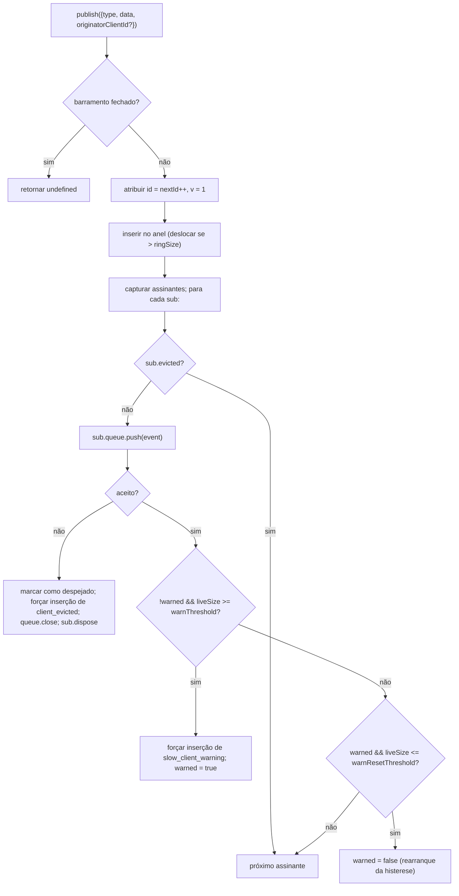

# SSE Event Bus & Backpressure

## Visão Geral

`EventBus` (`packages/acp-bridge/src/eventBus.ts`) é o pub/sub em memória por sessão que alimenta a rota SSE `GET /session/:id/events` do daemon. Ele atribui a cada evento um id monotônico, armazena eventos recentes em um anel limitado para reprodução com `Last-Event-ID`, distribui eventos publicados para todos os assinantes, aplica contrapressão por assinante (alerta em 75% da fila, despejo no limite) e emite dois quadros sintéticos terminais (`client_evicted`, `slow_client_warning`) que o SDK trata como eventos de primeira classe, mas que o barramento marca **sem um `id`** para que não consumam um slot na sequência por sessão.

`EventBus` atualmente é privado de pacote do `acp-bridge` e consumido pela bridge factory por meio de uma instância encapsulada por sessão. Uma refatoração futura (mencionada nas linhas 150–159 de `eventBus.ts`) o elevará a um bloco de construção de alto nível, para que canais, saída dupla e futuros transportes WebSocket possam se inscrever pelo mesmo barramento em vez de executar streams paralelos.

## Responsabilidades

- Atribuir ids de evento monotônicos por sessão começando em 1.
- Armazenar os últimos `ringSize` eventos para reprodução ao assinar com `lastEventId`.
- Distribuir eventos publicados para no máximo `maxSubscribers` assinantes concorrentes.
- Aplicar filas limitadas por assinante; descartar assinantes com excesso com um quadro terminal sintético `client_evicted`.
- Emitir `slow_client_warning` uma vez por episódio de excesso a 75% da fila, com histerese de 37,5% para evitar alertas repetidos.
- Encerrar assinaturas prontamente com `AbortSignal.abort()`.
- Fechar corretamente todos os assinantes ao fechar o barramento (ex.: desmontagem de sessão).
- Nunca lançar exceção em `publish` (o contrato é "publish é sempre seguro de chamar").

## Arquitetura

| Constante                               | Valor        | Propósito                                                                                         |
| --------------------------------------- | ------------ | ------------------------------------------------------------------------------------------------- |
| `EVENT_SCHEMA_VERSION`                  | `1`          | Gravado em todo `BridgeEvent.v`; incrementado em mudanças de quadro incompatíveis.                |
| `DEFAULT_RING_SIZE`                     | `8000`       | Anel de reprodução por sessão. Substituível pelo operador via `--event-ring-size`.                  |
| `DEFAULT_MAX_QUEUED`                    | `256`        | Limite de acumulação por assinante.                                                                |
| `DEFAULT_MAX_SUBSCRIBERS`               | `64`         | Limite de assinantes por sessão.                                                                    |
| `WARN_THRESHOLD_RATIO`                  | `0.75`       | Fração de `maxQueued` que dispara `slow_client_warning`.                                           |
| `WARN_RESET_RATIO`                      | `0.375`      | Fração de rearranque da histerese.                                                                 |
| `MAX_EVENT_RING_SIZE` (em `bridge.ts`)  | `1_000_000`  | Limite superior suave para `BridgeOptions.eventRingSize` para capturar falhas de memória causadas por erros de digitação. |

### `BridgeEvent`

```ts
interface BridgeEvent {
  id?: number; // monotônico por sessão; ausente em quadros sintéticos terminais
  v: 1; // EVENT_SCHEMA_VERSION
  type: string; // um dos 43 tipos conhecidos ou extensível no futuro
  data: unknown; // carga útil (tipada por tipo no SDK; veja 09-event-schema.md)
  originatorClientId?: string; // definido quando o evento deriva de uma requisição com carimbo clientId
}
```

### `SubscribeOptions`

```ts
interface SubscribeOptions {
  lastEventId?: number; // reproduzir a partir de depois deste id (retomada Last-Event-ID)
  signal?: AbortSignal; // aborta a assinatura prontamente
  maxQueued?: number; // limite de acumulação por assinante; padrão 256
}
```

`subscribe()` retorna um `AsyncIterable<BridgeEvent>`. A rota SSE o consome com `for await`. O registro é **síncrono** — no momento em que `subscribe()` retorna, o assinante já está anexado, portanto um `publish()` que ocorre em concorrência com o primeiro `next()` do consumidor ainda é entregue.

### `BoundedAsyncQueue`

A fila por assinante. Dois comportamentos fundamentais:

- **O limite ativo é apenas sobre itens ativos.** Itens inseridos via `forcePush()` carregam uma tag `forced: true` por entrada e nunca contam para `maxSize`. Isso permite que o caminho de reprodução `Last-Event-ID` force a inserção de centenas de quadros históricos em um novo assinante sem disparar imediatamente o limite ativo e despejar o assinante que acabou de ser retomado.
- **`liveCount` é mantido como um campo**, não derivado da posição `forcedInBuf`. A heurística anterior baseada em posição quebrou quando `slow_client_warning` começou a forçar inserções no meio do fluxo (avisos vão para o FINAL da fila, não para a frente como reproduções). As tags `forced` por entrada são independentes de posição.

`push(value)` retorna `false` (em vez de bloquear ou lançar) quando o acumulado ativo está no limite — o barramento usa esse sinal para despejar o assinante. `forcePush(value)` ignora o limite. `close({drain?: boolean})` drena itens pendentes por padrão; o caminho de aborto passa `drain: false` para descartá-los imediatamente.

## Fluxo de Trabalho

### Publicar



`publish` nunca lança exceção. Fechar o barramento durante um publish (o caminho de desligamento fecha os barramentos por sessão antes de aguardar `channel.kill()`) retorna `undefined` em vez de lançar, porque o agente ainda pode emitir notificações `sessionUpdate` na pequena janela entre o fechamento do barramento e o kill do canal.

### Assinar + reprodução (com detecção de despejo do anel)

```mermaid
sequenceDiagram
    autonumber
    participant RT as Rota SSE
    participant EB as EventBus
    participant Q as BoundedAsyncQueue

    RT->>EB: subscribe({lastEventId: 42, maxQueued: 256, signal})
    EB->>EB: recusar se subs.size >= maxSubscribers<br/>(lança SubscriberLimitExceededError)
    EB->>Q: new BoundedAsyncQueue(256)
    EB->>EB: subs.add(sub)
    EB->>EB: epochReset = lastEventId >= nextId
    alt epochReset (época antiga do barramento)
        EB->>Q: forcePush state_resync_required<br/>{ reason: 'epoch_reset', lastDeliveredId: 42, earliestAvailableId: ring[0]?.id ?? nextId }
        Note over EB,Q: Quadro sintético sem id vai ANTES da reprodução.<br/>A reprodução varre todo o anel atual.
    else mesma época do barramento
        EB->>EB: earliestInRing = ring[0]?.id
        opt earliestInRing > lastEventId + 1 (lacuna por despejo)
            EB->>Q: forcePush state_resync_required<br/>{ reason: 'ring_evicted', lastDeliveredId: 42, earliestAvailableId: earliestInRing }
            Note over EB,Q: Quadro sintético sem id vai ANTES da reprodução.<br/>Stream permanece aberto; reducer do SDK ativa awaitingResync.
        end
    end
    loop varredura do anel
        EB->>EB: para e no anel onde e.id > (epochReset ? 0 : 42)
        EB->>Q: forcePush(e)
    end
    EB->>EB: anexar ouvinte do AbortSignal<br/>(onAbort → queue.close({drain:false}); dispose)
    EB-->>RT: AsyncIterable
    RT->>Q: next() no loop for-await
```

Se `subs.size >= maxSubscribers` no momento da assinatura, `SubscriberLimitExceededError` é lançado — a rota SSE o captura e serializa um quadro sintético `stream_error` para o cliente rejeitado, para que ele não veja um stream vazio silencioso. Retornar um iterável vazio deixaria operadores sem visibilidade sobre "alguns clientes recebem eventos, outros não" sob carga.

### Despejo do anel → `state_resync_required` (fluxo de recuperação)

Quando um consumidor reconecta com `Last-Event-ID: N` e o evento sobrevivente mais antigo do anel tem `id > N + 1`, os eventos em `[N+1, earliestInRing-1]` foram despejados antes de o consumidor reconectar. A reprodução ingênua teria sucesso silenciosamente com um sufixo não contíguo, o reducer do SDK continuaria aplicando deltas como se o stream fosse contínuo, e seu estado divergiria da verdade do daemon — sem nenhum sinal terminal.

Implementado em `EventBus.subscribe()`:

1. Primeiro verifica `opts.lastEventId >= this.nextId`. Se verdadeiro, o cursor do cliente é de uma época de barramento mais antiga (reinício do daemon / reconstrução do EventBus), então o barramento emite `reason: 'epoch_reset'` e reproduz todo o anel atual.
2. Caso contrário, calcula `earliestInRing = this.ring[0]?.id`.
3. Se `earliestInRing > opts.lastEventId + 1`, força a inserção de um quadro sintético **antes** dos quadros de reprodução:
   ```jsonc
   {
     "v": 1,
     "type": "state_resync_required",
     "data": {
       "reason": "ring_evicted",
       "lastDeliveredId": <opts.lastEventId>,
       "earliestAvailableId": <earliestInRing>
     }
   }
   ```
4. Continua o loop normal de reprodução após.

Contratos críticos (e o que a revisão #4360 corrigiu):

- **Sem `id`** — mesmo padrão de não ocupar slot que `client_evicted`, para que não consuma um slot na sequência monotônica por sessão que outros assinantes observam.
- **Stream permanece aberto** — ao contrário de `client_evicted` (genuinamente terminal), `state_resync_required` é orientado à recuperação. Quadros de reprodução + eventos ao vivo continuam fluindo depois.
- **Reducer pula deltas automaticamente** — o lado do SDK ativa `awaitingResync = true` e aplica apenas `state_resync_required`, os quadros terminais e snapshots de estado completo até que o código consumidor chame `loadSession` e limpe a flag. Veja [`09-event-schema.md`](./09-event-schema.md) para `RESYNC_PASSTHROUGH_TYPES`.
- **Amigável à rede** — quadros permanecem no fio para que o SDK possa calcular um diff "o que você perdeu" posteriormente, se desejar. Nenhum ciclo extra de reconexão é necessário.

### Fluxo terminal de despejo

Quando o acúmulo ativo de um assinante está em `maxQueued` e o próximo `push()` retorna `false`:

1. Marcar `sub.evicted = true`.
2. Construir quadro `client_evicted` **sem `id`** — `{ v: 1, type: 'client_evicted', data: { reason: 'queue_overflow', droppedAfter: <último id entregue> } }`.
3. `queue.forcePush(evictionFrame)` para que o iterador do consumidor veja um quadro terminal.
4. `queue.close()` para que a iteração termine após o quadro terminal.
5. Chamar `sub.dispose()` — remove de `subs` e desanexa o ouvinte do `AbortSignal`; sem essa limpeza, closures de consumidores paralisados permanecem ativas até a coleta de lixo do `AbortSignal`.

### Fluxo de aborto

`AbortSignal.abort()` → `onAbort()`:

1. `queue.close({drain: false})` — descartar itens armazenados para que a rota SSE não continue serializando eventos para um socket que ninguém está ouvindo.
2. `dispose()` — idempotente por meio de uma flag `disposed`.

Sinais já abortados no momento da assinatura chamam `onAbort()` sincronamente antes de retornar o iterador.

## Estado e Ciclo de Vida

- `nextId` começa em 1 e só incrementa. O getter `lastEventId` retorna `nextId - 1`.
- `ring` é limitado; o despejo por deslocamento é O(n) quando cheio. Em `ringSize=8000`, isso mede alguns milissegundos em sessões de alto volume — bem dentro do orçamento de latência por quadro. Uma refatoração para buffer circular é adiada até que a criação de perfil a sinalize ou operadores aumentem `--event-ring-size` em uma ordem de magnitude.
- `close()` alterna `closed`, fecha a fila de cada assinante e limpa `subs`. Chamadas subsequentes a `publish()` / `subscribe()` são no-op (`publish` retorna undefined; `subscribe` retorna `emptyAsyncIterable`).
- Cada sessão possui um `EventBus`. O fechamento do barramento ocorre antes de `channel.kill()` para que publicações em andamento durante o desligamento retornem undefined em vez de lançar.

## Dependências

- Consumido por `packages/acp-bridge/src/bridge.ts` (`BridgeClient.sessionUpdate` / `BridgeClient.extNotification` → `events.publish(...)`).
- Consumido por `packages/cli/src/serve/server.ts` (manipulador da rota SSE → `events.subscribe(...)` e depois formata `BridgeEvent` para quadros SSE no fio).
- Shim de re-exportação: `packages/cli/src/serve/event-bus.ts` → `@qwen-code/acp-bridge/eventBus`.
- Consumidor SDK: `packages/sdk-typescript/src/daemon/sse.ts` (`parseSseStream`), depois `asKnownDaemonEvent` (veja [`09-event-schema.md`](./09-event-schema.md), [`13-sdk-daemon-client.md`](./13-sdk-daemon-client.md)).

## Configuração

- `--event-ring-size <n>` — profundidade do anel por sessão; limitado suavemente a `MAX_EVENT_RING_SIZE = 1_000_000`.
- Parâmetro de consulta do assinante `?maxQueued=N` em `GET /session/:id/events`, faixa `[16, 2048]`. Clientes SDK verificam `caps.features.slow_client_warning` antes de optar por isso.
- `BridgeOptions.eventRingSize` (substitui o padrão do daemon para uso incorporado).
- Tags de capacidade: `session_events`, `slow_client_warning`, `typed_event_schema`.

## Ressalvas e Limitações Conhecidas

- **Quadros sintéticos não têm `id`.** Consumidores SDK que usam retomada `Last-Event-ID` registram apenas quadros com id; `slow_client_warning`, `client_evicted`, `state_resync_required` e `replay_complete` não avançam o cursor e não consomem números de sequência por sessão. Se dois quadros ao vivo com id tiverem uma lacuna real, lide com isso pelo caminho de ressincronização de despejo de anel / reinício de época, em vez de tratá-lo como um quadro sintético privado.
- `client_evicted` é **por assinante**, não por sessão. O mesmo cliente pode reconectar.
- O iterador `BoundedAsyncQueue` **não é seguro para drivers concorrentes** — duas chamadas simultâneas a `.next()` disputariam o mesmo evento. O uso do daemon é sequencial (`for await ... of` no manipulador da rota SSE), portanto isso é seguro em produção.
- O barramento atualmente é privado de pacote; canais e a interface web devem se inscrever pela rota HTTP SSE do daemon, não acessando diretamente o barramento. O Estágio 1.5 elevará isso.

## Referências

- `packages/acp-bridge/src/eventBus.ts` (arquivo inteiro)
- `packages/acp-bridge/src/bridge.ts` (locais de publicação, especialmente `BridgeClient.sessionUpdate` e os eventos de permissão F3)
- `packages/cli/src/serve/server.ts` (manipulador da rota SSE — formata `BridgeEvent` para SSE no fio)
- `packages/sdk-typescript/src/daemon/sse.ts` (analisador SSE no fio do lado do cliente)
- Referência do fio: [`../qwen-serve-protocol.md`](../qwen-serve-protocol.md) (o contrato de reconexão `Last-Event-ID`).