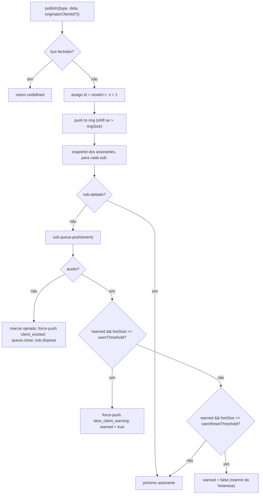

# SSE Event Bus e Backpressure

## Visão Geral

`EventBus` (`packages/acp-bridge/src/eventBus.ts`) é o pub/sub em memória por sessão que alimenta a rota SSE `GET /session/:id/events` do daemon. Ele atribui a cada evento um id monotônico, armazena eventos recentes em um ring limitado para replay via `Last-Event-ID`, distribui eventos publicados para todos os assinantes, aplica backpressure por assinante (aviso no preenchimento de 75% da fila, evicção no limite) e emite dois frames terminais sintéticos (`client_evicted`, `slow_client_warning`) que o SDK trata como eventos de primeira classe, mas o bus marca **sem um `id`** para que não consumam um slot na sequência por sessão.

O `EventBus` é atualmente privado ao pacote `acp-bridge` e consumido pela factory da bridge através de uma instância encapsulada por closure por sessão. Uma refatoração futura (mencionada nas linhas 150–159 de `eventBus.ts`) o elevará a um bloco de construção de nível superior para que canais, saídas duplas e futuros transportes WebSocket possam se inscrever através do mesmo bus, em vez de executar streams paralelos.

## Responsabilidades

- Atribuir ids de eventos monotônicos por sessão começando em 1.
- Armazenar em buffer os últimos `ringSize` eventos para replay na inscrição com `lastEventId`.
- Distribuir eventos publicados para ≤ `maxSubscribers` assinantes simultâneos.
- Aplicar filas limitadas por assinante; descartar assinantes com overflow usando um frame terminal sintético `client_evicted`.
- Emitir `slow_client_warning` uma vez por episódio de overflow no preenchimento de 75% da fila, com histerese de 37,5% para evitar avisos repetidos.
- Encerrar inscrições prontamente em `AbortSignal.abort()`.
- Fechar corretamente cada assinante no fechamento do bus (ex: teardown da sessão).
- Nunca lançar exceções em `publish` (o contrato é "publish é sempre seguro de chamar").

## Arquitetura

| Constante                                | Valor       | Propósito                                                                                          |
| ---------------------------------------- | ----------- | -------------------------------------------------------------------------------------------------- |
| `EVENT_SCHEMA_VERSION`                   | `1`         | Marcado em cada `BridgeEvent.v`; incrementado em mudanças quebradoras de frame.                    |
| `DEFAULT_RING_SIZE`                      | `8000`      | Ring de replay por sessão. Substituição pelo operador via `--event-ring-size`.                     |
| `DEFAULT_MAX_QUEUED`                     | `256`       | Limite de backlog por assinante.                                                                   |
| `DEFAULT_MAX_SUBSCRIBERS`                | `64`        | Limite de assinantes por sessão.                                                                   |
| `WARN_THRESHOLD_RATIO`                   | `0.75`      | Fração de gatilho do `slow_client_warning` de `maxQueued`.                                         |
| `WARN_RESET_RATIO`                       | `0.375`     | Fração de rearme da histerese.                                                                     |
| `MAX_EVENT_RING_SIZE` (em `bridge.ts`)   | `1_000_000` | Limite superior flexível para `BridgeOptions.eventRingSize` para capturar falhas de falta de memória causadas por erros de digitação. |

### `BridgeEvent`

```ts
interface BridgeEvent {
  id?: number; // monotônico por sessão; ausente em frames terminais sintéticos
  v: 1; // EVENT_SCHEMA_VERSION
  type: string; // um dos 47 tipos conhecidos ou extensível no futuro
  data: unknown; // payload (tipado por tipo pelo SDK; veja 09-event-schema.md)
  _meta?: { serverTimestamp?: number; [key: string]: unknown }; // marcado por EventBus.publish
  originatorClientId?: string; // definido quando o evento deriva de uma requisição marcada com clientId
}
```

### `SubscribeOptions`

```ts
interface SubscribeOptions {
  lastEventId?: number; // replay a partir deste id (retomada de Last-Event-ID)
  signal?: AbortSignal; // aborta a inscrição prontamente
  maxQueued?: number; // limite de backlog por assinante; padrão 256
}
```

`subscribe()` retorna um `AsyncIterable<BridgeEvent>`. A rota SSE o consome com `for await`. O registro é **síncrono** — no momento em que `subscribe()` retorna, o assinante já está conectado, então um `publish()` que competir com o primeiro `next()` do consumidor ainda será entregue.

### `BoundedAsyncQueue`

A fila por assinante. Dois comportamentos fundamentais:

- **O limite ativo é apenas para itens ativos.** Itens inseridos via `forcePush()` carregam uma tag `forced: true` por entrada e nunca contam para o `maxSize`. Isso permite que o caminho de replay do `Last-Event-ID` faça force-push de centenas de frames históricos para um novo assinante sem acionar imediatamente o limite ativo e ejetar o assinante recém-retomado.
- **`liveCount` é mantido como um campo**, não derivado da posição de `forcedInBuf`. A heurística baseada em posição anterior quebrou quando o `slow_client_warning` começou a fazer force-push no meio do stream (os avisos vão para o FINAL da fila, não para o início como os replays). As tags `forced` por entrada são independentes de posição.

`push(value)` retorna `false` (em vez de bloquear ou lançar exceção) quando o backlog ativo está no limite — o bus usa esse sinal para ejetar o assinante. `forcePush(value)` ignora o limite. `close({drain?: boolean})` drena os itens pendentes por padrão; o caminho de abort passa `drain: false` para descartá-los imediatamente.

## Fluxo de Trabalho

### Publish



`publish` nunca lança exceções. Fechar o bus no meio do publish (o caminho de shutdown fecha os buses por sessão antes de aguardar `channel.kill()`) retorna `undefined` em vez de lançar exceção, pois o agent ainda pode emitir notificações `sessionUpdate` na pequena janela entre o fechamento do bus e o kill do channel.

### Subscribe + replay (com detecção de evicção do ring)

```mermaid
sequenceDiagram
    autonumber
    participant SR as Rota SSE
    participant EB as EventBus
    participant Q as BoundedAsyncQueue

    SR->>EB: subscribe({lastEventId: 42, maxQueued: 256, signal})
    EB->>EB: recusar se subs.size >= maxSubscribers<br/>(lança SubscriberLimitExceededError)
    EB->>Q: new BoundedAsyncQueue(256)
    EB->>EB: subs.add(sub)
    EB->>EB: epochReset = lastEventId >= nextId
    alt epochReset (epoch antigo do bus)
        EB->>Q: forcePush state_resync_required<br/>{ reason: 'epoch_reset', lastDeliveredId: 42, earliestAvailableId: ring[0]?.id ?? nextId }
        Note over EB,Q: sintético sem id, frame vai ANTES do replay.<br/>Replay escaneia todo o ring atual.
    else mesma epoch do bus
        EB->>EB: earliestInRing = ring[0]?.id
        opt earliestInRing > lastEventId + 1 (gap ejetado)
            EB->>Q: forcePush state_resync_required<br/>{ reason: 'ring_evicted', lastDeliveredId: 42, earliestAvailableId: earliestInRing }
            Note over EB,Q: sintético sem id, frame vai ANTES do replay.<br/>Stream permanece aberto; reducer do SDK alterna awaitingResync.
        end
    end
    loop varredura do ring
        EB->>EB: for e in ring where e.id > (epochReset ? 0 : 42)
        EB->>Q: forcePush(e)
    end
    EB->>EB: anexar listener do AbortSignal<br/>(onAbort → queue.close({drain:false}); dispose)
    EB-->>SR: AsyncIterable
    SR->>Q: next() no loop for-await
```

Se `subs.size >= maxSubscribers` no momento da inscrição, `SubscriberLimitExceededError` é lançado — a rota SSE o captura e serializa um frame sintético `stream_error` para o cliente rejeitado, para que ele não veja um stream vazio silencioso. Retornar um iterável vazio deixaria os operadores sem visibilidade sobre "alguns clientes recebem eventos, outros não" sob carga.

### Evicção do ring → `state_resync_required` (o fluxo de recuperação)

Quando um consumidor reconecta com `Last-Event-ID: N` e o evento sobrevivente mais antigo do ring tem `id > N + 1`, os eventos em `[N+1, earliestInRing-1]` foram ejetados antes do consumidor reconectar. O replay ingênuo teria sucesso silencioso com um sufixo não contíguo, o reducer do SDK continuaria aplicando deltas como se o stream fosse contíguo, e seu estado divergiria da verdade do daemon — sem nenhum sinal terminal.

Implementado em `EventBus.subscribe()`:

1. Primeiro verifica `opts.lastEventId >= this.nextId`. Se verdadeiro, o cursor do cliente é de uma epoch antiga do bus (reinício do daemon / reconstrução do EventBus), então o bus emite `reason: 'epoch_reset'` e faz o replay de todo o ring atual.
2. Caso contrário, calcula `earliestInRing = this.ring[0]?.id`.
3. Se `earliestInRing > opts.lastEventId + 1`, faz force-push de um frame sintético **antes** dos frames de replay:
   ```jsonc
   {
     "v": 1,
     "type": "state_resync_required",
     "data": {
       "reason": "ring_evicted",
       "lastDeliveredId": <opts.lastEventId>,
       "earliestAvailableId": <earliestInRing>
     }
   }
   ```
4. Continua o loop de replay normal em seguida.

Contratos críticos (e o que a revisão #4360 corrigiu):

- **Sem `id`** — mesmo padrão sem slot do `client_evicted`, para que não ocupe um slot na sequência monotônica por sessão que outros assinantes observam.
- **Stream permanece aberto** — ao contrário do `client_evicted` (genuinamente terminal), o `state_resync_required` é orientado a recuperação. O replay + frames ao vivo continuam fluindo depois.
- **Reducer pula deltas automaticamente** — o lado do SDK alterna `awaitingResync = true` e aplica apenas `state_resync_required`, os frames terminais e snapshots de estado completo até que o código do consumidor chame `loadSession` e limpe a flag. Veja [`09-event-schema.md`](./09-event-schema.md) para `RESYNC_PASSTHROUGH_TYPES`.
- **Amigável à rede** — os frames permanecem no wire para que o SDK possa calcular um diff de "o que você perdeu" depois, se quiser. Nenhum ciclo extra de reconexão é necessário.

### Fluxo terminal de evicção

Quando o backlog ativo de um assinante está em `maxQueued` e o próximo `push()` retorna `false`:

1. Marca `sub.evicted = true`.
2. Constrói o frame `client_evicted` **sem `id`** — `{ v: 1, type: 'client_evicted', data: { reason: 'queue_overflow', droppedAfter: <last delivered id> } }`.
3. `queue.forcePush(evictionFrame)` para que o iterador do consumidor veja um frame terminal.
4. `queue.close()` para que a iteração seja desfeita após o frame terminal.
5. Chama `sub.dispose()` — remove de `subs` e desanexa o listener do `AbortSignal`; sem essa limpeza, os closures de consumidores travados permanecem ativos até a coleta de lixo do `AbortSignal`.

### Fluxo de Abort

`AbortSignal.abort()` → `onAbort()`:

1. `queue.close({drain: false})` — descarta itens em buffer para que a rota SSE não continue serializando eventos para um socket que ninguém está escutando.
2. `dispose()` — idempotente através de uma flag `disposed`.

Sinais já abortados no momento da inscrição chamam `onAbort()` sincronamente antes de retornar o iterador.

## Estado e Ciclo de Vida

- `nextId` começa em 1 e apenas incrementa. O getter `lastEventId` retorna `nextId - 1`.
- `ring` é limitado; a evicção por shift é O(n) quando cheio. Em `ringSize=8000`, isso é medido em poucos milissegundos em sessões de alto volume — bem abaixo do orçamento de latência por frame. Uma refatoração para buffer circular é adiada até que a profilagem a sinalize ou os operadores aumentem o `--event-ring-size` em uma ordem de grandeza.
- `close()` alterna `closed`, fecha a fila de cada assinante e limpa `subs`. `publish()` / `subscribe()` subsequentes são no-ops (`publish` retorna undefined; `subscribe` retorna `emptyAsyncIterable`).
- Cada sessão possui um `EventBus`. O fechamento do bus ocorre antes de `channel.kill()` para que publishes em andamento durante o shutdown retornem undefined em vez de lançar exceção.

## Dependências

- Consumido por `packages/acp-bridge/src/bridge.ts` (`BridgeClient.sessionUpdate` / `BridgeClient.extNotification` → `events.publish(...)`).
- Consumido por `packages/cli/src/serve/routes/sse-events.ts` (handler da rota SSE → `events.subscribe(...)` e então formata `BridgeEvent` para frames wire SSE).
- Consumidores da CLI importam o event bus diretamente de `@qwen-code/acp-bridge/eventBus`.
- Consumidor do SDK: `packages/sdk-typescript/src/daemon/sse.ts` (`parseSseStream`), então `asKnownDaemonEvent` (veja [`09-event-schema.md`](./09-event-schema.md), [`13-sdk-daemon-client.md`](./13-sdk-daemon-client.md)).

## Configuração

- `--event-ring-size <n>` — profundidade do ring por sessão; limite flexível em `MAX_EVENT_RING_SIZE = 1_000_000`.
- Parâmetro de query do assinante `?maxQueued=N` em `GET /session/:id/events`, intervalo `[16, 2048]`. Clientes SDK fazem pre-flight de `caps.features.slow_client_warning` antes de optar.
- `BridgeOptions.eventRingSize` (sobrescreve o padrão do daemon para uso embarcado).
- Tags de capacidade: `session_events`, `slow_client_warning`, `typed_event_schema`.

## Integração do Cliente: Reconexão `Last-Event-ID`

### Formato do Wire

Cada frame SSE com id emitido por `GET /session/:id/events` inclui uma linha `id:`:

```
id: 42
event: session_update
data: {"id":42,"v":1,"type":"session_update","data":{...},"_meta":{"serverTimestamp":1719000000000}}

```

Frames sintéticos/terminais (`state_resync_required`, `replay_complete`, `client_evicted`, `slow_client_warning`, `stream_error`) são emitidos **sem** uma linha `id:` — eles não avançam a sequência monotônica por sessão.

### Protocolo de Reconexão

Quando um cliente reconecta após uma desconexão, ele envia o id do último evento recebido com sucesso como o header HTTP `Last-Event-ID`:

```
GET /session/:id/events HTTP/1.1
Last-Event-ID: 42
Accept: text/event-stream
```

O `EventBus` do daemon faz o replay de todos os eventos do ring buffer cujo `id > Last-Event-ID`, e então transiciona para entrega ao vivo. Um frame sintético `replay_complete` marca a fronteira entre o replay e o ao vivo:

```jsonc
// sem linha id: — sintético
{
  "v": 1,
  "type": "replay_complete",
  "data": { "replayedCount": 7, "lastReplayedEventId": 49 },
}
```

### Comportamento do Replay

| Cenário                                      | Comportamento                                                                                                                                                  |
| -------------------------------------------- | -------------------------------------------------------------------------------------------------------------------------------------------------------------- |
| `Last-Event-ID` ausente                      | Stream apenas ao vivo; sem replay. Compatível com clientes pré-retomada.                                                                                       |
| `Last-Event-ID: 0`                           | Replay de todo o ring buffer desde o início (limitado por `--event-ring-size`, padrão 8000).                                                                   |
| `Last-Event-ID: N` onde `ring[0].id <= N+1`  | Replay contíguo dos eventos `id > N`, depois ao vivo.                                                                                                          |
| `Last-Event-ID: N` onde `ring[0].id > N+1`   | Gap detectado — `state_resync_required` (`reason: 'ring_evicted'`) emitido antes do replay do sufixo sobrevivente. O SDK deve chamar `loadSession` para recuperar o estado completo. |
| `Last-Event-ID: N` onde `N >= nextId`        | Reset de epoch (reinício do daemon) — `state_resync_required` (`reason: 'epoch_reset'`) emitido, seguido de replay completo do ring.                           |

### Regras de Validação

O daemon analisa o `Last-Event-ID` estritamente:

- Apenas strings de dígitos decimais puros são aceitas (ex: `"42"`).
- Valores não numéricos, negativos, fracionários ou com overflow (além de `Number.MAX_SAFE_INTEGER`) são rejeitados silenciosamente — o stream inicia apenas ao vivo e o daemon registra um breadcrumb.
- A diretiva `retry: 3000` diz às implementações conformes de `EventSource` para aguardar 3 segundos antes de reconectar.

### Retrocompatibilidade

O mecanismo `Last-Event-ID` é totalmente opt-in:

- Clientes que nunca enviam o header recebem um stream apenas ao vivo idêntico ao comportamento pré-retomada.
- Versões mais antigas do SDK que não rastreiam ids de eventos continuam funcionando.
- O frame `replay_complete` é sintético (sem `id:`), então não confunde consumidores que não conhecem ids.

### Limitação do `EventSource` do Navegador

A API nativa `EventSource` do navegador rastreia automaticamente o último campo `id:` e o envia na reconexão. No entanto, ela **não pode** definir headers customizados (ex: `Authorization: Bearer`). Clientes que requerem autenticação devem usar `fetch()` bruto + parsing manual de SSE (como o SDK TypeScript faz via `parseSseStream`) em vez de `EventSource`. O `RestSseTransport` do SDK demonstra esse padrão — ele define `Last-Event-ID` como um header HTTP explícito na chamada `fetch()`.

## Ressalvas e Limites Conhecidos

- **Frames sintéticos não têm `id`.** Consumidores do SDK usando a retomada `Last-Event-ID` apenas registram frames com ids; `slow_client_warning`, `client_evicted`, `state_resync_required` e `replay_complete` não avançam o cursor e não consomem números de sequência por sessão. Se dois frames ao vivo com id tiverem um gap real, lide com isso através do caminho de resync de evicção do ring / reset de epoch, em vez de tratá-lo como um frame sintético privado.
- `client_evicted` é **por assinante**, não por sessão. O mesmo cliente pode reconectar.
- O iterador do `BoundedAsyncQueue` **não é seguro para drivers concorrentes** — duas chamadas `.next()` simultâneas competiriam pelo mesmo evento. O uso no daemon é sequencial (`for await ... of` no handler da rota SSE), então é seguro em produção.
- O bus é atualmente privado ao pacote; canais e a interface web devem se inscrever através da rota HTTP SSE do daemon, não acessando o bus diretamente. A etapa 1.5 removerá isso.

## Referências

- `packages/acp-bridge/src/eventBus.ts` (arquivo inteiro)
- `packages/acp-bridge/src/bridge.ts` (locais de publish, esp. `BridgeClient.sessionUpdate` e os eventos de permissão F3)
- `packages/cli/src/serve/routes/sse-events.ts` (handler da rota SSE — formata `BridgeEvent` para wire SSE)
- `packages/sdk-typescript/src/daemon/sse.ts` (parser de wire SSE no lado do cliente)
- Referência do wire: [`../qwen-serve-protocol.md`](../qwen-serve-protocol.md) (o contrato de reconexão `Last-Event-ID`).