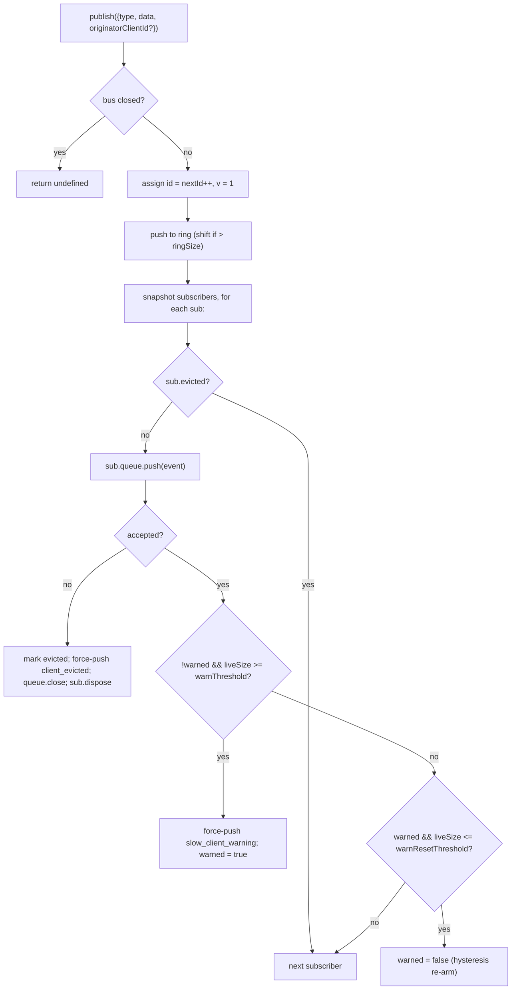

# SSE Barramento de Eventos & Contrapressão

## Visão Geral

`EventBus` (`packages/acp-bridge/src/eventBus.ts`) é o pub/sub em memória por sessão que alimenta a rota SSE `GET /session/:id/events` do daemon. Ele atribui a cada evento um id monotônico, armazena eventos recentes em um anel limitado para repetição via `Last-Event-ID`, distribui eventos publicados para todos os assinantes, aplica contrapressão por assinante (aviso a 75% da fila cheia, remoção ao atingir o limite) e emite dois frames terminais sintéticos (`client_evicted`, `slow_client_warning`) que o SDK trata como eventos de primeira classe, mas o barramento marca **sem um `id`** para que não consumam um slot na sequência por sessão.

`EventBus` atualmente é privado ao pacote `acp-bridge` e consumido pela fábrica da ponte através de uma instância fechada por sessão. Uma refatoração futura (mencionada nas linhas 150–159 de `eventBus.ts`) a elevará a um bloco de construção de alto nível, para que canais, saída dupla e futuros transportes WebSocket possam assinar através do mesmo barramento, em vez de executar fluxos paralelos.

## Responsabilidades

- Atribuir ids monotônicos de evento por sessão, começando em 1.
- Armazenar os últimos `ringSize` eventos em buffer para repetição ao assinar com `lastEventId`.
- Distribuir eventos publicados para até `maxSubscribers` assinantes concorrentes.
- Aplicar filas limitadas por assinante; remover assinantes excedentes com um frame terminal sintético `client_evicted`.
- Emitir `slow_client_warning` uma vez por episódio de transbordo a 75% da fila cheia, com histerese de 37,5% para evitar avisos repetidos.
- Cancelar assinaturas prontamente em `AbortSignal.abort()`.
- Fechar corretamente todos os assinantes no fechamento do barramento (ex.: derrubada da sessão).
- Nunca lançar exceção de `publish` (o contrato é "publish é sempre seguro de chamar").

## Arquitetura

| Constante                               | Valor        | Finalidade                                                                                           |
| --------------------------------------- | ------------ | ---------------------------------------------------------------------------------------------------- |
| `EVENT_SCHEMA_VERSION`                  | `1`          | Estampado em todo `BridgeEvent.v`; incrementado em mudanças de quebra nos frames.                     |
| `DEFAULT_RING_SIZE`                     | `8000`       | Anel de repetição por sessão. Substituível pelo operador via `--event-ring-size`.                    |
| `DEFAULT_MAX_QUEUED`                    | `256`        | Limite máximo de backlog por assinante.                                                              |
| `DEFAULT_MAX_SUBSCRIBERS`               | `64`         | Limite máximo de assinantes por sessão.                                                              |
| `WARN_THRESHOLD_RATIO`                  | `0,75`       | Fração de `maxQueued` que dispara `slow_client_warning`.                                             |
| `WARN_RESET_RATIO`                      | `0,375`      | Fração de rearme da histerese.                                                                       |
| `MAX_EVENT_RING_SIZE` (em `bridge.ts`)  | `1_000_000`  | Limite superior suave para `BridgeOptions.eventRingSize` para detectar erros de memória causados por erros de digitação. |

### `BridgeEvent`

```ts
interface BridgeEvent {
  id?: number; // monotonic per session; absent on synthetic terminal frames
  v: 1; // EVENT_SCHEMA_VERSION
  type: string; // one of the 43 known types or future-extensible
  data: unknown; // payload (typed per-type by the SDK; see 09-event-schema.md)
  originatorClientId?: string; // set when the event derives from a clientId-stamped request
}
```

### `SubscribeOptions`

```ts
interface SubscribeOptions {
  lastEventId?: number; // replay from after this id (Last-Event-ID resume)
  signal?: AbortSignal; // aborts the subscription promptly
  maxQueued?: number; // per-subscriber backlog cap; default 256
}
```

`subscribe()` retorna um `AsyncIterable<BridgeEvent>`. A rota SSE o consome com `for await`. O registro é **síncrono** — no momento em que `subscribe()` retorna, o assinante já está anexado, portanto uma chamada a `publish()` que disputa com o primeiro `next()` do consumidor ainda será entregue.

### `BoundedAsyncQueue`

A fila por assinante. Dois comportamentos fundamentais:

- **O limite ativo é apenas sobre itens ativos.** Itens inseridos via `forcePush()` carregam uma tag `forced: true` por entrada e nunca contam para `maxSize`. Isso permite que o caminho de repetição `Last-Event-ID` force a inserção de centenas de frames históricos em um assinante novo sem disparar imediatamente o limite ativo e remover o assinante que acabou de ser retomado.
- **`liveCount` é mantido como um campo**, não derivado da posição de `forcedInBuf`. A heurística anterior baseada em posição quebrou quando `slow_client_warning` começou a forçar inserções no meio do fluxo (avisos vão para o FINAL da fila, não para a frente como repetições). As tags `forced` por entrada são independentes de posição.

`push(value)` retorna `false` (em vez de bloquear ou lançar exceção) quando o backlog ativo está no limite — o barramento usa esse sinal para remover o assinante. `forcePush(value)` ignora o limite. `close({drain?: boolean})` drena itens pendentes por padrão; o caminho de aborto passa `drain: false` para descartá-los imediatamente.
## Fluxo de Trabalho

### Publicar



`publish` nunca lança exceções. Fechar o barramento durante uma publicação (o caminho de encerramento fecha os barramentos por sessão antes de aguardar `channel.kill()`) retorna `undefined` em vez de lançar, porque o agente ainda pode emitir notificações `sessionUpdate` na pequena janela entre o fechamento do barramento e a morte do canal.

### Assinar + repetir (com detecção de expulsão do anel)

```mermaid
sequenceDiagram
    autonumber
    participant SR as SSE route
    participant EB as EventBus
    participant Q as BoundedAsyncQueue

    SR->>EB: subscribe({lastEventId: 42, maxQueued: 256, signal})
    EB->>EB: refuse if subs.size >= maxSubscribers<br/>(throws SubscriberLimitExceededError)
    EB->>Q: new BoundedAsyncQueue(256)
    EB->>EB: subs.add(sub)
    EB->>EB: epochReset = lastEventId >= nextId
    alt epochReset (old bus epoch)
        EB->>Q: forcePush state_resync_required<br/>{ reason: 'epoch_reset', lastDeliveredId: 42, earliestAvailableId: ring[0]?.id ?? nextId }
        Note over EB,Q: id-less synthetic, frame goes BEFORE replay.<br/>Replay scans the whole current ring.
    else same bus epoch
        EB->>EB: earliestInRing = ring[0]?.id
        opt earliestInRing > lastEventId + 1 (gap evicted)
            EB->>Q: forcePush state_resync_required<br/>{ reason: 'ring_evicted', lastDeliveredId: 42, earliestAvailableId: earliestInRing }
            Note over EB,Q: id-less synthetic, frame goes BEFORE replay.<br/>Stream stays open; SDK reducer flips awaitingResync.
        end
    end
    loop ring scan
        EB->>EB: for e in ring where e.id > (epochReset ? 0 : 42)
        EB->>Q: forcePush(e)
    end
    EB->>EB: attach AbortSignal listener<br/>(onAbort → queue.close({drain:false}); dispose)
    EB-->>SR: AsyncIterable
    SR->>Q: next() in for-await loop
```

Se `subs.size >= maxSubscribers` no momento da assinatura, `SubscriberLimitExceededError` é lançado — a rota SSE o captura e serializa um quadro sintético `stream_error` para o cliente rejeitado, para que eles não vejam um fluxo vazio silencioso. Retornar um iterável vazio, em vez disso, deixaria os operadores sem visibilidade sobre "alguns clientes recebem eventos, outros não" sob carga.

### Expulsão do anel → `state_resync_required` (o fluxo de recuperação)

Quando um consumidor reconecta com `Last-Event-ID: N` e o evento mais antigo sobrevivente do anel tem `id > N + 1`, os eventos em `[N+1, earliestInRing-1]` foram expulsos antes da reconexão do consumidor. A repetição ingênua teria sucesso silenciosamente com um sufixo não contíguo, o redutor do SDK continuaria aplicando deltas como se o fluxo fosse contíguo, e seu estado divergiria da verdade do daemon — sem nenhum sinal terminal.

Implementado em `EventBus.subscribe()`:

1. Primeiro verifique `opts.lastEventId >= this.nextId`. Se verdadeiro, o cursor do cliente é
   de uma época de barramento mais antiga (reinicialização do daemon / reconstrução do EventBus), então o
   barramento emite `reason: 'epoch_reset'` e repete todo o anel atual.
2. Caso contrário, calcule `earliestInRing = this.ring[0]?.id`.
3. Se `earliestInRing > opts.lastEventId + 1`, force o envio de um quadro sintético **antes** dos quadros de repetição:
   ```jsonc
   {
     "v": 1,
     "type": "state_resync_required",
     "data": {
       "reason": "ring_evicted",
       "lastDeliveredId": <opts.lastEventId>,
       "earliestAvailableId": <earliestInRing>
     }
   }
   ```
4. Continue o loop normal de repetição depois.

Contratos críticos (e o que a revisão #4360 corrigiu):

- **Sem `id`** — mesmo padrão sem slot de `client_evicted`, portanto não ocupa um slot na sequência monotônica por sessão que outros assinantes observam.
- **Fluxo permanece aberto** — diferentemente de `client_evicted` (genuinamente terminal), `state_resync_required` é orientado à recuperação. Quadros de repetição e ao vivo continuam fluindo depois.
- **Redutor pula deltas automaticamente** — o lado do SDK ativa `awaitingResync = true` e aplica apenas `state_resync_required`, os quadros terminais e instantâneos de estado completo até que o código do consumidor chame `loadSession` e limpe a flag. Consulte [`09-event-schema.md`](./09-event-schema.md) para `RESYNC_PASSTHROUGH_TYPES`.
- **Amigável à rede** — os quadros permanecem no fio para que o SDK possa calcular um diff de "o que você perdeu" depois, se desejar. Nenhum ciclo extra de reconexão é necessário.
### Fluxo terminal de despejo

Quando o backlog ao vivo de um assinante está em `maxQueued` e o próximo `push()` retorna `false`:

1. Marcar `sub.evicted = true`.
2. Construir o frame `client_evicted` **sem `id`** — `{ v: 1, type: 'client_evicted', data: { reason: 'queue_overflow', droppedAfter: <último id entregue> } }`.
3. `queue.forcePush(evictionFrame)` para que o iterador do consumidor veja um frame terminal.
4. `queue.close()` para que a iteração se desenrole após o frame terminal.
5. Chamar `sub.dispose()` — remove de `subs` e desanexa o listener do `AbortSignal`; sem essa limpeza, os closures de consumidores travados continuam vivos até o garbage collection do `AbortSignal`.

### Fluxo de aborto

`AbortSignal.abort()` → `onAbort()`:

1. `queue.close({drain: false})` — descarta itens em buffer para que a rota SSE não continue serializando eventos para um socket que ninguém está ouvindo.
2. `dispose()` — idempotente através de uma flag `disposed`.

Sinais já abortados no momento da inscrição chamam `onAbort()` de forma síncrona antes de retornar o iterador.

## Estado & Ciclo de Vida

- `nextId` começa em 1 e só incrementa. O getter `lastEventId` retorna `nextId - 1`.
- `ring` é limitado; o despejo por deslocamento é O(n) quando cheio. Em `ringSize=8000`, isso leva alguns milissegundos em sessões de alto volume — bem abaixo do orçamento de latência por frame. Uma refatoração para buffer circular é adiada até que a criação de perfil a sinalize ou os operadores aumentem `--event-ring-size` em uma ordem de grandeza.
- `close()` alterna `closed`, fecha a fila de cada assinante e limpa `subs`. Chamadas subsequentes a `publish()` / `subscribe()` são no-ops (`publish` retorna undefined; `subscribe` retorna `emptyAsyncIterable`).
- Cada sessão possui um `EventBus`. O fechamento do bus ocorre antes de `channel.kill()` para que publicações em andamento durante o desligamento retornem undefined em vez de lançar exceção.

## Dependências

- Consumido por `packages/acp-bridge/src/bridge.ts` (`BridgeClient.sessionUpdate` / `BridgeClient.extNotification` → `events.publish(...)`).
- Consumido por `packages/cli/src/serve/server.ts` (manipulador de rota SSE → `events.subscribe(...)` em seguida formata `BridgeEvent` para frames SSE).
- Re-export shim: `packages/cli/src/serve/event-bus.ts` → `@qwen-code/acp-bridge/eventBus`.
- Consumidor SDK: `packages/sdk-typescript/src/daemon/sse.ts` (`parseSseStream`), em seguida `asKnownDaemonEvent` (veja [`09-event-schema.md`](./09-event-schema.md), [`13-sdk-daemon-client.md`](./13-sdk-daemon-client.md)).

## Configuração

- `--event-ring-size <n>` — profundidade do anel por sessão; limite suave em `MAX_EVENT_RING_SIZE = 1_000_000`.
- Parâmetro de consulta do assinante `?maxQueued=N` em `GET /session/:id/events`, faixa `[16, 2048]`. Clientes SDK fazem pré-voo `caps.features.slow_client_warning` antes de optar.
- `BridgeOptions.eventRingSize` (substitui o padrão do daemon para uso embutido).
- Tags de capacidade: `session_events`, `slow_client_warning`, `typed_event_schema`.

## Limitações e Limitações Conhecidas

- **Frames sintéticos não possuem `id`.** Consumidores SDK que usam `Last-Event-ID` para retomada registram apenas frames com ids; `slow_client_warning`, `client_evicted`, `state_resync_required` e `replay_complete` não avançam o cursor e não consomem números de sequência por sessão. Se dois frames vivos com id tiverem uma lacuna real, trate isso pelo caminho de ressincronização por despejo de anel / reinicialização de época, em vez de tratá-lo como um frame sintético privado.
- `client_evicted` é **por assinante**, não por sessão. O mesmo cliente pode reconectar.
- O iterador de `BoundedAsyncQueue` **não é seguro para drivers concorrentes** — duas chamadas simultâneas a `.next()` disputariam o mesmo evento. O uso no daemon é sequencial (`for await ... of` no manipulador de rota SSE), portanto isso é seguro em produção.
- O bus é atualmente privado ao pacote; canais e a interface web devem assinar através da rota SSE HTTP do daemon, não acessando o bus diretamente. O Estágio 1.5 removerá essa restrição.

## Referências

- `packages/acp-bridge/src/eventBus.ts` (arquivo inteiro)
- `packages/acp-bridge/src/bridge.ts` (locais de publicação, especialmente `BridgeClient.sessionUpdate` e os eventos de permissão F3)
- `packages/cli/src/serve/server.ts` (manipulador de rota SSE — formata `BridgeEvent` para SSE)
- `packages/sdk-typescript/src/daemon/sse.ts` (analisador SSE no lado do cliente)
- Referência de fio: [`../qwen-serve-protocol.md`](../qwen-serve-protocol.md) (o contrato de reconexão `Last-Event-ID`).
