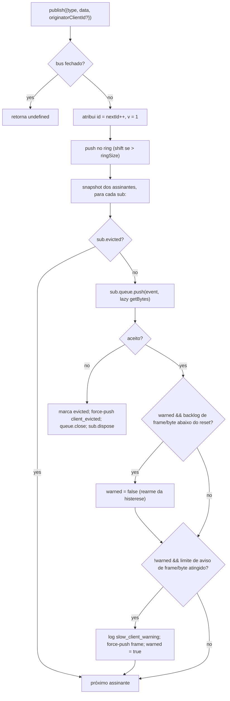

# SSE Event Bus e Backpressure

## Visão Geral

O `EventBus` (`packages/acp-bridge/src/eventBus.ts`) é o pub/sub em memória por sessão que alimenta a rota SSE `GET /session/:id/events` do daemon. Ele atribui um id monotônico a cada evento, armazena em buffer eventos recentes em um anel limitado para replay de `Last-Event-ID`, distribui eventos publicados para todos os assinantes, aplica backpressure por assinante (aviso em 75% de preenchimento da fila ativa / preenchimento de bytes serializados, evicção no limite) e emite frames sintéticos locais do assinante (`client_evicted`, `slow_client_warning`) que o SDK trata como eventos de primeira classe, mas o bus marca **sem um `id`** para que não consumam um slot na sequência por sessão.

O `EventBus` é atualmente privado ao pacote `acp-bridge` e consumido pela factory da bridge através de uma instância fechada (closed-over) por sessão. Uma refatoração futura (mencionada nas linhas 150–159 de `eventBus.ts`) o elevará a um bloco de construção de nível superior, para que canais, saída dupla e futuros transportes WebSocket possam se inscrever através do mesmo bus, em vez de executar streams paralelos.

## Responsabilidades

- Atribuir ids de eventos monotônicos por sessão começando em 1.
- Armazenar em buffer os últimos `ringSize` eventos para replay na inscrição com `lastEventId`.
- Distribuir eventos publicados para ≤ `maxSubscribers` assinantes simultâneos.
- Aplicar filas limitadas por assinante; descartar assinantes que excederem o limite de frames ativos ou o limite de bytes serializados ativos com um frame terminal sintético `client_evicted`.
- Emitir `slow_client_warning` uma vez por episódio de estouro em 75% de preenchimento de frames ativos ou bytes serializados ativos, com histerese de 37,5% para evitar avisos repetidos.
- Encerrar inscrições prontamente em `AbortSignal.abort()`.
- Fechar limpa e corretamente todos os assinantes no fechamento do bus (ex: teardown da sessão).
- Nunca lançar exceções a partir de `publish` (o contrato é "publish é sempre seguro de chamar").

## Arquitetura

| Constante                              | Valor       | Finalidade                                                                                       |
| -------------------------------------- | ----------- | ------------------------------------------------------------------------------------------------ |
| `EVENT_SCHEMA_VERSION`                 | `1`         | Aplicado em cada `BridgeEvent.v`; incrementado em mudanças quebradoras de frame.                 |
| `DEFAULT_RING_SIZE`                    | `8000`      | Anel de replay por sessão. Substituição pelo operador via `--event-ring-size`.                   |
| `DEFAULT_MAX_QUEUED`                   | `256`       | Limite de backlog de frames ativos por assinante.                                                |
| `DEFAULT_MAX_QUEUED_BYTES`             | `2 MiB`     | Limite de backlog de bytes serializados ativos por assinante.                                    |
| `DEFAULT_MAX_SUBSCRIBERS`              | `64`        | Limite de assinantes por sessão.                                                                 |
| `WARN_THRESHOLD_RATIO`                 | `0.75`      | Fração de gatilho do `slow_client_warning` de `maxQueued` ou `maxQueuedBytes`.                   |
| `WARN_RESET_RATIO`                     | `0.375`     | Fração de rearme da histerese.                                                                   |
| `MAX_EVENT_RING_SIZE` (em `bridge.ts`) | `1_000_000` | Limite superior flexível para `BridgeOptions.eventRingSize` para capturar falhas de falta de memória causadas por erros de digitação. |

### `BridgeEvent`

```ts
interface BridgeEvent {
  id?: number; // monotônico por sessão; ausente em frames terminais sintéticos
  v: 1; // EVENT_SCHEMA_VERSION
  type: string; // um dos 53 tipos conhecidos ou extensível no futuro
  data: unknown; // payload (tipado por tipo pelo SDK; veja 09-event-schema.md)
  _meta?: { serverTimestamp?: number; [key: string]: unknown }; // aplicado por EventBus.publish
  originatorClientId?: string; // definido quando o evento deriva de uma requisição com clientId
}
```

### `SubscribeOptions`

```ts
interface SubscribeOptions {
  lastEventId?: number; // replay a partir deste id (resumo de Last-Event-ID)
  signal?: AbortSignal; // aborta a inscrição prontamente
  maxQueued?: number; // limite de backlog de frames ativos por assinante; padrão 256
}
```

`subscribe()` retorna um `AsyncIterable<BridgeEvent>`. A rota SSE o consome com `for await`. O registro é **síncrono** — no momento em que `subscribe()` retorna, o assinante já está anexado, então um `publish()` que competir com o primeiro `next()` do consumidor ainda será entregue.

O limite de bytes ativos é uma opção de construtor no nível do bus apenas para testes / chamadores embarcados. Ele não é exposto como parâmetro de query HTTP, opção do SDK, flag de CLI ou capability, porque os clientes não devem ser capazes de aumentar o orçamento de memória do daemon.

### `BoundedAsyncQueue`

A fila por assinante. Dois comportamentos fundamentais:

- **Limites ativos aplicam-se apenas a itens ativos.** Itens inseridos via `forcePush()` carregam uma tag `forced: true` por entrada e nunca contam para `liveCount` ou `liveBytes`. Isso permite que o caminho de replay `Last-Event-ID` faça force-push de centenas de frames históricos para um novo assinante sem acionar imediatamente os limites ativos e evictar o assinante recém-retomado.
- **`liveCount` e `liveBytes` são mantidos como campos**, não derivados da posição `forcedInBuf`. A heurística baseada em posição anterior quebrava quando `slow_client_warning` começou a fazer force-push no meio do stream (avisos vão para o FINAL da fila, não para o início como os replays). Tags `forced` por entrada são independentes de posição; entradas ativas também armazenam sua estimativa de bytes serializados para que o esvaziamento da fila decremente `liveBytes`.
- **Bytes serializados são estimados de forma lazy.** `push()` computa `Buffer.byteLength(JSON.stringify(event), 'utf8')` apenas quando o evento for armazenado em buffer. Se um assinante já estiver aguardando `next()`, o evento é entregue diretamente e nenhuma estimativa de bytes é computada. Se a serialização falhar, o daemon emite um diagnóstico de melhor esforço no stderr e esse evento pula a contabilidade de bytes, preservando o contrato de nunca lançar exceções do `publish()`; ele ainda conta para o limite de frames ativos.

`push(value, getBytes)` retorna um resultado aceito / rejeitado em vez de bloquear ou lançar exceção. Estouro de frame rejeita com `queue_overflow`; estouro de bytes rejeita com `queue_bytes_overflow`. Um único evento de tamanho excessivo é permitido quando a fila ativa está vazia, mas um segundo evento ativo atrás dele evicta o assinante. `forcePush(value)` ignora ambos os limites. `close({drain?: boolean})` esvazia itens pendentes por padrão; o caminho de abort passa `drain: false` para descartá-los imediatamente.

## Fluxo de Trabalho

### Publish


```mermaid
flowchart TD
    P["publish({type, data, originatorClientId?})"] --> C{"bus fechado?"}
    C -->|yes| RU["retorna undefined"]
    C -->|no| AID["atribui id = nextId++, v = 1"]
    AID --> PR["push no ring (shift se > ringSize)"]
    PR --> FAN["snapshot dos assinantes, para cada sub:"]
    FAN --> EVCK{"sub.evicted?"}
    EVCK -->|yes| NEXT[próximo assinante]
    EVCK -->|no| PUSH["sub.queue.push(event, lazy getBytes)"]
    PUSH --> OK{"aceito?"}
    OK -->|no| EVICT["marca evicted; force-push client_evicted; queue.close; sub.dispose"]
    OK -->|yes| RES{"warned && backlog de frame/byte abaixo do reset?"}
    RES -->|yes| RA["warned = false (rearme da histerese)"]
    RES -->|no| WARN{"!warned && limite de aviso de frame/byte atingido?"}
    RA --> WARN
    WARN -->|yes| FW["log slow_client_warning; force-push frame; warned = true"]
    WARN -->|no| NEXT
    FW --> NEXT
```

`publish` nunca lança exceções. Fechar o bus no meio de um publish (o caminho de shutdown fecha os buses por sessão antes de aguardar `channel.kill()`) retorna `undefined` em vez de lançar exceção, porque o agent ainda pode emitir notificações `sessionUpdate` na pequena janela entre o fechamento do bus e o kill do channel.

### Subscribe + replay (com detecção de evicção do ring)

```mermaid
sequenceDiagram
    autonumber
    participant SR as Rota SSE
    participant EB as EventBus
    participant Q as BoundedAsyncQueue

    SR->>EB: subscribe({lastEventId: 42, maxQueued: 256, signal})
    EB->>EB: recusa se subs.size >= maxSubscribers<br/>(lança SubscriberLimitExceededError)
    EB->>Q: new BoundedAsyncQueue(maxQueued, maxQueuedBytes)
    EB->>EB: subs.add(sub)
    EB->>EB: epochReset = lastEventId >= nextId
    alt epochReset (epoch antigo do bus)
        EB->>Q: forcePush state_resync_required<br/>{ reason: 'epoch_reset', lastDeliveredId: 42, earliestAvailableId: ring[0]?.id ?? nextId }
        Note over EB,Q: sintético sem id, frame vai ANTES do replay.<br/>Replay escaneia todo o ring atual.
    else mesma epoch do bus
        EB->>EB: earliestInRing = ring[0]?.id
        opt earliestInRing > lastEventId + 1 (gap evicted)
            EB->>Q: forcePush state_resync_required<br/>{ reason: 'ring_evicted', lastDeliveredId: 42, earliestAvailableId: earliestInRing }
            Note over EB,Q: sintético sem id, frame vai ANTES do replay.<br/>Stream permanece aberto; reducer do SDK alterna awaitingResync.
        end
    end
    loop scan do ring
        EB->>EB: for e in ring where e.id > (epochReset ? 0 : 42)
        EB->>Q: forcePush(e)
    end
    EB->>EB: anexa listener do AbortSignal<br/>(onAbort → queue.close({drain:false}); dispose)
    EB-->>SR: AsyncIterable
    SR->>Q: next() no loop for-await
```

Se `subs.size >= maxSubscribers` no momento da inscrição, `SubscriberLimitExceededError` é lançado — a rota SSE o captura e serializa um frame sintético `stream_error` para o cliente rejeitado, para que ele não veja um stream vazio silencioso. Retornar um iterável vazio, em vez disso, deixaria os operadores sem visibilidade sobre "alguns clientes recebem eventos, outros não" sob carga.

### Evicção do ring → `state_resync_required` (o fluxo de recuperação)

Quando um consumidor reconecta com `Last-Event-ID: N` e o primeiro evento sobrevivente do ring tem `id > N + 1`, os eventos em `[N+1, earliestInRing-1]` foram evictados antes do consumidor reconectar. O replay ingênuo teria sucesso silencioso com um sufixo não contíguo, o reducer do SDK continuaria aplicando deltas como se o stream fosse contíguo, e seu estado divergiria da verdade do daemon — sem nenhum sinal terminal.

Implementado em `EventBus.subscribe()`:

1. Primeiro verifica `opts.lastEventId >= this.nextId`. Se verdadeiro, o cursor do cliente é de uma epoch mais antiga do bus (reinício do daemon / reconstrução do EventBus), então o bus emite `reason: 'epoch_reset'` e faz replay de todo o ring atual.
2. Caso contrário, computa `earliestInRing = this.ring[0]?.id`.
3. Se `earliestInRing > opts.lastEventId + 1`, faz force-push de um frame sintético **antes** dos frames de replay:
   ```jsonc
   {
     "v": 1,
     "type": "state_resync_required",
     "data": {
       "reason": "ring_evicted",
       "lastDeliveredId": <opts.lastEventId>,
       "earliestAvailableId": <earliestInRing>
     }
   }
   ```
4. Continua o loop de replay normal em seguida.

Contratos críticos (e o que a revisão #4360 corrigiu):

- **Sem `id`** — mesmo padrão sem slot que `client_evicted`, para que não ocupe um slot na sequência monotônica por sessão que outros assinantes observam.
- **Stream permanece aberto** — ao contrário de `client_evicted` (genuinamente terminal), `state_resync_required` é orientado a recuperação. Replay + frames ativos continuam fluindo depois.
- **Reducer pula deltas automaticamente** — o lado do SDK alterna `awaitingResync = true` e aplica apenas `state_resync_required`, os frames terminais e snapshots de estado completo até que o código do consumidor chame `loadSession` e limpe a flag. Veja [`09-event-schema.md`](./09-event-schema.md) para `RESYNC_PASSTHROUGH_TYPES`.
- **Amigável à rede** — os frames permanecem na rede para que o SDK possa computar um diff de "o que você perdeu" depois, se quiser. Nenhum ciclo de reconexão extra é necessário.

### Fluxo terminal de evicção

Quando o backlog ativo de um assinante atinge um limite e o próximo `push()` é rejeitado:

1. Marca `sub.evicted = true`.
2. Constrói dados de evicção, emite `logSubscriberEvicted(evictionData)` no stderr, e então constrói um frame `client_evicted` **sem `id`**. Estouro de frame usa `reason: 'queue_overflow'`; estouro de bytes usa `reason: 'queue_bytes_overflow'`. Ambos incluem `queueSize`, `maxQueued`, `queuedBytes` e `maxQueuedBytes`; estouro de bytes também inclui `eventBytes`.
3. `queue.forcePush(evictionFrame)` para que o iterador do consumidor veja um frame terminal.
4. `queue.close()` para que a iteração desenrole após o frame terminal.
5. Chama `sub.dispose()` — remove de `subs` e desanexa o listener do `AbortSignal`; sem essa limpeza, os closures de consumidores travados permanecem ativos até a coleta de lixo do `AbortSignal`.
### Fluxo de abort

`AbortSignal.abort()` → `onAbort()`:

1. `queue.close({drain: false})` — descarta itens em buffer para que a rota SSE não continue serializando eventos para um socket que ninguém está escutando.
2. `dispose()` — idempotente por meio de uma flag `disposed`.

Sinais já abortados no momento da assinatura chamam `onAbort()` de forma síncrona antes de retornar o iterador.

## Estado e Ciclo de Vida

- `nextId` começa em 1 e apenas incrementa. O getter `lastEventId` retorna `nextId - 1`.
- `ring` é limitado; a evicção por deslocamento é O(n) quando cheio. Com `ringSize=8000`, isso é medido em poucos milissegundos em sessões de alto volume — bem abaixo do orçamento de latência por frame. Uma refatoração para buffer circular é adiada até que o profiling a sinalize ou os operadores aumentem o `--event-ring-size` em uma ordem de grandeza.
- `close()` altera `closed`, fecha a fila de cada assinante e limpa `subs`. `publish()` / `subscribe()` subsequentes são no-ops (`publish` retorna undefined; `subscribe` retorna `emptyAsyncIterable`).
- Cada sessão possui um `EventBus`. O fechamento do bus ocorre antes de `channel.kill()`, para que publicações em andamento durante o desligamento retornem undefined em vez de lançar exceções.

## Dependências

- Consumido por `packages/acp-bridge/src/bridge.ts` (`BridgeClient.sessionUpdate` / `BridgeClient.extNotification` → `events.publish(...)`).
- Consumido por `packages/cli/src/serve/routes/sse-events.ts` (handler da rota SSE → `events.subscribe(...)` e então formata `BridgeEvent` para frames de rede SSE).
- Consumidores da CLI importam o event bus diretamente de `@qwen-code/acp-bridge/eventBus`.
- Consumidor do SDK: `packages/sdk-typescript/src/daemon/sse.ts` (`parseSseStream`), depois `asKnownDaemonEvent` (veja [`09-event-schema.md`](./09-event-schema.md), [`13-sdk-daemon-client.md`](./13-sdk-daemon-client.md)).

## Configuração

- `--event-ring-size <n>` — profundidade do ring por sessão; com limite suave em `MAX_EVENT_RING_SIZE = 1_000_000`.
- Parâmetro de query `?maxQueued=N` do assinante em `GET /session/:id/events`, intervalo `[16, 2048]`. Clientes do SDK fazem pre-flight de `caps.features.slow_client_warning` antes de ativar.
- A opção de construtor `EventBus(..., { maxQueuedBytes })` existe apenas para testes / chamadores embarcados. O padrão é 2 MiB e valores inválidos lançam `TypeError`. Deliberadamente, não há um parâmetro de query `?maxQueuedBytes`.
- `BridgeOptions.eventRingSize` (sobrescreve o padrão do daemon para uso embarcado).
- Tags de capacidade: `session_events`, `slow_client_warning`, `typed_event_schema`.

## Integração com o Cliente: Reconexão com `Last-Event-ID`

### Formato de Rede

Cada frame SSE que carrega um id emitido por `GET /session/:id/events` inclui uma linha `id:`:

```
id: 42
event: session_update
data: {"id":42,"v":1,"type":"session_update","data":{...},"_meta":{"serverTimestamp":1719000000000}}

```

Frames sintéticos/terminais (`state_resync_required`, `replay_complete`, `client_evicted`, `slow_client_warning`, `stream_error`) são emitidos **sem** uma linha `id:` — eles não avançam a sequência monótona por sessão.

### Protocolo de Reconexão

Quando um cliente reconecta após uma desconexão, ele envia o id do último evento recebido com sucesso como o header HTTP `Last-Event-ID`:

```
GET /session/:id/events HTTP/1.1
Last-Event-ID: 42
Accept: text/event-stream
```

O `EventBus` do daemon reproduz todos os eventos do ring buffer cujo `id > Last-Event-ID` e, em seguida, transiciona para a entrega ao vivo. Um frame sintético `replay_complete` marca o limite entre a reprodução e o ao vivo:

```jsonc
// no id: line — synthetic
{
  "v": 1,
  "type": "replay_complete",
  "data": { "replayedCount": 7, "lastReplayedEventId": 49 },
}
```

### Comportamento de Replay

| Cenário                                     | Comportamento                                                                                                                                                        |
| -------------------------------------------- | --------------------------------------------------------------------------------------------------------------------------------------------------------------- |
| `Last-Event-ID` ausente                       | Stream apenas ao vivo; sem replay. Retrocompatível com clientes pré-resume.                                                                                       |
| `Last-Event-ID: 0`                           | Replay de todo o ring buffer desde o início (limitado por `--event-ring-size`, padrão 8000).                                                                    |
| `Last-Event-ID: N` onde `ring[0].id <= N+1` | Replay contíguo dos eventos `id > N`, depois ao vivo.                                                                                                                |
| `Last-Event-ID: N` onde `ring[0].id > N+1`  | Lacuna detectada — `state_resync_required` (`reason: 'ring_evicted'`) emitido antes do replay do sufixo sobrevivente. O SDK deve chamar `loadSession` para recuperar o estado completo. |
| `Last-Event-ID: N` onde `N >= nextId`       | Reset de epoch (reinício do daemon) — `state_resync_required` (`reason: 'epoch_reset'`) emitido, seguido do replay completo do ring.                                                |

### Regras de Validação

O daemon analisa estritamente o `Last-Event-ID`:

- Apenas strings com dígitos decimais puros são aceitas (ex: `"42"`).
- Valores não numéricos, negativos, fracionários ou de overflow (além de `Number.MAX_SAFE_INTEGER`) são rejeitados silenciosamente — o stream inicia apenas ao vivo e o daemon registra um breadcrumb.
- A diretiva `retry: 3000` instrui implementações conformes de `EventSource` a aguardar 3 segundos antes de reconectar.

### Retrocompatibilidade

O mecanismo `Last-Event-ID` é totalmente opt-in:

- Clientes que nunca enviam o header recebem um stream apenas ao vivo, idêntico ao comportamento pré-resume.
- Versões mais antigas do SDK que não rastreiam ids de eventos continuam funcionando.
- O frame `replay_complete` é sintético (sem `id:`), portanto não confunde consumidores que não conhecem ids.

### Limitação do `EventSource` do Navegador

A API nativa `EventSource` do navegador rastreia automaticamente o último campo `id:` e o envia na reconexão. No entanto, ela **não pode** definir headers customizados (ex: `Authorization: Bearer`). Clientes que exigem autenticação devem usar `fetch()` puro + parsing manual de SSE (como o SDK TypeScript faz via `parseSseStream`) em vez de `EventSource`. O `RestSseTransport` do SDK demonstra esse padrão — ele define `Last-Event-ID` como um header HTTP explícito na chamada `fetch()`.

## Ressalvas e Limites Conhecidos

- **Frames sintéticos não têm `id`.** Consumidores do SDK que usam `Last-Event-ID` para retomar registram apenas frames com ids; `slow_client_warning`, `client_evicted`, `state_resync_required` e `replay_complete` não avançam o cursor e não consomem números de sequência por sessão. Se dois frames ao vivo com id tiverem uma lacuna real, trate-a através do caminho de resync de evicção do ring / reset de epoch, em vez de tratá-la como um frame sintético privado.
- `client_evicted` é **por assinante**, não por sessão. O mesmo cliente pode reconectar.
- O iterador `BoundedAsyncQueue` **não é seguro para drivers concorrentes** — duas chamadas `.next()` simultâneas competiriam pelo mesmo evento. O uso no daemon é sequencial (`for await ... of` no handler da rota SSE), então isso é seguro em produção.
- O bus é atualmente package-private; canais e a interface web devem se inscrever através da rota HTTP SSE do daemon, e não acessando o bus diretamente. A Stage 1.5 removerá isso.

## Referências

- `packages/acp-bridge/src/eventBus.ts` (arquivo inteiro)
- `packages/acp-bridge/src/bridge.ts` (locais de publish, esp. `BridgeClient.sessionUpdate` e os eventos de permissão F3)
- `packages/cli/src/serve/routes/sse-events.ts` (handler da rota SSE — formata `BridgeEvent` para SSE de rede)
- `packages/sdk-typescript/src/daemon/sse.ts` (parser de SSE de rede no lado do cliente)
- Referência de rede: [`../qwen-serve-protocol.md`](../qwen-serve-protocol.md) (o contrato de reconexão `Last-Event-ID`).