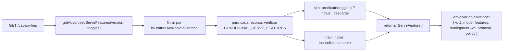

# Capacidades e Versionamento de Protocolo

## Visão Geral

`GET /capabilities` é o endpoint de preflight do daemon. Todo cliente SDK deve lê-lo antes de chamar qualquer outra rota para descobrir qual versão de protocolo o daemon fala, quais tags de recursos estão habilitadas e a qual workspace o daemon está vinculado. O contrato:

- **Há apenas uma versão de protocolo: `v1`.** `SERVE_PROTOCOL_VERSION = 'v1'` e `SUPPORTED_SERVE_PROTOCOL_VERSIONS = ['v1']`. A v1 é aditiva internamente; mudanças que quebram o formato do frame são reservadas para a v2.
- **Cada tag tem uma versão `since`.** Daemons v2 futuros podem anunciar tags v1 e v2.
- **Algumas tags são condicionais.** Treze tags (`require_auth`, `mcp_workspace_pool`, `mcp_pool_restart`, `allow_origin`, `prompt_absolute_deadline`, `writer_idle_timeout`, `workspace_settings`, `workspace_voice`, `workspace_voice_transcription`, `session_shell_command`, `rate_limit`, `workspace_reload`, `voice_transcribe`) são anunciadas apenas quando o toggle de deployment correspondente está habilitado. A presença da tag significa que o comportamento existe.
- **Tag de capacidade = contrato de comportamento.** Adicionar um novo comportamento sob uma tag existente pode quebrar silenciosamente clientes que fizeram preflight da tag antiga. Um novo comportamento precisa de uma nova tag.

O registro completo fica em `packages/cli/src/serve/capabilities.ts`.

## Responsabilidades

- Declarar cada recurso que o daemon pode anunciar.
- Filtrar recursos anunciados por versão de protocolo e toggles de deployment.
- Expor `getRegisteredServeFeatures()` (todas as chaves, sem filtro), `getAdvertisedServeFeatures(version, toggles)` (filtrado) e `getServeProtocolVersions()` (envelope `{ current, supported }`).
- Preservar o invariante "tag presente significa comportamento presente". O `server.test.ts` inclui um teste que garante que toda tag condicional é anunciada quando seu toggle está ativo; adicionar uma tag condicional sem um predicado falha nesse teste.

## Arquitetura

### Envelope de capacidades

`/capabilities` retorna:

```ts
{
  v: 1,                    // CAPABILITIES_SCHEMA_VERSION
  mode: 'http-bridge',
  features: ServeFeature[],
  workspaceCwd: string,
  protocol?: { current: 'v1', supported: ['v1'] },
  policy?: { permission: PermissionPolicy },
}
```

`workspaceCwd` é o workspace canônico vinculado na inicialização do daemon (veja [`02-serve-runtime.md`](./02-serve-runtime.md)). `policy.permission` é a política do mediador ativo.

### `ServeCapabilityDescriptor`

```ts
interface ServeCapabilityDescriptor {
  since: ServeProtocolVersion; // current = 'v1'
  modes?: readonly string[]; // lists operation modes when a feature has modes
}
```

Quatro tags v1 usam `modes`:

- `mcp_guardrails: { since: 'v1', modes: ['warn', 'enforce'] }` - os clientes devem fazer preflight de `'enforce'` antes de confiar no comportamento de recusa.
- `permission_mediation: { since: 'v1', modes: ['first-responder', 'designated', 'consensus', 'local-only'] }` - este é o conjunto suportado em tempo de build; a política ativa está em `policy.permission`.
- `workspace_voice_transcription: { since: 'v1', modes: ['batch'] }` - o caminho de transcrição que o daemon oferece.
- `voice_transcribe: { since: 'v1', modes: ['streaming', 'batch'] }` - os dois caminhos de transcrição disponíveis no WebSocket `/voice/stream`.

### Tags condicionais

```ts
export const CONDITIONAL_SERVE_FEATURES: ReadonlyMap<
  ServeFeature,
  (toggles: AdvertiseFeatureToggles) => boolean
> = new Map([
  ['require_auth', (t) => t.requireAuth === true],
  ['mcp_workspace_pool', (t) => t.mcpPoolActive === true],
  ['mcp_pool_restart', (t) => t.mcpPoolActive === true],
  ['allow_origin', (t) => t.allowOriginActive === true],
  [
    'prompt_absolute_deadline',
    (t) => typeof t.promptDeadlineMs === 'number' && t.promptDeadlineMs > 0,
  ],
  [
    'writer_idle_timeout',
    (t) =>
      typeof t.writerIdleTimeoutMs === 'number' && t.writerIdleTimeoutMs > 0,
  ],
  ['workspace_settings', (t) => t.persistSettingAvailable === true],
  ['workspace_voice', (t) => t.persistSettingAvailable === true],
  [
    'workspace_voice_transcription',
    (t) => t.voiceTranscriptionAvailable === true,
  ],
  ['session_shell_command', (t) => t.sessionShellCommandEnabled === true],
  ['rate_limit', (t) => t.rateLimit === true],
  ['workspace_reload', (t) => t.reloadAvailable === true],
  ['voice_transcribe', (t) => t.voiceWsAvailable !== false],
]);
```

O `Map` armazena a associação e o predicado juntos. Adicionar uma nova tag condicional requer duas mudanças coordenadas:

1. Registrar a tag e sua versão `since` em `SERVE_CAPABILITY_REGISTRY`.
2. Adicionar seu predicado a `CONDITIONAL_SERVE_FEATURES`.

As tags base não estão presentes no `Map` e são anunciadas incondicionalmente. Isso é representado intencionalmente pela ausência, em vez de por um Set separado.

### 75 tags (v1, agrupadas por domínio)

Fundação: `health`, `daemon_status`, `capabilities`.

Sessões: `session_create`, `session_scope_override`, `session_load`, `session_resume`, `unstable_session_resume`, `session_list`, `session_prompt`, `session_cancel`, `session_events`, `session_set_model`, `session_close`, `session_metadata`, `session_context`, `session_context_usage`, `session_supported_commands`, `session_tasks`, `session_stats`, `session_lsp`, `session_status`, `session_approval_mode_control`, `session_recap`, `session_btw`, **`session_shell_command`** (condicional), `session_language`, `session_rewind`, `session_hooks`, `session_branch`.

Streaming: `slow_client_warning`, `typed_event_schema`.

Identidade e heartbeat: `client_identity`, `client_heartbeat`.

Permissões: `session_permission_vote`, `permission_vote`, **`permission_mediation`** (`modes: ['first-responder', 'designated', 'consensus', 'local-only']`).

Snapshots read-only do workspace: `workspace_mcp`, `workspace_skills`, `workspace_providers`, `workspace_env`, `workspace_preflight`, `workspace_hooks`, `workspace_extensions`.

Mutação do workspace (Wave 4+): `workspace_memory`, `workspace_agents`, `workspace_agent_generate`, `workspace_tool_toggle`, **`workspace_settings`** (condicional), `workspace_permissions`, `workspace_init`, `workspace_github_setup`, `workspace_trust`, `workspace_mcp_restart`, `workspace_mcp_manage`, `workspace_file_read`, `workspace_file_bytes`, `workspace_file_write`, **`workspace_reload`** (condicional).

Guardrails do MCP: **`mcp_guardrails`** (`modes: ['warn', 'enforce']`), `mcp_guardrail_events`, `mcp_server_runtime_mutation`, **`mcp_workspace_pool`** (condicional), **`mcp_pool_restart`** (condicional).

Controle de prompt: **`prompt_absolute_deadline`** (condicional), **`writer_idle_timeout`** (condicional), `non_blocking_prompt`.

Autenticação: `auth_provider_install`, `auth_device_flow`, **`require_auth`** (condicional), **`allow_origin`** (condicional).

Voz: **`workspace_voice`** (condicional), **`workspace_voice_transcription`** (condicional, `modes: ['batch']`), **`voice_transcribe`** (condicional, `modes: ['streaming', 'batch']`).

Limitação de taxa: **`rate_limit`** (condicional).

Tags em negrito têm `modes` ou são condicionais.

## Fluxo

### Lado do daemon: montar o envelope



### Lado do cliente: preflight de recursos


## Estado e ciclo de vida

- `CAPABILITIES_SCHEMA_VERSION` é a versão do formato do envelope na rede, atualmente `1`. Incremente apenas em caso de quebra do envelope.
- `SERVE_PROTOCOL_VERSION = 'v1'` é a versão do protocolo-recurso. Adicionar recursos dentro da v1 é aditivo; clientes antigos não veem o novo comportamento a menos que façam preflight da nova tag. Remover um recurso é uma quebra para a v2.
- `EVENT_SCHEMA_VERSION = 1` é o campo `v` do frame SSE (veja [`09-event-schema.md`](./09-event-schema.md)). É um eixo de versão independente; incrementar o schema de eventos não implica incrementar a versão do protocolo, e vice-versa.
- `session_resume` é o recurso estável do daemon para `POST /session/:id/resume`. `unstable_session_resume` continua sendo anunciado como um alias obsoleto porque o método ACP subjacente ainda se chama `connection.unstable_resumeSession`; novos clientes devem detectar o recurso `session_resume`.

## Dependências

- Lido por `packages/cli/src/serve/server.ts` ao construir respostas de `/capabilities`.
- A entrada de toggles vem de `runQwenServe` / `createServeApp`: `{ requireAuth, mcpPoolActive, allowOriginActive, promptDeadlineMs, writerIdleTimeoutMs, persistSettingAvailable, sessionShellCommandEnabled, rateLimit, reloadAvailable }`.
- A política `permission` ativa no envelope vem de `BridgeOptions.permissionPolicy`, que por sua vez lê `policy.permissionStrategy` do `settings.json`.

## Configuração

| Origem                     | Parâmetro                                                       | Efeito nas capacidades                                                                                                        |
| -------------------------- | --------------------------------------------------------------- | ----------------------------------------------------------------------------------------------------------------------------- |
| Flag da CLI                | `--require-auth`                                                | Anuncia `require_auth`.                                                                                                       |
| Variável de ambiente       | `QWEN_SERVE_NO_MCP_POOL=1`                                      | Para de anunciar `mcp_workspace_pool` e `mcp_pool_restart`; eventos do MCP não estampam mais `scope: 'workspace'`.            |
| Flag da CLI                | `--mcp-client-budget=N`, `--mcp-budget-mode={off,warn,enforce}` | Não altera o conjunto de tags (`mcp_guardrails` é sempre anunciado), mas altera a reserva por servidor e o comportamento de recusa. |
| Flag da CLI / Variável de ambiente | `--rate-limit` / `QWEN_SERVE_RATE_LIMIT=1`                      | Anuncia `rate_limit`.                                                                                                         |
| Opção incorporada          | `persistSettingAvailable`                                       | Anuncia `workspace_settings` e `workspace_voice`.                                                                             |
| Opção incorporada          | `voiceTranscriptionAvailable`                                   | Anuncia `workspace_voice_transcription`.                                                                                      |
| Flag da CLI / Opção incorporada | `--enable-session-shell` / `sessionShellCommandEnabled`         | Anuncia `session_shell_command`.                                                                                              |
| Opção incorporada          | `reloadAvailable`                                               | Anuncia `workspace_reload`.                                                                                                   |
| Opção incorporada          | `voiceWsAvailable`                                              | Anuncia `voice_transcribe`.                                                                                                   |
| `settings.json`            | `policy.permissionStrategy`                                     | Define `policy.permission` do envelope.                                                                                       |

## Ressalvas e limites conhecidos

- **`--require-auth` oculta o preflight.** Com `--require-auth`, todas as rotas, incluindo `/capabilities`, exigem autenticação bearer. Um cliente não autenticado não pode fazer preflight de `caps.features.require_auth`; o corpo da resposta 401 é a superfície de descoberta. A tag `require_auth` é uma confirmação autenticada para UIs de auditoria de deployments com segurança reforçada.
- **A presença da tag significa que o comportamento existe.** Se um futuro contribuidor adicionar um comportamento sob uma tag existente sem incrementar `since`, clientes que fizeram preflight da tag antiga podem receber silenciosamente o novo comportamento. A convenção é: novo comportamento recebe uma nova tag.
- **Tags `unstable_*` podem mudar de formato entre versões** sem um incremento de protocolo. Fixe uma versão do SDK ao depender delas.
- O catálogo de rotas fica em [`../qwen-serve-protocol.md`](../qwen-serve-protocol.md); esta página intencionalmente não o duplica.

## Referências

- `packages/cli/src/serve/capabilities.ts`
- `packages/cli/src/serve/types.ts` (`ServeOptions`, `CapabilitiesEnvelope`)
- `packages/cli/src/serve/server.ts` (montagem do envelope)
- `packages/acp-bridge/src/eventBus.ts` (`EVENT_SCHEMA_VERSION`)
- Referência de rede: [`../qwen-serve-protocol.md`](../qwen-serve-protocol.md)
- Guardrails de autenticação e deployment: [`12-auth-security.md`](./12-auth-security.md)