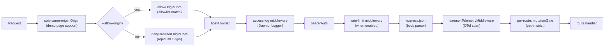
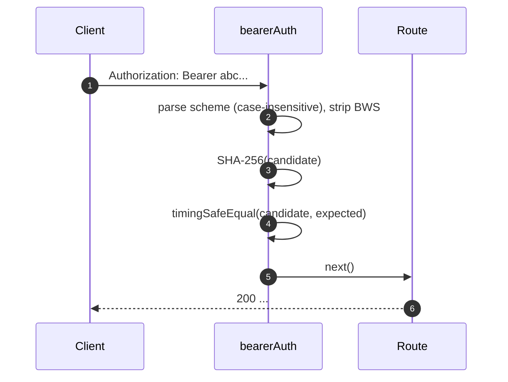
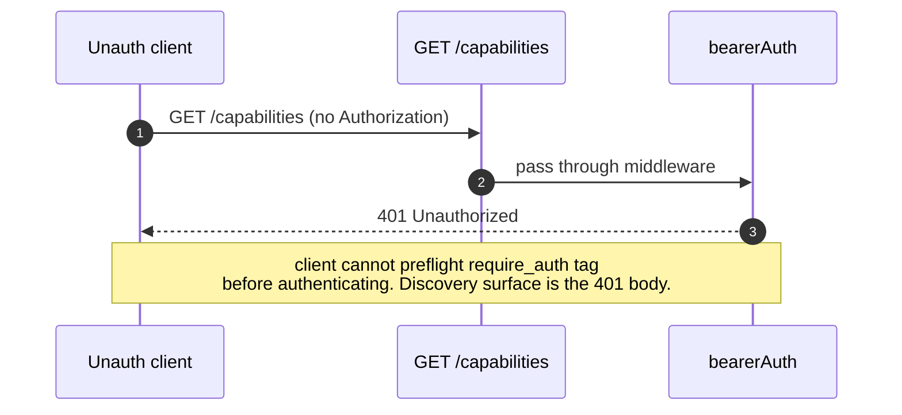
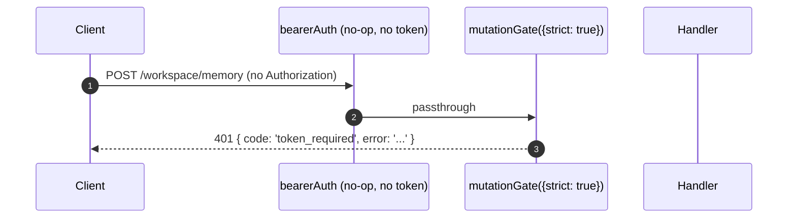

# Modelo de Autenticação e Segurança

## Visão Geral

`qwen serve` é um daemon local por padrão e uma superfície exposta na configuração incorreta. Seu modelo de segurança é **em camadas** para que a má configuração falhe de forma segura:

1. **Bind** — a vinculação não-loopback sem um token de portador **se recusa a iniciar**.
2. **Autenticação bearer** — o middleware `bearerAuth` com comparação SHA-256 em tempo constante protege todas as rotas, exceto `/health` no loopback (`require_auth` estende isso para loopback e `/health` também).
3. **Lista de permissão de cabeçalho Host** — no loopback, apenas `localhost`, `127.0.0.1`, `[::1]`, `host.docker.internal` (mais porta) são aceitos; defesa contra DNS rebinding.
4. **Controle de origem** — por padrão, qualquer requisição com cabeçalho `Origin` é rejeitada com 403. Quando `--allow-origin <pattern>` é configurado, o daemon muda para o modo de lista de permissão CORS (`allowOriginCors`) e só permite origens correspondentes.
5. **Portão de mutação por rota** — as rotas de mutação do Wave 4 podem optar por respostas `401` mesmo no loopback quando nenhum token está configurado, usando um código de erro distinto `code: 'token_required'`.
6. **Autenticação device-flow** — superfície OAuth separada para provedores (`POST /workspace/auth/device-flow` + GET/DELETE em `/:id`).

Este documento percorre cada camada e os invariantes explícitos que o caminho de inicialização impõe.

## Responsabilidades

- Recusar inicializar em configurações inseguras.
- Bloquear cada requisição HTTP através de verificações de bearer (quando configurado) + host (loopback) + origem.
- Fornecer um portão de mutação por rota que as rotas Wave 4 podem optar por usar.
- Hospedar o registro de device-flow que impulsiona os fluxos OAuth do provedor visíveis via eventos SSE.

## Arquitetura

### Regras de recusa na inicialização

Em `run-qwen-serve.ts`:

```ts
if (!isLoopbackBind(opts.hostname) && !token) {
  throw new Error('Refusing to bind <host>:<port> without a bearer token. ...');
}
if (opts.requireAuth && !token) {
  throw new Error(
    'Refusing to start with --require-auth set but no bearer token configured. ...',
  );
}
```

O curinga allow-origin tem sua própria regra de recusa:

```ts
const parsed = parseAllowOriginPatterns(opts.allowOrigins);
if (parsed.allowAny && !token) {
  throw new Error(
    "Refusing to start with --allow-origin '*' but no bearer token configured. ...",
  );
}
```

Todas as três recusas são falhas explícitas de inicialização (visíveis em stderr / lançadas para o incorporador), nunca silenciosas. O modelo de ameaça do #3803 proíbe explicitamente deixar um daemon se vincular além do loopback silenciosamente.

### Cadeia de middlewares (ordem das requisições HTTP)



`mutationGate` é uma fábrica de middleware por rota (`createMutationGate` retorna `mutate()`); as rotas chamam `mutate()` ou `mutate({strict: true})` no momento do registro. Não é um middleware global `app.use()`. O registro de acesso é registrado antes do `bearerAuth` para que rejeições 401 ainda sejam registradas. A limitação de taxa executa após `bearerAuth` e antes do `express.json()`, para que apenas requisições autenticadas contem e corpos grandes sejam rejeitados antes da análise quando um limite é excedido.

### `bearerAuth`

- **Nenhum token configurado** → middleware é um no-op (padrão de desenvolvedor em loopback).
- **Token configurado** → aplica SHA-256 no token configurado uma vez na construção; em cada requisição, faz o hash do candidato e compara com `timingSafeEqual`. Sem curto-circuito de igualdade de string; sem vazamento de tempo.
- **Análise do esquema**: `Bearer` insensível a maiúsculas/minúsculas conforme RFC 7235 §2.1; tolerante a `SP\tHTAB` entre esquema e credenciais conforme RFC 7230 §3.2.6 BWS; rejeita HTAB puro como separador.
- **Endurecimento CodeQL**: análise manual com `indexOf` em vez de regex com sobreposição `\s+` / `.+` (sem risco de regex polinomial).

### `hostAllowlist`

Apenas loopback. Mantém um `Set<string>` indexado por porta. Hosts permitidos:

- `localhost:<port>`, `127.0.0.1:<port>`, `[::1]:<port>`, `host.docker.internal:<port>`.
- Mais formulários sem porta (`localhost`, `127.0.0.1`, `[::1]`, `host.docker.internal`) **apenas** quando vinculado à porta 80 (conforme RFC 7230 §5.4 omissão de porta padrão).

A comparação de Host é **insensível a maiúsculas/minúsculas** — Express normaliza os nomes dos cabeçalhos, mas não os valores, então proxies Docker que capitalizam Hosts (`Localhost:4170`, `HOST.docker.internal`) retornariam 403 com uma comparação exata de string.

Vínculos não-loopback ignoram este middleware (o operador escolheu a área de superfície; o token de portador controla a falsificação de Host em vez disso).

### `denyBrowserOriginCors`

Rejeita qualquer requisição com cabeçalho `Origin`. CLI/SDK nunca definem Origin; apenas navegadores o fazem. Retorna `403 { error: 'Request denied by CORS policy' }` determinístico em vez do HTML 500 que o callback de erro do pacote `cors` produziria.
Exceção: as XHRs de mesma origem da página de demonstração são tratadas por um middleware separado (em `server.ts`) que remove o cabeçalho `Origin` quando ele corresponde ao endereço do próprio daemon.

### `allowOriginCors` (modo `--allow-origin`)

Quando `--allow-origin <pattern>` é configurado, `denyBrowserOriginCors` é
substituído por `allowOriginCors(parsedPatterns)`:

- Valores `Origin` correspondentes recebem `Access-Control-Allow-Origin`,
  `Access-Control-Allow-Headers` e `Access-Control-Allow-Methods`; o preflight
  `OPTIONS` retorna `204`.
- Valores `Origin` não correspondentes recebem o mesmo determinístico
  `403 { error: 'Request denied by CORS policy' }` do modo de negação.
- `--allow-origin '*'` exige `--token`; caso contrário, a inicialização recusa.
- `parseAllowOriginPatterns()` valida a sintaxe dos padrões na inicialização.
- A tag de capacidade `allow_origin` é anunciada apenas quando este modo está
  configurado.

### `createMutationGate`

Portão de adesão opcional por rota. Matriz de comportamento:

| configuração do daemon          | opções da rota | resultado                        |
| ------------------------------- | -------------- | -------------------------------- |
| `requireAuth=true`              | qualquer       | passagem¹                        |
| `token` configurado             | qualquer       | passagem²                        |
| sem token (dev loopback)        | `strict: false` | passagem                         |
| sem token (dev loopback)        | `strict: true`  | `401 { code: 'token_required' }` |

¹ `--require-auth` só inicia com um token, então o `bearerAuth` global já aplicou 401 em chamadas não autenticadas.
² Qualquer configuração de token faz o `bearerAuth` global exigir bearer em todas as rotas; o portão é redundante, mas inofensivo.

A forma `code: 'token_required'` é distinta do `Unauthorized` simples do `bearerAuth`, para que clientes SDK possam exibir uma dica do tipo "configure --token / --require-auth" em vez de um 401 genérico.

**Rotas strict da Wave 4+**: `/workspace/memory`, `/workspace/agents/*`,
`/workspace/agents/generate`, `/file/write`, `/file/edit`,
`/workspace/tools/:name/enable`, `/workspace/mcp/:server/restart`,
`/workspace/mcp/:server/{enable,disable,authenticate,clear-auth}`,
`/workspace/mcp/servers` (POST/DELETE), `/workspace/auth/device-flow`,
`/workspace/init`, `/session/:id/approval-mode`.

### Isenção do `/health`

Em binds loopback, o `/health` é registrado **antes** do middleware bearer, para que as sondagens de liveness dentro do pod não precisem carregar o token. Binds não loopback protegem `/health` com bearer como qualquer outra rota. `--require-auth` remove a isenção: `/health` exige `Authorization: Bearer <token>` também em loopback.

### Identidade do cliente v1 (`X-Qwen-Client-Id`) é autoinformada

O daemon valida apenas o formato de `X-Qwen-Client-Id`
(`[A-Za-z0-9._:-]{1,128}`) e rastreia os IDs de cliente anexados por sessão.
Atualmente, não realiza prova de posse. Um cliente que observe
`originatorClientId` no SSE pode registrar o mesmo ID e se passar pelo
originador em requisições posteriores.

Impacto:

- `designated` — um chamador remoto pode se passar pelo originador e votar em
  uma requisição destinada apenas ao originador do prompt.
- `consensus` — se o ID falsificado já estava no instantâneo `votersAtIssue`,
  ele pode votar.
- `local-only` não é afetado, pois depende de `fromLoopback`, que o daemon
  carimba a partir do endereço remoto da conexão.
- `first-responder` não é afetado, pois é independente de identidade.

Um futuro mecanismo de par de tokens emitirá um segredo por sessão a partir do
`POST /session`; os votos `designated` / `consensus` precisarão apresentá-lo.
Até lá, implantações que necessitem de uma política `designated` mais robusta
devem usar bind loopback ou executar atrás de um proxy reverso autenticado. Veja
[`04-permission-mediation.md`](./04-permission-mediation.md) para detalhes no
nível da política.

### Autenticação por fluxo de dispositivo

Superfície OAuth separada para autenticação do provedor. O identificador de provedor v1 é
`qwen-oauth`, mas o nível gratuito do Qwen OAuth foi descontinuado em 15/04/2026;
novas configurações devem usar um provedor de autenticação atualmente suportado, quando disponível.

- `POST /workspace/auth/device-flow` — inicia um fluxo; retorna `{deviceFlowId, providerId, expiresAt, verificationUrl, userCode}`.
- `GET /workspace/auth/device-flow/:id` — consulta estado.
- `DELETE /workspace/auth/device-flow/:id` — cancela.
- `GET /workspace/auth/status` — instantâneo da conta / provedor atuais.

Os eventos SSE `auth_device_flow_{started, throttled, authorized, failed, cancelled}` distribuem o estado do fluxo para todos os assinantes, mantendo as UIs multicliente sincronizadas. Veja [`09-event-schema.md`](./09-event-schema.md).

Implementação: `packages/cli/src/serve/auth/device-flow.ts` + `qwen-device-flow-provider.ts`.

**Defesa contra injeção em logs / Trojan Source**: `sanitizeForStderr(value)`
(`device-flow.ts`) substitui caracteres de controle ASCII e caracteres de
controle Unicode por `?`. Um IdP malicioso poderia, de outra forma, forjar linhas
de log ou ocultar payloads:

| Faixa                          | Por que é removida                                                                                                                                                                                                                                                 |
| ------------------------------ | ------------------------------------------------------------------------------------------------------------------------------------------------------------------------------------------------------------------------------------------------------------------ |
| `\x00–\x1f`, `\x7f`, `\x80–\x9f` | Controles ASCII C0 / DEL / C1, escapes de terminal e forjamento de linhas de log.                                                                                                                                                                                 |
| U+200B-U+200F                    | Caracteres de largura zero mais LRM / RLM; invisíveis, mas podem alterar a renderização no terminal.                                                                                                                                                              |
| U+2028-U+2029                    | SEPARADOR DE LINHA / PARÁGRAFO; muitos terminais compatíveis com Unicode os tratam como quebras de linha.                                                                                                                                                        |
| U+202A-U+202E                    | Controles bidirecionais de EMBEDDING / OVERRIDE.                                                                                                                                                                                                                  |
| U+2066-U+2069                    | Controles bidirecionais ISOLATE (LRI / RLI / FSI / PDI), o principal vetor [CVE-2021-42574 "Trojan Source"](https://trojansource.codes/). Um IdP usando U+2066 (LRI) em vez de U+202D (LRO) pode contornar filtros que só bloqueiam EMBEDDING/OVERRIDE com reordenação visual similar. |
| U+FEFF                           | BOM / espaço de largura zero sem quebra.                                                                                                                                                                                                                         |
O comprimento é preservado substituindo cada ponto de código removido por `?` em vez de deletá-lo, para que operadores ainda possam ver que algo estava presente naquele índice. Ambas as camadas usam o sanitizador: o `qwenDeviceFlowProvider` sanitiza o `oauthError` do IdP, e o observador de polling tardio do registro sanitiza valores controlados pelo provedor interpolados em dicas de auditoria (`latePollResult.kind` / `lateErr.name`).

A tag de capacidade `auth_device_flow` é anunciada **incondicionalmente**; as próprias rotas retornam `400 unsupported_provider` se o daemon não puder satisfazer um provedor específico. A lista de provedores suportados está em `/workspace/auth/status` em vez de `/capabilities` para manter a forma do descritor uniforme.

## Workflow

### Requisição bem-sucedida de autenticação Bearer



### Modos de falha da autenticação Bearer

Todas retornam `401 { error: 'Unauthorized' }` (uniforme entre `missing header` / `wrong scheme` / `wrong token` para que a sondagem não possa distinguir).

### Sombra do `--require-auth`



Após autenticar, `caps.features.includes('require_auth')` confirma que a implantação está fortalecida.

### Portão de mutação Wave 4 no loopback sem token



## Estado e Ciclo de Vida

- O token Bearer é lido na inicialização e aparado (quebras de linha de `cat token.txt` quebrariam silenciosamente a comparação).
- O Conjunto de Hosts Permitidos é armazenado em cache por porta; reconstruído na mudança de porta (`0` efêmero → porta real após `listen`).
- O portão de mutação constrói `passthrough` e `strictDenier` uma vez por build do app; a chamada por rota retorna o closure em cache (sem alocação por requisição).
- O registro de fluxo de dispositivo é descartado no `shutdown()` Fase 1 para que fluxos pendentes sejam resolvidos como `cancelled` antes da derrubada HTTP.

## Dependências

- `node:crypto` — `createHash`, `timingSafeEqual`.
- `packages/cli/src/serve/loopback-binds.ts` — `isLoopbackBind`.
- `packages/cli/src/serve/auth/device-flow.ts` — máquina de estados do fluxo de dispositivo.
- `@qwen-code/acp-bridge` — expõe eventos de fluxo de dispositivo no barramento SSE por sessão.

## Configuração

| Origem       | Opção                                                                                 | Efeito                                                                |
| ------------ | ------------------------------------------------------------------------------------- | --------------------------------------------------------------------- |
| Env          | `QWEN_SERVER_TOKEN`                                                                   | Token Bearer (aparado).                                               |
| Flag         | `--token`                                                                             | Token Bearer (substitui env).                                         |
| Flag         | `--require-auth`                                                                      | Estende Bearer para loopback + `/health`. Inicia apenas com token.    |
| Flag         | `--hostname`                                                                          | Bind não loopback exige `--token` (ou env).                           |
| Flag         | `--allow-origin <pattern>`                                                            | Alterna para modo de lista de permissões CORS. `'*'` exige um token.  |
| Tags de capacidade | `require_auth` (condicional), `auth_device_flow` (sempre), `allow_origin` (condicional) | Veja [`11-capabilities-versioning.md`](./11-capabilities-versioning.md). |

## Riscos e Limitações Conhecidas

- **`--require-auth` obscurece a pré-verificação de recursos.** Clientes não autenticados não podem descobrir a tag `require_auth`; sua superfície de descoberta é o próprio corpo do 401.
- **Ordenação do parser de corpo do portão de mutação**: respostas 401 do `mutationGate({strict: true})` são disparadas **após** o `express.json()` analisar o corpo. Pior caso em um listener loopback saturado: `--max-connections × express.json({limit: '10mb'})` ≈ 2.5 GB transitórios. Superfície de ataque apenas loopback, intencionalmente aceita.
- **Remoção do Origin same-origin** em `server.ts` ocorre _antes_ de `denyBrowserOriginCors`. Se uma alteração futura mover a remoção para outro lugar, a página de demonstração quebra.
- **A comparação de token é feita sobre o digest SHA-256**, não sobre o token bruto. Reduz vazamento de temporização ao colapsar comparações de token de comprimento variável em uma comparação de digest de tamanho fixo.
- O daemon **não** carrega mTLS, assinatura de requisição ou prova de posse de par-token hoje. `--rate-limit` fornece limitação de taxa HTTP por chave client-id / IP; não é autenticação de identidade do cliente.
## Referências

- `packages/cli/src/serve/auth.ts` (arquivo completo)
- `packages/cli/src/serve/run-qwen-serve.ts` (regras de recusa)
- `packages/cli/src/serve/loopback-binds.ts`
- `packages/cli/src/serve/auth/device-flow.ts`
- `packages/cli/src/serve/auth/qwen-device-flow-provider.ts`
- Modelo de ameaça voltado ao usuário: [`../../users/qwen-serve.md`](../../users/qwen-serve.md).
- Referência de wire: [`../qwen-serve-protocol.md`](../qwen-serve-protocol.md).
