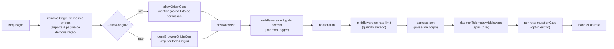
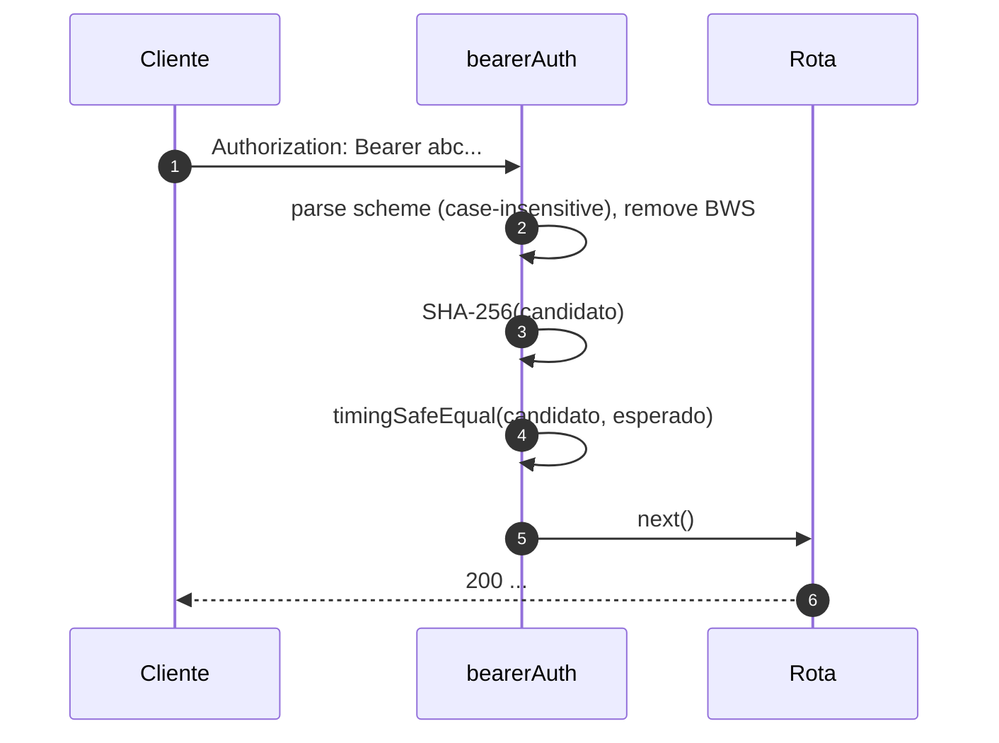
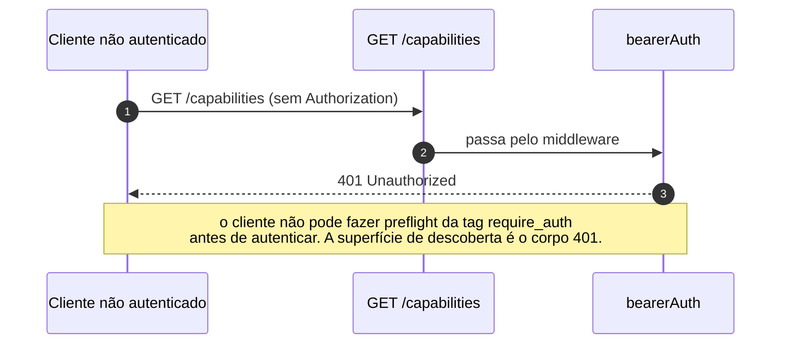
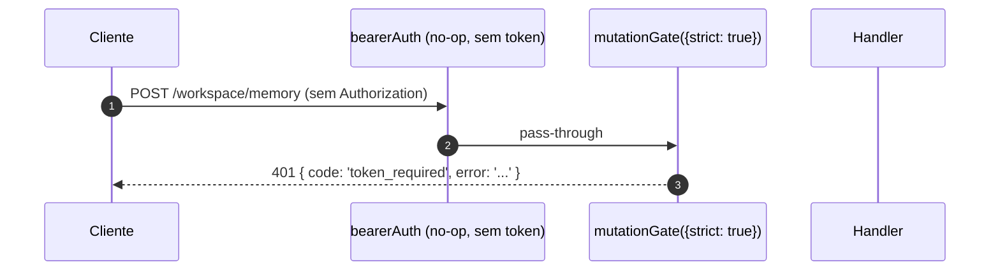

# Modelo de Autenticação e Segurança

## Visão Geral

O `qwen serve` é um daemon local por padrão e uma superfície exposta em configuração incorreta. Seu modelo de segurança é **em camadas** para que uma configuração errada falhe de forma segura:

1. **Bind** — bind fora do loopback sem um token bearer **se recusa a iniciar**.
2. **Autenticação Bearer** — middleware `bearerAuth` com comparação SHA-256 em tempo constante protege todas as rotas, exceto `/health` no loopback (`require_auth` estende essa proteção também para loopback e `/health`).
3. **Lista de permissão de cabeçalho Host** — no loopback, apenas `localhost`, `127.0.0.1`, `[::1]`, `host.docker.internal` (mais porta) são aceitos; defesa contra DNS rebinding.
4. **Controle de Origin** — por padrão, qualquer requisição com cabeçalho `Origin` é rejeitada com 403. Quando `--allow-origin <pattern>` é configurado, o daemon alterna para o modo de lista de permissão CORS (`allowOriginCors`) e só permite origins correspondentes.
5. **Portão de mutação por rota** — rotas de mutação da Wave 4 podem optar por respostas `401` mesmo no loopback quando nenhum token está configurado, usando um erro distinto com `code: 'token_required'`.
6. **Autenticação via Device Flow** — superfície OAuth separada para provedores (`POST /workspace/auth/device-flow` + GET/DELETE em `/:id`).

Este documento percorre cada camada e as invariantes explícitas que o caminho de inicialização impõe.

## Responsabilidades

- Recusar iniciar em configurações inseguras.
- Bloquear toda requisição HTTP através de checks de bearer (quando configurado) + host (loopback) + origin.
- Fornecer um portão de mutação por rota que as rotas da Wave 4 podem ativar.
- Hospedar o registro de device-flow que conduz os fluxos OAuth dos provedores, visíveis através de eventos SSE.

## Arquitetura

### Regras de recusa na inicialização

Em `run-qwen-serve.ts`:

```ts
if (!isLoopbackBind(opts.hostname) && !token) {
  throw new Error('Refusing to bind <host>:<port> without a bearer token. ...');
}
if (opts.requireAuth && !token) {
  throw new Error(
    'Refusing to start with --require-auth set but no bearer token configured. ...',
  );
}
```

O wildcard de allow-origin tem sua própria regra de recusa:

```ts
const parsed = parseAllowOriginPatterns(opts.allowOrigins);
if (parsed.allowAny && !token) {
  throw new Error(
    "Refusing to start with --allow-origin '*' but no bearer token configured. ...",
  );
}
```

Todas as três recusas são falhas explícitas de inicialização (visíveis em stderr / lançadas para o embedder), nunca silenciosas. O modelo de ameaça do #3803 proíbe explicitamente deixar um daemon se ligar além do loopback sem proteção.

### Cadeia de middlewares (ordem das requisições HTTP)



`mutationGate` é uma fábrica de middlewares por rota (`createMutationGate` retorna `mutate()`); as rotas chamam `mutate()` ou `mutate({strict: true})` no momento do registro. Não é um middleware global `app.use()`. O log de acesso é registrado antes de `bearerAuth` para que rejeições 401 ainda sejam registradas. O rate limiting executa depois de `bearerAuth` e antes de `express.json()`, para que apenas requisições autenticadas contem e corpos grandes sejam rejeitados antes do parser quando um limite é excedido.

### `bearerAuth`

- **Nenhum token configurado** → o middleware é um no-op (padrão de desenvolvimento em loopback).
- **Token configurado** → calcula SHA-256 do token configurado uma vez na construção; em cada requisição, calcula o hash do candidato e compara com `timingSafeEqual`. Sem short-circuit de comparação de strings; sem vazamento de tempo.
- **Parsing do esquema**: `Bearer` case-insensitive conforme RFC 7235 §2.1; tolerante a `SP\tHTAB` entre esquema e credenciais conforme RFC 7230 §3.2.6 BWS; rejeita HTAB puro como separador.
- **Hardening CodeQL**: parsing manual com `indexOf` em vez de regex com `\s+` / `.+` sobrepostos (sem risco de regex polinomial).

### `hostAllowlist`

Apenas loopback. Mantém um `Set<string>` indexado por porta. Hosts permitidos:

- `localhost:<porta>`, `127.0.0.1:<porta>`, `[::1]:<porta>`, `host.docker.internal:<porta>`.
- Além disso, formulários sem porta (`localhost`, `127.0.0.1`, `[::1]`, `host.docker.internal`) **apenas** quando vinculado à porta 80 (conforme RFC 7230 §5.4 omissão de porta padrão).

A comparação de Host é **case-insensitive** — o Express normaliza nomes de cabeçalho, mas não valores, então proxies Docker que capitalizam Hosts (`Localhost:4170`, `HOST.docker.internal`) receberiam 403 com uma comparação exata de string.

Binds fora do loopback ignoram este middleware (o operador escolheu a superfície de ataque; o token bearer protege contra spoofing de Host).

### `denyBrowserOriginCors`

Rejeita qualquer requisição com cabeçalho `Origin`. CLI/SDK nunca definem Origin; apenas navegadores o fazem. Retorna `403 { error: 'Request denied by CORS policy' }` deterministicamente, em vez do 500 HTML que o callback de erro do pacote `cors` produziria.

Exceção: as XHRs de mesma origem da página de demonstração são tratadas por um middleware separado (em `server.ts`) que remove `Origin` quando coincide com o próprio endereço do daemon.

### `allowOriginCors` (modo `--allow-origin`)

Quando `--allow-origin <pattern>` é configurado, `denyBrowserOriginCors` é substituído por `allowOriginCors(parsedPatterns)`:

- Valores de `Origin` correspondentes recebem `Access-Control-Allow-Origin`, `Access-Control-Allow-Headers` e `Access-Control-Allow-Methods`; preflight `OPTIONS` retorna `204`.
- Valores de `Origin` não correspondentes recebem o mesmo `403 { error: 'Request denied by CORS policy' }` deterministicamente do modo deny.
- `--allow-origin '*'` exige `--token`; caso contrário, a inicialização é recusada.
- `parseAllowOriginPatterns()` valida a sintaxe dos padrões na inicialização.
- A tag de capacidade `allow_origin` é anunciada apenas quando este modo está configurado.

### `createMutationGate`

Portão de opt-in por rota. Matriz de comportamento:

| configuração do daemon           | opções da rota | resultado                        |
| -------------------------------- | -------------- | -------------------------------- |
| `requireAuth=true`               | qualquer       | pass-through¹                    |
| `token` configurado              | qualquer       | pass-through²                    |
| sem token (loopback dev)         | `strict: false` | pass-through                     |
| sem token (loopback dev)         | `strict: true`  | `401 { code: 'token_required' }` |

¹ `--require-auth` só inicializa com token, então o `bearerAuth` global já rejeita chamadas não autenticadas com 401.
² Qualquer configuração de token faz com que o `bearerAuth` global exija bearer em todo lugar; o portão é redundante, mas inofensivo.

A forma `code: 'token_required'` é distinta do simples `Unauthorized` do `bearerAuth` para que clientes SDK possam renderizar uma dica "configure --token / --require-auth" em vez de um 401 genérico.

**Rotas estritas da Wave 4+**: `/workspace/memory`, `/workspace/agents/*`,
`/workspace/agents/generate`, `/file/write`, `/file/edit`,
`/workspace/tools/:name/enable`, `/workspace/mcp/:server/restart`,
`/workspace/mcp/:server/{enable,disable,authenticate,clear-auth}`,
`/workspace/mcp/servers` (POST/DELETE), `/workspace/auth/device-flow`,
`/workspace/init`, `/session/:id/approval-mode`.

### Isenção do `/health`

Em binds de loopback, `/health` é registrada **antes** do middleware bearer para que sondagens de liveness dentro do pod não precisem carregar o token. Binds fora do loopback protegem `/health` com bearer como qualquer outra rota. `--require-auth` remove a isenção: `/health` exige `Authorization: Bearer <token>` também no loopback.

### Identidade do cliente v1 (`X-Qwen-Client-Id`) é auto-declarada

O daemon valida apenas o formato de `X-Qwen-Client-Id`
(`[A-Za-z0-9._:-]{1,128}`) e rastreia IDs de clientes anexados por sessão. Atualmente não realiza prova de posse. Um cliente que observa `originatorClientId` no SSE pode registrar o mesmo ID e se passar pelo originador em requisições posteriores.

Impacto:

- `designated` — um chamador remoto pode se passar pelo originador e votar em uma requisição destinada apenas ao originador do prompt.
- `consensus` — se o ID falsificado já estava no snapshot `votersAtIssue`, pode votar.
- `local-only` não é afetado porque depende de `fromLoopback`, que o daemon carimba a partir do endereço remoto da conexão.
- `first-responder` não é afetado porque é agnóstico à identidade.

Um mecanismo futuro de par de tokens emitirá um segredo por sessão a partir de `POST /session`; votos `designated` / `consensus` terão que apresentá-lo. Até lá, implantações que precisam de uma política designated mais robusta devem fazer bind em loopback ou rodar atrás de um proxy reverso autenticado. Consulte [`04-permission-mediation.md`](./04-permission-mediation.md) para detalhes no nível de política.

### Autenticação via Device Flow

Superfície OAuth separada para autenticação de provedores. O identificador do provedor v1 é `qwen-oauth`, mas o nível gratuito do Qwen OAuth foi descontinuado em 2026-04-15; novas configurações devem usar um provedor de autenticação atualmente suportado quando disponível.

- `POST /workspace/auth/device-flow` — inicia um fluxo; retorna `{deviceFlowId, providerId, expiresAt, verificationUrl, userCode}`.
- `GET /workspace/auth/device-flow/:id` — consulta estado.
- `DELETE /workspace/auth/device-flow/:id` — cancela.
- `GET /workspace/auth/status` — snapshot da conta/provedor atual.

Os eventos SSE `auth_device_flow_{started, throttled, authorized, failed, cancelled}` distribuem o estado do fluxo para todos os assinantes, mantendo UIs com múltiplos clientes sincronizadas. Consulte [`09-event-schema.md`](./09-event-schema.md).

Implementação: `packages/cli/src/serve/auth/device-flow.ts` + `qwen-device-flow-provider.ts`.

**Defesa contra injeção de log / Trojan Source**: `sanitizeForStderr(value)` (`device-flow.ts`) substitui caracteres de controle ASCII e caracteres de controle Unicode por `?`. Um IdP malicioso poderia forjar linhas de log ou ocultar payloads:

| Intervalo                       | Motivo da remoção                                                                                                                                                                                                                                                |
| ------------------------------- | ---------------------------------------------------------------------------------------------------------------------------------------------------------------------------------------------------------------------------------------------------------------- |
| `\x00–\x1f`, `\x7f`, `\x80–\x9f` | Controles C0 / DEL / C1 ASCII, escapes de terminal e falsificação de linhas de log.                                                                                                                                                                              |
| U+200B-U+200F                   | Caracteres de largura zero mais LRM / RLM; invisíveis mas podem alterar a renderização no terminal.                                                                                                                                                              |
| U+2028-U+2029                   | SEPARADOR DE LINHA / PARÁGRAFO; muitos terminais que suportam Unicode os tratam como quebras de linha.                                                                                                                                                          |
| U+202A-U+202E                   | Controles de EMBEDDING / OVERRIDE bidirecionais.                                                                                                                                                                                                                 |
| U+2066-U+2069                   | Controles de ISOLATE bidirecionais (LRI / RLI / FSI / PDI), o principal vetor [CVE-2021-42574 "Trojan Source"](https://trojansource.codes/). Um IdP usando U+2066 (LRI) em vez de U+202D (LRO) pode contornar filtros que só bloqueiam EMBEDDING/OVERRIDE com reordenação visual semelhante. |
| U+FEFF                           | BOM / espaço de largura zero sem quebra.                                                                                                                                                                                                                         |

O comprimento é preservado substituindo cada ponto de código removido por `?` em vez de excluí-lo, para que operadores ainda possam ver que algo estava presente naquele índice. Ambas as camadas usam o sanitizador: `qwenDeviceFlowProvider` sanitiza `oauthError` do IdP, e o observador de polling tardio do registro sanitiza valores controlados pelo provedor interpolados em dicas de auditoria (`latePollResult.kind` / `lateErr.name`).

A tag de capacidade `auth_device_flow` é anunciada **incondicionalmente**; as próprias rotas retornam `400 unsupported_provider` se o daemon não puder atender a um provedor específico. A lista de provedores suportados está em `/workspace/auth/status` em vez de `/capabilities` para manter a forma do descritor uniforme.

## Fluxo de Trabalho

### Requisição bem-sucedida com autenticação Bearer



### Modos de falha da autenticação Bearer

Todos retornam `401 { error: 'Unauthorized' }` (uniforme entre `cabeçalho ausente` / `esquema errado` / `token errado` para que tentativas de sondagem não possam distinguir).

### Sombra do `--require-auth`



Após autenticar, `caps.features.includes('require_auth')` confirma que a implantação está reforçada.

### Portão de mutação da Wave 4 em loopback sem token



## Estado e Ciclo de Vida

- O token bearer é lido na inicialização e tem espaços removidos (newlines de `cat token.txt` quebrariam silenciosamente a comparação).
- O conjunto de Hosts permitidos é armazenado em cache por porta; reconstruído na mudança de porta (`0` efêmero → porta real após `listen`).
- O portão de mutação constrói `passthrough` e `strictDenier` uma vez por construção do app; a chamada por rota retorna o closure em cache (sem alocação por requisição).
- O registro de device-flow é descartado no `shutdown()` Fase 1 para que fluxos pendentes sejam resolvidos como `cancelled` antes do desligamento HTTP.

## Dependências

- `node:crypto` — `createHash`, `timingSafeEqual`.
- `packages/cli/src/serve/loopback-binds.ts` — `isLoopbackBind`.
- `packages/cli/src/serve/auth/device-flow.ts` — máquina de estados do device-flow.
- `@qwen-code/acp-bridge` — expõe eventos de device-flow no barramento SSE por sessão.

## Configuração

| Fonte           | Parâmetro                                                                               | Efeito                                                                  |
| --------------- | --------------------------------------------------------------------------------------- | ----------------------------------------------------------------------- |
| Env             | `QWEN_SERVER_TOKEN`                                                                     | Token bearer (com espaços removidos).                                   |
| Flag            | `--token`                                                                               | Token bearer (substitui env).                                           |
| Flag            | `--require-auth`                                                                        | Estende bearer para loopback + `/health`. Inicializa apenas com token.  |
| Flag            | `--hostname`                                                                            | Bind fora do loopback exige `--token` (ou env).                         |
| Flag            | `--allow-origin <pattern>`                                                              | Alterna para modo de lista de permissão CORS. `'*'` exige um token.     |
| Tags de capacidade | `require_auth` (condicional), `auth_device_flow` (sempre), `allow_origin` (condicional) | Consulte [`11-capabilities-versioning.md`](./11-capabilities-versioning.md). |

## Observações e Limitações Conhecidas

- **`--require-auth` obscurece o preflight de funcionalidades.** Clientes não autenticados não podem descobrir a tag `require_auth`; sua superfície de descoberta é o próprio corpo 401.
- **Ordenação do portão de mutação em relação ao parser de corpo**: as respostas 401 de `mutationGate({strict: true})` são emitidas **depois** que `express.json()` faz o parser do corpo. Pior caso em um listener de loopback saturado: `--max-connections × express.json({limit: '10mb'})` ≈ 2.5 GB transient. Superfície de ataque apenas em loopback, intencionalmente aceita.
- **Remoção de Origin de mesma origem** em `server.ts` ocorre _antes_ de `denyBrowserOriginCors`. Se uma alteração futura mover a remoção para outro lugar, a página de demonstração quebra.
- **A comparação de token é feita sobre o digest SHA-256**, não sobre o token bruto. Reduz vazamento de tempo ao colapsar comparações de token de comprimento variável para uma comparação de digest de tamanho fixo.
- O daemon **não** carrega mTLS, assinatura de requisição ou prova de posse com par de tokens atualmente. `--rate-limit` fornece limitação de taxa HTTP por chave cliente-id / IP; não é autenticação de identidade do cliente.

## Referências

- `packages/cli/src/serve/auth.ts` (arquivo inteiro)
- `packages/cli/src/serve/run-qwen-serve.ts` (regras de recusa)
- `packages/cli/src/serve/loopback-binds.ts`
- `packages/cli/src/serve/auth/device-flow.ts`
- `packages/cli/src/serve/auth/qwen-device-flow-provider.ts`
- Modelo de ameaça para o usuário: [`../../users/qwen-serve.md`](../../users/qwen-serve.md).
- Referência de fio: [`../qwen-serve-protocol.md`](../qwen-serve-protocol.md).