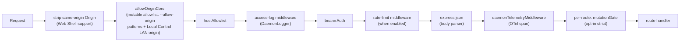
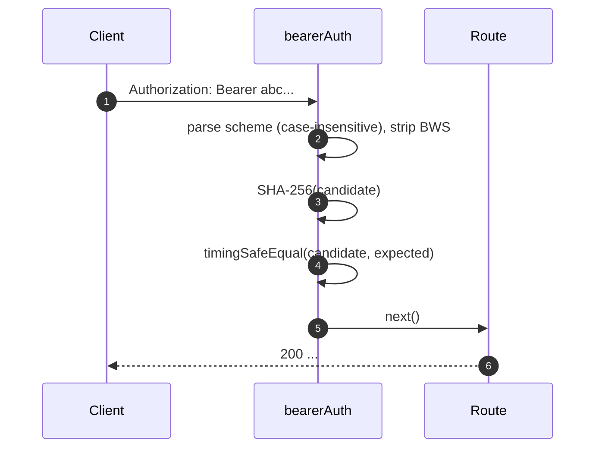
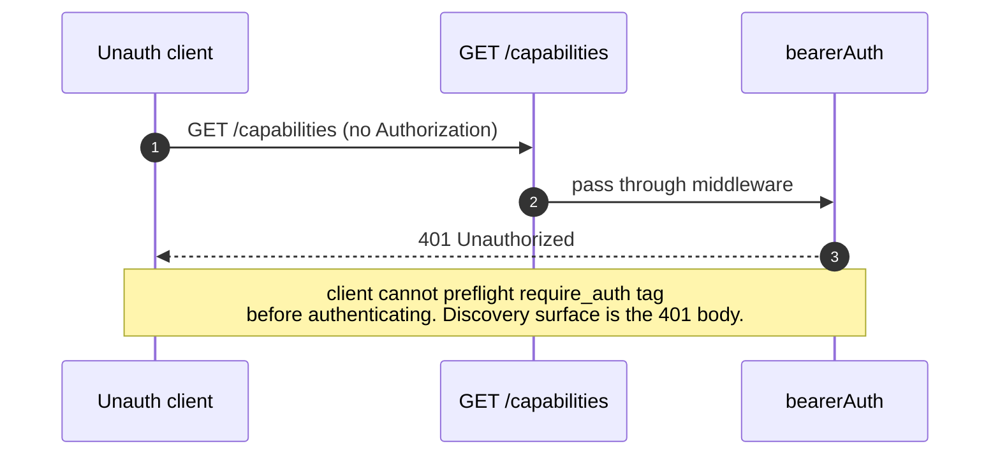
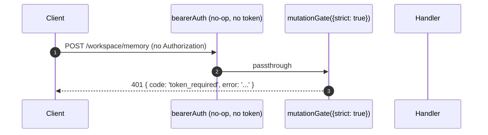

# Modelo de Autenticação e Segurança

## Visão Geral

O `qwen serve` é um daemon local por padrão e uma superfície exposta em configuração incorreta. Seu modelo de segurança é **em camadas** para que uma configuração errada falhe de forma segura:

1. **Bind** — bind fora do loopback sem um token bearer **se recusa a iniciar**.
2. **Autenticação Bearer** — o middleware `bearerAuth` com comparação SHA-256 em tempo constante protege todas as rotas, exceto `/health` no loopback (`require_auth` estende essa proteção também para loopback e `/health`).
3. **Lista de permissão do cabeçalho Host** — no loopback, apenas `localhost`, `127.0.0.1`, `[::1]`, `host.docker.internal` (mais porta) são aceitos; defesa contra DNS rebinding. O listener LAN do Local Control é a exceção que sempre impõe sua verificação de Host por autoridade anunciada, qualquer que seja o bind primário.
4. **Controle de Origin** — o app de runtime sempre instala `allowOriginCors` sobre uma allowlist mutável (`MutableOriginAllowlist`): as entradas `--allow-origin <pattern>` a semeiam, e o Local Control adiciona o origin da LAN enquanto ativo. Origins não correspondentes recebem o envelope de negação 403. A muralha de negação incondicional (`denyBrowserOriginCors`) sobrevive apenas no app de bootstrap que responde antes do runtime iniciar.
5. **Portão de mutação por rota** — rotas de mutação da Wave 4 podem optar por respostas `401` mesmo no loopback quando nenhum token está configurado, usando um erro distinto com `code: 'token_required'`.
6. **Autenticação via device-flow** — superfície OAuth separada para provedores (`POST /workspace/auth/device-flow` + GET/DELETE em `/:id`).

Este documento percorre cada camada e as invariantes explícitas que o caminho de inicialização impõe.

## Responsabilidades

- Recusar iniciar em configurações inseguras.
- Bloquear toda requisição HTTP através de verificações de bearer (quando configurado) + host (loopback) + origin.
- Fornecer um portão de mutação por rota que as rotas da Wave 4 podem ativar.
- Hospedar o registro de device-flow que conduz os fluxos OAuth dos provedores, visíveis por meio de eventos SSE.

## Arquitetura

### Regras de recusa na inicialização

Em `run-qwen-serve.ts`:

```ts
if (!isLoopbackBind(opts.hostname) && !token) {
  throw new Error('Refusing to bind <host>:<port> without a bearer token. ...');
}
if (opts.requireAuth && !token) {
  throw new Error(
    'Refusing to start with --require-auth set but no bearer token configured. ...',
  );
}
```

O wildcard de allow-origin tem sua própria regra de recusa:

```ts
const parsed = parseAllowOriginPatterns(opts.allowOrigins);
if (parsed.allowAny && !token) {
  throw new Error(
    "Refusing to start with --allow-origin '*' but no bearer token configured. ...",
  );
}
```

Todas as três recusas são falhas explícitas de inicialização (visíveis em stderr / lançadas para o embedder), nunca silenciosas. O modelo de ameaça do #3803 proíbe explicitamente deixar um daemon se ligar além do loopback sem proteção.

### Cadeia de middlewares (ordem das requisições HTTP)


```mermaid
flowchart LR
    REQ[Request] --> SO["strip same-origin Origin<br/>(Web Shell support)"]
    SO --> AO["allowOriginCors<br/>(mutable allowlist: --allow-origin<br/>patterns + Local Control LAN origin)"]
    AO --> HA["hostAllowlist"]
    HA --> LOG["access-log middleware<br/>(DaemonLogger)"]
    LOG --> BA["bearerAuth"]
    BA --> RL["rate-limit middleware<br/>(when enabled)"]
    RL --> JSON["express.json<br/>(body parser)"]
    JSON --> TEL["daemonTelemetryMiddleware<br/>(OTel span)"]
    TEL --> MG["per-route: mutationGate<br/>(opt-in strict)"]
    MG --> HANDLER["route handler"]
```

`mutationGate` é uma fábrica de middlewares por rota (`createMutationGate` retorna `mutate()`); as rotas chamam `mutate()` ou `mutate({strict: true})` no momento do registro. Não é um middleware global `app.use()`. O log de acesso é registrado antes de `bearerAuth` para que rejeições 401 ainda sejam registradas. O rate limiting executa depois de `bearerAuth` e antes de `express.json()`, para que apenas requisições autenticadas sejam contabilizadas e corpos grandes sejam rejeitados antes do parsing quando um limite é excedido.

### `bearerAuth`

- **Nenhum token configurado** → o middleware é um no-op (padrão de desenvolvimento em loopback). Exceção: o **listener LAN** do Local Control tem escopo de listener e sempre exige sua credencial pareada (`CredentialStore.isOpen` nunca é true para `local-control`), então nunca está aberto mesmo em um daemon sem token.
- **Token configurado** → calcula SHA-256 do token configurado uma vez na construção; em cada requisição, calcula o hash do candidato e compara com `timingSafeEqual`. Sem short-circuit de comparação de strings; sem vazamento de tempo.
- **Parsing do esquema**: `Bearer` case-insensitive conforme RFC 7235 §2.1; tolerante a `SP\tHTAB` entre esquema e credenciais conforme RFC 7230 §3.2.6 BWS; rejeita HTAB puro como separador.
- **Hardening CodeQL**: parsing manual com `indexOf` em vez de regex com `\s+` / `.+` sobrepostos (sem risco de regex polinomial).

### `hostAllowlist`

Apenas loopback. Mantém um `Set<string>` indexado por porta. Hosts permitidos:

- `localhost:<port>`, `127.0.0.1:<port>`, `[::1]:<port>`, `host.docker.internal:<port>`.
- Além disso, formas sem porta (`localhost`, `127.0.0.1`, `[::1]`, `host.docker.internal`) **apenas** quando vinculado à porta 80 (conforme RFC 7230 §5.4 omissão de porta padrão).

A comparação de Host é **case-insensitive** — o Express normaliza nomes de cabeçalho, mas não valores, então proxies Docker que capitalizam Hosts (`Localhost:4170`, `HOST.docker.internal`) receberiam 403 com uma comparação exata de string.

Binds fora do loopback ignoram o portão primário (o operador escolheu a superfície de exposição; o token bearer protege contra spoofing de Host). O listener LAN do Local Control é a exceção: sempre impõe sua verificação de Host por autoridade anunciada, qualquer que seja o bind primário.

### `denyBrowserOriginCors` (apenas app de bootstrap)

Rejeita qualquer requisição com cabeçalho `Origin`. CLI/SDK nunca definem Origin; apenas navegadores o fazem. Retorna `403 { error: 'Request denied by CORS policy' }` deterministicamente, em vez do 500 HTML que o callback de erro do pacote `cors` produziria. O app de runtime não instala mais esta muralha — ele executa `allowOriginCors` sobre a allowlist mutável (abaixo); o comportamento de negação sobrevive lá como o branch de origin não correspondido. A muralha permanece no app de bootstrap (run-qwen-serve.ts) que serve requisições antes do runtime iniciar.

Exceção: as XHRs de mesma origem do Web Shell em um bind de **loopback** são tratadas por um middleware separado (em `server/self-origin.ts`) que remove `Origin` quando coincide com um dos self-origins de loopback (`127.0.0.1`, `localhost`, `[::1]`, `host.docker.internal`). Em binds fora do loopback, as XHRs do shell carregam um `Origin` não correspondido e precisam de `--allow-origin` para o origin do daemon.

### `allowOriginCors` (app de runtime, sempre instalado)

O app de runtime instala `allowOriginCors(originAllowlist)` incondicionalmente; a allowlist é uma `MutableOriginAllowlist` semeada pelas entradas `--allow-origin <pattern>` (possivelmente nenhuma) e estendida em runtime enquanto o Local Control está ativo (o origin da LAN é adicionado/removido com o listener):

- Valores de `Origin` correspondentes recebem `Access-Control-Allow-Origin`, `Access-Control-Allow-Headers` e `Access-Control-Allow-Methods`; o preflight `OPTIONS` retorna `204`.
- Valores de `Origin` não correspondentes recebem o mesmo `403 { error: 'Request denied by CORS policy' }` determinístico do modo de negação.
- `--allow-origin '*'` exige `--token`; caso contrário, a inicialização é recusada.
- `parseAllowOriginPatterns()` valida a sintaxe dos padrões na inicialização.
- A tag de capability `allow_origin` é anunciada apenas quando este modo está configurado.

### `createMutationGate`

Portão opt-in por rota. Matriz de comportamento:

| Configuração do daemon    | Opções da rota | resultado                        |
| ------------------------- | -------------- | -------------------------------- |
| `requireAuth=true`        | qualquer       | passthrough¹                     |
| `token` configurado       | qualquer       | passthrough²                     |
| sem token (dev loopback)  | `strict: false`| passthrough                      |
| sem token (dev loopback)  | `strict: true`, não autenticado | `401 { code: 'token_required' }` |
| sem token (dev loopback)  | `strict: true`, autenticado³ | passthrough          |

¹ `--require-auth` inicia apenas com um token, então o `bearerAuth` global já retornou 401 para chamadores não autenticados.
² Qualquer configuração de token faz o `bearerAuth` global exigir bearer em todas as rotas; o portão é redundante, mas inofensivo.
³ Autenticado via credencial com escopo de listener: o listener LAN do Local Control verifica sua credencial pareada mesmo em um daemon sem token e marca a requisição como autenticada, então rotas estritas passam para o cliente LAN pareado.

O formato `code: 'token_required'` é distinto do `Unauthorized` simples do `bearerAuth` para que clientes SDK possam exibir uma dica "configure --token / --require-auth" em vez de um 401 genérico.

**Rotas estritas da Wave 4+**: `/workspace/memory`, `/workspace/agents/*`,
`/workspace/agents/generate`, `/file/write`, `/file/edit`,
`/workspace/tools/:name/enable`, `/workspace/mcp/:server/restart`,
`/workspace/mcp/:server/{enable,disable,authenticate,clear-auth}`,
`/workspace/mcp/servers` (POST/DELETE), `/workspace/auth/device-flow`,
`/workspace/init`, `/session/:id/approval-mode`, `/session/:id/rewind` e
`/session/:id/shell`.

O rewind permanece apenas REST no SDK TypeScript mesmo quando um transporte ACP está configurado. Isso preserva o portão de mutação estrito e os cabeçalhos de identidade bearer/cliente; a tabela de rotas ACP intencionalmente não possui mapeamento de rewind. O roteamento de proprietário também reverifica a confiança do workspace antes que o rewind ou o shell alcancem uma ponte de runtime secundária. IDs de sessão ativa duplicados falham de forma segura como `ambiguous_session_owner` em vez de fazer fallback para o runtime primário.

### Isenção do `/health`

Em binds de loopback, `/health` é registrado **antes** do middleware bearer para que sondas de liveness dentro do pod não precisem portar o token. Binds fora do loopback protegem `/health` com bearer como qualquer outra rota. `--require-auth` remove a isenção: `/health` exige `Authorization: Bearer <token>` mesmo no loopback.

### Identidade de cliente v1 (`X-Qwen-Client-Id`) é auto-declarada

O daemon valida apenas o formato de `X-Qwen-Client-Id`
(`[A-Za-z0-9._:-]{1,128}`) e rastreia os IDs de cliente conectados por sessão. Atualmente não realiza prova de posse. Um cliente que observar `originatorClientId` no SSE pode registrar novamente o mesmo ID e se passar por esse originador em requisições posteriores.

Impacto:

- `designated` — um chamador remoto pode se passar pelo originador e votar em uma requisição destinada apenas ao originador do prompt.
- `consensus` — se o ID falsificado já estava no snapshot `votersAtIssue`, ele pode votar.
- `local-only` não é afetado porque usa `fromLoopback` como portão, que o daemon preenche a partir do endereço remoto da conexão.
- `first-responder` não é afetado porque é agnóstico em relação à identidade.

Um mecanismo futuro de pair-token emitirá um segredo por sessão a partir de `POST /session`; votos `designated` / `consensus` precisarão apresentá-lo. Até lá, deployments que precisam de uma política designated reforçada devem usar bind em loopback ou executar atrás de um proxy reverso autenticado. Veja [`04-permission-mediation.md`](./04-permission-mediation.md) para detalhes no nível de política.

### Autenticação via device-flow

Superfície OAuth separada para autenticação de provedores. O identificador de provedor v1 é `qwen-oauth`, mas o tier gratuito do Qwen OAuth foi descontinuado em 2026-04-15; novas configurações devem usar um provedor de autenticação atualmente suportado quando disponível.

- `POST /workspace/auth/device-flow` — inicia um fluxo; retorna `{deviceFlowId, providerId, expiresAt, verificationUrl, userCode}`.
- `GET /workspace/auth/device-flow/:id` — consulta o estado.
- `DELETE /workspace/auth/device-flow/:id` — cancela.
- `GET /workspace/auth/status` — snapshot da conta / provedor atual.

Os eventos SSE `auth_device_flow_{started, throttled, authorized, failed, cancelled}` distribuem o estado do fluxo para todos os assinantes, mantendo interfaces multi-cliente sincronizadas. Veja [`09-event-schema.md`](./09-event-schema.md).

Implementação: `packages/cli/src/serve/auth/device-flow.ts` + `qwen-device-flow-provider.ts`.

**Defesa contra injeção de log / Trojan Source**: `sanitizeForStderr(value)` (`device-flow.ts`) substitui caracteres de controle ASCII e caracteres de controle Unicode por `?`. Um IdP malicioso poderia forjar linhas de log ou ocultar payloads:

| Intervalo                        | Motivo da remoção                                                                                                                                                                                                                                                |
| -------------------------------- | ---------------------------------------------------------------------------------------------------------------------------------------------------------------------------------------------------------------------------------------------------------------- |
| `\x00–\x1f`, `\x7f`, `\x80–\x9f` | Controles ASCII C0 / DEL / C1, escapes de terminal e falsificação de linhas de log.                                                                                                                                                                              |
| U+200B-U+200F                    | Caracteres de largura zero mais LRM / RLM; invisíveis, mas podem alterar a renderização do terminal.                                                                                                                                                              |
| U+2028-U+2029                    | LINE / PARAGRAPH SEPARATOR; muitos terminais com suporte a Unicode os tratam como quebras de linha.                                                                                                                                                               |
| U+202A-U+202E                    | Controles de EMBEDDING / OVERRIDE bidirecionais.                                                                                                                                                                                                                  |
| U+2066-U+2069                    | Controles de ISOLATE bidirecionais (LRI / RLI / FSI / PDI), o principal vetor do [CVE-2021-42574 "Trojan Source"](https://trojansource.codes/). Um IdP usando U+2066 (LRI) em vez de U+202D (LRO) pode contornar filtros apenas de EMBEDDING/OVERRIDE com reordenação visual similar. |
| U+FEFF                           | BOM / zero-width no-break space.                                                                                                                                                                                                                                  |

O comprimento é preservado substituindo cada code point removido por `?` em vez de deletá-lo, para que operadores ainda possam ver que algo estava presente naquele índice. Ambas as camadas usam o sanitizador: `qwenDeviceFlowProvider` sanitiza `oauthError` do IdP, e o observador de late-poll do registro sanitiza valores controlados pelo provedor interpolados em hints de auditoria (`latePollResult.kind` / `lateErr.name`).

A tag de capability `auth_device_flow` é anunciada **incondicionalmente**; as próprias rotas retornam `400 unsupported_provider` se o daemon não puder atender a um provedor específico. A lista de provedores suportados está em `/workspace/auth/status` em vez de `/capabilities` para manter o formato do descritor uniforme.

## Fluxo de Trabalho

### Requisição bem-sucedida com autenticação bearer


```mermaid
sequenceDiagram
    autonumber
    participant C as Client
    participant BA as bearerAuth
    participant R as Route

    C->>BA: Authorization: Bearer abc...
    BA->>BA: parse scheme (case-insensitive), strip BWS
    BA->>BA: SHA-256(candidate)
    BA->>BA: timingSafeEqual(candidate, expected)
    BA->>R: next()
    R-->>C: 200 ...
```

### Modos de falha da autenticação bearer

Todos retornam `401 { error: 'Unauthorized' }` (uniforme entre `missing header` / `wrong scheme` / `wrong token` para que sondagens não consigam distinguir).

### Sombra do `--require-auth`


```mermaid
sequenceDiagram
    autonumber
    participant C as Unauth client
    participant CAPS as GET /capabilities
    participant BA as bearerAuth

    C->>CAPS: GET /capabilities (no Authorization)
    CAPS->>BA: pass through middleware
    BA-->>C: 401 Unauthorized
    Note over C,BA: client cannot preflight require_auth tag<br/>before authenticating. Discovery surface is the 401 body.
```

Após autenticar, `caps.features.includes('require_auth')` confirma que o deployment está reforçado.

### Portão de mutação da Wave 4 no loopback sem token


```mermaid
sequenceDiagram
    autonumber
    participant C as Client
    participant BA as bearerAuth (no-op, no token)
    participant MG as mutationGate({strict: true})
    participant R as Handler

    C->>BA: POST /workspace/memory (no Authorization)
    BA->>MG: passthrough
    MG-->>C: 401 { code: 'token_required', error: '...' }
```

## Estado e Ciclo de Vida

- O token bearer é lido na inicialização e sofre trim (newlines de `cat token.txt` quebrariam a comparação silenciosamente).
- O modo `--open-with-auth` (exclusivo da CLI) executa antes da inicialização: após verificações determinísticas de loopback/Web Shell, aplica a mesma seleção de opção sobre ambiente e preenche `ServeOptions.token` com 32 bytes aleatórios codificados em base64url somente quando nenhum token selecionado não vazio existe. A credencial gerada tem tempo de vida do processo, não é escrita em `process.env` nem persistida pelo daemon, e chega ao navegador através do fragmento de URL existente. O Web Shell retém sua cópia no navegador em `sessionStorage` por aba. `--open` simples e chamadores diretos de `runQwenServe()` nunca a geram.
- O Set de Hosts permitidos é cacheado por porta; reconstruído na mudança de porta (efêmera `0` → porta real após `listen`).
- O portão de mutação constrói `passthrough` e `strictDenier` uma vez por build do app; a chamada por rota retorna o closure cacheado (sem alocação por requisição).
- O registro de device-flow é descartado na Fase 1 do `shutdown()` para que fluxos pendentes resolvam como `cancelled` antes do teardown HTTP.

## Dependências

- `node:crypto` — `createHash`, `timingSafeEqual`.
- `packages/cli/src/serve/loopback-binds.ts` — `isLoopbackBind`.
- `packages/cli/src/serve/auth/device-flow.ts` — máquina de estado do device-flow.
- `@qwen-code/acp-bridge` — expõe eventos de device-flow no barramento SSE por sessão.

## Configuração

| Origem          | Parâmetro                                                                               | Efeito                                                                  |
| --------------- | --------------------------------------------------------------------------------------- | ----------------------------------------------------------------------- |
| Env             | `QWEN_SERVER_TOKEN`                                                                     | Token bearer (com trim).                                                |
| Flag            | `--token`                                                                               | Token bearer (sobrescreve o env).                                       |
| CLI flags       | `--open-with-auth`                                                                      | Reutiliza ou gera um bearer do Web Shell no loopback antes da inicialização do daemon. |
| Flag            | `--require-auth`                                                                        | Estende bearer para loopback + `/health`. Inicia apenas com um token.   |
| Flag            | `--hostname`                                                                            | Bind fora do loopback exige `--token` (ou env).                         |
| Flag            | `--allow-origin <pattern>`                                                              | Alterna para modo de lista de permissão CORS. `'*'` exige um token.     |
| Tags de capability | `require_auth` (condicional), `auth_device_flow` (sempre), `allow_origin` (condicional) | Veja [`11-capabilities-versioning.md`](./11-capabilities-versioning.md). |

## Observações e Limitações Conhecidos

- **`--require-auth` oculta o preflight de recursos.** Clientes não autenticados não podem descobrir a tag `require_auth`; sua superfície de descoberta é o próprio corpo 401.
- **Ordenção do body-parser no portão de mutação**: respostas 401 do `mutationGate({strict: true})` são disparadas **depois** que `express.json()` faz o parsing do corpo. Pior caso em um listener loopback saturado: `--max-connections × express.json({limit: '10mb'})` ≈ 2,5 GB transitórios. Superfície de ataque apenas no loopback, aceita intencionalmente.
- **Remoção de Origin de mesma origem** em `server.ts` ocorre _antes_ de `allowOriginCors`. Se uma mudança futura mover a remoção para outro lugar, o Web Shell quebrará.
- **A comparação de token é sobre o digest SHA-256**, não sobre o token bruto. Reduz o vazamento de tempo ao colapsar comparações de token de tamanho variável em uma comparação de digest de tamanho fixo.
- O daemon **não** possui mTLS, assinatura de requisições ou prova de posse via pair-token atualmente. `--rate-limit` fornece rate limiting HTTP por chave de client-id / IP; não é autenticação de identidade de cliente.

## Referências

- `packages/cli/src/serve/auth.ts` (arquivo inteiro)
- `packages/cli/src/serve/run-qwen-serve.ts` (regras de recusa)
- `packages/cli/src/serve/loopback-binds.ts`
- `packages/cli/src/serve/auth/device-flow.ts`
- `packages/cli/src/serve/auth/qwen-device-flow-provider.ts`
- Modelo de ameaça para usuários: [`../../users/qwen-serve.md`](../../users/qwen-serve.md).
- Referência do protocolo: [`../qwen-serve-protocol.md`](../qwen-serve-protocol.md).
