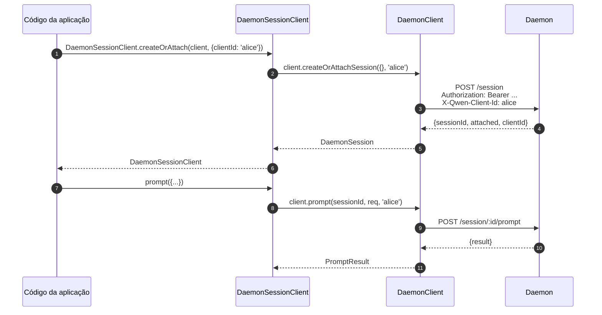
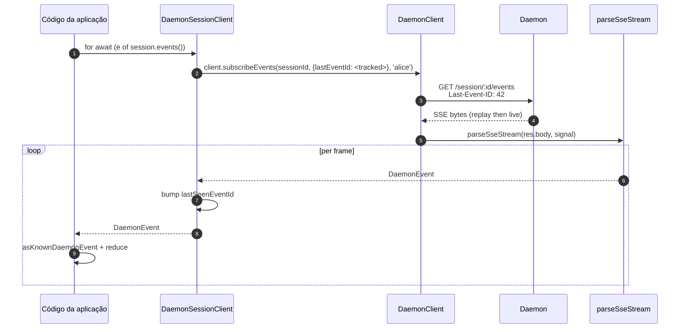
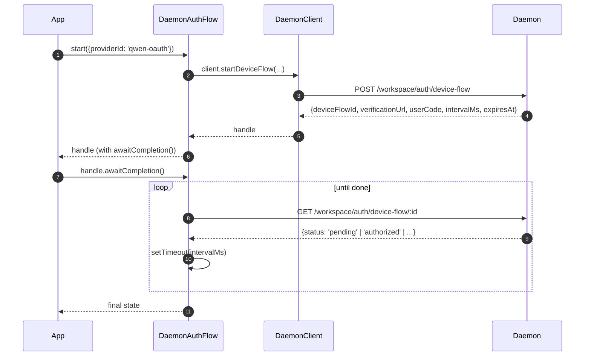

# Cliente Daemon do SDK TypeScript

## Visão geral

`packages/sdk-typescript/src/daemon/` é o **cliente daemon do SDK TypeScript**. É a maneira canônica de se conectar a um daemon `qwen serve` em execução a partir de qualquer host TypeScript / JavaScript (o adaptador TUI da própria CLI, backends de bots de canal, o companion de IDE do VS Code, scripts personalizados e backends web server-side). Todos os outros adaptadores dependem dele.

A estrutura do pacote é intencionalmente pequena:

| File                     | Surface                                                                                                                        |
| ------------------------ | ------------------------------------------------------------------------------------------------------------------------------ |
| `index.ts`               | Barrel público (`DaemonClient`, `DaemonSessionClient`, `DaemonAuthFlow`, `parseSseStream`, redutores de eventos, tipos).       |
| `DaemonClient.ts`        | Facade HTTP/SSE de baixo nível — um método por rota do `qwen-serve-protocol.md`.                                               |
| `DaemonSessionClient.ts` | Wrapper com escopo de sessão e rastreamento de replay de SSE.                                                                  |
| `DaemonAuthFlow.ts`      | Helper de device-flow OAuth de alto nível.                                                                                     |
| `sse.ts`                 | `parseSseStream` (parser de framing NDJSON / SSE).                                                                             |
| `events.ts`              | `asKnownDaemonEvent`, `reduceDaemonSessionEvent`, `reduceDaemonAuthEvent` (veja [`09-event-schema.md`](./09-event-schema.md)). |
| `types.ts`               | `DaemonCapabilities`, `DaemonSession`, `DaemonEvent`, `PermissionResponse`, `PromptResult`, tipos de MCP / agent / memory / auth. |

O exemplo passo a passo está em [`../examples/daemon-client-quickstart.md`](../examples/daemon-client-quickstart.md); este documento é a referência de arquitetura e contrato.

## Responsabilidades

- Fornecer um método TypeScript por rota HTTP do daemon.
- Aplicar corretamente o bearer token + `X-Qwen-Client-Id` em cada requisição.
- Componer timeouts por chamada com o `AbortSignal` fornecido pelo chamador (sem encerrar SSEs de longa duração).
- Fazer stream e parse de frames SSE em `DaemonEvent`s tipados.
- Rastrear `lastSeenEventId` por sessão para que as reconexões façam replay corretamente.
- Expor uma superfície de autenticação device-flow que faz polling nos intervalos fornecidos pelo daemon.

## Arquitetura

### `DaemonClient` (`DaemonClient.ts`)

Construtor:

```ts
new DaemonClient({
  baseUrl: string,                  // padrão 'http://127.0.0.1:4170'
  token?: string,
  fetch?: typeof globalThis.fetch,  // injetável para testes
  fetchTimeoutMs?: number,          // 0 = desabilitado; padrão DEFAULT_FETCH_TIMEOUT_MS
});
```

Grupos de métodos (cada método recebe um `clientId` opcional para aplicar o `X-Qwen-Client-Id`):

| Group               | Methods                                                                                                                                                                                                                             |
| ------------------- | ----------------------------------------------------------------------------------------------------------------------------------------------------------------------------------------------------------------------------------- |
| Infraestrutura      | `health()`, `capabilities()`, `auth` (accessor lazy de `DaemonAuthFlow`)                                                                                                                                                            |
| Sessions            | `createOrAttachSession`, `loadSession`, `resumeSession`, `listSessions`, `closeSession`, `setSessionMetadata`, `getSessionContext`, `getSessionSupportedCommands`, `setSessionApprovalMode`, `setSessionModel`                      |
| Prompting           | `prompt`, `cancel`, `heartbeat`                                                                                                                                                                                                     |
| Events              | `subscribeEvents` (gerador SSE), `subscribeEventsStream` (resposta bruta)                                                                                                                                                           |
| Permissions         | `respondToPermission`, `respondToSessionPermission`                                                                                                                                                                                 |
| Workspace snapshots | `getWorkspaceMcp`, `getWorkspaceSkills`, `getWorkspaceProviders`, `getWorkspaceEnv`, `getWorkspacePreflight`                                                                                                                        |
| Workspace mutations | `writeWorkspaceMemory`, `readWorkspaceMemory`, `listWorkspaceAgents`, `getWorkspaceAgent`, `createWorkspaceAgent`, `updateWorkspaceAgent`, `deleteWorkspaceAgent`, `toggleWorkspaceTool`, `restartMcpServer`, `initializeWorkspace` |
| Files               | `readFile`, `readFileBytes`, `writeFile`, `editFile`, `listDirectory`, `globPaths`, `statPath`                                                                                                                                      |
| Auth                | `startDeviceFlow`, `pollDeviceFlow`, `cancelDeviceFlow`, `getAuthStatus`                                                                                                                                                            |

### `fetchWithTimeout`

Toda requisição passa por `fetchWithTimeout`. Detalhes críticos:

- **A leitura do body está dentro do escopo do timer.** Implementações anteriores limpavam o timer quando os headers chegavam; se um proxy travasse no meio do body, `await res.json()` poderia travar além de `fetchTimeoutMs`. O formato atual passa o código de leitura do body como um callback para que o timer cubra tanto a chegada dos headers QUANTO o consumo do body.
- **`perCallTimeoutMs`** permite que uma única chamada sobrescreva o padrão de todo o cliente. O chamador mais visível é `restartMcpServer`: o SDK usa `MCP_RESTART_DEFAULT_TIMEOUT_MS = 330_000` (5 min 30s). O próprio `MCP_RESTART_TIMEOUT_MS` do daemon é exatamente 300s; se o cliente usasse esse valor, um restart que completasse perto de 300s poderia perder a corrida enquanto o daemon serializa e envia sua resposta estruturada, causando um `TimeoutError` falso-positivo. Os 30s extras cobrem serialização, transferência de rede e decode em ambos os lados. Chamadores que precisam de um orçamento mais restrito podem passar `timeoutMs`; passar `0` desabilita o timeout.
- **`AbortSignal.any`** compõe o signal fornecido pelo chamador com o signal do timer por chamada, para que o cancelamento do chamador e o timeout por chamada abortem de forma limpa.
- **`AbortController` + `setTimeout` cancelável** em vez de `AbortSignal.timeout()`, para que requisições de resolução rápida não vazem timers pendentes no event loop. O timer é limpo no `finally`.
- **Endpoints de streaming (`subscribeEvents`) ignoram o timeout** — SSEs de longa duração não devem ser encerrados por ele.

### `DaemonSessionClient` (`DaemonSessionClient.ts`)

Vincula uma sessão e rastreia automaticamente `lastSeenEventId` para que o replay e a reconexão de SSE funcionem sem estado extra do chamador.

```ts
class DaemonSessionClient {
  readonly client: DaemonClient;
  readonly session: DaemonSession;
  readonly state: DaemonSessionState;
  private lastSeenEventId: number | undefined;

  static createOrAttach(client, req?): Promise<DaemonSessionClient>;
  static load(client, sessionId, req?): Promise<DaemonSessionClient>;
  static resume(client, sessionId, req?): Promise<DaemonSessionClient>;

  events(opts?: DaemonSessionSubscribeOptions): AsyncIterable<DaemonEvent>;
  prompt(req: PromptRequest): Promise<PromptResult>;
  cancel(): Promise<void>;
  respondToPermission(...): Promise<PermissionResponse>;
  setModel(modelServiceId): Promise<SetModelResult>;
  heartbeat(): Promise<HeartbeatResult>;
  setMetadata(metadata): Promise<SessionMetadataResult>;
  close(): Promise<void>;
}
```

`events()` faz proxy de `client.subscribeEvents` com `resume: true` por padrão — ele passa o `lastSeenEventId` rastreado para que as reconexões façam replay de onde a assinatura anterior parou. Cada evento gerado (yielded) incrementa `lastSeenEventId`.

### `DaemonAuthFlow` (`DaemonAuthFlow.ts`)

```ts
class DaemonAuthFlow {
  start(opts: { providerId, ... }): Promise<DaemonAuthFlowHandle>;
}
interface DaemonAuthFlowHandle {
  deviceFlowId: string;
  providerId: string;
  expiresAt: string;
  verificationUrl: string;
  userCode: string;
  awaitCompletion(opts?): Promise<DaemonAuthDeviceFlowState>;
  cancel(): Promise<void>;
}
```

`awaitCompletion()` faz polling de `GET /workspace/auth/device-flow/:id` no `intervalMs` fornecido pelo daemon até que o fluxo se torne `authorized`, `failed` ou `cancelled`. Ele é construído de forma lazy via `client.auth`, para que clientes que nunca tocam em auth não tenham custo de alocação.

### `parseSseStream` (`sse.ts`)

Transforma um `Response.body` (`ReadableStream<Uint8Array>`) em `AsyncIterable<DaemonEvent>`. Lida com:

- Framing LF e CRLF.
- Limite de estouro de buffer (16 MiB) — limite defensivo contra um daemon emitindo um único frame absurdamente grande.
- Integração do AbortSignal — abortar fecha o stream e o iterador.
- Frames apenas com comentários e tipos de eventos desconhecidos (repassados como `DaemonEvent`; consumidores do SDK refinam downstream via `asKnownDaemonEvent`).

### Types (`types.ts`)

Exportações notáveis: `DaemonCapabilities`, `DaemonSession` (`{ sessionId, workspaceCwd, attached, clientId?, createdAt? }`), `DaemonEvent`, `DaemonSessionState`, `DaemonSessionContextStatus`, `DaemonSessionSupportedCommandsStatus`, `PermissionResponse`, `PromptResult`, `HeartbeatResult`, `SetModelResult`, `SessionMetadataResult`, além de tipos de resultado de MCP / agent / memory / auth.

## Fluxo de trabalho

### Create-or-attach + primeiro prompt



### Subscribe com replay



### Auth device-flow



`qwen-oauth` é o identificador legado do provedor v1. O tier gratuito do Qwen OAuth foi descontinuado em 15/04/2026, portanto, novos clientes devem preferir um provedor de auth atualmente suportado quando houver um disponível.

## Estado e Ciclo de vida

- `DaemonClient` não mantém conexão; nada acontece na construção. Cada método abre um `fetch` novo.
- `DaemonSessionClient` retém `lastSeenEventId` entre invocações de `events()`; as reconexões fazem replay a partir do último visto.
- `DaemonAuthFlow` é lazy — `client.auth` o constrói no primeiro acesso.
- O iterador SSE é fechado quando (a) o daemon encerra o stream, (b) `AbortSignal.abort()` é disparado, (c) o consumidor sai do `for await` ou (d) o limite de estouro de buffer (16 MiB) é atingido.

## Dependências

- `globalThis.fetch` (built-in do Node 18+, browser, undici, etc.). Injetável por `DaemonClient` para testes.
- `AbortController` / `AbortSignal.any` / `setTimeout` nativos.
- Sem dependências transitivas em `@qwen-code/qwen-code-core` ou `@qwen-code/acp-bridge` — o pacote do SDK é totalmente desacoplado para que consumidores externos não puxem os internos do daemon.

## Subpacote `ui/*` ([#4328](https://github.com/QwenLM/qwen-code/pull/4328) + [#4353](https://github.com/QwenLM/qwen-code/pull/4353))

O SDK também exporta `packages/sdk-typescript/src/daemon/ui/`, um conjunto de primitivas neutras em relação ao host que transformam eventos do daemon em blocos de transcrição:

- `normalizeDaemonEvent(evt)` mapeia os 47 eventos de wire conhecidos do daemon em 42 valores `DaemonUiEventType` amigáveis à UI; eventos não modelados ou malformados são normalizados para `debug`.
- `createDaemonTranscriptState()` mais `reduceDaemonTranscriptEvents(state, events)` projetam eventos de UI em `DaemonTranscriptBlock[]`.
- `createDaemonTranscriptStore()` encapsula subscribe / dispatch.
- `render.ts` / `terminal.ts` fornecem renderizadores base para HTML e terminal, enquanto `toolPreview.ts` produz resumos de chamadas de ferramentas.
- Os seletores incluem `selectTranscriptBlocksOrderedByEventId`, `selectPendingPermissionBlocks`, `selectCurrentTool`, `selectApprovalMode`, `selectToolProgress`, `selectSubagentChildBlocks`, `formatMissedRange` e `formatBlockTimestamp`.
- As constantes públicas incluem `DAEMON_PLAN_TOOL_CALL_ID`.
- `conformance.ts` contém a suíte de testes de consistência entre hosts.

O primeiro consumidor em produção é `packages/webui/src/daemon/` através do `DaemonSessionProvider` do React. Veja [`14-cli-tui-adapter.md`](./14-cli-tui-adapter.md) para a arquitetura detalhada, glossário, tabela de seletores e relação com o legado `DaemonTuiAdapter`.

O subpacote é exportado a partir do subpath `@qwen-code/sdk/daemon`. O código existente que faz `import { DaemonClient }` não é afetado.

## Reconexão com Last-Event-ID no SDK

### Rastreamento automático via `DaemonSessionClient`

`DaemonSessionClient` rastreia `lastSeenEventId` internamente. Cada evento gerado (yielded) com um `id` numérico incrementa o cursor. Chamadas subsequentes de `events()` passam automaticamente o id rastreado como `Last-Event-ID`, para que a reconexão com replay funcione sem estado extra do chamador:

```ts
import { DaemonClient, DaemonSessionClient } from '@qwen-code/sdk/daemon';

const client = new DaemonClient({ baseUrl: 'http://127.0.0.1:4170', token });
const session = await DaemonSessionClient.createOrAttach(client);

// Primeira assinatura — inicia ao vivo (ou do início do ring para novas sessões).
for await (const event of session.events()) {
  console.log(event.type, event.id);
  // session.lastEventId é incrementado em cada frame que carrega id.
  if (shouldStop(event)) break;
}

// Reconexão — envia automaticamente Last-Event-ID: <último id visto>.
// O daemon faz replay dos eventos perdidos do ring e depois vai para ao vivo.
for await (const event of session.events()) {
  // Frames de replay chegam primeiro, depois um replay_complete sintético,
  // depois eventos ao vivo.
  handleEvent(event);
}
```

### Reconexão manual com `DaemonClient`

Para um controle de nível mais baixo, use `DaemonClient.subscribeEvents` diretamente e gerencie o cursor você mesmo:

```ts
const client = new DaemonClient({ baseUrl: 'http://127.0.0.1:4170', token });

let cursor: number | undefined; // undefined = apenas ao vivo na primeira conexão

async function* subscribe(sessionId: string, signal: AbortSignal) {
  for await (const event of client.subscribeEvents(sessionId, {
    lastEventId: cursor,
    signal,
  })) {
    // Apenas frames que carregam id avançam o cursor.
    if (event.id !== undefined) {
      cursor = event.id;
    }
    // Lida com lacuna de evicção do ring.
    if (event.type === 'state_resync_required') {
      // O estado está obsoleto — recarrega o estado completo da sessão.
      await client.loadSession(sessionId);
      continue;
    }
    yield event;
  }
}
```

### Reconexão com Loop de Retry

O SDK **não** faz auto-retry em falhas de rede. Implemente um loop de retry em torno de `events()`:

```ts
async function resilientSubscribe(session: DaemonSessionClient) {
  const MAX_RETRIES = 10;
  const BASE_DELAY_MS = 1000;

  for (let attempt = 0; attempt < MAX_RETRIES; attempt++) {
    try {
      // resume: true (padrão) passa o lastSeenEventId rastreado.
      for await (const event of session.events()) {
        attempt = 0; // reseta em caso de evento bem-sucedido
        handleEvent(event);
      }
      break; // fim limpo do stream
    } catch (err) {
      const delay = BASE_DELAY_MS * 2 ** Math.min(attempt, 5);
      await new Promise((r) => setTimeout(r, delay));
    }
  }
}
```

Na reconexão, o daemon faz replay de eventos com `id > lastSeenEventId` a partir de seu ring limitado (padrão de 8000 eventos). Se a lacuna exceder o ring, um frame `state_resync_required` sinaliza ao cliente para chamar `loadSession` para uma reconstrução completa do estado.

### Inicializando `lastEventId` na Construção

Chamadores que persistem o cursor entre reinicializações de processo podem inicializá-lo:

```ts
const session = new DaemonSessionClient({
  client,
  session: { sessionId, workspaceCwd, attached: true },
  lastEventId: persistedCursor, // retoma da posição persistida
});
```

O valor deve ser um inteiro finito e não negativo (validado na construção). Valores inválidos lançam erro.

## Configuração

| Parâmetro          | Onde                                 | Efeito                                                                                  |
| ------------------ | ------------------------------------ | --------------------------------------------------------------------------------------- |
| `baseUrl`          | Construtor do `DaemonClient`         | URL do daemon; barras finais removidas.                                                 |
| `token`            | Construtor do `DaemonClient`         | Aplicado como `Authorization: Bearer`.                                                  |
| `fetch`            | Construtor do `DaemonClient`         | Ponto de injeção para testes.                                                           |
| `fetchTimeoutMs`   | Construtor do `DaemonClient`         | Timeout por chamada; `0` = desabilitado.                                                |
| `clientId`         | Arg opcional por método              | Header `X-Qwen-Client-Id` (veja [`08-session-lifecycle.md`](./08-session-lifecycle.md)).|
| `lastEventId`      | Construtor do `DaemonSessionClient`  | Inicializa o cursor de replay.                                                          |
| `maxQueued`        | Opção por assinatura                 | `?maxQueued=N` para a rota SSE; faça pre-flight de `caps.features.slow_client_warning` antes. |
| `perCallTimeoutMs` | Por método (ex: `restartMcpServer`)  | Sobrescreve o timeout de todo o cliente.                                                |

## Ressalvas e Limites Conhecidos

- **`fetchTimeoutMs` é por chamada, não a nível de conexão.** Leituras longas de body compartilham o timer. Um daemon que faz stream de respostas deve sobrescrever o timeout por chamada ou definir o timeout como `0`.
- **SSE ignora o timeout do fetch** — conexões SSE de longa duração não são encerradas por `fetchTimeoutMs`. Use `AbortSignal` para cancelamento controlado pelo chamador.
- **O limite de buffer do `parseSseStream` é 16 MiB** como um limite defensivo. Um único frame maior que isso aborta o iterador (o daemon nunca emite frames desse tamanho legitimamente).
- **`asKnownDaemonEvent` retorna `undefined` para tipos de eventos não reconhecidos.** Consumidores do SDK devem lidar com esse branch em vez de assumir que a união é exaustiva; esse é o contrato de compatibilidade futura. Eventos não reconhecidos incrementam `DaemonSessionViewState.unrecognizedKnownEventCount`.
- **`client_evicted`, `slow_client_warning`, `stream_error` não estão no ring de replay.** Reconectar após evicção retoma do ring do daemon; você não verá o frame de evicção novamente.
- **`DaemonClient` não faz auto-retry.** Falhas de rede surgem como rejeições; a estratégia de reconexão / replay é responsabilidade do chamador (`DaemonSessionClient.events()` facilita o replay, mas a reconexão ainda é por chamada).
## Referências

- `packages/sdk-typescript/src/daemon/DaemonClient.ts`
- `packages/sdk-typescript/src/daemon/DaemonSessionClient.ts`
- `packages/sdk-typescript/src/daemon/DaemonAuthFlow.ts`
- `packages/sdk-typescript/src/daemon/sse.ts`
- `packages/sdk-typescript/src/daemon/events.ts`
- `packages/sdk-typescript/src/daemon/types.ts`
- Tutorial de ponta a ponta: [`../examples/daemon-client-quickstart.md`](../examples/daemon-client-quickstart.md).