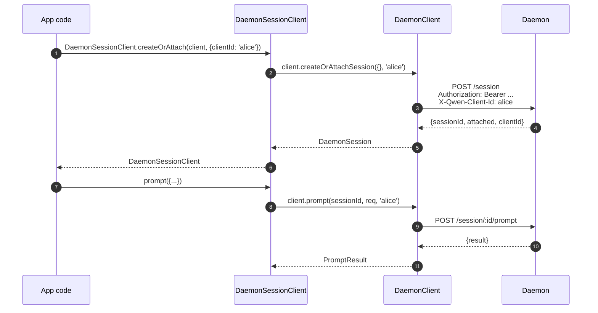
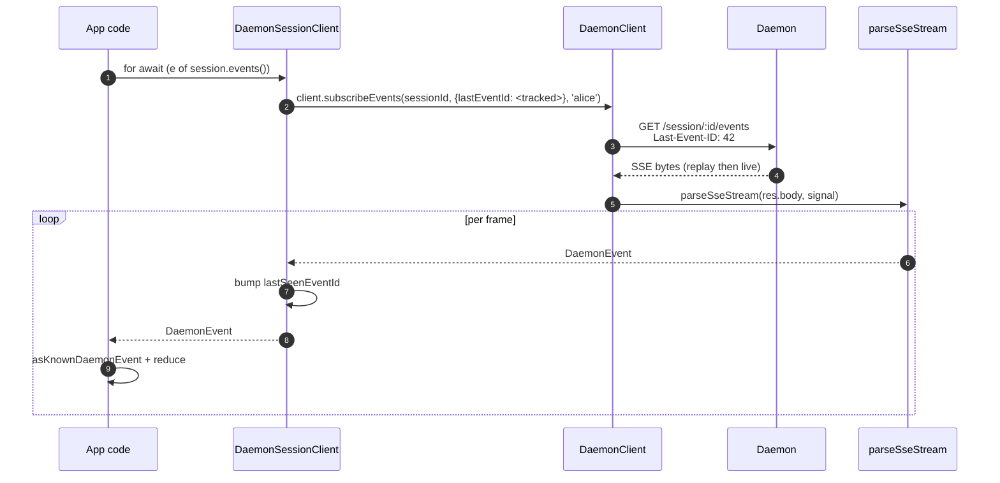
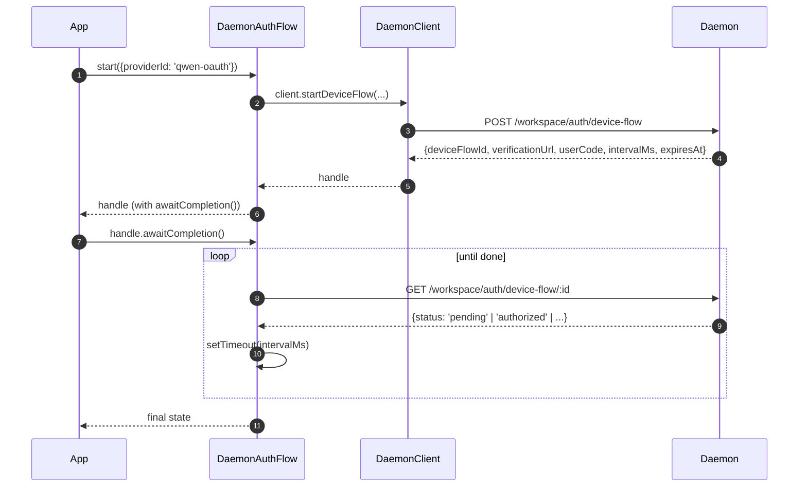

# Cliente Daemon do SDK TypeScript

## Visão geral

`packages/sdk-typescript/src/daemon/` é o **cliente daemon do SDK TypeScript**. Esta é a maneira canônica de se conectar a um daemon `qwen serve` em execução a partir de qualquer host TypeScript / JavaScript (o adaptador TUI do próprio CLI, backends de bots de canal, o IDE companion do VS Code, scripts personalizados e backends web do lado do servidor). Todos os outros adaptadores dependem dele.

A estrutura do pacote é intencionalmente pequena:

| Arquivo                  | Superfície                                                                                                                                                                                          |
| ------------------------ | --------------------------------------------------------------------------------------------------------------------------------------------------------------------------------------------------- |
| `index.ts`               | Barrel público (`DaemonClient`, `DaemonSessionClient`, `DaemonAuthFlow`, `parseSseStream`, redutores de eventos, tipos).             |
| `DaemonClient.ts`        | Fachada HTTP/SSE de baixo nível — um método por rota do `qwen-serve-protocol.md`.                                                                                                                   |
| `DaemonSessionClient.ts` | Wrapper com escopo de sessão e rastreamento de repetição SSE.                                                                                                                                       |
| `DaemonAuthFlow.ts`      | Auxiliar de alto nível para fluxo de dispositivo OAuth.                                                                                                                                             |
| `sse.ts`                 | `parseSseStream` (analisador de framing NDJSON / SSE).                                                                                                                                              |
| `events.ts`              | `asKnownDaemonEvent`, `reduceDaemonSessionEvent`, `reduceDaemonAuthEvent` (veja [`09-event-schema.md`](./09-event-schema.md)).                                                                       |
| `types.ts`               | `DaemonCapabilities`, `DaemonSession`, `DaemonEvent`, `PermissionResponse`, `PromptResult`, tipos MCP / agente / memória / autenticação.                                                            |

O exemplo prático está em [`../examples/daemon-client-quickstart.md`](../examples/daemon-client-quickstart.md); este documento é a referência de arquitetura e contrato.

## Responsabilidades

- Fornecer um método TypeScript por rota HTTP do daemon.
- Aplicar o token de portador + `X-Qwen-Client-Id` corretamente em cada requisição.
- Compor timeouts por chamada com `AbortSignal` fornecido pelo chamador (sem interromper SSE de longa duração).
- Transmitir e analisar quadros SSE em `DaemonEvent`s tipados.
- Rastrear `lastSeenEventId` por sessão para que as reconexões repitam corretamente.
- Expor uma superfície de autenticação de fluxo de dispositivo que faz polling nos intervalos fornecidos pelo daemon.

## Arquitetura

### `DaemonClient` (`DaemonClient.ts`)

Construtor:

```ts
new DaemonClient({
  baseUrl: string,                  // default 'http://127.0.0.1:4170'
  token?: string,
  fetch?: typeof globalThis.fetch,  // injetável para testes
  fetchTimeoutMs?: number,          // 0 = desabilitado; padrão DEFAULT_FETCH_TIMEOUT_MS
});
```

Grupos de métodos (cada método aceita um `clientId` opcional para estampar `X-Qwen-Client-Id`):

| Grupo                 | Métodos                                                                                                                                                                                                                           |
| --------------------- | --------------------------------------------------------------------------------------------------------------------------------------------------------------------------------------------------------------------------------- |
| Infraestrutura        | `health()`, `capabilities()`, `auth` (acessor lazy para `DaemonAuthFlow`)                                                                                                                                                          |
| Sessões               | `createOrAttachSession`, `loadSession`, `resumeSession`, `listSessions`, `closeSession`, `setSessionMetadata`, `getSessionContext`, `getSessionSupportedCommands`, `setSessionApprovalMode`, `setSessionModel`                    |
| Prompting             | `prompt`, `cancel`, `heartbeat`                                                                                                                                                                                                   |
| Eventos               | `subscribeEvents` (gerador SSE), `subscribeEventsStream` (resposta bruta)                                                                                                                                                         |
| Permissões            | `respondToPermission`, `respondToSessionPermission`                                                                                                                                                                               |
| Snapshots de workspace| `getWorkspaceMcp`, `getWorkspaceSkills`, `getWorkspaceProviders`, `getWorkspaceEnv`, `getWorkspacePreflight`                                                                                                                      |
| Mutações de workspace | `writeWorkspaceMemory`, `readWorkspaceMemory`, `listWorkspaceAgents`, `getWorkspaceAgent`, `createWorkspaceAgent`, `updateWorkspaceAgent`, `deleteWorkspaceAgent`, `toggleWorkspaceTool`, `restartMcpServer`, `initializeWorkspace` |
| Arquivos              | `readFile`, `readFileBytes`, `writeFile`, `editFile`, `listDirectory`, `globPaths`, `statPath`                                                                                                                                    |
| Autenticação          | `startDeviceFlow`, `pollDeviceFlow`, `cancelDeviceFlow`, `getAuthStatus`                                                                                                                                                          |
### `fetchWithTimeout`

Toda requisição passa por `fetchWithTimeout`. Detalhes importantes:

- **A leitura do corpo está dentro do escopo do timer.** Implementações anteriores limpavam o timer quando os cabeçalhos chegavam; se um proxy travasse no meio do corpo, `await res.json()` poderia ficar pendurado além de `fetchTimeoutMs`. A forma atual passa o código de leitura do corpo como um callback, para que o timer cubra tanto a chegada dos cabeçalhos quanto o consumo do corpo.
- **`perCallTimeoutMs`** permite que uma única chamada substitua o padrão do cliente. O chamador mais visível é `restartMcpServer`: o SDK usa `MCP_RESTART_DEFAULT_TIMEOUT_MS = 330_000` (5 min 30s). O próprio `MCP_RESTART_TIMEOUT_MS` do daemon é exatamente 300s; se o cliente corresponder a esse valor, uma reinicialização que terminar perto de 300s pode perder a corrida enquanto o daemon serializa e envia sua resposta estruturada, causando um falso positivo `TimeoutError`. Os 30s extras cobrem serialização, transferência de rede e decodificação em ambos os lados. Chamadores que precisam de um orçamento mais apertado podem passar `timeoutMs`; passar `0` desabilita o timeout.
- **`AbortSignal.any`** compõe o sinal fornecido pelo chamador com o sinal do timer por chamada, de modo que o cancelamento do chamador e o timeout por chamada abortam de forma limpa.
- **`AbortController` + `setTimeout` cancelável** em vez de `AbortSignal.timeout()` para que requisições que resolvem rapidamente não vazem timers pendentes no event loop. O timer é limpo no `finally`.
- **Endpoints de streaming (`subscribeEvents`) ignoram o timeout** — SSE de longa duração não deve ser interrompido por ele.

### `DaemonSessionClient` (`DaemonSessionClient.ts`)

Vincula uma sessão e rastreia automaticamente `lastSeenEventId`, para que o replay e a reconexão SSE funcionem sem estado extra do chamador.

```ts
class DaemonSessionClient {
  readonly client: DaemonClient;
  readonly session: DaemonSession;
  readonly state: DaemonSessionState;
  private lastSeenEventId: number | undefined;

  static createOrAttach(client, req?): Promise<DaemonSessionClient>;
  static load(client, sessionId, req?): Promise<DaemonSessionClient>;
  static resume(client, sessionId, req?): Promise<DaemonSessionClient>;

  events(opts?: DaemonSessionSubscribeOptions): AsyncIterable<DaemonEvent>;
  prompt(req: PromptRequest): Promise<PromptResult>;
  cancel(): Promise<void>;
  respondToPermission(...): Promise<PermissionResponse>;
  setModel(modelServiceId): Promise<SetModelResult>;
  heartbeat(): Promise<HeartbeatResult>;
  setMetadata(metadata): Promise<SessionMetadataResult>;
  close(): Promise<void>;
}
```

`events()` delega para `client.subscribeEvents` com `resume: true` por padrão — ele passa o `lastSeenEventId` rastreado, de modo que as reconexões reproduzem a partir de onde a assinatura anterior parou. Cada evento gerado incrementa `lastSeenEventId`.

### `DaemonAuthFlow` (`DaemonAuthFlow.ts`)

```ts
class DaemonAuthFlow {
  start(opts: { providerId, ... }): Promise<DaemonAuthFlowHandle>;
}
interface DaemonAuthFlowHandle {
  deviceFlowId: string;
  providerId: string;
  expiresAt: string;
  verificationUrl: string;
  userCode: string;
  awaitCompletion(opts?): Promise<DaemonAuthDeviceFlowState>;
  cancel(): Promise<void>;
}
```

`awaitCompletion()` faz polling de `GET /workspace/auth/device-flow/:id` no `intervalMs` fornecido pelo daemon até que o fluxo se torne `authorized`, `failed` ou `cancelled`. Ele é construído de forma lazy via `client.auth`, para que clientes que nunca usam autenticação não incorram em custo de alocação.

### `parseSseStream` (`sse.ts`)

Transforma um `Response.body` (`ReadableStream<Uint8Array>`) em `AsyncIterable<DaemonEvent>`. Lida com:

- Delimitação por LF e CRLF.
- Limite de estouro do buffer (16 MiB) — limite defensivo contra um daemon emitindo um único frame absurdamente grande.
- Conexão com `AbortSignal` — abortar fecha o stream e o iterador.
- Frames apenas de comentário e tipos de evento desconhecidos (passados como `DaemonEvent`; consumidores do SDK refinam downstream via `asKnownDaemonEvent`).

### Tipos (`types.ts`)

Exportações notáveis: `DaemonCapabilities`, `DaemonSession` (`{ sessionId, workspaceCwd, attached, clientId?, createdAt? }`), `DaemonEvent`, `DaemonSessionState`, `DaemonSessionContextStatus`, `DaemonSessionSupportedCommandsStatus`, `PermissionResponse`, `PromptResult`, `HeartbeatResult`, `SetModelResult`, `SessionMetadataResult`, além de tipos de resultado de MCP / agente / memória / autenticação.

## Fluxo de trabalho

### Criar ou anexar + primeiro prompt



### Assinar com replay


### Autenticação por fluxo de dispositivo



`qwen-oauth` é o identificador legado do provedor v1. O nível gratuito do Qwen OAuth foi descontinuado em 15 de abril de 2026, portanto, novos clientes devem preferir um provedor de autenticação atualmente suportado, quando disponível.

## Estado e Ciclo de Vida

- `DaemonClient` não possui conexão; nada acontece na construção. Cada método abre um novo `fetch`.
- `DaemonSessionClient` mantém `lastSeenEventId` entre invocações de `events()`; reconexões reproduzem a partir do último visto.
- `DaemonAuthFlow` é lazy — `client.auth` o constrói no primeiro acesso.
- O iterador SSE fecha quando: (a) o daemon encerra o fluxo, (b) `AbortSignal.abort()` é acionado, (c) o consumidor sai do `for await`, ou (d) o limite de estouro do buffer (16 MiB) é atingido.

## Dependências

- `globalThis.fetch` (nativo no Node 18+, navegador, undici, etc.). Pode ser injetado por `DaemonClient` para testes.
- `AbortController` / `AbortSignal.any` / `setTimeout` nativos.
- Nenhuma dependência transitiva de `@qwen-code/qwen-code-core` ou `@qwen-code/acp-bridge` — o pacote SDK é totalmente desacoplado para que consumidores externos não puxem os internos do daemon.

## Subpacote `ui/*` ([#4328](https://github.com/QwenLM/qwen-code/pull/4328) + [#4353](https://github.com/QwenLM/qwen-code/pull/4353))

O SDK também exporta `packages/sdk-typescript/src/daemon/ui/`, um conjunto de primitivas neutras de host que transformam eventos do daemon em blocos de transcrição:

- `normalizeDaemonEvent(evt)` mapeia os 43 tipos de eventos de rede conhecidos do daemon em 37 valores de `DaemonUiEventType` amigáveis para interface; eventos não modelados ou malformados são normalizados para `debug`.
- `createDaemonTranscriptState()` mais `reduceDaemonTranscriptEvents(state, events)` projeta eventos de interface em `DaemonTranscriptBlock[]`.
- `createDaemonTranscriptStore()` envolve subscribe/dispatch.
- `render.ts` / `terminal.ts` fornecem renderizadores base HTML e terminal, enquanto `toolPreview.ts` produz resumos de chamadas de ferramenta.
- Seletores incluem `selectTranscriptBlocksOrderedByEventId`, `selectPendingPermissionBlocks`, `selectCurrentTool`, `selectApprovalMode`, `selectToolProgress`, `selectSubagentChildBlocks`, `formatMissedRange` e `formatBlockTimestamp`.
- Constantes públicas incluem `DAEMON_PLAN_TOOL_CALL_ID`.
- `conformance.ts` contém a suíte de testes de consistência entre hosts.

O primeiro consumidor em produção é `packages/webui/src/daemon/` através do `DaemonSessionProvider` do React. Consulte [`14-cli-tui-adapter.md`](./14-cli-tui-adapter.md) para a arquitetura detalhada, glossário, tabela de seletores e relação com o legado `DaemonTuiAdapter`.

O subpacote é exportado pelo caminho `@qwen-code/sdk/daemon`. Código existente que faz `import { DaemonClient }` não é afetado.

## Configuração

| Parâmetro           | Onde                                | Efeito                                                                                |
| ------------------- | ----------------------------------- | ------------------------------------------------------------------------------------- |
| `baseUrl`           | Construtor `DaemonClient`           | URL do daemon; barras finais removidas.                                                |
| `token`             | Construtor `DaemonClient`           | Incluído como `Authorization: Bearer`.                                                 |
| `fetch`             | Construtor `DaemonClient`           | Ponto de injeção para testes.                                                         |
| `fetchTimeoutMs`    | Construtor `DaemonClient`           | Timeout por chamada; `0` = desabilitado.                                              |
| `clientId`          | Argumento opcional por método       | Cabeçalho `X-Qwen-Client-Id` (veja [`08-session-lifecycle.md`](./08-session-lifecycle.md)). |
| `lastEventId`       | Construtor `DaemonSessionClient`    | Cursor de reprodução inicial.                                                          |
| `maxQueued`         | Opção por subscribe                 | `?maxQueued=N` para a rota SSE; verifique primeiro `caps.features.slow_client_warning`. |
| `perCallTimeoutMs`  | Por método (ex.: `restartMcpServer`) | Substitui o timeout geral do cliente.                                                  |

## Observações e Limitações Conhecidas

- **`fetchTimeoutMs` é por chamada, não por conexão.** Leituras longas de corpo compartilham o mesmo timer. Um daemon que transmite respostas deve substituir o timeout por chamada ou defini-lo como `0`.
- **SSE ignora o timeout do fetch** — conexões SSE de longa duração não são encerradas por `fetchTimeoutMs`. Use `AbortSignal` para cancelamento controlado pelo chamador.
- **Limite do buffer de `parseSseStream` é de 16 MiB** como proteção. Um único quadro maior que isso aborta o iterador (o daemon nunca envia legitimamente tais quadros).
- **`asKnownDaemonEvent` retorna `undefined` para tipos de evento não reconhecidos.** Consumidores do SDK devem tratar esse caso em vez de assumir que a união é exaustiva; esse é o contrato de compatibilidade futura. Eventos não reconhecidos incrementam `DaemonSessionViewState.unrecognizedKnownEventCount`.
- **`client_evicted`, `slow_client_warning`, `stream_error` não estão no anel de reprodução.** Reconectar após expulsão retoma a partir do anel do daemon; você não verá novamente o quadro de expulsão.
- **`DaemonClient` não faz retentativas automáticas.** Falhas de rede se manifestam como rejeições; a estratégia de reconexão/reprodução é responsabilidade do chamador (`DaemonSessionClient.events()` facilita a reprodução, mas a reconexão ainda é por chamada).
## Referências

- `packages/sdk-typescript/src/daemon/DaemonClient.ts`
- `packages/sdk-typescript/src/daemon/DaemonSessionClient.ts`
- `packages/sdk-typescript/src/daemon/DaemonAuthFlow.ts`
- `packages/sdk-typescript/src/daemon/sse.ts`
- `packages/sdk-typescript/src/daemon/events.ts`
- `packages/sdk-typescript/src/daemon/types.ts`
- Exemplo completo passo a passo: [`../examples/daemon-client-quickstart.md`](../examples/daemon-client-quickstart.md).
