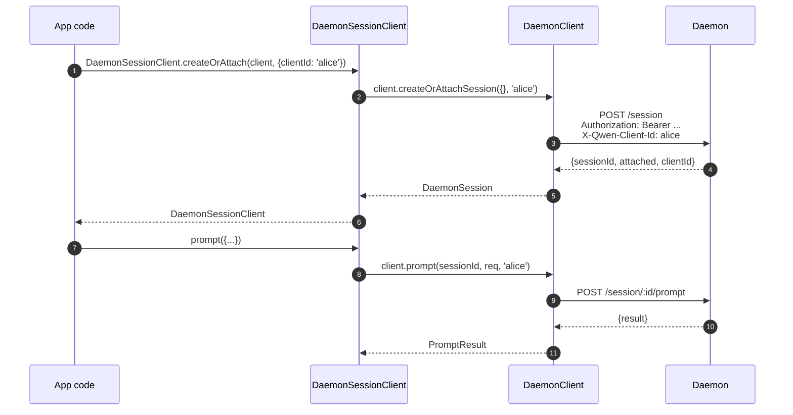
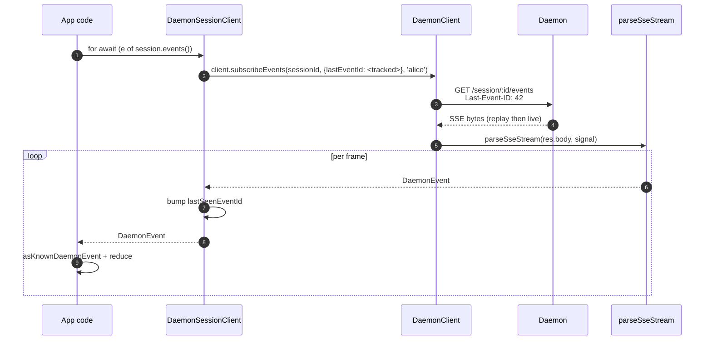
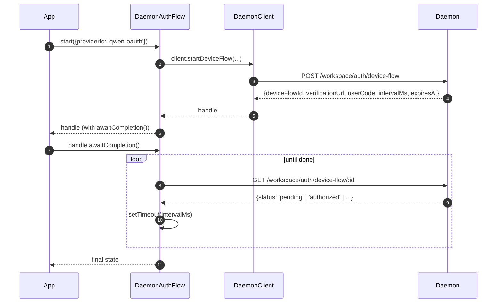

# Cliente Daemon do SDK TypeScript

## Visão Geral

`packages/sdk-typescript/src/daemon/` é o **cliente daemon do SDK TypeScript**. É a maneira oficial de se conectar a um daemon `qwen serve` em execução a partir de qualquer host TypeScript / JavaScript (o adaptador TUI da própria CLI, backends de bots de canal, o companion de IDE do VS Code, scripts personalizados e backends web server-side). Todos os outros adaptadores dependem dele.

A estrutura do pacote é intencionalmente pequena:

| Arquivo                  | Superfície                                                                                                                     |
| ------------------------ | ------------------------------------------------------------------------------------------------------------------------------ |
| `index.ts`               | Barrel público (`DaemonClient`, `DaemonSessionClient`, `DaemonAuthFlow`, `parseSseStream`, redutores de eventos, tipos).       |
| `DaemonClient.ts`        | Facade HTTP/SSE de baixo nível — um método por rota do `qwen-serve-protocol.md`.                                               |
| `DaemonSessionClient.ts` | Wrapper com escopo de sessão e rastreamento de replay de SSE.                                                                  |
| `DaemonAuthFlow.ts`      | Helper de device-flow OAuth de alto nível.                                                                                     |
| `sse.ts`                 | `parseSseStream` (parser de framing NDJSON / SSE).                                                                             |
| `events.ts`              | `asKnownDaemonEvent`, `reduceDaemonSessionEvent`, `reduceDaemonAuthEvent` (veja [`09-event-schema.md`](./09-event-schema.md)). |
| `types.ts`               | `DaemonCapabilities`, `DaemonSession`, `DaemonEvent`, `PermissionResponse`, `PromptResult`, tipos de MCP / agent / memory / auth. |

O exemplo passo a passo está em [`../examples/daemon-client-quickstart.md`](../examples/daemon-client-quickstart.md); este documento é a referência de arquitetura e contrato.

## Responsabilidades

- Fornecer um método TypeScript por rota HTTP do daemon.
- Aplicar corretamente o bearer token + `X-Qwen-Client-Id` em cada requisição.
- Combinar timeouts por chamada com o `AbortSignal` fornecido pelo chamador (sem encerrar SSEs de longa duração).
- Transmitir e analisar frames SSE em `DaemonEvent`s tipados.
- Rastrear `lastSeenEventId` por sessão para que as reconexões façam o replay corretamente.
- Expor uma interface de autenticação device-flow que faz polling nos intervalos fornecidos pelo daemon.

## Arquitetura

### `DaemonClient` (`DaemonClient.ts`)

Construtor:

```ts
new DaemonClient({
  baseUrl: string,                  // default 'http://127.0.0.1:4170'
  token?: string,
  fetch?: typeof globalThis.fetch,  // injectable for tests
  fetchTimeoutMs?: number,          // 0 = disabled; default DEFAULT_FETCH_TIMEOUT_MS
});
```

Grupos de métodos (cada método aceita um `clientId` opcional para aplicar `X-Qwen-Client-Id`):

| Grupo               | Métodos                                                                                                                                                                                                                                                                                                                                                                                                          |
| ------------------- | ---------------------------------------------------------------------------------------------------------------------------------------------------------------------------------------------------------------------------------------------------------------------------------------------------------------------------------------------------------------------------------------------------------------- |
| Infraestrutura      | `health()`, `capabilities()`, `auth` (lazy `DaemonAuthFlow` accessor)                                                                                                                                                                                                                                                                                                                                            |
| Sessões             | `createOrAttachSession`, `loadSession`, `resumeSession`, `listSessions`, `closeSession`, `setSessionMetadata`, `getSessionContext`, `getSessionSupportedCommands`, `setSessionApprovalMode`, `setSessionModel`                                                                                                                                                                                                   |
| Prompting           | `prompt`, `cancel`, `heartbeat`                                                                                                                                                                                                                                                                                                                                                                                  |
| Eventos             | `subscribeEvents` (SSE generator), `subscribeEventsStream` (raw response)                                                                                                                                                                                                                                                                                                                                        |
| Permissões          | `respondToPermission`, `respondToSessionPermission`                                                                                                                                                                                                                                                                                                                                                              |
| Snapshots de workspace | `getWorkspaceMcp`, `getWorkspaceSkills`, `getWorkspaceProviders`, `getWorkspaceEnv`, `getWorkspacePreflight`                                                                                                                                                                                                                                                                                                     |
| Mutações de workspace | `addWorkspace`, `updateWorkspace`, `writeWorkspaceMemory`, `readWorkspaceMemory`, `rememberWorkspaceMemory`, `getWorkspaceMemoryRememberTask`, `forgetWorkspaceMemory`, `getWorkspaceMemoryForgetTask`, `dreamWorkspaceMemory`, `getWorkspaceMemoryDreamTask`, `listWorkspaceAgents`, `getWorkspaceAgent`, `createWorkspaceAgent`, `updateWorkspaceAgent`, `deleteWorkspaceAgent`, `setWorkspaceToolEnabled`, `setWorkspaceSkillEnabled`, `restartMcpServer`, `initWorkspace` |
| Arquivos            | `readFile`, `readFileBytes`, `writeFile`, `editFile`, `listDirectory`, `globPaths`, `statPath`                                                                                                                                                                                                                                                                                                                   |
| Autenticação        | `startDeviceFlow`, `pollDeviceFlow`, `cancelDeviceFlow`, `getAuthStatus`                                                                                                                                                                                                                                                                                                                                         |

### `fetchWithTimeout`

Toda requisição passa por `fetchWithTimeout`. Detalhes críticos:

- **A leitura do body está dentro do escopo do timer.** Implementações anteriores limpavam o timer quando os headers chegavam; se um proxy travasse no meio do body, `await res.json()` poderia travar além de `fetchTimeoutMs`. A forma atual passa o código de leitura do body como um callback para que o timer cubra tanto a chegada dos headers QUANTO o consumo do body.
- **`perCallTimeoutMs`** permite que uma única chamada sobrescreva o padrão de todo o cliente. O chamador mais visível é `restartMcpServer`: o SDK usa `MCP_RESTART_DEFAULT_TIMEOUT_MS = 330_000` (5 min 30s). O próprio `MCP_RESTART_TIMEOUT_MS` do daemon é exatamente 300s; se o cliente correspondesse a esse valor, um restart que completasse perto de 300s poderia perder a corrida enquanto o daemon serializa e envia sua resposta estruturada, causando um `TimeoutError` falso-positivo. Os 30s extras cobrem serialização, transferência de rede e decodificação em ambos os lados. Chamadores que precisam de um orçamento mais restrito podem passar `timeoutMs`; passar `0` desativa o timeout.
- **`AbortSignal.any`** compõe o signal fornecido pelo chamador com o signal do timer por chamada, para que o cancelamento do chamador e o timeout por chamada abortem de forma limpa.
- **`AbortController` + `setTimeout` cancelável** em vez de `AbortSignal.timeout()`, para que requisições de resolução rápida não vazem timers pendentes no event loop. O timer é limpo no `finally`.
- **Endpoints de streaming (`subscribeEvents`) ignoram o timeout** — SSEs de longa duração não devem ser encerrados por ele.

### `DaemonSessionClient` (`DaemonSessionClient.ts`)

Vincula uma sessão e rastreia automaticamente `lastSeenEventId` para que o replay e a reconexão de SSE funcionem sem estado extra do chamador.

```ts
class DaemonSessionClient {
  readonly client: DaemonClient;
  readonly session: DaemonSession;
  readonly state: DaemonSessionState;
  private lastSeenEventId: number | undefined;

  static createOrAttach(client, req?): Promise<DaemonSessionClient>;
  static load(client, sessionId, req?): Promise<DaemonSessionClient>;
  static resume(client, sessionId, req?): Promise<DaemonSessionClient>;

  events(opts?: DaemonSessionSubscribeOptions): AsyncIterable<DaemonEvent>;
  prompt(req: PromptRequest): Promise<PromptResult>;
  cancel(): Promise<void>;
  respondToPermission(...): Promise<PermissionResponse>;
  setModel(modelServiceId): Promise<SetModelResult>;
  heartbeat(): Promise<HeartbeatResult>;
  setMetadata(metadata): Promise<SessionMetadataResult>;
  close(): Promise<void>;
}
```

`events()` faz o proxy de `client.subscribeEvents` com `resume: true` por padrão — ele passa o `lastSeenEventId` rastreado para que as reconexões façam replay de onde a assinatura anterior parou. Cada evento gerado incrementa `lastSeenEventId`.

### `DaemonAuthFlow` (`DaemonAuthFlow.ts`)

```ts
class DaemonAuthFlow {
  start(opts: { providerId, ... }): Promise<DaemonAuthFlowHandle>;
}
interface DaemonAuthFlowHandle {
  deviceFlowId: string;
  providerId: string;
  expiresAt: string;
  verificationUrl: string;
  userCode: string;
  awaitCompletion(opts?): Promise<DaemonAuthDeviceFlowState>;
  cancel(): Promise<void>;
}
```

`awaitCompletion()` faz polling de `GET /workspace/auth/device-flow/:id` no `intervalMs` fornecido pelo daemon até que o flow se torne `authorized`, `failed` ou `cancelled`. Ele é construído lazy via `client.auth`, então clientes que nunca tocam na autenticação não incorrem em custo de alocação.

### `parseSseStream` (`sse.ts`)

Transforma um `Response.body` (`ReadableStream<Uint8Array>`) em `AsyncIterable<DaemonEvent>`. Lida com:

- Framing LF e CRLF.
- Limite de estouro de buffer (16 MiB) — limite defensivo contra um daemon emitindo um único frame absurdamente grande.
- Conexão do AbortSignal — o abort fecha o stream e o iterador.
- Frames apenas com comentários e tipos de eventos desconhecidos (passados como `DaemonEvent`; os consumidores do SDK refinam downstream via `asKnownDaemonEvent`).

### Tipos (`types.ts`)

Exportações notáveis: `DaemonCapabilities`, `DaemonSession` (`{ sessionId, workspaceCwd, attached, clientId?, createdAt? }`), `DaemonEvent`, `DaemonSessionState`, `DaemonSessionContextStatus`, `DaemonSessionSupportedCommandsStatus`, `PermissionResponse`, `PromptResult`, `HeartbeatResult`, `SetModelResult`, `SessionMetadataResult`, além de tipos de resultado de MCP / agent / memory / auth. Os tipos de tarefa de memória de workspace gerenciada incluem `DaemonWorkspaceMemoryRememberTask`, `DaemonWorkspaceMemoryForgetTask` e `DaemonWorkspaceMemoryDreamTask`.

Helpers de tarefas de memória gerenciada de workspace:

```ts
await client.rememberWorkspaceMemory('Use strict TypeScript.', {
  contextMode: 'workspace',
});
await client.getWorkspaceMemoryRememberTask('remember-...');

await client.forgetWorkspaceMemory('old preference');
await client.getWorkspaceMemoryForgetTask('forget-...');

await client.dreamWorkspaceMemory();
await client.getWorkspaceMemoryDreamTask('dream-...');
```

Toggles de skills de workspace estão disponíveis em ambos os formatos do cliente:

```ts
await client.setWorkspaceSkillEnabled('review', false, {
  clientId: 'dashboard-1',
});
await client
  .workspaceByCwd('/work/secondary')
  .setWorkspaceSkillEnabled('review', true, { clientId: 'dashboard-1' });
```

Pre-flight `capabilities.features.includes('workspace_skill_toggle')`. O `DaemonSkillToggleResult` tipado reporta o `skillName` canônico, se o estado em disco foi alterado (`changed`), o estado de ativação (`applied`, `deferred` ou `partial`) e contagens de sessões atualizadas/com falha. `DaemonWorkspaceSkillStatus.userInvocable` é um campo opcional apenas false; ausência significa que a skill pode ser invocada pelo usuário.

Para alterações em lote, faça pre-flight de `workspace_skill_batch_toggle` e chame qualquer forma do cliente com o mesmo contrato:

```ts
await client.setWorkspaceSkillsEnabled(['review', 'deploy'], false, {
  clientId: 'dashboard-1',
});
await client
  .workspaceByCwd('/work/secondary')
  .setWorkspaceSkillsEnabled(['review', 'deploy'], true);
```

`DaemonSkillBatchToggleResult` contém `results` bem-sucedidos ordenados, `errors` por alvo e contagens de ativação/refresh de sessão em nível de lote. O daemon persiste alvos válidos juntos e atualiza sessões ativas uma vez; um erro esperado de alvo não bloqueia outros alvos válidos. O método lança apenas em resposta não-200; um 200 não significa que todo alvo foi aplicado, então sempre inspecione `errors` antes de tratar o lote como bem-sucedido.

Nomes de exibição de workspace são metadados de apresentação opcionais. Pre-flight `capabilities.features.includes('workspace_display_name')`; os ids de workspace e os caminhos canônicos continuam sendo os únicos seletores, e nomes de exibição duplicados são válidos.

```ts
const workspace = await client.addWorkspace('/srv/repos/payments', {
  persist: true,
  displayName: 'Payments Production',
});

await client.updateWorkspace(workspace.id, {
  displayName: 'Payments',
});
await client.updateWorkspace(workspace.id, { displayName: null });
```

`addWorkspace` aceita `displayName?: string` e o retorna quando definido. `updateWorkspace` aceita um seletor por ID ou cwd e `{ displayName: string | null }`; `null` limpa o nome. Os nomes são limitados a 256 caracteres após trim e rejeitam caracteres de controle C0/DEL internos. Um workspace local ao processo mantém seu nome apenas para o processo atual do daemon; registros persistentes correspondentes são atualizados através do store existente. `DaemonWorkspaceCapability.displayName` continua opcional para que o SDK continue interoperando com daemons mais antigos.

## Fluxo de trabalho

### Create-or-attach + primeiro prompt


```mermaid
sequenceDiagram
    autonumber
    participant App as App code
    participant SC as DaemonSessionClient
    participant DC as DaemonClient
    participant D as Daemon

    App->>SC: DaemonSessionClient.createOrAttach(client, {clientId: 'alice'})
    SC->>DC: client.createOrAttachSession({}, 'alice')
    DC->>D: POST /session<br/>Authorization: Bearer ...<br/>X-Qwen-Client-Id: alice
    D-->>DC: {sessionId, attached, clientId}
    DC-->>SC: DaemonSession
    SC-->>App: DaemonSessionClient

    App->>SC: prompt({...})
    SC->>DC: client.prompt(sessionId, req, 'alice')
    DC->>D: POST /session/:id/prompt
    D-->>DC: {result}
    DC-->>SC: PromptResult
```

### Inscrição com replay


```mermaid
sequenceDiagram
    autonumber
    participant App as App code
    participant SC as DaemonSessionClient
    participant DC as DaemonClient
    participant D as Daemon
    participant P as parseSseStream

    App->>SC: for await (e of session.events())
    SC->>DC: client.subscribeEvents(sessionId, {lastEventId: <tracked>}, 'alice')
    DC->>D: GET /session/:id/events<br/>Last-Event-ID: 42
    D-->>DC: SSE bytes (replay then live)
    DC->>P: parseSseStream(res.body, signal)
    loop per frame
        P-->>SC: DaemonEvent
        SC->>SC: bump lastSeenEventId
        SC-->>App: DaemonEvent
        App->>App: asKnownDaemonEvent + reduce
    end
```

### Autenticação device-flow


```mermaid
sequenceDiagram
    autonumber
    participant App as App
    participant AF as DaemonAuthFlow
    participant DC as DaemonClient
    participant D as Daemon

    App->>AF: start({providerId: 'qwen-oauth'})
    AF->>DC: client.startDeviceFlow(...)
    DC->>D: POST /workspace/auth/device-flow
    D-->>DC: {deviceFlowId, verificationUrl, userCode, intervalMs, expiresAt}
    DC-->>AF: handle
    AF-->>App: handle (with awaitCompletion())
    App->>AF: handle.awaitCompletion()
    loop until done
        AF->>D: GET /workspace/auth/device-flow/:id
        D-->>AF: {status: 'pending' | 'authorized' | ...}
        AF->>AF: setTimeout(intervalMs)
    end
    AF-->>App: final state
```

`qwen-oauth` é o identificador legado do provedor v1. O nível gratuito do Qwen OAuth foi descontinuado em 15/04/2026, portanto, novos clientes devem preferir um provedor de autenticação atualmente suportado, quando disponível.

## Estado e Ciclo de Vida

- O `DaemonClient` não mantém conexão; nada acontece na construção. Cada método abre um novo `fetch`.
- O `DaemonSessionClient` retém o `lastSeenEventId` entre as invocações de `events()`; as reconexões fazem replay a partir do último evento visto.
- O `DaemonAuthFlow` é lazy — `client.auth` o constrói no primeiro acesso.
- O iterador SSE é fechado quando (a) o daemon encerra o stream, (b) `AbortSignal.abort()` é disparado, (c) o consumidor sai do `for await` ou (d) o limite de estouro do buffer (16 MiB) é atingido.

## Dependências

- `globalThis.fetch` (nativo no Node 18+, browser, undici, etc.). Injetável por `DaemonClient` para testes.
- `AbortController` / `AbortSignal.any` / `setTimeout` nativos.
- Sem dependências transitivas em `@qwen-code/qwen-code-core` ou `@qwen-code/acp-bridge` — o pacote do SDK é totalmente desacoplado para que consumidores externos não importem os detalhes internos do daemon.

## Subpacote `ui/*` ([#4328](https://github.com/QwenLM/qwen-code/pull/4328) + [#4353](https://github.com/QwenLM/qwen-code/pull/4353))

O SDK também exporta `packages/sdk-typescript/src/daemon/ui/`, um conjunto de primitivas neutras em relação ao host que transformam eventos do daemon em blocos de transcrição:

- `normalizeDaemonEvent(evt)` mapeia os 53 eventos de wire conhecidos do daemon em 43 valores `DaemonUiEventType` amigáveis para a UI; eventos não modelados ou malformados são normalizados para `debug`.
- `createDaemonTranscriptState()` junto com `reduceDaemonTranscriptEvents(state, events)` projeta eventos da UI em `DaemonTranscriptBlock[]`.
- `createDaemonTranscriptStore()` encapsula subscribe / dispatch.
- `render.ts` / `terminal.ts` fornecem renderizadores base para HTML e terminal, enquanto `toolPreview.ts` produz resumos de chamadas de ferramentas.
- Os seletores incluem `selectTranscriptBlocksOrderedByEventId`, `selectPendingPermissionBlocks`, `selectCurrentTool`, `selectApprovalMode`, `selectToolProgress`, `selectSubagentChildBlocks`, `formatMissedRange` e `formatBlockTimestamp`.
- As constantes públicas incluem `DAEMON_PLAN_TOOL_CALL_ID`.
- `conformance.ts` contém a suite de testes de consistência entre hosts.

O primeiro consumidor em produção é `packages/webui/src/daemon/` através do `DaemonSessionProvider` do React. Consulte [`14-cli-tui-adapter.md`](./14-cli-tui-adapter.md) para a arquitetura detalhada, glossário, tabela de seletores e a relação com o legado `DaemonTuiAdapter`.

O subpacote é exportado a partir do subpath `@qwen-code/sdk/daemon`. O código existente que faz `import { DaemonClient }` não é afetado.

## Reconexão `Last-Event-ID` com o SDK

### Rastreamento Automático via `DaemonSessionClient`

O `DaemonSessionClient` rastreia o `lastSeenEventId` internamente. Cada evento gerado com um `id` numérico avança o cursor. Chamadas subsequentes de `events()` passam automaticamente o id rastreado como `Last-Event-ID`, para que a reconexão com replay funcione sem estado extra por parte do chamador:

```ts
import { DaemonClient, DaemonSessionClient } from '@qwen-code/sdk/daemon';

const client = new DaemonClient({ baseUrl: 'http://127.0.0.1:4170', token });
const session = await DaemonSessionClient.createOrAttach(client);

// First subscription — starts live (or from ring start for new sessions).
for await (const event of session.events()) {
  console.log(event.type, event.id);
  // session.lastEventId is bumped on each id-bearing frame.
  if (shouldStop(event)) break;
}

// Reconnect — automatically sends Last-Event-ID: <last seen id>.
// The daemon replays missed events from the ring, then goes live.
for await (const event of session.events()) {
  // Replay frames arrive first, then a synthetic `replay_complete`,
  // then live events.
  handleEvent(event);
}
```

### Reconexão Manual com `DaemonClient`

Para um controle de nível mais baixo, use `DaemonClient.subscribeEvents` diretamente e gerencie o cursor você mesmo:

```ts
const client = new DaemonClient({ baseUrl: 'http://127.0.0.1:4170', token });

let cursor: number | undefined; // undefined = live-only on first connect

async function* subscribe(sessionId: string, signal: AbortSignal) {
  for await (const event of client.subscribeEvents(sessionId, {
    lastEventId: cursor,
    signal,
  })) {
    // Only id-bearing frames advance the cursor.
    if (event.id !== undefined) {
      cursor = event.id;
    }
    // Handle ring-eviction gap.
    if (event.type === 'state_resync_required') {
      // State is stale — reload the daemon's bounded replay snapshot window.
      await client.loadSession(sessionId);
      continue;
    }
    if (event.type === 'history_truncated') {
      // Informational only. Render a status notice, then continue applying
      // the retained replay events; do not trigger another reload.
    }
    yield event;
  }
}
```

### Reconexão com Loop de Retry

O SDK **não** faz retry automático em caso de falha de rede. Implemente um loop de retry em torno de `events()`:

```ts
async function resilientSubscribe(session: DaemonSessionClient) {
  const MAX_RETRIES = 10;
  const BASE_DELAY_MS = 1000;

  for (let attempt = 0; attempt < MAX_RETRIES; attempt++) {
    try {
      // `resume: true` (default) passes the tracked lastSeenEventId.
      for await (const event of session.events()) {
        attempt = 0; // reset on successful event
        handleEvent(event);
      }
      break; // clean stream end
    } catch (err) {
      const delay = BASE_DELAY_MS * 2 ** Math.min(attempt, 5);
      await new Promise((r) => setTimeout(r, delay));
    }
  }
}
```

Na reconexão, o daemon faz o replay de eventos com `id > lastSeenEventId` a partir de seu ring limitado (padrão de 8000 eventos). Se a lacuna exceder o ring, um frame `state_resync_required` sinaliza o cliente para chamar `loadSession` e reconstruir a partir da janela atual de snapshot de replay limitado. Esse snapshot pode começar com `history_truncated`; trate-o como um marcador de status visível ao operador, não como outra solicitação de resync.

`history_truncated.fullTranscriptAvailable` é uma flag de capacidade booleana. Quando `true`, os chamadores podem paginar o replay persistente ativo completo com `DaemonClient.getSessionTranscriptPage(sessionId, { cursor, limit })`; quando `false`, os clientes devem continuar renderizando o replay limitado normalmente.

Quando `workspace_persisted_transcript` é anunciado, `client.workspaceById(workspaceId).getSessionTranscriptPage(sessionId, { cursor, limit })` lê o workspace registrado selecionado sem se anexar ao ACP. O método qualificado por workspace sempre usa REST nativo mesmo que o cliente tenha um transport substituível; seu cursor expira quando o daemon reinicia.

Quando `workspace_session_export` é anunciado, `client.workspaceById(workspaceId).exportSession(sessionId, { format })` ou `client.workspaceByCwd(workspaceCwd).exportSession(...)` exporta a transcrição persistente ativa do workspace confiável selecionado. Retorna o `DaemonSessionExportResult` existente, preserva a identidade opcional do cliente e o comportamento de timeout de fetch em todo o cliente, e sempre usa REST nativo mesmo que o cliente tenha um transport substituível. Não infera o suporte server-side deste método a partir de `session_export` ou `workspace_qualified_rest_core`; daemons mais antigos mantêm exportação apenas primária.

Quando `workspace_archived_session_export` é anunciado, use `client.workspaceById(workspaceId).exportArchivedSession(sessionId, { format })` ou o método correspondente `workspaceByCwd` para exportar apenas a transcrição persistente arquivada do workspace selecionado. O método usa o mesmo tipo de resultado e comportamento REST nativo da exportação ativa, mas nunca faz fallback para uma sessão ativa; o suporte não pode ser inferido a partir de nenhuma capacidade de exportação ativa.

### Inicializando `lastEventId` na Construção

Chamadores que persistem o cursor entre reinicializações de processo podem inicializá-lo:

```ts
const session = new DaemonSessionClient({
  client,
  session: { sessionId, workspaceCwd, attached: true },
  lastEventId: persistedCursor, // resume from persisted position
});
```

O valor deve ser um inteiro finito e não negativo (validado na construção). Valores inválidos lançam exceção.

## Configuração

| Parâmetro | Onde | Efeito |
| ------------------ | ------------------------------------ | --------------------------------------------------------------------------------------- |
| `baseUrl` | Construtor do `DaemonClient` | URL do daemon; barras finais removidas. |
| `token` | Construtor do `DaemonClient` | Aplicado como `Authorization: Bearer`. |
| `fetch` | Construtor do `DaemonClient` | Ponto de injeção para testes. |
| `fetchTimeoutMs` | Construtor do `DaemonClient` | Timeout por chamada; `0` = desativado. |
| `clientId` | Argumento opcional por método | Cabeçalho `X-Qwen-Client-Id` (veja [`08-session-lifecycle.md`](./08-session-lifecycle.md)). |
| `lastEventId` | Construtor do `DaemonSessionClient` | Inicializa o cursor de replay. |
| `maxQueued` | Opção por subscribe | `?maxQueued=N` para a rota SSE; verifique `caps.features.slow_client_warning` antes (pre-flight). |
| `perCallTimeoutMs` | Por método (ex.: `restartMcpServer`) | Sobrescreve o timeout geral do cliente. |

## Ressalvas e Limites Conhecidos

- **O `fetchTimeoutMs` é por chamada, não por conexão.** Leituras longas de body compartilham o timer. Um daemon que faz streaming de respostas deve sobrescrever o timeout por chamada ou definir o timeout como `0`.
- **O SSE ignora o timeout do fetch** — conexões SSE de longa duração não são encerradas pelo `fetchTimeoutMs`. Use `AbortSignal` para cancelamento controlado pelo chamador.
- **O limite do buffer do `parseSseStream` é de 16 MiB** como uma proteção defensiva. Um único frame maior que isso aborta o iterador (o daemon nunca emite frames legítimos desse tamanho).
- **`asKnownDaemonEvent` retorna `undefined` para tipos de evento não reconhecidos.** Os consumidores do SDK devem tratar esse caso em vez de assumir que a união é exaustiva; esse é o contrato de compatibilidade futura (forward-compatibility). Eventos não reconhecidos incrementam `DaemonSessionViewState.unrecognizedKnownEventCount`.
- **`client_evicted`, `slow_client_warning` e `stream_error` não estão no ring de replay.** Reconectar após uma evicção retoma a partir do ring do daemon; você não verá o frame de evicção novamente.
- **O `DaemonClient` não faz retry automático.** Falhas de rede surgem como rejeições; a estratégia de reconexão / replay é responsabilidade do chamador (`DaemonSessionClient.events()` facilita o replay, mas a reconexão ainda é por chamada).

## Referências

- `packages/sdk-typescript/src/daemon/DaemonClient.ts`
- `packages/sdk-typescript/src/daemon/DaemonSessionClient.ts`
- `packages/sdk-typescript/src/daemon/DaemonAuthFlow.ts`
- `packages/sdk-typescript/src/daemon/sse.ts`
- `packages/sdk-typescript/src/daemon/events.ts`
- `packages/sdk-typescript/src/daemon/types.ts`
- Passo a passo de ponta a ponta: [`../examples/daemon-client-quickstart.md`](../examples/daemon-client-quickstart.md).