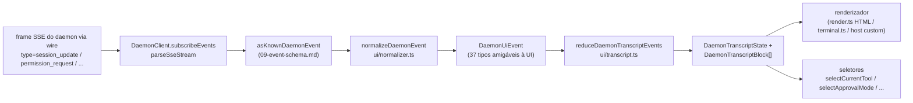

# Camada de Transcrição de UI Compartilhada

> **Status atual**: `packages/cli/src/ui/daemon/daemon-tui-adapter.ts` ainda está presente em `main` como um adaptador CLI experimental legado. Este documento descreve a camada mais recente de transcrição de UI compartilhada do lado do SDK: primitivas reutilizáveis de normalização de eventos do daemon e transcrição que qualquer host de UI pode consumir, incluindo Web, TUI, IDE e canais de IM. As migrações CLI TUI, canal e IDE VS Code são trabalhos futuros.

## Visão Geral

`packages/sdk-typescript/src/daemon/ui/` adiciona um subpacote `ui/*` ao SDK. Ele transforma o fluxo de eventos SSE do daemon em blocos de transcrição renderizáveis por meio de primitivas reutilizáveis:

- **Normalização** (`normalizer.ts`): mapeia os 43 tipos de eventos conhecidos do esquema de fio do daemon (consulte [`09-event-schema.md`](./09-event-schema.md)) em 37 eventos semânticos `DaemonUiEventType` amigáveis à UI, como `assistant.text.delta`, `tool.update` e `session.metadata.changed`.
- **Máquina de estados** (`transcript.ts`, `store.ts`): redutor puro mais armazenamento subscritível que projeta eventos de UI em um array ordenado `DaemonTranscriptBlock[]`.
- **Renderizadores** (`render.ts`, `terminal.ts`, `toolPreview.ts`): blocos de transcrição para HTML, texto de terminal e strings de pré-visualização de ferramentas. Os hosts podem usá-los ou substituí-los.
- **Conformidade** (`conformance.ts`): testes de consistência entre hosts usados quando as superfícies de canal, TUI e IDE migram para essas primitivas.

O primeiro consumidor de produção é **`packages/webui/src/daemon/`** ([#4328](https://github.com/QwenLM/qwen-code/pull/4328)). Seu `DaemonSessionProvider` React e adaptador de transcrição permitem que a UI web se conecte diretamente ao HTTP+SSE do daemon em vez de apenas renderizar tráfego `postMessage` do host. CLI TUI, base de canal e IDE VS Code podem reutilizar a mesma camada posteriormente; [`../daemon-ui/MIGRATION.md`](../daemon-ui/MIGRATION.md) documenta o guia de migração incremental v2.

## Responsabilidades

- Normalizar os 43 eventos de fio do daemon em um vocabulário de UI estável (`DaemonUiEventType`) para que os renderizadores não inspecionem `rawEvent.data`.
- Manter o `eventId` SSE monotônico do daemon como a **chave de ordenação primária** para que diferentes clientes renderizem transcrições na mesma ordem.
- Usar um redutor puro para produzir blocos de transcrição, com seletores para permissões pendentes, ferramenta atual, modo de aprovação, progresso da ferramenta e filhos do subagente.
- Fornecer renderizadores HTML e de terminal de base, permitindo renderização específica do host.
- Expor constantes públicas como `DAEMON_PLAN_TOOL_CALL_ID` para painéis de plano.
- Preservar compatibilidade aditiva de fio: tipos de eventos desconhecidos normalizam para `debug` em vez de serem descartados.

## Arquitetura

### Estrutura do pacote

| Arquivo                                          | Exportações                                                                                                                                                        | Propósito                     |
| ------------------------------------------------ | ------------------------------------------------------------------------------------------------------------------------------------------------------------------ | ----------------------------- |
| `packages/sdk-typescript/src/daemon/ui/index.ts` | Barrel do subpacote                                                                                                                                                | Ponto de entrada público      |
| `ui/types.ts`                                    | `DaemonUiEventType`, interfaces `DaemonUiEvent*` por tipo, `DaemonTranscriptBlock`, `DaemonTranscriptState`, `DaemonUiToolProvenance`, `DAEMON_PLAN_TOOL_CALL_ID` | Tipos                         |
| `ui/normalizer.ts`                               | `normalizeDaemonEvent(evt) -> DaemonUiEvent`, `getSessionUpdatePayload(evt)`                                                                                      | Mapeamento fio-para-UI        |
| `ui/transcript.ts`                               | `createDaemonTranscriptState()`, `appendLocalUserTranscriptMessage()`, `reduceDaemonTranscriptEvents()`, `rebuildDaemonTranscriptBlockIndex()`, seletores         | Máquina de estados e seletores|
| `ui/store.ts`                                    | `createDaemonTranscriptStore(initial?)`                                                                                                                           | Armazenamento redutor subscritível |
| `ui/toolPreview.ts`                              | `createDaemonToolPreview(toolEvent)`                                                                                                                              | Texto de resumo de chamada de ferramenta |
| `ui/render.ts`                                   | `DaemonHtmlRenderOptions`, `DaemonRenderOptions`, funções de renderização                                                                                         | Renderização HTML e genérica   |
| `ui/terminal.ts`                                 | Renderização específica de terminal                                                                                                                               | Preparação TUI                |
| `ui/conformance.ts`                              | Suíte de conformidade entre hosts                                                                                                                                 | Testes de paridade de migração|
| `ui/utils.ts`                                    | Helpers como `DaemonUiContentPart`                                                                                                                                | Utilitários internos compartilhados |
### Vocabulário `DaemonUiEventType`

`ui/types.ts` define 37 tipos de eventos de UI, agrupados por domínio.

**Stream de chat (Estágio 1)**

- `user.text.delta`, `user.image.delta`, `user.shell.command`, `assistant.text.delta`, `assistant.done`, `thought.text.delta`
- `tool.update`, `shell.output`, `user.shell.output`
- `permission.request`, `permission.resolved`
- `model.changed`, `status`, `error`, `debug`

**Metadados da sessão**

- `session.metadata.changed`, `session.approval_mode.changed`
- `session.available_commands`, `session.state_resync_required`, `session.replay_complete`

**Ciclo de vida do prompt (cross-client)**

- `prompt.cancelled`, `followup.suggestion`

**Workspace (Wave 3-4)**

- `workspace.memory.changed`, `workspace.agent.changed`
- `workspace.tool.toggled`, `workspace.settings.changed`, `workspace.initialized`
- `workspace.mcp.budget_warning`, `workspace.mcp.child_refused`
- `workspace.mcp.server_restarted`, `workspace.mcp.server_restart_refused`

**Fluxo de autenticação (Wave 4 OAuth)**

- `auth.device_flow.started`, `auth.device_flow.throttled`, `auth.device_flow.authorized`
- `auth.device_flow.failed`, `auth.device_flow.cancelled`

`normalizeDaemonEvent` mapeia os 43 eventos conhecidos do daemon via wire para este vocabulário. Tipos de evento desconhecidos, não modelados ou malformados são normalizados para `debug` e preservam `rawEvent` para diagnósticos do host.

### Redutor e seletores

```ts
// Cria o estado inicial.
const state = createDaemonTranscriptState();

// Aplica uma sequência de eventos SSE.
const next = reduceDaemonTranscriptEvents(state, daemonUiEvents);

// Seletores.
selectTranscriptBlocks(state); // todos os blocos
selectTranscriptBlocksOrderedByEventId(state); // ordenado por eventId; chave preferida
selectPendingPermissionBlocks(state);
selectCurrentTool(state);
selectApprovalMode(state);
selectToolProgress(state, toolCallId);
selectSubagentChildBlocks(state, parentBlockId);
isSubagentChildBlock(block);
formatBlockTimestamp(block);
formatMissedRange(state); // texto "você perdeu X" após state_resync_required
```

### Store

`createDaemonTranscriptStore()` fornece subscribe e dispatch:

```ts
const store = createDaemonTranscriptStore();
store.subscribe(() => render(store.getState()));
store.dispatch(uiEvents); // internamente executa o redutor
```

O `DaemonSessionProvider` da UI web constrói seu contexto React sobre esta store.

## Fluxo

### Evento SSE único de ponta a ponta



Hosts podem parar em `(E)` e implementar seu próprio redutor, ou consumir `(G)` e os seletores fornecidos. A UI web usa o caminho completo `(B) -> (H)`. Um TUI migrado pode consumir `(G)` e renderizar com componentes específicos do Ink.

### `state_resync_required`

`session.state_resync_required` mapeia para um marcador de "intervalo perdido" no transcript. O código da UI pode chamar `formatMissedRange(state)` para renderizar texto como "eventos perdidos X-Y". O redutor **continua aplicando eventos posteriores**, mas marca os blocos afetados com `resyncRecovery: true` para que os renderizadores possam adicionar contexto visual. Veja [`10-event-bus.md`](./10-event-bus.md) para semântica de evicção circular e `state_resync_required`.

## Consumidores

### `packages/webui/src/daemon/`

Isso foi implementado em [#4328](https://github.com/QwenLM/qwen-code/pull/4328).

| Arquivo                       | Exportações                                                                                                                                                                                                                                                                                                                                                                      |
| ----------------------------- | -------------------------------------------------------------------------------------------------------------------------------------------------------------------------------------------------------------------------------------------------------------------------------------------------------------------------------------------------------------------------------- |
| `DaemonSessionProvider.tsx`   | React `<DaemonSessionProvider />`; hooks `useDaemonSession()`, `useDaemonTranscriptStore()`, `useDaemonTranscriptState()`, `useDaemonTranscriptBlocks()`, `useDaemonPendingPermissions()`, `useDaemonActions()`, `useDaemonConnection()`; tipos `DaemonConnectionStatus`, `DaemonConnectionState`, `DaemonSessionContextValue`                                                                   |
| `transcriptAdapter.ts`        | Adapta `DaemonTranscriptBlock` do SDK para `UnifiedMessage` da UI web, incluindo merge de chunks de streaming markdown e resumos de chamadas de ferramenta                                                                                                                                                                                                                       |
| `index.ts`                    | Barrel do subpacote                                                                                                                                                                                                                                                                                                                                                             |
A interface web agora pode se conectar diretamente ao daemon HTTP+SSE e renderizar uma transcrição. O antigo caminho `postMessage` do host `ACPAdapter` permanece disponível.

### Migrações posteriores

O [`../daemon-ui/MIGRATION.md`](../daemon-ui/MIGRATION.md) fornece um guia incremental v2 para adaptadores de chat web e terminal web. Ele explicitamente ressalta que **CLI TUI, base de canal e VS Code IDE não são migrados por aquele PR**; cada um será movido em PRs subsequentes e utilizará a suíte de conformidade para preservar a paridade de renderização.

## Relacionamento com o legado `daemon-tui-adapter.ts`

| Dimensão         | CLI legado `DaemonTuiAdapter`                                   | Nova camada de transcrição compartilhada                        |
| ---------------- | --------------------------------------------------------------- | -------------------------------------------------------------- |
| Pacote           | `packages/cli/src/ui/daemon/`                                   | `packages/sdk-typescript/src/daemon/ui/`                       |
| Superfície pública | `DaemonTuiAdapter`, `DaemonTuiUpdate`, `DaemonTuiSessionClient` | `DaemonUiEventType`, `reduceDaemonTranscriptEvents`, seletores |
| Escopo           | Apenas CLI Ink TUI                                              | Web, TUI, IDE ou UI de IM                                      |
| Forma do estado  | União de atualizações local da TUI                              | Lista de blocos de transcrição pura mais campos de estado      |
| Ordenação        | `createdAt`                                                     | `eventId` (monotônico do daemon, consistente entre clientes)   |
| Tipo de wire desconhecido | Descartado em `reduceDaemonEventToTuiUpdates`            | Normalizado para `debug` e preservado                          |
| Testes           | Testes unitários de pacote único                                | Suíte de conformidade global para paridade entre hosts         |

## Dependências

- Tipos de wire upstream: `packages/sdk-typescript/src/daemon/events.ts` (veja [`09-event-schema.md`](./09-event-schema.md)).
- Consumidor downstream real: `packages/webui/src/daemon/`.
- Alvos de migração posteriores: `packages/cli/src/ui/`, `packages/channels/base/` e `packages/vscode-ide-companion/src/services/daemonIdeConnection.ts`.
- Referências paralelas: [`../daemon-ui/README.md`](../daemon-ui/README.md), [`../daemon-ui/MIGRATION.md`](../daemon-ui/MIGRATION.md) e [`../daemon-client-adapters/web-ui.md`](../daemon-client-adapters/web-ui.md).

## Configuração

- Nenhuma configuração em tempo de execução. Redutores e seletores são funções puras.
- Os hosts escolhem seu renderizador: HTML (`render.ts`), terminal (`terminal.ts`) ou renderização customizada.
- Para depuração, `render.ts` suporta `includeRawEvent: true` para incluir o quadro de wire bruto na saída renderizada.

## Advertências e limites conhecidos

- **`daemon-tui-adapter.ts` ainda existe**. É o adaptador experimental legado do pacote CLI. O novo código deve preferir o SDK `ui/*`: `normalizeDaemonEvent`, `reduceDaemonTranscriptEvents` e `DaemonTranscriptBlock`.
- **CLI TUI, base de canal e VS Code IDE ainda não foram migrados**. Eles ainda mantêm sua própria lógica de renderização. O diretório `docs/developers/daemon-client-adapters/` ainda contém `ide.md`, `channel-web.md` e o rascunho histórico `tui.md`; o mais novo `web-ui.md` cobre o design do adaptador de interface web.
- **`eventId` é a chave de ordenação primária**. `createdAt` permanece como um alias obsoleto (`clientReceivedAt`). O novo código deve usar `selectTranscriptBlocksOrderedByEventId(state)`. O `MIGRATION.md` mostra o diff de código para migrar da ordenação por `createdAt` para ordenação por `eventId`.
- **Tipos de wire desconhecidos são normalizados para `debug`**. Eles não são mais descartados como no adaptador antigo. Os renderizadores não mostram `debug` por padrão; os hosts devem optar por exibi-lo.
- **Tamanho do bundle**: o subpacote `ui/*` é exportado como um subcaminho ESM através de `@qwen-code/sdk/daemon` e não inclui dependências React ou DOM. A integração React é carregada apenas quando um consumidor de interface web usa `DaemonSessionProvider`.

## Referências

- `packages/sdk-typescript/src/daemon/ui/types.ts` (vocabulário `DaemonUiEventType`)
- `packages/sdk-typescript/src/daemon/ui/transcript.ts` (redutor e seletores)
- `packages/sdk-typescript/src/daemon/ui/normalizer.ts` (mapeamento de wire para UI)
- `packages/sdk-typescript/src/daemon/ui/store.ts`, `render.ts`, `terminal.ts`, `toolPreview.ts`, `conformance.ts`
- `packages/sdk-typescript/src/daemon/index.ts` (bloco de re-exportação `ui/*`)
- `packages/webui/src/daemon/DaemonSessionProvider.tsx`, `transcriptAdapter.ts`
- Documentação upstream: [`../daemon-ui/README.md`](../daemon-ui/README.md), [`../daemon-ui/MIGRATION.md`](../daemon-ui/MIGRATION.md), [`../daemon-client-adapters/web-ui.md`](../daemon-client-adapters/web-ui.md)
- PRs de contexto: [#4328](https://github.com/QwenLM/qwen-code/pull/4328) (camada de transcrição v1 e provedor de interface web), [#4353](https://github.com/QwenLM/qwen-code/pull/4353) (acompanhamento de completude unificada v2)
