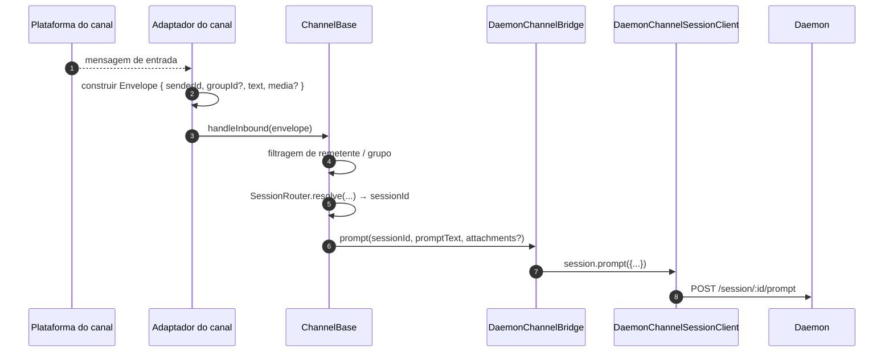
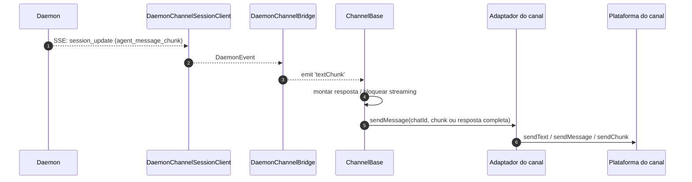
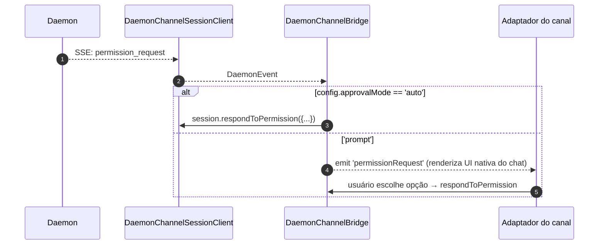

# Adaptadores de Canais

## Visão Geral

`packages/channels/` contém os **adaptadores de canais de IM** que transformam uma mensagem recebida de uma plataforma de chat em um prompt para o daemon e os eventos de saída do daemon em mensagens da plataforma de chat. Quatro canais concretos são fornecidos atualmente: DingTalk, WeChat (Weixin), Telegram e Feishu. Eles compartilham uma camada base (`packages/channels/base/`) mais um `DaemonChannelBridge` que lida com multiplexação de sessões e consumo de SSE.

Cada canal mapeia o tráfego de chat recebido para sessões do daemon sob um `SessionScope` configurável (`user`, `thread` ou `single`). O adaptador delega para `DaemonChannelBridge`, que delega para o `DaemonSessionClient` do SDK (veja [`13-sdk-daemon-client.md`](./13-sdk-daemon-client.md)).

## Responsabilidades

- Receber mensagens recebidas do transporte nativo do canal (stream WebSocket do DingTalk, long-poll HTTP do WeChat, long-poll do Bot do Telegram, WebSocket ou webhook HTTP do Feishu).
- Resolver `(senderId, groupId?)` em uma sessão do daemon via `DaemonChannelSessionFactory`.
- Encaminhar a mensagem do usuário como um prompt do daemon e transmitir a resposta de volta como mensagens de chat de saída, possivelmente fragmentadas.
- Renderizar requisições de permissão como prompts nativos do chat quando interativo; caso contrário, aprovar automaticamente de acordo com `ChannelConfig.approvalMode`.
- Aplicar restrições de remetente (listas de permissão / listas de bloqueio), restrições de grupo e normalização de conteúdo (markdown / HTML por canal).

## Arquitetura

### `DaemonChannelBridge` (base compartilhada, `packages/channels/base/src/DaemonChannelBridge.ts`)

```ts
class DaemonChannelBridge extends EventEmitter {
  constructor(opts: {
    cwd: string;
    sessionFactory: DaemonChannelSessionFactory;
    modelServiceId?: string;
    sessionScope?: SessionScope;
  });
  newSession(cwd: string): Promise<string>;
  loadSession(sessionId: string, cwd: string): Promise<string>;
  prompt(sessionId: string, text: string, options?): Promise<string>;
  cancelSession(sessionId: string): Promise<void>;
  stop(): void;
}
```

Mantém clientes de sessão do daemon indexados pelo `sessionId` do daemon; `ChannelBase` e `SessionRouter` decidem qual alvo de chat recebido mapeia para essa sessão. Cada sessão anexada possui:

- Um `DaemonChannelSessionClient` (formato de `DaemonSessionClient` menos métodos irrelevantes para canais).
- Uma bomba consumidora de SSE ativa.
- Um montador de prompts com debounce (para adaptadores que fragmentam a entrada do usuário em várias mensagens recebidas).
- Uma política de aprovação automática por requisição.

Eventos emitidos: `textChunk`, `toolCall`, `sessionUpdate`, `permissionRequest`, `permissionResolved`, `modelSwitched`, `modelSwitchFailed`, `sessionDied`, `promptComplete` e `error`. Os adaptadores de canal conectam esses eventos às APIs nativas da plataforma.

### `ChannelBase` (`packages/channels/base/src/ChannelBase.ts`)

Base abstrata que todo adaptador estende:

```ts
abstract class ChannelBase {
  abstract connect(): Promise<void>;
  abstract sendMessage(chatId: string, text: string): Promise<void>;
  abstract disconnect(): void;
  handleInbound(envelope: Envelope): Promise<void>; // → SessionRouter.resolve + bridge.prompt
}
```

Lida com preocupações comuns transversais: restrições de remetente (lista de permissão / lista de bloqueio), restrições de grupo, streaming de blocos de mensagem (tamanho do bloco, limitação), debounce de entrada.

### Adaptadores por canal

| Adaptador       | Arquivo                                               | Transporte                                              | Notas                                                                                                         |
| --------------- | ----------------------------------------------------- | ------------------------------------------------------- | ------------------------------------------------------------------------------------------------------------- |
| DingTalk        | `packages/channels/dingtalk/src/DingtalkAdapter.ts` | Stream WebSocket do DingTalk SDK                          | Envia via POST `sessionWebhook`; imagens de mídia baixadas via API DT, base64 no envelope.                     |
| WeChat (Weixin) | `packages/channels/weixin/src/WeixinAdapter.ts`     | Long-poll HTTP do iLink Bot                                | Envia via API proprietária `sendText` / `sendImage`; indicadores de digitação.                                |
| Telegram        | `packages/channels/telegram/src/TelegramAdapter.ts` | Long-poll da API do Telegram Bot (grammy)                   | Envia blocos HTML via `sendMessage`.                                                                          |
| Feishu          | `packages/channels/feishu/src/FeishuAdapter.ts`     | Stream WebSocket do Feishu/Lark (padrão) ou webhook HTTP | Envia via SDK do Lark como cartões interativos; modo webhook requer `encryptKey` para verificação de assinatura HMAC. |

Cada adaptador implementa:

1. Transporte de entrada (inscrever / consultar mensagens).
2. Construção de envelope (`{ senderId, groupId?, text, media?, raw }`).
3. Restrições de remetente / grupo (delega para `ChannelBase`).
4. Serialização de saída (markdown → HTML / nativo do WeChat / nativo do DingTalk).
5. Ciclo de vida (iniciar / desligar).

### Matriz de adaptadores
| Adaptador                       | Transporte                    | Identidade                                                 | UX de Permissão                          | Configuração de aprovação automática                |
| ------------------------------- | ----------------------------- | ---------------------------------------------------------- | ---------------------------------------- | --------------------------------------------------- |
| **DingTalk**                    | Stream WebSocket              | `senderStaffId` (+ opcional `conversationId` para grupos)  | Botões inline via markdown do DT        | `ChannelConfig.approvalMode = 'auto' \| 'prompt'`  |
| **WeChat**                      | Long-poll HTTP                | `senderWxid` (+ opcional `groupWxid`)                     | Apenas prompts textuais com tokens de resposta | Mesmo                                              |
| **Telegram**                    | Long-poll da Bot API          | `from.id` (+ opcional `chat.id` para grupos)             | Botões de teclado inline                 | Mesmo                                              |
| **Feishu**                      | Stream WebSocket / webhook HTTP | `sender.open_id` (+ opcional `chat_id` para grupos)      | Botões de cartão interativos             | Mesmo                                              |

> **Nota:** A coluna "UX de Permissão" descreve os recursos nativos de cada plataforma, mas nenhum está configurado ainda — `AcpBridge.requestPermission` atualmente aprova automaticamente todas as solicitações (`packages/channels/base/src/AcpBridge.ts`), e `ChannelConfig.approvalMode` está declarado, mas ainda não é lido. A aprovação interativa está planejada (Fase 5).

## Fluxo de trabalho

### Prompt de entrada



### Saída orientada por SSE



### Aprovação automática de permissão



## Estado & Ciclo de vida

- `DaemonChannelBridge` vive durante todo o tempo de vida do adaptador de canal; as sessões dentro dela vivem de acordo com o `SessionScope` configurado.
- Cada sessão ativa reconecta automaticamente se a SSE cair — `DaemonSessionClient.events()` rastreia `lastSeenEventId` para que a repetição seja correta.
- `shutdown()` fecha cada sessão ativa e o transporte subjacente (WebSocket / long-poll do canal).
- O stream WebSocket do DingTalk suporta push do servidor; o long-poll do WeChat exige uma estratégia de backoff em respostas ociosas; o long-poll do Telegram tem um parâmetro `timeout` embutido.

## Dependências

- `packages/channels/base/` — `ChannelBase`, `DaemonChannelBridge`, `types.ts` (`ChannelConfig`, `Envelope`, `SessionScope`, `ChannelPlugin`).
- `packages/sdk-typescript/src/daemon/` — `DaemonSessionClient` e afins.
- SDKs específicos de cada canal: `@dingtalk/stream` (DingTalk), iLink Bot HTTP proprietário (Weixin), `grammy` (Telegram).

## Configuração

`ChannelConfig` (de `packages/channels/base/src/types.ts`):

| Parâmetro                               | Efeito                                                                                                   |
| --------------------------------------- | -------------------------------------------------------------------------------------------------------- |
| `sessionScope`                          | `'user'` (remetente + chat), `'thread'` (ID da thread ou chat) ou `'single'` (uma sessão compartilhada por canal). |
| `approvalMode`                          | `'auto'` (responder automaticamente) / `'prompt'` (renderizar UI).                                      |
| `allowlist?: string[]`                  | IDs de remetentes permitidos; ausente = aberto.                                                          |
| `denylist?: string[]`                   | IDs de remetentes negados.                                                                               |
| `chunkSize`, `chunkIntervalMs`          | Configurações de streaming de blocos de saída.                                                           |
| `daemon: { baseUrl, token?, clientId? }`| Encaminhado para `DaemonChannelSessionFactory`.                                                          |
Camada de chaves específicas de canal sobreposta (DingTalk: `streamCredentials`; WeChat: `ilinkUrl`, `botId`; Telegram: `botToken`; Feishu: `clientId` (appId), `clientSecret` (appSecret), `verificationToken`, `encryptKey` (modo webhook)).

## Ressalvas e Limitações Conhecidas

- **Os canais não importam diretamente o `@qwen-code/sdk`.** Eles passam por `ChannelBase` → `DaemonChannelBridge` → `DaemonChannelSessionClient` (que a ponte constrói a partir do SDK). Essa indireção permite que a ponte troque de implementações, como um stub de teste, sem exigir alterações no canal.
- **A experiência do usuário de permissão é por canal.** DingTalk usa botões markdown; WeChat é somente texto; Telegram usa teclados inline; Feishu usa botões interativos em cartões. (Atualmente todos aprovam automaticamente via `AcpBridge`; aprovação interativa está planejada.) Ainda não há uma abstração comum de "widget de permissão interativa".
- **A aprovação automática é uma decisão do lado da implantação**, não do lado do daemon. A política `permission_mediation` do daemon ainda se aplica; aprovação automática significa apenas que o canal responde sem solicitar a intervenção humana. Não combine `auto` com fluxos de trabalho de grau `enforce`.
- **Limites de taxa / limites de tamanho de mensagem por canal são responsabilidade do adaptador.** O `DaemonChannelBridge` apenas lida com a fragmentação; ultrapassar o limite por mensagem do WeChat ou o limite de inundação do Telegram é por conta do adaptador.
- **Sem chamada reversa DingTalk / WeChat / Telegram / Feishu** — os canais são unidirecionais (chat → daemon → chat). O caminho de push nativo da plataforma de mensagens, como um callback de cartão do DingTalk, ainda não está conectado à ponte.

## Referências

- `packages/channels/base/src/DaemonChannelBridge.ts`
- `packages/channels/base/src/ChannelBase.ts`
- `packages/channels/base/src/types.ts`
- `packages/channels/dingtalk/src/DingtalkAdapter.ts`
- `packages/channels/weixin/src/WeixinAdapter.ts`
- `packages/channels/telegram/src/TelegramAdapter.ts`
- `packages/channels/plugin-example/` (esqueleto de plugin de referência)
- Guia de plugin de canal: [`../channel-plugins.md`](../channel-plugins.md).
- Referência do SDK: [`13-sdk-daemon-client.md`](./13-sdk-daemon-client.md).
