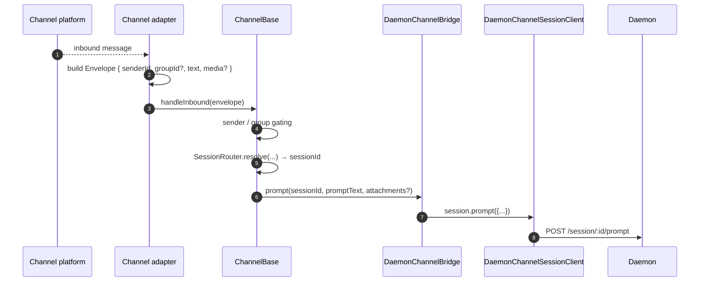
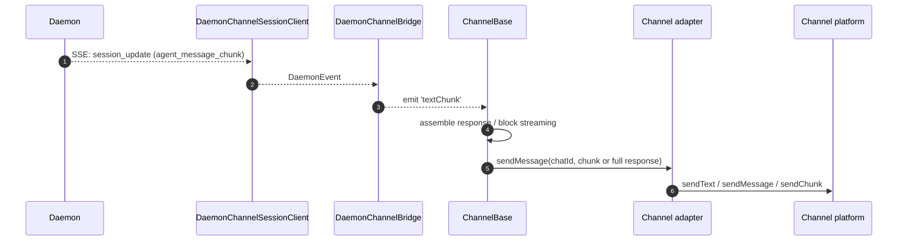
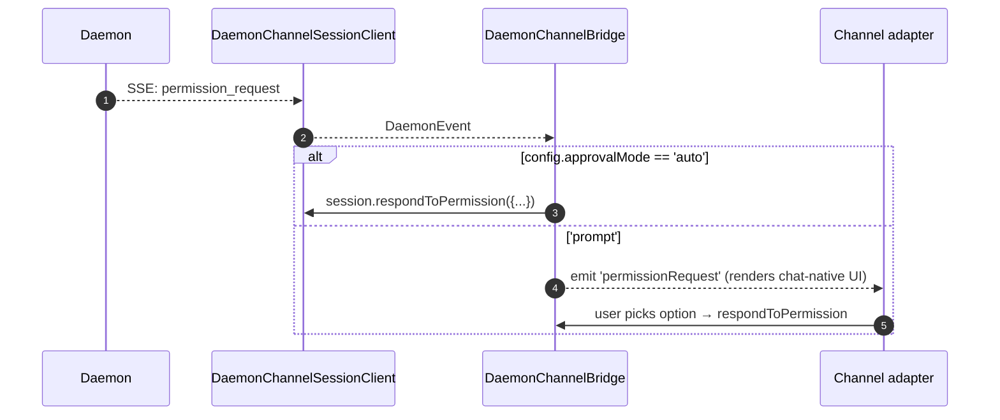

# Adaptadores de Canal

## Visão Geral

`packages/channels/` contém os **adaptadores de canal de IM** que transformam uma mensagem recebida de uma plataforma de chat em um prompt do daemon e os eventos enviados pelo daemon em mensagens da plataforma de chat. Hoje, quatro canais concretos são fornecidos: DingTalk, WeChat (Weixin), Telegram e Feishu. Eles compartilham uma camada base (`packages/channels/base/`) mais um `DaemonChannelBridge` que gerencia multiplexação de sessão e consumo de SSE.

Cada canal mapeia o tráfego de chat de entrada para sessões do daemon sob um `SessionScope` configurável (`user`, `thread` ou `single`). O adaptador delega para `DaemonChannelBridge`, que delega para o `DaemonSessionClient` do SDK (veja [`13-sdk-daemon-client.md`](./13-sdk-daemon-client.md)).

## Responsabilidades

- Receber mensagens de entrada do transporte nativo do canal (WebSocket do DingTalk Stream, long-poll HTTP do WeChat, long-poll do Telegram Bot, WebSocket do Feishu ou webhook HTTP).
- Resolver `(senderId, groupId?)` em uma sessão do daemon via `DaemonChannelSessionFactory`.
- Encaminhar a mensagem do usuário como um prompt do daemon e transmitir a resposta de volta como mensagens de chat de saída, possivelmente fragmentadas.
- Renderizar solicitações de permissão como prompts nativos do chat quando interativo; caso contrário, aprovar automaticamente de acordo com `ChannelConfig.approvalMode`.
- Aplicar bloqueio de remetente (listas de permissão / bloqueio), bloqueio de grupo e normalização de conteúdo (markdown / HTML por canal).

## Arquitetura

### `DaemonChannelBridge` (base compartilhada, `packages/channels/base/src/DaemonChannelBridge.ts`)

```ts
class DaemonChannelBridge extends EventEmitter {
  constructor(opts: {
    cwd: string;
    sessionFactory: DaemonChannelSessionFactory;
    modelServiceId?: string;
    sessionScope?: SessionScope;
  });
  newSession(cwd: string): Promise<string>;
  loadSession(sessionId: string, cwd: string): Promise<string>;
  prompt(sessionId: string, text: string, options?): Promise<string>;
  cancelSession(sessionId: string): Promise<void>;
  stop(): void;
}
```

Mantém clientes de sessão do daemon indexados pelo `sessionId` do daemon; `ChannelBase` e `SessionRouter` decidem qual destino de chat de entrada mapeia para essa sessão. Cada sessão anexada possui:

- Um `DaemonChannelSessionClient` (forma de `DaemonSessionClient` sem métodos irrelevantes para o canal).
- Uma bomba de consumo de SSE ativa.
- Um montador de prompt com debounce (para adaptadores que fragmentam a entrada do usuário em várias mensagens de entrada).
- Uma política de aprovação automática por solicitação.

Eventos emitidos: `textChunk`, `toolCall`, `sessionUpdate`, `permissionRequest`, `permissionResolved`, `modelSwitched`, `modelSwitchFailed`, `sessionDied`, `promptComplete` e `error`. Os adaptadores de canal conectam esses eventos às APIs nativas da plataforma.

### `ChannelBase` (`packages/channels/base/src/ChannelBase.ts`)

Classe base abstrata que todo adaptador estende:

```ts
abstract class ChannelBase {
  abstract connect(): Promise<void>;
  abstract sendMessage(chatId: string, text: string): Promise<void>;
  abstract disconnect(): void;
  handleInbound(envelope: Envelope): Promise<void>; // → SessionRouter.resolve + bridge.prompt
}
```

Trata preocupações comuns e transversais: bloqueio de remetente (lista de permissão / bloqueio), bloqueio de grupo, streaming de blocos de mensagem (tamanho do bloco, limitação de taxa), debounce de entrada.

### Adaptadores por canal

| Adaptador | Arquivo                                               | Transporte                                              | Observações                                                                                                      |
| --------- | ----------------------------------------------------- | ------------------------------------------------------- | ---------------------------------------------------------------------------------------------------------------- |
| DingTalk  | `packages/channels/dingtalk/src/DingtalkAdapter.ts` | DingTalk Stream SDK WebSocket                           | Envia via POST `sessionWebhook`; imagens de mídia baixadas via API do DingTalk, base64 no envelope.               |
| WeChat (Weixin) | `packages/channels/weixin/src/WeixinAdapter.ts`     | iLink Bot HTTP long-poll                               | Envia via API proprietária `sendText` / `sendImage`; indicadores de digitação.                                   |
| Telegram  | `packages/channels/telegram/src/TelegramAdapter.ts` | Telegram Bot API long-poll (grammy)                     | Envia blocos HTML via `sendMessage`.                                                                             |
| Feishu    | `packages/channels/feishu/src/FeishuAdapter.ts`     | WebSocket do Feishu/Lark Stream (padrão) ou webhook HTTP | Envia via SDK do Lark como cartões interativos; modo webhook requer `encryptKey` para verificação de assinatura HMAC. |

Cada adaptador implementa:

1. Transporte de entrada (inscrever / consultar mensagens).
2. Construção de envelope (`{ senderId, groupId?, text, media?, raw }`).
3. Bloqueio de remetente / grupo (delega para `ChannelBase`).
4. Serialização de saída (markdown → HTML / nativo do WeChat / nativo do DingTalk).
5. Ciclo de vida (iniciar / desligar).

### Matriz de adaptadores

| Adaptador   | Transporte                     | Identidade                                                | UX de permissão                           | Configuração de aprovação automática                       |
| ----------- | ------------------------------ | --------------------------------------------------------- | ----------------------------------------- | ---------------------------------------------------------- |
| **DingTalk**| WebSocket stream                | `senderStaffId` (+ opcional `conversationId` para grupos) | Botões inline via markdown do DingTalk    | `ChannelConfig.approvalMode = 'auto' \| 'prompt'`          |
| **WeChat**  | HTTP long-poll                  | `senderWxid` (+ opcional `groupWxid`)                     | Prompts somente texto com tokens de resposta | O mesmo                                                |
| **Telegram**| Bot API long-poll               | `from.id` (+ opcional `chat.id` para grupos)              | Botões de teclado inline                  | O mesmo                                                |
| **Feishu**  | WebSocket stream / HTTP webhook | `sender.open_id` (+ opcional `chat_id` para grupos)       | Botões de cartão interativo               | O mesmo                                                |

> **Nota:** A coluna "UX de permissão" descreve a capacidade nativa de cada plataforma, mas nenhuma está implementada ainda — `AcpBridge.requestPermission` atualmente aprova automaticamente todas as solicitações (`packages/channels/base/src/AcpBridge.ts`), e `ChannelConfig.approvalMode` está declarado, mas ainda não é lido. A aprovação interativa está planejada (Fase 5).

## Fluxo de Trabalho

### Prompt de entrada



### Saída orientada por SSE



### Aprovação automática de permissão



## Estado e Ciclo de Vida

- `DaemonChannelBridge` vive durante toda a vida do adaptador de canal; as sessões dentro dele vivem de acordo com o `SessionScope` configurado.
- Cada sessão ativa reconecta automaticamente se a SSE cair — `DaemonSessionClient.events()` rastreia `lastSeenEventId` para que a reprodução seja correta.
- `shutdown()` fecha cada sessão ativa e o transporte subjacente (WebSocket / long-poll do canal).
- O WebSocket do DingTalk suporta push do servidor; o long-poll do WeChat requer uma estratégia de backoff em respostas ociosas; o long-poll do Telegram possui um parâmetro `timeout` embutido.

## Dependências

- `packages/channels/base/` — `ChannelBase`, `DaemonChannelBridge`, `types.ts` (`ChannelConfig`, `Envelope`, `SessionScope`, `ChannelPlugin`).
- `packages/sdk-typescript/src/daemon/` — `DaemonSessionClient` e afins.
- SDKs por canal: `@dingtalk/stream` (DingTalk), iLink Bot HTTP proprietário (Weixin), `grammy` (Telegram).

## Configuração

`ChannelConfig` (de `packages/channels/base/src/types.ts`):

| Opção                                   | Efeito                                                                                                  |
| --------------------------------------- | ------------------------------------------------------------------------------------------------------- |
| `sessionScope`                          | `'user'` (remetente + chat), `'thread'` (id do tópico ou chat), ou `'single'` (uma sessão compartilhada por canal). |
| `approvalMode`                          | `'auto'` (responder automaticamente) / `'prompt'` (renderizar UI).                                      |
| `allowlist?: string[]`                  | IDs de remetente permitidos; ausente significa aberto.                                                  |
| `denylist?: string[]`                   | IDs de remetente negados.                                                                               |
| `chunkSize`, `chunkIntervalMs`          | Configurações de streaming de blocos de saída.                                                          |
| `daemon: { baseUrl, token?, clientId? }`| Repassado para `DaemonChannelSessionFactory`.                                                           |

As chaves específicas de canal são adicionadas (DingTalk: `streamCredentials`; WeChat: `ilinkUrl`, `botId`; Telegram: `botToken`; Feishu: `clientId` (appId), `clientSecret` (appSecret), `verificationToken`, `encryptKey` (modo webhook)).

## Advertências e Limitações Conhecidas

- **Canais não importam diretamente `@qwen-code/sdk`.** Eles passam por `ChannelBase` → `DaemonChannelBridge` → `DaemonChannelSessionClient` (que a bridge constrói a partir do SDK). A indireção permite que a bridge troque implementações, como um stub de teste, sem exigir alterações no canal.
- **A UX de permissão é específica por canal.** DingTalk usa botões markdown; WeChat é somente texto; Telegram usa teclados inline; Feishu usa botões de cartão interativo. (Atualmente, todos aprovam automaticamente via `AcpBridge`; aprovação interativa está planejada.) Ainda não existe uma abstração comum de "widget de permissão interativa".
- **A aprovação automática é uma decisão do lado da implantação**, não do lado do daemon. A política `permission_mediation` do daemon ainda se aplica; aprovação automática significa apenas que o canal responde sem solicitar ao humano. Não combine `auto` com fluxos de trabalho de grau `enforce`.
- **Limites de taxa / limites de tamanho de mensagem por canal são responsabilidade do adaptador.** `DaemonChannelBridge` lida apenas com fragmentação; ultrapassar o tamanho por mensagem do WeChat ou o limite de flood do Telegram é responsabilidade do adaptador.
- **Sem chamada reversa do DingTalk / WeChat / Telegram / Feishu** — os canais são unidirecionais (chat → daemon → chat). O caminho de push nativo da plataforma de IM, como um callback de cartão do DingTalk, ainda não está conectado à bridge.

## Referências

- `packages/channels/base/src/DaemonChannelBridge.ts`
- `packages/channels/base/src/ChannelBase.ts`
- `packages/channels/base/src/types.ts`
- `packages/channels/dingtalk/src/DingtalkAdapter.ts`
- `packages/channels/weixin/src/WeixinAdapter.ts`
- `packages/channels/telegram/src/TelegramAdapter.ts`
- `packages/channels/plugin-example/` (scaffold de plugin de referência)
- Guia de plugins de canal: [`../channel-plugins.md`](../channel-plugins.md).
- Referência do SDK: [`13-sdk-daemon-client.md`](./13-sdk-daemon-client.md).