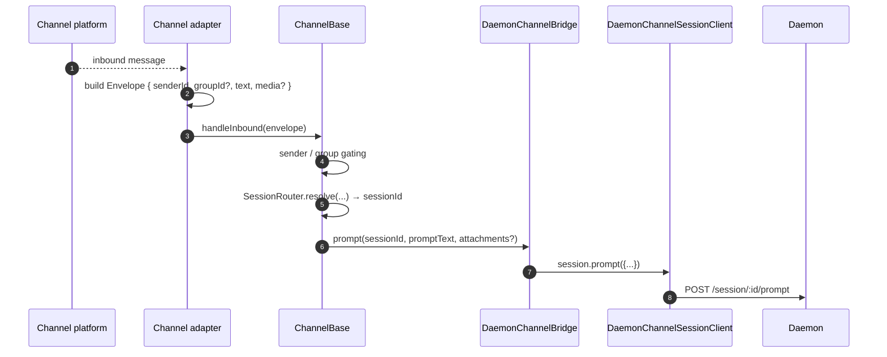
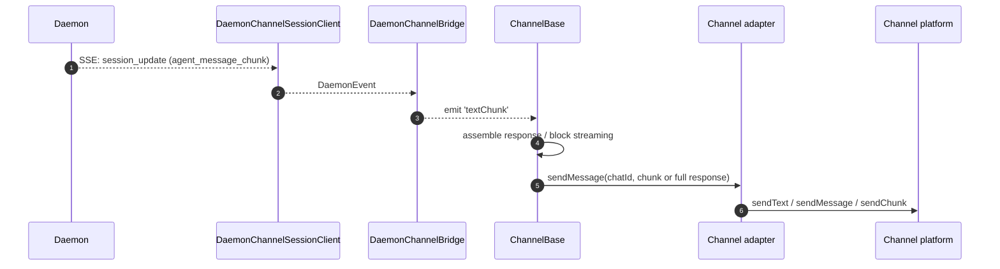
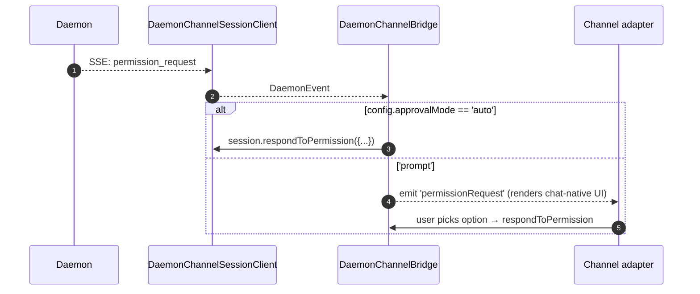

# Adaptadores de Canal

## Visão Geral

`packages/channels/` contém os **adaptadores de canal de IM** que transformam a mensagem recebida de uma plataforma de chat em um prompt para o agente e enviam a resposta do agente de volta para a plataforma de chat. Quatro canais concretos são distribuídos atualmente: DingTalk, WeChat (Weixin), Telegram e Feishu. Eles compartilham uma camada base (`packages/channels/base/`) e um contrato `ChannelAgentBridge` voltado para os adaptadores.

Existem dois modos de host atuais:

- `qwen channel start [name]` é o serviço de canal independente com suporte a ACP. Ele passa aos adaptadores uma implementação `AcpBridge` de `ChannelAgentBridge`.
- `qwen serve --channel <name>` e `qwen serve --channel all` são modos experimentais gerenciados por daemon. As seleções nomeadas são agrupadas por workspace proprietário e o `qwen serve` inicia um worker fora do processo por runtime proprietário; cada worker se conecta ao daemon através do SDK e os adaptadores recebem uma fachada `ChannelAgentBridge` com suporte de `DaemonChannelBridge`. `--channel all` continua sendo uma seleção apenas do primário.

No modo gerenciado por daemon, cada canal mapeia o tráfego de chat recebido para sessões do daemon sob um `SessionScope` configurável (`user`, `chat_thread` ou `single`). O valor legado `thread` do Channel permanece legível e editável para configurações existentes, mas novas configurações do Web Shell não o oferecem; isso é separado do próprio controle de criação de sessão `single`/`thread` da bridge do daemon. O adaptador delega para o `DaemonChannelBridge`, que por sua vez delega para o `DaemonSessionClient` do SDK (consulte [`13-sdk-daemon-client.md`](./13-sdk-daemon-client.md)). Cada canal nomeado deve resolver para um workspace registrado e confiável. O worker usa o cwd canônico desse runtime, `QWEN_DAEMON_WORKSPACE` e a sobreposição de ambiente; a resolução de propriedade nunca faz fallback para o primário.

### Tarefas de canal disparadas por webhook

Tarefas disparadas por webhook são hospedadas pelo `qwen serve` e executadas dentro do worker de canal gerenciado pelo daemon. A rota HTTP valida a origem e encaminha um `ChannelWebhookTask` para o worker via IPC. O worker chama `ChannelBase.runWebhookTask()`, então os adaptadores não implementam parsing de webhook.

Os adaptadores ainda participam através do suporte a envio proativo: `supportsProactiveSend()` informa ao host se um canal pode enviar sem uma mensagem recebida, `supportsProactiveTarget()` trata limites de entrega para formatos de alvo específicos, e `pushProactive()` carrega o conteúdo de saída.

## Responsabilidades

- Receber mensagens recebidas do transporte nativo do canal (stream WebSocket do DingTalk, long-poll HTTP do WeChat, long-poll do Telegram Bot, WebSocket ou webhook HTTP do Feishu).
- Resolver `(senderId, groupId?)` em uma sessão do daemon via `DaemonChannelSessionFactory`.
- Encaminhar a mensagem do usuário como um prompt do daemon e transmitir a resposta de volta como mensagens de chat de saída, possivelmente em chunks.
- Renderizar solicitações de permissão como prompts nativos do chat quando interativas; caso contrário, aprovar automaticamente de acordo com `ChannelConfig.approvalMode`.
- Aplicar filtragem de remetente (allowlists / denylists), filtragem de grupo e normalização de conteúdo (markdown / HTML por canal).

## Arquitetura

### `DaemonChannelBridge` (base compartilhada, `packages/channels/base/src/DaemonChannelBridge.ts`)

```ts
class DaemonChannelBridge extends EventEmitter {
  constructor(opts: {
    cwd: string;
    sessionFactory: DaemonChannelSessionFactory;
    modelServiceId?: string;
    sessionScope?: SessionScope;
  });
  newSession(cwd: string): Promise<string>;
  loadSession(sessionId: string, cwd: string): Promise<string>;
  prompt(sessionId: string, text: string, options?): Promise<string>;
  cancelSession(sessionId: string): Promise<void>;
  stop(): void;
}
```

Mantém clientes de sessão do daemon indexados pelo `sessionId` do daemon; `ChannelBase` e `SessionRouter` decidem qual alvo de chat recebido mapeia para essa sessão. Cada sessão anexada tem:

- Um `DaemonChannelSessionClient` (formato de `DaemonSessionClient` sem os métodos irrelevantes para o canal).
- Um pump consumidor de SSE ao vivo.
- Um montador de prompt com debounce (para adaptadores que fragmentam a entrada do usuário em várias mensagens recebidas).
- Uma política de aprovação automática por solicitação.

Eventos emitidos: `textChunk`, `toolCall`, `sessionUpdate`, `permissionRequest`, `permissionResolved`, `modelSwitched`, `modelSwitchFailed`, `sessionDied`, `promptComplete` e `error`. Os adaptadores de canal conectam esses eventos a APIs nativas da plataforma.

### `ChannelBase` (`packages/channels/base/src/ChannelBase.ts`)

Classe base abstrata que todo adaptador estende:

```ts
abstract class ChannelBase {
  abstract connect(): Promise<void>;
  abstract sendMessage(chatId: string, text: string): Promise<void>;
  abstract disconnect(): void;
  handleInbound(envelope: Envelope): Promise<void>; // → SessionRouter.resolve + bridge.prompt
}
```

Toda entrega interna de mensagens passa por `sendThreadMessage(chatId, threadId, text)`. A implementação padrão delega para `sendMessage(chatId, text)`, ignorando `threadId` — adaptadores de IM não são afetados. Adaptadores de polling (ex.: GitHub) sobrescrevem `sendThreadMessage` para postar comentários em uma issue/PR específica usando o `threadId`.

Lida com preocupações transversais comuns: filtragem de remetente (allowlist / denylist), filtragem de grupo, streaming de blocos de mensagens (tamanho do chunk, limitação de taxa), debounce de entrada.

### Adaptadores por canal

| Adaptador       | Arquivo                                             | Transporte                                           | Notas                                                                                                          |
| --------------- | --------------------------------------------------- | ---------------------------------------------------- | -------------------------------------------------------------------------------------------------------------- |
| DingTalk        | `packages/channels/dingtalk/src/DingtalkAdapter.ts` | DingTalk Stream SDK WebSocket                        | Envia via POST `sessionWebhook`; imagens de mídia baixadas via API do DT, base64 no envelope.                  |
| WeChat (Weixin) | `packages/channels/weixin/src/WeixinAdapter.ts`     | iLink Bot HTTP long-poll                             | Envia via API proprietária `sendText` / `sendImage`; indicadores de digitação.                                 |
| Telegram        | `packages/channels/telegram/src/TelegramAdapter.ts` | Telegram Bot API long-poll (grammy)                  | Envia chunks HTML via `sendMessage`.                                                                           |
| Feishu          | `packages/channels/feishu/src/FeishuAdapter.ts`     | Feishu/Lark Stream WebSocket (padrão) ou HTTP webhook| Envia via Lark SDK como cartões interativos; o modo webhook requer `encryptKey` para verificação de assinatura HMAC. |
| GitHub          | `packages/channels/github/src/GithubAdapter.ts`     | GitHub Notifications API polling (`@octokit/rest`)   | Estende `PollingChannelBase`; dedup de janela de comentários baseada em cursor; posta comentários via Issues API. |
| GitLab          | `packages/channels/gitlab/src/GitlabAdapter.ts`     | GitLab Todos API polling (`@gitbeaker/rest`)         | Estende `PollingChannelBase`; despacha `todo.body` diretamente; a config `action_prompt_template` controla filtragem de eventos e renderização de metadados. |

Cada adaptador implementa:

1. Transporte de entrada (subscribe / poll para mensagens).
2. Construção do envelope (`{ senderId, groupId?, text, media?, raw }`).
3. Filtragem de remetente / grupo (delega para `ChannelBase`).
4. Serialização de saída (markdown → HTML / nativo do WeChat / nativo do DingTalk).
5. Ciclo de vida (start / shutdown).

### Matriz de adaptadores

| Adaptador    | Transporte                      | Identidade                                             | UX de Permissão                   | Configuração de aprovação automática            |
| ------------ | ------------------------------- | ------------------------------------------------------ | --------------------------------- | ----------------------------------------------- |
| **DingTalk** | WebSocket stream                | `senderStaffId` (+ `conversationId` opcional para grupos) | Botões inline via markdown do DT  | `ChannelConfig.approvalMode = 'auto' \| 'prompt'` |
| **WeChat**   | HTTP long-poll                  | `senderWxid` (+ `groupWxid` opcional)                  | Prompts apenas de texto com tokens de resposta | Mesma                                           |
| **Telegram** | Bot API long-poll               | `from.id` (+ `chat.id` opcional para grupos)           | Botões de teclado inline          | Mesma                                           |
| **Feishu**   | WebSocket stream / HTTP webhook | `sender.open_id` (+ `chat_id` opcional para grupos)    | Botões de cartão interativo       | Mesma                                           |
| **GitHub**   | Notifications API polling       | `user.id` numérico (imutável; login resolvido na conexão) | Comentário de erro + re-mention | `senderPolicy: 'allowlist' \| 'open'`            |
| **GitLab**   | Todos API polling               | `author.username` (minúsculas)                         | Log + re-mention                  | `senderPolicy: 'allowlist' \| 'open'`            |

> **Nota:** A coluna "UX de Permissão" descreve o recurso nativo de cada plataforma, mas nenhuma está conectada ainda — `AcpBridge.requestPermission` atualmente aprova automaticamente todas as solicitações (`packages/channels/base/src/AcpBridge.ts`), e `ChannelConfig.approvalMode` está declarado, mas ainda não é lido. A aprovação interativa está planejada (Fase 5).

## Fluxo de Trabalho

### Prompt de entrada


```mermaid
sequenceDiagram
    autonumber
    participant CH as Channel platform
    participant AD as Channel adapter
    participant CB as ChannelBase
    participant BR as DaemonChannelBridge
    participant SC as DaemonChannelSessionClient
    participant D as Daemon

    CH-->>AD: inbound message
    AD->>AD: build Envelope { senderId, groupId?, text, media? }
    AD->>CB: handleInbound(envelope)
    CB->>CB: sender / group gating
    CB->>CB: SessionRouter.resolve(...) → sessionId
    CB->>BR: prompt(sessionId, promptText, attachments?)
    BR->>SC: session.prompt({...})
    SC->>D: POST /session/:id/prompt
```

### Saída orientada por SSE


```mermaid
sequenceDiagram
    autonumber
    participant D as Daemon
    participant SC as DaemonChannelSessionClient
    participant BR as DaemonChannelBridge
    participant CB as ChannelBase
    participant AD as Channel adapter
    participant CH as Channel platform

    D-->>SC: SSE: session_update (agent_message_chunk)
    SC-->>BR: DaemonEvent
    BR-->>CB: emit 'textChunk'
    CB->>CB: assemble response / block streaming
    CB->>AD: sendMessage(chatId, chunk or full response)
    AD->>CH: sendText / sendMessage / sendChunk
```

### Aprovação automática de permissão


```mermaid
sequenceDiagram
    autonumber
    participant D as Daemon
    participant SC as DaemonChannelSessionClient
    participant BR as DaemonChannelBridge
    participant AD as Channel adapter

    D-->>SC: SSE: permission_request
    SC-->>BR: DaemonEvent
    alt config.approvalMode == 'auto'
        BR->>SC: session.respondToPermission({...})
    else 'prompt'
        BR-->>AD: emit 'permissionRequest' (renders chat-native UI)
        AD->>BR: user picks option → respondToPermission
    end
```

## Estado e Ciclo de Vida

- O `DaemonChannelBridge` vive durante o tempo de vida do adaptador de canal; as sessões dentro dele vivem de acordo com o `SessionScope` configurado.
- Cada sessão ativa reconecta automaticamente se o SSE cair — `DaemonSessionClient.events()` rastreia `lastSeenEventId` para que o replay seja correto.
- `shutdown()` fecha todas as sessões ativas e o transporte subjacente (WebSocket / long-poll do canal).
- O stream WebSocket do DingTalk suporta server-push; o long-poll do WeChat requer uma estratégia de backoff em respostas ociosas; o long-poll do Telegram tem um parâmetro `timeout` embutido.

### Seleção de runtime e recarga de configurações

O `ChannelWorkerManager` de longa duração possui a seleção consolidada do daemon e os supervisores agrupados por workspace. Um daemon pode iniciar sem `--channel`; o primeiro `PUT /workspace/channel` com gate estrito carrega dinamicamente o runtime de canal, reserva o pidfile do serviço, resolve a propriedade do workspace e inicia os workers selecionados. `GET /workspace/channel` lê o snapshot do manager e `DELETE /workspace/channel` o interrompe de forma idempotente. Os helpers do SDK são `getChannelWorkerControl()`, `setChannelWorkerSelection()` e `stopChannelWorker()`; a entrada CLI é `qwen channel set` mais as variantes remotas `status` e `stop`.

O daemon lê as configurações de canal do `settings.json` quando cada worker inicia (`packages/cli/src/commands/channel/daemon-worker.ts` → `loadSettings` → `loadChannelsConfig`). `POST /workspace/channel/reload` relê essas configurações e força a reconciliação da seleção consolidada. Todas as mutações de ciclo de vida compartilham uma única fila FIFO. Grupos de workspace inalterados sobrevivem à substituição ordinária de seleção; grupos alterados param e iniciam sequencialmente enquanto o lease de PID do serve permanece mantido.

Se uma substituição falhar, os workers recém-iniciados são interrompidos e os workers antigos são restaurados antes que a requisição retorne. Um supervisor que não consegue observar a saída após SIGTERM e SIGKILL retém sua referência filha e falha na parada; o manager mantém o lease de PID e nunca inicia um segundo worker. A configuração e o roteamento de webhook mudam apenas quando o commit da seleção é bem-sucedido. As seleções de runtime são locais ao processo e desaparecem na reinicialização do daemon.

Falhas no `connect()` do adaptador são reportadas separamente dos erros de ciclo de vida do worker. O worker envia cada falha delimitada e com credenciais redigidas pelo IPC de startup e aguarda o reconhecimento do supervisor antes de tentar o próximo adaptador. Um worker parcialmente conectado permanece em execução e expõe `startupFailures` em seu snapshot. Se todo adaptador em uma tentativa dinâmica falhar, a resposta `502 channel_worker_start_failed` carrega falhas tentadas anotadas com workspace enquanto `state` reflete o resultado do rollback; respostas GET subsequentes não retêm a tentativa. A inicialização do daemon sem nenhum adaptador conectado continua sendo fail-fast. O `code` opcional do adaptador é apenas diagnóstico, e a `phase` atual é `connect`.

## Dependências

- `packages/channels/base/` — `ChannelBase`, `PollingChannelBase`, `DaemonChannelBridge`, `types.ts` (`ChannelConfig`, `Envelope`, `SessionScope`, `ChannelPlugin`).
- `packages/sdk-typescript/src/daemon/` — `DaemonSessionClient` e relacionados.
- SDKs por canal: `@dingtalk/stream` (DingTalk), HTTP iLink Bot proprietário (Weixin), `grammy` (Telegram), `@octokit/rest` (polling do GitHub), `@gitbeaker/rest` (polling do GitLab).

## Configuração

`ChannelConfig` (de `packages/channels/base/src/types.ts`):

| Parâmetro                                | Efeito                                                                                                      |
| ---------------------------------------- | ----------------------------------------------------------------------------------------------------------- |
| `sessionScope`                           | `'user'` (remetente + chat), `'chat_thread'` (canal + chatId + threadId) ou `'single'` (uma sessão compartilhada por canal). O `'thread'` legado é preservado quando já configurado, mas não é oferecido para novas configurações do Web Shell. |
| `approvalMode`                           | `'auto'` (resposta automática) / `'prompt'` (renderiza UI).                                                 |
| `allowlist?: string[]`                   | IDs de remetente permitidos; ausente = aberto.                                                              |
| `denylist?: string[]`                    | IDs de remetente negados.                                                                                   |
| `chunkSize`, `chunkIntervalMs`           | Configurações de streaming de blocos de saída.                                                              |
| `daemon: { baseUrl, token?, clientId? }` | Encaminhado para `DaemonChannelSessionFactory`.                                                             |

Chaves específicas do canal são adicionadas por cima (DingTalk: `streamCredentials`; WeChat: `ilinkUrl`, `botId`; Telegram: `botToken`; Feishu: `clientId` (appId), `clientSecret` (appSecret), `verificationToken`, `encryptKey` (modo webhook)).

## Ressalvas e Limitações Conhecidas

- **Os canais não importam diretamente `@qwen-code/sdk`.** Eles passam por `ChannelBase` → `DaemonChannelBridge` → `DaemonChannelSessionClient` (que a bridge constrói a partir do SDK). A indireção permite que a bridge troque implementações, como um stub de teste, sem exigir alterações nos canais.
- **A UX de permissão é por canal.** O DingTalk usa botões de markdown; o WeChat é apenas texto; o Telegram usa teclados inline; o Feishu usa botões de cartão interativo. (Todos atualmente aprovam automaticamente via `AcpBridge`; a aprovação interativa está planejada). Ainda não há uma abstração comum de "widget de permissão interativa".
- **A aprovação automática é uma decisão do lado do deployment**, não do lado do daemon. A política `permission_mediation` do daemon ainda se aplica; a aprovação automática significa apenas que o canal responde sem solicitar ao humano. Não combine `auto` com fluxos de grau `enforce`.
- **Os limites de taxa / limites de tamanho de mensagem por canal são responsabilidade do adaptador.** O `DaemonChannelBridge` lida apenas com o chunking; ultrapassar o limite de tamanho por mensagem do WeChat ou o limite de flood do Telegram é responsabilidade do adaptador.
- **Sem reverse-call de DingTalk / WeChat / Telegram / Feishu** — os canais são unidirecionais (chat → daemon → chat). O caminho de push nativo da plataforma de IM, como um callback de cartão do DingTalk, ainda não está conectado à bridge.

## Referências

- `packages/channels/base/src/DaemonChannelBridge.ts`
- `packages/channels/base/src/ChannelBase.ts`
- `packages/channels/base/src/types.ts`
- `packages/cli/src/serve/channel-worker-manager.ts` (ciclo de vida de seleção + serialização)
- `packages/cli/src/serve/channel-worker-group.ts` (reconciliação diferencial por workspace)
- `packages/cli/src/serve/channel-worker-supervisor.ts` (supervisão de processos filhos)
- `packages/cli/src/serve/routes/workspace-channel-control.ts` (recurso GET/PUT/DELETE/reload)
- `packages/channels/dingtalk/src/DingtalkAdapter.ts`
- `packages/channels/weixin/src/WeixinAdapter.ts`
- `packages/channels/telegram/src/TelegramAdapter.ts`
- `packages/channels/plugin-example/` (scaffold de plugin de referência)
- Guia de plugin de canal: [`../channel-plugins.md`](../channel-plugins.md).
- Referência do SDK: [`13-sdk-daemon-client.md`](./13-sdk-daemon-client.md).
