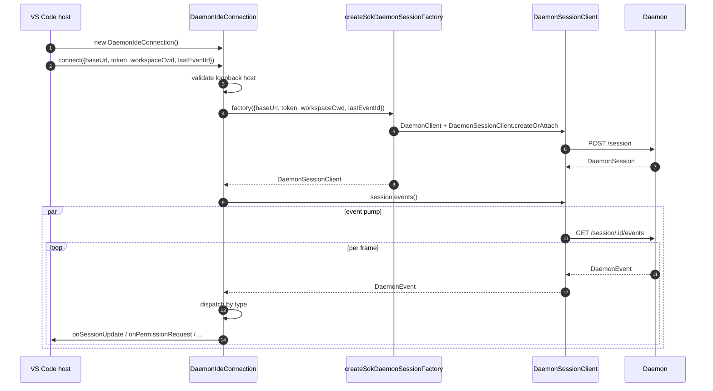
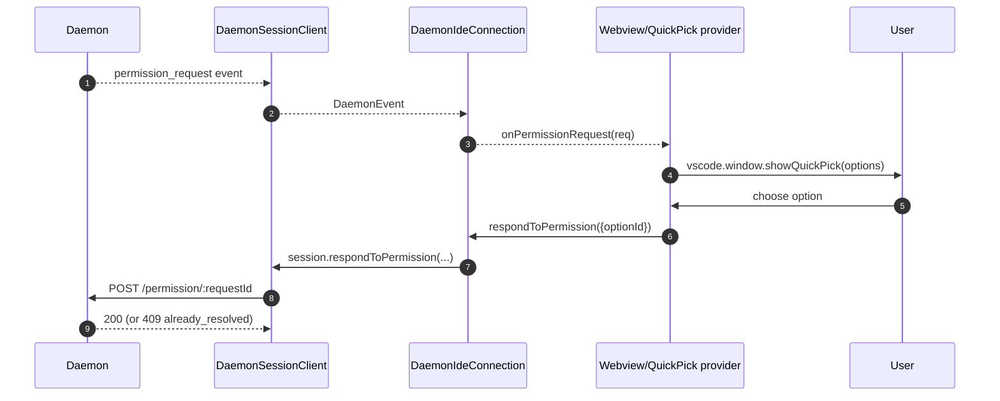
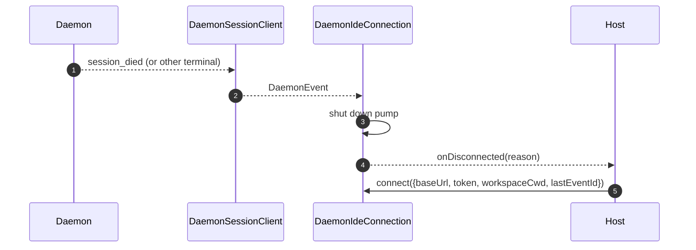

# Adaptador do Daemon para a IDE VS Code

## Visão Geral

`packages/vscode-ide-companion/src/services/daemonIdeConnection.ts` é o **adaptador do daemon para a extensão VS Code**. Ele permite que o companheiro da IDE se conecte a um daemon `qwen serve` em execução via HTTP + SSE, em vez de iniciar um processo filho `qwen --acp` stdio (o caminho legado `AcpConnectionState`). É o equivalente de transporte irmão de [`14-cli-tui-adapter.md`](./14-cli-tui-adapter.md) para hosts VS Code.

O webview de chat da IDE consome eventos do daemon através deste adaptador; as solicitações de permissão são exibidas como diálogos nativos de seleção rápida do VS Code.

## Responsabilidades

- Construir um `DaemonClient` + `DaemonSessionClient` a partir de uma `baseUrl` validada como loopback fornecida a `connect(options)`.
- Bombear eventos SSE do cliente de sessão para um despacho por callback (`onSessionUpdate`, `onPermissionRequest`, `onAskUserQuestion`, `onEndTurn`, `onDisconnected`).
- Aplicar uma invariante **somente loopback** em `connect(options)` (a IDE deve se conectar apenas a um daemon no mesmo host).
- Pontear eventos do daemon para `postMessage`s do webview, para que o painel de chat permaneça sincronizado.
- Expor solicitações de permissão através da UI nativa de seleção rápida do VS Code.
- Serializar chamadas em uma fila para que um rápido `connect()` duplo do host não cause condições de corrida.

## Arquitetura

### Superfície pública

```ts
class DaemonIdeConnection {
  connect(options: DaemonIdeConnectionOptions): Promise<void>;
  disconnect(): Promise<void>;
  sendPrompt(prompt: string | ContentBlock[]): Promise<DaemonIdePromptResult>;
  cancelSession(): Promise<void>;
  setModel(modelId: string): Promise<DaemonIdeSetModelResult>;

  onSessionUpdate: (data: SessionNotification) => void;
  onPermissionRequest: (
    data: RequestPermissionRequest,
  ) => Promise<{ optionId?: string }>;
  onAskUserQuestion: (data: AskUserQuestionRequest) => Promise<{
    optionId: string;
    answers?: Record<string, string>;
  }>;
  onEndTurn: (reason?: string) => void;
  onDisconnected: (code: number | null, signal: string | null) => void;
}

interface DaemonIdeConnectionOptions {
  baseUrl: string; // DEVE ser loopback (127.0.0.1 / localhost / [::1])
  token?: string;
  workspaceCwd?: string;
  modelServiceId?: string;
  lastEventId?: number;
  sessionFactory?: DaemonIdeSessionFactory;
}
```

### Validação de loopback

Em `connectInternal()`:

```ts
const baseUrl = validateDaemonBaseUrl(options.baseUrl);
```

Esta é uma **restrição rígida do lado do cliente**, distinta da própria `hostAllowlist` do daemon (veja [`12-auth-security.md`](./12-auth-security.md)). O companheiro da IDE nunca se conectará a um daemon remoto — mesmo que o operador tenha configurado um. Motivo: o modelo de ameaças do VS Code assume que o workspace e o daemon compartilham o mesmo host, incluindo confiança no sistema de arquivos e suposições relacionadas.

### `createSdkDaemonSessionFactory()`

`createSdkDaemonSessionFactory()` constrói `DaemonClient` e chama `DaemonSessionClient.createOrAttach()` do `@qwen-code/sdk`. A classe de conexão mantém a fábrica em vez de instanciar diretamente, para que os testes possam injetar uma simulação.

### Despacho de eventos

A conexão executa um consumidor SSE (`for await` sobre `session.events()`) e roteia cada evento por tipo:

| Evento do daemon / fonte                                                                                   | Callback / ação da IDE                                                    |
| ---------------------------------------------------------------------------------------------------------- | ------------------------------------------------------------------------- |
| `session_update`                                                                                           | `onSessionUpdate`                                                         |
| `permission_request` normal                                                                                | `onPermissionRequest`, depois `respondToPermission()`                     |
| `permission_request` onde `toolCall.kind === 'ask_user_question'` e `rawInput.questions` é um array        | `onAskUserQuestion`, depois encaminha `answers` para o daemon             |
| `session_died` com um payload `sessionId` correspondente à sessão atual                                    | `onDisconnected(null, reason)`                                            |
| Fim natural do SSE / falha de stream / `disconnect()` manual                                               | `onDisconnected(null, 'stream_ended' / 'daemon_error' / 'disconnected')`  |
| Outros eventos do daemon                                                                                   | Log de nível debug; nenhum callback da IDE atualmente.                    |

`onEndTurn` não é produzido pelo despacho SSE. `sendPrompt()` aguarda a resposta HTTP do daemon e o chama com `response.stopReason`; caminhos de exceção não abortados chamam `onEndTurn('error')`.

### Ponte para webview

A classe de conexão é **apenas transporte**. A integração real com o VS Code reside em `packages/vscode-ide-companion/src/webview/providers/ChatWebviewViewProvider.ts` (e afins). O provedor se inscreve nos callbacks da conexão e os traduz em chamadas `postMessage` para o webview. O webview em si usa a biblioteca de componentes compartilhada `packages/webui/` para renderização — veja a Matriz de Adaptadores em [`01-architecture.md`](./01-architecture.md).
### Serialização da conexão

`connect()` usa uma fila interna para que uma chamada dupla rápida do host (por exemplo, o usuário abre o painel duas vezes durante um handshake em andamento) não cause race condition. A segunda chamada aguarda a primeira; a conexão termina em um único estado determinístico.

## Fluxo de trabalho

### Conexão inicial



### Permissão via quick-pick



### Desconexão / recuperação



## Estado e Ciclo de Vida

- A construção é síncrona; **nenhuma E/S de rede** até `connect(options)`.
- `connect()` é idempotente através da fila interna; chamá-lo duas vezes serializa.
- `disconnect()` aborta o iterador SSE (`AbortController` na bomba) e limpa os registros de callback.
- `lastEventId` é capturado do `DaemonSessionClient` do SDK na desconexão e pode ser fornecido novamente no próximo `connect()` para retomada.

## Dependências

- `packages/sdk-typescript/src/daemon/` — `DaemonClient`, `DaemonSessionClient` (o transporte real).
- API de extensão do VS Code (`vscode.*`) — APIs do host, quick-pick, webview.
- `packages/webui/src/adapters/ACPAdapter.ts` — renderização em webview de mensagens no formato ACP retransmitidas via `postMessage`.

## Configuração

| Parâmetro                                            | Onde                             | Efeito                                                            |
| ---------------------------------------------------- | -------------------------------- | ----------------------------------------------------------------- |
| `baseUrl`                                            | `connect(options)`               | URL do Daemon; deve ser loopback.                                 |
| `token`                                              | `connect(options)`               | Token Bearer (carimbado via SDK).                                  |
| `workspaceCwd`                                       | `connect(options)`               | Usado em `POST /session`; deve corresponder ao workspace vinculado ao daemon. |
| `modelServiceId`                                     | `connect(options)` / `setModel()`| Modelo inicial.                                                    |
| `lastEventId`                                        | `connect(options)`               | Cursor de retomada (normalmente restaurado do estado do host).    |
| Configuração do VS Code `qwen.ide.daemonUrl` (ou similar) | Configurações do workspace       | URL do daemon configurada pelo operador.                          |

## Advertências e Limitações Conhecidas

- **Apenas loopback — recusa explícita em `connect(options)`.** Operadores que desejarem apontar a IDE para um daemon remoto precisarão usar SSH port-forward / proxy local; o adaptador não se conectará a uma URL que não seja loopback.
- **O caminho legado `AcpConnectionState` ainda é o principal** no companion da IDE (filho stdio). Este adaptador é o transporte irmão para a migração Mode-B; veja [`../daemon-client-adapters/ide.md`](../daemon-client-adapters/ide.md) para os bloqueadores de migração e o trabalho planejado de paridade com o `BridgeFileSystem`.
- **Nenhuma superfície de RPC reverso ou affordances do editor via HTTP ainda.** Funcionalidades que exigem que o agente chame de volta a IDE (por exemplo, acesso a buffer somente leitura, integração de visualização de diff) atualmente existem apenas no caminho stdio.
- **O acoplamento Webview ↔ conexão é de propriedade do host**, não deste adaptador. Não coloque lógica específica de webview dentro de `DaemonIdeConnection`.
- **Incompatibilidade de `workspaceCwd`** com o workspace vinculado ao daemon retorna `400 workspace_mismatch` — apresente isso como um erro de configuração claro em vez de repetir a tentativa.
## Referências

- `packages/vscode-ide-companion/src/services/daemonIdeConnection.ts`
- `packages/vscode-ide-companion/src/services/daemonIdeConnection.ts` (`createSdkDaemonSessionFactory`)
- `packages/vscode-ide-companion/src/types/connectionTypes.ts` (legado `AcpConnectionState`)
- `packages/vscode-ide-companion/src/webview/providers/ChatWebviewViewProvider.ts` (ponte webview)
- `packages/webui/src/adapters/ACPAdapter.ts` (adaptador de mensagens ACP do webview)
- Esboço de design: [`../daemon-client-adapters/ide.md`](../daemon-client-adapters/ide.md)
- Referência do SDK: [`13-sdk-daemon-client.md`](./13-sdk-daemon-client.md)
