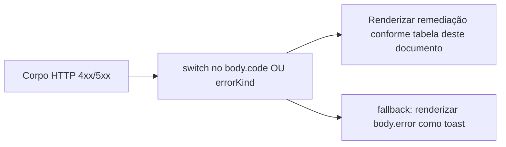
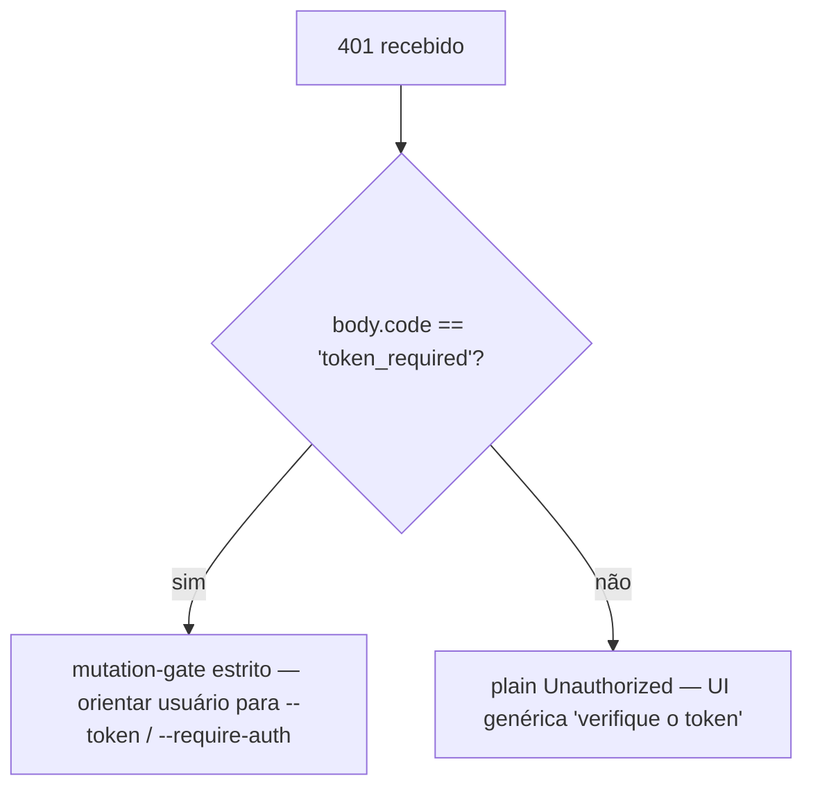

# Taxonomia de Erros e Remediação

## Visão Geral

Os modos de falha do daemon são uniões fechadas deliberadamente, para que consumidores do SDK possam alternar exaustivamente e os handlers de rota possam moldar respostas HTTP consistentes. Este documento cataloga cada classe / tipo de erro tipado em três camadas:

1. **`packages/cli/src/serve/`** — erros de fronteira na borda HTTP (autenticação, sistema de arquivos do workspace, preflight do daemon-host).
2. **`packages/acp-bridge/`** — erros de ponte / mediador na fronteira entre daemon e filho ACP.
3. **`packages/sdk-typescript/src/daemon/`** — wrapping do lado do SDK e campos de erro estruturados.

As formas de erro no nível de fio são documentadas em [`../qwen-serve-protocol.md`](../qwen-serve-protocol.md); este documento adiciona orientação de causa e remediação.

## Fronteira do sistema de arquivos (`packages/cli/src/serve/fs/errors.ts`)

`FsError` carrega `{ kind, message, status, cause? }`. União `FsErrorKind` (14 tipos, status HTTP padrão):

| Tipo                      | HTTP       | Causa                                                                        | Remediação                                                                                                                  |
| ------------------------- | ---------- | ---------------------------------------------------------------------------- | --------------------------------------------------------------------------------------------------------------------------- |
| `path_outside_workspace`  | 400        | O caminho resolvido sai do workspace vinculado.                              | Use um caminho dentro do `workspaceCwd` do daemon; verifique `/capabilities`.                                               |
| `symlink_escape`          | 400        | O alvo é um symlink.                                                         | Acesse o caminho resolvido diretamente; symlinks são rejeitados por design.                                                 |
| `path_not_found`          | 404        | `ENOENT`.                                                                    | Confirme que o arquivo existe; verifique caminhos com distinção entre maiúsculas/minúsculas no Linux.                       |
| `binary_file`             | 422        | Conteúdo detectado como binário em uma rota de texto.                        | Use `GET /file/bytes` para bytes brutos; a rota de texto recusa binários.                                                   |
| `file_too_large`          | 413        | Acima de `MAX_READ_BYTES` (256 KiB) ou `MAX_WRITE_BYTES` (5 MiB).            | Use leitura por intervalo de bytes; divida a escrita.                                                                       |
| `hash_mismatch`           | 409        | Falha no `expectedSha256` de concorrência otimista.                          | Releia o arquivo e tente novamente com o novo hash.                                                                         |
| `file_already_exists`     | 409        | `mode: 'create'` contra um arquivo existente.                                | Use `mode: 'overwrite'` ou escolha um novo caminho.                                                                         |
| `text_not_found`          | 422        | String de busca do `POST /file/edit` não encontrada no arquivo.              | Verifique novamente a string de busca; espaço em branco / incompatibilidade de codificação é a causa usual.                 |
| `ambiguous_text_match`    | 422        | Múltiplas correspondências quando apenas uma era necessária.                 | Adicione mais contexto ao redor da string de busca para torná-la única.                                                     |
| `untrusted_workspace`     | 403        | Tentativa de escrita em um workspace não confiável.                          | Marque o workspace como confiável (`Config.isTrustedFolder()`) ou use `runQwenServe` em vez de incorporação direta `createServeApp`. |
| `permission_denied`       | 403        | `EACCES` / `EPERM` no nível do SO.                                           | Ajuste as ACLs do sistema de arquivos; isso **não** é um alerta de segurança.                                               |
| `io_error`                | 503        | `ENOSPC` / `EIO` / `EBUSY` / `ETXTBSY` / `ENAMETOOLONG` / `EMFILE` / `ENFILE`. | Correção operacional no nível do host (disco cheio, exaustão de fd); página de operações, não segurança.                     |
| `internal_error`          | 500        | Erro não-errno atinge a fronteira.                                           | Abra um bug do daemon.                                                                                                      |
| `parse_error`             | 400 / 422  | Erro de parse do corpo da requisição (400) ou violação de invariante de serviço (422). | Valide o corpo da requisição; verifique a versão do SDK.                                                                    |

A distinção entre `io_error` e `permission_denied` é deliberada para que pipelines de monitoramento possam rotear com base em `errorKind`; colocar ENOSPC em `permission_denied` acionaria respondedores de segurança para um problema de `df -h`.

## Erros da Ponte (`packages/acp-bridge/src/bridgeErrors.ts`)

Classes tipadas lançadas pela ponte / mediador. A maioria carrega um status HTTP via switch do handler de rota.

| Classe                                | HTTP | Causa                                                                                 | Remediação                                                                                                                                                                      |
| ------------------------------------- | ---- | ------------------------------------------------------------------------------------- | -------------------------------------------------------------------------------------------------------------------------------------------------------------------------------- |
| `SessionNotFoundError`                | 404  | sessionId não encontrado em `byId`.                                                   | Recrie ou anexe; a sessão pode ter sido removida.                                                                                                                               |
| `WorkspaceMismatchError`              | 400  | `POST /session` `cwd` ≠ `boundWorkspace` do daemon.                                    | Omita `cwd` (usa o vinculado) ou encaminhe para um daemon vinculado ao seu `cwd`.                                                                                                |
| `SessionLimitExceededError`           | 503  | `byId.size >= maxSessions`.                                                           | Feche sessões obsoletas; aumente `--max-sessions`.                                                                                                                                     |
| `InvalidClientIdError`                | 400  | `X-Qwen-Client-Id` fora de `[A-Za-z0-9._:-]{1,128}`.                                  | Sanitize o client id.                                                                                                                                                          |
| `InvalidSessionMetadataError`         | 400  | `displayName` > 256 caracteres ou contém caracteres de controle.                      | Aparar / sanitizar.                                                                                                                                                                 |
| `InvalidSessionScopeError`            | 400  | Valor desconhecido de `sessionScope`.                                                 | Use `'single'` ou `'thread'`.                                                                                                                                                    |
| `RestoreInProgressError`              | 409  | `loadSession` / `resumeSession` concorrente.                                           | Aguarde + tente novamente.                                                                                                                                                                    |
| `WorkspaceInitConflictError`          | 409  | `POST /workspace/init` contra um arquivo existente sem `force`.                      | Passe `force: true` ou escolha outro caminho.                                                                                                                                         |
| `WorkspaceInitPathEscapeError`        | 400  | Caminho de init sai do workspace.                                                           | Use um caminho dentro de `workspaceCwd`.                                                                                                                                                |
| `WorkspaceInitSymlinkError`           | 400  | Caminho de init é um symlink.                                                               | Acesse o caminho resolvido.                                                                                                                                                       |
| `WorkspaceInitRaceError`              | 409  | Condição de corrida TOCTOU no init.                                                                  | Tente novamente.                                                                                                                                                                           |
| `McpServerNotFoundError`              | 404  | Reinicialização para um servidor desconhecido.                                                        | Verifique o nome do servidor em `/workspace/mcp`.                                                                                                                                          |
| `McpServerRestartFailedError`         | 502  | Reinicialização falhou dentro do filho ACP.                                                      | Verifique os logs do filho ACP; pode indicar um servidor MCP quebrado.                                                                                                                            |
| `InvalidPermissionOptionError`        | 400  | Voto de fio tentou injetar `CANCEL_VOTE_SENTINEL` via `optionId`.                      | Votar com `{outcome: 'cancelled'}` em vez de um `optionId`.                                                                                                                     |
| `PermissionForbiddenError`            | 403  | A política recusou o eleitor (`designated_mismatch` / `remote_not_allowed`).              | Use o client id do originador (designado), pré-registre o eleitor (consenso) ou vote via loopback (apenas local). Consulte [`04-permission-mediation.md`](./04-permission-mediation.md). |
| `CancelSentinelCollisionError`        | 500  | O agente publicou `'__cancelled__'` como um rótulo de opção legítimo.                       | Bug do agente — altere o rótulo da opção para qualquer coisa diferente do sentinela.                                                                                                         |
| `PermissionPolicyNotImplementedError` | 500  | Política solicitada não incorporada neste daemon.                                          | Atualize o daemon ou altere `policy.permissionStrategy`.                                                                                                                            |
| `BridgeChannelClosedError`            | 503  | Canal do filho ACP fechado durante a chamada.                                                    | Reconectar / tentar novamente; verifique `session_died` para a causa.                                                                                                                               |
| `BridgeTimeoutError`                  | 504  | Tempo de parede no nível da ponte excedido.                                                      | Tente novamente; investigue lentidão subjacente.                                                                                                                                          |
| `MissingCliEntryError`                | 500  | O arquivo de entrada da CLI `qwen` está faltando (definido em `status.ts`, não em `bridgeErrors.ts`). | Confirme que a instalação da CLI está completa; verifique se `packages/cli/index.ts` existe.                                                                                                  |

## Erros de configuração em tempo de inicialização (`packages/cli/src/serve/run-qwen-serve.ts`)

| Classe                      | Quando                                                                                                                                                                                                                                      | Remediação                                                                                                                                                                                      |
| ---------------------------- | ----------------------------------------------------------------------------------------------------------------------------------------------------------------------------------------------------------------------------------------- | ------------------------------------------------------------------------------------------------------------------------------------------------------------------------------------------------ |
| `InvalidPolicyConfigError` | `validatePolicyConfig()` rejeita configurações mescladas: `policy.permissionStrategy` desconhecido (validado contra `SERVE_CAPABILITY_REGISTRY.permission_mediation.modes`) ou `policy.consensusQuorum` não-inteiro-positivo. A inicialização falha explicitamente. | Corrija o campo ofensor em `settings.json`. A classe suporta `instanceof`; `runQwenServe` a usa para distinguir incompatibilidade de política de falhas de I/O de leitura de configurações, que retrocedem para valores padrão. |

## Autenticação via Fluxo de Dispositivo (`packages/cli/src/serve/auth/device-flow.ts`)

| Classe                        | Quando                                                       | Observações                                                                                                                                                                                                                                                                                                                                                                                                                                    |
| ---------------------------- | ---------------------------------------------------------- | ---------------------------------------------------------------------------------------------------------------------------------------------------------------------------------------------------------------------------------------------------------------------------------------------------------------------------------------------------------------------------------------------------------------------------------------- |
| `UpstreamDeviceFlowError`    | O IdP upstream retorna um erro estruturado durante a votação. | `oauthError` é sanitizado com `sanitizeForStderr` antes da interpolação em stderr ou dicas de auditoria (defesa CVE-2021-42574 / Trojan Source; consulte [`12-auth-security.md`](./12-auth-security.md)).                                                                                                                                                                                                                                         |
| `DeviceFlowPollTimeoutError` | O temporizador de corrida do registro dispara antes de o provedor retornar. | O código do provedor não deve lançar este tipo. Ele é exportado para testes, mas o registro protege `pollTimedOut` com a marca de tempo de execução `_isRegistryTimeout: boolean`, não `instanceof`. Um provedor que importa e lança `new DeviceFlowPollTimeoutError(ms)` ainda segue o caminho de auditoria genérico de lançamento do provedor porque `_isRegistryTimeout` padroniza para `false`; apenas a fábrica interna `makeRegistryPollTimeoutError(ms)` define a marca. |

## Tipos de erro do Daemon-host (`packages/acp-bridge/src/status.ts`)

`SERVE_ERROR_KINDS` é a enumeração fechada usada por células de diagnóstico e erros estruturados do daemon:

| Tipo                       | Significado                                                               |
| -------------------------- | ------------------------------------------------------------------------- |
| `missing_binary`           | O executável local ou entrada da CLI necessários não puderam ser resolvidos. |
| `blocked_egress`           | A sonda de rede de saída falhou.                                          |
| `auth_env_error`           | A configuração de variável de ambiente relacionada à autenticação, provedor ou gate de confiança é inválida. |
| `init_timeout`             | A etapa de inicialização do lado do daemon excedeu seu tempo de parede.       |
| `protocol_error`           | Incompatibilidade de protocolo ACP / HTTP.                                |
| `missing_file`             | Arquivo local necessário ausente.                                         |
| `parse_error`              | Erro de parse de arquivo local ou requisição.                               |
| `stat_failed`              | Falha no stat do sistema de arquivos local.                               |
| `budget_exhausted`         | A aplicação de orçamento MCP recusou descoberta ou uma entrada de servidor. |
| `mcp_budget_would_exceed`  | A reinicialização ou mutação MCP excederia o orçamento configurado.         |
| `mcp_server_spawn_failed`  | A inicialização ou reinicialização do servidor MCP falhou.                 |
| `invalid_config`           | A configuração do MCP ou daemon era inválida.                              |
| `prompt_deadline_exceeded` | O prazo do tempo de parede do prompt expirou.                              |
| `writer_idle_timeout`      | O escritor SSE não fez escritas bem-sucedidas antes de seu tempo limite ocioso. |

Estes são expostos através do `errorKind` da célula de preflight para que UIs do cliente renderizem remediação estruturada (não stacks de chamadas brutas).

## Formas de erro de autenticação

| Status | Corpo                                          | Quando                                                                                                                                      |
| ------ | --------------------------------------------- | ------------------------------------------------------------------------------------------------------------------------------------------- |
| `401`  | `{ error: 'Unauthorized' }`                   | Token bearer ausente / errado / sem esquema. Uniforme entre `cabeçalho ausente` / `esquema errado` / `token errado` para que sondagem não possa distinguir. |
| `401`  | `{ error: '...', code: 'token_required' }`    | Rota estrita de gate de mutação em um daemon loopback sem token. SDKs renderizam dica "configure --token / --require-auth".                          |
| `403`  | `{ error: 'Request denied by CORS policy' }`  | `denyBrowserOriginCors` rejeitou uma requisição com cabeçalho `Origin`.                                                                             |
| `403`  | `{ error: 'Invalid Host header' }`            | `hostAllowlist` rejeitou o cabeçalho `Host` (defesa contra rebinding de DNS).                                                                       |

Consulte [`12-auth-security.md`](./12-auth-security.md) para o modelo completo de autenticação.

## Resultados de permissão (sobrecarga de fio vs auditoria)

`PermissionResolution` tem dois tipos terminais:

- `{kind: 'option', optionId}` — um voto venceu.
- `{kind: 'cancelled', reason: 'timeout' \| 'session_closed' \| 'agent_cancelled'}` — a requisição foi cancelada. A forma no fio é única (`{outcome: 'cancelled'}`); o log de auditoria distingue timeout / session_closed / voter-cancelled / agent-cancelled em `decisionReason.type`. Esta sobrecarga é preservada deliberadamente para evitar quebrar o contrato congelado de `permission.ts`.

## Empacotamento de erros no lado do SDK

`DaemonClient` retorna erros HTTP como Promises rejeitadas com o corpo parseado como valor de rejeição. Métodos que encontram `404` para sessões desconhecidas rejeitam com `{error, sessionId}`; o SDK não os encapsula em uma classe tipada hoje. Os chamadores não devem confiar em `instanceof Error` mais `.message.includes(...)`; alterne em `err.code` ou `err.kind` do corpo.
`parseSseStream` interrompe o iterador em caso de estouro do buffer de 16 MiB (limite defensivo).

## Fluxo de trabalho

### Expor um erro ao usuário

### Distinguir modos de falha de autenticação

## Dependências

- Todas as classes de erro são exportadas de seus respectivos pacotes; consumidores do SDK podem usar `instanceof` com os tipos de `bridgeErrors.ts` quando executando no mesmo processo Node. Através da rede, utilize `body.code` / `body.kind` / `body.errorKind`.

## Ressonâncias & Limitações Conhecidas

- **`io_error` vs `permission_denied`** são distintos propositalmente. Não os confunda.
- **Os motivos do `PermissionForbiddenError` (`designated_mismatch` / `remote_not_allowed`) são sobrecarregados** entre as políticas `designated` e `consensus`; o log de auditoria os distingue precisamente, mas a forma na rede não.
- **`CancelSentinelCollisionError` indica um bug do lado do agente**, não um evento de segurança — a bridge recusa a requisição em vez de silenciosamente permitir que o sentinel corresponda a uma opção real.
- **Erros tipados do lado do SDK ainda estão em evolução.** Os chamadores devem rotear por campos do corpo em vez de confiar na identidade da classe JS através da rede.
- **`internal_error` sempre deve ser investigado.** Ele sinaliza que um construtor de `FsError` foi chamado com um tipo reservado para caminhos não-errno (erro de programador); o campo `cause` do corpo da resposta pode conter a exceção original.

## Referências

- `packages/cli/src/serve/fs/errors.ts` (`FsErrorKind`, `FsErrorStatus`)
- `packages/acp-bridge/src/bridgeErrors.ts` (todas as classes tipadas)
- `packages/acp-bridge/src/status.ts` (`SERVE_ERROR_KINDS`, `ServeErrorKind`)
- `packages/cli/src/serve/auth.ts` (corpos de autenticação)
- Referência de rede: [`../qwen-serve-protocol.md`](../qwen-serve-protocol.md).